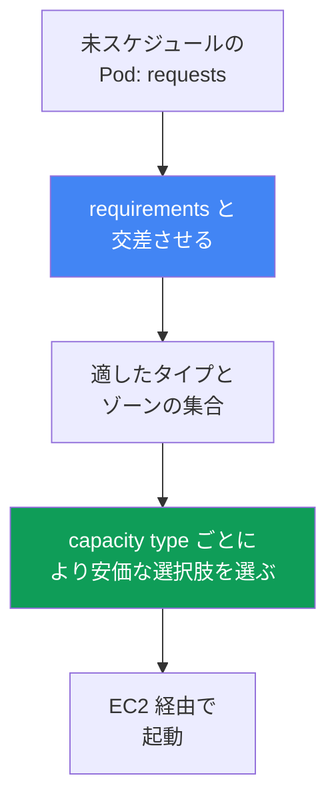
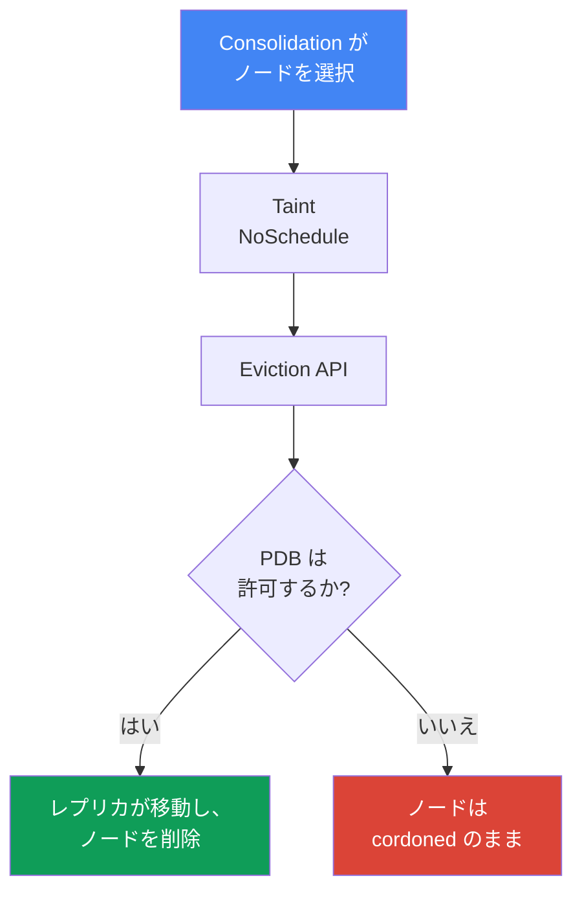

[English version](en.md) · [Versión en español](es.md) · [Version française](fr.md) · [Deutsche Version](de.md) · [ქართული ვერსია](ge.md) · [Русская версия](ru.md) · [繁體中文版](tw.md)
# 第12章 Karpenter: NodePool、EC2NodeClass、disruption、consolidation、drift

> **この後。** 第11章では、アプローチの観点から Cluster Autoscaler と Karpenter の選択、および Karpenter と Auto Mode の関係を扱いました。本章では実際の設定、すなわち `NodePool` と `EC2NodeClass` オブジェクト、Karpenter がインスタンスを選択する方法、そして最も重要な disruption、つまり consolidation、drift、StatefulSet を含むワークロードの安全な退避を扱います。Spot は第13章、AMI と bootstrap は第10章、EBS ボリュームと AZ バインディングは第23章、サイジングは第14章、クラスタのアップグレードは第38章で詳しく扱います。

## 12.1. 「consolidation により StatefulSet が停止した」と「ノードが更新されない」

Karpenter は有効化され、負荷に応じてノードを起動しており、一見すべて正常に動作しています。しかし、その後に二つのうちいずれかが発生します。どちらも同じ仕組みに起因します。

一つ目のシナリオでは、トラフィックが落ち着き、Karpenter がクラスタを集約して低利用率ノードから Pod を退避させます。そして StatefulSet のデータベースレプリカに到達し、そのレプリカがノードとともに移動して、ローカルデータを失うかクォーラムを壊します。鏡像のような二つ目のシナリオでは、CVE を修正した新しい AMI がリリースされ、ノードは更新されるべきですが、何週間も変わらず、何が置換を妨げているのかが不明瞭です。

```bash
kubectl get nodeclaims
kubectl logs -n kube-system -l app.kubernetes.io/name=karpenter | grep -i disrupt
```

どちらのケースも、Karpenter がノードを作成・削除する方法に関するものです。ノードを起動するだけでは不十分で、置換と削除によってワークロードが停止せず、永遠にスタックしないようにしなければなりません。本章ではそれを扱います。

## 12.2. NodePool: 作成されるノードの境界

`NodePool` は、Karpenter がノードを作成できる境界とそのライフサイクルのルールを記述します。少なくとも一つの `NodePool` がなければ、Karpenter は何もしません。主な部分は次のとおりです。

- `template.spec.requirements`  -  well-known labels（`karpenter.k8s.aws/instance-category`、`kubernetes.io/arch`、`topology.kubernetes.io/zone`、`karpenter.sh/capacity-type`）を通じた、許可されるインスタンスタイプ、ゾーン、アーキテクチャ、capacity type。
- `template.metadata.labels` と `template.spec.taints`  -  作成されるノードのラベルと taint。
- `template.spec.nodeClassRef`  -  `EC2NodeClass` への参照。`disruption`  -  consolidation ポリシーと budgets（12.5節）。`limits`  -  プールの上限。`weight`  -  プールの優先度（大きいほど先に考慮される）。

```yaml
apiVersion: karpenter.sh/v1
kind: NodePool
metadata:
  name: default
spec:
  template:
    spec:
      nodeClassRef:
        group: karpenter.k8s.aws
        kind: EC2NodeClass
        name: default
      requirements:
        - key: kubernetes.io/arch
          operator: In
          values: ["amd64"]
        - key: karpenter.k8s.aws/instance-category
          operator: In
          values: ["c", "m", "r"]
        - key: karpenter.sh/capacity-type
          operator: In
          values: ["spot", "on-demand"]
      expireAfter: 720h
  disruption:
    consolidationPolicy: WhenEmptyOrUnderutilized
    consolidateAfter: 1m
```

ドキュメントでは、必要以上に `requirements` を狭めないことを推奨しています。インスタンスタイプの選択肢が広いほど、Pod のパッキングは柔軟になり、Spot ワークロードの耐性も高くなります（第13章）。

## 12.3. EC2NodeClass: AWS 固有のノード設定

`EC2NodeClass` は AWS 固有の事項を記述します。すべての `NodePool` は一つのクラスを参照し、複数のプールで一つのクラスを共有できます。定義する項目は次のとおりです。

- `amiFamily`  -  イメージファミリー（`AL2023`、`Bottlerocket`、`AL2`、`Custom`）。bootstrap ロジックとデフォルトの block device mappings を決めます。イメージの詳細は第10章です。
- `amiSelectorTerms`  -  使用する AMI。`alias`（`al2023@latest`）、`id`、`name`、`tags` によって指定します（必須フィールド）。`role` または `instanceProfile`  -  ノードの IAM ID（どちらか一方）。
- `subnetSelectorTerms`、`securityGroupSelectorTerms`  -  タグまたは ID によるサブネットとセキュリティグループ（term 内の条件は AND、異なる term は OR）。
- `blockDeviceMappings`  -  ディスク。`metadataOptions`  -  IMDS。デフォルトでは `httpTokens: required`（IMDSv2）および `httpPutResponseHopLimit: 1`（ハードニングは第19章）。

```yaml
apiVersion: karpenter.k8s.aws/v1
kind: EC2NodeClass
metadata:
  name: default
spec:
  amiSelectorTerms:
    - alias: al2023@latest
  role: "KarpenterNodeRole-my-cluster"
  subnetSelectorTerms:
    - tags:
        karpenter.sh/discovery: "my-cluster"
  securityGroupSelectorTerms:
    - tags:
        karpenter.sh/discovery: "my-cluster"
  blockDeviceMappings:
    - deviceName: /dev/xvda
      ebs: {volumeSize: 50Gi, volumeType: gp3, encrypted: true}
  metadataOptions:
    httpTokens: required          # IMDSv2
    httpPutResponseHopLimit: 1
```

| 設定するもの | NodePool | EC2NodeClass |
|---|---|---|
| インスタンスタイプ、ゾーン、アーキテクチャ、capacity type | はい | いいえ |
| ノードのラベルと taint、disruption ポリシー | はい | いいえ |
| AMI、イメージファミリー、bootstrap | いいえ | はい |
| IAM ロール、サブネット、セキュリティグループ、ディスク、IMDS | いいえ | はい |

`alias: al2023@latest` については、便利ではあるものの、本番環境では推奨されません。新しい AMI が出るたびに全ノードで即座に drift が発生するためです。バージョンを固定し、意図して更新をロールアウトする方がよいでしょう（第38章）。

### Placement group: クラス全体で一つのグループ

Karpenter ノードは **placement group** 内で実行することもできます（戦略は第0.4章）。グループは事前に EC2 で作成し、クラスが名前または ID のいずれかで選択します。Karpenter のサポートは 2026年7月に追加されたため、古いコントローラバージョンではこのフィールドを利用できません。

```yaml
spec:
  placementGroupSelector:
    name: training-pg            # または id: pg-123
```

設計全体を決める性質があります。**一つの `EC2NodeClass` は正確に一つのグループに対応し**、そのすべてのインスタンスがそのグループに参加します。共有クラスのフラグだけでは不十分です。このようなワークロードには、専用の `NodePool` と `EC2NodeClass` のペアを作成し、selectors と taints で Pod をそのプールへ導きます。これは安全策にもなります。`cluster` はすべてのノードを一つのゾーンに保持するため、3ゾーンへの分散（第40章）と矛盾します。専用プールにより影響を一つのワークロードに限定できます。`cluster` では、プールの `requirements` でゾーンを固定することが最善です。固定しなければ、最初のインスタンスがゾーンを決めます。`partition` では `karpenter.k8s.aws/placement-group-partition` ラベルを利用でき、`topologySpreadConstraints` によりレプリカをパーティション間に分散できます（仕組みは第40章）。

これを機能させるには二つの要件があります。第一に、コントローラロールにはグループを検出する `ec2:DescribePlacementGroups` と、グループ内で起動する `ec2:RunInstances` および `ec2:CreateFleet` が必要です。古いポリシーのままでは、このフィールドは機能しません。第二に、ゾーンあたり稼働中インスタンスが7台という `spread` の上限（第0.4章）は、Karpenter がノードを置換する方法と相性がよくありません。Karpenter は古いノードを drain する前に、あらかじめ置換ノードを起動します（12.5節）。上限に達したグループでは置換ノードを起動できず、ノードは稼働したままになります。そのため `spread` ワークロードの AMI 更新は、自動 drift に頼るのではなく、空きスロットを確保して計画してください。

## 12.4. Karpenter がインスタンスを選択する方法

選択ロジックは事前定義されたグループではなく、Pod から始まります。Karpenter は未スケジュール Pod の `requests`、`nodeSelector`、`affinity`、`topologySpreadConstraints`、`tolerations` を読み、`NodePool` の `requirements` と交差させ、適したタイプの集合を取得します。その集合から Pod を収容でき、かつ低コストな選択肢を取ります。



複数の capacity type が許可されている場合、優先順位は固定です。`reserved`（capacity reservations）、次に `spot`、次に `on-demand` であり、キャパシティが不足すれば Karpenter は次のタイプにフォールバックします。ここから得られる原則は、広い `requirements` がよいということです。一つか二つのタイプでは選択肢がありません。Spot では中断頻度が高まり（第13章）、on-demand ではゾーン内でそのタイプのキャパシティが不足するリスクがあります。

### 複数の NodePool: どのプールが先に試行されるか

クラスタには通常複数のプールがあり、最終的には一つの Pod が二つのプールに同時に適合します。たとえば、汎用プールと前払いキャパシティ用プールがある場合です。どちらが選ばれるかは `weight` が決めます。値が大きいほど Karpenter のスケジューラが早くそのプールを考慮します。`weight` のないプールはゼロです。

```yaml
apiVersion: karpenter.sh/v1
kind: NodePool
metadata:
  name: reserved
spec:
  weight: 50            # 汎用プールの weight より高いため、先に試行される
  limits:
    cpu: "200"          # 上限に達すると、Karpenter は汎用プールへ移る
  template:
    spec:
      requirements:
        - key: node.kubernetes.io/instance-type
          operator: In
          values: ["m6i.2xlarge"]
```

これにより二つの課題を解決できます。**前払いキャパシティを先に使う**には、上限付きで高い weight の狭いプールを使い、`limits` を使い切った後は汎用プールへ処理を移します。また、selectors を持たない Pod のための**デフォルトプール**も提供します。広い requirements と高い weight により、指定のないワークロードを予測可能な設定へ配置できます。一方、専用プール（12.10節の GPU、第13章の Spot）は taints と selectors により自身のワークロードだけを受け入れます。

二つ注意点があります。プールはできるだけ**相互排他的**にし、weight はワークロードを分離する主な仕組みではなく競合を解決するために使うべきです。また、優先順位は**保証されません**。Pod はバッチで処理されるため、優先プールに収まらない Pod は低い weight のプールに配置され、そのバッチ内の近隣 Pod を連れていく可能性があります。さらに、クラスタ内に適した既存ノードがあれば、通常の `kube-scheduler` が Pod を配置するため、weight はまったく関与しません。

## 12.5. Disruption: Karpenter がノードを削除・置換する方法

Disruption は Karpenter が自発的にノードを終了する方法です。コントローラは一度に一つの手法を、厳密な順序で実行します。**最初に Drift、次に Consolidation**（加えて強制的な Expiration と Interruption）です。診断では順序が重要です。ノードが drifted でかつ低利用率なら、Karpenter はまず drift を処理します。すべての自発的手法について、ノードに `karpenter.sh/disrupted:NoSchedule` taint を付与し、事前に置換ノードを起動してから、Kubernetes Eviction API で古いノードを drain します。つまり PDB を尊重します。

**Consolidation** はコスト削減のための積極的なパッキングです。`consolidationPolicy`（検討対象のノード）と `consolidateAfter`（ノードの安定を待つ時間。Pod が追加・削除されるとタイマーはリセットされ、`Never` は consolidation を無効にする）で制御します。

| consolidationPolicy | 対象にするノード | 選択する場面 |
|---|---|---|
| `WhenEmpty` | 空のノードのみ（DaemonSet と「安価な」Pod のみ） | 最も保守的なモードが必要な場合 |
| `WhenEmptyOrUnderutilized` | 空のノードに加え低利用率ノード。削除またはより安価に置換する | 最大の節約 |

v1 の `consolidationPolicy` 値はちょうど二つです。個別の「妥協」ポリシーはありません。`WhenEmptyOrUnderutilized` では、Karpenter 自身が利点を評価し、空ノードの削除、単一ノード consolidation、複数ノード consolidation の三つの手法を適用します。置換ノードがより安価な場合にのみ、ノードを中断します。

**Drift** はノードを望ましい状態にすることです。ノードの `NodeClaim` の値が `NodePool` または `EC2NodeClass` と異なると、ノードは drift します。drift の対象フィールドは、`NodePool` の `requirements` と、`EC2NodeClass` の `subnetSelectorTerms`、`securityGroupSelectorTerms`、`amiSelectorTerms` です。最も一般的なトリガーは新しい AMI です。動作に関するフィールド（`weight`、`limits`、`disruption.*`）は drift に影響しません。

## 12.6. 退避の制御: 使用すべきものと使用すべきでないもの

ここに「ワークロードを停止させた」と「永遠にスタックした」の違いがあります。ツールは四つあります。

**PodDisruptionBudget（PDB）** は主なブレーキです。Karpenter は Eviction API によりノードを drain するため、ブロックする PDB を持つ Pod は自発的な disruption 中に退避されません。StatefulSet では `maxUnavailable: 1` が一般的です。PDB が Pod の退避を許可しない間、ノードにはすでに `karpenter.sh/disrupted:NoSchedule` taint が付き（cordoned）、削除されずに次の状態で残ります。

```bash
kubectl describe node <node> | grep -A2 Unconsolidatable
# Normal  Unconsolidatable  ...  pdb default/db-pdb prevents pod evictions
```

注意点として、Pod が複数の PDB の対象である場合、またはノードに異なる PDB の Pod がある場合、それらすべての PDB が同時に退避を許可しなければなりません。一つのブロックする PDB がノード全体を保持します。

**Pod 上の `karpenter.sh/do-not-disrupt` アノテーション**は、Pod が生存している間、ノード全体を自発的な disruption から保護します。永続的には `"true"`、Pod 起動後に一時的に保護する場合は期間（`"30m"`）を指定します。同じアノテーションは `NodeClaim` またはノードにも付与できます。

**`NodePool` の disruption budget** は disruption の速度を制限します。同時に disruption されるノードの割合または数（`nodes: "20%"` または `nodes: "5"`）を指定し、必要に応じて静かな時間帯向けにスケジュールウィンドウ（cron の `schedule` と `duration`）を設定します。デフォルトでは `nodes: 10%` の budget が適用されます。budget は `reasons` により `Drifted`、`Underutilized`、`Empty` という理由に関連付けられます。

```yaml
  disruption:
    consolidationPolicy: WhenEmptyOrUnderutilized
    budgets:
      - nodes: "20%"
      - schedule: "0 9 * * mon-fri"
        duration: 8h
        nodes: "0"
```

**`terminationGracePeriod` と `expireAfter`** は時間制限を定義します。`expireAfter`（デフォルトは `720h`）はノードの最長存続期間であり、その後ノードは強制的に drain されます。`terminationGracePeriod` は drain の期限であり、期限切れ後に残った Pod は強制的に削除されます（アプリケーションの graceful shutdown に関連）。合わせてノードの存続期間の上限を定めます。

| 仕組み | レベル | Consolidation | Drift | 強制的（expiration/interruption） |
|---|---|---|---|---|
| PDB | Pod | ブロックする | ブロックする（`terminationGracePeriod` がない場合） | いいえ |
| Pod 上の `do-not-disrupt` | Pod/ノード | ブロックする | ブロックする（`terminationGracePeriod` がない場合） | いいえ |
| disruption budget | NodePool | ブロックする | ブロックする | いいえ（expiration は budgets を無視） |
| `terminationGracePeriod` | NodePool | drain を制限する | PDB/do-not-disrupt のブロックを解除する | drain を制限する |

右端の列が重要です。強制的な手法は budgets やアノテーションで停止できません。Expiration と Interruption は直ちに drain を開始します。アプリケーションレベルで PDB を使うことでのみ影響を和らげられます。

## 12.7. consolidation 時の StatefulSet の安全な退避

12.1節のシナリオを正しく組み立てましょう。データベース StatefulSet があり、consolidation を有効にし、クォーラムを失わせてはなりません。PDB がなければレプリカは即座に退避され、クォーラムが危険にさらされます。PDB を `maxUnavailable: 1` にすると、Karpenter はレプリカを厳密に一つずつ退避し、それぞれの復旧を待ちます。しかし consolidation がレプリカを保持する複数ノードを同時に削除しようとすると、PDB が一部の退避をブロックし、ノードは cordoned のまま残ります。



ブロックされた退避はログとイベントで確認できます。

```bash
kubectl logs -n kube-system -l app.kubernetes.io/name=karpenter -f | grep -i pdb
kubectl get pdb -A
```

正しい設定は一つではなく、次の三つの部分で構成されます。

- StatefulSet の **PDB** `maxUnavailable: 1`  -  一度に一つの退避とクォーラムの維持。
- `NodePool` の **disruption budget**  -  Karpenter がレプリカを持つ全ノードに一度に触れないよう速度を制限する（`nodes: "20%"` に加え、業務時間中の静かなウィンドウ）。
- **`do-not-disrupt`**  -  中断が許容できない箇所（リーダー、マイグレーション、または長時間バッチジョブ）にのみ選択的に使い、すべてに使わない。

## 12.8. 落とし穴: 厳格な保護は consolidation だけでなく drift もブロックする

最も厄介な誤りは、12.6節の表から導かれます。PDB と `do-not-disrupt` は自発的な disruption 全体、つまり consolidation と **drift** の両方をブロックします。エンジニアが「何も触れないように」と全 Pod に `do-not-disrupt: "true"`、または `maxUnavailable: 0` の PDB を設定すると、12.1節の二つ目のシナリオ、すなわちノードが更新されない状態になります。

仕組みは次のとおりです。新しい AMI がリリースされ、古いノードは drifted とマークされます。Karpenter はそれらを置換しようとしますが、drain がブロックされます。ノードは何週間も古いイメージのままとなり、未修正の CVE が蓄積し、kubelet とコンポーネントのバージョンが遅れ、技術的負債が増大します。クラスタのアップグレード時（第38章）には、これはスタックしたノード更新になります。

解決策は `NodePool` の `terminationGracePeriod` です。これを設定すると、ブロックする PDB または `do-not-disrupt` アノテーションがあってもノードは drift し、期間の終了後に Pod は強制的に削除されます。これは重要な更新（CVE 修正を含む AMI）のための安全策です。ドキュメントでは、`do-not-disrupt` がある場合に `terminationGracePeriod` なしで `expireAfter` を設定しないよう明示的に警告しています。そうしないと、部分的に drain されたノードが永遠に残ります。適切なバランスは、必要な分だけワークロードを保護し、常に `terminationGracePeriod` を設定することです。

## 12.9. EBS ボリュームとの相互作用: ゾーンバインディング

別の落とし穴は EBS ボリュームを持つ StatefulSet に関係します。EBS ボリュームは特定の AZ に存在し、別のゾーンのインスタンスにはマウントできません。そのため PVC によってレプリカはボリュームのゾーンにバインドされます。

consolidation への影響は次のとおりです。Karpenter は集約のためだけにそのレプリカを別の AZ へ移動できません。新しいノードはボリュームと同じゾーンで起動する必要があります。そこに集約できるものがなければ、レプリカはその場に残ります。これは障害ではなく正常な動作です。ノードが置換されるとき（drift、expiration）は、新しいノードが同じ AZ で起動し、ボリュームが再アタッチされ、Pod が戻ります。

したがってトポロジーは事前に設計します。`topologySpreadConstraints` を使ってレプリカをゾーン間に分散し、`volumeBindingMode: WaitForFirstConsumer` でボリュームを作成して、選択されたノードのゾーンでプロビジョニングされるようにします。StorageClass の仕組みと `allowedTopologies` は第23章で扱います。

## 12.10. GPU と AI ワークロード: アクセラレータ専用 NodePool

GPU インスタンス（`g5`、`p4d`、`p5`）は高価で希少であり、通常の Pod を配置する場所ではありません。手法は他の場合と同じです。GPU ファミリーに絞った `requirements` と taint を備えた専用 `NodePool` を用意し、本当に GPU を必要とする Pod だけがノードを使用するようにします。

```yaml
apiVersion: karpenter.sh/v1
kind: NodePool
metadata: {name: gpu}
spec:
  template:
    spec:
      nodeClassRef: {group: karpenter.k8s.aws, kind: EC2NodeClass, name: gpu}
      requirements:
        - key: karpenter.k8s.aws/instance-family
          operator: In
          values: ["g5", "p4d", "p5"]
      taints:
        - key: nvidia.com/gpu
          effect: NoSchedule
```

Toleration のない Pod はこのようなノードにスケジュールできません。GPU Pod は taint を許容し、明示的にリソースを要求します。

```yaml
  tolerations:
    - {key: nvidia.com/gpu, operator: Exists, effect: NoSchedule}
  containers:
    - name: train
      resources:
        limits: {nvidia.com/gpu: 1}
```

NVIDIA device plugin は、GPU ノード上の DaemonSet として `nvidia.com/gpu` リソースを公開します（EKS 最適化 GPU AMI 上、または別のアドオンとして。Auto Mode には組み込まれています。第11章）。プラグインが起動するまで、スケジューラは GPU を認識できません。Karpenter は `nvidia.com/gpu` の `requests` を持つ pending Pod を検知し、このプールから GPU ノードを起動します。

希少な GPU キャパシティが保証されたトレーニング Pod は、EC2 Capacity Blocks for ML（第0.4章）と関連付けられます。Karpenter は `EC2NodeClass` の `capacityReservationSelectorTerms` を通じて予約済みキャパシティを使用し、`reserved` は capacity-type の優先順位で最初です（12.4節）。分散トレーニングでは、同じクラスに `cluster` 戦略の placement group を追加します（12.3節）。ノードが一つのゾーン内で近接して配置され、それらの間のレイテンシーを最小化します。
## 12.11. 運用: 監視とよくあるエラー

Karpenter が想定どおりに動作しないとき、稼働中クラスタで確認するものは次のとおりです。

```bash
kubectl get nodepools
kubectl get ec2nodeclasses
kubectl get nodeclaims
kubectl logs -n kube-system -l app.kubernetes.io/name=karpenter -f
kubectl describe node <node>            # Unconsolidatable イベント
```

`NodeClaim` は特定のノードに対する Karpenter のリクエストです。`NodePool -> NodeClaim -> Node` のチェーンは、そのノードがどのプールのものかを示します。Karpenter はダッシュボード用に consolidation メトリクスを含む Prometheus メトリクスをエクスポートします（第33章）。よくあるエラーは次のとおりです。

- **ノードが consolidation されない**  -  理由が `pdb ... prevents pod evictions`（ブロックする PDB）または `can't replace with a lower-priced node`（より安価な置換先がない）の `Unconsolidatable` イベント。
- **ノードが更新されない（drift がスタックしている）**  -  `terminationGracePeriod` のない厳格な PDB または `do-not-disrupt`（12.8節）。
- **`EC2NodeClass` が Ready でない**  -  サブネット、セキュリティグループ、または AMI を見つけられません。`status.conditions` を確認してください。クラスが Ready になるまで、それを参照するプールはスケジューリングに参加しません。
- **Requirements が狭すぎる**  -  インスタンスタイプを選択できず、Pod は `Pending` のままです。

## 12.12. 本番環境での使い方

- 必要な場合だけ絞り込んで、**`requirements` を広く保つ**。これによりインスタンス選択肢が増え、パッキングが高密度になり、Spot の耐性が高まります（第13章）。
- 本番環境では `@latest` ではなく **AMI バージョンを固定する**。制御された drift により、意図して更新をロールアウトします（第38章）。
- **StatefulSet を PDB と disruption budget で保護する**。PDB は一度に一つの退避を実現し、budget は速度を制限して静かなウィンドウを定義します。
- `do-not-disrupt` または厳格な PDB がある場合は、**常に `terminationGracePeriod` を設定する**。drift と更新がスタックしないための安全策です。
- **`do-not-disrupt` は選択的に使う**。名前空間全体ではなく、特定の重要な Pod に設定します。
- **AZ トポロジーを事前に設計する**。consolidation は EBS ボリュームをゾーン間で移動しないことを理解してください。

## 12.13. ミニ用語集

- **NodePool**  -  ノードの境界、すなわち `requirements`、`limits`、`weight`、ラベル/taint、disruption ポリシーを定義する CRD（`karpenter.sh/v1`）。
- **EC2NodeClass**  -  AMI、IAM ロール、サブネットとセキュリティグループ、ディスク、IMDS という AWS 設定を持つ CRD（`karpenter.k8s.aws/v1`）。
- **NodeClaim**  -  特定ノードに対する Karpenter のリクエスト。`NodePool` と実際の `Node` を結び付けます。
- **Consolidation**  -  コスト削減のための自発的なパッキング。`WhenEmpty` と `WhenEmptyOrUnderutilized` ポリシー、空/単一/複数ノードの手法、および `consolidateAfter` パラメータがあります。
- **Drift**  -  ノードが望ましい状態から乖離すること（新しい AMI、変更された selectors、または `requirements`）。consolidation より前に実行されます。
- **Disruption budget**  -  自発的 disruption の速度制限。ノードの割合/数、`schedule` と `duration` のウィンドウ、および `reasons` との関連付けです。
- **`terminationGracePeriod`**  -  ノード drain の期限。これがある場合、ブロックする PDB や `do-not-disrupt` があっても drift は進行します。
- **`placementGroupSelector`**  -  名前または ID により placement group を選択する `EC2NodeClass` フィールド。一つのクラスには正確に一つのグループがあるため、このようなワークロードは専用の `NodePool` と `EC2NodeClass` のペアに置かれます。

## 12.14. 章のまとめ

- `NodePool` はノードの境界を定義し、`EC2NodeClass` は AWS 固有の設定（AMI、ロール、サブネット、セキュリティグループ、ディスク、IMDS）を定義します。複数のプールで一つのクラスを共有できます。
- Karpenter は Pod からインスタンスを選択します。requests と `requirements` を交差させ、より安価な選択肢を選びます。capacity-type の優先順位は `reserved`、`spot`、`on-demand` です。
- Disruption は一度に一つの手法を実行します。最初に Drift、次に Consolidation（加えて強制的な Expiration と Interruption）です。Consolidation は `consolidationPolicy` と `consolidateAfter` で制御します。
- PDB（主なブレーキ）、`do-not-disrupt`（ノード全体を保護）、disruption budgets（速度とウィンドウ）は退避を遅らせます。強制的な手法はこれらの仕組みでは停止できません。
- StatefulSet は PDB、disruption budget、選択的な `do-not-disrupt` により安全に退避します。ブロックされた退避は cordoned ノードと `Unconsolidatable` イベントとして現れます。
- 過度に厳格な保護は consolidation だけでなく drift もブロックします。ノードは更新されず、CVE が蓄積します。安全策は `terminationGracePeriod` です。
- EBS ボリュームはゾーンにバインドされるため、consolidation は StatefulSet レプリカを AZ 間で移動しません（第23章）。

## 12.15. 実務での役立ち方

オンコール中は、12.1節の両方の症状をすばやく診断できます。「ノードが cordoned のままで削除されない」場合は、`kubectl describe node` で `Unconsolidatable` イベントを、`kubectl get pdb` で PDB を確認します。ほとんどの場合、PDB または `do-not-disrupt` アノテーションがブロックしています。「新しい AMI の後にノードが更新されない」場合も、drift 側で同じ根本原因です。`terminationGracePeriod` のない包括的な保護を確認してください。設計時には、本章は二つの極端な状態を防ぎます。PDB のない StatefulSet（consolidation がワークロードを停止させる）と、包括的な `do-not-disrupt`（drift が停止する）です。中間の適切な対策は、すべての重要ワークロードに PDB を設定し、静かなウィンドウを含む disruption budget と、安全策としての `terminationGracePeriod` を使用することです。

## 12.16. 自己確認の質問

1. `NodePool` は何を記述し、`EC2NodeClass` は何を記述しますか。なぜ二つのオブジェクトに分けられたのですか。
2. Karpenter はどのようにインスタンスタイプを選択しますか。また、狭い `requirements` より広いものが望ましいのはなぜですか。
3. 一つの Pod が二つの `NodePool` オブジェクトに適合します。`weight` は何を決め、なぜ厳格なワークロード分離ルールとして頼れないのですか。
4. disruption 手法はどの順序で実行され、診断においてそれが重要なのはなぜですか。
5. `WhenEmpty` と `WhenEmptyOrUnderutilized` はどのように異なり、consolidation はどの手法を使いますか。`consolidateAfter` は何をしますか。
6. drift とは何ですか。どの変更が引き起こし、どのフィールドは影響しませんか。
7. PDB はどのように退避を遅らせ、PDB が Pod の退避を許可しないときノードはどうなりますか。
8. `karpenter.sh/do-not-disrupt` は何を保護し、どのレベルで機能しますか。
9. disruption budgets はどのように機能し、expiration または interruption を停止できますか。
10. consolidation 中に StatefulSet を安全に退避するにはどうしますか。設定はどの部分で構成されますか。
11. 厳格な保護が consolidation だけでなく drift もブロックするのはなぜですか。また、なぜ危険ですか。
12. `terminationGracePeriod` はどのようにブロックを解除しますか。また、なぜ consolidation は EBS ボリュームを別の AZ に移動しないのですか。
13. なぜ placement group のワークロードは共有クラスでグループを有効にするのではなく、専用の `NodePool` と `EC2NodeClass` のペアに移すのですか。

## 演習

このトピックのコースラボは、[ラボ123  -  Karpenter: NodePool、consolidation、drift、および StatefulSet の安全な退避](../../labs/123/README_JP.MD)です。Karpenter は、ゾーンボリュームの文脈で[ラボ106  -  EBS CSI: gp3、AZ バインディング、拡張、スナップショット](../../labs/106/README_JP.MD)でも扱います。さらに、稼働中クラスタで Karpenter の設定を確認できます（Auto Mode 内を含む、第11章）。まずインベントリから始めます。`kubectl get nodepools`、`kubectl get ec2nodeclasses`、`kubectl get nodeclaims` を実行してください。`NodePool` の `spec.disruption` ブロックを確認し、使用している `consolidationPolicy` と、`budgets` および `terminationGracePeriod` の有無を確認します。

次に、クラスタに害を与えずに 12.7節と12.8節の診断を進めます。StatefulSet を見つけ、`kubectl get pdb -A` を実行します。PDB はあり、`maxUnavailable` には何が設定されていますか。`kubectl logs -n kube-system -l app.kubernetes.io/name=karpenter` とノードイベントで `Unconsolidatable` を確認します。また、リポジトリ内の以前の Karpenter ラボ（[Karpenter](../../labs/02/README_RUS.MD)）も確認してください。コースの一部ではありませんが、テーマは重複しています。

---
[目次](../README_JP.md) · [第11章](../11/jp.md) · [第13章](../13/jp.md)
