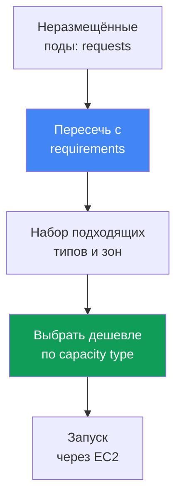
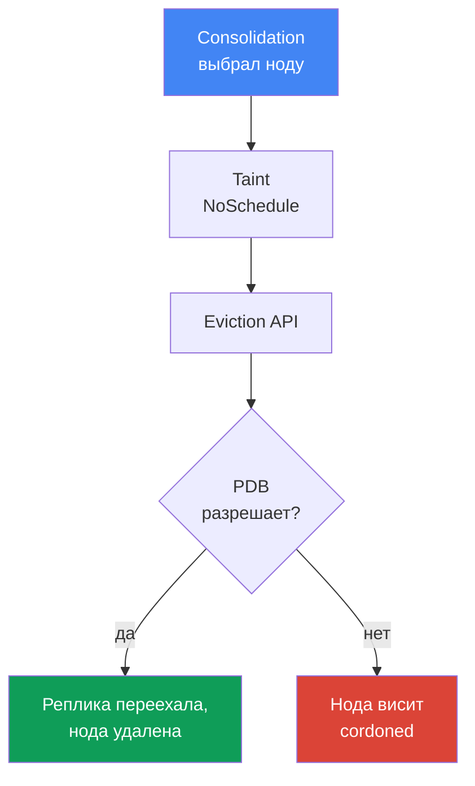

# Глава 12. Karpenter: NodePool, EC2NodeClass, disruption, consolidation, drift

> **Что дальше.** В главе 11 разобрали выбор между Cluster Autoscaler и Karpenter на уровне
> подхода и связь Karpenter с Auto Mode. Здесь - предметная конфигурация: объекты `NodePool` и
> `EC2NodeClass`, как Karpenter выбирает инстанс, и главное - disruption: consolidation, drift
> и безопасное выселение нагрузок, включая StatefulSet. Spot предметно - глава 13, AMI и
> bootstrap - глава 10, тома EBS и привязка к AZ - глава 23, сайзинг - глава 14, апгрейд
> кластера - глава 38.

## 12.1. «Консолидация уронила StatefulSet» и «ноды не обновляются»

Karpenter включён, ноды поднимаются под нагрузку - на первый взгляд всё работает. А потом
происходит одно из двух, и оба раза виноват один и тот же механизм.

Сценарий первый: трафик спал, Karpenter уплотняет кластер и выселяет поды с недозагруженных
нод. Доходит до реплики базы из StatefulSet - и та переезжает вместе с нодой, теряя локальные
данные или разрывая кворум. Сценарий второй, зеркальный: вышел новый AMI с закрытыми CVE, ноды
должны обновиться - но не меняются неделями, а что блокирует замену - неочевидно.

```bash
kubectl get nodeclaims
kubectl logs -n kube-system -l app.kubernetes.io/name=karpenter | grep -i disrupt
```

Оба случая - про то, как Karpenter создаёт и убирает ноды: поднять ноду мало, нужно, чтобы её
замена и удаление не роняли нагрузку и не застревали навсегда. Об этом глава.

## 12.2. NodePool: рамки для создаваемых нод

`NodePool` описывает границы, в которых Karpenter волен создавать ноды, и правила их жизненного
цикла. Без хотя бы одного `NodePool` Karpenter не делает ничего. Ключевые части:

- `template.spec.requirements` - разрешённые типы, зоны, архитектуры, capacity type через
  well-known labels (`karpenter.k8s.aws/instance-category`, `kubernetes.io/arch`,
  `topology.kubernetes.io/zone`, `karpenter.sh/capacity-type`).
- `template.metadata.labels` и `template.spec.taints` - метки и taint для создаваемых нод.
- `template.spec.nodeClassRef` - ссылка на `EC2NodeClass`; `disruption` - политика уплотнения и
  бюджеты (раздел 12.5); `limits` - потолок пула; `weight` - приоритет пула (выше вес -
  раньше).

```yaml
apiVersion: karpenter.sh/v1
kind: NodePool
metadata:
  name: default
spec:
  template:
    spec:
      nodeClassRef:
        group: karpenter.k8s.aws
        kind: EC2NodeClass
        name: default
      requirements:
        - key: kubernetes.io/arch
          operator: In
          values: ["amd64"]
        - key: karpenter.k8s.aws/instance-category
          operator: In
          values: ["c", "m", "r"]
        - key: karpenter.sh/capacity-type
          operator: In
          values: ["spot", "on-demand"]
      expireAfter: 720h
  disruption:
    consolidationPolicy: WhenEmptyOrUnderutilized
    consolidateAfter: 1m
```

Рекомендация документации: не сужать `requirements` больше необходимого. Чем шире набор типов,
тем гибче укладка подов и тем устойчивее spot-нагрузки (глава 13).

## 12.3. EC2NodeClass: AWS-специфика ноды

`EC2NodeClass` описывает то, что относится именно к AWS. Каждый `NodePool` ссылается на один
класс; несколько пулов могут делить один класс. Что задаётся:

- `amiFamily` - семейство образа (`AL2023`, `Bottlerocket`, `AL2`, `Custom`): логика bootstrap
  и дефолтные block device mappings; детали образов - глава 10.
- `amiSelectorTerms` - какие AMI брать: по `alias` (`al2023@latest`), `id`, `name`, `tags`
  (обязательное поле). `role` или `instanceProfile` - IAM-идентичность ноды (одно из двух).
- `subnetSelectorTerms`, `securityGroupSelectorTerms` - подсети и SG по тегам или id (внутри
  term условия по AND, разные terms по OR).
- `blockDeviceMappings` - диски; `metadataOptions` - IMDS, по умолчанию `httpTokens: required`
  (IMDSv2) и `httpPutResponseHopLimit: 1` (харденинг - глава 19).

```yaml
apiVersion: karpenter.k8s.aws/v1
kind: EC2NodeClass
metadata:
  name: default
spec:
  amiSelectorTerms:
    - alias: al2023@latest
  role: "KarpenterNodeRole-my-cluster"
  subnetSelectorTerms:
    - tags:
        karpenter.sh/discovery: "my-cluster"
  securityGroupSelectorTerms:
    - tags:
        karpenter.sh/discovery: "my-cluster"
  blockDeviceMappings:
    - deviceName: /dev/xvda
      ebs: {volumeSize: 50Gi, volumeType: gp3, encrypted: true}
  metadataOptions:
    httpTokens: required          # IMDSv2
    httpPutResponseHopLimit: 1
```

| Что настраивается | NodePool | EC2NodeClass |
|---|---|---|
| Типы, зоны, архитектуры, capacity type | да | нет |
| Labels и taints нод, политика disruption | да | нет |
| AMI, семейство образа, bootstrap | нет | да |
| IAM-роль, подсети, SG, диски, IMDS | нет | да |

Про `alias: al2023@latest`: удобно, но для продакшена не рекомендуется - новый AMI сразу
поднимет drift на всех нодах. Лучше пинить версию и катить обновление осознанно (глава 38).

### Placement group: одна группа на весь класс

Ноды Karpenter тоже можно запускать в **placement group** (стратегии - глава 0.4). Группу
создают заранее в EC2, а класс её выбирает - по имени или по id, одно из двух; поддержка в
Karpenter появилась в июле 2026, на более старых версиях контроллера поля нет.

```yaml
spec:
  placementGroupSelector:
    name: training-pg            # либо id: pg-123
```

Свойство, определяющее всю схему: **один `EC2NodeClass` отображается ровно на одну группу**, и
все его инстансы попадают в неё. Флагом на общем классе тут не отделаешься - под такую нагрузку
заводят отдельную пару `NodePool` плюс `EC2NodeClass`, а поды направляют в пул селекторами и
taints. Это же и предохранитель: `cluster` держит все ноды в одной зоне, что противоречит
раскладке по трём зонам (глава 40), и отдельный пул ограничивает эффект одной нагрузкой. Зону
при `cluster` лучше зафиксировать в `requirements` пула, иначе её закрепит первый инстанс.
У `partition` доступна метка `karpenter.k8s.aws/placement-group-partition`, по которой реплики
разводят между партициями через `topologySpreadConstraints` (механика - глава 40).

Две вещи, без которых это не заработает. Первая: роли контроллера нужны права
`ec2:DescribePlacementGroups` для обнаружения группы и `ec2:RunInstances` с `ec2:CreateFleet`
для запуска в неё - на старой политике поле останется мёртвым. Вторая: потолок `spread` в 7
работающих инстансов на зону (глава 0.4) плохо сочетается с тем, как Karpenter заменяет ноды -
замену он поднимает заранее, до слива старой (раздел 12.5). На упёршейся в потолок группе
замена не запустится, и нода останется работать, поэтому обновление AMI для нагрузки в `spread`
планируют с запасом слотов, а не рассчитывают на автоматический drift.

## 12.4. Как Karpenter выбирает инстанс

Логика подбора идёт от подов, а не от заранее нарезанных групп. Karpenter читает у
неразмещённых подов `requests`, `nodeSelector`, `affinity`, `topologySpreadConstraints`,
`tolerations`, пересекает их с `requirements` из `NodePool` и получает набор подходящих типов,
из которого берёт вариант, что вмещает поды и обходится дешевле.



Если разрешено несколько capacity type, приоритет фиксированный: `reserved` (capacity
reservations), затем `spot`, затем `on-demand`; при нехватке ёмкости Karpenter откатывается на
следующий тип. Отсюда правило: широкий `requirements` - это хорошо. Один-два типа не оставляют
выбора: под spot растёт частота прерываний (глава 13), под on-demand - риск нехватки ёмкости
типа в зоне.

### Несколько NodePool: какой пул пробуется первым

Пулов в кластере обычно больше одного, и рано или поздно под подходит сразу двум: например,
есть общий пул и пул на оплаченную заранее ёмкость. Кто победит, решает `weight`: чем он выше,
тем раньше пул рассматривается планировщиком Karpenter; пул без `weight` идёт как ноль.

```yaml
apiVersion: karpenter.sh/v1
kind: NodePool
metadata:
  name: reserved
spec:
  weight: 50            # выше веса общего пула, поэтому пробуется первым
  limits:
    cpu: "200"          # лимит исчерпан - Karpenter уходит в общий пул
  template:
    spec:
      requirements:
        - key: node.kubernetes.io/instance-type
          operator: In
          values: ["m6i.2xlarge"]
```

Так решают две задачи. **Оплаченная ёмкость расходуется первой**: узкий пул с лимитом и
высоким весом, а после исчерпания `limits` работа уходит в общий пул. И **пул по умолчанию**
для подов без селекторов: широкие требования плюс высокий вес, чтобы безадресное садилось на
предсказуемую конфигурацию, а специализированные пулы (GPU из 12.10, spot из главы 13)
забирали только своё по taints и селекторам.

Две оговорки. Пулы лучше делать **взаимоисключающими**, а вес держать разрешением спора, а не
основным механизмом разведения нагрузок. И приоритет **не гарантирован**: поды обрабатываются
пачками, поэтому не поместившийся в приоритетный пул под может уехать в пул с меньшим весом и
потянуть за собой соседей из своей пачки; а если подходящая нода в кластере уже есть, поды
разместит обычный `kube-scheduler`, и вес не участвует вовсе.

## 12.5. Disruption: как Karpenter убирает и заменяет ноды

Disruption - это то, как Karpenter добровольно прекращает работу нод. Контроллер выполняет по
одному методу за раз и в строгом порядке: **сначала Drift, потом Consolidation** (плюс
форсированные Expiration и Interruption). Порядок важен для диагностики: если нода и дрейфует,
и недозагружена, Karpenter сперва займётся дрейфом. При любом добровольном методе он ставит на
ноду taint `karpenter.sh/disrupted:NoSchedule`, заранее поднимает замену и лишь потом дренирует
старую ноду через Kubernetes Eviction API - то есть с уважением к PDB.

**Consolidation** - активное уплотнение ради стоимости. Управляется `consolidationPolicy`
(какие ноды рассматривать) и `consolidateAfter` (сколько ждать стабильности ноды; таймер
сбрасывается при добавлении или удалении пода; `Never` отключает consolidation).

| consolidationPolicy | Какие ноды трогает | Когда выбирать |
|---|---|---|
| `WhenEmpty` | только пустые (лишь DaemonSet и «дешёвые» поды) | нужен самый бережный режим |
| `WhenEmptyOrUnderutilized` | пустые плюс недозагруженные: убрать или заменить дешевле | максимальная экономия |

Значений `consolidationPolicy` в v1 ровно два. «Компромиссного» режима как отдельной политики
нет: при `WhenEmptyOrUnderutilized` Karpenter сам взвешивает выгоду и применяет три метода -
удаление пустых нод, single-node и multi-node consolidation, - прерывая ноду, только если
замена дешевле.

**Drift** - приведение ноды к желаемому состоянию: нода дрейфует, если значения в её
`NodeClaim` разошлись с `NodePool` или `EC2NodeClass`. Drift-поля: `requirements` в `NodePool`
и `subnetSelectorTerms`, `securityGroupSelectorTerms`, `amiSelectorTerms` в `EC2NodeClass`.
Самый частый триггер - новый AMI. Поведенческие поля (`weight`, `limits`, `disruption.*`) на
drift не влияют.

## 12.6. Контроль выселения: чем тормозить и чем нет

Здесь живёт разница между «уронили нагрузку» и «застряли навсегда». Инструментов четыре.

**PodDisruptionBudget (PDB)** - основной тормоз. Karpenter дренирует ноду через Eviction API,
поэтому под с блокирующим PDB не будет вытеснен при добровольном прерывании. Для StatefulSet
типично `maxUnavailable: 1`. Пока PDB не даёт вытеснить под, нода уже помечена taint
`karpenter.sh/disrupted:NoSchedule` (cordoned), но не удаляется - висит в этом состоянии:

```bash
kubectl describe node <node> | grep -A2 Unconsolidatable
# Normal  Unconsolidatable  ...  pdb default/db-pdb prevents pod evictions
```

Тонкость: если под попадает под несколько PDB или на ноде поды из разных PDB, все эти PDB
должны одновременно разрешать вытеснение. Один блокирующий PDB держит всю ноду.

**Аннотация `karpenter.sh/do-not-disrupt` на поде** защищает всю ноду от добровольного
прерывания, пока под жив: `"true"` - постоянно, длительность (`"30m"`) - временно после старта
пода. Ту же аннотацию можно повесить на `NodeClaim` или ноду.

**Disruption budgets в `NodePool`** ограничивают темп прерываний: доля или число одновременно
прерываемых нод (`nodes: "20%"` или `nodes: "5"`), опционально с окном по расписанию
(`schedule` в cron плюс `duration`) для тихих часов. По умолчанию действует бюджет
`nodes: 10%`. Бюджет привязывается к причине через `reasons`: `Drifted`, `Underutilized`,
`Empty`.

```yaml
  disruption:
    consolidationPolicy: WhenEmptyOrUnderutilized
    budgets:
      - nodes: "20%"
      - schedule: "0 9 * * mon-fri"
        duration: 8h
        nodes: "0"
```

**`terminationGracePeriod` и `expireAfter`** задают временные рамки. `expireAfter` (по
умолчанию `720h`) - максимальный срок жизни ноды, после которого она форсированно дренируется.
`terminationGracePeriod` - предел дренажа: по его истечении оставшиеся поды удаляются
принудительно (связь с graceful shutdown приложения). Вместе они задают потолок жизни ноды.

| Механизм | Уровень | Consolidation | Drift | Forceful (expiration/interruption) |
|---|---|---|---|---|
| PDB | под | тормозит | тормозит (без `terminationGracePeriod`) | нет |
| `do-not-disrupt` на поде | под/нода | тормозит | тормозит (без `terminationGracePeriod`) | нет |
| disruption budget | NodePool | тормозит | тормозит | нет (expiration игнорирует бюджеты) |
| `terminationGracePeriod` | NodePool | ограничивает дренаж | снимает блок PDB/do-not-disrupt | ограничивает дренаж |

Правая колонка критична: forceful-методы бюджетами и аннотациями не остановить. Expiration и
Interruption начинают дренаж сразу; их можно только сгладить через PDB на уровне приложения.

## 12.7. Безопасное выселение StatefulSet при консолидации

Соберём сценарий из 12.1 правильно: StatefulSet базы данных, консолидация включена, уплотнение
не должно ронять кворум. Без PDB реплика выселяется немедленно - кворум под угрозой. С PDB
`maxUnavailable: 1` Karpenter вытесняет реплики строго по одной, дожидаясь восстановления
каждой. Но если консолидация захочет убрать сразу несколько нод с репликами, PDB заблокирует
часть вытеснений, и ноды повиснут cordoned.



Заблокированное выселение видно в логах и событиях:

```bash
kubectl logs -n kube-system -l app.kubernetes.io/name=karpenter -f | grep -i pdb
kubectl get pdb -A
```

Корректная конфигурация складывается из трёх частей, а не одной:

- **PDB** `maxUnavailable: 1` на StatefulSet - поштучное выселение и сохранность кворума;
- **disruption budget** в `NodePool` - ограничивает темп, чтобы Karpenter не тронул сразу все
  ноды с репликами (`nodes: "20%"` плюс тихое окно на рабочие часы);
- **`do-not-disrupt`** - точечно, только там, где прерывание недопустимо (лидер, миграция,
  длинная batch-задача), а не на всём подряд.

## 12.8. Ловушка: строгая защита блокирует не только consolidation, но и drift

Самая коварная ошибка вытекает из таблицы 12.6. PDB и `do-not-disrupt` тормозят добровольные
прерывания целиком - и consolidation, и **drift**. Инженер ставит `do-not-disrupt: "true"` на
все поды или PDB `maxUnavailable: 0`, чтобы «ничего не трогалось», - и получает второй сценарий
из 12.1: ноды не обновляются.

Логика такая: вышел новый AMI, старые ноды помечены drifted, Karpenter хочет их заменить, но
дренаж блокируется. Ноды остаются на старом образе неделями: копятся незакрытые CVE, отстают
версии kubelet и компонентов, растёт долг. При апгрейде кластера (глава 38) это выливается в
застрявшее обновление нод.

Выход - `terminationGracePeriod` на `NodePool`: когда он задан, нода дрейфует даже при
блокирующих PDB или аннотации `do-not-disrupt`, по истечении периода поды удаляются
принудительно. Это предохранитель для критичных обновлений (AMI с исправлением CVE).
Документация прямо предупреждает: не задавать `expireAfter` без `terminationGracePeriod` при
наличии `do-not-disrupt`, иначе получите частично продренированные ноды, висящие вечно. Баланс:
защищать нагрузку ровно настолько, насколько нужно, и всегда ставить `terminationGracePeriod`.

## 12.9. Взаимодействие с томами EBS: привязка к зоне

Отдельная ловушка касается StatefulSet с томами EBS. Том EBS живёт в конкретной AZ и не
монтируется к инстансу в другой зоне, поэтому реплика через свой PVC привязана к зоне тома.

Следствие для consolidation: Karpenter не может перенести такую реплику в другую AZ ради
уплотнения - новая нода обязана подняться в той же зоне, где лежит том. Если уплотнять там
нечего, реплика остаётся на месте - это норма, а не сбой. При замене ноды (drift, expiration)
новая поднимается в той же AZ, том переприсоединяется, под возвращается.

Отсюда практика: топологию закладывают заранее - разносят реплики по зонам через
`topologySpreadConstraints`, а тома создают с `volumeBindingMode: WaitForFirstConsumer`, чтобы
провижининг шёл в зону выбранной ноды. Механика StorageClass и `allowedTopologies` - глава 23.

## 12.10. GPU и AI-нагрузки: отдельный NodePool под ускорители

GPU-инстансы (`g5`, `p4d`, `p5`) дороги и дефицитны, обычным подам там делать нечего. Приём тот
же, что везде: отдельный `NodePool` с узким `requirements` по GPU-семейству плюс taint, чтобы
ноду занимали только поды, которым GPU действительно нужен.

```yaml
apiVersion: karpenter.sh/v1
kind: NodePool
metadata: {name: gpu}
spec:
  template:
    spec:
      nodeClassRef: {group: karpenter.k8s.aws, kind: EC2NodeClass, name: gpu}
      requirements:
        - key: karpenter.k8s.aws/instance-family
          operator: In
          values: ["g5", "p4d", "p5"]
      taints:
        - key: nvidia.com/gpu
          effect: NoSchedule
```

Под без toleration на такой ноде не разместится; GPU-под терпит taint и явно просит ресурс:

```yaml
  tolerations:
    - {key: nvidia.com/gpu, operator: Exists, effect: NoSchedule}
  containers:
    - name: train
      resources:
        limits: {nvidia.com/gpu: 1}
```

Ресурс `nvidia.com/gpu` публикует NVIDIA device plugin - DaemonSet на GPU-нодах (на
EKS-оптимизированном GPU AMI или отдельным аддоном; в Auto Mode встроен, глава 11). Пока плагин
не поднялся, GPU планировщику не виден. Karpenter замечает pending-под с `requests` на
`nvidia.com/gpu` и поднимает под него GPU-ноду из этого пула.

Под обучение с гарантией дефицитной ёмкости GPU связывают с EC2 Capacity Blocks for ML (глава
0.4): зарезервированную ёмкость Karpenter берёт через `capacityReservationSelectorTerms` в
`EC2NodeClass`, при этом `reserved` идёт первым в приоритете capacity type (раздел 12.4). Для
распределённого обучения к этому добавляют placement group со стратегией `cluster` в том же
классе (раздел 12.3): ноды встают рядом внутри одной зоны, и задержка между ними минимальна.

## 12.11. Эксплуатация: наблюдение и типовые ошибки

Что смотреть на живом кластере, когда Karpenter ведёт себя не так, как ожидалось:

```bash
kubectl get nodepools
kubectl get ec2nodeclasses
kubectl get nodeclaims
kubectl logs -n kube-system -l app.kubernetes.io/name=karpenter -f
kubectl describe node <node>            # события Unconsolidatable
```

`NodeClaim` - заявка Karpenter на конкретную ноду; связка `NodePool -> NodeClaim -> Node`
показывает, чья это нода. Karpenter экспортирует метрики Prometheus (в том числе по
consolidation) для дашбордов (глава 33). Типовые ошибки:

- **Ноды не консолидируются** - событие `Unconsolidatable` с причиной
  `pdb ... prevents pod evictions` (блокирующий PDB) или
  `can't replace with a lower-priced node` (дешевле некуда).
- **Ноды не обновляются (drift застрял)** - строгие PDB или `do-not-disrupt` без
  `terminationGracePeriod` (раздел 12.8).
- **`EC2NodeClass` not Ready** - не находятся подсети, SG или AMI; смотреть
  `status.conditions`. Пока класс не Ready, ссылающиеся пулы не участвуют в планировании.
- **Слишком узкий `requirements`** - тип не подобрать, поды висят в `Pending`.

## 12.12. Как это применяют в продакшене

- **`requirements` держат широким**, сужая только по необходимости: выбор типов, плотная
  укладка, устойчивость spot (глава 13).
- **Версию AMI пинят**, а не `@latest` в проде: обновление катят осознанно через контролируемый
  drift (глава 38).
- **StatefulSet защищают связкой PDB плюс disruption budget**: PDB даёт поштучное выселение,
  бюджет ограничивает темп и задаёт тихие окна.
- **`terminationGracePeriod` ставят всегда**, если есть `do-not-disrupt` или строгие PDB - как
  предохранитель, чтобы drift и обновления не застревали.
- **`do-not-disrupt` применяют точечно** - на конкретные критичные поды, а не на весь
  namespace.
- **Топологию по AZ закладывают заранее**, понимая, что консолидация не переносит тома EBS
  между зонами.

## 12.13. Мини-глоссарий

- **NodePool** - CRD (`karpenter.sh/v1`), задающий границы нод: `requirements`, `limits`,
  `weight`, labels/taints, политику disruption.
- **EC2NodeClass** - CRD (`karpenter.k8s.aws/v1`) с AWS-настройками: AMI, IAM-роль, подсети и
  SG, диски, IMDS.
- **NodeClaim** - заявка Karpenter на конкретную ноду; связывает `NodePool` и реальный `Node`.
- **Consolidation** - добровольное уплотнение ради стоимости; политики `WhenEmpty` и
  `WhenEmptyOrUnderutilized`, методы empty/single/multi-node, параметр `consolidateAfter`.
- **Drift** - расхождение ноды с желаемым состоянием (новый AMI, изменённые селекторы или
  `requirements`); выполняется раньше consolidation.
- **Disruption budget** - лимит темпа добровольных прерываний: доля/число нод, окна по
  `schedule` и `duration`, привязка к `reasons`.
- **`terminationGracePeriod`** - предел дренажа ноды; при его наличии drift идёт даже через
  блокирующие PDB и `do-not-disrupt`.
- **`placementGroupSelector`** - поле `EC2NodeClass`, выбирающее placement group по имени или
  id. Один класс - ровно одна группа, поэтому такая нагрузка живёт в своей паре `NodePool` плюс
  `EC2NodeClass`.

## 12.14. Итоги главы

- `NodePool` задаёт рамки нод, `EC2NodeClass` - AWS-специфику (AMI, роль, подсети, SG, диски,
  IMDS). Один класс могут делить несколько пулов.
- Karpenter выбирает инстанс от подов: пересекает requests с `requirements`, берёт дешевле.
  Приоритет capacity type: `reserved`, `spot`, `on-demand`.
- Disruption идёт по одному методу за раз: сначала Drift, потом Consolidation (плюс
  форсированные Expiration и Interruption). Consolidation управляется `consolidationPolicy` и
  `consolidateAfter`.
- Выселение тормозят PDB (основной тормоз), `do-not-disrupt` (защищает всю ноду) и disruption
  budgets (темп и окна); forceful-методы этими средствами не остановить.
- StatefulSet выселяют безопасно связкой PDB плюс disruption budget плюс точечный
  `do-not-disrupt`; заблокированное выселение видно как cordoned-нода и событие
  `Unconsolidatable`.
- Слишком строгая защита блокирует не только consolidation, но и drift: ноды не обновляются,
  копятся CVE. Предохранитель - `terminationGracePeriod`.
- Консолидация не переносит реплики StatefulSet между AZ, так как том EBS привязан к зоне
  (глава 23).

## 12.15. Как это пригодится в реальной работе

На дежурстве оба симптома из 12.1 диагностируются быстро. «Нода висит cordoned и не удаляется»
- `kubectl describe node` на событие `Unconsolidatable` и `kubectl get pdb`: почти всегда
блокирует PDB или аннотация `do-not-disrupt`. «Ноды не обновляются после нового AMI» - тот же
корень со стороны drift; проверяете сплошную защиту без `terminationGracePeriod`. При
проектировании глава удерживает от двух крайностей: StatefulSet без PDB (консолидация роняет
нагрузку) и сплошной `do-not-disrupt` (встаёт drift). Середина - PDB под каждую критичную
нагрузку, disruption budget с тихими окнами и `terminationGracePeriod` как предохранитель.

## 12.16. Вопросы для самопроверки

1. Что описывает `NodePool` и что - `EC2NodeClass`? Почему их разделили на два объекта?
2. Как Karpenter выбирает тип инстанса и почему широкий `requirements` предпочтительнее узкого?
3. Под подходит двум `NodePool`. Что решает `weight` и почему на него нельзя полагаться
   как на жёсткое правило разведения нагрузок?
4. В каком порядке выполняются методы disruption и почему это важно для диагностики?
5. Чем отличаются `WhenEmpty` и `WhenEmptyOrUnderutilized` и какие методы применяет
   consolidation? Что делает `consolidateAfter`?
6. Что такое drift, какие изменения его вызывают и какие поля на него не влияют?
7. Как PDB тормозит выселение и что происходит с нодой, когда PDB не даёт вытеснить под?
8. Что защищает `karpenter.sh/do-not-disrupt` и на каком уровне действует?
9. Как работают disruption budgets и можно ли ими остановить expiration или interruption?
10. Как безопасно выселять StatefulSet при консолидации? Из каких частей состоит конфигурация?
11. Почему строгая защита блокирует не только consolidation, но и drift и чем это опасно?
12. Как `terminationGracePeriod` снимает блокировку и почему консолидация не переносит том EBS
    в другую AZ?
13. Почему нагрузку под placement group выносят в отдельную пару `NodePool` и `EC2NodeClass`,
    а не включают группу на общем классе?

## Практика

Лаба курса к этой теме: [лаба 123 - Karpenter: NodePool, consolidation, drift и безопасное
выселение StatefulSet](../../labs/123/README_RU.MD). Karpenter также разбирается в
[лабе 106 - EBS CSI: gp3, привязка к AZ, расширение, снапшот](../../labs/106/README_RU.MD) в
контексте зональных томов. Кроме них, конфигурацию Karpenter видно на живом кластере (в том числе
внутри Auto Mode, глава 11). Начните с инвентаризации: `kubectl get nodepools`,
`kubectl get ec2nodeclasses`, `kubectl get nodeclaims`. Посмотрите блок `spec.disruption`
своего `NodePool`: какая `consolidationPolicy`, есть ли `budgets` и `terminationGracePeriod`.

Дальше пройдите диагностику из разделов 12.7 и 12.8 без вреда для кластера. Найдите StatefulSet
и проверьте `kubectl get pdb -A` - есть ли у него PDB и что в `maxUnavailable`. Загляните в
логи `kubectl logs -n kube-system -l app.kubernetes.io/name=karpenter` и в события нод на
предмет `Unconsolidatable`. Отдельно разберите более раннюю лабу Karpenter из репозитория
([Karpenter](../../labs/02/README_RUS.MD)) - она не входит в курс, но тема пересекается.

---
[Оглавление](../README_RU.md) · [Глава 11](../11/ru.md) · [Глава 13](../13/ru.md)
