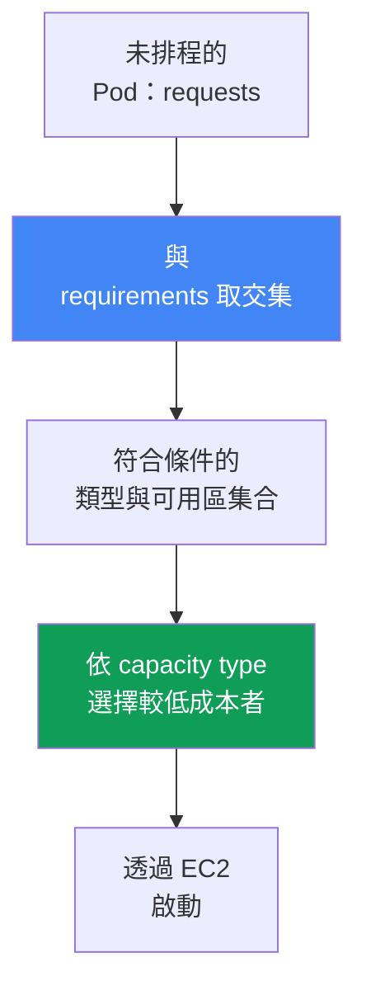
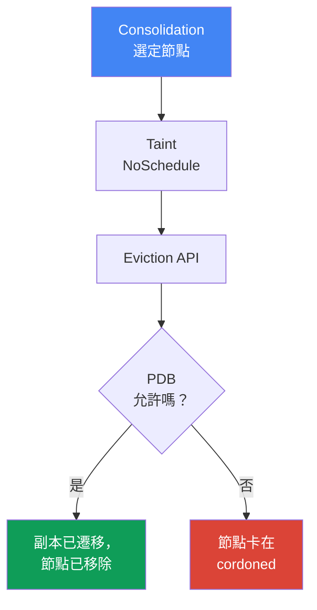

[English version](en.md) · [Versión en español](es.md) · [Version française](fr.md) · [Deutsche Version](de.md) · [ქართული ვერსია](ge.md) · [Русская версия](ru.md) · [日本語版](jp.md)
# 第 12 章：Karpenter：NodePool、EC2NodeClass、disruption、consolidation、drift

> **接下來。** 第 11 章從方法層面探討 Cluster Autoscaler 與 Karpenter 的選擇，以及 Karpenter 與 Auto Mode 的關係。本章進入具體設定：`NodePool` 與 `EC2NodeClass` 物件、Karpenter 如何選擇執行個體，以及最重要的 disruption：consolidation、drift，以及安全驅逐工作負載（包括 StatefulSet）。Spot 詳見第 13 章，AMI 與 bootstrap 見第 10 章，EBS 磁碟區與 AZ 綁定見第 23 章，sizing 見第 14 章，叢集升級見第 38 章。

## 12.1.「Consolidation 使 StatefulSet 中斷」與「節點未更新」

Karpenter 已啟用，節點會隨負載啟動 -  - 乍看之下一切正常。接著可能發生兩種情況之一，而兩者背後都是相同機制。

第一種情境：流量下降，Karpenter 整併叢集並驅逐使用率不足節點上的 Pod。它處理到 StatefulSet 中的資料庫副本 -  - 該副本隨著節點遷移，因而遺失本機資料或破壞 quorum。第二種情境則相反：含 CVE 修補的新 AMI 已推出，節點應該更新 -  - 但數週都沒有變動，而阻擋替換的原因並不明顯。

```bash
kubectl get nodeclaims
kubectl logs -n kube-system -l app.kubernetes.io/name=karpenter | grep -i disrupt
```

兩種情況都關乎 Karpenter 如何建立和移除節點：僅啟動節點並不足夠，其替換與移除不得使工作負載中斷，也不能永遠卡住。本章將說明此事。

## 12.2. NodePool：所建立節點的界限

`NodePool` 描述 Karpenter 可建立節點的範圍，以及其生命週期規則。沒有至少一個 `NodePool`，Karpenter 不會執行任何動作。主要部分如下：

- `template.spec.requirements`：透過 well-known labels 允許的類型、可用區、架構和 capacity type（`karpenter.k8s.aws/instance-category`、`kubernetes.io/arch`、`topology.kubernetes.io/zone`、`karpenter.sh/capacity-type`）。
- `template.metadata.labels` 與 `template.spec.taints`：所建立節點的 labels 與 taints。
- `template.spec.nodeClassRef`：對 `EC2NodeClass` 的參照；`disruption`：整併政策和 budgets（第 12.5 節）；`limits`：pool 上限；`weight`：pool 優先順序（權重越高，越早納入考量）。

```yaml
apiVersion: karpenter.sh/v1
kind: NodePool
metadata:
  name: default
spec:
  template:
    spec:
      nodeClassRef:
        group: karpenter.k8s.aws
        kind: EC2NodeClass
        name: default
      requirements:
        - key: kubernetes.io/arch
          operator: In
          values: ["amd64"]
        - key: karpenter.k8s.aws/instance-category
          operator: In
          values: ["c", "m", "r"]
        - key: karpenter.sh/capacity-type
          operator: In
          values: ["spot", "on-demand"]
      expireAfter: 720h
  disruption:
    consolidationPolicy: WhenEmptyOrUnderutilized
    consolidateAfter: 1m
```

文件建議不要將 `requirements` 縮得超出必要程度。類型集合越廣，Pod 的配置越有彈性，spot 工作負載也越具韌性（第 13 章）。

## 12.3. EC2NodeClass：節點的 AWS 特定設定

`EC2NodeClass` 描述專屬於 AWS 的設定。每個 `NodePool` 都參照一個 class；多個 pool 可共用同一 class。可設定項目如下：

- `amiFamily`：映像系列（`AL2023`、`Bottlerocket`、`AL2`、`Custom`）：bootstrap 邏輯和預設 block device mappings；映像細節見第 10 章。
- `amiSelectorTerms`：選取的 AMI：透過 `alias`（`al2023@latest`）、`id`、`name`、`tags`（必填欄位）。`role` 或 `instanceProfile`：節點的 IAM 身分識別（兩者擇一）。
- `subnetSelectorTerms`、`securityGroupSelectorTerms`：依 tags 或 id 選取子網路與 SG（同一 term 中條件為 AND，不同 terms 為 OR）。
- `blockDeviceMappings`：磁碟；`metadataOptions`：IMDS，預設為 `httpTokens: required`（IMDSv2）與 `httpPutResponseHopLimit: 1`（hardening 見第 19 章）。

```yaml
apiVersion: karpenter.k8s.aws/v1
kind: EC2NodeClass
metadata:
  name: default
spec:
  amiSelectorTerms:
    - alias: al2023@latest
  role: "KarpenterNodeRole-my-cluster"
  subnetSelectorTerms:
    - tags:
        karpenter.sh/discovery: "my-cluster"
  securityGroupSelectorTerms:
    - tags:
        karpenter.sh/discovery: "my-cluster"
  blockDeviceMappings:
    - deviceName: /dev/xvda
      ebs: {volumeSize: 50Gi, volumeType: gp3, encrypted: true}
  metadataOptions:
    httpTokens: required          # IMDSv2
    httpPutResponseHopLimit: 1
```

| 設定內容 | NodePool | EC2NodeClass |
|---|---|---|
| 類型、可用區、架構、capacity type | 是 | 否 |
| 節點的 labels 和 taints、disruption 政策 | 是 | 否 |
| AMI、映像系列、bootstrap | 否 | 是 |
| IAM role、子網路、SG、磁碟、IMDS | 否 | 是 |

關於 `alias: al2023@latest`：雖然方便，但不建議用於生產環境 -  - 新的 AMI 會立刻在所有節點上觸發 drift。更好的做法是固定版本，並有意識地推送更新（第 38 章）。

### Placement group：整個 class 共用一個 group

Karpenter 節點也能在 **placement group** 中啟動（策略見第 0.4 章）。先在 EC2 中建立 group，然後由 class 依名稱或 id（兩者擇一）選取；Karpenter 自 2026 年 7 月起支援此功能，在較舊 controller 版本中不存在此欄位。

```yaml
spec:
  placementGroupSelector:
    name: training-pg            # 或 id: pg-123
```

決定整個架構的特性是：**一個 `EC2NodeClass` 恰好對應一個 group**，其所有執行個體都會進入該 group。無法僅在共用 class 上新增一個旗標來處理此情況 -  - 這類工作負載應建立專用的 `NodePool` 加 `EC2NodeClass` 配對，並透過 selectors 和 taints 將 Pod 導向該 pool。這也是一項保護措施：`cluster` 會把所有節點放到同一可用區，這與跨三個可用區的分佈相衝突（第 40 章），而獨立 pool 可將影響限制在單一工作負載。使用 `cluster` 時，最好在 pool 的 `requirements` 中固定可用區，否則會由第一個執行個體固定下來。`partition` 提供 `karpenter.k8s.aws/placement-group-partition` label，可透過 `topologySpreadConstraints` 將副本分散至各 partition（機制見第 40 章）。

有兩項必要條件。第一，controller role 需要 `ec2:DescribePlacementGroups` 權限以發現 group，以及具備 `ec2:CreateFleet` 的 `ec2:RunInstances` 權限才能在其中啟動 -  - 若 policy 過舊，該欄位將無法運作。第二，每個可用區中 `spread` 最多 7 個執行中執行個體（第 0.4 章），這與 Karpenter 替換節點的方式不太相容 -  - 它會在 drain 舊節點前預先啟動替代節點（第 12.5 節）。當 group 已達上限，替代節點無法啟動，舊節點便會持續運作，因此對於 `spread` 工作負載的 AMI 更新應規劃保留足夠 slots，而不是依賴自動 drift。

## 12.4. Karpenter 如何選擇執行個體

選擇邏輯從 Pod 開始，而非從預先切分的群組開始。Karpenter 讀取未排程 Pod 的 `requests`、`nodeSelector`、`affinity`、`topologySpreadConstraints`、`tolerations`，將它們與 `NodePool` 的 `requirements` 取交集，得到符合條件的類型集合，再從中選擇能容納 Pod 且成本較低的選項。



若允許多個 capacity type，優先順序固定：`reserved`（capacity reservations）、再來 `spot`、最後 `on-demand`；容量不足時，Karpenter 會回退至下一個類型。因此規則是：寬廣的 `requirements` 是好事。一兩種執行個體類型沒有選擇空間：對 spot 而言會提高中斷頻率（第 13 章），對 on-demand 而言則有該可用區中類型容量不足的風險。

### 多個 NodePool：先嘗試哪個 pool

叢集中通常有多個 pool，遲早會有 Pod 同時符合其中兩個：例如一個通用 pool 與一個已預付容量的 pool。由 `weight` 決定勝出者：權重越高，Karpenter scheduler 越早考慮該 pool；沒有 `weight` 的 pool 視為零。

```yaml
apiVersion: karpenter.sh/v1
kind: NodePool
metadata:
  name: reserved
spec:
  weight: 50            # 高於通用池的 weight，因此優先嘗試
  limits:
    cpu: "200"          # 上限用盡 - Karpenter 轉向通用池
  template:
    spec:
      requirements:
        - key: node.kubernetes.io/instance-type
          operator: In
          values: ["m6i.2xlarge"]
```

這可解決兩項需求。**預付容量優先使用**：建立一個帶有 `limits` 與高權重的窄範圍 pool，當其 `limits` 耗盡後，工作負載便轉往通用 pool。另一項是為沒有 selectors 的 Pod 提供**預設 pool**：寬廣的 requirements 加上高權重，讓未指定目標的 Pod 進入可預期的設定，而專用 pool（第 12.10 節的 GPU 與第 13 章的 spot）只會透過 taints 與 selectors 處理它們自己的工作負載。

有兩點注意事項。pool 最好設計為**互斥**，`weight` 應用於解決競合，而非作為分隔工作負載的主要機制。此外，優先順序**不受保證**：Pod 會分批處理，因此無法放入優先 pool 的 Pod 可能前往較低權重的 pool，並帶走同批的相鄰 Pod；若叢集中已有適合節點，Pod 將由一般 `kube-scheduler` 排程，`weight` 完全不會參與。

## 12.5. Disruption：Karpenter 如何移除和替換節點

Disruption 是 Karpenter 自願終止節點的方式。controller 每次只執行一種方法，且按嚴格順序進行：**先 Drift，再 Consolidation**（另加強制的 Expiration 與 Interruption）。此順序對診斷很重要：若節點既發生 drift 又使用率不足，Karpenter 會先處理 drift。對任何自願方法，它會在節點加上 taint `karpenter.sh/disrupted:NoSchedule`、預先啟動替代節點，然後才透過 Kubernetes Eviction API drain 舊節點 -  - 亦即遵守 PDB。

**Consolidation** 是為了成本而主動整併。它由 `consolidationPolicy`（考慮哪些節點）及 `consolidateAfter`（等待節點穩定的時間；Pod 新增或移除時 timer 會重設；`Never` 會停用 consolidation）控制。

| consolidationPolicy | 處理哪些節點 | 何時選擇 |
|---|---|---|
| `WhenEmpty` | 僅空節點（只有 DaemonSet 與「低成本」Pod） | 需要最保守的模式 |
| `WhenEmptyOrUnderutilized` | 空節點加上使用率不足的節點：移除或以更低成本者替換 | 追求最大節省 |

v1 中 `consolidationPolicy` 只有兩個值。不存在作為獨立 policy 的「折衷」模式：在 `WhenEmptyOrUnderutilized` 下，Karpenter 會自行衡量效益並使用三種方法 -  - 移除空節點、single-node 與 multi-node consolidation -  - 僅在替代方案成本更低時才中斷節點。

**Drift** 是使節點符合預期狀態：若其 `NodeClaim` 中的值與 `NodePool` 或 `EC2NodeClass` 不同，該節點便發生 drift。Drift 欄位包括 `NodePool` 中的 `requirements`，以及 `EC2NodeClass` 中的 `subnetSelectorTerms`、`securityGroupSelectorTerms`、`amiSelectorTerms`。最常見觸發因素是新的 AMI。行為欄位（`weight`、`limits`、`disruption.*`）不會影響 drift。

## 12.6. 驅逐控制：該用什麼減速，又不該用什麼

這正是「工作負載中斷」與「永遠卡住」的差異所在。有四項工具。

**PodDisruptionBudget（PDB）** 是主要煞車。Karpenter 透過 Eviction API drain 節點，因此在自願 disruption 時，具有阻擋 PDB 的 Pod 不會被驅逐。StatefulSet 常用 `maxUnavailable: 1`。只要 PDB 不允許驅逐 Pod，節點就已標示 taint `karpenter.sh/disrupted:NoSchedule`（cordoned），但不會被刪除 -  - 會停留在該狀態：

```bash
kubectl describe node <node> | grep -A2 Unconsolidatable
# Normal  Unconsolidatable  ...  pdb default/db-pdb prevents pod evictions
```

需要留意的是：若 Pod 同時受多個 PDB 約束，或一個節點上有來自不同 PDB 的 Pod，所有這些 PDB 都必須同時允許驅逐。一個阻擋 PDB 就會保留整個節點。

Pod 上的 **`karpenter.sh/do-not-disrupt` annotation** 在 Pod 存在期間保護整個節點免受自願 disruption：`"true"` 表示持續保護，時長（`"30m"`）表示 Pod 啟動後暫時保護。此 annotation 同樣可套用至 `NodeClaim` 或節點。

`NodePool` 中的 **disruption budgets** 限制 disruption 速度：可同時 disruption 的節點比例或數量（`nodes: "20%"` 或 `nodes: "5"`），並可選用排程時段（cron 的 `schedule` 加 `duration`）作為 quiet hours。預設適用 `nodes: 10%` budget。budget 可透過 `reasons` 連結至原因：`Drifted`、`Underutilized`、`Empty`。

```yaml
  disruption:
    consolidationPolicy: WhenEmptyOrUnderutilized
    budgets:
      - nodes: "20%"
      - schedule: "0 9 * * mon-fri"
        duration: 8h
        nodes: "0"
```

**`terminationGracePeriod` 與 `expireAfter`** 設定時間範圍。`expireAfter`（預設 `720h`）是節點的最長生命週期，之後會強制 drain。`terminationGracePeriod` 是 drain 的上限：期滿時會強制刪除剩餘 Pod（與應用程式 graceful shutdown 有關）。兩者一起設定節點生命週期上限。

| 機制 | 層級 | Consolidation | Drift | Forceful（expiration/interruption） |
|---|---|---|---|---|
| PDB | Pod | 會減速 | 會減速（沒有 `terminationGracePeriod` 時） | 否 |
| Pod 上的 `do-not-disrupt` | Pod/節點 | 會減速 | 會減速（沒有 `terminationGracePeriod` 時） | 否 |
| disruption budget | NodePool | 會減速 | 會減速 | 否（expiration 忽略 budgets） |
| `terminationGracePeriod` | NodePool | 限制 drain | 解除 PDB/`do-not-disrupt` 阻擋 | 限制 drain |

最右欄至關重要：強制方法無法由 budgets 或 annotations 停止。Expiration 與 Interruption 會立即開始 drain；只能在應用程式層面透過 PDB 緩和其影響。

## 12.7. Consolidation 時安全驅逐 StatefulSet

讓我們正確處理 12.1 節的情境：資料庫 StatefulSet、已啟用 consolidation，而整併不得破壞 quorum。沒有 PDB 時，副本會立刻被驅逐 -  - quorum 受到威脅。使用 `maxUnavailable: 1` 的 PDB 時，Karpenter 會嚴格逐一驅逐副本，等待每個副本恢復。但若 consolidation 想一次移除多個含副本的節點，PDB 會阻擋部分驅逐，節點就會卡在 cordoned 狀態。



可在 logs 與 events 中看見被阻擋的驅逐：

```bash
kubectl logs -n kube-system -l app.kubernetes.io/name=karpenter -f | grep -i pdb
kubectl get pdb -A
```

正確設定由三個部分組成，而非單一設定：

- StatefulSet 的 **PDB** `maxUnavailable: 1`：逐一驅逐並維護 quorum；
- `NodePool` 中的 **disruption budget**：限制速度，避免 Karpenter 同時處理所有含副本的節點（`nodes: "20%"` 加上工作時間的 quiet window）；
- **`do-not-disrupt`**：精確用於絕不能中斷之處（leader、migration、長時間 batch job），而非套用到所有項目。

## 12.8. 陷阱：嚴格保護不只阻擋 consolidation，也阻擋 drift

最棘手的錯誤來自 12.6 節的表格。PDB 與 `do-not-disrupt` 會全面減慢自願 disruption -  - 包括 consolidation 與 **drift**。工程師對所有 Pod 設定 `do-not-disrupt: "true"` 或設定 `maxUnavailable: 0` 的 PDB，以確保「什麼都不會被動到」 -  - 結果就會出現 12.1 節的第二種情境：節點不再更新。

邏輯如下：新的 AMI 推出後，舊節點標示為 drifted，Karpenter 想要替換它們，但 drain 被阻擋。節點會數週停留在舊映像上：未修補的 CVE 持續累積，kubelet 與元件版本落後，技術債增加。進行叢集升級時（第 38 章），這會造成節點更新卡住。

解法是在 `NodePool` 上設定 `terminationGracePeriod`：設定後，即使有阻擋的 PDB 或 `do-not-disrupt` annotation，節點仍會 drift；期限結束後 Pod 會被強制刪除。這是關鍵更新（含 CVE 修補的 AMI）的安全機制。文件明確警告：存在 `do-not-disrupt` 時，不要未設定 `terminationGracePeriod` 就設定 `expireAfter`，否則會留下永遠卡住、僅完成部分 drain 的節點。平衡方式是：僅在必要程度上保護工作負載，且務必設定 `terminationGracePeriod`。

## 12.9. 與 EBS 磁碟區的互動：可用區綁定

另一個陷阱涉及具有 EBS 磁碟區的 StatefulSet。EBS 磁碟區位於特定 AZ，無法掛載至另一個可用區的執行個體，因此副本會經由自己的 PVC 綁定至該磁碟區所在的可用區。

因此對 consolidation 而言，Karpenter 無法為了整併而將這類副本移至另一個 AZ -  - 新節點必須在磁碟區所在的相同可用區啟動。若沒有可整併之處，副本會留在原處 -  - 這是正常情況，而非故障。替換節點時（drift、expiration），新節點會在相同 AZ 啟動，磁碟區重新附加，Pod 再次運行。

因此實務上要預先規劃 topology -  - 透過 `topologySpreadConstraints` 將副本分散至可用區，並使用 `volumeBindingMode: WaitForFirstConsumer` 建立磁碟區，使 provisioning 在所選節點的可用區中進行。StorageClass 與 `allowedTopologies` 的機制見第 23 章。

## 12.10. GPU 與 AI 工作負載：為加速器建立專用 NodePool

GPU 執行個體（`g5`、`p4d`、`p5`）昂貴且稀缺，普通 Pod 不應部署至其上。做法與其他情況相同：為 GPU 系列建立 requirements 狹窄的獨立 `NodePool`，加上 taint，確保只有真正需要 GPU 的 Pod 會使用該節點。

```yaml
apiVersion: karpenter.sh/v1
kind: NodePool
metadata: {name: gpu}
spec:
  template:
    spec:
      nodeClassRef: {group: karpenter.k8s.aws, kind: EC2NodeClass, name: gpu}
      requirements:
        - key: karpenter.k8s.aws/instance-family
          operator: In
          values: ["g5", "p4d", "p5"]
      taints:
        - key: nvidia.com/gpu
          effect: NoSchedule
```

未具 toleration 的 Pod 無法部署至此節點；GPU Pod 接受該 taint，並明確要求資源：

```yaml
  tolerations:
    - {key: nvidia.com/gpu, operator: Exists, effect: NoSchedule}
  containers:
    - name: train
      resources:
        limits: {nvidia.com/gpu: 1}
```

`nvidia.com/gpu` 資源由 NVIDIA device plugin 發布 -  - 一個在 GPU 節點上運作的 DaemonSet（使用 EKS 最佳化 GPU AMI 或獨立 addon；在 Auto Mode 中內建，見第 11 章）。在 plugin 啟動前，scheduler 看不到 GPU。Karpenter 會注意到含 `nvidia.com/gpu` `requests` 的 pending Pod，並從該 pool 為其啟動 GPU 節點。

具備稀缺 GPU 容量保證的訓練 Pod，可透過 `EC2NodeClass` 中的 `capacityReservationSelectorTerms` 關聯至 EC2 Capacity Blocks for ML（第 0.4 章），其中 `reserved` 在 capacity type 優先順序中居首（第 12.4 節）。對於分散式訓練，還可在相同 class 中加上採用 `cluster` 策略的 placement group（第 12.3 節）：節點會位於同一可用區內彼此接近的位置，將其間的延遲降至最低。

## 12.11. 營運：觀察與常見錯誤

當 Karpenter 的行為不如預期時，在運作中叢集可查看以下項目：

```bash
kubectl get nodepools
kubectl get ec2nodeclasses
kubectl get nodeclaims
kubectl logs -n kube-system -l app.kubernetes.io/name=karpenter -f
kubectl describe node <node>            # Unconsolidatable 事件
```

`NodeClaim` 是 Karpenter 對特定節點的請求；`NodePool -> NodeClaim -> Node` 的鏈結顯示節點歸屬。Karpenter 匯出 Prometheus metrics（包括 consolidation 相關 metrics）供 dashboards 使用（第 33 章）。常見錯誤如下：

- **節點未被 consolidation** -  - `Unconsolidatable` event 的原因是 `pdb ... prevents pod evictions`（阻擋的 PDB）或 `can't replace with a lower-priced node`（無法再降低成本）。
- **節點未更新（drift 卡住）** -  - 嚴格 PDB 或沒有 `terminationGracePeriod` 的 `do-not-disrupt`（第 12.8 節）。
- **`EC2NodeClass` not Ready** -  - 找不到子網路、SG 或 AMI；查看 `status.conditions`。在 class Ready 前，參照它的 pools 不會參與排程。
- **過度狹窄的 `requirements`** -  - 無法找到類型，Pod 會停留在 `Pending`。

## 12.12. 如何應用於生產環境

- **維持寬廣的 `requirements`**，僅在必要時縮小：可選擇更多類型、密集配置，以及 spot 韌性（第 13 章）。
- **固定 AMI 版本**，而非在生產環境使用 `@latest`：透過受控 drift 有意識地推送更新（第 38 章）。
- **以 PDB 加 disruption budget 的組合保護 StatefulSet**：PDB 提供逐一驅逐，budget 限制速度並設定 quiet windows。
- **存在 `do-not-disrupt` 或嚴格 PDB 時，務必設定 `terminationGracePeriod`** -  - 作為保護機制，避免 drift 和更新卡住。
- **精確使用 `do-not-disrupt`** -  - 套用到特定關鍵 Pod，而非整個 namespace。
- **預先規劃跨 AZ topology**，並理解 consolidation 無法在不同可用區間移動 EBS 磁碟區。

## 12.13. 迷你詞彙表

- **NodePool** -  - CRD（`karpenter.sh/v1`），定義節點的界限：`requirements`、`limits`、`weight`、labels/taints、disruption 政策。
- **EC2NodeClass** -  - CRD（`karpenter.k8s.aws/v1`），包含 AWS 設定：AMI、IAM role、子網路與 SG、磁碟、IMDS。
- **NodeClaim** -  - Karpenter 對特定節點的請求；連結 `NodePool` 與實際 `Node`。
- **Consolidation** -  - 為成本進行的自願整併；政策為 `WhenEmpty` 與 `WhenEmptyOrUnderutilized`，方法有 empty/single/multi-node，參數為 `consolidateAfter`。
- **Drift** -  - 節點與預期狀態的偏離（新的 AMI、變更的 selectors 或 `requirements`）；在 consolidation 前執行。
- **Disruption budget** -  - 自願 disruption 速度的限制：節點比例/數量、由 `schedule` 與 `duration` 指定的時段、關聯至 `reasons`。
- **`terminationGracePeriod`** -  - 節點 drain 的上限；設定後，即使有阻擋的 PDB 與 `do-not-disrupt`，仍會執行 drift。
- **`placementGroupSelector`** -  - `EC2NodeClass` 欄位，依名稱或 id 選擇 placement group。一個 class 恰好對應一個 group，因此這類工作負載應使用專屬的 `NodePool` 加 `EC2NodeClass` 配對。

## 12.14. 本章摘要

- `NodePool` 定義節點界限，`EC2NodeClass` 定義 AWS 特定設定（AMI、role、子網路、SG、磁碟、IMDS）。多個 pools 可共用一個 class。
- Karpenter 從 Pod 選擇執行個體：將 requests 與 `requirements` 取交集，選取較低成本者。capacity type 優先順序：`reserved`、`spot`、`on-demand`。
- Disruption 每次執行一種方法：先 Drift、再 Consolidation（另加強制 Expiration 與 Interruption）。Consolidation 由 `consolidationPolicy` 與 `consolidateAfter` 控制。
- PDB（主要煞車）、`do-not-disrupt`（保護整個節點）與 disruption budgets（速度與時段）會減慢驅逐；這些機制無法停止強制方法。
- 使用 PDB 加 disruption budget 加精確的 `do-not-disrupt` 安全驅逐 StatefulSet；被阻擋的驅逐表現為 cordoned 節點與 `Unconsolidatable` event。
- 過度嚴格的保護不只會阻擋 consolidation，也會阻擋 drift：節點無法更新，CVE 持續累積。安全機制為 `terminationGracePeriod`。
- Consolidation 無法跨 AZ 遷移 StatefulSet 副本，因為 EBS 磁碟區綁定至可用區（第 23 章）。

## 12.15. 在實際工作中的用途

值班時，12.1 節的兩種症狀可快速診斷。「節點卡在 cordoned 且未刪除」 -  - 執行 `kubectl describe node` 查看 `Unconsolidatable` event，再執行 `kubectl get pdb`：幾乎總是 PDB 或 `do-not-disrupt` annotation 造成阻擋。「新 AMI 後節點不更新」 -  - 是 drift 角度的相同根因；檢查是否存在沒有 `terminationGracePeriod` 的全面保護。設計時，本章可避免兩個極端：沒有 PDB 的 StatefulSet（consolidation 使工作負載中斷）與全面的 `do-not-disrupt`（drift 停滯）。中間做法是為每個關鍵工作負載設定 PDB、設定具 quiet windows 的 disruption budget，並以 `terminationGracePeriod` 作為安全機制。

## 12.16. 自我檢查問題

1. `NodePool` 與 `EC2NodeClass` 分別描述什麼？為何拆分為兩種物件？
2. Karpenter 如何選擇執行個體類型？為何寬廣的 `requirements` 優於狹窄的 requirements？
3. 一個 Pod 同時符合兩個 `NodePool`。`weight` 決定什麼？為何不能將它視為嚴格分隔工作負載的規則？
4. disruption 方法以何順序執行？為何這對診斷很重要？
5. `WhenEmpty` 與 `WhenEmptyOrUnderutilized` 有何不同，consolidation 使用哪些方法？`consolidateAfter` 的作用是什麼？
6. 何謂 drift、哪些變更會觸發它、哪些欄位不會影響它？
7. PDB 如何減慢驅逐？當 PDB 不允許驅逐 Pod 時，節點會如何？
8. `karpenter.sh/do-not-disrupt` 保護什麼，以及它作用在哪個層級？
9. disruption budgets 如何運作？能否用它們停止 expiration 或 interruption？
10. 如何在 consolidation 時安全驅逐 StatefulSet？設定由哪些部分組成？
11. 為何嚴格保護不只阻擋 consolidation，也阻擋 drift？這有何風險？
12. `terminationGracePeriod` 如何解除阻擋？為何 consolidation 無法將 EBS 磁碟區移至另一個 AZ？
13. 為何應將 placement group 工作負載放到專用的 `NodePool` 與 `EC2NodeClass` 配對，而非在共用 class 啟用 group？

## 實作練習

本主題的課程 lab 是[實驗 123 -  - Karpenter：NodePool、consolidation、drift 與 StatefulSet 的安全驅逐](../../labs/123/README_TW.MD)。Karpenter 也會在[實驗 106 -  - EBS CSI：gp3、AZ 綁定、擴展、snapshot](../../labs/106/README_TW.MD)中，於分區磁碟區的脈絡下說明。除此之外，也能在實際叢集上觀察 Karpenter 設定（包括 Auto Mode 內，見第 11 章）。先進行 inventory：`kubectl get nodepools`、`kubectl get ec2nodeclasses`、`kubectl get nodeclaims`。查看 `NodePool` 的 `spec.disruption` 區塊：其 `consolidationPolicy` 是什麼，是否有 `budgets` 與 `terminationGracePeriod`。

接著，在不傷害叢集的前提下完成第 12.7 與 12.8 節的診斷。找出 StatefulSet，並檢查 `kubectl get pdb -A` -  - 它是否有 PDB，`maxUnavailable` 為何。查看 `kubectl logs -n kube-system -l app.kubernetes.io/name=karpenter` 的 logs 與節點 events，尋找 `Unconsolidatable`。另行研讀 repository 中較早的 Karpenter lab（[Karpenter](../../labs/02/README_RUS.MD)） -  - 它不屬於課程，但主題相關。

---
[目錄](../README_TW.md) · [第 11 章](../11/tw.md) · [第 13 章](../13/tw.md)
