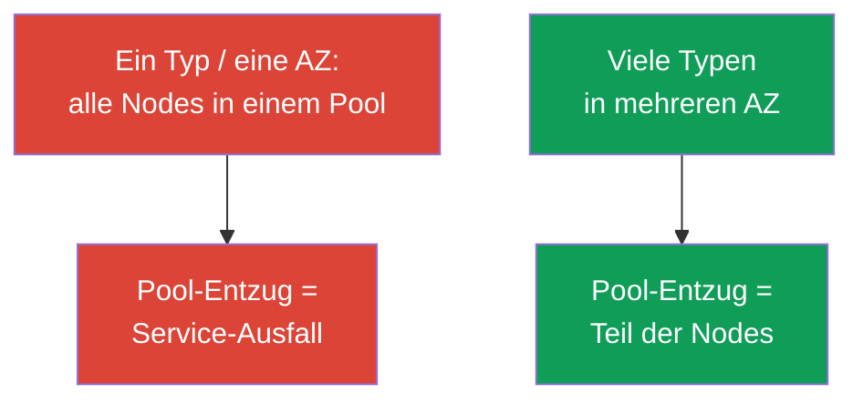
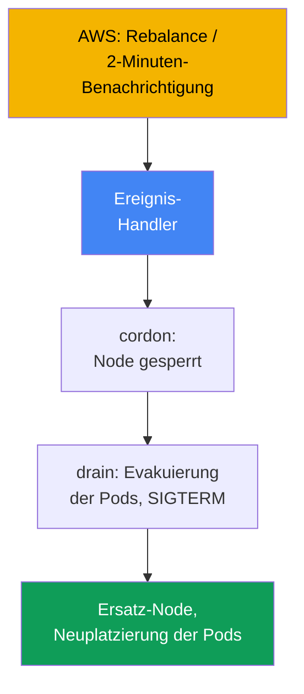
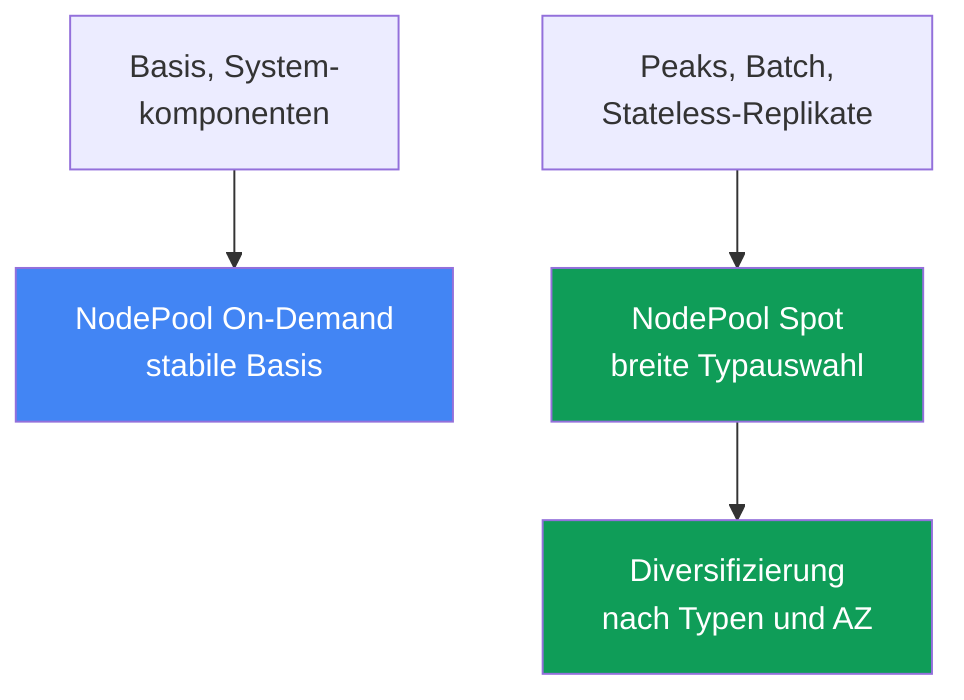

[Русская версия](ru.md) · [Eng version](en.md) · [Versión en español](es.md) · [Version française](fr.md) · [ქართული ვერსია](ge.md) · [繁體中文版](tw.md) · [日本語版](jp.md)
# Kapitel 13. Spot-Instances: Unterbrechungen, Diversifizierung, Ereignisverarbeitung

> **Wie geht es weiter?** Autoscaler wurden in Kapitel 11 behandelt, die Karpenter-Konfiguration (`NodePool`,
> `EC2NodeClass`, Disruption, Consolidation) in Kapitel 12. Jetzt geht es um Spot: günstige Kapazität,
> die AWS jederzeit zurücknehmen kann, und darum, wie sich Workloads so gestalten lassen, dass ein
> Entzug nicht zum Incident wird. Zahlungsmodelle behandelt Kapitel 0.4, Kosten als Ganzes (Savings
> Plans, Right-Sizing, Mix) Kapitel 43, Sizing Kapitel 14 und Zuverlässigkeit (PDB, Topology Spread)
> Kapitel 40.

## 13.1. „Die Hälfte der Nodes ist auf einmal verschwunden“

Tagsüber lief der Cluster stabil, dann verschwand innerhalb weniger Minuten die Hälfte der Nodes. Pods
wechselten massenhaft in `Pending`, der Service brach ein, und der Bereitschaftsdienst versteht nicht,
was passiert ist: Es gab weder ein Deployment noch manuelle Aktionen. Die ernüchternde Auflösung: Alle
Spot-Nodes hatten **denselben Typ in derselben Zone**, AWS benötigte diese Kapazität und nahm den
kompletten Pool auf einmal zurück.

```bash
kubectl get nodes -L karpenter.sh/capacity-type --sort-by=.metadata.creationTimestamp
kubectl get pods --field-selector status.phase=Pending -A
```

Es gibt noch eine zweite, leisere Variante desselben Problems. Nur wenige Nodes wurden entzogen, der
Ersatz war schnell bereit, dennoch verlor die Anwendung Requests: Sie **ist nicht auf ein plötzliches
Beenden vorbereitet**. Bei Spot hat der Prozess etwa zwei Minuten, fängt aber kein Stoppsignal ab,
hält lange Verbindungen offen oder speichert die einzige Kopie des Zustands auf der Node, sodass die
Unterbrechung sie verliert.

Beide Fälle bedeuten nicht, dass „Spot unzuverlässig ist“, sondern dass Spot ein anderes Design
verlangt: Kapazität wird von AWS geliehen, und die Aufgabe ist, dass der Entzug einer Node oder eines
ganzen Pools den Service nicht beeinträchtigt.

## 13.2. Was Spot ist und welche Regeln gelten

Spot-Instances sind aktuell freie EC2-Kapazität mit einem Rabatt gegenüber On-Demand. Der Preis dafür:
**AWS kann die Instance jederzeit zurücknehmen**, wenn die Kapazität für On-Demand-Nachfrage benötigt
wird. Der einzige Unterschied von Spot ist die Unterbrechbarkeit, ansonsten ist es eine gewöhnliche
Instance. Die Kostenstruktur (Spot ist günstiger, der Rabatt ist variabel) und der Platz von Spot unter
den Zahlungsmodellen behandelt Kapitel 0.4.

AWS nimmt eine Instance nicht lautlos zurück, sondern sendet zwei Signale:

| Signal | Wann es kommt | Was zu tun ist |
|---|---|---|
| Rebalance recommendation | frühzeitig, möglicherweise vor der 2-Minuten-Benachrichtigung | Workload vorab verlagern |
| Spot interruption notice | genau 2 Minuten vor Stopp/Beendigung | Pods noch geordnet entfernen |

Die zweiminütige Benachrichtigung ist ein dokumentierter Fakt und eine harte Grenze: Es bleiben etwa
120 Sekunden, um Last abzuführen. Laut Dokumentation trifft die Rebalance recommendation früher ein,
sodass Last schon vor Ablauf der Frist verlagert werden kann.

```bash
# Den Preisverlauf und die Volatilität nach Typ und Zone sehen Sie so:
aws ec2 describe-spot-price-history \
  --instance-types m5.large \
  --product-descriptions "Linux/UNIX" \
  --max-items 10
```

Fazit: Zwei Minuten sind wenig, und ein Entzug kann massenhaft erfolgen. Die Absicherung ruht daher
auf zwei Pfeilern zugleich: **Diversifizierung** (nicht alles auf einmal verlieren) und
**Anwendungsbereitschaft** (den Verlust einer Node überstehen). Kein Pfeiler allein genügt.

## 13.3. Das wichtigste Prinzip: Diversifizierung

Der häufigste und teuerste Fehler bei Spot ist ein **homogener Satz**: ein Instance-Typ in einer Zone.
Spot-Kapazität wird nach Pools zurückgenommen (Pool = „Instance-Typ + Zone“), und wenn die gesamte
Last in einem Pool liegt, nimmt dessen Entzug alles auf einmal mit. Das ist genau das Antimuster aus
Kapitel 0.4.

Die Lösung ist **Diversifizierung**: viele Instance-Typen in mehreren Zonen. Dann betrifft der Entzug
eines Pools nur einen Teil der Last statt des gesamten Service. Je breiter die Typauswahl und je mehr
Zonen, desto geringer die Wahrscheinlichkeit, dass ein einzelnes AWS-Ereignis einen kritischen Anteil
der Nodes ausfallen lässt.



Die praktische Bedeutung: Eine breite Typauswahl dient der **Resilienz**, nicht der Einsparung bei
einer Instance. Ein enger Satz führt zu Incidents; wie ein breiter Satz definiert wird, folgt unten und
in Kapitel 12.

## 13.4. Wie Karpenter hilft

Karpenter eignet sich gut für Spot, weil es eine Instance für Pods aus einem breiten erlaubten Bereich
auswählt (Kapitel 11), also selbst Diversifizierung sicherstellt, wenn man sie zulässt. In
`requirements` genügt es, den Capacity Type `spot` und eine breite Typauswahl freizugeben; die
konkrete Instance und Zone wählt Karpenter selbst.

```yaml
# NodePool-Ausschnitt: Spot + breite Typauswahl. Die vollständige Konfiguration steht in Kapitel 12.
spec:
  template:
    spec:
      requirements:
        - key: karpenter.sh/capacity-type
          operator: In
          values: ["spot", "on-demand"]      # Spot hat Vorrang, Rückfall auf On-Demand
        - key: karpenter.k8s.aws/instance-category
          operator: In
          values: ["c", "m", "r"]            # breite Auswahl = Diversifizierung
        - key: topology.kubernetes.io/zone   # mehrere AZ sind ebenfalls Diversifizierung
          operator: In
          values: ["eu-west-1a", "eu-west-1b", "eu-west-1c"]
```

Wenn beide Capacity Types erlaubt sind, bevorzugt Karpenter Spot und fällt bei fehlender
Spot-Kapazität auf On-Demand zurück (die Prioritätsreihenfolge behandelt Kapitel 12). Enge
`requirements` mit nur ein oder zwei Typen zerstören den Nutzen: Bei Spot ist das eine Rückkehr zum
homogenen Satz mit häufigen Unterbrechungen. Die Regel ist einfach: **Für Spot wird die Typauswahl so
breit wie möglich gehalten**. In der Praxis zielt man auf mindestens 3 bis 5 Familien ähnlicher Größen
(abgebildet über `karpenter.k8s.aws/instance-family` oder `instance-category`): Die Unterbrechung
einer Familie nimmt dann nicht alle Nodes auf einmal mit.

Der zweite Teil der Unterstützung ist die **Unterbrechungsverarbeitung**. AWS sendet Entzugsereignisse
an EventBridge, das sie in SQS legt, und Karpenter liest die Queue aus der Einstellung
`interruptionQueue`: Nach einer Benachrichtigung startet es vorab Ersatz, cordont und drainiert die
Node. Die Queue-Konfiguration behandelt Kapitel 12: **Karpenter reagiert selbst**, wenn sie
konfiguriert ist.

## 13.5. Verarbeitung von Unterbrechungsereignissen

Sehen wir uns an, wer bei einem Signal was tut. Es gibt zwei Ereignisse (Abschnitt 13.2): die frühe
Rebalance recommendation und die harte zweiminütige Interruption notice. Die Reaktion ist inhaltlich
gleich: **Last von der zum Entzug bestimmten Node verlagern**, bevor sie zurückgenommen wird: Node
markieren (cordon), Pods evakuieren (drain), den Autoscaler Ersatz starten und Pods neu platzieren
lassen.



Welcher Handler zuständig ist, hängt vom Aufbau des Clusters ab:

| Node-Typ | Wer die Unterbrechung verarbeitet | Was Sie konfigurieren |
|---|---|---|
| EKS Auto Mode | der Service selbst | nichts für Unterbrechungen |
| Eigenes Karpenter | Karpenter-Unterbrechungscontroller | Unterbrechungs-Queue (Kapitel 12) |
| Managed / self-managed ohne Karpenter | AWS Node Termination Handler | NTH installieren und betreiben |

Der **AWS Node Termination Handler (NTH)** wird für Managed- und Self-Managed-Nodes ohne Karpenter
benötigt. Es gibt zwei Modi: IMDS (ein Agent auf der Node fängt die Benachrichtigung aus den Metadaten
ab) und Queue Processor (ein Controller liest Ereignisse über EventBridge aus SQS). Er tut dasselbe:
cordon, drain, Node aus dem Betrieb nehmen. **EKS Auto Mode** verarbeitet Unterbrechungen selbst, ohne
Ihren NTH und ohne Queue-Konfiguration (Kapitel 9).

Wichtig ist die Grenze der Möglichkeiten eines Handlers. Bei einer zweiminütigen Benachrichtigung
bleiben ihm etwa 120 Sekunden: Er kann cordonen und mit dem Drain beginnen, aber **die Pods müssen
selbst geordnet beenden können**. Der Handler startet die Evakuierung, ersetzt aber nicht die
Bereitschaft der Anwendung. Kann sie nicht sauber beenden, helfen weder NTH noch Karpenter.

## 13.6. Bereitschaft der Anwendung für Unterbrechungen

Zwei Minuten sind eine Obergrenze, keine Garantie: Das Design muss auf eine schnelle Beendigung
ausgelegt sein. Daraus folgen Anforderungen an die Anwendung; allgemeine Zuverlässigkeitsmechanismen
behandelt Kapitel 40, hier geht es um ihre Anwendung bei Spot.

- **Graceful Shutdown über SIGTERM.** Bei der Evakuierung sendet Kubernetes dem Pod `SIGTERM` und
  wartet `terminationGracePeriodSeconds`, danach erzwingt es mit `SIGKILL` das Ende. Die Anwendung
  muss das Signal abfangen: keine Requests mehr annehmen, Verbindungen schließen. Der Zeitraum wird
  unter zwei Minuten gehalten.
- **PDB gegen Massenevakuierung.** Ein `PodDisruptionBudget` verhindert, dass bei freiwilligem Drain
  zu viele Replikate gleichzeitig evakuiert werden, **schützt aber nicht vor erzwungenem Entzug**:
  Nimmt AWS die Node zurück, verschwinden die Pods unabhängig vom PDB. Die Grundlage sind Replikate
  und Diversifizierung (Details in Kapitel 40).
- **Kritischen Zustand nicht nur auf einer Spot-Node halten.** Die einzige Datenkopie auf dem
  Datenträger einer Spot-Node geht beim ersten Entzug verloren. Zustand wird in replizierten Speicher
  oder auf über Zonen verteilte Replikate ausgelagert.
- **Checkpointing für Batch.** Langlaufende Tasks speichern Zwischenergebnisse regelmäßig, um nach
  einer Unterbrechung vom Checkpoint statt von vorn fortzusetzen.

```yaml
apiVersion: v1
kind: Pod
metadata:
  name: web
spec:
  terminationGracePeriodSeconds: 60   # in das zweiminütige Spot-Fenster passen
  containers:
    - name: app
      image: my-web:1.0
      lifecycle:
        preStop:
          exec:
            command: ["sh", "-c", "sleep 5"]   # dem Load Balancer Zeit geben, Traffic abzuleiten
```

## 13.7. Welche Workloads auf Spot können und welche nicht

Die Eignung für Spot wird durch eine Frage bestimmt: **Übersteht der Workload den plötzlichen Verlust
einer Node?** Die Antwort hängt von Replikaten, der Art des Zustands und der Teilbarkeit der Arbeit ab.

| Workload | Spot | Warum |
|---|---|---|
| Stateless-Services mit mehreren Replikaten | ja | der Verlust eines Replikats wird durch die übrigen kompensiert |
| Batch- und CI-Jobs mit Checkpointing | ja | ein Neustart vom Checkpoint ist günstig |
| Queue-Worker (idempotent) | ja | eine unverarbeitete Nachricht kehrt in die Queue zurück |
| Einziges Stateful-Replikat ohne Replikation | nein | Entzug = Datenverlust oder Ausfallzeit |
| Lange unteilbare Aufgabe ohne Checkpoint | vorsichtig | eine Unterbrechung wirft sie an den Anfang zurück |
| Kritische Systemkomponenten | vorsichtig/nein | eine stabile On-Demand-Basis ist nötig |

Die Regel: **Stateless mit ausreichend Replikaten und unterbrechbarer Batch sind natürliche
Kandidaten für Spot**; einzige Stateful-Kopien und kritische Systeminfrastruktur gehören auf
On-Demand oder unter strikte Replikation. Der Zwischenbereich wird durch Checkpointing gelöst. Das
Sizing dieser Workloads (Requests/Limits, Dichte) behandelt Kapitel 14.

## 13.8. Gemischte Strategien: On-Demand-Basis plus Peaks auf Spot

In der Praxis ist selten alles „vollständig auf Spot“ oder „vollständig auf On-Demand“. Das
funktionierende Muster ist **gemischt**: Grundkapazität, die immer gebraucht wird, auf On-Demand;
variable Peaks und unterbrechbare Workloads auf Spot. So trifft der Entzug eines Spot-Pools den
Peak-Anteil, während der Kern des Service auf einer stabilen Basis läuft.

Das wird über **getrennte Pools** umgesetzt: Ein `NodePool` (oder Node Group) für On-Demand als Basis
und für Systemkomponenten, ein anderer für Spot und unterbrechbare Workloads. Workloads werden über
`nodeSelector`/`affinity` anhand des Capacity-Type-Labels an den passenden Pool gelenkt; der Spot-Pool
kann bei Bedarf mit einem Taint abgesichert werden.



Pods werden über ein Label zum Capacity Type gelenkt. In Karpenter lautet es
`karpenter.sh/capacity-type` (`spot` oder `on-demand`), auf EKS-Nodes kommt historisch auch
`eks.amazonaws.com/capacityType` (`SPOT`/`ON_DEMAND`) vor. Welches zu verwenden ist, hängt davon ab,
wer die Node erstellt hat.

```yaml
# Unterbrechbaren Workload ausschließlich auf Spot lenken:
spec:
  nodeSelector:
    karpenter.sh/capacity-type: spot
```

```bash
# Prüfen, welchen Capacity Type die Nodes im Cluster haben:
kubectl get nodes -L karpenter.sh/capacity-type -L eks.amazonaws.com/capacityType
```

Ein sinnvoller Start: Die kritische Mindestzahl der Replikate jedes Service wird an On-Demand
gebunden, alle übrigen an Spot. Selbst beim Entzug des gesamten Spot-Pools bleibt der Service auf der
Basiskapazität aktiv, während Karpenter Ersatz startet (einschließlich Rückfall auf On-Demand). Die
Balance zwischen Spot- und On-Demand-Anteil bei den Kosten behandelt Kapitel 43.

## 13.9. Diagnose und Beobachtung

Das Wichtigste im Bereitschaftsdienst: **Spot-Nodes kommen und gehen häufiger als On-Demand, und das
ist normal**, kein Incident. Ein Incident liegt vor, wenn der Entzug den Service beeinträchtigt, nicht
schon durch die bloße Ersetzung einer Node.

```bash
kubectl get nodeclaims                                   # Nodes werden häufig neu erstellt: normal
kubectl get nodes -L karpenter.sh/capacity-type --sort-by=.metadata.creationTimestamp
kubectl logs -n kube-system -l app.kubernetes.io/name=karpenter | grep -i interrupt
```

Worauf konkret zu achten ist:

- **Unterbrechungshäufigkeit nach Pools.** Steigt sie für einen Typ stark an, ist die Auswahl zu eng
  (Abschnitt 13.3); `requirements` werden erweitert.
- **Pods in `Pending` nach einem Entzug.** Ersatz startet nicht: Kapazität und
  Autoscaler-Prioritäten prüfen (Kapitel 11 bis 12), statt „schlechtem Spot“ die Schuld zu geben.
- **Fehlerspitze beim Ersetzen einer Node.** Sie weist auf eine nicht vorbereitete Anwendung hin
  (Abschnitt 13.6): kein Graceful Shutdown, zu wenige Replikate, kein `preStop`.
- **Karpenter-Metriken.** Sie werden nach Prometheus exportiert (Kapitel 33); daran sind Tempo von
  Unterbrechungen und Ersetzungen erkennbar, praktisch für Dashboard und Alerts bei anormalem Anstieg.

Ein gesunder Spot-Cluster wirkt „laut“: Nodes wechseln, der Service bleibt aber stabil. Die Aufgabe der
Beobachtung ist, den Punkt zu erfassen, an dem Lärm in einen Einbruch übergeht.

## 13.10. Wie dies in Produktion eingesetzt wird

- **Standardmäßig diversifizieren.** Für Spot eine breite Typauswahl und mehrere AZ vorsehen; einen
  homogenen Satz mit einem Typ in einer Zone als Konfigurationsfehler behandeln.
- **Basis und Peaks auf Pools trennen.** Kritische Mindestzahl an Replikaten und Systemkomponenten auf
  On-Demand, Unterbrechbares und Peaks auf Spot, mit `capacity-type` als Kennzeichnung.
- **Anwendungen auf Unterbrechungen vorbereiten.** Obligatorisch sind die Verarbeitung von `SIGTERM`,
  ein sinnvoller `terminationGracePeriodSeconds` innerhalb von zwei Minuten und `preStop`, um Traffic
  abzuleiten.
- **Keine einzige Zustandskopie auf Spot ablegen.** Stateful ohne Replikation auf On-Demand betreiben
  oder über Zonen replizieren; Batch mit Checkpointing umsetzen. PDB mildert freiwilligen Drain,
  verhindert aber keinen erzwungenen Entzug. Die Grundlage sind Replikate und Diversifizierung.
- **Lärm von Incidents unterscheiden.** Häufige Wechsel von Spot-Nodes nicht alerten; auf
  Service-Einbruch, festhängende `Pending` und einen anormalen Anstieg der Unterbrechungen pro Pool
  alerten.

## 13.11. Mini-Glossar

- **Spot-Instance**: Freie EC2-Kapazität mit Rabatt, die AWS jederzeit zurücknehmen kann, wenn sie
  für On-Demand-Nachfrage benötigt wird.
- **Spot interruption notice**: Benachrichtigung über eine Unterbrechung zwei Minuten vor dem Stopp
  oder der Beendigung einer Instance; die harte Grenze für ein geordnetes Beenden.
- **Rebalance recommendation**: Frühes Signal für ein erhöhtes Entzugsrisiko, das vor der
  zweiminütigen Benachrichtigung eintrifft; gibt Zeit, die Last vorab zu verlagern.
- **Diversifizierung**: Vielzahl von Instance-Typen in mehreren AZ, damit der Entzug eines Pools
  keinen kritischen Anteil der Nodes ausfallen lässt.
- **Spot-Pool**: Kombination aus „Instance-Typ + Availability Zone“; Kapazität wird in Pools
  zurückgenommen.
- **Node Termination Handler (NTH)**: AWS-Komponente zur Verarbeitung von Unterbrechungen auf
  Managed- und Self-Managed-Nodes ohne Karpenter; die Modi sind IMDS und Queue Processor.
- **Capacity Type**: Kapazitätstyp einer Node (`spot`/`on-demand`); die Labels
  `karpenter.sh/capacity-type` und `eks.amazonaws.com/capacityType`.

## 13.12. Zusammenfassung des Kapitels

- Spot ist rabattierte EC2-Kapazität, die AWS bei Knappheit zurücknimmt; der einzige Unterschied zu
  On-Demand besteht darin, dass Spot unterbrochen wird (Kostenstruktur: Kapitel 0.4 und 43).
- AWS gibt zwei Signale: Rebalance recommendation (früh, kann früher eintreffen) und Interruption
  notice (harte zwei Minuten bis zum Entzug).
- Der wichtigste Schutz ist Diversifizierung: viele Typen in mehreren AZ. Ein homogener Satz aus einem
  Typ in einer Zone ist ein Antimuster: Ein Entzug nimmt alles mit.
- Karpenter stellt mit breiten `requirements` Diversifizierung sicher und verarbeitet Unterbrechungen
  selbst über die Unterbrechungs-Queue (Details in Kapitel 12); der zuständige Handler hängt vom
  Node-Typ ab (Karpenter, NTH, Auto Mode selbst).
- Zwei Minuten sind wenig: Die Anwendung muss Graceful Shutdown über `SIGTERM` beherrschen, darf die
  einzige Zustandskopie nicht auf Spot halten, und Batch muss Checkpointing durchführen. PDB mildert,
  schützt aber nicht vor erzwungenem Entzug (Kapitel 40).
- Auf Spot gehören Stateless mit Replikaten, unterbrechbare Batch-Workloads und idempotente Worker;
  einzige Stateful-Kopien und kritische Infrastruktur auf On-Demand. Das funktionierende Muster ist
  gemischt: Basis auf On-Demand, Peaks und Unterbrechbares auf Spot, über das Capacity-Type-Label auf
  Pools verteilt.

## 13.13. Wie dies bei der praktischen Arbeit hilft

Im Bereitschaftsdienst ist es entscheidend, Normalität nicht mit einem Incident zu verwechseln.
Häufige Wechsel von Spot-Nodes und schnell wechselnde `nodeclaims` sind erwartetes Verhalten. Auf
einen Service-Einbruch muss reagiert werden: Nach einem Entzug festhängende `Pending` sind eine Frage
an Kapazität und Autoscaler (Kapitel 11 bis 12); eine Fehlerspitze beim Ersetzen der Node betrifft die
Bereitschaft der Anwendung; zunehmende Unterbrechungen für einen Typ sind ein Signal, die Auswahl zu
erweitern.

Das Kapitel bewahrt vor zwei Extremen: „Alles auf Spot, um zu sparen“ (ein Massenentzug lässt den
Service ausfallen) und „Spot ist zu riskant“ (zu viel für überflüssiges On-Demand bezahlen). Der
Mittelweg ist diversifizierter Spot für Stateless und Batch plus eine On-Demand-Basis für das kritische
Minimum und Anwendungen, die auf plötzliches Beenden vorbereitet sind.

## 13.14. Fragen zur Selbstkontrolle

1. Wodurch unterscheidet sich eine Spot-Instance von On-Demand, und warum ist sie günstiger?
2. Welche zwei Signale für eine Unterbrechung sendet AWS, und worin unterscheiden sie sich?
3. Wie viel Zeit gibt die zweiminütige Benachrichtigung, und warum darf man sich nicht vollständig auf sie verlassen?
4. Was ist ein Spot-Pool, und warum ist ein homogener Instance-Satz der größte Fehler?
5. Wie senkt Diversifizierung das Risiko, und wie wird sie in Karpenter definiert?
6. Wie verarbeitet Karpenter eine Unterbrechung, und was muss dafür konfiguriert werden?
7. Wer verarbeitet eine Unterbrechung auf Nodes ohne Karpenter, und was macht Auto Mode?
8. Was passiert mit der Node und den Pods beim Erhalt eines Unterbrechungsereignisses?
9. Was muss eine Anwendung beherrschen, um eine Unterbrechung in zwei Minuten zu überstehen?
10. Schützt ein PDB vor einem erzwungenen Spot-Entzug, und warum?
11. Welche Workloads können auf Spot laufen und welche nicht, und nach welchem Kriterium?
12. Wie ist eine gemischte Strategie aufgebaut, und warum sind häufige Wechsel von Spot-Nodes normal?

## Praxis

Das Kurs-Lab zu diesem Thema: [Lab 111: Spot-Nodes: Diversifizierung, Unterbrechungsverarbeitung,
graceful drain](../../labs/111/README_DE.MD). Darüber hinaus lässt sich das Spot-Verhalten an einem
laufenden Cluster beobachten. Beginnen Sie mit einer Kapazitätsinventur:
`kubectl get nodes -L karpenter.sh/capacity-type -L eks.amazonaws.com/capacityType` zeigt, welche
Nodes Spot und welche On-Demand sind und ob überhaupt Diversifizierung vorhanden ist. Prüfen Sie
`kubectl get nodeclaims` und sortieren Sie Nodes nach Erstellungszeit, um zu sehen, wie häufig sie
wechseln.

Prüfen Sie als Nächstes die Unterbrechungsbereitschaft. Nehmen Sie ein zentrales Deployment: Ist
`terminationGracePeriodSeconds` gesetzt, gibt es `preStop` und PDB, wie viele Replikate gibt es und
sind sie über Zonen verteilt? Sehen Sie in die Logs des Unterbrechungshandlers
(`kubectl logs -n kube-system -l app.kubernetes.io/name=karpenter | grep -i interrupt`) und bewerten
Sie den normalen „Lärm“ von Entzügen. Arbeiten Sie außerdem das frühe Karpenter-Lab aus dem Repository
durch ([Karpenter](../../labs/02/README_DE.MD)). Es gehört nicht zum Kurs, die Themen überschneiden sich
aber.

---
[Inhaltsverzeichnis](../README_DE.md) · [Kapitel 12](../12/de.md) · [Kapitel 14](../14/de.md)