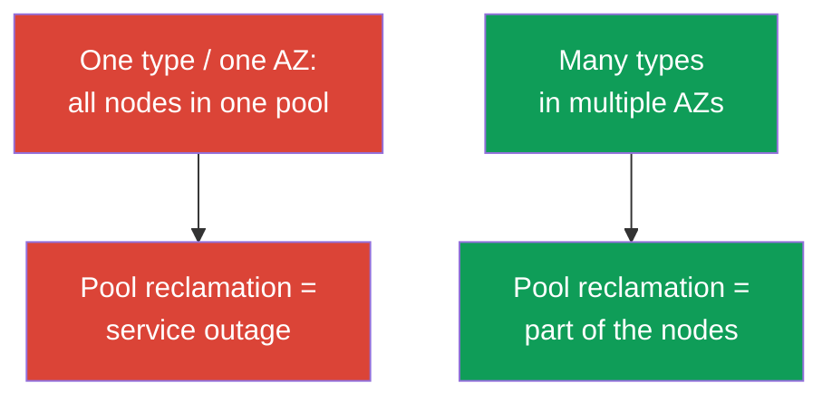
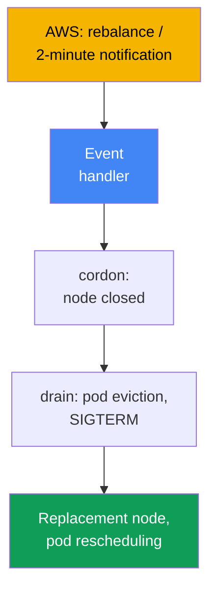
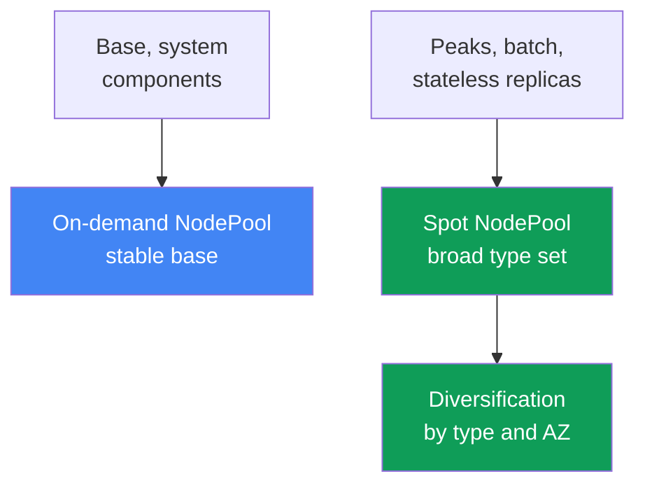

[Русская версия](ru.md) · [Versión en español](es.md) · [Version française](fr.md) · [Deutsche Version](de.md) · [ქართული ვერსია](ge.md) · [繁體中文版](tw.md) · [日本語版](jp.md)
# Chapter 13. Spot instances: interruptions, diversification, and event handling

> **What is next.** Autoscalers are covered in chapter 11, and Karpenter configuration (`NodePool`,
> `EC2NodeClass`, disruption, consolidation) in chapter 12. Now for spot: inexpensive capacity
> that AWS can reclaim at any time, and how to design workloads so a reclamation does not become
> an incident. Pricing models are in chapter 0.4, full cost (Savings Plans, right-sizing,
> mix) in chapter 43, sizing in chapter 14, and reliability (PDB, topology spread) in chapter 40.

## 13.1. "Half the nodes disappeared at once"

The cluster ran steadily during the day, and then half of the nodes vanished within minutes. Pods
went into `Pending` en masse, the service degraded, and the on-call engineer does not understand
what happened: there was no deployment or manual action. The unpleasant answer is that all spot
nodes were **one type in one zone**, AWS needed that capacity, and it reclaimed the whole pool at
once.

```bash
kubectl get nodes -L karpenter.sh/capacity-type --sort-by=.metadata.creationTimestamp
kubectl get pods --field-selector status.phase=Pending -A
```

There is another, quieter form of the same pain. Few nodes were reclaimed and a replacement came
up quickly, but the application still dropped requests: it is **not ready for sudden termination**.
With spot, the process has about two minutes, but it does not handle the termination signal, holds
long-lived connections, or keeps the only copy of its state on the node, and the interruption
loses it.

Neither case means "spot is unreliable." Rather, spot requires a different design: capacity is
borrowed from AWS, and the goal is to ensure that reclaiming a node or an entire pool does not
knock out the service.

## 13.2. What spot is and the rules of the game

Spot instances are currently unused EC2 capacity at a discount compared with on-demand. There is
one price: **AWS can reclaim an instance at any time** when capacity is required for on-demand
demand. Spot differs only in that it can be interrupted; otherwise, it is a regular instance. The
cost structure (spot is cheaper, discount varies) and spot's place among pricing models are in
chapter 0.4.

AWS does not reclaim an instance silently, but sends two signals:

| Signal | When it arrives | What to do |
|---|---|---|
| Rebalance recommendation | early, may arrive before the 2-minute notice | move the workload away in advance |
| Spot interruption notice | exactly 2 minutes before stop/termination | have time to gracefully remove pods |

The two-minute notification is a documented fact and a hard boundary: about 120 seconds to remove
the workload. Documentation states that the rebalance recommendation arrives earlier, allowing the
workload to be moved before the deadline.

```bash
# Price history and volatility by type and zone can be viewed as follows:
aws ec2 describe-spot-price-history \
  --instance-types m5.large \
  --product-descriptions "Linux/UNIX" \
  --max-items 10
```

The conclusion: two minutes is not much, and reclamation can be widespread. Therefore, protection
rests on two pillars at once: **diversification** (do not lose everything at once) and
**application readiness** (survive losing a node). Neither pillar alone is sufficient.

## 13.3. The main principle: diversification

The most common and expensive spot mistake is a **homogeneous set**: one instance type in one zone.
Spot capacity is reclaimed by pools (a pool is "instance type + zone"), and if all workload is in
one pool, its reclamation takes everything at once. This is the same anti-pattern from chapter 0.4.

The remedy is **diversification**: many instance types across multiple zones. Then a pool
reclamation affects only part of the workload instead of the entire service. The broader the set of
types and the more zones, the less likely one AWS event will take out a critical share of nodes.



The practical meaning is that a broad choice of types is about **resilience**, not saving money on
an instance. A narrow set turns into incidents; how to define a broad one is below and in chapter
12.

## 13.4. How Karpenter helps

Karpenter is well suited for spot because it selects an instance for pods from a broad permitted
range (chapter 11), meaning it provides diversification itself if allowed to do so. In
`requirements`, it is enough to allow the `spot` capacity type and a broad type list; Karpenter
will choose the specific instance and zone itself.

```yaml
# NodePool fragment: spot + a broad set of types. Full configuration is in chapter 12.
spec:
  template:
    spec:
      requirements:
        - key: karpenter.sh/capacity-type
          operator: In
          values: ["spot", "on-demand"]      # spot preferred, fallback to on-demand
        - key: karpenter.k8s.aws/instance-category
          operator: In
          values: ["c", "m", "r"]            # broad set = diversification
        - key: topology.kubernetes.io/zone   # multiple AZs are diversification too
          operator: In
          values: ["eu-west-1a", "eu-west-1b", "eu-west-1c"]
```

When both capacity types are allowed, Karpenter prefers spot and falls back to on-demand when
spot capacity is unavailable (priority order is in chapter 12). Narrow `requirements` of one or
two types defeats the purpose: for spot, this returns to a homogeneous set with frequent
interruptions. The rule is simple: **keep the type set as broad as possible for spot**. In
practice, target at least 3-5 families of comparable sizes (through
`karpenter.k8s.aws/instance-family` or `instance-category`): then interrupting one family does
not take out all nodes at once.

The second part of the help is **interruption handling**. AWS sends reclamation events through
EventBridge, which puts them in SQS, and Karpenter reads the queue from the `interruptionQueue`
setting. After receiving a notification, it brings up a replacement in advance, cordons and drains
the node. Queue configuration is in chapter 12: **Karpenter responds itself** when it is
configured.

## 13.5. Handling interruption events

Let us examine who does what when a signal arrives. There are two events (section 13.2): an early
rebalance recommendation and a hard two-minute interruption notice. The intent of the response is
the same: **move workload from the doomed node before reclamation**: mark the node (cordon), evict
pods (drain), let the autoscaler bring up a replacement, and reschedule the pods.



Who the handler is depends on the cluster design:

| Node type | Who handles the interruption | What you configure |
|---|---|---|
| EKS Auto Mode | the service itself | nothing for interruptions |
| Your own Karpenter | Karpenter interruption controller | interruption queue (chapter 12) |
| Managed / self-managed without Karpenter | AWS Node Termination Handler | install and operate NTH |

**AWS Node Termination Handler (NTH)** is needed for managed and self-managed nodes without
Karpenter. It has two modes: IMDS (an agent on the node receives a notification from metadata) and
Queue Processor (a controller reads events from SQS through EventBridge). It does the same:
cordon, drain, and remove the node. **EKS Auto Mode** handles interruptions itself, without your
NTH or queue configuration (chapter 9).

The handler's capability boundary matters. With a two-minute notice, it has about 120 seconds: it
can cordon and begin draining, but **the pods themselves must exit gracefully**. The handler starts
eviction, but it does not replace application readiness: neither NTH nor Karpenter can save an
application that cannot terminate cleanly.

## 13.6. Application readiness for interruption

Two minutes is a ceiling, not a guarantee: design for fast termination. This leads to application
requirements; the general reliability mechanisms are in chapter 40, and here is their application
to spot.

- **Graceful shutdown on SIGTERM.** During eviction, Kubernetes sends `SIGTERM` to the pod and
  waits for `terminationGracePeriodSeconds`, then finishes it with `SIGKILL`. The application
  must handle it: stop accepting requests and close connections. Keep the period below two minutes.
- **PDB against mass eviction.** A `PodDisruptionBudget` prevents too many replicas from being
  evicted at once during voluntary draining, but **does not protect against forced reclamation**:
  if AWS reclaims a node, pods leave regardless of PDB. Rely on replicas and diversification
  (details in chapter 40).
- **Do not keep critical state only on a spot node.** The single copy of data on a spot node disk
  is lost on the first reclamation. Move state to replicated storage or replicas distributed across
  zones.
- **Checkpointing for batch.** Long-running jobs periodically save intermediate results so that
  after an interruption they resume from a checkpoint rather than from the beginning.

```yaml
apiVersion: v1
kind: Pod
metadata:
  name: web
spec:
  terminationGracePeriodSeconds: 60   # fit within the two-minute spot window
  containers:
    - name: app
      image: my-web:1.0
      lifecycle:
        preStop:
          exec:
            command: ["sh", "-c", "sleep 5"]   # let the load balancer move traffic away
```

## 13.7. Which workloads can use spot, and which cannot

Suitability for spot is determined by one question: **can the workload survive suddenly losing a
node**? The answer depends on replicas, the nature of state, and whether the work is divisible.

| Workload | Spot | Why |
|---|---|---|
| Stateless services with multiple replicas | yes | remaining replicas compensate for the lost replica |
| Batch and CI jobs with checkpointing | yes | restarting from a checkpoint is inexpensive |
| Queue workers (idempotent) | yes | the unprocessed message returns to the queue |
| A single stateful replica without replication | no | reclamation = data loss or downtime |
| A long indivisible job without a checkpoint | cautiously | interruption sends it back to the start |
| Critical system components | cautiously/no | a stable on-demand base is needed |

The rule: **stateless workloads with spare replicas and interruptible batch workloads are natural
spot candidates**; single stateful copies and critical system infrastructure belong on on-demand or
under strict replication. The middle ground is resolved by checkpointing. Sizing these workloads
(requests/limits, density) is in chapter 14.

## 13.8. Mixed strategies: an on-demand base plus spot peaks

In practice, it is rarely "everything on spot" or "everything on-demand." The working pattern is
**mixed**: base capacity that is always needed runs on on-demand, while variable peaks and
interruptible workloads run on spot. Then reclaiming a spot pool hits the peak portion while the
service core remains on a stable base.

Separate them with **separate pools**: one `NodePool` (or node group) on on-demand for the base and
system components, and another on spot for interruptible workloads. Direct workloads to the
appropriate pool through `nodeSelector`/`affinity` on the capacity type label, and add a taint to
the spot pool if needed.



Direct pods to the capacity type through a label. In Karpenter, this is
`karpenter.sh/capacity-type` (`spot` or `on-demand`); EKS nodes have historically also used
`eks.amazonaws.com/capacityType` (`SPOT`/`ON_DEMAND`). Which one to use depends on what created
the node.

```yaml
# Direct an interruptible workload strictly to spot:
spec:
  nodeSelector:
    karpenter.sh/capacity-type: spot
```

```bash
# Check the capacity type of nodes in the cluster:
kubectl get nodes -L karpenter.sh/capacity-type -L eks.amazonaws.com/capacityType
```

A sensible start: pin the critical minimum number of replicas for every service to on-demand and
put the remainder on spot. Even if the entire spot pool is reclaimed, the service stays up on base
capacity, while Karpenter brings up a replacement (including falling back to on-demand). The
cost-based balance of spot and on-demand shares is in chapter 43.

## 13.9. Diagnostics and observability

The first thing to understand while on call is that **spot nodes come and go more often than
on-demand, and that is normal**, not an incident. An incident is when a reclamation degrades the
service, not the fact that a node itself is replaced.

```bash
kubectl get nodeclaims                                   # nodes are often recreated: normal
kubectl get nodes -L karpenter.sh/capacity-type --sort-by=.metadata.creationTimestamp
kubectl logs -n kube-system -l app.kubernetes.io/name=karpenter | grep -i interrupt
```

What to examine specifically:

- **Interruption frequency by pool.** A sharp rise for one type means the set is too narrow
  (section 13.3); broaden `requirements`.
- **Pods in `Pending` after reclamation.** The replacement does not come up: examine capacity and
  autoscaler priorities (chapters 11-12), rather than blaming "bad spot."
- **A spike in errors when a node is replaced.** This indicates application unreadiness (section
  13.6): no graceful shutdown, too few replicas, or no `preStop`.
- **Karpenter metrics.** They are exported to Prometheus (chapter 33); they show interruption and
  replacement rate, which is useful for dashboards and alerts on anomalous growth.

A healthy spot cluster looks "noisy": nodes change but the service remains steady. The job of
observability is to catch the moment when noise becomes degradation.

## 13.10. How this is used in production

- **Diversify by default.** Keep a broad type set and multiple AZs for spot; consider a
  homogeneous set of one type in one zone a configuration error.
- **Separate the base and peaks by pools.** Critical minimum replicas and system components run
  on on-demand, while interruptible and peak workloads run on spot, marked through `capacity-type`.
- **Prepare applications for interruption.** `SIGTERM` handling, a reasonable
  `terminationGracePeriodSeconds` within two minutes, and `preStop` for moving traffic away are
  mandatory.
- **Do not put the only copy of state on spot.** Stateful workloads without replication run on
  on-demand or are replicated across zones; batch workloads use checkpointing. PDB softens
  voluntary draining but does not stop forced reclamation: rely on replicas and diversification.
- **Distinguish noise from an incident.** Do not alert on frequent spot node changes; alert on
  service degradation, stuck `Pending` pods, and anomalous interruption growth in one pool.

## 13.11. Mini-glossary

- **Spot instance** - unused discounted EC2 capacity that AWS can reclaim at any time when it is
  needed for on-demand demand.
- **Spot interruption notice** - notification of an interruption two minutes before an instance is
  stopped or terminated; the hard boundary for graceful shutdown.
- **Rebalance recommendation** - an early signal of elevated reclamation risk that arrives before
  the two-minute notification; it gives time to move the workload away in advance.
- **Diversification** - multiple instance types in several AZs, so reclaiming one pool does not
  take out a critical share of nodes.
- **Spot pool** - the combination of "instance type + Availability Zone"; capacity is reclaimed
  by pools.
- **Node Termination Handler (NTH)** - an AWS component that handles interruptions on managed and
  self-managed nodes without Karpenter; its modes are IMDS and Queue Processor.
- **capacity type** - a node capacity type (`spot`/`on-demand`); the labels are
  `karpenter.sh/capacity-type` and `eks.amazonaws.com/capacityType`.

## 13.12. Chapter summary

- Spot is discounted EC2 capacity that AWS reclaims when capacity is scarce; its only difference
  from on-demand is that spot can be interrupted (cost structure is in chapters 0.4 and 43).
- AWS provides two signals: rebalance recommendation (early, may arrive sooner) and interruption
  notice (a hard two minutes before reclamation).
- The main protection is diversification: many types in multiple AZs. A homogeneous set of one
  type in one zone is an anti-pattern: one reclamation takes everything.
- Karpenter provides diversification through broad `requirements` and handles interruptions itself
  through an interruption queue (details in chapter 12); the handler depends on node type
  (Karpenter, NTH, or Auto Mode itself).
- Two minutes is little time: the application must gracefully shut down on `SIGTERM`, avoid keeping
  the only copy of state on spot, and use checkpointing for batch. PDB softens but does not protect
  against forced reclamation (chapter 40).
- Spot suits stateless workloads with replicas, interruptible batch, and idempotent workers; single
  stateful copies and critical infrastructure belong on on-demand. The working pattern is mixed:
  an on-demand base, spot peaks and interruptible workloads, separated into pools through the
  capacity type label.

## 13.13. How this helps in real work

When on call, the main thing is not to confuse normal behavior with an incident. Frequent spot node
changes and fleeting `nodeclaims` are expected. Respond to service degradation instead: `Pending`
pods that remain after reclamation point to capacity and the autoscaler (chapters 11-12); an error
spike during node replacement points to application readiness; growing interruptions for one type
signal that the set must be broadened.

This chapter guards against two extremes: "everything on spot to save money" (mass reclamation
brings down the service) and "spot is too risky" (overpaying for excessive on-demand). The middle
ground is diversified spot for stateless and batch workloads, plus an on-demand base for the
critical minimum and applications that are ready for sudden termination.

## 13.14. Self-check questions

1. How does a spot instance differ from on-demand, and what makes it cheaper?
2. What two interruption signals does AWS provide, and how do they differ?
3. How much time does the two-minute notification provide, and why cannot you rely on it entirely?
4. What is a spot pool, and why is a homogeneous instance set the main mistake?
5. How does diversification reduce risk, and how is it defined in Karpenter?
6. How does Karpenter handle an interruption, and what must be configured for it?
7. Who handles an interruption on nodes without Karpenter, and what does Auto Mode do?
8. What happens to a node and pods when an interruption event is received?
9. What must an application be able to do to survive an interruption within two minutes?
10. Does PDB protect against forced spot reclamation, and why?
11. Which workloads can be sent to spot and which cannot, and by what criterion?
12. How is a mixed strategy structured, and why are frequent spot node changes normal?

## Practice

The course lab for this topic is [lab 111: Spot nodes: diversification, interruption handling,
graceful drain](../../labs/111/README.MD). Beyond that, spot behavior can be observed on a live
cluster. Start by inventorying capacity:
`kubectl get nodes -L karpenter.sh/capacity-type -L eks.amazonaws.com/capacityType` shows which
nodes are spot and which are on-demand, and whether there is any diversification at all. View
`kubectl get nodeclaims` and sort nodes by creation time to see how often they change.

Then check interruption readiness. Take a key Deployment: is `terminationGracePeriodSeconds` set,
is there a `preStop` and PDB, how many replicas are there, and are they distributed across zones?
Check the interruption handler logs
(`kubectl logs -n kube-system -l app.kubernetes.io/name=karpenter | grep -i interrupt`) and assess
the normal reclamation "noise." Separately, review the early Karpenter lab in the repository
([Karpenter](../../labs/02/README.MD)): it is not part of the course, but the topic overlaps.

---
[Table of contents](../README.md) · [Chapter 12](../12/en.md) · [Chapter 14](../14/en.md)
