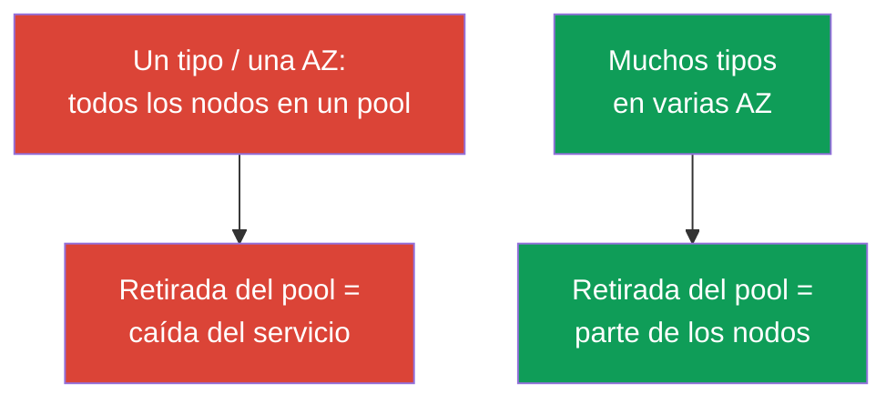
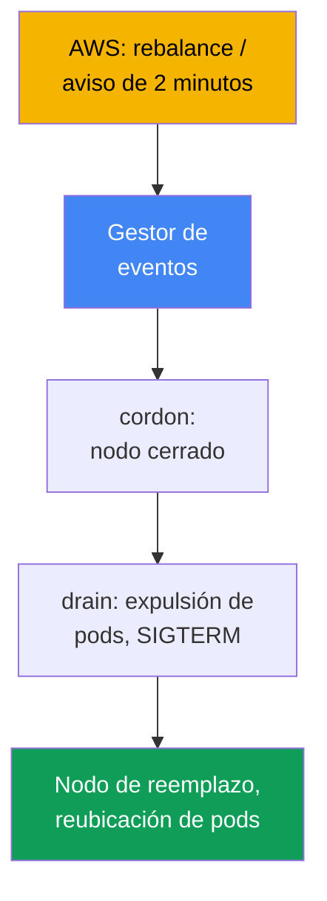
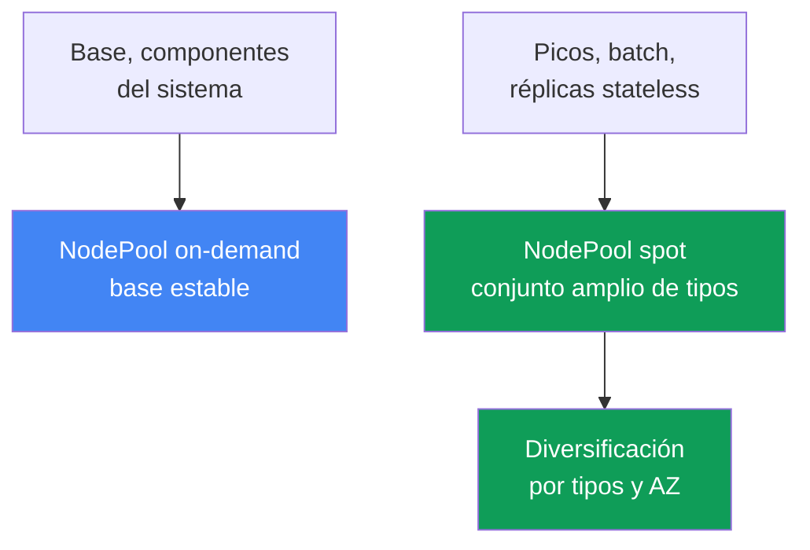

[Русская версия](ru.md) · [Eng version](en.md) · [Version française](fr.md) · [Deutsche Version](de.md) · [ქართული ვერსია](ge.md) · [繁體中文版](tw.md) · [日本語版](jp.md)
# Capítulo 13. Instancias spot: interrupciones, diversificación y gestión de eventos

> **Qué sigue.** Los autoescaladores se explican en el capítulo 11; la configuración de Karpenter (`NodePool`,
> `EC2NodeClass`, disruption, consolidation), en el capítulo 12. Ahora toca spot: capacidad barata
> que AWS puede retirar en cualquier momento, y cómo diseñar la carga para que una retirada no se convierta
> en un incidente. Los modelos de pago se cubren en el capítulo 0.4, el coste completo (Savings Plans,
> right-sizing, combinación) en el capítulo 43, el dimensionamiento en el capítulo 14 y la fiabilidad
> (PDB, topology spread) en el capítulo 40.

## 13.1. «La mitad de los nodos desapareció de golpe»

Durante el día, el clúster funcionaba de forma estable, pero de pronto la mitad de los nodos desapareció en
minutos. Los pods pasaron masivamente a `Pending`, el servicio se degradó y la persona de guardia no
entiende qué ocurrió: no hubo despliegue ni acciones manuales. La explicación es incómoda: todos los
nodos spot eran **del mismo tipo en la misma zona**, AWS necesitó esa capacidad y retiró todo el pool de
una vez.

```bash
kubectl get nodes -L karpenter.sh/capacity-type --sort-by=.metadata.creationTimestamp
kubectl get pods --field-selector status.phase=Pending -A
```

Hay otra versión más silenciosa del mismo problema. Se retiraron pocos nodos, el reemplazo se levantó
rápido, pero la aplicación igualmente perdió solicitudes: **no está preparada para una terminación
repentina**. Con spot, el proceso dispone de unos dos minutos, pero no captura la señal de parada, mantiene
conexiones largas o guarda la única copia del estado en el nodo, y la interrupción la pierde.

Ambos casos no significan que «spot no sea fiable», sino que spot exige un diseño diferente: la capacidad se
pide prestada a AWS, y el objetivo es que la retirada de un nodo o de un pool completo no afecte al servicio.

## 13.2. Qué es spot y las reglas del juego

Las instancias spot son capacidad EC2 disponible en ese momento con descuento frente a on-demand. El
precio es uno: **AWS puede retirar la instancia en cualquier momento** cuando necesite capacidad para la
demanda on-demand. La única diferencia de spot es que se interrumpe; por lo demás, es una instancia
normal. La estructura de costes (spot más barato, descuento variable) y el lugar de spot entre los modelos
de pago se explican en el capítulo 0.4.

AWS no retira una instancia sin avisar, sino que proporciona dos señales:

| Señal | Cuándo llega | Qué hacer |
|---|---|---|
| Rebalance recommendation | temprana, puede llegar antes del aviso de 2 minutos | mover la carga por adelantado |
| Spot interruption notice | exactamente 2 minutos antes de la detención o terminación | dar tiempo a retirar los pods correctamente |

El aviso de dos minutos es un hecho documentado y un límite estricto: unos 120 segundos para sacar la
carga. Según la documentación, la rebalance recommendation llega antes y da tiempo para mover la carga
por adelantado, sin esperar al plazo límite.

```bash
# El historial de precios y la volatilidad por tipo y zona se ven así:
aws ec2 describe-spot-price-history \
  --instance-types m5.large \
  --product-descriptions "Linux/UNIX" \
  --max-items 10
```

Conclusión: dos minutos es poco, y la retirada puede ser masiva. Por tanto, la protección se sostiene sobre
dos pilares a la vez: **diversificación** (no perderlo todo de una vez) y **preparación de la aplicación**
(sobrevivir a la pérdida de un nodo). Ningún pilar por sí solo basta.

## 13.3. El principio principal: diversificación

El error más común y costoso con spot es un **conjunto homogéneo**: un tipo de instancia en una zona. La
capacidad spot se retira por pools (pool = «tipo de instancia + zona»), y si toda la carga está en un pool,
su retirada se lleva todo de una vez. Es precisamente el antipatrón del capítulo 0.4.

La solución es la **diversificación**: muchos tipos de instancias en varias zonas. Así, la retirada de un
pool afecta solo a parte de la carga, no a todo el servicio. Cuanto más amplio sea el conjunto de tipos y
más zonas haya, menor será la probabilidad de que un evento de AWS retire una proporción crítica de los
nodos.



El sentido práctico es que una amplia selección de tipos sirve para la **resiliencia**, no para ahorrar en
una instancia. Un conjunto estrecho se convierte en incidentes; cómo definir uno amplio se explica a
continuación y en el capítulo 12.

## 13.4. Cómo ayuda Karpenter

Karpenter encaja bien con spot porque selecciona una instancia para los pods dentro de un amplio rango
permitido (capítulo 11), es decir, proporciona por sí mismo diversificación si se le permite. Basta con
abrir el tipo de capacidad `spot` y una lista amplia de tipos en `requirements`; Karpenter elegirá por sí
solo la instancia y la zona concretas.

```yaml
# Fragmento de NodePool: spot + conjunto amplio de tipos. Configuración completa: capítulo 12.
spec:
  template:
    spec:
      requirements:
        - key: karpenter.sh/capacity-type
          operator: In
          values: ["spot", "on-demand"]      # prioridad para spot, fallback a on-demand
        - key: karpenter.k8s.aws/instance-category
          operator: In
          values: ["c", "m", "r"]            # conjunto amplio = diversificación
        - key: topology.kubernetes.io/zone   # varias AZ también son diversificación
          operator: In
          values: ["eu-west-1a", "eu-west-1b", "eu-west-1c"]
```

Cuando se permiten ambos tipos de capacidad, Karpenter prefiere spot y recurre a on-demand cuando falta
capacidad spot (el orden de prioridad se explica en el capítulo 12). Un `requirements` estrecho de uno o
dos tipos anula el objetivo: para spot, vuelve a ser un conjunto homogéneo con interrupciones frecuentes.
La regla es simple: **para spot, el conjunto de tipos debe ser lo más amplio posible**. En la práctica, se
apunta a un mínimo de 3 a 5 familias de tamaños próximos (mediante
`karpenter.k8s.aws/instance-family` o `instance-category`): así, la interrupción de una familia no retira
todos los nodos de una vez.

La segunda parte de la ayuda es la **gestión de interrupciones**. AWS envía los eventos de retirada a
EventBridge, este los coloca en SQS y Karpenter lee la cola desde la configuración `interruptionQueue`:
al recibir el aviso, levanta un reemplazo por adelantado, aplica cordon y drena el nodo. La configuración de
la cola se explica en el capítulo 12: **Karpenter reacciona por sí mismo** si está configurada.

## 13.5. Gestión de eventos de interrupción

Veamos quién hace qué al recibir la señal. Hay dos eventos (sección 13.2): la rebalance recommendation
temprana y el interruption notice estricto de dos minutos. La reacción es la misma en esencia: **mover la
carga del nodo condenado antes de su retirada**: marcar el nodo (cordon), expulsar los pods (drain), dejar
que el autoescalador levante un reemplazo y reubicar los pods.



Quién es el gestor depende de cómo esté construido el clúster:

| Tipo de nodos | Quién gestiona la interrupción | Qué configura usted |
|---|---|---|
| EKS Auto Mode | el propio servicio | nada para las interrupciones |
| Karpenter propio | controlador de interrupciones de Karpenter | cola de interrupciones (capítulo 12) |
| Managed / self-managed sin Karpenter | AWS Node Termination Handler | instala y gestiona NTH |

**AWS Node Termination Handler (NTH)** es necesario para nodos managed y self-managed sin Karpenter. Hay
dos modos: IMDS (un agente en el nodo recibe el aviso de los metadatos) y Queue Processor (un controlador
lee eventos de SQS a través de EventBridge). Hace lo mismo: cordon, drain y retirada del nodo. **EKS Auto
Mode** gestiona las interrupciones por sí mismo, sin NTH ni configuración de cola de su parte (capítulo 9).

Es importante el límite de lo que puede hacer el gestor. Ante el aviso de dos minutos dispone de unos 120
segundos: puede aplicar cordon e iniciar el drenaje, pero los pods deben **terminar correctamente por sí
mismos**. El gestor inicia la expulsión, pero no sustituye la preparación de la aplicación: ni NTH ni
Karpenter pueden salvar una aplicación que no sabe terminar limpiamente.

## 13.6. Preparación de la aplicación para una interrupción

Dos minutos son un máximo, no una garantía: hay que diseñar para una terminación rápida. De ahí los
requisitos de la aplicación; los mecanismos generales de fiabilidad se explican en el capítulo 40, y aquí
se aplica a spot.

- **Graceful shutdown mediante SIGTERM.** Al expulsar un pod, Kubernetes le envía `SIGTERM` y espera
  `terminationGracePeriodSeconds`; después lo remata con `SIGKILL`. La aplicación debe capturarlo: dejar
  de aceptar solicitudes y cerrar conexiones. El periodo debe mantenerse por debajo de dos minutos.
- **PDB contra la expulsión masiva.** `PodDisruptionBudget` evita expulsar demasiadas réplicas a la vez
  durante un drenaje voluntario, pero **no protege frente a una retirada forzada**: si AWS retiró el nodo,
  los pods se van independientemente del PDB. La base son las réplicas y la diversificación (en detalle,
  capítulo 40).
- **No mantener el estado crítico solo en un nodo spot.** La única copia de datos en el disco de un nodo
  spot se pierde en la primera retirada. El estado se externaliza a almacenamiento replicado o a réplicas
  distribuidas entre zonas.
- **Checkpointing para batch.** Las tareas largas guardan periódicamente un resultado intermedio para que,
  tras la interrupción, continúen desde el punto de control y no desde cero.

```yaml
apiVersion: v1
kind: Pod
metadata:
  name: web
spec:
  terminationGracePeriodSeconds: 60   # ajustarse a la ventana spot de dos minutos
  containers:
    - name: app
      image: my-web:1.0
      lifecycle:
        preStop:
          exec:
            command: ["sh", "-c", "sleep 5"]   # dar tiempo al balanceador para retirar el tráfico
```

## 13.7. Qué cargas pueden ir a spot y cuáles no

La idoneidad para spot se determina con una pregunta: **¿puede la carga sobrevivir a la pérdida repentina
de un nodo?** La respuesta depende de las réplicas, la naturaleza del estado y la divisibilidad del trabajo.

| Carga | Spot | Por qué |
|---|---|---|
| Servicios stateless con varias réplicas | sí | la pérdida de una réplica la compensan las demás |
| Trabajos batch y CI con checkpointing | sí | reiniciar desde el punto de control es barato |
| Workers de colas (idempotentes) | sí | el mensaje no procesado volverá a la cola |
| Única réplica stateful sin replicación | no | retirada = pérdida de datos o indisponibilidad |
| Tarea larga indivisible sin checkpoint | con cautela | la interrupción obliga a volver al inicio |
| Componentes críticos del sistema | con cautela/no | se necesita una base on-demand estable |

Regla: **los stateless con margen de réplicas y el batch interrumpible son candidatos naturales para
spot**; las copias únicas stateful y la infraestructura crítica del sistema deben estar en on-demand o bajo
replicación estricta. Los casos intermedios se resuelven con checkpointing. El dimensionamiento de estas
cargas (`requests/limits`, densidad) se explica en el capítulo 14.

## 13.8. Estrategias mixtas: base on-demand más picos en spot

En la práctica, rara vez se usa «todo en spot» o «todo en on-demand». El patrón funcional es **mixto**: la
capacidad base, siempre necesaria, en on-demand; los picos variables y las cargas interrumpibles, en spot.
Así, la retirada de un pool spot afecta a la parte de pico, mientras que el núcleo del servicio permanece
sobre una base estable.

Esto se separa mediante **pools distintos**: un `NodePool` (o node group) on-demand para la base y los
componentes del sistema, y otro spot para lo interrumpible. Las cargas se dirigen al pool adecuado mediante
`nodeSelector`/`affinity` según la etiqueta de tipo de capacidad; si hace falta, el pool spot se restringe
con un taint.



Los pods se dirigen al tipo de capacidad mediante la etiqueta. En Karpenter es
`karpenter.sh/capacity-type` (`spot` u `on-demand`), mientras que en los nodos EKS también se encuentra
históricamente `eks.amazonaws.com/capacityType` (`SPOT`/`ON_DEMAND`); cuál usar depende de quién haya
creado el nodo.

```yaml
# Dirigir la carga interrumpible estrictamente a spot:
spec:
  nodeSelector:
    karpenter.sh/capacity-type: spot
```

```bash
# Comprobar qué tipo de capacidad tienen los nodos del clúster:
kubectl get nodes -L karpenter.sh/capacity-type -L eks.amazonaws.com/capacityType
```

Un inicio razonable: el mínimo de réplicas críticas de cada servicio se fija a on-demand, y el resto va a
spot. Incluso si se retira todo el pool spot, el servicio sigue activo en la capacidad base, y Karpenter
levanta un reemplazo (incluido el fallback a on-demand). El equilibrio de la proporción spot y on-demand
por costes se explica en el capítulo 43.

## 13.9. Diagnóstico y observabilidad

Lo primero que hay que aceptar durante la guardia es que **los nodos spot aparecen y desaparecen con más
frecuencia que los on-demand, y eso es normal**, no un incidente. El incidente ocurre cuando la retirada
degrada el servicio, no por el mero hecho de reemplazar un nodo.

```bash
kubectl get nodeclaims                                   # los nodos se recrean con frecuencia: es normal
kubectl get nodes -L karpenter.sh/capacity-type --sort-by=.metadata.creationTimestamp
kubectl logs -n kube-system -l app.kubernetes.io/name=karpenter | grep -i interrupt
```

Qué observar específicamente:

- **Frecuencia de interrupciones por pools.** Si crece mucho para un tipo, el conjunto es demasiado
  estrecho (sección 13.3); amplíe `requirements`.
- **Pods en `Pending` tras una retirada.** No se levanta el reemplazo: revise la capacidad y las
  prioridades del autoescalador (capítulos 11 y 12), no culpe a «spot malo».
- **Pico de errores al reemplazar un nodo.** Indica que la aplicación no está preparada (sección 13.6):
  no hay graceful shutdown, hay pocas réplicas o falta `preStop`.
- **Métricas de Karpenter.** Se exportan a Prometheus (capítulo 33); muestran el ritmo de interrupciones
  y reemplazos, lo que resulta útil para un dashboard y alertas ante un crecimiento anómalo.

Un clúster spot sano parece «ruidoso»: los nodos cambian y el servicio permanece estable. La tarea de la
observabilidad es detectar el momento en que el ruido pasa a ser una degradación.

## 13.10. Cómo se aplica en producción

- **Diversificar por defecto.** Para spot, mantenga un conjunto amplio de tipos y varias AZ; un conjunto
  homogéneo de un tipo en una zona se considera un error de configuración.
- **Separar la base y los picos por pools.** El mínimo crítico de réplicas y los componentes del sistema
  van en on-demand; lo interrumpible y los picos, en spot; se etiquetan mediante `capacity-type`.
- **Preparar las aplicaciones para la interrupción.** Son obligatorios la gestión de `SIGTERM`, un
  `terminationGracePeriodSeconds` razonable dentro de dos minutos y `preStop` para retirar el tráfico.
- **No colocar la única copia del estado en spot.** Los stateful sin replicación van en on-demand o se
  replican entre zonas; batch se implementa con checkpointing. PDB suaviza el drenaje voluntario, pero no
  detiene la retirada forzada: la base son las réplicas y la diversificación.
- **Distinguir el ruido del incidente.** No alerte por el reemplazo frecuente de nodos spot; alerte por la
  degradación del servicio, `Pending` atascados y un crecimiento anómalo de interrupciones en un pool.

## 13.11. Mini glosario

- **Instancia spot**: capacidad EC2 disponible con descuento que AWS puede retirar en cualquier momento
  cuando la necesite para demanda on-demand.
- **Spot interruption notice**: aviso de interrupción dos minutos antes de detener o terminar la
  instancia; el plazo estricto para una terminación correcta.
- **Rebalance recommendation**: señal temprana de mayor riesgo de retirada, que llega antes del aviso de
  dos minutos; permite mover la carga por adelantado.
- **Diversificación**: varios tipos de instancia en varias AZ para que la retirada de un pool no elimine
  una proporción crítica de nodos.
- **Pool spot**: combinación de «tipo de instancia + zona de disponibilidad»; la capacidad se retira por
  pools.
- **Node Termination Handler (NTH)**: componente de AWS para gestionar interrupciones en nodos managed y
  self-managed sin Karpenter; modos IMDS y Queue Processor.
- **capacity type**: tipo de capacidad del nodo (`spot`/`on-demand`); etiquetas
  `karpenter.sh/capacity-type` y `eks.amazonaws.com/capacityType`.

## 13.12. Resumen del capítulo

- Spot es capacidad EC2 con descuento que AWS retira cuando falta capacidad; la única diferencia respecto
  a on-demand es que spot se interrumpe (estructura de costes: capítulos 0.4 y 43).
- AWS proporciona dos señales: rebalance recommendation (temprana, puede llegar antes) e interruption
  notice (dos minutos estrictos hasta la retirada).
- La principal protección es la diversificación: muchos tipos en varias AZ. Un conjunto homogéneo de un
  tipo en una zona es un antipatrón: una retirada se lleva todo.
- Karpenter proporciona diversificación con `requirements` amplios y gestiona las interrupciones por sí
  mismo mediante la cola de interrupciones (detalles: capítulo 12); quién es el gestor depende del tipo de
  nodos (Karpenter, NTH o el propio Auto Mode).
- Dos minutos es poco: la aplicación debe poder hacer graceful shutdown mediante `SIGTERM`, no mantener la
  única copia del estado en spot, y batch debe implementar checkpointing. PDB suaviza, pero no protege de
  la retirada forzada (capítulo 40).
- En spot se ejecutan stateless con réplicas, batch interrumpible y workers idempotentes; las copias únicas
  stateful y la infraestructura crítica van en on-demand. El patrón funcional es mixto: base en on-demand,
  picos e interrumpibles en spot, separados por pools mediante la etiqueta capacity type.

## 13.13. Cómo será útil en el trabajo real

Durante la guardia, lo principal es no confundir lo normal con un incidente. El reemplazo frecuente de
nodos spot y los `nodeclaims` fugaces son comportamiento esperado. Hay que reaccionar a la degradación del
servicio: los `Pending` atascados tras una retirada apuntan a la capacidad y al autoescalador (capítulos 11
y 12); el pico de errores al reemplazar un nodo, a la preparación de la aplicación; el crecimiento de
interrupciones de un tipo, a la necesidad de ampliar el conjunto.

El capítulo evita dos extremos: «todo en spot para ahorrar» (una retirada masiva derriba el servicio) y
«spot es demasiado arriesgado» (se paga de más por on-demand excesivo). El punto medio es spot
diversificado para stateless y batch, más una base on-demand para el mínimo crítico y aplicaciones
preparadas para la terminación repentina.

## 13.14. Preguntas de autoevaluación

1. ¿En qué se diferencia una instancia spot de on-demand y por qué es más barata?
2. ¿Qué dos señales de interrupción proporciona AWS y en qué se diferencian?
3. ¿Cuánto tiempo da el aviso de dos minutos y por qué no se debe depender completamente de él?
4. ¿Qué es un pool spot y por qué un conjunto homogéneo de instancias es el principal error?
5. ¿Cómo reduce el riesgo la diversificación y cómo se define en Karpenter?
6. ¿Cómo gestiona Karpenter una interrupción y qué se debe configurar para ello?
7. ¿Quién gestiona la interrupción en nodos sin Karpenter y qué hace Auto Mode?
8. ¿Qué ocurre con un nodo y los pods al recibir un evento de interrupción?
9. ¿Qué debe saber hacer una aplicación para sobrevivir una interrupción de dos minutos?
10. ¿Protege PDB frente a una retirada spot forzada y por qué?
11. ¿Qué cargas se pueden enviar a spot y cuáles no, y según qué criterio?
12. ¿Cómo funciona una estrategia mixta y por qué el reemplazo frecuente de nodos spot es normal?

## Práctica

La práctica del curso para este tema: [práctica 111: nodos spot, diversificación, gestión de interrupciones,
graceful drain](../../labs/111/README_ES.MD). Además, el comportamiento de spot se puede observar en un
clúster activo. Comience con un inventario de capacidad:
`kubectl get nodes -L karpenter.sh/capacity-type -L eks.amazonaws.com/capacityType` mostrará qué nodos son
spot, cuáles son on-demand y si existe diversificación. Consulte `kubectl get nodeclaims` y ordene los
nodos por hora de creación para ver con qué frecuencia se reemplazan.

Después compruebe la preparación para las interrupciones. Tome un Deployment clave: ¿están definidos
`terminationGracePeriodSeconds`, `preStop` y PDB?, ¿cuántas réplicas hay y están distribuidas entre zonas?
Revise los registros del gestor de interrupciones
(`kubectl logs -n kube-system -l app.kubernetes.io/name=karpenter | grep -i interrupt`) y evalúe el «ruido»
normal de las retiradas. Revise por separado la práctica temprana de Karpenter del repositorio
([Karpenter](../../labs/02/README_ES.MD)): no forma parte del curso, pero el tema se relaciona.

---
[Índice](../README_ES.md) · [Capítulo 12](../12/es.md) · [Capítulo 14](../14/es.md)
