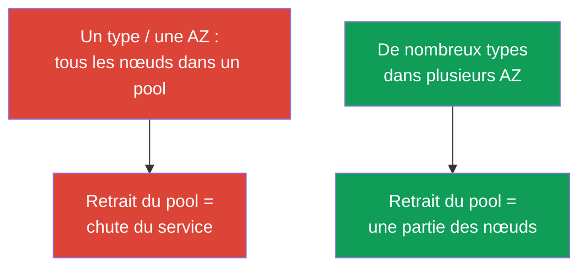
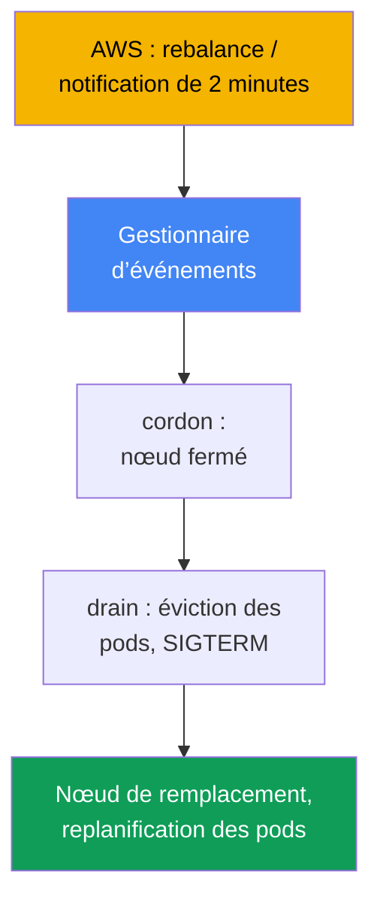
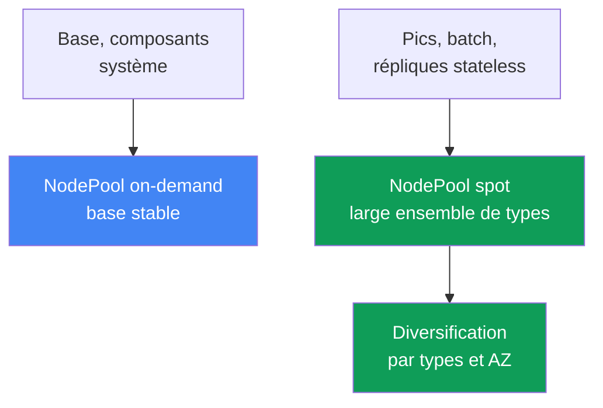

[Русская версия](ru.md) · [Eng version](en.md) · [Versión en español](es.md) · [Deutsche Version](de.md) · [ქართული ვერსია](ge.md) · [繁體中文版](tw.md) · [日本語版](jp.md)

# Chapitre 13. Instances spot : interruptions, diversification et traitement des événements

> **La suite.** Les autoscalers sont traités au chapitre 11, la configuration de Karpenter (`NodePool`,
> `EC2NodeClass`, disruption, consolidation) au chapitre 12. Nous abordons maintenant le spot : une capacité
> peu coûteuse qu’AWS peut reprendre à tout moment, et comment concevoir les charges afin qu’une reprise ne
> devienne pas un incident. Les modèles de tarification sont traités au chapitre 0.4, le coût global (Savings
> Plans, right-sizing, mix) au chapitre 43, le dimensionnement au chapitre 14 et la fiabilité (PDB, topology
> spread) au chapitre 40.

## 13.1. « La moitié des nœuds a disparu d’un coup »

Le cluster fonctionnait normalement pendant la journée, puis la moitié des nœuds a disparu en quelques minutes.
Les pods sont massivement passés à l’état `Pending`, le service s’est dégradé et la personne d’astreinte ne
comprend pas ce qui s’est passé : ni déploiement ni action manuelle. L’explication est déplaisante : tous les
nœuds spot étaient **d’un seul type dans une seule zone**, AWS a eu besoin de cette capacité et a repris tout le
pool d’un coup.

```bash
kubectl get nodes -L karpenter.sh/capacity-type --sort-by=.metadata.creationTimestamp
kubectl get pods --field-selector status.phase=Pending -A
```

Il existe une seconde variante, plus silencieuse, de la même douleur. Peu de nœuds ont été repris, le
remplacement a démarré rapidement, mais l’application a tout de même perdu des requêtes : elle **n’est pas prête
à un arrêt soudain**. Avec le spot, le processus dispose d’environ deux minutes, mais il n’intercepte pas le
signal d’arrêt, maintient de longues connexions ou conserve l’unique copie de l’état sur le nœud, et
l’interruption la fait perdre.

Ces deux cas ne signifient pas que « le spot n’est pas fiable », mais que le spot exige une autre conception :
la capacité est empruntée à AWS et l’objectif est que le retrait d’un nœud ou d’un pool entier ne mette pas le
service à terre.

## 13.2. Qu’est-ce que le spot et quelles sont les règles du jeu ?

Les instances spot sont de la capacité EC2 actuellement disponible, avec une réduction par rapport à
a l’on-demand. Le prix à payer est unique : **AWS peut reprendre l’instance à tout moment**, lorsque cette
capacité est nécessaire pour la demande on-demand. La seule différence du spot est qu’il peut être interrompu ;
pour le reste, c’est une instance ordinaire. La structure des coûts (spot moins cher, réduction variable) et la
place du spot parmi les modèles de tarification sont traitées au chapitre 0.4.

AWS ne reprend pas l’instance sans rien dire et émet deux signaux :

| Signal | Moment d’arrivée | Action à mener |
|---|---|---|
| Rebalance recommendation | précoce, peut arriver avant le préavis de 2 minutes | déplacer la charge à l’avance |
| Spot interruption notice | exactement 2 minutes avant l’arrêt ou la terminaison | avoir le temps de retirer proprement les pods |

Le préavis de deux minutes est un fait documenté et une limite stricte : environ 120 secondes pour retirer la
charge. D’après la documentation, la rebalance recommendation arrive plus tôt, ce qui laisse le temps de
déplacer la charge sans attendre l’échéance.

```bash
# L’historique des prix et la volatilité par type et par zone se consultent ainsi :
aws ec2 describe-spot-price-history \
  --instance-types m5.large \
  --product-descriptions "Linux/UNIX" \
  --max-items 10
```

Conclusion : deux minutes, c’est peu, et la reprise peut être massive. La protection repose donc simultanément
sur deux piliers : la **diversification** (ne pas tout perdre d’un coup) et la **préparation de l’application**
(survivre à la perte d’un nœud). Aucun pilier ne suffit seul.

## 13.3. Le principe principal : la diversification

L’erreur la plus fréquente et la plus coûteuse avec le spot est un **ensemble homogène** : un type d’instance
dans une zone. La capacité spot est reprise par pools (un pool = « type d’instance + zone ») ; si toute la charge
se trouve dans un pool, son retrait emporte tout d’un coup. C’est précisément l’antipattern du chapitre 0.4.

La solution est la **diversification** : de nombreux types d’instances dans plusieurs zones. Ainsi, le retrait
d’un pool ne touche qu’une partie de la charge, et non tout le service. Plus l’ensemble de types est large et
plus il y a de zones, moins un événement AWS a de chances de retirer une proportion critique des nœuds.



En pratique, un large choix de types sert la **résilience**, et non l’économie sur une instance. Un ensemble
restreint conduit aux incidents ; la façon de définir un ensemble large est décrite ci-dessous et au chapitre 12.

## 13.4. Comment Karpenter aide

Karpenter convient bien au spot car il sélectionne l’instance à partir des pods dans une large plage autorisée
(chapitre 11), ce qui assure lui-même la diversification si celle-ci est autorisée. Il suffit d’ouvrir dans
`requirements` le capacity type `spot` et une large liste de types ; Karpenter choisira lui-même l’instance et la
zone précises.

```yaml
# Extrait de NodePool : spot + large ensemble de types. Configuration complète au chapitre 12.
spec:
  template:
    spec:
      requirements:
        - key: karpenter.sh/capacity-type
          operator: In
          values: ["spot", "on-demand"]      # priorité au spot, repli vers on-demand
        - key: karpenter.k8s.aws/instance-category
          operator: In
          values: ["c", "m", "r"]            # ensemble large = diversification
        - key: topology.kubernetes.io/zone   # plusieurs AZ = aussi de la diversification
          operator: In
          values: ["eu-west-1a", "eu-west-1b", "eu-west-1c"]
```

Lorsque les deux capacity types sont autorisés, Karpenter préfère spot et se replie sur on-demand en cas de
manque de capacité spot (ordre de priorité au chapitre 12). Des `requirements` restreints à un ou deux types
annulent l’intérêt : pour le spot, cela revient à un ensemble homogène avec des interruptions fréquentes. La
règle est simple : **pour le spot, l’ensemble de types doit rester aussi large que possible**. En pratique, on
vise au minimum 3 à 5 familles de tailles proches (via `karpenter.k8s.aws/instance-family` ou
`instance-category`) : l’interruption d’une famille ne retire alors pas tous les nœuds à la fois.

La seconde aide est le **traitement des interruptions**. AWS envoie les événements de reprise à EventBridge, qui
les place dans SQS, et Karpenter lit la file définie par `interruptionQueue` : après réception de la notification,
il démarre un remplacement à l’avance, applique un cordon au nœud et le draine. La configuration de la file est
traitée au chapitre 12 : **Karpenter réagit lui-même** lorsqu’elle est configurée.

## 13.5. Traitement des événements d’interruption

Examinons qui fait quoi lors d’un signal. Il existe deux événements (section 13.2) : la rebalance recommendation
précoce et le strict interruption notice de deux minutes. La réaction est identique dans son principe :
**déplacer la charge du nœud condamné avant sa reprise** : marquer le nœud (cordon), évincer les pods (drain),
laisser l’autoscaler démarrer un remplacement et replanifier les pods.



Le gestionnaire dépend de la façon dont le cluster est construit :

| Type de nœuds | Qui traite l’interruption | Ce que vous configurez |
|---|---|---|
| EKS Auto Mode | le service lui-même | rien pour les interruptions |
| Votre propre Karpenter | contrôleur d’interruptions Karpenter | file d’interruptions (chapitre 12) |
| Managed / self-managed sans Karpenter | AWS Node Termination Handler | installer et gérer NTH |

**AWS Node Termination Handler (NTH)** est nécessaire pour les nœuds managed et self-managed sans Karpenter.
Il offre deux modes : IMDS (un agent sur le nœud intercepte la notification depuis les métadonnées) et Queue
Processor (un contrôleur lit les événements de SQS via EventBridge). Il fait la même chose : cordon, drain,
retrait du nœud. **EKS Auto Mode** traite lui-même les interruptions, sans NTH ni configuration de file de votre
part (chapitre 9).

Il est important de comprendre la limite des possibilités du gestionnaire. Avec le préavis de deux minutes, il
dispose d’environ 120 secondes : il aura le temps d’appliquer le cordon et de commencer le drain, mais les pods
doivent **eux-mêmes pouvoir partir proprement**. Le gestionnaire lance l’éviction, mais ne remplace pas la
préparation de l’application : si celle-ci ne sait pas s’arrêter proprement, ni NTH ni Karpenter ne la sauveront.

## 13.6. Préparation de l’application à l’interruption

Deux minutes sont un plafond, non une garantie : il faut prévoir un arrêt rapide. D’où les exigences envers
l’application ; les mécanismes généraux de fiabilité sont traités au chapitre 40, ici dans leur application au
spot.

- **Graceful shutdown sur SIGTERM.** Lors de l’éviction, Kubernetes envoie `SIGTERM` au pod et attend
  `terminationGracePeriodSeconds`, puis termine avec `SIGKILL`. L’application doit l’intercepter : cesser
  d’accepter les requêtes, fermer les connexions. La période doit rester inférieure à deux minutes.
- **PDB contre l’éviction massive.** Un `PodDisruptionBudget` empêche d’évincer trop de répliques à la fois lors
  d’un drain volontaire, mais **ne protège pas contre une éviction forcée** : si AWS reprend le nœud, les pods
  partent indépendamment du PDB. Les fondations sont les répliques et la diversification (détails au chapitre 40).
- **Ne pas conserver l’état critique uniquement sur un nœud spot.** L’unique copie des données sur le disque d’un
  nœud spot est perdue au premier retrait. L’état est placé dans un stockage répliqué ou sur des répliques
  réparties entre les zones.
- **Checkpointing pour le batch.** Les tâches longues sauvegardent périodiquement leur résultat intermédiaire afin
  de reprendre à un point de contrôle après une interruption, plutôt que depuis le début.

```yaml
apiVersion: v1
kind: Pod
metadata:
  name: web
spec:
  terminationGracePeriodSeconds: 60   # tenir dans la fenêtre spot de deux minutes
  containers:
    - name: app
      image: my-web:1.0
      lifecycle:
        preStop:
          exec:
            command: ["sh", "-c", "sleep 5"]   # laisser le temps au répartiteur de détourner le trafic
```

## 13.7. Quelles charges peuvent aller sur spot, et lesquelles ne le peuvent pas

L’adéquation au spot se détermine par une question : **la charge survivra-t-elle à la perte soudaine d’un nœud** ?
La réponse dépend des répliques, de la nature de l’état et de la divisibilité du travail.

| Charge | Spot | Pourquoi |
|---|---|---|
| Services stateless avec plusieurs répliques | oui | la perte d’une réplique est compensée par les autres |
| Jobs batch et CI avec checkpointing | oui | le redémarrage depuis le point de contrôle est peu coûteux |
| Workers de files (idempotents) | oui | le message non traité revient dans la file |
| Réplique unique stateful sans réplication | non | retrait = perte de données ou indisponibilité |
| Tâche longue indivisible sans checkpoint | avec prudence | l’interruption fait repartir du début |
| Composants système critiques | avec prudence/non | une base on-demand stable est nécessaire |

Règle : **le stateless avec une marge de répliques et le batch interruptible sont des candidats naturels au
spot** ; les copies uniques stateful et l’infrastructure système critique vont sur on-demand ou sous réplication
stricte. Le cas intermédiaire se résout par la présence de checkpointing. Le dimensionnement de ces charges
(requests/limits, densité) est traité au chapitre 14.

## 13.8. Stratégies mixtes : une base on-demand et des pics sur spot

En pratique, il est rare d’avoir « tout en spot » ou « tout en on-demand ». Le modèle efficace est **mixte** :
la capacité de base, toujours nécessaire, est en on-demand, tandis que les pics variables et les charges
interruptibles sont sur spot. Le retrait d’un pool spot touche alors la partie de pointe, tandis que le cœur du
service repose sur une base stable.

Cette séparation s’effectue avec des **pools distincts** : un `NodePool` (ou node group) on-demand pour la base
et les composants système, et un autre sur spot pour les charges interruptibles. Les charges sont dirigées vers
le pool approprié via `nodeSelector`/`affinity` selon le libellé du capacity type ; le pool spot peut être fermé
par un taint si nécessaire.



Les pods sont dirigés vers le type de capacité au moyen d’un libellé. Dans Karpenter, il s’agit de
`karpenter.sh/capacity-type` (`spot` ou `on-demand`) ; sur les nœuds EKS, on trouve aussi historiquement
`eks.amazonaws.com/capacityType` (`SPOT`/`ON_DEMAND`) : le choix dépend de celui qui a créé le nœud.

```yaml
# Diriger une charge interruptible strictement vers spot :
spec:
  nodeSelector:
    karpenter.sh/capacity-type: spot
```

```bash
# Vérifier le type de capacité des nœuds du cluster :
kubectl get nodes -L karpenter.sh/capacity-type -L eks.amazonaws.com/capacityType
```

Un départ raisonnable consiste à fixer le minimum de répliques critiques de chaque service à on-demand et à
placer le reste sur spot. Même si l’ensemble du pool spot est repris, le service reste vivant sur la capacité de
base, tandis que Karpenter démarre un remplacement (y compris en se repliant sur on-demand). L’équilibre entre
les proportions spot et on-demand en matière de coûts est traité au chapitre 43.

## 13.9. Diagnostic et observabilité

La première chose à accepter lors d’une astreinte : **les nœuds spot arrivent et partent plus souvent que les
nœuds on-demand, et c’est normal**, ce n’est pas un incident. L’incident survient lorsque la reprise fait tomber
le service, et non lors du simple remplacement d’un nœud.

```bash
kubectl get nodeclaims                                   # nœuds souvent recréés : c’est normal
kubectl get nodes -L karpenter.sh/capacity-type --sort-by=.metadata.creationTimestamp
kubectl logs -n kube-system -l app.kubernetes.io/name=karpenter | grep -i interrupt
```

Points précis à observer :

- **Fréquence des interruptions par pool.** Si elle augmente brutalement pour un type, l’ensemble est trop étroit
  (section 13.3) ; élargissez `requirements`.
- **Pods en `Pending` après une reprise.** Le remplacement ne démarre pas : examinez la capacité et les priorités
  de l’autoscaler (chapitres 11-12), plutôt que d’accuser un « mauvais spot ».
- **Pic d’erreurs lors du remplacement d’un nœud.** Il indique que l’application n’est pas prête (section 13.6) :
  pas de graceful shutdown, trop peu de répliques, pas de `preStop`.
- **Métriques Karpenter.** Elles sont exportées vers Prometheus (chapitre 33) ; elles montrent le rythme des
  interruptions et des remplacements, utile pour un tableau de bord et des alertes sur une hausse anormale.

Un cluster spot sain paraît « bruyant » : les nœuds changent, mais le service reste stable. L’objectif de
l’observabilité est de détecter le moment où le bruit devient dégradation.

## 13.10. Application en production

- **Diversifier par défaut.** Pour le spot, conservez un large ensemble de types et plusieurs AZ ; un ensemble
  homogène d’un seul type dans une zone est une erreur de configuration.
- **Séparer la base et les pics par pools.** Le minimum critique de répliques et les composants système sont sur
  on-demand, les charges interruptibles et les pics sur spot, avec marquage via `capacity-type`.
- **Préparer les applications aux interruptions.** La gestion de `SIGTERM`, un `terminationGracePeriodSeconds`
  raisonnable dans la limite de deux minutes et `preStop` pour détourner le trafic sont obligatoires.
- **Ne pas placer l’unique copie de l’état sur spot.** Le stateful sans réplication va sur on-demand ou est
  répliqué entre les zones ; le batch utilise le checkpointing. PDB atténue le drain volontaire, mais ne bloque
  pas une reprise forcée : les répliques et la diversification sont les fondations.
- **Distinguer le bruit de l’incident.** N’alertez pas sur la rotation fréquente des nœuds spot ; alertez sur la
  dégradation du service, les `Pending` bloqués et la croissance anormale des interruptions dans un pool.

## 13.11. Mini-glossaire

- **Instance spot** : capacité EC2 disponible à prix réduit, qu’AWS peut reprendre à tout moment lorsqu’elle est
  requise par la demande on-demand.
- **Spot interruption notice** : notification d’interruption deux minutes avant l’arrêt ou la terminaison de
  l’instance ; limite stricte pour un arrêt propre.
- **Rebalance recommendation** : signal précoce de risque accru de reprise, émis avant la notification de deux
  minutes ; il laisse le temps de déplacer la charge à l’avance.
- **Diversification** : ensemble de nombreux types d’instances dans plusieurs AZ, afin que le retrait d’un pool
  n’emporte pas une proportion critique des nœuds.
- **Pool spot** : association « type d’instance + zone de disponibilité » ; la capacité est reprise par pools.
- **Node Termination Handler (NTH)** : composant AWS qui traite les interruptions sur les nœuds managed et
  self-managed sans Karpenter ; modes IMDS et Queue Processor.
- **capacity type** : type de capacité du nœud (`spot`/`on-demand`) ; libellés
  `karpenter.sh/capacity-type` et `eks.amazonaws.com/capacityType`.

## 13.12. Résumé du chapitre

- Spot est une capacité EC2 à prix réduit qu’AWS reprend en cas de manque ; sa seule différence avec on-demand
  est qu’elle peut être interrompue (structure des coûts aux chapitres 0.4 et 43).
- AWS fournit deux signaux : rebalance recommendation (précoce, peut arriver plus tôt) et interruption notice
  (deux minutes strictes avant le retrait).
- La protection principale est la diversification : de nombreux types dans plusieurs AZ. Un ensemble homogène
  d’un type dans une zone est un antipattern : un retrait emporte tout.
- Karpenter assure la diversification par de larges `requirements` et traite lui-même les interruptions grâce à
  la file d’interruptions (détails au chapitre 12) ; le gestionnaire dépend du type de nœuds (Karpenter, NTH,
  ou Auto Mode lui-même).
- Deux minutes, c’est peu : l’application doit pouvoir effectuer un graceful shutdown sur `SIGTERM`, ne pas
  conserver l’unique copie de l’état sur spot et, pour le batch, utiliser le checkpointing. PDB atténue mais ne
  protège pas contre une reprise forcée (chapitre 40).
- Spot convient au stateless avec répliques, au batch interruptible et aux workers idempotents ; les copies
  uniques stateful et l’infrastructure critique vont sur on-demand. Le modèle efficace est mixte : base sur
  on-demand, pics et charges interruptibles sur spot, séparés par pools via le libellé capacity type.

## 13.13. Utilité dans le travail réel

Lors d’une astreinte, l’essentiel est de ne pas confondre le comportement normal avec un incident. La rotation
fréquente des nœuds spot et les `nodeclaims` qui apparaissent brièvement sont attendus. Il faut réagir à la
dégradation du service : des `Pending` bloqués après un retrait pointent vers la capacité et l’autoscaler
(chapitres 11-12) ; un pic d’erreurs durant le remplacement d’un nœud, vers la préparation de l’application ;
une hausse des interruptions pour un type, vers la nécessité d’élargir l’ensemble.

Le chapitre évite deux extrêmes : « tout sur spot pour économiser » (une reprise massive fait tomber le service)
et « spot est trop risqué » (on paie trop pour un surplus d’on-demand). Le juste milieu est du spot diversifié
pour le stateless et le batch, avec une base on-demand pour le minimum critique et des applications prêtes à un
arrêt soudain.

## 13.14. Questions d’auto-évaluation

1. En quoi une instance spot diffère-t-elle d’une instance on-demand et pourquoi est-elle moins chère ?
2. Quels sont les deux signaux d’interruption fournis par AWS et en quoi diffèrent-ils ?
3. Quel délai donne le préavis de deux minutes et pourquoi ne peut-on pas s’y fier entièrement ?
4. Qu’est-ce qu’un pool spot et pourquoi un ensemble homogène d’instances est-il l’erreur principale ?
5. Comment la diversification réduit-elle le risque et comment la définir dans Karpenter ?
6. Comment Karpenter traite-t-il une interruption et que faut-il configurer pour cela ?
7. Qui traite l’interruption sur les nœuds sans Karpenter et que fait Auto Mode ?
8. Que se passe-t-il pour le nœud et les pods lors de la réception d’un événement d’interruption ?
9. Que doit savoir faire l’application pour survivre à une interruption de deux minutes ?
10. PDB protège-t-il contre une reprise spot forcée et pourquoi ?
11. Quelles charges peuvent être envoyées sur spot, lesquelles ne le peuvent pas, et selon quel critère ?
12. Comment fonctionne une stratégie mixte et pourquoi la rotation fréquente des nœuds spot est-elle normale ?

## Pratique

Le lab du cours pour ce sujet : [lab 111 - Nœuds spot : diversification, traitement des interruptions, graceful
drain](../../labs/111/README_FR.MD). En plus de ce lab, le comportement du spot peut être observé sur un cluster
en fonctionnement. Commencez par l’inventaire de capacité :
`kubectl get nodes -L karpenter.sh/capacity-type -L eks.amazonaws.com/capacityType` indique quels nœuds sont
spot et lesquels sont on-demand, et s’il existe vraiment une diversification. Consultez `kubectl get nodeclaims`
et triez les nœuds par date de création : à quelle fréquence changent-ils ?

Vérifiez ensuite la préparation aux interruptions. Prenez un Deployment essentiel :
`terminationGracePeriodSeconds` est-il défini, y a-t-il un `preStop` et un PDB, combien existe-t-il de répliques
et sont-elles réparties entre les zones ? Consultez les logs du gestionnaire d’interruptions
(`kubectl logs -n kube-system -l app.kubernetes.io/name=karpenter | grep -i interrupt`) et évaluez le « bruit »
normal des reprises. Étudiez séparément le premier lab Karpenter du dépôt
([Karpenter](../../labs/02/README_FR.MD)) : il ne fait pas partie du cours, mais le sujet se recoupe.

---
[Table des matières](../README_FR.md) · [Chapitre 12](../12/fr.md) · [Chapitre 14](../14/fr.md)
