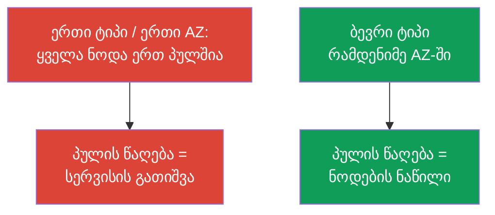
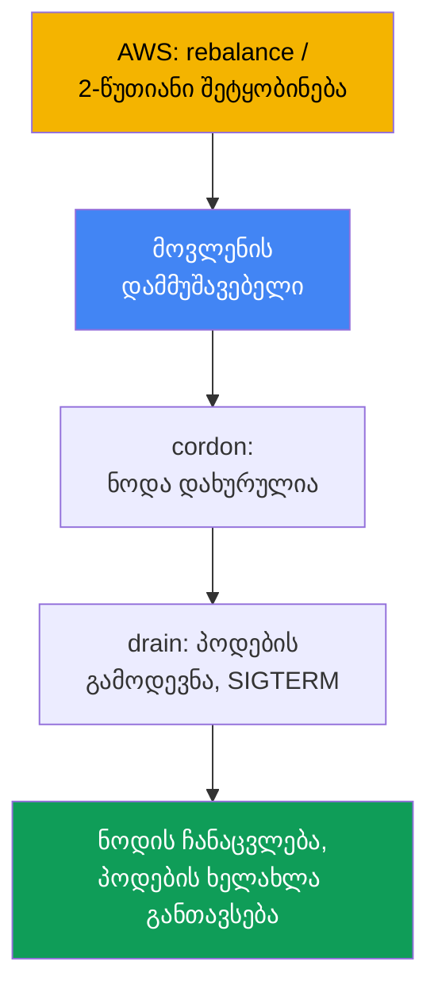
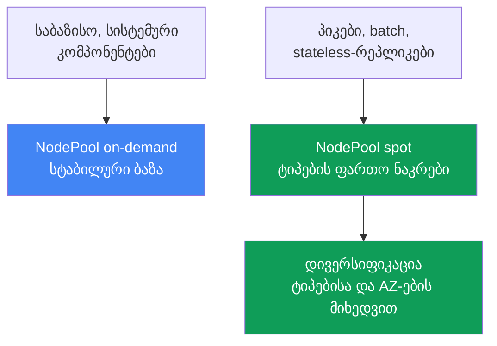

[Русская версия](ru.md) · [Eng version](en.md) · [Versión en español](es.md) · [Version française](fr.md) · [Deutsche Version](de.md) · [繁體中文版](tw.md) · [日本語版](jp.md)
# თავი 13. Spot-ინსტანსები: შეწყვეტები, დივერსიფიკაცია, მოვლენების დამუშავება

> **რა არის შემდეგ.** ავტოსკეილერები უკვე განვიხილეთ (თავი 11), Karpenter-ის კონფიგურაცია
> (`NodePool`, `EC2NodeClass`, disruption, consolidation) კი მე-12 თავშია. ახლა ვისაუბრებთ spot-ზე:
> იაფ სიმძლავრეზე, რომლის წაღებაც AWS-ს ნებისმიერ დროს შეუძლია, და იმაზე, თუ როგორ უნდა აიწყოს
> დატვირთვა, რომ სიმძლავრის წაღება ინციდენტად არ იქცეს. გადახდის მოდელები მე-0.4 თავშია, სრული
> ღირებულება (Savings Plans, right-sizing, მიქსი) მე-43 თავში, საიზინგი მე-14 თავში, საიმედოობა
> (PDB, topology spread) კი მე-40 თავში.

## 13.1. „ნოდების ნახევარი ერთდროულად გაქრა“

დღისით კლასტერი სტაბილურად მუშაობდა, შემდეგ კი ნოდების ნახევარი რამდენიმე წუთში გაქრა. პოდები
მასობრივად გადავიდა `Pending` მდგომარეობაში, სერვისის მუშაობა გაუარესდა, მორიგემ კი არ იცის,
რა მოხდა: არც deployment ყოფილა და არც ხელით შესრულებული მოქმედება. პასუხი არასასიამოვნოა:
ყველა spot-ნოდა **ერთი ტიპის იყო და ერთ ზონაში მდებარეობდა**, AWS-ს ეს სიმძლავრე დასჭირდა და
მთელი პული ერთდროულად წაიღო.

```bash
kubectl get nodes -L karpenter.sh/capacity-type --sort-by=.metadata.creationTimestamp
kubectl get pods --field-selector status.phase=Pending -A
```

არსებობს იმავე პრობლემის მეორე, უფრო ჩუმი ვარიანტიც. ცოტა ნოდა წაიღეს, შემცვლელი სწრაფად
გაეშვა, მაგრამ აპლიკაციამ მოთხოვნები მაინც დაკარგა: ის **უეცარი დასრულებისთვის მზად არ არის**.
Spot-ის შემთხვევაში პროცესს დაახლოებით ორი წუთი აქვს, მაგრამ ის გაჩერების სიგნალს არ ამუშავებს,
ხანგრძლივ კავშირებს ინარჩუნებს ან მდგომარეობის ერთადერთ ასლს ნოდაზე ინახავს და შეწყვეტისას
კარგავს.

ორივე შემთხვევა არა „spot არასაიმედოა“, არამედ იმას ნიშნავს, რომ spot განსხვავებულ პროექტირებას
მოითხოვს: სიმძლავრეს AWS-სგან სესხულობთ და ამოცანაა, ნოდის ან მთელი პულის გამოთხოვამ სერვისი არ
გათიშოს.

## 13.2. რა არის spot და როგორია თამაშის წესები

Spot-ინსტანსები EC2-ის ამჟამად თავისუფალი სიმძლავრეა, რომელიც on-demand-თან შედარებით
ფასდაკლებით იყიდება. სანაცვლოდ **AWS-ს შეუძლია ინსტანსი ნებისმიერ დროს წაიღოს**, როდესაც
სიმძლავრე on-demand-მოთხოვნისთვის დასჭირდება. Spot-ის ერთადერთი განსხვავება ისაა, რომ შეიძლება
შეწყდეს, სხვა მხრივ კი ჩვეულებრივი ინსტანსია. ღირებულების სტრუქტურა (spot უფრო იაფია,
ფასდაკლება ცვალებადია) და spot-ის ადგილი გადახდის მოდელებს შორის მე-0.4 თავშია.

AWS ინსტანსს გაფრთხილების გარეშე არ იღებს და ორ სიგნალს აგზავნის:

| სიგნალი | როდის მოდის | რა უნდა გააკეთოთ |
|---|---|---|
| Rebalance recommendation | ადრეულია, შეიძლება 2-წუთიან შეტყობინებაზე ადრე მოვიდეს | დატვირთვა წინასწარ გადაიტანოთ |
| Spot interruption notice | გაჩერებამდე ან დასრულებამდე ზუსტად 2 წუთით ადრე | პოდების კორექტულად მოხსნა მოასწროთ |

დოკუმენტაციით დადასტურებული ორწუთიანი შეტყობინება მკაცრი შეზღუდვაა: დატვირთვის გასატანად
დაახლოებით 120 წამი გაქვთ. დოკუმენტაციის მიხედვით, Rebalance recommendation უფრო ადრე მოდის და
დატვირთვის წინასწარ გატანის საშუალებას იძლევა, რათა ბოლო ვადას არ დაელოდოთ.

```bash
# ფასების ისტორია და ცვალებადობა ტიპისა და ზონის მიხედვით ასე ჩანს:
aws ec2 describe-spot-price-history \
  --instance-types m5.large \
  --product-descriptions "Linux/UNIX" \
  --max-items 10
```

დასკვნა: ორი წუთი ცოტაა, ხოლო სიმძლავრის წაღება შეიძლება მასობრივი იყოს. ამიტომ დაცვა
ერთდროულად ორ საყრდენს ეფუძნება: **დივერსიფიკაციას** (ყველაფერი ერთდროულად არ დაკარგოთ) და
**აპლიკაციის მზადყოფნას** (ნოდის დაკარგვას გაუძლოს). ცალ-ცალკე არც ერთი მათგანი საკმარისი არ არის.

## 13.3. მთავარი პრინციპი: დივერსიფიკაცია

Spot-თან დაკავშირებული ყველაზე ხშირი და ძვირი შეცდომაა **ერთგვაროვანი ნაკრები**: ერთი ტიპის
ინსტანსი ერთ ზონაში. Spot-სიმძლავრე პულების მიხედვით გამოითხოვება (პული = „ინსტანსის ტიპი +
ზონა“) და თუ მთელი დატვირთვა ერთ პულშია, მისი წაღება ყველაფერს ერთდროულად წაიღებს. ეს სწორედ
მე-0.4 თავში აღწერილი ანტიპატერნია.

გამოსავალია **დივერსიფიკაცია**: ბევრი ტიპის ინსტანსი რამდენიმე ზონაში. ამ შემთხვევაში პულის
წაღება დატვირთვის მხოლოდ ნაწილს შეეხება და არა მთელ სერვისს. რაც უფრო ფართოა ტიპების ნაკრები
და მეტია ზონა, მით ნაკლებია ალბათობა, რომ AWS-ის ერთი მოვლენა ნოდების კრიტიკულ ნაწილს გათიშავს.



პრაქტიკული აზრი: ტიპების ფართო არჩევანი **მდგრადობას** ემსახურება და არა ინსტანსზე ეკონომიას.
ვიწრო ნაკრები ინციდენტებს იწვევს; ფართო ნაკრების განსაზღვრა ქვემოთ და მე-12 თავშია აღწერილი.

## 13.4. როგორ გვეხმარება Karpenter

Karpenter spot-ს კარგად ერგება, რადგან პოდების მიხედვით ინსტანსს ფართო ნებადართული დიაპაზონიდან
ირჩევს (თავი 11), ანუ თუ ამის უფლებას მისცემთ, დივერსიფიკაციას თავად უზრუნველყოფს.
`requirements`-ში საკმარისია capacity type `spot` და ტიპების ფართო სია დაუშვათ, კონკრეტულ
ინსტანსსა და ზონას კი Karpenter თავად შეარჩევს.

```yaml
# NodePool-ის ფრაგმენტი: spot + ტიპების ფართო ნაკრები. სრული კონფიგურაცია მე-12 თავშია.
spec:
  template:
    spec:
      requirements:
        - key: karpenter.sh/capacity-type
          operator: In
          values: ["spot", "on-demand"]      # spot პრიორიტეტულია, on-demand-ზე დაბრუნებით
        - key: karpenter.k8s.aws/instance-category
          operator: In
          values: ["c", "m", "r"]            # ფართო ნაკრები = დივერსიფიკაცია
        - key: topology.kubernetes.io/zone   # რამდენიმე AZ ასევე დივერსიფიკაციაა
          operator: In
          values: ["eu-west-1a", "eu-west-1b", "eu-west-1c"]
```

როდესაც ორივე capacity type ნებადართულია, Karpenter უპირატესობას spot-ს ანიჭებს და
spot-სიმძლავრის უკმარისობისას on-demand-ზე გადადის (პრიორიტეტების თანმიმდევრობა მე-12 თავშია).
ერთი ან ორი ტიპით შეზღუდული `requirements` აზრს უკარგავს: spot-ისთვის ეს ხშირი შეწყვეტების
მქონე ერთგვაროვან ნაკრებთან დაბრუნებაა. წესი მარტივია: **spot-ისთვის ტიპების ნაკრები მაქსიმალურად
ფართო უნდა იყოს**. პრაქტიკაში ახლო ზომების სულ მცირე 3-5 ოჯახს იყენებენ
(`karpenter.k8s.aws/instance-family` ან `instance-category` საშუალებით): ამ შემთხვევაში ერთი
ოჯახის შეწყვეტა ყველა ნოდას ერთდროულად არ გათიშავს.

დახმარების მეორე ნაწილია **შეწყვეტების დამუშავება**. AWS სიმძლავრის წაღების მოვლენებს
EventBridge-ში აგზავნის, იქიდან ისინი SQS-ში ხვდება, Karpenter კი `interruptionQueue`
პარამეტრში მითითებულ რიგს კითხულობს: შეტყობინების მიღებისას წინასწარ უშვებს შემცვლელს, ნოდას
cordon მდგომარეობაში გადაიყვანს და drain-ს ასრულებს. რიგის კონფიგურაცია მე-12 თავშია:
**Karpenter თავად რეაგირებს**, თუ რიგი გამართულია.

## 13.5. შეწყვეტის მოვლენების დამუშავება

განვიხილოთ, ვინ რას აკეთებს სიგნალის მიღებისას. ორი მოვლენაა (სექცია 13.2): ადრეული rebalance
recommendation და მკაცრი ორწუთიანი interruption notice. რეაქციის არსი ორივე შემთხვევაში
ერთნაირია: **განწირული ნოდიდან დატვირთვა მის წაღებამდე გაიტანოთ**. ამისთვის ნოდა უნდა მოინიშნოს
(cordon), პოდები გამოიდევნოს (drain), ავტოსკეილერს შემცვლელის გაშვებისა და პოდების ხელახლა
განთავსების საშუალება მიეცეს.



ვინ არის დამმუშავებელი, კლასტერის მოწყობაზეა დამოკიდებული:

| ნოდების ტიპი | ვინ ამუშავებს შეწყვეტას | რას აკონფიგურირებთ თქვენ |
|---|---|---|
| EKS Auto Mode | თავად სერვისი | შეწყვეტებისთვის არაფერს |
| საკუთარი Karpenter | Karpenter-ის შეწყვეტების კონტროლერი | შეწყვეტების რიგს (თავი 12) |
| Managed / self-managed Karpenter-ის გარეშე | AWS Node Termination Handler | აყენებთ და მართავთ NTH-ს |

**AWS Node Termination Handler (NTH)** საჭიროა managed და self-managed ნოდებისთვის, როდესაც
Karpenter არ გამოიყენება. მას ორი რეჟიმი აქვს: IMDS (ნოდაზე გაშვებული აგენტი შეტყობინებას
მეტამონაცემებიდან იღებს) და Queue Processor (კონტროლერი მოვლენებს SQS-დან EventBridge-ის
საშუალებით კითხულობს). ის იმავეს აკეთებს: cordon, drain და ნოდის გამოტანა. **EKS Auto Mode**
შეწყვეტებს თავად ამუშავებს, თქვენი NTH-ისა და რიგის კონფიგურაციის გარეშე (თავი 9).

დამმუშავებლის შესაძლებლობების ზღვარი მნიშვნელოვანია. ორწუთიანი შეტყობინებისას მას დაახლოებით
120 წამი აქვს: ნოდის cordon მდგომარეობაში გადაყვანასა და drain-ის დაწყებას მოასწრებს, მაგრამ
**პოდებმა კორექტულად დასრულება თავად უნდა შეძლონ**. დამმუშავებელი გამოდევნას იწყებს, თუმცა
აპლიკაციის მზადყოფნას ვერ ჩაანაცვლებს. თუ აპლიკაციას სუფთად დასრულება არ შეუძლია, მას ვერც NTH
და ვერც Karpenter გადაარჩენს.

## 13.6. აპლიკაციის მზადყოფნა შეწყვეტისთვის

ორი წუთი ზედა ზღვარია და არა გარანტია, ამიტომ სწრაფ დასრულებაზე უნდა გათვალოთ. აქედან
გამომდინარეობს აპლიკაციის მოთხოვნები; საიმედოობის ზოგადი მექანიზმები მე-40 თავშია, აქ კი მათი
spot-თან გამოყენებაა აღწერილი.

- **Graceful shutdown `SIGTERM`-ის მიღებისას.** გამოდევნისას Kubernetes პოდს `SIGTERM`-ს
  უგზავნის და `terminationGracePeriodSeconds` დროის განმავლობაში ელოდება, შემდეგ კი `SIGKILL`-ით
  ასრულებს. აპლიკაციამ სიგნალი უნდა დაამუშაოს: ახალი მოთხოვნების მიღება შეწყვიტოს და კავშირები
  დახუროს. ეს პერიოდი ორ წუთზე ნაკლები უნდა იყოს.
- **PDB მასობრივი გამოდევნის წინააღმდეგ.** `PodDisruptionBudget` ნებაყოფლობითი drain-ის დროს
  ერთდროულად ბევრი რეპლიკის გამოდევნას არ დაუშვებს, მაგრამ **იძულებითი გამოდევნისგან ვერ
  დაგიცავთ**: თუ AWS-მა ნოდა წაიღო, პოდები PDB-ის მიუხედავად გაქრება. საყრდენია რეპლიკები და
  დივერსიფიკაცია (დეტალურად მე-40 თავში).
- **კრიტიკული მდგომარეობა მხოლოდ spot-ნოდაზე არ შეინახოთ.** spot-ნოდის დისკზე მონაცემების
  ერთადერთი ასლი პირველივე წაღებისას დაიკარგება. მდგომარეობა რეპლიცირებულ საცავში ან ზონებს
  შორის განაწილებულ რეპლიკებზე გადააქვთ.
- **Checkpointing batch-ისთვის.** ხანგრძლივი ამოცანები შუალედურ შედეგს პერიოდულად ინახავს,
  რათა შეწყვეტის შემდეგ მუშაობა საკონტროლო წერტილიდან გაგრძელდეს და არა თავიდან.

```yaml
apiVersion: v1
kind: Pod
metadata:
  name: web
spec:
  terminationGracePeriodSeconds: 60   # spot-ის ორწუთიან ფანჯარაში ჩატევა
  containers:
    - name: app
      image: my-web:1.0
      lifecycle:
        preStop:
          exec:
            command: ["sh", "-c", "sleep 5"]   # ბალანსერს ტრაფიკის გატანის დრო მიეცეს
```

## 13.7. რომელი დატვირთვა შეიძლება განთავსდეს spot-ზე და რომელი არა

Spot-ისთვის ვარგისიანობას ერთი კითხვა განსაზღვრავს: **გაუძლებს თუ არა დატვირთვა ნოდის უეცარ
დაკარგვას**. პასუხი დამოკიდებულია რეპლიკებზე, მდგომარეობის ხასიათსა და სამუშაოს დაყოფის
შესაძლებლობაზე.

| დატვირთვა | Spot | რატომ |
|---|---|---|
| Stateless-სერვისები რამდენიმე რეპლიკით | დიახ | დაკარგულ რეპლიკას დანარჩენები ანაცვლებს |
| Batch და CI-ამოცანები checkpointing-ით | დიახ | საკონტროლო წერტილიდან ხელახლა გაშვება იაფია |
| რიგის ვორკერები (იდემპოტენტური) | დიახ | დაუმუშავებელი შეტყობინება რიგში დაბრუნდება |
| ერთადერთი stateful-რეპლიკა რეპლიკაციის გარეშე | არა | წაღება = მონაცემების დაკარგვა ან შეფერხება |
| ხანგრძლივი განუყოფელი ამოცანა checkpoint-ის გარეშე | სიფრთხილით | შეწყვეტისას მუშაობა თავიდან იწყება |
| კრიტიკული სისტემური კომპონენტები | სიფრთხილით/არა | საჭიროა სტაბილური on-demand-საბაზისო სიმძლავრე |

წესი: **რეპლიკების მარაგის მქონე stateless და შეწყვეტადი batch spot-ის ბუნებრივი კანდიდატებია**;
stateful-ის ერთადერთი ასლები და კრიტიკული სისტემური ინფრასტრუქტურა on-demand-ზე უნდა იყოს ან
მკაცრად რეპლიცირდებოდეს. შუალედური შემთხვევები checkpointing-ის არსებობით გვარდება. ამ
დატვირთვების საიზინგი (requests/limits, სიმჭიდროვე) მე-14 თავშია.

## 13.8. შერეული სტრატეგიები: on-demand-საბაზისო სიმძლავრე და spot-პიკები

პრაქტიკაში იშვიათია „ყველაფერი spot-ზე“ ან „ყველაფერი on-demand-ზე“. სამუშაო შაბლონი
**შერეულია**: მუდმივად საჭირო საბაზისო სიმძლავრე on-demand-ზე, ცვალებადი პიკები და შეწყვეტადი
დატვირთვები კი spot-ზე. ამ შემთხვევაში spot-პულის წაღება პიკურ ნაწილს აზიანებს, სერვისის
ბირთვი კი სტაბილურ საბაზისო სიმძლავრეზე რჩება.

ამისთვის **ცალკე პულები** გამოიყენება: ერთი `NodePool` (ან node group) on-demand-ზე საბაზისო
დატვირთვისა და სისტემური კომპონენტებისთვის, მეორე კი spot-ზე შეწყვეტადი დატვირთვებისთვის.
დატვირთვები საჭირო პულში capacity type ნიშნულის მიხედვით `nodeSelector`/`affinity`-ის
საშუალებით მიემართება, spot-პული კი საჭიროების შემთხვევაში taint-ით იზღუდება.



პოდები სიმძლავრის ტიპზე ნიშნულის საშუალებით მიემართება. Karpenter-ში ეს არის
`karpenter.sh/capacity-type` (`spot` ან `on-demand`), EKS-ის ნოდებზე კი ისტორიულად გვხვდება
`eks.amazonaws.com/capacityType` (`SPOT`/`ON_DEMAND`). რომელი გამოიყენოთ, დამოკიდებულია იმაზე,
ვინ გაუშვა ნოდა.

```yaml
# შეწყვეტადი დატვირთვის მკაცრად spot-ზე მიმართვა:
spec:
  nodeSelector:
    karpenter.sh/capacity-type: spot
```

```bash
# კლასტერში ნოდების სიმძლავრის ტიპების შემოწმება:
kubectl get nodes -L karpenter.sh/capacity-type -L eks.amazonaws.com/capacityType
```

გონივრული საწყისი მიდგომაა თითოეული სერვისის რეპლიკების კრიტიკული მინიმუმის on-demand-ზე
დამაგრება, დანარჩენის კი spot-ზე განთავსება. მთელი spot-პულის წაღების შემთხვევაშიც სერვისი
საბაზისო სიმძლავრეზე აგრძელებს მუშაობას, Karpenter კი შემცვლელს უშვებს (მათ შორის on-demand-ზე
გადასვლით). spot-ისა და on-demand-ის წილების ხარჯების მიხედვით დაბალანსება მე-43 თავშია.

## 13.9. დიაგნოსტიკა და დაკვირვება

მორიგეობისას პირველ რიგში უნდა გაითვალისწინოთ: **spot-ნოდები on-demand-ნოდებზე ხშირად მოდის და
მიდის და ეს ნორმაა**, არა ინციდენტი. ინციდენტია, როდესაც სიმძლავრის წაღებამ სერვისი გათიშა და
არა თავად ნოდის ჩანაცვლების ფაქტი.

```bash
kubectl get nodeclaims                                   # ნოდების ხშირი ხელახლა შექმნა ნორმაა
kubectl get nodes -L karpenter.sh/capacity-type --sort-by=.metadata.creationTimestamp
kubectl logs -n kube-system -l app.kubernetes.io/name=karpenter | grep -i interrupt
```

რას უნდა დააკვირდეთ კონკრეტულად:

- **შეწყვეტების სიხშირე პულების მიხედვით.** თუ ერთ ტიპზე მკვეთრად იზრდება, ნაკრები ზედმეტად
  ვიწროა (სექცია 13.3); გააფართოეთ `requirements`.
- **პოდები `Pending` მდგომარეობაში წაღების შემდეგ.** თუ შემცვლელი არ იშვება, შეამოწმეთ
  ავტოსკეილერის სიმძლავრე და პრიორიტეტები (თავები 11-12) და არა „ცუდი spot“.
- **შეცდომების მკვეთრი ზრდა ნოდის ჩანაცვლებისას.** აპლიკაციის მოუმზადებლობაზე მიუთითებს
  (სექცია 13.6): არ არის graceful shutdown, რეპლიკები ცოტაა ან `preStop` არ არსებობს.
- **Karpenter-ის მეტრიკები.** ისინი Prometheus-ში ექსპორტირდება (თავი 33); მათი საშუალებით
  შეწყვეტებისა და ჩანაცვლებების ტემპი ჩანს, რაც ანომალიური ზრდის dashboard-ისა და alert-ების
  შესაქმნელად მოსახერხებელია.

ჯანმრთელი spot-კლასტერი „ხმაურიანად“ გამოიყურება: ნოდები იცვლება, სერვისი კი სტაბილურია.
დაკვირვების ამოცანაა იმ მომენტის აღმოჩენა, როდესაც ხმაური მუშაობის გაუარესებაში გადადის.

## 13.10. როგორ იყენებენ ამას production-ში

- **ნაგულისხმევად იყენებენ დივერსიფიკაციას.** Spot-ისთვის ტიპების ფართო ნაკრებსა და რამდენიმე
  AZ-ს იყენებენ; ერთ ზონაში ერთი ტიპისგან შემდგარი ერთგვაროვანი ნაკრები კონფიგურაციის შეცდომად
  ითვლება.
- **საბაზისო სიმძლავრესა და პიკებს პულებით აცალკევებენ.** რეპლიკების კრიტიკული მინიმუმი და
  სისტემური კომპონენტები on-demand-ზეა, შეწყვეტადი და პიკური დატვირთვა spot-ზე, ხოლო მარშრუტიზაცია
  `capacity-type`-ის საშუალებით ხდება.
- **აპლიკაციებს შეწყვეტისთვის ამზადებენ.** აუცილებელია `SIGTERM`-ის დამუშავება, გონივრული
  `terminationGracePeriodSeconds` ორწუთიან ფარგლებში და `preStop` ტრაფიკის გასატანად.
- **მდგომარეობის ერთადერთ ასლს spot-ზე არ ინახავენ.** Stateful რეპლიკაციის გარეშე on-demand-ზე
  თავსდება ან ზონების მიხედვით რეპლიცირდება; batch checkpointing-ით კეთდება. PDB ნებაყოფლობით
  drain-ს არბილებს, მაგრამ იძულებით წაღებას ვერ აჩერებს. საყრდენია რეპლიკები და დივერსიფიკაცია.
- **ხმაურს ინციდენტისგან განასხვავებენ.** spot-ნოდების ხშირ ცვლილებაზე alert არ იქმნება;
  alert იქმნება სერვისის გაუარესებაზე, გაჭედილ `Pending` მდგომარეობასა და ერთ პულზე შეწყვეტების
  ანომალიურ ზრდაზე.

## 13.11. მინი-ლექსიკონი

- **Spot-ინსტანსი** - EC2-ის თავისუფალი სიმძლავრე ფასდაკლებით, რომლის გამოთხოვაც AWS-ს
  ნებისმიერ დროს შეუძლია, როდესაც ის on-demand-მოთხოვნისთვის დასჭირდება.
- **Spot interruption notice** - შეწყვეტის შეტყობინება ინსტანსის გაჩერებამდე ან დასრულებამდე
  ორი წუთით ადრე; კორექტული დასრულების მკაცრი ვადა.
- **Rebalance recommendation** - სიმძლავრის წაღების გაზრდილი რისკის ადრეული სიგნალი, რომელიც
  ორწუთიან შეტყობინებაზე ადრე მოდის; დატვირთვის წინასწარ გატანის დროს გაძლევთ.
- **დივერსიფიკაცია** - რამდენიმე AZ-ში ბევრი ტიპის ინსტანსის გამოყენება, რათა ერთი პულის
  წაღებამ ნოდების კრიტიკული ნაწილი არ გათიშოს.
- **Spot-პული** - წყვილი „ინსტანსის ტიპი + ხელმისაწვდომობის ზონა“; სიმძლავრე პულების მიხედვით
  გამოითხოვება.
- **Node Termination Handler (NTH)** - AWS-ის კომპონენტი Karpenter-ის გარეშე managed და
  self-managed ნოდების შეწყვეტების დასამუშავებლად; აქვს IMDS და Queue Processor რეჟიმები.
- **capacity type** - ნოდის სიმძლავრის ტიპი (`spot`/`on-demand`); ნიშნულებია
  `karpenter.sh/capacity-type` და `eks.amazonaws.com/capacityType`.

## 13.12. თავის შეჯამება

- Spot არის EC2-ის ფასდაკლებული სიმძლავრე, რომელსაც AWS უკმარისობისას გამოითხოვს; on-demand-ისგან
  ერთადერთი განსხვავება შეწყვეტის შესაძლებლობაა (ღირებულების სტრუქტურა მე-0.4 და მე-43 თავებშია).
- AWS ორ სიგნალს აგზავნის: rebalance recommendation (ადრეულია, შეიძლება უფრო ადრე მოვიდეს) და
  interruption notice (სიმძლავრის წაღებამდე მკაცრად ორი წუთით ადრე).
- მთავარი დაცვა დივერსიფიკაციაა: ბევრი ტიპი რამდენიმე AZ-ში. ერთ ზონაში ერთი ტიპის ერთგვაროვანი
  ნაკრები ანტიპატერნია, რადგან ერთი წაღება ყველაფერს წაიღებს.
- Karpenter ფართო `requirements`-ით დივერსიფიკაციას უზრუნველყოფს და შეწყვეტებს თავად ამუშავებს
  შეწყვეტების რიგის საშუალებით (დეტალები მე-12 თავში); დამმუშავებელი ნოდების ტიპზეა დამოკიდებული
  (Karpenter, NTH ან თავად Auto Mode).
- ორი წუთი ცოტაა: აპლიკაციას `SIGTERM`-ის მიღებისას graceful shutdown უნდა შეეძლოს, spot-ზე
  მდგომარეობის ერთადერთ ასლს არ უნდა ინახავდეს, batch კი checkpointing-ით უნდა მუშაობდეს. PDB
  ზემოქმედებას არბილებს, მაგრამ იძულებითი წაღებისგან ვერ იცავს (თავი 40).
- Spot-ზე თავსდება რეპლიკებიანი stateless, შეწყვეტადი batch და იდემპოტენტური ვორკერები;
  stateful-ის ერთადერთი ასლები და კრიტიკული ინფრასტრუქტურა on-demand-ზე უნდა იყოს. სამუშაო
  შაბლონი შერეულია: საბაზისო სიმძლავრე on-demand-ზე, პიკები და შეწყვეტადი დატვირთვა spot-ზე,
  capacity type ნიშნულით განცალკევებულ პულებში.

## 13.13. როგორ გამოგადგებათ ეს რეალურ სამუშაოში

მორიგეობისას მთავარია ნორმა ინციდენტში არ აგერიოთ. spot-ნოდების ხშირი ცვლილება და გამოჩენილი
`nodeclaims` მოსალოდნელი ქცევაა. რეაგირება სერვისის გაუარესებაზეა საჭირო: წაღების შემდეგ
გაჭედილი `Pending` სიმძლავრისა და ავტოსკეილერის საკითხია (თავები 11-12); ნოდის ჩანაცვლებისას
შეცდომების მკვეთრი ზრდა აპლიკაციის მზადყოფნას უკავშირდება; ერთ ტიპზე შეწყვეტების ზრდა კი
ნაკრების გაფართოების სიგნალია.

ეს თავი ორი უკიდურესობისგან გიცავთ: „ეკონომიისთვის ყველაფერი spot-ზე“ (მასობრივი წაღება
სერვისს თიშავს) და „spot ზედმეტად სარისკოა“ (ჭარბი on-demand-ისთვის ზედმეტი ხარჯი). შუალედური
გზაა დივერსიფიცირებული spot stateless-ისა და batch-ისთვის, on-demand-საბაზისო სიმძლავრე
კრიტიკული მინიმუმისთვის და უეცარი დასრულებისთვის მომზადებული აპლიკაციები.

## 13.14. კითხვები თვითშემოწმებისთვის

1. რით განსხვავდება spot-ინსტანსი on-demand-ისგან და რატომ არის ის იაფი?
2. შეწყვეტის რომელ ორ სიგნალს აგზავნის AWS და რით განსხვავდება ისინი?
3. რამდენ დროს გაძლევთ ორწუთიანი შეტყობინება და რატომ არ შეიძლება მთელი დროის გამოყენებაზე
   გათვლა?
4. რა არის spot-პული და რატომ არის ინსტანსების ერთგვაროვანი ნაკრები მთავარი შეცდომა?
5. როგორ ამცირებს დივერსიფიკაცია რისკს და როგორ განისაზღვრება ის Karpenter-ში?
6. როგორ ამუშავებს Karpenter შეწყვეტას და რა უნდა გამართოთ ამისთვის?
7. ვინ ამუშავებს შეწყვეტას Karpenter-ის გარეშე ნოდებზე და რას აკეთებს Auto Mode?
8. რა ემართება ნოდასა და პოდებს შეწყვეტის მოვლენის მიღებისას?
9. რა უნდა შეეძლოს აპლიკაციას, რომ ორწუთიან შეწყვეტას გაუძლოს?
10. იცავს თუ არა PDB spot-ის იძულებითი წაღებისგან და რატომ?
11. რომელი დატვირთვების განთავსება შეიძლება spot-ზე, რომლის არა და რა კრიტერიუმით?
12. როგორ მუშაობს შერეული სტრატეგია და რატომ არის spot-ნოდების ხშირი ცვლილება ნორმა?

## პრაქტიკა

ამ თემის საკურსო ლაბაა [ლაბა 111 - Spot-ნოდები: დივერსიფიკაცია, შეწყვეტების დამუშავება, graceful
drain](../../labs/111/README_GE.MD). გარდა ამისა, spot-ის ქცევა ცოცხალ კლასტერშიც ჩანს. დაიწყეთ
სიმძლავრის ინვენტარიზაციით:
`kubectl get nodes -L karpenter.sh/capacity-type -L eks.amazonaws.com/capacityType` გაჩვენებთ,
რომელი ნოდებია spot, რომელი on-demand და არის თუ არა დივერსიფიკაცია. შეამოწმეთ
`kubectl get nodeclaims` და ნოდები შექმნის დროის მიხედვით დაალაგეთ, რათა გაიგოთ, რამდენად ხშირად
იცვლება ისინი.

შემდეგ შეწყვეტისთვის მზადყოფნა შეამოწმეთ. აირჩიეთ ძირითადი Deployment: განსაზღვრულია თუ არა
`terminationGracePeriodSeconds`, არსებობს თუ არა `preStop` და PDB, რამდენი რეპლიკაა და
განაწილებულია თუ არა ისინი ზონებს შორის. ნახეთ შეწყვეტების დამმუშავებლის ჟურნალები
(`kubectl logs -n kube-system -l app.kubernetes.io/name=karpenter | grep -i interrupt`) და
შეაფასეთ სიმძლავრის წაღების ნორმალური „ხმაური“. ცალკე განიხილეთ რეპოზიტორიის ადრინდელი
Karpenter-ის ლაბა ([Karpenter](../../labs/02/README_GE.MD)). ის კურსის ნაწილი არ არის, მაგრამ
თემები იკვეთება.

---
[სარჩევი](../README_GE.md) · [თავი 12](../12/ge.md) · [თავი 14](../14/ge.md)
