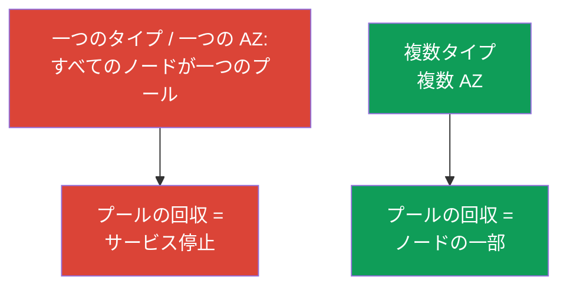
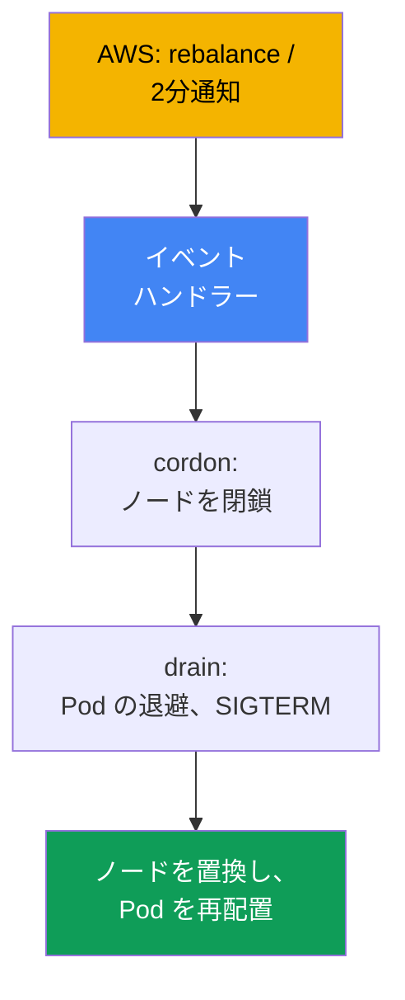
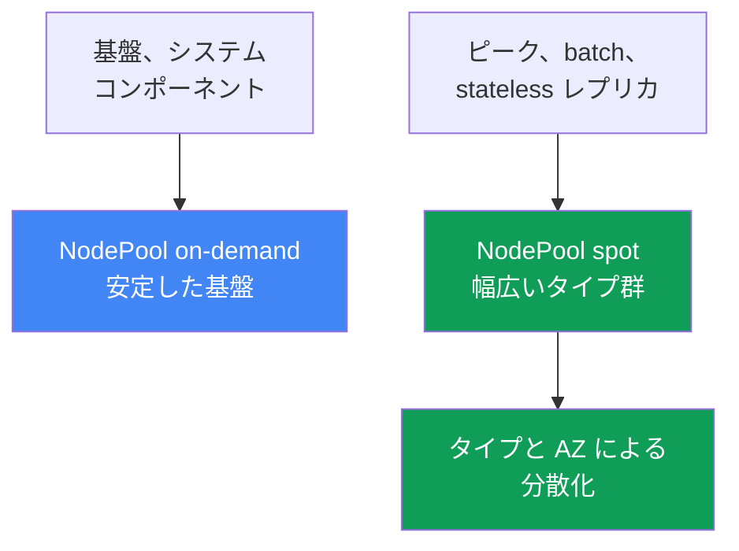

[English version](en.md) · [Versión en español](es.md) · [Version française](fr.md) · [Deutsche Version](de.md) · [ქართული ვერსია](ge.md) · [Русская версия](ru.md) · [繁體中文版](tw.md)
# 第13章 Spot インスタンス: 中断、分散化、イベント処理

> **この後。** オートスケーラーは第11章で、Karpenter の設定（`NodePool`、`EC2NodeClass`、disruption、consolidation）は第12章で扱いました。ここでは Spot、すなわち AWS がいつでも回収できる安価なキャパシティと、回収をインシデントにしないワークロード設計を扱います。料金モデルは第0.4章、コスト全体（Savings Plans、right-sizing、ミックス）は第43章、サイジングは第14章、信頼性（PDB、topology spread）は第40章を参照してください。

## 13.1. 「ノードの半分が一度に消えた」

日中、クラスタは安定して動作していましたが、その後数分でノードの半分が消えました。Pod は大量に `Pending` になり、サービスは低下し、当番者は何が起きたのかわかりません。デプロイも手動操作もありませんでした。原因は単純です。すべての Spot ノードが**一つの AZ の一つのタイプ**で、AWS がそのキャパシティを必要とし、プール全体を一度に回収したのです。

```bash
kubectl get nodes -L karpenter.sh/capacity-type --sort-by=.metadata.creationTimestamp
kubectl get pods --field-selector status.phase=Pending -A
```

同じ問題には、もう一つ静かな形があります。回収されたノードは少なく、置換ノードもすぐ起動したのに、アプリケーションはリクエストを落としました。**突然の終了に備えていない**ためです。Spot ではプロセスに約2分しかなく、停止シグナルを捕捉しない、長時間接続を維持する、または状態の唯一のコピーをノードに置くと、中断によってそれを失います。

どちらも「Spot は信頼できない」という話ではありません。Spot には異なる設計が必要です。キャパシティは AWS から借りているものであり、ノードまたはプール全体の回収がサービスを停止させないようにすることが課題です。

## 13.2. Spot とは何か、そしてそのルール

Spot インスタンスは、現在利用可能な EC2 の余剰キャパシティを on-demand より割安で利用するものです。対価は一つです。**on-demand の需要にキャパシティが必要になると、AWS はいつでもインスタンスを回収できます**。Spot は中断され得ることだけが異なり、それ以外は通常のインスタンスです。コスト構造（Spot の方が安く、割引は変動する）と料金モデルにおける Spot の位置は第0.4章を参照してください。

AWS は黙ってインスタンスを回収するのではなく、二つのシグナルを送ります。

| シグナル | 到着タイミング | 実施すること |
|---|---|---|
| Rebalance recommendation | 早期。2分通知より前に来る可能性がある | 事前にワークロードを退避する |
| Spot interruption notice | 停止または終了のちょうど2分前 | Pod を正常に退避する時間を確保する |

2分通知はドキュメントで確認された事実であり、厳格な制約です。負荷を退避する時間は約120秒です。ドキュメントによると rebalance recommendation はより早く届くため、期限を待たずに事前にワークロードを退避できます。

```bash
# タイプおよびゾーンごとの価格履歴と変動性は次のように確認できる:
aws ec2 describe-spot-price-history \
  --instance-types m5.large \
  --product-descriptions "Linux/UNIX" \
  --max-items 10
```

結論として、2分は短く、回収は大規模になることがあります。したがって保護は、**分散化**（すべてを一度に失わない）と**アプリケーションの準備**（ノード喪失に耐える）の二本柱で構成されます。片方だけでは十分ではありません。

## 13.3. 最も重要な原則: 分散化

Spot で最も頻繁かつ高コストな失敗は、**均質な構成**、つまり一つの AZ に一つのインスタンスタイプだけを置くことです。Spot キャパシティはプール単位（プール = 「インスタンスタイプ + AZ」）で回収されます。すべてのワークロードが一つのプールにある場合、その回収によりすべてを一度に失います。これは第0.4章で扱ったアンチパターンです。

解決策は**分散化**です。複数の AZ に多くのインスタンスタイプを配置します。そうすれば一つのプールの回収はサービス全体ではなく、ワークロードの一部にしか影響しません。タイプの選択肢と AZ が多いほど、一つの AWS イベントがノードの重大な割合を失わせる確率は低くなります。



実務的な意味では、幅広いタイプの選択は、インスタンスの節約ではなく**耐性**のためです。狭い構成はインシデントにつながります。広く指定する方法は以下および第12章で扱います。

## 13.4. Karpenter が役立つ理由

Karpenter は、許可された広い範囲から Pod に適したインスタンスを選択するため、Spot とよく組み合わさります（第11章）。つまり、許可すれば Karpenter 自身が分散化を実現します。`requirements` で capacity type `spot` と幅広いタイプのリストを許可すれば、具体的なインスタンスと AZ は Karpenter が選択します。

```yaml
# NodePool の断片: Spot + 幅広いタイプ群。完全な設定は第12章。
spec:
  template:
    spec:
      requirements:
        - key: karpenter.sh/capacity-type
          operator: In
          values: ["spot", "on-demand"]      # Spot を優先し、on-demand にフォールバック
        - key: karpenter.k8s.aws/instance-category
          operator: In
          values: ["c", "m", "r"]            # 幅広い選択肢 = 分散化
        - key: topology.kubernetes.io/zone   # 複数 AZ も分散化
          operator: In
          values: ["eu-west-1a", "eu-west-1b", "eu-west-1c"]
```

両方の capacity type を許可すると、Karpenter は Spot を優先し、Spot キャパシティが不足した場合は on-demand にフォールバックします（優先順位は第12章）。一つか二つのタイプだけに絞る `requirements` は意義を失わせます。Spot では頻繁な中断を招く均質な構成への逆戻りです。ルールは単純です。**Spot ではタイプの選択肢を可能な限り広く保ちます**。実務では、近いサイズのファミリーを少なくとも3から5個（`karpenter.k8s.aws/instance-family` または `instance-category` により）対象にします。そうすれば、一つのファミリーの中断で全ノードを一度に失うことはありません。

もう一つの支援は**中断処理**です。AWS は回収イベントを EventBridge に送信し、EventBridge はそれを SQS に配置します。Karpenter は `interruptionQueue` 設定からキューを読み取り、通知を受けると事前に置換ノードを起動し、ノードを cordon して drain します。キューの設定は第12章を参照してください。設定されていれば、**Karpenter が自ら応答します**。

## 13.5. 中断イベントの処理

シグナルを受けたときに誰が何をするかを見ていきます。イベントは二つあります（13.2節）。早期の rebalance recommendation と、厳格な2分間の interruption notice です。意味する対応は同じで、**回収前に運命づけられたノードからワークロードを退避する**ことです。ノードをマークし（cordon）、Pod を退避させ（drain）、オートスケーラーに置換ノードの起動と Pod の再配置を行わせます。



どのハンドラーを使うかは、クラスタの構成によって異なります。

| ノードの種類 | 中断を処理するもの | 自身で設定するもの |
|---|---|---|
| EKS Auto Mode | サービス自体 | 中断処理では何も不要 |
| 独自の Karpenter | Karpenter の中断コントローラー | 中断キュー（第12章） |
| Karpenter なしの managed / self-managed | AWS Node Termination Handler | NTH をインストール・運用する |

**AWS Node Termination Handler（NTH）**は、Karpenter を使用しない managed および self-managed ノードに必要です。モードは二つあります。IMDS（ノード上のエージェントがメタデータから通知を取得する）と Queue Processor（コントローラーが EventBridge 経由で SQS のイベントを読み取る）です。どちらも同じことを行います。cordon、drain、ノードの退避です。**EKS Auto Mode** は NTH やキュー設定なしに、中断を自ら処理します（第9章）。

ハンドラーの能力の境界は重要です。2分通知では約120秒しかありません。cordon して drain を開始することはできますが、**Pod 自身が正常に終了しなければなりません**。ハンドラーは退避を開始しますが、アプリケーションの準備に代わるものではありません。正常に終了できないアプリケーションは、NTH でも Karpenter でも救えません。

## 13.6. アプリケーションの中断への備え

2分は上限であり保証ではありません。迅速な終了を前提に設計する必要があります。そこからアプリケーションの要件が導かれます。一般的な信頼性の仕組みは第40章で扱い、ここでは Spot への適用を扱います。

- **SIGTERM による graceful shutdown。** Kubernetes は退避時に Pod へ `SIGTERM` を送信し、`terminationGracePeriodSeconds` の間待った後に `SIGKILL` します。アプリケーションはこれを捕捉し、リクエストの受け付けを止め、接続を閉じる必要があります。期間は2分未満に保ちます。
- **大量退避に対する PDB。** `PodDisruptionBudget` は自発的な drain において同時に退避されるレプリカ数を制限しますが、**強制的な回収からは守りません**。AWS がノードを回収すると、Pod は PDB にかかわらず停止します。基盤となるのはレプリカと分散化です（詳細は第40章）。
- **重要な状態を Spot ノードだけに保持しない。** Spot ノードのディスク上にある唯一のデータコピーは、最初の回収で失われます。状態はレプリケーションされたストレージか、AZ をまたいで分散したレプリカに置きます。
- **batch の checkpointing。** 長時間タスクは中間結果を定期的に保存し、中断後に最初からではなくチェックポイントから再開できるようにします。

```yaml
apiVersion: v1
kind: Pod
metadata:
  name: web
spec:
  terminationGracePeriodSeconds: 60   # Spot の2分間の枠内に収める
  containers:
    - name: app
      image: my-web:1.0
      lifecycle:
        preStop:
          exec:
            command: ["sh", "-c", "sleep 5"]   # ロードバランサーがトラフィックを退避する時間を与える
```

## 13.7. Spot に適したワークロードと適さないワークロード

Spot への適性は一つの問いで決まります。**ワークロードは突然のノード喪失に耐えられるか**。答えはレプリカ、状態の性質、処理の分割可能性に依存します。

| ワークロード | Spot | 理由 |
|---|---|---|
| 複数レプリカを持つ stateless サービス | 可 | 他のレプリカが失われたレプリカを補う |
| checkpointing を行う batch と CI ジョブ | 可 | チェックポイントからの再起動が安価 |
| キューのワーカー（冪等） | 可 | 未処理メッセージはキューへ戻る |
| レプリケーションなしの単一レプリカ stateful | 不可 | 回収 = データ損失または停止 |
| checkpoint のない長時間の分割不能タスク | 注意 | 中断により最初からやり直しになる |
| 重要なシステムコンポーネント | 注意/不可 | 安定した on-demand 基盤が必要 |

ルールは次のとおりです。**十分なレプリカを持つ stateless と中断可能な batch は、Spot の自然な候補です**。唯一の stateful コピーと重要なシステム基盤は on-demand に置くか、強力にレプリケーションします。その中間は checkpointing により解決できます。これらのワークロードのサイジング（requests/limits、密度）は第14章を参照してください。

## 13.8. 混合戦略: on-demand の基盤に Spot のピークを加える

実務では「すべて Spot」または「すべて on-demand」になることはほとんどありません。有効なパターンは**混合**です。常に必要な基礎キャパシティは on-demand に置き、変動するピークと中断可能なワークロードは Spot に置きます。これにより Spot プールの回収はピーク部分に影響しますが、サービスの中核は安定した基盤に残ります。

これは**別のプール**で分離します。一つの `NodePool`（または node group）を基盤とシステムコンポーネント向け on-demand に、別のものを中断可能なワークロード向け Spot にします。ワークロードは capacity type ラベルによる `nodeSelector`/`affinity` を通じて必要なプールへ向け、必要であれば Spot プールを taint で閉じます。



Pod を capacity type に向けるにはラベルを使います。Karpenter では `karpenter.sh/capacity-type`（`spot` または `on-demand`）です。EKS ノードでは歴史的に `eks.amazonaws.com/capacityType`（`SPOT`/`ON_DEMAND`）も使われます。どちらを使うかはノードを起動したものによります。

```yaml
# 中断可能なワークロードを Spot のみに向ける:
spec:
  nodeSelector:
    karpenter.sh/capacity-type: spot
```

```bash
# クラスタ内のノードがどの capacity type か確認する:
kubectl get nodes -L karpenter.sh/capacity-type -L eks.amazonaws.com/capacityType
```

妥当な出発点は、各サービスの重要な最小レプリカを on-demand に固定し、残りを Spot に置くことです。Spot プール全体が回収されても、サービスは基礎キャパシティで稼働し、Karpenter が置換ノードを起動します（on-demand へのフォールバックを含む）。コストにおける Spot と on-demand の比率は第43章を参照してください。

## 13.9. 診断とオブザーバビリティ

当番時にまず受け入れるべきことは、**Spot ノードは on-demand より頻繁に現れたり消えたりするが、これは正常である**ということです。インシデントはノードの置換そのものではなく、回収がサービスを低下させた場合です。

```bash
kubectl get nodeclaims                                   # ノードが頻繁に再作成されるのは正常
kubectl get nodes -L karpenter.sh/capacity-type --sort-by=.metadata.creationTimestamp
kubectl logs -n kube-system -l app.kubernetes.io/name=karpenter | grep -i interrupt
```

具体的には次を確認します。

- **プールごとの中断頻度。** 一つのタイプで急増している場合、選択肢が狭すぎます（13.3節）。`requirements` を広げます。
- **回収後に `Pending` となる Pod。** 置換ノードが起動しない場合は、「悪い Spot」と考えるのではなく、キャパシティとオートスケーラーの優先順位を確認します（第11から12章）。
- **ノード置換時のエラー急増。** アプリケーションの準備不足（13.6節）を示します。graceful shutdown がない、レプリカが少ない、`preStop` がないといった問題です。
- **Karpenter メトリクス。** Prometheus にエクスポートされます（第33章）。中断と置換の頻度を確認でき、異常な増加に対するダッシュボードとアラートに便利です。

健全な Spot クラスタは「騒がしく」見えます。ノードは入れ替わりますが、サービスは安定しています。オブザーバビリティの目的は、その騒がしさが低下に変わる瞬間を捉えることです。

## 13.10. 本番環境での適用方法

- **デフォルトで分散化する。** Spot では幅広いタイプ群と複数の AZ を維持します。一つの AZ に一つのタイプだけの均質な構成は設定ミスとみなします。
- **基盤とピークをプールで分離する。** 重要な最小レプリカとシステムコンポーネントは on-demand に、中断可能なものとピークは Spot に置き、`capacity-type` で分類します。
- **アプリケーションを中断に備えさせる。** `SIGTERM` の処理、2分以内の妥当な `terminationGracePeriodSeconds`、トラフィックを退避するための `preStop` が必須です。
- **状態の唯一のコピーを Spot に置かない。** レプリケーションなしの stateful は on-demand に置くか、AZ をまたいでレプリケーションします。batch は checkpointing を実装します。PDB は自発的な drain を緩和しますが、強制回収は止められません。レプリカと分散化が基盤です。
- **ノイズとインシデントを区別する。** Spot ノードの頻繁な入れ替わりにはアラートを出しません。サービス低下、継続する `Pending`、一つのプールでの中断の異常増加にアラートを出します。

## 13.11. ミニ用語集

- **Spot インスタンス**: 割安な EC2 の余剰キャパシティ。on-demand の需要に必要になると AWS がいつでも回収できます。
- **Spot interruption notice**: インスタンスの停止または終了の2分前に送られる中断通知。正常終了のための厳格な時間枠です。
- **Rebalance recommendation**: 回収リスクが高まったことを示す早期シグナル。2分通知より前に届き、事前にワークロードを退避する時間を与えます。
- **分散化**: 一つのプールの回収でノードの重大な割合を失わないよう、複数の AZ に多くのインスタンスタイプを配置することです。
- **Spot プール**: 「インスタンスタイプ + アベイラビリティーゾーン」の組み合わせ。キャパシティはプール単位で回収されます。
- **Node Termination Handler（NTH）**: Karpenter を使わない managed および self-managed ノードで中断を処理する AWS コンポーネント。IMDS と Queue Processor モードがあります。
- **capacity type**: ノードのキャパシティタイプ（`spot`/`on-demand`）。ラベルは `karpenter.sh/capacity-type` と `eks.amazonaws.com/capacityType` です。

## 13.12. 本章のまとめ

- Spot は割安な EC2 キャパシティであり、AWS はキャパシティ不足時に回収します。on-demand との唯一の違いは Spot が中断されることです（コスト構造は第0.4章と第43章）。
- AWS は二つのシグナルを送ります。rebalance recommendation（早期で、より前に来る可能性がある）と interruption notice（回収まで厳格に2分）です。
- 最も重要な保護は分散化です。複数の AZ に多くのタイプを置きます。一つの AZ に一つのタイプという均質な構成はアンチパターンであり、一度の回収ですべてを失います。
- Karpenter は幅広い `requirements` により分散化を実現し、中断キューを通じて中断を自ら処理します（詳細は第12章）。どのハンドラーを使うかはノードタイプに依存します（Karpenter、NTH、Auto Mode 自身）。
- 2分は短い時間です。アプリケーションは `SIGTERM` による graceful shutdown ができ、状態の唯一のコピーを Spot に置かず、batch は checkpointing を行う必要があります。PDB は緩和しますが、強制回収からは守りません（第40章）。
- Spot にはレプリカを持つ stateless、中断可能な batch、冪等なワーカーを置きます。唯一の stateful コピーと重要な基盤は on-demand に置きます。有効なパターンは混合です。基盤を on-demand に、ピークと中断可能なものを Spot に置き、capacity type ラベルによってプールを分離します。

## 13.13. 実務での活用方法

当番時に重要なのは、正常な状態とインシデントを混同しないことです。Spot ノードの頻繁な入れ替わりと表示される `nodeclaims` は期待される動作です。対応すべきなのはサービス低下です。回収後に続く `Pending` はキャパシティとオートスケーラーの問題です（第11から12章）。ノード置換時のエラー急増はアプリケーションの準備の問題です。一つのタイプで中断が増えることは選択肢を広げるシグナルです。

本章は二つの極端を避ける助けになります。「コスト削減のためすべて Spot」にすると大規模回収でサービスが停止し、「Spot はリスクが高すぎる」とすると余分な on-demand に支払い過ぎます。中間は、stateless と batch 向けに分散化した Spot を使い、重要な最小構成には on-demand の基盤を置き、突然の終了に備えたアプリケーションを用意することです。

## 13.14. 自己確認の質問

1. Spot インスタンスは on-demand とどう異なり、なぜ安いのですか？
2. AWS はどの二つの中断シグナルを送り、それぞれどう異なりますか？
3. 2分通知でどれだけの時間があり、なぜそれだけを前提にできないのですか？
4. Spot プールとは何であり、均質なインスタンス構成が最大の失敗である理由は何ですか？
5. 分散化はどのようにリスクを下げ、Karpenter ではどのように指定しますか？
6. Karpenter はどのように中断を処理し、そのために何を設定する必要がありますか？
7. Karpenter のないノードでは誰が中断を処理し、Auto Mode は何をしますか？
8. 中断イベントを受信したとき、ノードと Pod には何が起きますか？
9. アプリケーションが2分間の中断を生き延びるために必要な能力は何ですか？
10. PDB は強制的な Spot 回収から守りますか？なぜですか？
11. どのワークロードを Spot に置け、どれを置けないのですか？その基準は何ですか？
12. 混合戦略はどのようなものであり、Spot ノードの頻繁な入れ替わりが正常なのはなぜですか？

## 演習

このトピックのコースラボは、[ラボ111: Spot ノード、分散化、中断処理、graceful drain](../../labs/111/README_JP.MD)です。これに加え、実稼働クラスタで Spot の動作を確認できます。まずキャパシティのインベントリを確認します。`kubectl get nodes -L karpenter.sh/capacity-type -L eks.amazonaws.com/capacityType` は、どのノードが Spot でどれが on-demand か、分散化が実際にあるかを示します。`kubectl get nodeclaims` を見て、ノードを作成時刻順に並べ、どの頻度で入れ替わるかを確認してください。

続いて、中断への備えを確認します。重要な Deployment を取り上げ、`terminationGracePeriodSeconds` が設定されているか、`preStop` と PDB があるか、レプリカ数はいくつか、AZ に分散されているかを確認してください。中断ハンドラーのログ（`kubectl logs -n kube-system -l app.kubernetes.io/name=karpenter | grep -i interrupt`）を確認し、回収に伴う通常の「ノイズ」を評価します。リポジトリにある初期の Karpenter ラボ（[Karpenter](../../labs/02/README.MD)）も個別に確認してください。これはコースには含まれませんが、テーマは重なっています。

---
[目次](../README_JP.md) · [第12章](../12/jp.md) · [第14章](../14/jp.md)
