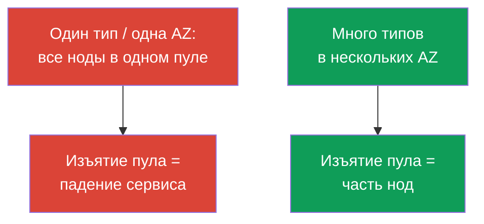
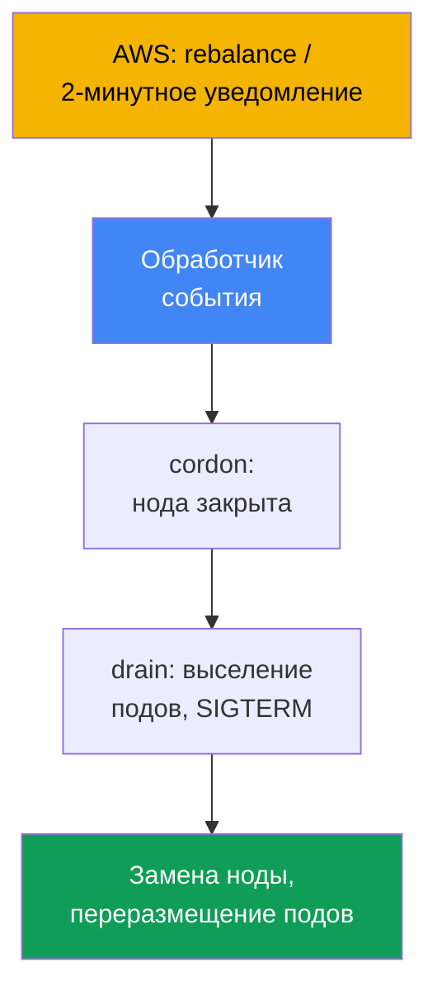
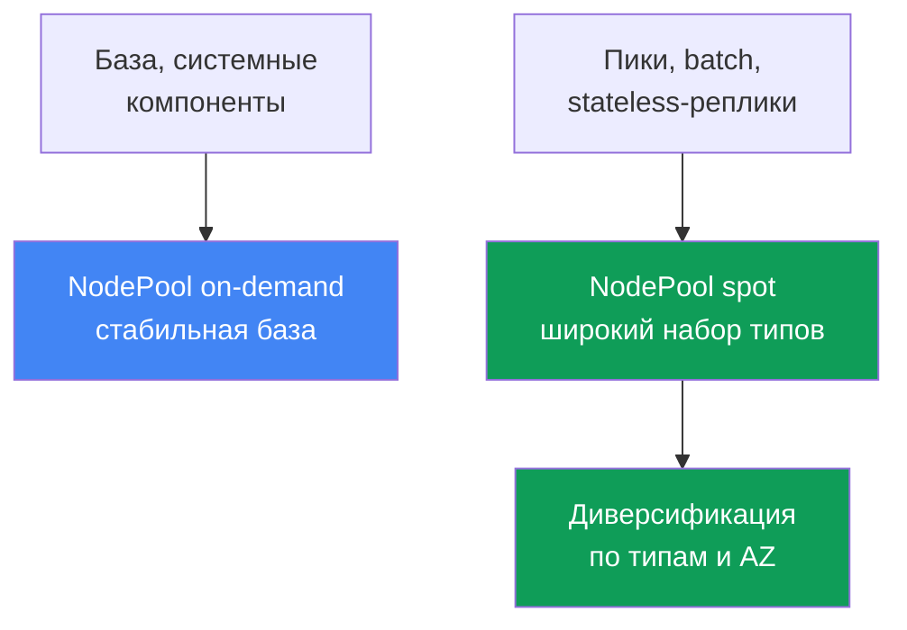

[Eng version](en.md) · [Versión en español](es.md) · [Version française](fr.md) · [Deutsche Version](de.md) · [ქართული ვერსია](ge.md) · [繁體中文版](tw.md) · [日本語版](jp.md)
# Глава 13. Spot-инстансы: прерывания, диверсификация, обработка событий

> **Что дальше.** Автоскейлеры разобраны (глава 11), конфигурация Karpenter (`NodePool`,
> `EC2NodeClass`, disruption, consolidation) - глава 12. Теперь про spot: дешёвую ёмкость,
> которую AWS забирает в любой момент, и как строить нагрузку, чтобы изъятие не стало
> инцидентом. Модели оплаты - глава 0.4, стоимость целиком (Savings Plans, right-sizing,
> микс) - глава 43, сайзинг - глава 14, надёжность (PDB, topology spread) - глава 40.

## 13.1. «Половина нод исчезла разом»

Днём кластер работал ровно, а потом половина нод пропала за минуты. Поды массово ушли в
`Pending`, сервис просел, а дежурный не понимает, что случилось: ни деплоя, ни ручных
действий не было. Разгадка обидная: все spot-ноды были **одного типа в одной зоне**, AWS
понадобилась эта ёмкость, и он забрал весь пул разом.

```bash
kubectl get nodes -L karpenter.sh/capacity-type --sort-by=.metadata.creationTimestamp
kubectl get pods --field-selector status.phase=Pending -A
```

Есть и второй, более тихий вариант той же боли. Нод изъяли немного, замена поднялась быстро,
но приложение всё равно уронило запросы: оно **не готово к внезапному завершению**. При spot у
процесса около двух минут, а он не ловит сигнал остановки, держит долгие соединения или хранит
единственную копию состояния на ноде - и прерывание теряет её.

Оба случая - не про «spot ненадёжен», а про то, что spot требует другого проектирования:
ёмкость одалживается у AWS, и задача - чтобы отзыв ноды или целого пула не выбивал сервис.

## 13.2. Что такое spot и правила игры

Spot-инстансы - это свободная сейчас ёмкость EC2 со скидкой к on-demand. Плата одна: **AWS
может забрать инстанс в любой момент**, когда ёмкость понадобится под on-demand-спрос.
Единственное отличие spot в том, что он прерывается; в остальном это обычный инстанс. Структура
стоимости (spot дешевле, скидка переменная) и место spot среди моделей оплаты - глава 0.4.

AWS не забирает инстанс молча, а даёт два сигнала:

| Сигнал | Когда приходит | Что делать |
|---|---|---|
| Rebalance recommendation | ранний, может прийти раньше 2-минутного уведомления | увести нагрузку заранее |
| Spot interruption notice | ровно за 2 минуты до остановки/завершения | успеть корректно снять поды |

Двухминутное уведомление - проверенный по документации факт и жёсткая рамка: около 120 секунд
на вывод нагрузки. Rebalance recommendation по документации приходит раньше, давая время
увести нагрузку заранее, не дожидаясь дедлайна.

```bash
# Историю цен и волатильность по типу и зоне видно так:
aws ec2 describe-spot-price-history \
  --instance-types m5.large \
  --product-descriptions "Linux/UNIX" \
  --max-items 10
```

Вывод: две минуты - это мало, а изъятие может быть массовым. Значит, защита стоит на двух
опорах сразу - **диверсификация** (не потерять всё разом) и **готовность приложения**
(пережить потерю ноды). Ни одна опора по отдельности не спасает.

## 13.3. Главный принцип: диверсификация

Самая частая и дорогая ошибка со spot - **однородный набор**: один тип инстанса в одной зоне.
Spot-ёмкость отзывается по пулам (пул = «тип инстанса + зона»), и если вся нагрузка в одном
пуле, его изъятие забирает всё разом. Это тот самый антипаттерн из главы 0.4.

Лечение - **диверсификация**: много типов инстансов в нескольких зонах. Тогда изъятие пула
затрагивает лишь часть нагрузки, а не весь сервис. Чем шире набор типов и больше зон, тем
меньше шанс, что одно событие AWS выбьет критичную долю нод.



Практический смысл: широкий выбор типов - это про **устойчивость**, а не про экономию на
инстансе. Узкий набор превращается в инциденты; как задать широкий - ниже и в главе 12.

## 13.4. Как Karpenter помогает

Karpenter хорошо ложится на spot, потому что подбирает инстанс от подов из широкого
разрешённого диапазона (глава 11) - то есть сам обеспечивает диверсификацию, если её
разрешить. Достаточно в `requirements` открыть capacity type `spot` и широкий список типов, а
конкретный инстанс и зону Karpenter выберет сам.

```yaml
# Фрагмент NodePool: spot + широкий набор типов. Полная конфигурация - глава 12.
spec:
  template:
    spec:
      requirements:
        - key: karpenter.sh/capacity-type
          operator: In
          values: ["spot", "on-demand"]      # spot приоритетнее, откат на on-demand
        - key: karpenter.k8s.aws/instance-category
          operator: In
          values: ["c", "m", "r"]            # широкий набор = диверсификация
        - key: topology.kubernetes.io/zone   # несколько AZ - тоже диверсификация
          operator: In
          values: ["eu-west-1a", "eu-west-1b", "eu-west-1c"]
```

Когда разрешены оба capacity type, Karpenter предпочитает spot и откатывается на on-demand
при нехватке spot-ёмкости (порядок приоритета - глава 12). Узкий `requirements` из одного-двух
типов убивает смысл: под spot это возврат к однородному набору с частыми прерываниями. Правило
простое - **для spot набор типов держат максимально широким**. На практике целятся минимум в
3-5 семейств близких размеров (через `karpenter.k8s.aws/instance-family` или
`instance-category`): прерывание одного семейства тогда не выбивает все ноды разом.

Вторая часть помощи - **обработка прерываний**. AWS шлёт события изъятия в EventBridge, тот
кладёт их в SQS, а Karpenter читает очередь из настройки `interruptionQueue`: получив
уведомление, он заранее поднимает замену, кордонит и дренирует ноду. Настройка очереди -
глава 12: **Karpenter реагирует сам**, если она настроена.

## 13.5. Обработка событий прерывания

Разберём, кто и что делает при сигнале. Событий два (раздел 13.2): ранний rebalance
recommendation и жёсткий двухминутный interruption notice. Реакция одинакова по смыслу -
**увести нагрузку с обречённой ноды до изъятия**: пометить ноду (cordon), выселить поды
(drain), дать автоскейлеру поднять замену и переразместить поды.



Кто обработчик - зависит от того, как устроен кластер:

| Тип нод | Кто обрабатывает прерывание | Что настраиваете вы |
|---|---|---|
| EKS Auto Mode | сам сервис | ничего для прерываний |
| Свой Karpenter | контроллер прерываний Karpenter | очередь прерываний (глава 12) |
| Managed / self-managed без Karpenter | AWS Node Termination Handler | ставите и ведёте NTH |

**AWS Node Termination Handler (NTH)** нужен для managed и self-managed нод без Karpenter. Два
режима: IMDS (агент на ноде ловит уведомление из метаданных) и Queue Processor (контроллер
читает события из SQS через EventBridge). Делает то же: cordon, drain, вывод ноды. **EKS Auto
Mode** обрабатывает прерывания сам, без вашего NTH и настройки очереди (глава 9).

Важна граница возможностей обработчика. При двухминутном уведомлении у него ~120 секунд: он
успеет закордонить и начать дренаж, но **корректно уйти поды должны сами**. Обработчик
запускает выселение, но не заменяет готовность приложения - не умеет завершаться чисто, не
спасёт ни NTH, ни Karpenter.

## 13.6. Готовность приложения к прерыванию

Две минуты - потолок, а не гарантия: закладываться нужно на быстрое завершение. Отсюда
требования к приложению; общие механизмы надёжности - глава 40, здесь их применение к spot.

- **Graceful shutdown по SIGTERM.** При выселении Kubernetes шлёт поду `SIGTERM` и ждёт
  `terminationGracePeriodSeconds`, затем добивает `SIGKILL`. Приложение обязано ловить его:
  перестать принимать запросы, закрыть соединения. Период держат меньше двух минут.
- **PDB против массового выселения.** `PodDisruptionBudget` не даёт выселить слишком много
  реплик разом при добровольном дренаже, но **не спасает от форсированного**: если AWS забрал
  ноду, поды уходят независимо от PDB. Опора - реплики и диверсификация (детально - глава 40).
- **Не держать критичное состояние только на spot-ноде.** Единственная копия данных на диске
  spot-ноды - это потеря при первом изъятии. Состояние выносят в реплицируемое хранилище или
  на реплики, разнесённые по зонам.
- **Checkpointing для batch.** Долгие задачи периодически сохраняют промежуточный результат,
  чтобы после прерывания продолжить с контрольной точки, а не с нуля.

```yaml
apiVersion: v1
kind: Pod
metadata:
  name: web
spec:
  terminationGracePeriodSeconds: 60   # уложиться в двухминутное окно spot
  containers:
    - name: app
      image: my-web:1.0
      lifecycle:
        preStop:
          exec:
            command: ["sh", "-c", "sleep 5"]   # дать балансировщику увести трафик
```

## 13.7. Какие нагрузки можно на spot, а какие нет

Пригодность к spot определяется одним вопросом: **переживёт ли нагрузка внезапную потерю
ноды**. Ответ зависит от реплик, характера состояния и делимости работы.

| Нагрузка | Spot | Почему |
|---|---|---|
| Stateless-сервисы с несколькими репликами | да | потеря реплики компенсируется остальными |
| Batch и CI-джобы с checkpointing | да | перезапуск с контрольной точки дёшев |
| Воркеры очередей (идемпотентные) | да | необработанное сообщение вернётся в очередь |
| Единственная реплика stateful без репликации | нет | изъятие = потеря данных или простой |
| Длинная неделимая задача без checkpoint | осторожно | прерывание отбрасывает к началу |
| Критичные системные компоненты | осторожно/нет | нужна стабильная база on-demand |

Правило: **stateless с запасом реплик и прерываемый batch - естественные кандидаты на spot**;
единственные копии stateful и критичная системная обвязка - на on-demand или под жёсткой
репликацией. Промежуточное решается наличием checkpointing. Сайзинг этих нагрузок
(requests/limits, плотность) - глава 14.

## 13.8. Смешанные стратегии: база on-demand плюс пики на spot

На практике редко бывает «всё на spot» или «всё на on-demand». Рабочий шаблон - **смешанный**:
базовая, всегда нужная ёмкость на on-demand, а переменные пики и прерываемые нагрузки - на
spot. Тогда изъятие spot-пула бьёт по пиковой части, а ядро сервиса стоит на стабильной базе.

Разводят это **отдельными пулами**: один `NodePool` (или node group) на on-demand под базу и
системные компоненты, другой на spot под прерываемое. Нагрузки направляют на нужный пул через
`nodeSelector`/`affinity` по метке capacity type, а spot-пул при необходимости закрывают taint.



Направление подов на тип ёмкости делают через метку. В Karpenter это
`karpenter.sh/capacity-type` (`spot` или `on-demand`), а на нодах EKS исторически встречается
и `eks.amazonaws.com/capacityType` (`SPOT`/`ON_DEMAND`) - какую использовать, зависит от того,
кто поднял ноду.

```yaml
# Направить прерываемую нагрузку строго на spot:
spec:
  nodeSelector:
    karpenter.sh/capacity-type: spot
```

```bash
# Проверить, какого типа ёмкости ноды в кластере:
kubectl get nodes -L karpenter.sh/capacity-type -L eks.amazonaws.com/capacityType
```

Разумный старт: критичный минимум реплик каждого сервиса прибит к on-demand, остальные - на
spot. Даже при изъятии всего spot-пула сервис жив на базовой ёмкости, а Karpenter поднимает
замену (в том числе откатом на on-demand). Баланс доли spot и on-demand по затратам - глава 43.

## 13.9. Диагностика и наблюдение

Первое, что важно принять на дежурстве: **spot-ноды приходят и уходят чаще on-demand, и это
норма**, а не инцидент. Инцидент - когда изъятие уронило сервис, а не сам факт замены ноды.

```bash
kubectl get nodeclaims                                   # ноды часто пересоздаются - норма
kubectl get nodes -L karpenter.sh/capacity-type --sort-by=.metadata.creationTimestamp
kubectl logs -n kube-system -l app.kubernetes.io/name=karpenter | grep -i interrupt
```

На что смотреть предметно:

- **Частота прерываний по пулам.** Растёт резко по одному типу - набор слишком узок
  (раздел 13.3); расширяют `requirements`.
- **Поды в `Pending` после изъятия.** Замена не поднимается - смотрят ёмкость и приоритеты
  автоскейлера (главы 11-12), а не «плохой spot».
- **Всплеск ошибок при замене ноды.** Указывает на неготовность приложения (раздел 13.6): нет
  graceful shutdown, мало реплик, нет `preStop`.
- **Метрики Karpenter.** Экспортируются в Prometheus (глава 33); по ним виден темп прерываний
  и замен - удобно для дашборда и алертов на аномальный рост.

Здоровый spot-кластер выглядит «шумно»: ноды сменяются, а сервис ровный. Задача наблюдения -
поймать момент, когда шум переходит в просадку.

## 13.10. Как это применяют в продакшене

- **Диверсифицируют по умолчанию.** Для spot держат широкий набор типов и несколько AZ;
  однородный набор из одного типа в одной зоне считают ошибкой конфигурации.
- **Разводят базу и пики по пулам.** Критичный минимум реплик и системные компоненты - на
  on-demand, прерываемое и пиковое - на spot, разметка через `capacity-type`.
- **Готовят приложения к прерыванию.** Обязательны обработка `SIGTERM`, разумный
  `terminationGracePeriodSeconds` в пределах двух минут и `preStop` для увода трафика.
- **Не кладут единственную копию состояния на spot.** Stateful без репликации - на on-demand
  или реплицируется по зонам; batch делают с checkpointing. PDB смягчает добровольный дренаж,
  но форсированное изъятие не останавливает - опора на реплики и диверсификацию.
- **Отличают шум от инцидента.** Частую смену spot-нод не алертят; алертят на просадку
  сервиса, залипшие `Pending` и аномальный рост прерываний по одному пулу.

## 13.11. Мини-глоссарий

- **Spot-инстанс** - свободная ёмкость EC2 со скидкой, которую AWS может отозвать в любой
  момент, когда она понадобится под on-demand-спрос.
- **Spot interruption notice** - уведомление о прерывании за две минуты до остановки или
  завершения инстанса; жёсткая рамка на корректное завершение.
- **Rebalance recommendation** - ранний сигнал о повышенном риске изъятия, приходящий раньше
  двухминутного уведомления; даёт время увести нагрузку заранее.
- **Диверсификация** - множество типов инстансов в нескольких AZ, чтобы изъятие одного пула не
  выбивало критичную долю нод.
- **Spot-пул** - связка «тип инстанса + зона доступности»; ёмкость отзывается пулами.
- **Node Termination Handler (NTH)** - компонент AWS для обработки прерываний на managed и
  self-managed нодах без Karpenter; режимы IMDS и Queue Processor.
- **capacity type** - тип ёмкости ноды (`spot`/`on-demand`); метки `karpenter.sh/capacity-type`
  и `eks.amazonaws.com/capacityType`.

## 13.12. Итоги главы

- Spot - ёмкость EC2 со скидкой, которую AWS отзывает при нехватке; единственное отличие от
  on-demand в том, что spot прерывается (структура стоимости - главы 0.4 и 43).
- AWS даёт два сигнала: rebalance recommendation (ранний, может прийти раньше) и interruption
  notice (жёсткие две минуты до изъятия).
- Главная защита - диверсификация: много типов в нескольких AZ. Однородный набор из одного
  типа в одной зоне - антипаттерн: одно изъятие забирает всё.
- Karpenter обеспечивает диверсификацию широким `requirements` и обрабатывает прерывания сам
  через очередь прерываний (детали - глава 12); кто обработчик - зависит от типа нод
  (Karpenter, NTH, сам Auto Mode).
- Две минуты - мало: приложение должно уметь graceful shutdown по `SIGTERM`, не держать
  единственную копию состояния на spot, а batch - делать checkpointing. PDB смягчает, но не
  спасает от форсированного изъятия (глава 40).
- На spot идут stateless с репликами, прерываемый batch, идемпотентные воркеры; единственные
  копии stateful и критичная обвязка - на on-demand. Рабочий шаблон - смешанный: база на
  on-demand, пики и прерываемое на spot, разведённые по пулам через метку capacity type.

## 13.13. Как это пригодится в реальной работе

На дежурстве главное - не спутать норму с инцидентом. Частая смена spot-нод и мелькающие
`nodeclaims` - ожидаемое поведение. Реагировать нужно на просадку сервиса: залипшие после
изъятия `Pending` - вопрос к ёмкости и автоскейлеру (главы 11-12); всплеск ошибок при замене
ноды - к готовности приложения; рост прерываний по одному типу - сигнал расширять набор.

Глава удерживает от двух крайностей: «всё на spot ради экономии» (массовое изъятие роняет
сервис) и «spot слишком рискован» (переплата за избыточную on-demand). Середина -
диверсифицированный spot под stateless и batch плюс on-demand-база под критичный минимум и
приложения, готовые к внезапному завершению.

## 13.14. Вопросы для самопроверки

1. Чем spot-инстанс отличается от on-demand и за счёт чего он дешевле?
2. Какие два сигнала о прерывании даёт AWS и чем они отличаются?
3. Сколько даёт двухминутное уведомление и почему на него нельзя закладываться целиком?
4. Что такое spot-пул и почему однородный набор инстансов - главная ошибка?
5. Как диверсификация снижает риск и как её задают в Karpenter?
6. Как Karpenter обрабатывает прерывание и что для этого нужно настроить?
7. Кто обрабатывает прерывание на нодах без Karpenter и что делает Auto Mode?
8. Что происходит с нодой и подами при получении события прерывания?
9. Что должно уметь приложение, чтобы пережить прерывание за две минуты?
10. Спасает ли PDB от форсированного изъятия spot и почему?
11. Какие нагрузки можно отправлять на spot, а какие нет, и по какому критерию?
12. Как устроена смешанная стратегия и почему частая смена spot-нод - это норма?

## Практика

Лаба курса к этой теме: [лаба 111 - Spot-ноды: диверсификация, обработка прерываний, graceful
drain](../../labs/111/README_RU.MD). Кроме неё, поведение spot видно на живом кластере. Начните с
инвентаризации ёмкости:
`kubectl get nodes -L karpenter.sh/capacity-type -L eks.amazonaws.com/capacityType` покажет,
какие ноды spot, а какие on-demand, и есть ли вообще диверсификация. Посмотрите
`kubectl get nodeclaims` и отсортируйте ноды по времени создания - как часто они сменяются.

Дальше проверьте готовность к прерыванию. Возьмите ключевой Deployment: задан ли
`terminationGracePeriodSeconds`, есть ли `preStop` и PDB, сколько реплик и разнесены ли они по
зонам. Загляните в логи обработчика прерываний
(`kubectl logs -n kube-system -l app.kubernetes.io/name=karpenter | grep -i interrupt`) и
оцените нормальный «шум» изъятий. Отдельно разберите раннюю лабу Karpenter из репозитория
([Karpenter](../../labs/02/README.MD)) - она не входит в курс, но тема пересекается.

---
[Оглавление](../README_RU.md) · [Глава 12](../12/ru.md) · [Глава 14](../14/ru.md)
