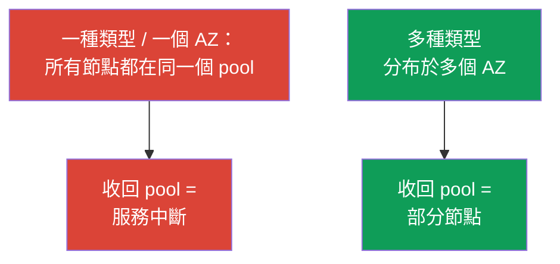
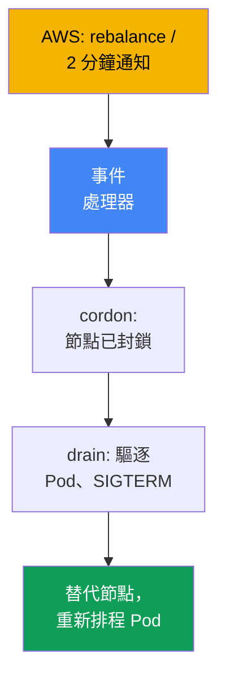
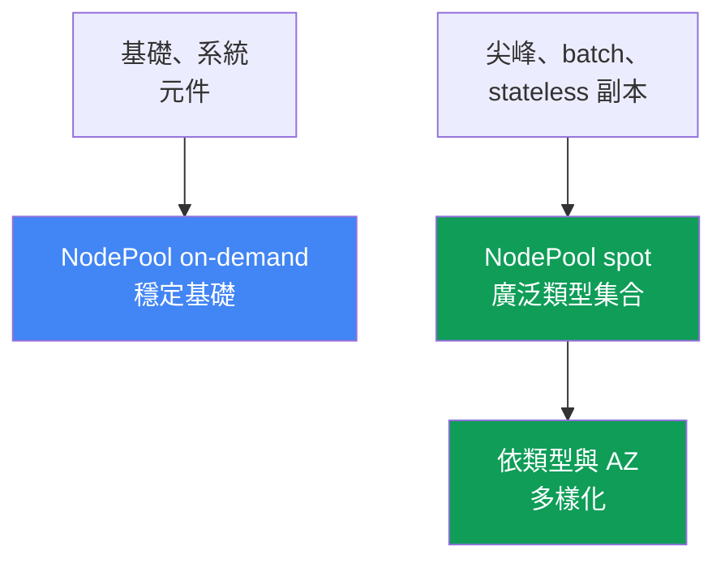

[Русская версия](ru.md) · [Eng version](en.md) · [Versión en español](es.md) · [Version française](fr.md) · [Deutsche Version](de.md) · [ქართული ვერსია](ge.md) · [日本語版](jp.md)

# 第 13 章：Spot 執行個體：中斷、多樣化、事件處理

> **接下來。** 已說明 autoscaler（第 11 章），Karpenter 設定（`NodePool`、`EC2NodeClass`、disruption、consolidation）見第 12 章。現在來談 spot：AWS 可隨時收回的低價容量，以及如何設計工作負載，避免收回容量演變成事件。付款模式見第 0.4 章，完整成本（Savings Plans、right-sizing、混合）見第 43 章，sizing 見第 14 章，可靠性（PDB、topology spread）見第 40 章。

## 13.1.「一半節點同時消失」

白天叢集運作平穩，接著一半節點在幾分鐘內消失。Pod 大量進入
`Pending`，服務降級，值班人員卻不知道發生什麼事：既沒有部署，也沒有手動
操作。答案令人懊惱：所有 spot 節點都屬於**同一個可用區中的同一種執行個體類型**，AWS
需要這些容量，因此一次收回整個 pool。

```bash
kubectl get nodes -L karpenter.sh/capacity-type --sort-by=.metadata.creationTimestamp
kubectl get pods --field-selector status.phase=Pending -A
```

同樣痛點還有另一種更安靜的情況。被收回的節點不多，替代節點也很快啟動，
但應用程式仍然丟失請求：它**尚未準備好因應突然終止**。使用 spot 時，程序大約有兩分鐘，
但它未捕捉停止訊號、持有長連線，或在節點上保存唯一一份狀態，於是中斷便使其遺失。

這兩種情況都不是「spot 不可靠」，而是 spot 需要不同的設計方式：
容量是向 AWS 借用，而目標是讓收回節點或整個 pool 不會擊垮服務。

## 13.2. Spot 是什麼以及遊戲規則

Spot 執行個體是目前閒置的 EC2 容量，相較 on-demand 有折扣。代價只有一項：**當
on-demand 需求需要容量時，AWS 可隨時收回執行個體**。Spot 唯一的不同之處是可能遭到中斷；
其餘方面它就是一般執行個體。成本結構（spot 較便宜，折扣會浮動）和 spot 在付款模式中的位置
見第 0.4 章。

AWS 不會無聲地收回執行個體，而會提供兩種訊號：

| 訊號 | 何時到達 | 該做什麼 |
|---|---|---|
| Rebalance recommendation | 較早，可能早於 2 分鐘通知到達 | 預先遷離工作負載 |
| Spot interruption notice | 停止/終止前剛好 2 分鐘 | 及時正常移除 Pod |

兩分鐘通知是文件已驗證的事實，也是硬性界限：大約 120 秒可用於移出工作負載。
依文件所述，Rebalance recommendation 會更早到達，讓你能預先遷離工作負載，
不必等到截止時間。

```bash
# 可用此方式查看依類型和可用區區分的價格歷史與波動性：
aws ec2 describe-spot-price-history \
  --instance-types m5.large \
  --product-descriptions "Linux/UNIX" \
  --max-items 10
```

結論：兩分鐘很短，而且收回可能是大規模的。因此，防護同時建立在兩根支柱上 - **多樣化**（不會一次失去所有資源）與**應用程式就緒性**
（能承受節點遺失）。任何一根支柱單獨存在都不足以保護服務。

## 13.3. 核心原則：多樣化

使用 spot 最常見且代價最高的錯誤是**同質集合**：一個可用區中只有一種執行個體類型。
Spot 容量按 pool 收回（pool =「執行個體類型 + 可用區」），如果所有工作負載都在同一個
pool，收回它會一次帶走所有資源。這正是第 0.4 章中的反模式。

解方是**多樣化**：在多個可用區使用多種執行個體類型。如此一來，收回某一 pool
只會影響部分工作負載，而非整個服務。類型集合越廣、可用區越多，單一 AWS 事件
使關鍵節點比例失效的機率就越低。



實務意義是：廣泛的類型選擇關乎**韌性**，而不是節省單一執行個體的成本。
狹窄的集合會演變成事件；如何定義廣泛集合見下文及第 12 章。

## 13.4. Karpenter 如何協助

Karpenter 很適合 spot，因為它從 Pod 的廣泛允許範圍中挑選執行個體（第 11 章） -
也就是說，只要允許它這麼做，它就會自行提供多樣化。只要在 `requirements` 中開放
capacity type `spot` 和廣泛的類型清單，具體執行個體和可用區將由 Karpenter 自行選擇。

```yaml
# NodePool 片段：spot + 廣泛的類型集合。完整設定見第 12 章。
spec:
  template:
    spec:
      requirements:
        - key: karpenter.sh/capacity-type
          operator: In
          values: ["spot", "on-demand"]      # spot 優先，回退至 on-demand
        - key: karpenter.k8s.aws/instance-category
          operator: In
          values: ["c", "m", "r"]            # 廣泛集合 = 多樣化
        - key: topology.kubernetes.io/zone   # 多個 AZ 也是多樣化
          operator: In
          values: ["eu-west-1a", "eu-west-1b", "eu-west-1c"]
```

同時允許兩種 capacity type 時，Karpenter 會偏好 spot，並在缺少 spot 容量時回退至
on-demand（優先順序見第 12 章）。只包含一兩種執行個體類型的狹窄 `requirements`
破壞了其意義：對 spot 而言，這又回到經常中斷的同質集合。規則很簡單：**spot 的類型集合應維持盡可能廣泛**。實務上目標至少是
3-5 個大小相近的家族（透過 `karpenter.k8s.aws/instance-family` 或
`instance-category`）：如此一來，某個家族的中斷不會同時擊垮所有節點。

第二部分協助是**中斷處理**。AWS 從 EventBridge 傳送收回事件，EventBridge 將其放入 SQS，
Karpenter 則從 `interruptionQueue` 設定所指定的佇列讀取事件：收到通知後，
它會預先啟動替代節點、cordon 並 drain 節點。佇列設定見第 12 章：
如果已設定，**Karpenter 會自行回應**。

## 13.5. 中斷事件處理

讓我們檢視收到訊號時誰該做什麼。事件有兩種（第 13.2 節）：較早的 rebalance
recommendation 與硬性的兩分鐘 interruption notice。兩者回應的意義相同 -
**在收回前，將工作負載從注定失效的節點遷離**：標記節點（cordon）、
驅逐 Pod（drain）、讓 autoscaler 啟動替代資源並重新排程 Pod。



使用哪個處理器取決於叢集的建置方式：

| 節點類型 | 誰處理中斷 | 你要設定什麼 |
|---|---|---|
| EKS Auto Mode | 服務本身 | 中斷無需設定 |
| 自行管理的 Karpenter | Karpenter 中斷控制器 | 中斷佇列（第 12 章） |
| 無 Karpenter 的 Managed / self-managed | AWS Node Termination Handler | 安裝並維護 NTH |

**AWS Node Termination Handler (NTH)** 適用於沒有 Karpenter 的 managed 與 self-managed
節點。它有兩種模式：IMDS（節點上的 agent 從 metadata 擷取通知）和 Queue Processor（控制器經由 EventBridge 從 SQS 讀取事件）。
其作用相同：cordon、drain、移除節點。**EKS Auto Mode** 會自行處理中斷，不需要你的 NTH
或佇列設定（第 9 章）。

處理器功能有重要界限。收到兩分鐘通知後，它約有 120 秒：它能 cordon 並開始 drain，
但 Pod 必須**自行正常結束**。處理器會啟動驅逐，但無法取代應用程式的就緒性 -
如果應用程式不能乾淨結束，NTH 和 Karpenter 都無法挽救它。

## 13.6. 應用程式面對中斷的就緒性

兩分鐘是上限，而不是保證：應針對快速終止來設計。因此應用程式需要符合以下要求；
通用可靠性機制見第 40 章，這裡說明其套用於 spot 的方式。

- **依 SIGTERM 進行 graceful shutdown。** Kubernetes 在驅逐時會傳送 `SIGTERM` 給 Pod，並等待
  `terminationGracePeriodSeconds`，之後以 `SIGKILL` 終止。應用程式必須捕捉此訊號：
  停止接受請求並關閉連線。此期間應小於兩分鐘。
- **以 PDB 防止大規模驅逐。** `PodDisruptionBudget` 可避免在自願性 drain 時一次驅逐過多
  副本，但**無法防止強制收回**：AWS 收回節點時，Pod 不受 PDB 影響而離開。基礎是副本
  與多樣化（詳見第 40 章）。
- **不要只把關鍵狀態留在 spot 節點上。** Spot 節點磁碟上的唯一資料副本會在第一次收回時遺失。
  應將狀態移至具複寫功能的儲存空間，或移至分散於不同可用區的副本。
- **為 batch 使用 checkpointing。** 長時間任務應定期保存中間結果，以便中斷後從 checkpoint
  繼續，而非從頭開始。

```yaml
apiVersion: v1
kind: Pod
metadata:
  name: web
spec:
  terminationGracePeriodSeconds: 60   # 在 spot 的兩分鐘窗口內完成
  containers:
    - name: app
      image: my-web:1.0
      lifecycle:
        preStop:
          exec:
            command: ["sh", "-c", "sleep 5"]   # 讓負載平衡器遷離流量
```

## 13.7. 哪些工作負載適合 spot，哪些不適合

是否適合 spot 取決於一個問題：**工作負載能否承受突然遺失節點**。答案取決於副本數、
狀態特性以及工作是否可分割。

| 工作負載 | Spot | 原因 |
|---|---|---|
| 具有多個副本的 Stateless 服務 | 是 | 其餘副本可補償遺失的副本 |
| 有 checkpointing 的 Batch 與 CI jobs | 是 | 從 checkpoint 重新啟動成本低 |
| Queue workers（具冪等性） | 是 | 未處理訊息會回到佇列 |
| 無複寫的單一 Stateful 副本 | 否 | 收回 = 資料遺失或停機 |
| 無 checkpoint 的長時間不可分割任務 | 謹慎 | 中斷會回到起點 |
| 關鍵系統元件 | 謹慎/否 | 需要穩定的 on-demand 基礎 |

規則：**有足夠副本的 stateless 與可中斷 batch 是 spot 的自然候選者**；
唯一的 stateful 副本與關鍵系統基礎元件應放在 on-demand，或採用嚴格複寫。中間情況可透過
checkpointing 解決。這些工作負載的 sizing（requests/limits、密度）見第 14 章。

## 13.8. 混合策略：on-demand 基礎加上 spot 尖峰

實務上很少是「全部使用 spot」或「全部使用 on-demand」。可行的模式是**混合**：
始終需要的基礎容量使用 on-demand，而可變尖峰和可中斷工作負載使用 spot。如此一來，
spot pool 的收回只會影響尖峰部分，服務核心則位於穩定的基礎上。

透過**獨立 pool** 分開這些工作負載：一個 `NodePool`（或 node group）使用 on-demand，
提供基礎與系統元件；另一個使用 spot，提供可中斷工作負載。依 capacity type 標籤，
透過 `nodeSelector`/`affinity` 將工作負載導向需要的 pool，必要時再以 taint 隔離 spot pool。



使用標籤將 Pod 導向 capacity type。在 Karpenter 中是
`karpenter.sh/capacity-type`（`spot` 或 `on-demand`）；而 EKS 節點上歷來也可見
`eks.amazonaws.com/capacityType`（`SPOT`/`ON_DEMAND`） - 使用哪一個取決於
是哪個元件建立節點。

```yaml
# 將可中斷工作負載嚴格導向 spot：
spec:
  nodeSelector:
    karpenter.sh/capacity-type: spot
```

```bash
# 檢查叢集節點使用的 capacity type：
kubectl get nodes -L karpenter.sh/capacity-type -L eks.amazonaws.com/capacityType
```

合理的起點是：每個服務的最少關鍵副本固定使用 on-demand，其餘使用 spot。即使整個
spot pool 被收回，服務仍由基礎容量維持運作，而 Karpenter 會啟動替代資源（包括回退至
on-demand）。spot 與 on-demand 的成本比例平衡見第 43 章。

## 13.9. 診斷與觀測

值班時首先要接受的一點是：**spot 節點比 on-demand 更常出現與離開，這是正常現象**，
不是事件。事件是收回導致服務中斷，而不是節點替換本身。

```bash
kubectl get nodeclaims                                   # 節點經常重建屬於正常現象
kubectl get nodes -L karpenter.sh/capacity-type --sort-by=.metadata.creationTimestamp
kubectl logs -n kube-system -l app.kubernetes.io/name=karpenter | grep -i interrupt
```

具體應觀察：

- **各 pool 的中斷頻率。** 若某一類型快速升高，集合就太狹窄
  （第 13.3 節）；應擴大 `requirements`。
- **收回後處於 `Pending` 的 Pod。** 替代資源未能啟動時，查看容量與 autoscaler
  優先順序（第 11-12 章），而不是歸咎於「糟糕的 spot」。
- **節點替換時的錯誤尖峰。** 這表示應用程式未就緒（第 13.6 節）：沒有
  graceful shutdown、副本太少或沒有 `preStop`。
- **Karpenter metrics。** 它們會匯出至 Prometheus（第 33 章）；可從中看出中斷
  與替換速率，適合建立 dashboard 與針對異常成長設定 alert。

健康的 spot 叢集看起來「很吵」：節點會替換，但服務平穩。觀測的目標是捕捉
雜訊轉為降級的時刻。

## 13.10. 在 production 中如何應用

- **預設採用多樣化。** Spot 使用廣泛的類型集合與多個 AZ；將一個可用區中只用一種
  類型的同質集合視為設定錯誤。
- **依 pool 分離基礎與尖峰。** 關鍵最小副本與系統元件使用 on-demand，
  可中斷與尖峰工作負載使用 spot，透過 `capacity-type` 標籤區分。
- **讓應用程式準備好應對中斷。** 必須處理 `SIGTERM`、將合理的
  `terminationGracePeriodSeconds` 設在兩分鐘內，並用 `preStop` 遷離流量。
- **不要將唯一狀態副本放在 spot。** 無複寫的 stateful 應使用 on-demand，
  或在可用區間進行複寫；batch 應採用 checkpointing。PDB 可緩和自願性 drain，
  但無法阻止強制收回 - 基礎是副本與多樣化。
- **區分雜訊與事件。** 不要因 spot 節點頻繁替換而 alert；應對服務降級、卡住的
  `Pending`，以及單一 pool 中中斷異常成長設定 alert。

## 13.11. 迷你詞彙表

- **Spot 執行個體** - 享有折扣的閒置 EC2 容量；當 on-demand 需求需要它時，AWS 可隨時收回。
- **Spot interruption notice** - 執行個體停止或終止前兩分鐘的中斷通知；是正常結束的硬性時間界限。
- **Rebalance recommendation** - 顯示收回風險升高的早期訊號，早於兩分鐘通知到達；
  提供預先遷離工作負載的時間。
- **多樣化** - 多個 AZ 中使用多種執行個體類型，避免收回單一 pool 時影響關鍵節點比例。
- **Spot pool** -「執行個體類型 + 可用區」的組合；容量按 pool 收回。
- **Node Termination Handler (NTH)** - AWS 元件，用於在沒有 Karpenter 的 managed 與
  self-managed 節點處理中斷；有 IMDS 和 Queue Processor 模式。
- **capacity type** - 節點容量類型（`spot`/`on-demand`）；標籤為 `karpenter.sh/capacity-type`
  與 `eks.amazonaws.com/capacityType`。

## 13.12. 本章總結

- Spot 是享有折扣的 EC2 容量，AWS 會在容量不足時收回；它與 on-demand 的唯一差異是
  spot 會中斷（成本結構見第 0.4 與第 43 章）。
- AWS 提供兩種訊號：rebalance recommendation（早期，可能提早到達）與 interruption
  notice（收回前硬性的兩分鐘）。
- 主要防護是多樣化：在多個 AZ 中使用多種執行個體類型。一個可用區中只使用一種
  類型的同質集合是反模式：一次收回就會帶走所有資源。
- Karpenter 透過廣泛的 `requirements` 提供多樣化，並透過中斷佇列自行處理中斷
  （細節見第 12 章）；使用哪個處理器取決於節點類型（Karpenter、NTH、Auto Mode 本身）。
- 兩分鐘很短：應用程式必須能依 `SIGTERM` graceful shutdown，不能將唯一狀態副本
  留在 spot，而 batch 必須採用 checkpointing。PDB 可緩和，但不能防止強制收回（第 40 章）。
- 適合 spot 的有具副本的 stateless、可中斷 batch、具冪等性的 workers；唯一的
  stateful 副本與關鍵基礎元件應使用 on-demand。可行模式是混合：on-demand 提供基礎，
  spot 提供尖峰與可中斷工作負載，透過 capacity type 標籤分配至不同 pool。

## 13.13. 如何在實際工作中派上用場

值班時，最重要的是不要混淆正常現象與事件。spot 節點頻繁替換與短暫出現的
`nodeclaims` 是預期行為。應針對服務降級作出反應：收回後卡住的 `Pending` 是容量與
autoscaler 的問題（第 11-12 章）；節點替換時的錯誤尖峰是應用程式就緒性的問題；
單一類型中斷增加則表示應擴大集合。

本章避免兩種極端：「為了節省成本全部使用 spot」（大規模收回會使服務中斷）和
「spot 風險太高」（為過多 on-demand 支付額外成本）。中間方案是：為 stateless 與 batch
使用多樣化 spot，加上為關鍵最小容量使用的 on-demand 基礎，以及已準備好突然終止的應用程式。

## 13.14. 自我檢查問題

1. Spot 執行個體與 on-demand 有何不同，為何更便宜？
2. AWS 提供哪兩種中斷訊號，它們有何不同？
3. 兩分鐘通知提供多少時間，為何不能完全依賴它？
4. 什麼是 spot pool，為何同質執行個體集合是主要錯誤？
5. 多樣化如何降低風險，又如何在 Karpenter 中定義？
6. Karpenter 如何處理中斷，為此需要設定什麼？
7. 沒有 Karpenter 的節點由誰處理中斷，Auto Mode 又做什麼？
8. 收到中斷事件時，節點和 Pod 會發生什麼事？
9. 應用程式必須具備什麼能力，才能承受兩分鐘內的中斷？
10. PDB 能否防止強制收回 spot，為什麼？
11. 哪些工作負載可以放在 spot，哪些不行，依據是什麼？
12. 混合策略如何運作，為何 spot 節點頻繁替換屬於正常現象？

## 實作

本主題的課程 lab 是[lab 111 - Spot 節點：多樣化、中斷處理、graceful
drain](../../labs/111/README_TW.MD)。除此之外，也能在實際叢集觀察 spot 行為。首先清查
容量：`kubectl get nodes -L karpenter.sh/capacity-type -L eks.amazonaws.com/capacityType`
會顯示哪些節點是 spot、哪些是 on-demand，以及是否確實具備多樣化。查看
`kubectl get nodeclaims` 並依建立時間排序節點，了解它們替換的頻率。

接著檢查中斷就緒性。選擇一個關鍵 Deployment：是否設定
`terminationGracePeriodSeconds`、是否有 `preStop` 與 PDB、有多少副本，以及它們是否分散於
不同可用區。查看中斷處理器的 logs
（`kubectl logs -n kube-system -l app.kubernetes.io/name=karpenter | grep -i interrupt`），
評估收回事件的正常「雜訊」。另行研讀 repository 中較早的 Karpenter lab
（[Karpenter](../../labs/02/README_TW.MD)） - 它不屬於課程，但主題相關。

---
[目錄](../README_TW.md) · [第 12 章](../12/tw.md) · [第 14 章](../14/tw.md)
