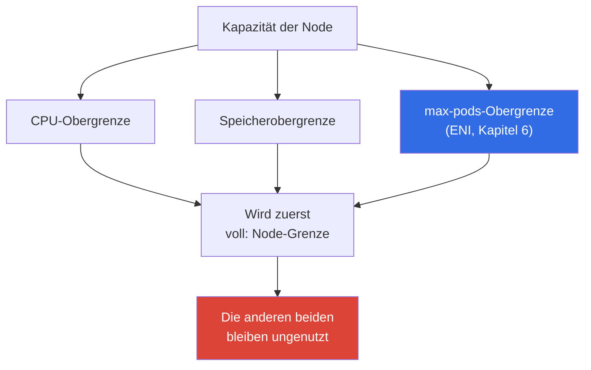
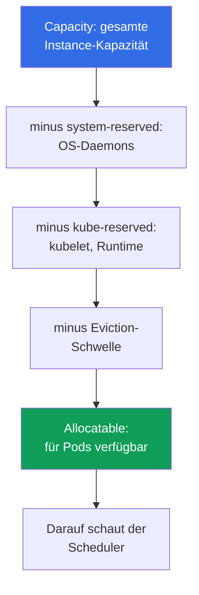

[Русская версия](ru.md) · [Eng version](en.md) · [Versión en español](es.md) · [Version française](fr.md) · [ქართული ვერსია](ge.md) · [繁體中文版](tw.md) · [日本語版](jp.md)
# Kapitel 14. Dichte und Sizing: Pods pro Node, ENI-Limits, Requests und Limits in der Cloud

> **Wie geht es weiter?** Nodes können bereits unter Last entstehen: Cluster Autoscaler und Karpenter
> (Kapitel 11), Karpenter-Konfiguration (Kapitel 12), Spot (Kapitel 13). Es bleibt die Frage,
> die sich in der Cloud unmittelbar in eine Rechnung verwandelt: Wie viele Pods gehören auf eine Node,
> und welche Requests und Limits sollen sie erhalten? Hier geht es um die Ökonomie der Dichte und
> Stabilität. Die Herleitung von `max-pods`, ENI und Warm Pool steht vollständig in Kapitel 6, das
> Anheben der Pod-Obergrenze durch Prefix Delegation in Kapitel 7, die Karpenter-Instance-Auswahl in
> Kapitel 12, HPA und VPA in Kapitel 35 und die Gesamtkosten in Kapitel 43. Hier werden diese
> Stellhebel benannt und verknüpft, aber nicht wiederholt.

## 14.1. Drei Arten, für Leerlauf zu zahlen

Drei reale Situationen, alle drei betreffen zugleich Geld und Stabilität.

Die erste. Der Bestand besteht aus `t3.medium`, die Nodes liegen bei 20 Prozent CPU-Auslastung,
aber neue Pods passen nicht mehr hinein. Die Ursache ist weder CPU noch Speicher: Sie stoßen an
`max-pods` (Kapitel 6). Eine kleine Instance nimmt 17 Pods auf und ist damit voll, obwohl der
Prozessor unbeschäftigt bleibt. Bezahlt wird für Hardware, die bei der Auslastung nie aus dem
Leerlauf kommt.

Die zweite, spiegelbildliche. Requests werden klein angesetzt, „damit mehr hineinpasst“, die Pods
werden dicht gepackt, und unter Spitzenlast gerät die Node in CPU-Throttling, während ein Teil der
Container `OOMKilled` erhält. Der Scheduler ging davon aus, dass alles passt, weil er Requests und
nicht den tatsächlichen Verbrauch betrachtet.

Die dritte. Überall ist nach dem Prinzip „das ist zuverlässiger“ `requests == limits` gesetzt. Die
Hälfte der Cluster-Kapazität liegt als Reserve brach: Für Spitzenwerte, die einmal täglich erreicht
werden, wurde bezahlt, während der Scheduler sie rund um die Uhr als belegt hält. Der Autoscaler
fügt zuverlässig Nodes für eine nicht vorhandene Last hinzu.

Sizing ist die Wahl zwischen diesen drei Abgründen. Im Folgenden geht es der Reihe nach darum,
wo die Obergrenzen einer Node liegen, was Pods auf ihr tatsächlich zur Verfügung steht, wie
Requests und Limits Packdichte und Stabilität bestimmen und wie man sie anhand von Fakten statt
Intuition berechnet.

## 14.2. Die drei Obergrenzen einer Node: CPU, Speicher, max-pods

Eine Node hat drei unabhängige Grenzen und ist voll, sobald die erste davon erreicht ist.



`max-pods` wird vom ENI-Modell des VPC CNI vorgegeben, die Formel und Herleitung stehen in
Kapitel 6. Hier ist die Konsequenz für die Kosten wichtig: Bei kleinen Instances wird die
Pod-Obergrenze vor CPU und Speicher erreicht, sodass Prozessor und RAM ungenutzt bleiben, obwohl
sie bezahlt werden.

| Instance | vCPU | Speicher | max-pods | Woran sie bei Pods mit 100m/128Mi stößt |
|---|---|---|---|---|
| `t3.small` | 2 | 2 GiB | 11 | lange vor CPU und Speicher an `max-pods` |
| `t3.medium` | 2 | 4 GiB | 17 | an `max-pods`: 17 Pods sind 1.7 vCPU |
| `m5.xlarge` | 4 | 16 GiB | 58 | ausgeglichen: 58 Pods ergeben etwa 5.8 vCPU |
| `m5.4xlarge` | 16 | 64 GiB | 234 (Obergrenze 110) | eher an CPU oder Speicher als an Pods |

Aus der Tabelle folgt eine Regel: Je kleiner die Instance, desto wahrscheinlicher stößt sie an die
Pod-Anzahl statt an die Rechenleistung. Zusätzlich belegen DaemonSets (`aws-node`, `kube-proxy`,
Logging- und Metrik-Agenten) unabhängig von der Node-Größe einige Pod-Slots, und auf `t3.small`
verbraucht dieser feste Aufschlag einen merklichen Teil der elf Plätze. Prefix Delegation
(Kapitel 7) hebt die Pod-Obergrenze auf derselben Instance an, der erste Hebel gegen Leerlauf
wegen `max-pods`.

## 14.3. Migration hochdichter Workloads von kubeadm: pods-per-node gegen VPC CNI

Ein Symptom beim Umzug. Ein Team migriert einen selbst gebauten kubeadm-Cluster, in dem das
Pod-Netzwerk über ein Overlay-CNI läuft (Calico oder Flannel im VXLAN-Modus, Cilium im Overlay).
Die Pods erhalten dort Adressen aus dem internen pod-CIDR des Clusters, IPs sind „kostenlos“, und
auf jeder Node laufen Hunderte kleiner Pods: `max-pods` des kubelet wurde absichtlich hochgesetzt.
Nach dem Umzug zu EKS nehmen Nodes derselben Größe ein Vielfaches weniger Pods auf: Ein Teil
bleibt in `Pending`, in den Events stehen fehlende IPs oder Ressourcen, obwohl CPU und Speicher
auf der Node frei sind.

Das ist sofort an zwei Stellen sichtbar:

```bash
# Allocatable Pods deutlich geringer als bei kubeadm für denselben Instance-Typ
kubectl get node <node> -o jsonpath='{.status.allocatable.pods}{"\n"}'
# Event des wartenden Pods: IP-/ENI-Slot fehlt, nicht CPU oder Speicher
kubectl describe pod <pod> | grep -A 5 Events
```

Die Ursache. Das VPC CNI verwendet kein Overlay: Es gibt JEDEM Pod eine echte sekundäre IP aus
ENI im VPC-Subnetz. Deshalb ist die Pod-Obergrenze einer Node eine Funktion der Anzahl von ENIs
und der IPs je ENI für den jeweiligen Instance-Typ:

```
max-pods = ENI * (IP_pro_ENI - 1) + 2
```

Die Zahlen stammen aus der Tabelle `eni-max-pods.txt` für das AMI (docs.aws.amazon.com,
managing-vpc-cni und choosing-instance-type). Ohne Prefix Delegation sind das bei einer typischen
Instance einige Dutzend Pods, deutlich weniger als im kubeadm-Overlay. Außerdem empfiehlt
Kubernetes selbst nicht mehr als etwa 110 Pods je Node: „tausend Pods auf large“ ist ein
kubeadm-Overlay-Muster, kein Ziel für EKS.

Was zu tun ist, in steigender Eingriffstiefe:

1. **Prefix Delegation** ist die wichtigste Antwort. Das Flag `ENABLE_PREFIX_DELEGATION=true` im
   VPC CNI verwendet einen ENI-Slot nicht für eine IP, sondern für ein `/28`-Präfix (16 Adressen).
   Die Pod-Obergrenze steigt selbst auf kleinen Nodes auf 110 und mehr; eine Nitro-Instance ist
   erforderlich und `max-pods` muss neu berechnet werden (Details in Kapitel 7). Der warme
   Präfix-Pool wird über `WARM_PREFIX_TARGET` konfiguriert.
2. **Secondary CIDR plus Custom Networking**, wenn die VPC-Adressen im Subnetz selbst und nicht
   die Slots auf der Node ausgehen (Kapitel 7).
3. **Die Dichte überdenken.** Das kubeadm-Muster „tausend Pods pro Node“ nicht nach EKS
   übertragen: Karpenter wählt passende Node-Größen selbst aus (Kapitel 12); die Orientierung
   sind bis zu etwa 110 Pods pro Node und ehrliches Packing nach Requests (Abschnitt 14.10 zu
   Bin Packing).
4. **Alternatives CNI**: Cilium im Overlay-Modus erreicht eine kubeadm-ähnliche Dichte, die von
   VPC-IPs entkoppelt ist. Dann verantworten Sie jedoch selbst den Lebenszyklus des CNI und
   verlieren einen Teil der Managed-Integrationen (Kapitel 8).
5. **Fargate löst die Dichte nicht**: Ein Pod ist eine eigene Mikro-VM, daher ist es für
   hochdichte Last keine Lösung (Kapitel 15).

| Eigenschaft | kubeadm-Overlay | EKS VPC CNI | EKS + Prefix Delegation |
|---|---|---|---|
| Pod-Adresse | aus dem pod-CIDR des Clusters | echte IP aus dem VPC-Subnetz | `/28`-Präfix aus dem VPC-Subnetz |
| Größenordnung pods-per-node | Hunderte | Dutzende | 110 und mehr |
| Womit bezahlt wird | Overlay-Kapselung | VPC-Adressen | VPC-Adressen in 16er-Blöcken |

Fazit. Auf EKS sind echte VPC-IPs die Währung einer Node, kein kostenloses Overlay. Ein
Migrationsplan für hochdichte Workloads beginnt mit Prefix Delegation und der Neuberechnung von
`max-pods`, nicht mit dem Kauf größerer Nodes.

## 14.4. Reserved-Ressourcen: Capacity gegen Allocatable

Nicht die gesamte Kapazität einer Instance geht an Pods. Kubelet reserviert einen Teil von CPU und
Speicher für sich und das System und hält eine Eviction-Schwelle vor. Was übrig bleibt, sieht der
Scheduler als Ressource.



- **`kube-reserved`**: für kubelet, Container Runtime und Kubernetes-Systemkomponenten.
- **`system-reserved`**: für OS-Daemons (`sshd`, systemd und andere).
- **Eviction-Schwelle**: ein Puffer, unterhalb dessen kubelet Pods evicted, damit die Node durch
  Speichermangel nicht in `NotReady` gerät.

Ein wichtiges EKS-Detail: Die Speicherreserve hängt an der Pod-Anzahl. Die Bootstrap-Logik des AMI
berechnet `kube-reserved` für Speicher mit ungefähr `11 * max-pods + 255` MiB; dazu kommt die
Eviction-Schwelle. Je höher also `max-pods` auf einer Node ist, desto mehr Speicher geht bereits
vor dem ersten Pod in die Reserve. Und der Overhead-Anteil ist auf kleinen Instances größer: Auf
einer 2-GiB-Node nehmen Reserve und Schwelle einen merklichen Anteil weg, auf 64 GiB fallen sie
fast nicht auf.

| Instance | Speicher-Capacity | Größenordnung Overhead | Reservenanteil |
|---|---|---|---|
| `t3.small` | ~2 GiB | Reserve plus Schwelle | hoch: merklicher Speicheranteil |
| `t3.medium` | ~4 GiB | Reserve wächst mit max-pods | spürbar |
| `m5.xlarge` | ~16 GiB | dieselbe Reserve bei größerem Volumen | moderat |
| `m5.4xlarge` | ~64 GiB | Reserve klein gegenüber Kapazität | niedrig |

Sie sollten immer auf Allocatable und nicht auf die beworbene Instance-Größe schauen:

```bash
# Capacity ist die gesamte Kapazität, Allocatable ist tatsächlich für Pods verfügbar
kubectl describe node <node-name> | grep -A 12 -E 'Capacity:|Allocatable:'
# Nur die für Pods verfügbaren Ressourcen, kompakt
kubectl get node <node-name> \
  -o jsonpath='{.status.allocatable.cpu}{"  "}{.status.allocatable.memory}{"  pods="}{.status.allocatable.pods}{"\n"}'
```

Die Differenz zwischen Capacity und Allocatable wird bezahlt, aber nicht an Pods abgegeben. In
einem Bestand vieler kleiner Nodes summiert sich diese Differenz zu merklichen Mehrkosten.

## 14.5. Requests und Limits in der Cloud: Was sie tatsächlich entscheiden

In einem Bare-Metal-Cluster sind Requests und Limits eine Frage der Fairness gegenüber
Nachbarn auf derselben Node. In der Cloud erhalten sie zusätzlich eine direkte finanzielle
Bedeutung, weil für Nodes nach ihrer tatsächlichen Existenz bezahlt wird.

- **Requests bestimmen Packing und Kosten.** Der Scheduler platziert einen Pod nur, wenn die
  Node über genügend *Requests* verfügt, nicht nach dem tatsächlichen Verbrauch. Die Summe der
  Requests entscheidet, wie viele Pods auf eine Node passen und wann der Autoscaler eine neue
  hinzufügt (Kapitel 11). Sie zahlen für das durch Requests Reservierte, nicht für das Genutzte.
- **Limits begrenzen den Verbrauch.** Sie sind die Obergrenze: CPU über dem Limit wird gedrosselt,
  Speicher über dem Limit beendet den Container. Limits beeinflussen weder das Packing noch die
  Entscheidung des Autoscalers.

Daraus ergeben sich zwei Fehler mit Preisschild. **Zu niedrige Requests**: Der Scheduler nimmt an,
dass mehr hineinpasst, als die Node tragen kann; unter Spitzenlast folgen Überbuchung,
CPU-Throttling, `OOMKilled` und Eviction von Pods. **Zu hohe Requests**: Jeder Pod reserviert mehr,
als er verbraucht; Nodes wirken bei geringer tatsächlicher Auslastung voll, der Autoscaler fügt
unnötige Hardware hinzu und die Rechnung steigt.

```yaml
resources:
  requests:            # nach diesen Werten erfolgen Packing und Kostenanstieg
    cpu: "250m"
    memory: "256Mi"
  limits:              # Obergrenze des Container-Verbrauchs
    cpu: "500m"
    memory: "256Mi"    # für Speicher ist das Limit meist gleich dem Request (Abschnitt 14.7)
```

## 14.6. QoS-Klassen und Eviction-Reihenfolge

Das Verhältnis von Requests und Limits eines Pods übersetzt Kubernetes in eine Quality-of-Service-
Klasse (QoS); diese Klasse legt fest, wer zuerst evicted wird, wenn der Speicher auf einer Node
knapp wird.

| QoS-Klasse | Bedingung | Wer bei Speichermangel evicted wird |
|---|---|---|
| `Guaranteed` | requests == limits für CPU und Speicher aller Container | zuletzt |
| `Burstable` | Requests sind gesetzt, aber kleiner als Limits (oder Limits fehlen) | nach BestEffort, nach Überschreitung der Requests |
| `BestEffort` | weder Requests noch Limits gesetzt | zuerst |

Einen `BestEffort`-Pod ohne Requests setzt der Scheduler irgendwohin, und er wird bei
Speicherdruck als Erster beendet. Er eignet sich für Hintergrundaufgaben, nicht für Services.
`Guaranteed` bietet maximalen Schutz vor Eviction, hat aber einen Preis: `requests == limits`
bedeutet, dass die Spitzenlast rund um die Uhr reserviert wird.

So prüfen Sie die zugewiesene Klasse eines Pods:

```bash
kubectl get pod <pod> -o jsonpath='{.status.qosClass}{"\n"}'
kubectl describe pod <pod> | grep -i 'QoS Class'
```

Wann `requests == limits` (`Guaranteed`) gerechtfertigt ist: Datenbanken und stateful Workloads,
bei denen Eviction teuer ist, sowie latenzsensitive Services, die keine CPU verlieren dürfen. Wann
es schadet: Bei massenhaften stateless Services mit seltenen Spitzen hält die harte Reserve für den
Peak Kapazität ohne Nutzen belegt und vergrößert die Rechnung.

## 14.7. CPU-Throttling und OOMKilled: Warum Speicher strenger ist

CPU und Speicher verhalten sich unter Limits grundsätzlich unterschiedlich, und das verändert die
Taktik.

**CPU ist eine komprimierbare Ressource.** Das CPU-Limit wird über die CFS-Quota des Linux-Kernels
umgesetzt: Der Container erhält einen Anteil der Prozessorzeit in einem Scheduling-Fenster und wird
bei Überschreitung **gedrosselt**, also verlangsamt, aber nicht beendet. Symptome sind wachsende
Latenz und die Metrik `container_cpu_cfs_throttled`, obwohl der Pod lebendig und auf den ersten Blick
gesund bleibt. Ein zu niedriges CPU-Limit drosselt einen Workload, der formal „funktioniert“.

**Mehrthread-Runtimes leiden am stärksten.** Die CFS-Quota wird über alle Kerne zusammen in einem
Scheduling-Fenster berechnet (typisch 100 ms). Eine Anwendung mit Thread Pool, typischerweise Java
oder Go, verteilt die Arbeit gleichzeitig auf alle Kerne der Node und verbraucht die Quota in den
ersten Millisekunden des Fensters; anschließend wird sie bis zum Ende des Zeitraums gedrosselt. Das
Ergebnis sind Latenzspitzen bei einer durchschnittlichen Auslastung deutlich unter dem Limit.
Verschärft wird dies, weil die Runtime standardmäßig alle Kerne der Node statt des zugeteilten Anteils
sieht: Go setzt `GOMAXPROCS` nach der Kernzahl des Hosts, Java dimensioniert Pools nach
`Runtime.availableProcessors()`. Es werden somit Threads für eine große Maschine erzeugt, obwohl
die Quota für eine kleine gilt. Bei ehrlichen CPU-Requests schadet ein hartes CPU-Limit solchen
Anwendungen daher oft nur: Requests sichern bereits einen Prozessoranteil bei Konkurrenz, das Limit
fügt Throttling ohne Stabilitätsgewinn hinzu.

**Speicher ist keine komprimierbare Ressource.** Bereits zugeteilten Speicher kann man nicht
zurücknehmen, für Speicher gibt es kein „weiches Throttling“. Ein Container, der sein Memory-Limit
überschreitet, erhält vom Kernel `OOMKilled` und wird neu gestartet. Deshalb ist das Memory-Limit
wichtiger als das CPU-Limit: Es ist die tatsächliche Grenze zwischen Betrieb und Beendigung.

```bash
# Ursache des Neustarts: nach OOMKilled im Last State des Containers suchen
kubectl describe pod <pod> | grep -A 5 'Last State'
kubectl get pod <pod> -o jsonpath='{.status.containerStatuses[0].lastState.terminated.reason}{"\n"}'
# Tatsächlicher Verbrauch gegenüber den gesetzten Werten
kubectl top pods --containers
```

Eine Praxisregel zum Merken: **Für Speicher halten Sie `request == limit`**, damit das Verhalten
vorhersehbar bleibt und ein Pod nicht unerwartet die Reserve seiner Nachbarn überschreitet und auf
einer gemeinsam genutzten Node OOM erhält. Für CPU wird `limit` häufig höher als `request`
gelassen oder gar kein CPU-Limit gesetzt. So darf ein Pod ungenutzte Prozessorzeit ohne Risiko
verwenden; bei Konkurrenz bringt ihn Throttling ohnehin wieder in Grenzen. Das ist ein Kompromiss,
kein Dogma: Für latenzsensitive Services kann ein CPU-Limit zur Vorhersehbarkeit erforderlich sein.

## 14.8. Dichte als Kostenhebel

Die Wahl zwischen „viele kleine Nodes“ und „wenige große“ ist eine Reihe von Kompromissen, keine
einzig richtige Antwort.

| Aspekt | Kleine Nodes | Große Nodes |
|---|---|---|
| Reserved-Anteil (Abschnitt 14.4) | höher: Sie zahlen für Overhead | niedriger: Reserve klein gegenüber Kapazität |
| System-Pods und DaemonSets | auf jeder Node dupliziert | auf mehr Pods verteilt |
| Risiko, an `max-pods` zu stoßen | hoch (Kapitel 6) | niedrig |
| Auswirkungsradius eines Node-Ausfalls | klein: wenige Pods fallen aus | groß: viele Pods fallen zugleich aus |
| Skalierungsschritt | klein und präzise | grob: sofort viel Kapazität hinzugefügt |
| Bin Packing und Fragmentierung | mehr Reste an den Rändern | dichteres Packing |

Große Nodes sparen bei Overhead und System-Pods, erhöhen aber den Auswirkungsradius und machen die
Skalierung grob: Eine neue Node fügt sofort viel Kapazität hinzu, die brachliegen kann. Kleine Nodes
bieten feine Schritte und einen kleinen Auswirkungsradius, bezahlen aber einen höheren Reservenanteil
und können an `max-pods` stoßen. Prefix Delegation (Kapitel 7) beseitigt die letzte Einschränkung,
indem sie die Pod-Obergrenze anhebt, deshalb wird sie in dichten Beständen standardmäßig aktiviert.

## 14.9. Requests in der Praxis dimensionieren

Es gibt eine Regel: **Requests werden anhand von Fakten, nicht nach Intuition gesetzt.** Geschätzte
Zahlen „nach Augenmaß“ verursachen beide Abgründe aus Abschnitt 14.1.

- Erfassen Sie den tatsächlichen Verbrauch: `metrics-server` und `kubectl top` geben eine
  Momentaufnahme, Prometheus liefert die Historie einschließlich Spitzen (Kapitel 33).
- Verwenden Sie für Request-Empfehlungen VPA im Modus `recommend` (ohne automatische Anwendung):
  Er beobachtet die Last und schlägt Werte vor, ohne Pods anzufassen (Kapitel 35).
- Setzen Sie Requests nach dem tatsächlichen Profil mit Reserve für den Peak, nicht nach dem
  Maximum, das einmal täglich auftritt. Für Speicher gilt weiterhin `request == limit`
  (Abschnitt 14.7).
- Right-Sizing ist ein Prozess, keine einmalige Einstellung: Das Lastprofil ändert sich, Requests
  werden regelmäßig überprüft und die Wirtschaftlichkeit mit den Werkzeugen aus Kapitel 43
  berechnet.

```bash
# Momentane Node-Auslastung: mit der Request-Summe aus describe node vergleichen
kubectl top nodes
# Verbrauch je Container: Grundlage für die Überprüfung von Requests
kubectl top pods --all-namespaces --containers
```

## 14.10. Bin Packing: Warum gleiche Nodes besser gepackt werden

Das Packen von Pods auf Nodes ist ein Bin-Packing-Problem, und seine Vorhersehbarkeit hängt direkt
davon ab, wie homogen der Bestand ist und wie gut Requests die Realität abbilden.

- Der Scheduler packt Pods nach *Requests*. Sind Requests zu niedrig, sieht das Packing dicht aus,
  obwohl die Node tatsächlich überlastet ist; sind sie zu hoch, bleibt viel „Luft“ an den Rändern.
- Heterogene Nodes lassen sich schlechter packen: Jede Größe hat eigene Reste, die Fragmentierung
  nimmt zu und ein Teil der Kapazität bleibt immer ungenutzt. Gleiche Nodes liefern ein
  wiederholbares, vorhersagbares Ergebnis, das sich leichter planen und alarmieren lässt.
- Die Topologie beeinflusst das Packing: Einschränkungen nach AZ, `topologySpread`, Affinity und
  Taints verkleinern die Menge zulässiger Nodes, und zu harte Regeln verhindern dichtes Packing
  (Kapitel 40).
- Karpenter Consolidation (Kapitel 12) packt den Cluster regelmäßig neu: Sie evicted Pods von
  unterausgelasteten Nodes und beendet diese. Das funktioniert umso besser, je ehrlicher die
  Requests und je homogener die Node-Typen sind; dann findet Consolidation eine dichte Variante
  ohne Lücken.

## 14.11. Anwendung in der Produktion

- **Der Instance-Typ wird nach allen drei Obergrenzen zugleich gewählt**, nicht nur nach CPU und
  Speicher: Berechnet wird, woran die Node zuerst stößt, und kleine Instances werden vermieden,
  die wegen `max-pods` zwangsläufig Leerlauf haben (Kapitel 6). Prefix Delegation wird aktiviert,
  wenn die Pod-Obergrenze drückt (Kapitel 7).
- **Requests werden nach dem tatsächlichen Verbrauch gesetzt**: Metriken und VPA-Empfehlungen
  (Kapitel 33, 35) werden herangezogen, statt zu raten. Die Überprüfung von Requests ist eine
  regelmäßige Aufgabe, keine einmalige.
- **Für Speicher gilt `request == limit`**, für CPU lässt man oft Reserve oder setzt kein Limit.
  Speicher ist nicht komprimierbar und führt zu `OOMKilled`, CPU wird nur gedrosselt.
- **QoS wird bewusst gewählt**: `Guaranteed` für Datenbanken und latenzsensitive Services,
  `Burstable` für massenhafte stateless Workloads, `BestEffort` nur für Dinge, deren Eviction
  verkraftbar ist.
- **Der Bestand wird soweit wie möglich bei den Typen homogen gehalten**: vorhersagbares Packing,
  wirksame Karpenter Consolidation (Kapitel 12) und einfache Auslastungsalarme.
- **Sie betrachten Allocatable statt Capacity** und überwachen die Lücke zwischen der Summe der
  Requests und dem tatsächlichen Verbrauch. Das ist eine direkte Kennzahl für Mehrkosten
  (Kapitel 43).

## 14.12. Mini-Glossar

- **Capacity**: gesamte Kapazität einer Instance für CPU, Speicher und Pods. **Allocatable**:
  Was für Pods nach `kube-reserved`, `system-reserved` und Eviction-Schwelle übrig bleibt;
  darauf schaut der Scheduler.
- **`kube-reserved` / `system-reserved`**: Ressourcen, die kubelet für Kubernetes und das OS
  reserviert. **Eviction-Schwelle**: Speicherpuffer, unterhalb dessen kubelet Pods evicted.
- **Requests**: Ressourcenmenge, nach der Packing und die Autoscaler-Entscheidung erfolgen;
  die Reserve des Pods. **Limits**: obere Grenze des Container-Verbrauchs.
- **QoS-Klasse**: `Guaranteed`, `Burstable` oder `BestEffort`; sie bestimmt die Eviction-Reihenfolge
  bei Speichermangel. **CFS Throttling**: Verlangsamung eines Containers bei Überschreitung des
  CPU-Limits. **OOMKilled**: Beendigung eines Containers durch den Kernel bei Überschreitung des
  Memory-Limits.
- **Bin Packing**: Packen von Pods auf Nodes anhand ihrer Requests. **Right-Sizing**: Anpassung
  von Requests an den tatsächlichen Verbrauch.

## 14.13. Zusammenfassung des Kapitels

- Eine Node hat drei unabhängige Obergrenzen: CPU, Speicher und `max-pods` (ENI, Kapitel 6), und
  ist voll, sobald die erste erreicht ist. Kleine Instances stoßen vor der Rechenleistung an
  `max-pods` und liegen auf Ihre Kosten brach; Prefix Delegation (Kapitel 7) hebt diese Grenze.
- Nicht die gesamte Kapazität steht Pods zur Verfügung: `kube-reserved`, `system-reserved` und die
  Eviction-Schwelle erzeugen die Lücke zwischen Capacity und Allocatable. Die Speicherreserve in
  EKS wächst mit `max-pods`, ihr Anteil ist bei kleinen Instances höher. Der Scheduler rechnet mit
  Allocatable.
- Requests bestimmen Packing, den Zeitpunkt einer Node-Ergänzung durch den Autoscaler und die
  Kosten; Limits begrenzen den Verbrauch. Zu niedrige Requests führen zu Throttling, OOM und
  Eviction, zu hohe zu Leerlauf und Mehrkosten.
- Die QoS-Klasse aus dem Verhältnis von Requests und Limits legt die Eviction-Reihenfolge fest.
  `request == limit` (`Guaranteed`) ist für Datenbanken und latenzsensitive Services gerechtfertigt,
  hält die Peak-Kapazität aber rund um die Uhr belegt.
- CPU wird über CFS Quota gedrosselt und beendet keinen Pod, Speicher ist nicht komprimierbar und
  führt zu `OOMKilled`. Daher bleibt für Speicher das Limit gleich dem Request, während Requests
  mithilfe von Metriken und VPA nach Fakten dimensioniert werden (Kapitel 33, 35). Ein homogener
  Bestand wird vorhersehbarer gepackt und von Karpenter besser konsolidiert (Kapitel 12); die
  Wirtschaftlichkeit wird in Kapitel 43 berechnet.

## 14.14. Nutzen in der täglichen Arbeit

Im Bereitschaftsdienst ist die Kombination „Pod in `CrashLoopBackOff`, im Last State steht
`OOMKilled`“ kein Rätsel mehr: Klar ist, dass das Memory-Limit erreicht wurde, und wohin man
schauen muss: `kubectl top` und das Lastprofil. Steigt die Latenz eines Services bei lebenden Pods,
prüft man CPU-Throttling und nicht das Netzwerk. Bei der Planung eines Bestands bringen Sie nicht
„wir nehmen größere Instances“, sondern eine Berechnung über die drei Obergrenzen unter Einbezug von
Allocatable und dem Request-Profil und erklären, warum `t3.medium` in der Produktion fast immer
unwirtschaftlich ist. Das Gespräch über Kosten (Kapitel 43) beginnt nicht mit der Node, sondern mit
der Lücke zwischen der Summe der Requests und dem tatsächlichen Verbrauch: genau der Kennzahl für
Luft, für die bezahlt wird.

## 14.15. Fragen zur Selbstkontrolle

1. Nennen Sie die drei Obergrenzen einer Node. Warum hat `t3.medium` bei vollem Bestand oft
   CPU-Leerlauf?
2. Worin unterscheiden sich Capacity und Allocatable, und was davon sieht der Scheduler?
3. Warum wächst die Speicherreserve in EKS mit `max-pods`, und bei wem ist der Overhead-Anteil
   höher?
4. Was beeinflussen Requests und was Limits? Wie wirkt sich jeder Sizing-Fehler auf die Rechnung
   aus?
5. Wie bestimmt das Verhältnis von Requests und Limits die QoS-Klasse und die Eviction-Reihenfolge?
6. Wann ist `request == limit` gerechtfertigt, und wann hält es Kapazität nur unnötig belegt?
7. Warum ist das Limit für Speicher wichtiger als für CPU? Was geschieht bei der Überschreitung
   jedes dieser Werte?
8. Warum kann CPU ohne Limit bleiben, Speicher aber besser nicht?
9. Wie werden Requests für einen neuen Service korrekt bestimmt, ohne Zahlen zu raten?
10. Warum wird ein homogener Node-Bestand vorhersehbarer gepackt und besser konsolidiert?
11. Welcher Hebel aus Kapitel 7 beseitigt die `max-pods`-Obergrenze, und wann sollte er aktiviert
    werden?

## Praxis

Das Kurs-Lab zu diesem Thema: [Lab 103: Adressplan: ENI-Limits, Prefix Delegation, Secondary
CIDR](../../labs/103/README_DE.MD). Dort wird die max-pods-Formel dieses Kapitels auf einer
laufenden Node mit der Realität abgeglichen. Darüber hinaus wird alles an einem laufenden Cluster
geprüft. Beginnen Sie mit der Lücke zwischen Capacity und Allocatable: `kubectl describe node <node>
| grep -A 12 -E 'Capacity:|Allocatable:'` zeigt, wie viel der Instance-Kapazität Pods nicht zur
Verfügung steht, und `kubectl get node <node> -o jsonpath='{.status.allocatable.pods}'` zeigt die
Pod-Obergrenze. Vergleichen Sie die Request-Summe aller Pods einer Node aus `kubectl describe node`
(Block `Allocated resources`) mit der tatsächlichen Auslastung aus `kubectl top nodes`: Die Differenz
ist genau die Luft, für die Sie bezahlen.

Suchen Sie anschließend Pods ohne Requests (`BestEffort`) und prüfen Sie ihre QoS-Klasse über
`kubectl get pod <pod> -o jsonpath='{.status.qosClass}'`. Nehmen Sie einen Service mit Neustarts
und prüfen Sie die Ursache: `kubectl describe pod <pod> | grep -A 5 'Last State'`. Steht dort
`OOMKilled`, vergleichen Sie das Memory-Limit mit `kubectl top pods --containers`. Schätzen Sie
schließlich anhand der Tabelle aus Abschnitt 14.2 ab, woran Ihr aktueller Instance-Typ zuerst stößt,
und prüfen Sie die Hypothese anhand der Fakten: Vergleichen Sie `max-pods` aus Allocatable mit der
tatsächlichen Pod-Anzahl auf der Node aus `kubectl get pods -A -o wide
--field-selector spec.nodeName=<node>`.

---
[Inhaltsverzeichnis](../README_DE.md) · [Kapitel 13](../13/de.md) · [Kapitel 15](../15/de.md)
