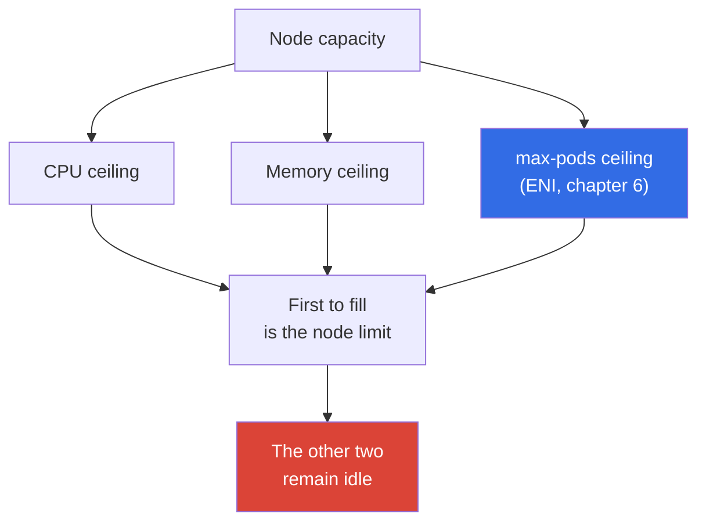
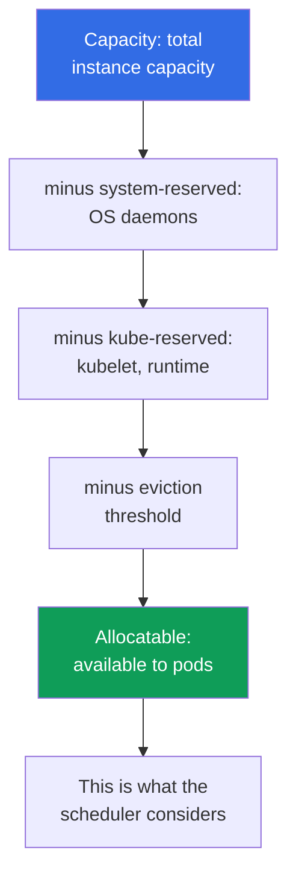

[Русская версия](ru.md) · [Versión en español](es.md) · [Version française](fr.md) · [Deutsche Version](de.md) · [ქართული ვერსია](ge.md) · [繁體中文版](tw.md) · [日本語版](jp.md)
# Chapter 14. Density and sizing: pods per node, ENI limits, requests and limits in the cloud

> **What comes next.** Nodes can already appear under load: Cluster Autoscaler and Karpenter
> (chapter 11), Karpenter configuration (chapter 12), and spot (chapter 13). What remains is to
> answer the question that becomes a bill directly in the cloud: how many pods to place on a node,
> and which requests and limits to set. This chapter is about density economics and stability. The
> derivation of the `max-pods` formula, ENIs, and the warm pool is fully covered in chapter 6;
> raising the pod ceiling through prefix delegation is in chapter 7; Karpenter instance selection
> is in chapter 12; HPA and VPA are in chapter 35; and total cost is in chapter 43. This chapter
> names and connects these levers without retelling them.

## 14.1. Three ways to pay for empty capacity

Three real scenarios, and all three involve money and stability at once.

First. The fleet uses `t3.medium` instances, nodes are at 20 percent CPU utilization, but new pods
cannot fit. The cause is neither CPU nor memory: they hit `max-pods` (chapter 6). A small instance
accepts 17 pods and stops, even though the CPU is idle. You pay for hardware that will never leave
idle based on utilization.

Second, the mirror image. Requests are lowered "so more can fit," pods are packed densely, and at
peak the node goes into CPU throttling while some containers get `OOMKilled`. The scheduler
thought everything fit because it considered requests rather than actual consumption.

Third. `requests == limits` is set everywhere on the principle that "it is more reliable." Half of
the cluster capacity sits idle as reserve: you pay for peak numbers reached once a day, while the
scheduler keeps them occupied around the clock. The autoscaler faithfully adds nodes for load that
does not exist.

Sizing is choosing between these three cliffs. In order: node ceilings, what is actually available
to pods, how requests and limits determine packing and stability, and how to calculate them from
facts rather than intuition.

## 14.2. The three node ceilings: CPU, memory, max-pods

A node has three independent limits, and it stops at whichever is exhausted first.



`max-pods` is defined by the VPC CNI ENI model; its formula and derivation are in chapter 6. The
important consequence for cost is that small instances reach their pod ceiling before CPU and
memory, so the CPU and RAM sit idle even though you pay for them.

| Instance | vCPU | Memory | max-pods | What it reaches with 100m/128Mi pods |
|---|---|---|---|---|
| `t3.small` | 2 | 2 GiB | 11 | `max-pods` long before CPU and memory |
| `t3.medium` | 2 | 4 GiB | 17 | `max-pods`: 17 pods is 1.7 vCPU |
| `m5.xlarge` | 4 | 16 GiB | 58 | balance: 58 pods use about 5.8 vCPU |
| `m5.4xlarge` | 16 | 64 GiB | 234 (cap 110) | CPU or memory before pods |

The rule is apparent from the table: the smaller the instance, the more likely it is to hit pods
rather than compute. In addition, DaemonSets (`aws-node`, `kube-proxy`, logging and metrics
agents) consume several pod slots regardless of node size, and on `t3.small` this fixed overhead
uses a material share of the eleven. Prefix delegation (chapter 7) raises the pod ceiling on the
same instance. It is the first lever against idle capacity caused by `max-pods`.

## 14.3. Migrating a high-density workload from kubeadm: pods-per-node versus VPC CNI

A migration symptom. A team migrates a self-built kubeadm cluster where the pod network uses an
overlay CNI (Calico or Flannel in VXLAN mode, Cilium in overlay mode). Pods there receive
addresses from the cluster's internal pod CIDR, IPs are "free," and hundreds of small pods are
placed on each node because kubelet `max-pods` was intentionally raised high. After moving to EKS,
the same-sized nodes accept several times fewer pods: some remain in `Pending`, and events show a
lack of IPs or resources even though node CPU and memory are free.

This is visible immediately in two places:

```bash
# Allocatable pods are noticeably lower than on kubeadm for the same instance type
kubectl get node <node> -o jsonpath='{.status.allocatable.pods}{"\n"}'
# Event on a pending pod: it lacked an IP/ENI slot, not CPU or memory
kubectl describe pod <pod> | grep -A 5 Events
```

The cause. VPC CNI does not create an overlay: it gives **EVERY** pod a real secondary IP from an
ENI in a VPC subnet. Therefore, the pod ceiling on a node is a function of the number of ENIs and
the number of IPs per ENI for the specific instance type:

```
max-pods = ENI * (IPs_per_ENI - 1) + 2
```

The numbers come from the AMI `eni-max-pods.txt` table and the AWS documentation on [managing the
Amazon VPC CNI](https://docs.aws.amazon.com/eks/latest/userguide/managing-vpc-cni.html) and
[choosing an instance type](https://docs.aws.amazon.com/eks/latest/userguide/choosing-instance-type.html).
Without prefix delegation, this is on the order of tens of pods for a typical instance, far below
an overlay on kubeadm. Kubernetes also recommends no more than about 110 pods per node: "a
thousand pods on a large node" is a kubeadm-overlay pattern, not an EKS goal.

What to do, in increasing order of radical change:

1. **Prefix delegation** is the main answer. The VPC CNI flag `ENABLE_PREFIX_DELEGATION=true`
   assigns an ENI slot to a `/28` prefix (16 addresses), not one IP. The pod ceiling rises to 110
   and beyond even on small nodes; the instance must be Nitro, and `max-pods` must be recalculated
   (details are in chapter 7). Configure the warm prefix pool through `WARM_PREFIX_TARGET`.
2. **A secondary CIDR plus custom networking** is appropriate if VPC addresses themselves run out
   in the subnet, rather than slots on the node (chapter 7).
3. **Reconsider density.** Do not bring the kubeadm "a thousand pods per node" pattern to EKS:
   Karpenter will select the right node sizes itself (chapter 12); use up to about 110 pods per
   node as a guide and pack honestly by requests (section 14.10 on bin packing).
4. **An alternative CNI.** Cilium in overlay mode provides kubeadm-like density decoupled from
   VPC IPs, but then you own the CNI lifecycle and lose some managed integrations (chapter 8).
5. **Fargate does not solve density**: one pod is a separate micro-VM, so it is not a solution for
   high-density workloads (chapter 15).

| Property | kubeadm overlay | EKS VPC CNI | EKS + prefix delegation |
|---|---|---|---|
| Pod address | from the cluster pod CIDR | real IP from a VPC subnet | `/28` prefix from a VPC subnet |
| Typical pods-per-node | hundreds | tens | 110 and above |
| What you pay with | overlay encapsulation | VPC addresses | VPC addresses in blocks of 16 |

Conclusion. In EKS, real VPC IPs are the node's currency, not a free overlay. Start the migration
plan for a high-density workload with prefix delegation and recalculating `max-pods`, rather than
buying larger nodes.

## 14.4. Reserved resources: Capacity versus Allocatable

Not all instance capacity goes to pods. Kubelet reserves some CPU and memory for itself and the
system, and maintains an eviction threshold. The remainder is what the scheduler sees as a
resource.



- **`kube-reserved`** is for kubelet, the container runtime, and Kubernetes system components.
- **`system-reserved`** is for OS daemons (`sshd`, systemd, and others).
- **eviction threshold** is the buffer below which kubelet starts evicting pods so that the node
  does not become `NotReady` because it runs out of memory.

The key EKS detail: the memory reservation is tied to the number of pods. The AMI bootstrap logic
calculates memory `kube-reserved` as approximately `11 * max-pods + 255` MiB, and then adds the
eviction threshold. Thus, the higher `max-pods` is on a node, the more memory enters reserve even
before the first pod starts. The overhead share is also higher on small instances: on a 2 GiB node,
the reserve and threshold take a material part; on 64 GiB, they are almost unnoticeable.

| Instance | Memory Capacity | Approximate overhead | Reserve share |
|---|---|---|---|
| `t3.small` | ~2 GiB | reserve plus threshold | high: a noticeable part of memory |
| `t3.medium` | ~4 GiB | reserve grows with max-pods | material |
| `m5.xlarge` | ~16 GiB | the same reserve over a larger volume | moderate |
| `m5.4xlarge` | ~64 GiB | reserve is small relative to capacity | low |

Always inspect Allocatable rather than the instance's marketing capacity:

```bash
# Capacity is total capacity; Allocatable is what is actually available to pods
kubectl describe node <node-name> | grep -A 12 -E 'Capacity:|Allocatable:'
# Pod-available resources only, in brief
kubectl get node <node-name> \
  -o jsonpath='{.status.allocatable.cpu}{"  "}{.status.allocatable.memory}{"  pods="}{.status.allocatable.pods}{"\n"}'
```

The difference between Capacity and Allocatable is what you pay for but do not give to pods. On a
fleet of many small nodes, this difference adds up to a material overpayment.

## 14.5. Requests and limits in the cloud: what they actually decide

In a bare-metal cluster, requests and limits are a question of fairness to neighbors on the node.
In the cloud, they gain a direct monetary meaning because nodes are paid for while they exist.

- **requests determine packing and cost.** The scheduler places a pod only if the node has enough
  *requests*, not according to actual consumption. The sum of requests determines how many pods
  fit on a node and when the autoscaler adds another one (chapter 11). You pay for capacity
  reserved by requests, not capacity used.
- **limits constrain consumption.** This is the upper bound: CPU over the limit is throttled, and
  memory over the limit kills the container. Limits do not affect packing or the autoscaler's
  decision.

This produces two costly mistakes. **Understating requests** means the scheduler believes more
fits than the node can sustain; at peak, overcommitment, CPU throttling, `OOMKilled`, and pod
eviction follow. **Overstating requests** means every pod reserves more than it consumes; nodes
look full at low actual utilization, the autoscaler adds unnecessary hardware, and the bill grows
for idle capacity.

```yaml
resources:
  requests:            # these values determine packing and grow the bill
    cpu: "250m"
    memory: "256Mi"
  limits:              # upper bound on container consumption
    cpu: "500m"
    memory: "256Mi"    # keep the memory limit equal to the request in most cases (section 14.7)
```

## 14.6. QoS classes and eviction order

Kubernetes translates the relationship between a pod's requests and limits into a quality of
service (QoS) class, and that class decides whom to evict first when the node runs out of memory.

| QoS class | Condition | Who is evicted when memory is scarce |
|---|---|---|
| `Guaranteed` | requests == limits for CPU and memory for every container | last |
| `Burstable` | requests are set but lower than limits (or no limits) | after BestEffort, by consumption over requests |
| `BestEffort` | neither requests nor limits are set | first |

The scheduler can place a `BestEffort` pod without requests anywhere, and it will be the first to
be killed under memory pressure: suitable for background tasks, not services. `Guaranteed` gives
maximum eviction protection, but at a cost: `requests == limits` means reserving the peak around
the clock.

Check a pod's assigned class:

```bash
kubectl get pod <pod> -o jsonpath='{.status.qosClass}{"\n"}'
kubectl describe pod <pod> | grep -i 'QoS Class'
```

When `requests == limits` (`Guaranteed`) is justified: databases and stateful workloads where
eviction is expensive, and latency-sensitive services that cannot lose CPU. When it is harmful:
large stateless services with infrequent peaks, where a hard reservation for the peak holds
capacity without benefit and inflates the bill.

## 14.7. CPU throttling and OOMKilled: why memory is stricter

CPU and memory behave fundamentally differently under limits, and that changes the approach.

**CPU is a compressible resource.** A CPU limit is implemented through the Linux kernel's CFS
quota: the container receives a share of processor time in a scheduling window, and when it
exceeds that share, it is **throttled**: slowed down, not killed. The symptom is higher latency and
the `container_cpu_cfs_throttled` metric while the pod remains alive and apparently healthy. A CPU
limit that is too low chokes a workload that formally "works."

**Multithreaded runtimes suffer most.** CFS quota is counted across all cores for the scheduling
window, usually 100 ms. An application with a thread pool, typically Java or Go, spreads work over
all node cores at once and exhausts its quota in the first milliseconds of the window, then is
throttled for the rest of the period. The result is latency spikes at average utilization well
below the limit. This is worsened because the runtime sees all node cores by default rather than
its allocated share: Go sets `GOMAXPROCS` from the host core count, Java sizes pools by
`Runtime.availableProcessors()`, and so creates threads for a large machine while its quota is for
a small one. Therefore, with honest CPU requests, a hard CPU limit often only harms such an
application: requests already guarantee a processor share under contention, while a limit adds
throttling with no stability benefit.

**Memory is an incompressible resource.** Memory already allocated cannot be taken back; there is
no "soft throttling" for memory. A container that exceeds its memory limit receives `OOMKilled`
from the kernel and restarts. Therefore, a memory limit matters more than a CPU limit: it is the
real boundary between operation and termination.

```bash
# Restart reason: look for OOMKilled in the container's Last State
kubectl describe pod <pod> | grep -A 5 'Last State'
kubectl get pod <pod> -o jsonpath='{.status.containerStatuses[0].lastState.terminated.reason}{"\n"}'
# Actual consumption against configured values
kubectl top pods --containers
```

A practice worth remembering: **keep `request == limit` for memory** so behavior is predictable
and a pod cannot unexpectedly consume its neighbors' reserve and get OOM-killed on a shared node.
For CPU, it is common to leave `limit` higher than `request`, or not set a CPU limit at all,
letting a pod use idle processor safely: throttling will still bring it back within bounds under
contention. This is a trade-off, not a rule: latency-sensitive services sometimes need a CPU limit
for predictability.

## 14.8. Density as a cost lever

The choice between many small nodes and few large ones is a collection of trade-offs, not one
correct answer.

| Aspect | Small nodes | Large nodes |
|---|---|---|
| Reserved share (section 14.4) | higher: you pay for overhead | lower: reserve is small relative to capacity |
| System pods and DaemonSets | duplicated on every node | amortized over more pods |
| Risk of hitting `max-pods` | high (chapter 6) | low |
| Node failure blast radius | small: few pods fail | large: many pods fail at once |
| Scaling increment | small and precise | coarse: adding one gives much capacity at once |
| Bin packing and fragmentation | more leftover edges | denser packing |

Large nodes save on overhead and system pods, but increase the blast radius and make scaling
coarse: one new node immediately adds a lot of capacity and may sit idle. Small nodes provide a
precise increment and a small radius, but pay a higher reserve share and risk hitting `max-pods`.
Prefix delegation (chapter 7) removes the latter constraint by raising the pod ceiling, so it is
enabled by default in dense fleets.

## 14.9. Sizing requests in practice

There is one rule: **set requests from facts, not intuition**. Numbers guessed "by eye" cause both
cliffs from section 14.1.

- Capture actual consumption: `metrics-server` and `kubectl top` provide a snapshot, while
  Prometheus provides history with peaks (chapter 33).
- Use VPA in `recommend` mode (without automatic application) for request recommendations: it
  observes the workload and proposes values without touching pods (chapter 35).
- Set requests from the actual profile with headroom for a peak, not from a maximum reached once a
  day. For memory, remember `request == limit` (section 14.7).
- Right-sizing is a process, not a one-time setting: workload profiles change, requests must be
  reviewed regularly, and economics are calculated using the tools from chapter 43.

```bash
# Snapshot of node utilization: compare with the sum of requests in describe node
kubectl top nodes
# Per-container consumption is the basis for reviewing requests
kubectl top pods --all-namespaces --containers
```

## 14.10. Bin packing: why identical nodes pack better

Packing pods onto nodes is a bin-packing problem, and its predictability directly depends on how
homogeneous the fleet is and how accurately requests reflect reality.

- The scheduler packs pods by *requests*. If requests are understated, packing looks dense while
  the node is overloaded in fact; if overstated, much "empty capacity" remains at the edges.
- Heterogeneous nodes pack worse: each size has its own remainder, fragmentation grows, and some
  capacity is never used. Identical nodes produce a repeatable and predictable result that is
  easier to plan and alert on.
- Topology affects packing: AZ constraints, `topologySpread`, affinity, and taints reduce the set
  of eligible nodes, and overly strict rules prevent dense placement (chapter 40).
- Karpenter consolidation (chapter 12) periodically repacks the cluster: it evicts pods from
  underutilized nodes and turns those nodes off. It works better the more honest requests are and
  the more homogeneous node types are, because consolidation then finds a dense option without
  gaps.

## 14.11. How this is applied in production

- **Choose the instance type by all three ceilings at once**, not only CPU and memory: calculate
  what the node will hit first and do not choose small instances doomed to be idle because of
  `max-pods` (chapter 6). Enable prefix delegation where the pod ceiling is restrictive (chapter
  7).
- **Set requests from actual consumption**: collect metrics and VPA recommendations (chapters 33
  and 35), rather than guessing. Reviewing requests is a regular task, not a one-time event.
- **Keep `request == limit` for memory**; for CPU, often leave headroom or do not set a limit:
  memory is incompressible and causes `OOMKilled`, while CPU is only throttled.
- **Assign QoS deliberately**: `Guaranteed` for databases and latency-sensitive services,
  `Burstable` for large stateless workloads, and `BestEffort` only for work that is safe to evict.
- **Keep the fleet homogeneous by type** as much as possible: predictable packing, efficient
  Karpenter consolidation (chapter 12), and simple utilization alerts.
- **Inspect Allocatable rather than Capacity**, and monitor the gap between the sum of requests and
  actual consumption: it is a direct metric of overpayment (chapter 43).

## 14.12. Mini-glossary

- **Capacity** is the instance's full CPU, memory, and pod capacity. **Allocatable** is what
  remains for pods after `kube-reserved`, `system-reserved`, and the eviction threshold; this is
  what the scheduler considers.
- **`kube-reserved` / `system-reserved`** are resources kubelet reserves for Kubernetes and the
  OS. **eviction threshold** is the memory buffer below which kubelet evicts pods.
- **requests** are the resource amount used for packing and the autoscaler's decision: a reservation
  for the pod. **limits** are the upper bound on container consumption.
- **QoS class** is `Guaranteed`, `Burstable`, or `BestEffort`; it determines eviction order under
  memory pressure. **CFS throttling** is slowing a container when it exceeds a CPU limit.
  **OOMKilled** is the kernel killing a container when it exceeds a memory limit.
- **bin packing** is placing pods on nodes by their requests. **right-sizing** is aligning requests
  with actual consumption.

## 14.13. Chapter summary

- A node has three independent ceilings: CPU, memory, and `max-pods` (ENI, chapter 6), and it
  stops at whichever is exhausted first. Small instances hit `max-pods` before compute and remain
  idle at your expense; prefix delegation (chapter 7) raises this ceiling.
- Pods do not receive all capacity: `kube-reserved`, `system-reserved`, and the eviction threshold
  create a gap between Capacity and Allocatable. EKS memory reserve grows with `max-pods`, and its
  share is higher on small instances. The scheduler calculates from Allocatable.
- Requests determine packing, when the autoscaler adds a node, and cost; limits constrain
  consumption. Understating requests leads to throttling, OOM, and eviction; overstating them
  leads to idle capacity and overpayment.
- The QoS class from the relationship between requests and limits sets eviction order.
  `request == limit` (`Guaranteed`) is justified for databases and latency-sensitive services, but
  keeps peak capacity occupied around the clock.
- CPU is throttled through CFS quota and does not kill a pod; memory is incompressible and causes
  `OOMKilled`. Therefore, keep the memory limit equal to the request, and size requests from facts
  using metrics and VPA (chapters 33 and 35). A homogeneous fleet packs more predictably and
  consolidates better with Karpenter (chapter 12); economics are calculated in chapter 43.

## 14.14. How this helps in real work

During an incident, the combination "a pod is in `CrashLoopBackOff`, and Last State shows
`OOMKilled`" stops being a mystery: you know that it hit the memory limit and where to look:
`kubectl top` and the workload profile. Higher service latency with living pods sends you to check
CPU throttling rather than the network. When planning a fleet, you bring not "let's get larger
instances," but a calculation across all three ceilings that includes Allocatable and the request
profile, and explain why `t3.medium` is almost always uneconomical in production. A cost discussion
(chapter 43) then starts not with a node, but with the gap between the sum of requests and actual
consumption: the metric for the empty capacity you pay for.

## 14.15. Self-check questions

1. Name the three node ceilings. Why does `t3.medium` often have idle CPU when its pod capacity is full?
2. How does Capacity differ from Allocatable, and which one does the scheduler see?
3. Why does the EKS memory reserve grow with `max-pods`, and which instances have the higher overhead share?
4. What do requests affect, and what do limits affect? How does each sizing mistake affect the bill?
5. How does the relationship between requests and limits determine QoS class and eviction order?
6. When is `request == limit` justified, and when does it only keep capacity needlessly occupied?
7. Why is a limit more important for memory than CPU? What happens when each is exceeded?
8. Why can CPU be left without a limit while memory generally should not?
9. How do you correctly determine requests for a new service without guessing numbers?
10. Why does a homogeneous node fleet pack more predictably and consolidate better?
11. Which lever from chapter 7 removes the `max-pods` ceiling, and when should it be enabled?

## Practice

The course lab for this topic is [lab 103 - Address plan: ENI limits, prefix delegation, secondary
CIDR](../../labs/103/README.MD), where the max-pods formula from this chapter is compared against
reality on a live node. Besides that, everything is verified on a live cluster. Start with the gap
between Capacity and Allocatable: `kubectl describe node <node> | grep -A 12 -E
'Capacity:|Allocatable:'` shows how much instance capacity is unavailable to pods, while `kubectl
get node <node> -o jsonpath='{.status.allocatable.pods}'` shows the pod ceiling. Compare the sum
of requests for all pods on a node from `kubectl describe node` (the `Allocated resources` block)
with actual utilization from `kubectl top nodes`: the difference is the empty capacity you pay for.

Next, find pods without requests (`BestEffort`) and inspect their QoS class using `kubectl get pod
<pod> -o jsonpath='{.status.qosClass}'`. Take a service with restarts and check the cause:
`kubectl describe pod <pod> | grep -A 5 'Last State'`. If it shows `OOMKilled`, compare its memory
limit with `kubectl top pods --containers`. Finally, estimate from the table in section 14.2 what
your current instance type will reach first, then test the hypothesis: compare `max-pods` from
allocatable with the actual number of pods on the node from `kubectl get pods -A -o wide
--field-selector spec.nodeName=<node>`.

---
[Table of contents](../README.md) · [Chapter 13](../13/en.md) · [Chapter 15](../15/en.md)
