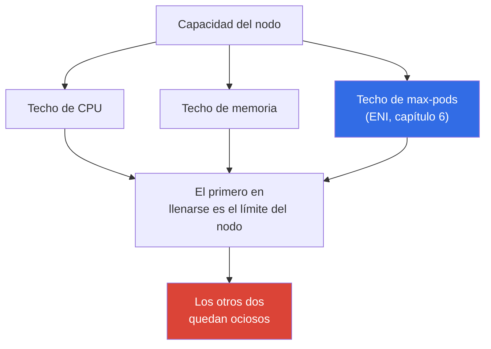
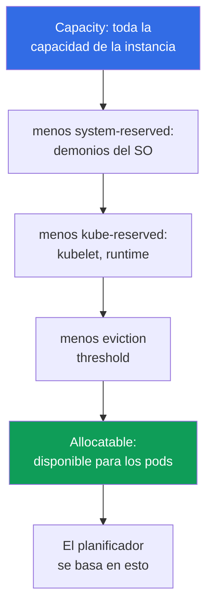

[Русская версия](ru.md) · [Eng version](en.md) · [Version française](fr.md) · [Deutsche Version](de.md) · [ქართული ვერსია](ge.md) · [繁體中文版](tw.md) · [日本語版](jp.md)
# Capítulo 14. Densidad y dimensionamiento: pods por nodo, límites de ENI, requests y limits en la nube

> **Qué sigue.** Los nodos ya pueden aparecer bajo carga: Cluster Autoscaler y Karpenter
> (capítulo 11), configuración de Karpenter (capítulo 12), spot (capítulo 13). Falta responder la pregunta
> que en la nube se convierte directamente en una factura: cuántos pods colocar en un nodo y qué requests
> y limits asignarles. Este capítulo trata de la economía de la densidad y la estabilidad. La derivación de
> la fórmula `max-pods`, ENI y el pool cálido está íntegra en el capítulo 6; aumentar el techo de pods mediante
> prefix delegation, en el capítulo 7; la selección de instancias de Karpenter, en el capítulo 12; HPA y VPA,
> en el capítulo 35; y el coste completo, en el capítulo 43. Aquí se nombran y se conectan estas palancas,
> pero no se repiten.

## 14.1. Tres formas de pagar por aire

Tres situaciones reales, y las tres afectan al mismo tiempo al dinero y a la estabilidad.

La primera. El parque se compone de `t3.medium`, los nodos están al 20 por ciento de CPU, pero los pods
nuevos no caben. La causa no es la CPU ni la memoria: se alcanzó `max-pods` (capítulo 6). Una instancia
pequeña admite 17 pods y se detiene, aunque el procesador esté ocioso. Se paga por hardware que, por carga,
nunca saldrá de la inactividad.

La segunda es el espejo. Los requests se redujeron «para que quepan más», los pods se compactaron y, en el
pico, el nodo entra en CPU throttling y algunos contenedores reciben `OOMKilled`. El planificador consideraba
que todo cabía porque miraba los requests, no el consumo real.

La tercera. En todas partes se configuró `requests == limits` bajo el principio de «es más seguro». La mitad de
la capacidad del clúster queda ociosa como reserva: se pagó por cifras de pico que se alcanzan una vez al día,
y el planificador las mantiene ocupadas las 24 horas. El autoescalador añade fielmente nodos para una carga
inexistente.

El dimensionamiento consiste en elegir entre estos tres precipicios. A continuación, por orden: dónde están los
techos de un nodo, qué queda realmente disponible para los pods, cómo requests y limits determinan la
compactación y la estabilidad, y cómo calcularlos a partir de hechos, no de la intuición.

## 14.2. Los tres techos de un nodo: CPU, memoria, max-pods

Un nodo tiene tres límites independientes y se detiene en el que se agote primero.



`max-pods` lo establece el modelo ENI de VPC CNI; la fórmula y su derivación están en el capítulo 6. Aquí
importa la consecuencia económica: en instancias pequeñas, el techo de pods se alcanza antes que el de CPU y
memoria, de modo que el procesador y la RAM quedan ociosos, aunque se pague por ellos.

| Instancia | vCPU | Memoria | max-pods | Límite con pods de 100m/128Mi |
|---|---|---|---|---|
| `t3.small` | 2 | 2 GiB | 11 | `max-pods`, mucho antes que CPU y memoria |
| `t3.medium` | 2 | 4 GiB | 17 | `max-pods`: 17 pods son 1.7 vCPU |
| `m5.xlarge` | 4 | 16 GiB | 58 | equilibrio: 58 pods dan cerca de 5.8 vCPU |
| `m5.4xlarge` | 16 | 64 GiB | 234 (límite 110) | CPU o memoria antes que pods |

La tabla muestra la regla: cuanto menor es la instancia, más probable es que alcance el límite de pods y no el
de cómputo. Además, los DaemonSets (`aws-node`, `kube-proxy`, agentes de logs y métricas) consumen varios
slots de pods, sin importar el tamaño del nodo, y en un `t3.small` este coste fijo consume una fracción
significativa de los once. Prefix delegation (capítulo 7) eleva el techo de pods en la misma instancia: es la
primera palanca contra la inactividad causada por `max-pods`.

## 14.3. Migrar carga de alta densidad desde kubeadm: pods por nodo frente a VPC CNI

El síntoma al migrar. El equipo migra un clúster kubeadm autogestionado, cuya red de pods usa un CNI overlay
(Calico o Flannel en modo VXLAN, Cilium en overlay). Allí los pods reciben direcciones del pod-CIDR interno
del clúster, las IP son «gratis» y hay cientos de pods pequeños en cada nodo: `max-pods` del kubelet se elevó
intencionadamente. Tras migrar a EKS, nodos del mismo tamaño admiten varias veces menos pods: algunos quedan
en `Pending`; los eventos indican falta de IP o recursos, aunque la CPU y la memoria estén libres en el nodo.

Esto se ve de inmediato en dos lugares:

```bash
# Allocatable pods es mucho menor que en kubeadm para el mismo tipo de instancia
kubectl get node <node> -o jsonpath='{.status.allocatable.pods}{"\n"}'
# Evento del pod bloqueado: faltó un slot de IP/ENI, no CPU ni memoria
kubectl describe pod <pod> | grep -A 5 Events
```

La causa. VPC CNI no crea un overlay: asigna a CADA pod una IP secundaria real de un ENI en la subred VPC.
Por ello, el techo de pods de un nodo es una función del número de ENI y de IP por ENI del tipo de instancia
concreto:

```
max-pods = ENI * (IP_por_ENI - 1) + 2
```

Los valores se toman de la tabla `eni-max-pods.txt` de la AMI (docs.aws.amazon.com, managing-vpc-cni y
choosing-instance-type). Sin prefix delegation se trata de decenas de pods en una instancia típica, mucho
menos que con un overlay en kubeadm. Además, Kubernetes recomienda no superar aproximadamente 110 pods por
nodo: «mil pods en un large» es un patrón kubeadm-overlay, no un objetivo para EKS.

Qué hacer, de menor a mayor radicalidad:

1. **Prefix delegation** es la respuesta principal. La opción `ENABLE_PREFIX_DELEGATION=true` de VPC CNI
   asigna un slot ENI no a una IP, sino a un prefijo `/28` (16 direcciones). El techo de pods sube a 110 o más
   incluso en nodos pequeños; se requiere una instancia Nitro y se recalcula `max-pods` (detalles en el
   capítulo 7). El pool cálido de prefijos se configura mediante `WARM_PREFIX_TARGET`.
2. **Secondary CIDR más custom networking**, si se agotan las direcciones VPC de la subred, no los slots del
   nodo (capítulo 7).
3. **Reconsiderar la densidad.** No trasladar a EKS el patrón kubeadm de «mil pods por nodo»: Karpenter
   elegirá los tamaños de nodo adecuados (capítulo 12); la referencia es hasta unos 110 pods por nodo y una
   compactación honesta según los requests (sección 14.10 sobre bin packing).
4. **CNI alternativo**: Cilium en modo overlay ofrece una densidad similar a kubeadm, desacoplada de las IP
   de VPC, pero entonces usted gestiona el ciclo de vida del CNI y pierde parte de las integraciones managed
   (capítulo 8).
5. **Fargate no resuelve la densidad**: un pod es una micro-VM independiente, así que no es una salida para
   carga de alta densidad (capítulo 15).

| Propiedad | kubeadm overlay | EKS VPC CNI | EKS + prefix delegation |
|---|---|---|---|
| Dirección del pod | del pod-CIDR del clúster | IP real de la subred VPC | prefijo `/28` de la subred VPC |
| Orden de pods por nodo | cientos | decenas | 110 o más |
| Con qué se paga | encapsulación overlay | direcciones VPC | direcciones VPC en bloques de 16 |

Conclusión. En EKS, las IP VPC reales son la moneda del nodo, no un overlay gratuito. El plan de migración de
carga de alta densidad comienza con prefix delegation y el recálculo de `max-pods`, no comprando nodos más
grandes.

## 14.4. Recursos reservados: Capacity frente a Allocatable

No toda la capacidad de una instancia llega a los pods. El kubelet reserva parte de la CPU y la memoria para
sus necesidades y para el sistema, y mantiene un umbral de expulsión. El planificador solo ve como recurso lo
que queda.



- **`kube-reserved`**: para kubelet, container runtime y componentes de sistema de Kubernetes.
- **`system-reserved`**: para demonios del SO (`sshd`, systemd y otros).
- **eviction threshold**: búfer por debajo del cual el kubelet empieza a expulsar pods para que el nodo no
  pase a `NotReady` por falta de memoria.

Un detalle clave de EKS: la reserva de memoria se vincula con el número de pods. La lógica de bootstrap de la
AMI calcula la memoria de `kube-reserved` aproximadamente como `11 * max-pods + 255` MiB, a lo que se suma el
umbral de expulsión. Es decir, cuanto mayor sea `max-pods` del nodo, más memoria se reserva antes de iniciar
el primer pod. La proporción de sobrecarga también es mayor en instancias pequeñas: en un nodo de 2 GiB, la
reserva y el umbral consumen una porción considerable; en uno de 64 GiB, apenas se notan.

| Instancia | Memoria Capacity | Orden de sobrecarga | Proporción de reserva |
|---|---|---|---|
| `t3.small` | ~2 GiB | reserva más umbral | alta: parte significativa de la memoria |
| `t3.medium` | ~4 GiB | la reserva crece con max-pods | apreciable |
| `m5.xlarge` | ~16 GiB | la misma reserva en más volumen | moderada |
| `m5.4xlarge` | ~64 GiB | reserva pequeña frente a capacidad | baja |

Siempre hay que consultar Allocatable, no el volumen de marketing de la instancia:

```bash
# Capacity es toda la capacidad; Allocatable, lo realmente disponible para los pods
kubectl describe node <node-name> | grep -A 12 -E 'Capacity:|Allocatable:'
# Solo los recursos disponibles para pods, de forma concisa
kubectl get node <node-name> \
  -o jsonpath='{.status.allocatable.cpu}{"  "}{.status.allocatable.memory}{"  pods="}{.status.allocatable.pods}{"\n"}'
```

La diferencia entre Capacity y Allocatable es aquello por lo que se paga, pero que no se entregará a los pods.
En un parque de muchos nodos pequeños, esa diferencia suma un sobrecoste significativo.

## 14.5. Requests y limits en la nube: qué deciden realmente

En un clúster bare metal, requests y limits son una cuestión de equidad con los vecinos del nodo. En la nube
adquieren un sentido económico directo, porque se paga por los nodos mientras existen.

- **Los requests determinan la compactación y el coste.** El planificador sitúa un pod solo si el nodo tiene
  *requests* suficientes, no según el consumo real. La suma de requests decide cuántos pods caben en el nodo
y cuándo el autoescalador añadirá uno (capítulo 11). Se paga por lo reservado bajo requests, no por lo usado.
- **Los limits restringen el consumo.** Son el límite superior: la CPU por encima del limit se estrangula y la
  memoria por encima del limit mata el contenedor. Los limits no afectan a la compactación ni a la decisión del
autoescalador.

De ahí surgen dos errores con precio. **Subestimar los requests** hace que el planificador crea que cabe más de
lo que soporta el nodo; en un pico llega la sobreasignación, CPU throttling, `OOMKilled` y expulsión de pods.
**Sobreestimar los requests** hace que cada pod reserve más de lo que consume; los nodos parecen llenos con
poca carga real, el autoescalador añade hardware innecesario y la factura crece por la inactividad.

```yaml
resources:
  requests:            # la compactación y la factura se basan en estos valores
    cpu: "250m"
    memory: "256Mi"
  limits:              # límite superior del consumo del contenedor
    cpu: "500m"
    memory: "256Mi"    # para memoria, el limit suele igualar al request (sección 14.7)
```

## 14.6. Clases QoS y orden de expulsión

La relación entre requests y limits de un pod la convierte Kubernetes en una clase de calidad de servicio (QoS),
y esa clase establece quién se expulsa primero cuando el nodo se queda sin memoria.

| Clase QoS | Condición | Quién se expulsa cuando falta memoria |
|---|---|---|
| `Guaranteed` | requests == limits de CPU y memoria para todos los contenedores | al final |
| `Burstable` | requests definidos pero menores que limits, o sin limits | después de BestEffort, según el exceso sobre requests |
| `BestEffort` | no hay requests ni limits | primero |

Un pod `BestEffort` sin requests puede colocarse en cualquier parte y será el primero sacrificado bajo presión
de memoria: es adecuado para tareas de fondo, no para servicios. `Guaranteed` ofrece la máxima protección
contra la expulsión, pero a un precio: `requests == limits` significa reservar el pico las 24 horas.

Compruebe la clase asignada al pod:

```bash
kubectl get pod <pod> -o jsonpath='{.status.qosClass}{"\n"}'
kubectl describe pod <pod> | grep -i 'QoS Class'
```

Cuándo se justifica `requests == limits` (Guaranteed): bases de datos y cargas stateful, donde la expulsión es
costosa, y servicios sensibles a la latencia que no pueden perder CPU. Cuándo es perjudicial: servicios
stateless masivos con picos poco frecuentes; allí, una reserva rígida para el pico mantiene la capacidad
ocupada sin utilidad e infla la factura.

## 14.7. CPU throttling y OOMKilled: por qué la memoria es más estricta

La CPU y la memoria se comportan de modo fundamentalmente distinto bajo limits, y eso cambia la táctica.

**La CPU es un recurso compresible.** El limit de CPU se implementa mediante CFS quota del kernel Linux: al
contenedor se le asigna una fracción de tiempo de procesador en la ventana de planificación y, si la supera, se
le aplica **throttling**, se ralentiza, pero no se mata. El síntoma es el aumento de latencia y la métrica
`container_cpu_cfs_throttled`, mientras el pod sigue vivo y aparentemente sano. Un CPU limit demasiado bajo
asfixia una carga que formalmente «funciona».

**Los runtimes multihilo sufren más que nadie.** CFS quota se calcula sumando todos los núcleos durante la
ventana de planificación, normalmente 100 ms. Una aplicación con un pool de hilos, normalmente Java o Go,
distribuye el trabajo sobre todos los núcleos del nodo a la vez y agota la cuota en los primeros milisegundos de
la ventana, tras lo cual recibe throttling hasta que termina el período. El resultado son picos de latencia con
una carga media muy inferior al limit. Esto empeora porque el runtime ve por defecto todos los núcleos del
nodo, no la fracción asignada: Go configura `GOMAXPROCS` con el número de núcleos del host, Java dimensiona
pools según `Runtime.availableProcessors()`, y se crean hilos para una máquina grande cuando la cuota es
pequeña. Por ello, con CPU requests honestos, un CPU limit rígido suele perjudicar a esa aplicación: los
requests ya garantizan una porción del procesador bajo competencia, y el limit añade throttling sin mejorar la
estabilidad.

**La memoria es un recurso no compresible.** No se puede retirar memoria que ya fue asignada; la memoria no
tiene «throttling» suave. Un contenedor que supera el memory limit recibe `OOMKilled` del kernel y se reinicia.
Por ello, el limit es más importante para memoria que para CPU: es la frontera real entre funcionar y morir.

```bash
# Motivo del reinicio: buscar OOMKilled en Last State del contenedor
kubectl describe pod <pod> | grep -A 5 'Last State'
kubectl get pod <pod> -o jsonpath='{.status.containerStatuses[0].lastState.terminated.reason}{"\n"}'
# Consumo real frente a los valores configurados
kubectl top pods --containers
```

Práctica que conviene recordar: **para memoria, mantenga `request == limit`**, para que el comportamiento sea
predecible y un pod no pueda superar de pronto la reserva de sus vecinos y sufrir OOM en un nodo compartido.
Para CPU, a menudo se deja el `limit` por encima del `request` o no se configura CPU limit, permitiendo al pod
usar procesador ocioso sin riesgo: el throttling lo devolverá a sus límites cuando haya competencia. Es un
compromiso, no un dogma: los servicios sensibles a la latencia a veces necesitan CPU limit por previsibilidad.

## 14.8. La densidad como palanca de coste

Elegir entre «muchos nodos pequeños» y «pocos nodos grandes» es un conjunto de compromisos, no una respuesta
única correcta.

| Aspecto | Nodos pequeños | Nodos grandes |
|---|---|---|
| Proporción de reserved (sección 14.4) | mayor: se paga por la sobrecarga | menor: la reserva es pequeña frente a la capacidad |
| Pods de sistema y DaemonSets | se duplican en cada nodo | se amortizan entre más pods |
| Riesgo de alcanzar `max-pods` | alto (capítulo 6) | bajo |
| Radio de impacto de un fallo de nodo | pequeño: caen pocos pods | grande: caen muchos pods a la vez |
| Paso de escalado | pequeño y preciso | grueso: se añade mucha capacidad de golpe |
| Bin packing y fragmentación | más restos en los bordes | compactación más densa |

Los nodos grandes ahorran en sobrecarga y pods de sistema, pero aumentan el radio de impacto y hacen el
escalado más grueso: un nodo nuevo añade mucha capacidad de una vez y puede quedar ocioso. Los nodos pequeños
ofrecen un paso preciso y un radio pequeño, pero pagan una mayor proporción de reserva y pueden alcanzar
`max-pods`. Prefix delegation (capítulo 7) elimina esta última limitación al elevar el techo de pods, por lo
que se habilita de forma predeterminada en parques densos.

## 14.9. Dimensionar requests en la práctica

Solo hay una regla: **los requests se configuran según hechos, no intuición**. Los valores adivinados «a ojo»
son el origen de ambos precipicios de la sección 14.1.

- Obtenga el consumo real: `metrics-server` y `kubectl top` ofrecen una vista instantánea; Prometheus, el
  historial con picos (capítulo 33).
- Para recomendaciones de requests, use VPA en modo `recommend` sin aplicación automática: observa la carga y
  propone valores, sin tocar los pods (capítulo 35).
- Configure los requests según el perfil real, con margen para el pico, no según el máximo que ocurre una vez
  al día. Para memoria, recuerde `request == limit` (sección 14.7).
- Right-sizing es un proceso, no un ajuste único: el perfil de carga cambia, los requests se revisan con
  regularidad y la economía se calcula con las herramientas del capítulo 43.

```bash
# Carga instantánea de los nodos: compárela con la suma de requests de describe node
kubectl top nodes
# Consumo por contenedor: base para revisar requests
kubectl top pods --all-namespaces --containers
```

## 14.10. Bin packing: por qué los nodos iguales se compactan mejor

La compactación de pods en nodos es un problema de bin packing, y su previsibilidad depende directamente de
cuán homogéneo sea el parque y de cuánto reflejen los requests la realidad.

- El planificador coloca pods según los *requests*. Si los requests se subestiman, la compactación parece
densa, pero el nodo está realmente sobrecargado; si se sobreestiman, queda mucho «aire» en los bordes.
- Los nodos heterogéneos se compactan peor: cada tamaño tiene su propio remanente, aumenta la fragmentación y
parte de la capacidad nunca se utiliza. Los nodos iguales dan un resultado repetible y predecible, más fácil
de planificar y de alertar.
- La topología influye en la compactación: restricciones por AZ, `topologySpread`, affinity y taints reducen
el conjunto de nodos admisibles, y reglas demasiado estrictas impiden una colocación densa (capítulo 40).
- Karpenter consolidation (capítulo 12) recompacta periódicamente el clúster: evacúa pods de nodos con poca
carga y los apaga. Funciona mejor cuanto más honestos sean los requests y más homogéneos los tipos de nodo,
porque entonces la consolidación encuentra una alternativa densa sin huecos.

## 14.11. Cómo se aplica en producción

- **El tipo de instancia se elige según los tres techos a la vez**, no solo CPU y memoria: se calcula cuál
  alcanzará primero el nodo y no se toman instancias pequeñas condenadas a quedar ociosas por `max-pods`
  (capítulo 6). Prefix delegation se habilita cuando el techo de pods aprieta (capítulo 7).
- **Los requests se basan en el consumo real**: se toman métricas y recomendaciones VPA (capítulos 33 y 35),
  no se adivinan. Revisar los requests es una tarea regular, no puntual.
- **Para memoria se mantiene `request == limit`**; para CPU suele dejarse margen o no se configura limit: la
  memoria no es compresible y produce `OOMKilled`, la CPU solo recibe throttling.
- **Las QoS se asignan de forma consciente**: `Guaranteed` para bases de datos y servicios sensibles a la
  latencia, `Burstable` para servicios stateless masivos, `BestEffort` solo para lo que se puede expulsar.
- **El parque se mantiene homogéneo en tipos** en lo posible: compactación predecible, consolidación eficaz
  de Karpenter (capítulo 12) y alertas de carga sencillas.
- **Se consulta Allocatable, no Capacity**, y se monitoriza la diferencia entre la suma de requests y el
  consumo real: es una métrica directa del sobrecoste (capítulo 43).

## 14.12. Miniglosario

- **Capacity**: capacidad total de la instancia en CPU, memoria y pods. **Allocatable**: lo que queda para los
  pods tras `kube-reserved`, `system-reserved` y el umbral de expulsión; el planificador se basa en ello.
- **`kube-reserved` / `system-reserved`**: recursos que kubelet reserva para Kubernetes y para el SO.
  **eviction threshold**: búfer de memoria por debajo del cual kubelet expulsa pods.
- **requests**: volumen de recursos que usa la compactación y la decisión del autoescalador; reserva para el
  pod. **limits**: límite superior del consumo del contenedor.
- **Clase QoS**: `Guaranteed`, `Burstable` o `BestEffort`; establece el orden de expulsión cuando falta
  memoria. **CFS throttling**: ralentización del contenedor al superar CPU limit. **OOMKilled**: muerte del
  contenedor por el kernel al superar memory limit.
- **bin packing**: colocación de pods en nodos según sus requests. **right-sizing**: ajuste de requests al
  consumo real.

## 14.13. Resumen del capítulo

- Un nodo tiene tres techos independientes: CPU, memoria y `max-pods` (ENI, capítulo 6), y se detiene en el
  primero que se agote. Las instancias pequeñas alcanzan `max-pods` antes que el cómputo y quedan ociosas a su
  costa; prefix delegation (capítulo 7) eleva este techo.
- No toda la capacidad llega a los pods: `kube-reserved`, `system-reserved` y el umbral de expulsión abren una
  diferencia entre Capacity y Allocatable. La reserva de memoria en EKS crece con `max-pods`, y su proporción
  es mayor en instancias pequeñas. El planificador calcula según Allocatable.
- Los requests determinan la compactación, cuándo el autoescalador añade un nodo y el coste; los limits
  restringen el consumo. Subestimar los requests conduce a throttling, OOM y expulsión; sobreestimarlos, a
  inactividad y sobrecoste.
- La clase QoS derivada de la relación entre requests y limits establece el orden de expulsión. `request ==
  limit` (Guaranteed) se justifica para bases de datos y servicios sensibles a la latencia, pero mantiene el
  pico ocupado las 24 horas.
- La CPU recibe throttling mediante CFS quota y no mata el pod; la memoria no es compresible y causa
  `OOMKilled`, por lo que el limit de memoria se mantiene igual al request y los requests se dimensionan a
  partir de métricas y VPA (capítulos 33 y 35). Un parque homogéneo se compacta de manera más predecible y
  Karpenter lo consolida mejor (capítulo 12); la economía se calcula en el capítulo 43.

## 14.14. Cómo sirve en el trabajo real

En una guardia, la combinación «pod en `CrashLoopBackOff`, `OOMKilled` en Last State» deja de ser un misterio:
queda claro que se alcanzó el memory limit y dónde mirar, `kubectl top` y el perfil de carga. El aumento de
latencia de un servicio con pods vivos lleva a comprobar CPU throttling, no la red. Al planificar el parque,
no se propone «tomemos instancias más grandes», sino un cálculo según los tres techos, considerando
Allocatable y el perfil de requests, y se explica por qué `t3.medium` casi siempre no es rentable en
producción. La conversación sobre coste (capítulo 43) no comienza con el nodo, sino con la diferencia entre
la suma de requests y el consumo real: la métrica del aire por el que se paga.

## 14.15. Preguntas de autoevaluación

1. Nombre los tres techos de un nodo. ¿Por qué `t3.medium` suele quedar ocioso de CPU con un parque lleno?
2. ¿En qué se diferencian Capacity y Allocatable, y cuál de ellos ve el planificador?
3. ¿Por qué la reserva de memoria en EKS crece con `max-pods` y quién tiene una mayor proporción de sobrecarga?
4. ¿A qué afectan los requests y a qué los limits? ¿Cómo impacta en la factura cada error de dimensionamiento?
5. ¿Cómo determina la relación entre requests y limits la clase QoS y el orden de expulsión?
6. ¿Cuándo se justifica `request == limit` y cuándo solo mantiene capacidad ocupada inútilmente?
7. ¿Por qué el limit es más importante para memoria que para CPU? ¿Qué ocurre al superar cada uno?
8. ¿Por qué se puede dejar CPU sin limit, pero no es recomendable hacerlo con memoria?
9. ¿Cómo determinar correctamente los requests de un servicio nuevo sin adivinar valores?
10. ¿Por qué un parque homogéneo de nodos se compacta de forma más predecible y se consolida mejor?
11. ¿Qué palanca del capítulo 7 elimina el techo de `max-pods` y cuándo debe habilitarse?

## Práctica

La práctica del curso para este tema es la [práctica 103: Plan de direccionamiento, límites de ENI, prefix
delegation y secondary CIDR](../../labs/103/README_ES.MD), donde la fórmula max-pods de este capítulo se
contrasta con el hecho en un nodo en funcionamiento. Además, todo se comprueba en un clúster en vivo. Empiece
por la diferencia entre Capacity y Allocatable: `kubectl describe node <node> | grep -A 12 -E
'Capacity:|Allocatable:'` muestra cuánta capacidad de la instancia no está disponible para los pods, y
`kubectl get node <node> -o jsonpath='{.status.allocatable.pods}'` muestra el techo de pods. Compare la suma
de requests de todos los pods del nodo en `kubectl describe node` (bloque `Allocated resources`) con la carga
real de `kubectl top nodes`: la diferencia es el aire por el que se paga.

Después, encuentre los pods sin requests (`BestEffort`) y consulte su clase QoS mediante `kubectl get pod
<pod> -o jsonpath='{.status.qosClass}'`. Tome un servicio con reinicios y compruebe el motivo: `kubectl
describe pod <pod> | grep -A 5 'Last State'`; si indica `OOMKilled`, compare memory limit con `kubectl top
pods --containers`. Por último, estime con la tabla de la sección 14.2 qué límite alcanzará primero su tipo
de instancias actual y compruebe la hipótesis: compare `max-pods` de allocatable con el número real de pods en
el nodo obtenido con `kubectl get pods -A -o wide --field-selector spec.nodeName=<node>`.

---
[Índice](../README_ES.md) · [Capítulo 13](../13/es.md) · [Capítulo 15](../15/es.md)
