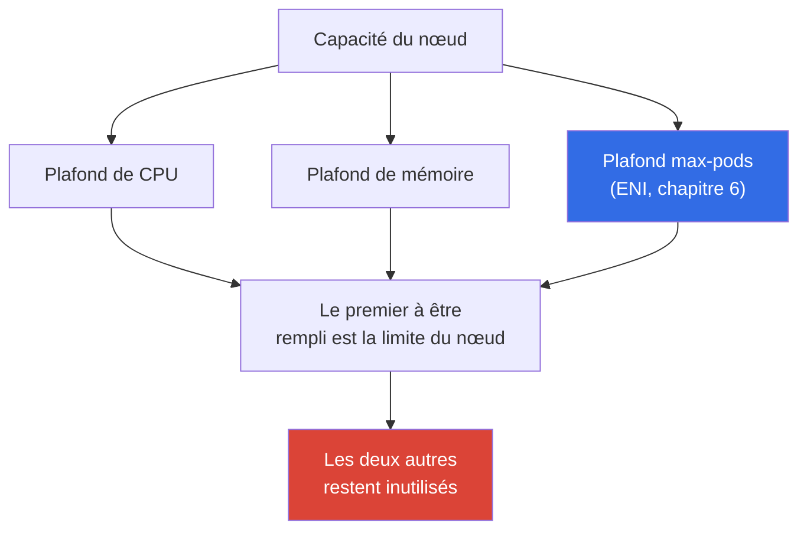
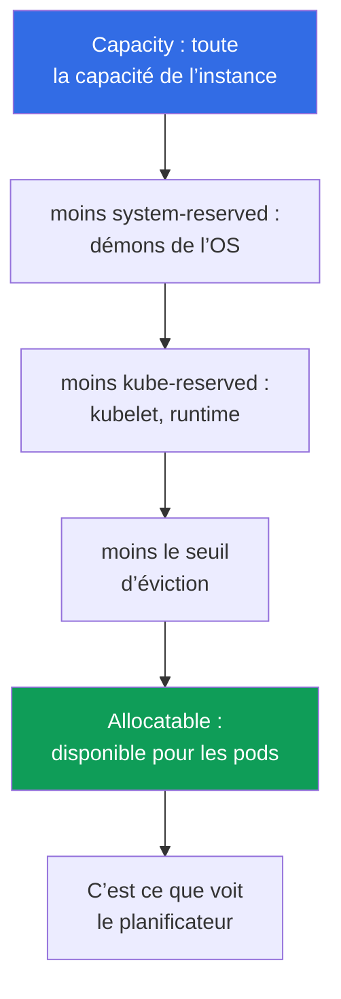

[Русская версия](ru.md) · [Eng version](en.md) · [Versión en español](es.md) · [Deutsche Version](de.md) · [ქართული ვერსია](ge.md) · [繁體中文版](tw.md) · [日本語版](jp.md)
# Chapitre 14. Densité et dimensionnement : pods par nœud, limites ENI, requests et limits dans le cloud

> **La suite.** Les nœuds peuvent désormais apparaître sous charge : Cluster Autoscaler et Karpenter
> (chapitre 11), configuration de Karpenter (chapitre 12), spot (chapitre 13). Il reste à répondre à la
> question qui, dans le cloud, se transforme directement en facture : combien de pods placer sur un nœud et
> quels requests et limits leur attribuer. Ce chapitre traite de l’économie de la densité et de la stabilité. La
> dérivation de la formule `max-pods`, les ENI et le pool chaud sont intégralement expliqués au chapitre 6 ;
> l’augmentation du plafond de pods avec prefix delegation au chapitre 7 ; le choix des instances par Karpenter
> au chapitre 12 ; HPA et VPA au chapitre 35 ; et le coût complet au chapitre 43. Ces leviers sont ici nommés
> et reliés, sans être répétés.

## 14.1. Trois façons de payer du vide

Trois situations réelles, qui affectent toutes à la fois les coûts et la stabilité.

La première. Le parc est composé de `t3.medium`, les nœuds sont à 20 pour cent de CPU, mais les nouveaux pods
ne tiennent plus. La cause n’est ni le CPU ni la mémoire : `max-pods` est atteint (chapitre 6). Une petite
instance accepte 17 pods puis s’arrête, bien que le processeur soit inactif. On paie pour du matériel qui, du
point de vue de la charge, ne sortira jamais de l’inactivité.

La seconde est l’image miroir. Les requests ont été diminués « pour en faire tenir davantage », les pods ont été
compactés et, au pic, le nœud entre en CPU throttling tandis que certains conteneurs reçoivent `OOMKilled`. Le
planificateur considérait que tout tenait car il regardait les requests, pas la consommation réelle.

La troisième. `requests == limits` a été défini partout suivant le principe « c’est plus sûr ». La moitié de la
capacité du cluster reste inutilisée en réserve : on paie des chiffres de pointe atteints une fois par jour, et le
planificateur les maintient occupés en permanence. L’autoscaler ajoute consciencieusement des nœuds pour une
charge inexistante.

Le dimensionnement est un choix entre ces trois précipices. La suite présente, dans l’ordre, les plafonds d’un
nœud, ce qui reste réellement disponible pour les pods, la manière dont requests et limits déterminent le
placement et la stabilité, et comment les calculer à partir de faits plutôt que d’intuition.

## 14.2. Les trois plafonds d’un nœud : CPU, mémoire, max-pods

Un nœud a trois limites indépendantes et s’arrête sur celle qui est atteinte en premier.



`max-pods` est défini par le modèle ENI de VPC CNI ; la formule et sa dérivation sont au chapitre 6. Ici,
l’important est la conséquence économique : sur les petites instances, le plafond de pods est atteint avant
celui du CPU et de la mémoire, si bien que le processeur et la RAM restent inactifs alors qu’ils sont payés.

| Instance | vCPU | Mémoire | max-pods | Limite avec des pods de 100m/128Mi |
|---|---|---|---|---|
| `t3.small` | 2 | 2 GiB | 11 | `max-pods`, bien avant le CPU et la mémoire |
| `t3.medium` | 2 | 4 GiB | 17 | `max-pods` : 17 pods représentent 1,7 vCPU |
| `m5.xlarge` | 4 | 16 GiB | 58 | équilibre : 58 pods représentent environ 5,8 vCPU |
| `m5.4xlarge` | 16 | 64 GiB | 234 (plafonné à 110) | CPU ou mémoire avant les pods |

Le tableau montre la règle : plus l’instance est petite, plus elle risque d’atteindre la limite de pods plutôt
que celle du calcul. En outre, les DaemonSets (`aws-node`, `kube-proxy`, agents de logs et de métriques)
consomment plusieurs emplacements de pods indépendamment de la taille du nœud et, sur un `t3.small`, ce coût fixe
absorbe une fraction importante des onze. Prefix delegation (chapitre 7) augmente le plafond de pods sur la même
instance : c’est le premier levier contre l’inactivité due à `max-pods`.

## 14.3. Migration d’une charge à haute densité depuis kubeadm : pods par nœud contre VPC CNI

Le symptôme lors de la migration. L’équipe migre un cluster kubeadm autogéré dont le réseau de pods utilise un
CNI overlay (Calico ou Flannel en mode VXLAN, Cilium en overlay). Les pods y reçoivent des adresses issues du
pod-CIDR interne du cluster, les IP sont « gratuites », et des centaines de petits pods sont placés sur chaque
nœud : le `max-pods` du kubelet a volontairement été relevé. Après la migration vers EKS, des nœuds de même taille
acceptent plusieurs fois moins de pods : certains restent en `Pending`, et les événements signalent un manque d’IP
ou de ressources alors que le CPU et la mémoire sont libres sur le nœud.

Cela apparaît immédiatement à deux endroits :

```bash
# Allocatable pods est nettement inférieur à kubeadm pour le même type d’instance
kubectl get node <node> -o jsonpath='{.status.allocatable.pods}{"\n"}'
# Événement du pod bloqué : il manque un slot IP/ENI, pas du CPU ou de la mémoire
kubectl describe pod <pod> | grep -A 5 Events
```

La cause. VPC CNI ne crée pas d’overlay : il attribue à CHAQUE pod une véritable IP secondaire d’un ENI dans le
sous-réseau VPC. Le plafond de pods sur un nœud est donc fonction du nombre d’ENI et du nombre d’IP par ENI du
type d’instance concerné :

```
max-pods = ENI * (IP_par_ENI - 1) + 2
```

Les valeurs sont tirées de la table `eni-max-pods.txt` de l’AMI (docs.aws.amazon.com, managing-vpc-cni et
choosing-instance-type). Sans prefix delegation, il s’agit de quelques dizaines de pods sur une instance typique,
bien moins qu’avec un overlay sur kubeadm. En outre, Kubernetes recommande lui-même de ne pas dépasser environ 110
pods par nœud : « mille pods sur un large » est un modèle kubeadm-overlay, pas un objectif EKS.

Que faire, par ordre de radicalité croissante :

1. **Prefix delegation** : la réponse principale. Le drapeau `ENABLE_PREFIX_DELEGATION=true` de VPC CNI
   n’alloue pas un emplacement ENI pour une IP mais pour un préfixe `/28` (16 adresses). Le plafond de pods monte à
   110 et plus, même sur de petits nœuds ; une instance Nitro est nécessaire et `max-pods` doit être recalculé
   (détails au chapitre 7). Le pool chaud de préfixes se configure avec `WARM_PREFIX_TARGET`.
2. **Secondary CIDR avec custom networking** : lorsque le sous-réseau manque d’adresses VPC elles-mêmes et non
   d’emplacements sur le nœud (chapitre 7).
3. **Revoir la densité.** Ne pas importer dans EKS le modèle kubeadm « mille pods par nœud » : Karpenter choisira
   lui-même les tailles de nœud appropriées (chapitre 12) ; la référence est jusqu’à environ 110 pods par nœud et un
   placement honnête d’après les requests (section 14.10 sur le bin packing).
4. **CNI alternatif** : Cilium en mode overlay offre une densité semblable à kubeadm, découplée des IP VPC, mais
   vous prenez alors en charge le cycle de vie du CNI et perdez une partie des intégrations managed (chapitre 8).
5. **Fargate ne résout pas la densité** : un pod est une micro-VM distincte ; ce n’est donc pas une solution pour
   les charges à haute densité (chapitre 15).

| Propriété | kubeadm overlay | EKS VPC CNI | EKS + prefix delegation |
|---|---|---|---|
| Adresse du pod | issue du pod-CIDR du cluster | IP réelle du sous-réseau VPC | préfixe `/28` du sous-réseau VPC |
| Ordre de grandeur des pods par nœud | centaines | dizaines | 110 et plus |
| Prix à payer | encapsulation overlay | adresses VPC | adresses VPC par blocs de 16 |

Conclusion. Sur EKS, les véritables IP VPC sont la monnaie du nœud, non un overlay gratuit. Le plan de migration
d’une charge à haute densité commence par prefix delegation et le recalcul de `max-pods`, pas par l’achat de nœuds
plus gros.

## 14.4. Ressources réservées : Capacity contre Allocatable

Toute la capacité de l’instance ne revient pas aux pods. Le kubelet réserve une partie du CPU et de la mémoire pour
ses propres besoins et pour le système, et maintient un seuil d’éviction. Le planificateur ne voit que ce qui reste.



- **`kube-reserved`** : pour le kubelet, le container runtime et les composants système Kubernetes.
- **`system-reserved`** : pour les démons de l’OS (`sshd`, systemd et autres).
- **eviction threshold** : tampon sous lequel le kubelet commence à évincer les pods afin que le nœud ne passe pas
  à `NotReady` faute de mémoire.

Détail essentiel d’EKS : la réserve de mémoire est liée au nombre de pods. La logique de bootstrap de l’AMI calcule
la mémoire `kube-reserved` à environ `11 * max-pods + 255` MiB, à laquelle s’ajoute le seuil d’éviction. Plus le
`max-pods` d’un nœud est élevé, plus la mémoire réservée avant même le lancement du premier pod est importante. La
part des surcoûts est aussi plus forte sur les petites instances : sur un nœud de 2 GiB, la réserve et le seuil
absorbent une part notable ; sur 64 GiB, ils sont presque imperceptibles.

| Instance | Mémoire Capacity | Ordre de grandeur des surcoûts | Part de réserve |
|---|---|---|---|
| `t3.small` | ~2 GiB | réserve plus seuil | élevée : part notable de la mémoire |
| `t3.medium` | ~4 GiB | la réserve augmente avec max-pods | sensible |
| `m5.xlarge` | ~16 GiB | même réserve sur un volume supérieur | modérée |
| `m5.4xlarge` | ~64 GiB | réserve faible devant la capacité | faible |

Il faut toujours consulter Allocatable, et non la capacité marketing de l’instance :

```bash
# Capacity : capacité totale ; Allocatable : ce qui est réellement disponible pour les pods
kubectl describe node <node-name> | grep -A 12 -E 'Capacity:|Allocatable:'
# Uniquement les ressources disponibles pour les pods, en bref
kubectl get node <node-name> \
  -o jsonpath='{.status.allocatable.cpu}{"  "}{.status.allocatable.memory}{"  pods="}{.status.allocatable.pods}{"\n"}'
```

La différence entre Capacity et Allocatable est ce que vous payez sans le donner aux pods. Sur un parc de nombreux
petits nœuds, cette différence s’accumule en un surcoût notable.

## 14.5. requests et limits dans le cloud : ce qu’ils déterminent réellement

Dans un cluster bare-metal, requests et limits sont une question d’équité envers les voisins du nœud. Dans le
cloud, ils prennent aussi un sens financier direct car les nœuds sont facturés tant qu’ils existent.

- **Les requests déterminent le placement et le coût.** Le planificateur place un pod seulement si le nœud dispose
  des *requests* nécessaires, non selon la consommation réelle. La somme des requests détermine combien de pods
  tiennent sur un nœud et à quel moment l’autoscaler en ajoute un (chapitre 11). Vous payez les réserves associées
  aux requests, pas l’usage effectif.
- **Les limits limitent la consommation.** C’est une borne supérieure : au-delà du limit CPU est bridé, au-delà du
  limit mémoire le conteneur est tué. Les limits n’influencent ni le placement ni la décision de l’autoscaler.

Il en découle deux erreurs coûteuses. **Sous-estimer les requests** : le planificateur pense que le nœud peut
accueillir davantage qu’il ne peut supporter ; au pic, cela provoque surallocation, CPU throttling, `OOMKilled` et
éviction de pods. **Surestimer les requests** : chaque pod réserve plus qu’il ne consomme ; les nœuds paraissent
pleins avec une faible utilisation réelle, l’autoscaler ajoute du matériel superflu et la facture augmente alors que
la capacité est inactive.

```yaml
resources:
  requests:            # ces chiffres déterminent le placement et font augmenter la facture
    cpu: "250m"
    memory: "256Mi"
  limits:              # plafond de consommation du conteneur
    cpu: "500m"
    memory: "256Mi"    # pour la mémoire, le limit est généralement égal au request (section 14.7)
```

## 14.6. Classes QoS et ordre d’éviction

Le rapport entre requests et limits d’un pod le place dans une classe de qualité de service (QoS) Kubernetes, et
cette classe détermine qui est évincé en premier lorsque le nœud manque de mémoire.

| Classe QoS | Condition | Ordre d’éviction lors d’un manque de mémoire |
|---|---|---|
| `Guaranteed` | requests == limits en CPU et mémoire pour tous les conteneurs | en dernier |
| `Burstable` | requests définis mais inférieurs aux limits (ou sans limits) | après BestEffort, selon l’excès au-dessus des requests |
| `BestEffort` | ni requests ni limits définis | en premier |

Un pod `BestEffort` sans requests sera placé n’importe où par le planificateur et sera aussi le premier sacrifié
sous pression mémoire : il convient aux tâches d’arrière-plan, pas aux services. `Guaranteed` offre la protection
maximale contre l’éviction, mais à un prix : `requests == limits` signifie réserver le pic en permanence.

Vérifier la classe attribuée au pod :

```bash
kubectl get pod <pod> -o jsonpath='{.status.qosClass}{"\n"}'
kubectl describe pod <pod> | grep -i 'QoS Class'
```

Quand `requests == limits` (Guaranteed) est justifié : bases de données et charges stateful où l’éviction coûte
cher, ainsi que services sensibles à la latence qui ne peuvent pas perdre de CPU. Quand c’est nuisible : services
stateless massifs avec des pics rares ; une réserve ferme pour le pic maintient alors une capacité inutilement
occupée et gonfle la facture.

## 14.7. CPU throttling et OOMKilled : pourquoi la mémoire est plus stricte

CPU et mémoire réagissent fondamentalement différemment aux limits, ce qui change la tactique.

**Le CPU est une ressource compressible.** Le limit CPU est appliqué par le quota CFS du noyau Linux : le conteneur
reçoit une part du temps processeur dans une fenêtre de planification et, s’il la dépasse, il est **bridé** : ralenti
mais non tué. Le symptôme est une hausse de latence et la métrique `container_cpu_cfs_throttled`, alors que le pod
semble vivant et sain. Un limit CPU trop bas bride une charge qui « fonctionne » formellement.

**Les runtimes multithread souffrent le plus.** Le quota CFS est calculé pour tous les cœurs cumulés dans une fenêtre
de planification, généralement de 100 ms. Une application avec un pool de threads, typiquement Java ou Go, répartit
le travail sur tous les cœurs du nœud et épuise son quota dans les premières millisecondes de la fenêtre, avant
d’être bridée jusqu’à la fin de la période. Le résultat est des pics de latence alors que la charge moyenne est bien
inférieure au limit. Cela est aggravé par le fait que le runtime voit par défaut tous les cœurs du nœud, pas la part
allouée : Go définit `GOMAXPROCS` selon le nombre de cœurs hôtes, Java dimensionne ses pools avec
`Runtime.availableProcessors()`, ce qui crée des threads pour une grande machine alors que le quota concerne une
petite part. Par conséquent, avec des requests CPU honnêtes, un limit CPU strict nuit souvent à ces applications :
les requests garantissent déjà une part du processeur en cas de concurrence, tandis que le limit ajoute du throttling
sans gain de stabilité.

**La mémoire est une ressource incompressible.** Il est impossible de reprendre de la mémoire déjà allouée ; il
n’existe pas de « throttling doux » de la mémoire. Un conteneur qui dépasse son memory limit reçoit `OOMKilled` du
noyau et redémarre. Un limit mémoire est donc plus important qu’un limit CPU : c’est la véritable frontière entre le
fonctionnement et la mise à mort.

```bash
# Cause du redémarrage : rechercher OOMKilled dans Last State du conteneur
kubectl describe pod <pod> | grep -A 5 'Last State'
kubectl get pod <pod> -o jsonpath='{.status.containerStatuses[0].lastState.terminated.reason}{"\n"}'
# Consommation réelle par rapport aux chiffres définis
kubectl top pods --containers
```

La pratique à retenir : **pour la mémoire, conservez `request == limit`**, afin que le comportement soit
prévisible et qu’un pod ne puisse pas soudainement dépasser la réserve de ses voisins et subir un OOM sur un nœud
partagé. Pour le CPU, le `limit` est souvent laissé au-dessus du `request`, ou omis, ce qui permet au pod d’utiliser
un processeur inactif sans risque : le throttling le ramènera de toute façon dans les limites lors de la concurrence.
C’est un compromis, pas un dogme : les services sensibles à la latence ont parfois besoin d’un limit CPU pour être
prévisibles.

## 14.8. La densité comme levier de coût

Le choix entre « beaucoup de petits nœuds » et « peu de gros » est un ensemble de compromis, non une réponse unique.

| Aspect | Petits nœuds | Gros nœuds |
|---|---|---|
| Part de reserved (section 14.4) | plus élevée : vous payez les surcoûts | plus faible : réserve faible devant la capacité |
| Pods système et DaemonSets | dupliqués sur chaque nœud | amortis sur davantage de pods |
| Risque d’atteindre `max-pods` | élevé (chapitre 6) | faible |
| Rayon d’explosion lors de la panne d’un nœud | faible : peu de pods tombent | élevé : beaucoup de pods tombent d’un coup |
| Granularité du scaling | fine et précise | grossière : beaucoup de capacité ajoutée d’un coup |
| Bin packing et fragmentation | davantage de restes aux marges | placement plus dense |

Les gros nœuds réduisent les surcoûts et le coût des pods système, mais augmentent le rayon d’explosion et rendent
le scaling grossier : un nouveau nœud ajoute immédiatement beaucoup de capacité, qui peut rester inactive. Les
petits nœuds fournissent un pas précis et un faible rayon, mais paient une plus grande part de réserve et risquent
d’atteindre `max-pods`. Prefix delegation (chapitre 7) lève cette dernière limitation en augmentant le plafond de
pods ; il est donc activé par défaut dans les parcs denses.

## 14.9. Dimensionner les requests en pratique

La règle est simple : **les requests se fondent sur les faits, non sur l’intuition**. Des chiffres devinés « au
jugé » sont à l’origine des deux précipices de la section 14.1.

- Relevez la consommation réelle : `metrics-server` et `kubectl top` donnent une vue instantanée, Prometheus
  fournit l’historique avec les pics (chapitre 33).
- Pour recommander les requests, utilisez VPA en mode `recommend` (sans application automatique) : il observe la
  charge et propose des chiffres sans toucher aux pods (chapitre 35).
- Définissez les requests à partir du profil réel, avec une marge pour le pic, non selon le maximum atteint une fois
  par jour. Pour la mémoire, n’oubliez pas `request == limit` (section 14.7).
- Le right-sizing est un processus, pas un réglage unique : le profil de charge change ; les requests sont revus
  régulièrement et l’économie est calculée avec les outils du chapitre 43.

```bash
# Charge instantanée des nœuds : comparez-la à la somme des requests de describe node
kubectl top nodes
# Consommation par conteneur : base de révision des requests
kubectl top pods --all-namespaces --containers
```

## 14.10. Bin packing : pourquoi des nœuds identiques se placent mieux

Le placement des pods sur les nœuds est un problème de bin packing, dont la prévisibilité dépend directement de
l’homogénéité du parc et de la fidélité des requests à la réalité.

- Le planificateur place les pods d’après les *requests*. Si les requests sont sous-estimés, le placement semble
  dense mais le nœud est en réalité surchargé ; s’ils sont surestimés, beaucoup de « vide » reste aux marges.
- Les nœuds hétérogènes se placent moins bien : chaque taille a son propre reste, la fragmentation augmente et une
  partie de la capacité n’est jamais utilisée. Des nœuds identiques donnent un résultat répétable et prévisible,
  plus simple à planifier et à surveiller par des alertes.
- La topologie affecte le placement : les contraintes d’AZ, `topologySpread`, affinity et taints réduisent
  l’ensemble des nœuds admissibles, et des règles trop strictes empêchent un placement dense (chapitre 40).
- La consolidation Karpenter (chapitre 12) replace périodiquement le cluster : elle évince les pods de nœuds
  sous-utilisés et les éteint. Elle fonctionne d’autant mieux que les requests sont honnêtes et les types de nœuds
  homogènes, car la consolidation trouve alors une variante dense sans trous.

## 14.11. Comment l’appliquer en production

- **Choisissez le type d’instance selon les trois plafonds à la fois**, et non seulement le CPU et la mémoire :
  calculez ce qui limitera le nœud en premier et évitez les petites instances vouées à rester inactives à cause de
  `max-pods` (chapitre 6). Activez prefix delegation lorsque le plafond de pods contraint (chapitre 7).
- **Définissez les requests d’après la consommation réelle** : relevez les métriques et recommandations VPA
  (chapitres 33, 35), ne devinez pas. La révision des requests est une tâche régulière, non ponctuelle.
- **Pour la mémoire, gardez `request == limit`** ; pour le CPU, laissez souvent une marge ou ne définissez pas de
  limit : la mémoire est incompressible et produit `OOMKilled`, le CPU ne fait que subir du throttling.
- **Attribuez les QoS consciemment** : `Guaranteed` pour les bases et services sensibles à la latence, `Burstable`
  pour les services stateless de masse, `BestEffort` uniquement pour ce qui peut être évincé sans dommage.
- **Gardez le parc aussi homogène que possible par types** : placement prévisible, consolidation Karpenter efficace
  (chapitre 12) et alertes de charge simples.
- **Consultez Allocatable, pas Capacity**, et surveillez l’écart entre la somme des requests et la consommation
  réelle : c’est une métrique directe du surcoût (chapitre 43).

## 14.12. Mini-glossaire

- **Capacity** : capacité totale de l’instance en CPU, mémoire et pods. **Allocatable** : ce qui reste aux pods
  après `kube-reserved`, `system-reserved` et le seuil d’éviction ; c’est ce que voit le planificateur.
- **`kube-reserved` / `system-reserved`** : ressources réservées par le kubelet à Kubernetes et à l’OS.
  **eviction threshold** : tampon mémoire sous lequel le kubelet évince les pods.
- **requests** : volume de ressources selon lequel le placement et la décision de l’autoscaler sont pris ; réserve
  du pod. **limits** : plafond de consommation du conteneur.
- **Classe QoS** : `Guaranteed`, `Burstable` ou `BestEffort` ; elle détermine l’ordre d’éviction lors d’un manque
  de mémoire. **CFS throttling** : ralentissement du conteneur lorsqu’il dépasse le CPU limit. **OOMKilled** :
  mise à mort du conteneur par le noyau lorsqu’il dépasse le memory limit.
- **bin packing** : placement des pods sur les nœuds d’après leurs requests. **right-sizing** : ajustement des
  requests à la consommation réelle.

## 14.13. Bilan du chapitre

- Un nœud a trois plafonds indépendants : CPU, mémoire et `max-pods` (ENI, chapitre 6), et il s’arrête sur celui
  qui est atteint en premier. Les petites instances atteignent `max-pods` avant le calcul et restent inactives à vos
  frais ; prefix delegation (chapitre 7) rehausse ce plafond.
- Toute la capacité n’est pas accessible aux pods : `kube-reserved`, `system-reserved` et le seuil d’éviction créent
  un écart entre Capacity et Allocatable. La réserve de mémoire EKS augmente avec `max-pods` et représente une part
  plus forte sur les petites instances. Le planificateur calcule avec Allocatable.
- Les requests déterminent le placement, le moment où l’autoscaler ajoute un nœud et le coût ; les limits bornent la
  consommation. Des requests sous-estimés mènent au throttling, à OOM et à l’éviction ; des requests surestimés à
  l’inactivité et au surcoût.
- La classe QoS issue du rapport entre requests et limits définit l’ordre d’éviction. `request == limit`
  (Guaranteed) est justifié pour les bases et services sensibles à la latence, mais maintient le pic réservé en
  permanence.
- Le CPU est bridé par le quota CFS sans tuer le pod, tandis que la mémoire est incompressible et produit
  `OOMKilled` ; gardez donc le limit mémoire égal au request, et dimensionnez les requests à partir des métriques
  et de VPA (chapitres 33, 35). Un parc homogène se place plus prévisiblement et se consolide mieux avec Karpenter
  (chapitre 12) ; l’économie est calculée au chapitre 43.

## 14.14. Utilité dans le travail réel

En astreinte, l’association « pod en `CrashLoopBackOff`, `OOMKilled` dans Last State » cesse d’être une énigme :
on sait que la memory limit est atteint et où regarder, `kubectl top` et le profil de charge. Une hausse de latence
d’un service alors que les pods sont vivants conduit à vérifier le CPU throttling, non le réseau. Lors de la
planification du parc, vous ne proposez plus « prenons de plus grosses instances », mais un calcul fondé sur les
trois plafonds, avec Allocatable et le profil des requests, et vous expliquez pourquoi `t3.medium` est presque
toujours peu rentable en production. La discussion sur le coût (chapitre 43) ne commence pas avec le nœud, mais
avec l’écart entre la somme des requests et la consommation réelle : cette même métrique du vide que vous payez.

## 14.15. Questions d’auto-évaluation

1. Nommez les trois plafonds d’un nœud. Pourquoi `t3.medium` reste-t-il souvent inactif en CPU dans un parc plein ?
2. Quelle est la différence entre Capacity et Allocatable, et lequel des deux voit le planificateur ?
3. Pourquoi la réserve de mémoire EKS augmente-t-elle avec `max-pods`, et pour qui la part de surcoût est-elle la plus élevée ?
4. Qu’influencent les requests, et qu’influencent les limits ? Comment chaque erreur de dimensionnement affecte-t-elle la facture ?
5. Comment le rapport entre requests et limits détermine-t-il la classe QoS et l’ordre d’éviction ?
6. Quand `request == limit` est-il justifié, et quand maintient-il seulement la capacité occupée inutilement ?
7. Pourquoi le limit est-il plus important pour la mémoire que pour le CPU ? Que se passe-t-il lorsqu’on dépasse chacun d’eux ?
8. Pourquoi peut-on laisser le CPU sans limit, mais pas souhaitablement la mémoire ?
9. Comment déterminer correctement les requests d’un nouveau service sans deviner les chiffres ?
10. Pourquoi un parc de nœuds homogène se place-t-il plus prévisiblement et se consolide-t-il mieux ?
11. Quel levier du chapitre 7 lève le plafond `max-pods`, et quand faut-il l’activer ?

## Pratique

Le laboratoire du cours pour ce thème est le [laboratoire 103 : Plan d’adressage : limites ENI, prefix delegation,
secondary CIDR](../../labs/103/README_FR.MD), où la formule max-pods de ce chapitre est comparée à la réalité sur un
nœud actif. En dehors de cela, tout se vérifie sur un cluster actif. Commencez par l’écart entre Capacity et
Allocatable : `kubectl describe node <node> | grep -A 12 -E 'Capacity:|Allocatable:'` montre quelle capacité de
l’instance est inaccessible aux pods, et `kubectl get node <node> -o
jsonpath='{.status.allocatable.pods}'` indique le plafond de pods. Comparez la somme des requests de tous les pods
du nœud depuis `kubectl describe node` (bloc `Allocated resources`) à la charge réelle de `kubectl top nodes` :
l’écart est précisément ce vide que vous payez.

Trouvez ensuite les pods sans requests (`BestEffort`) et consultez leur classe QoS avec `kubectl get pod <pod> -o
jsonpath='{.status.qosClass}'`. Prenez un service qui redémarre et vérifiez la cause : `kubectl describe pod <pod> |
grep -A 5 'Last State'` ; s’il contient `OOMKilled`, comparez le memory limit avec `kubectl top pods --containers`.
Enfin, estimez avec le tableau de la section 14.2 quelle limite votre type d’instance actuel atteindra en premier,
puis vérifiez l’hypothèse : comparez `max-pods` dans allocatable avec le nombre réel de pods du nœud via `kubectl get
pods -A -o wide --field-selector spec.nodeName=<node>`.

---
[Table des matières](../README_FR.md) · [Chapitre 13](../13/fr.md) · [Chapitre 15](../15/fr.md)
