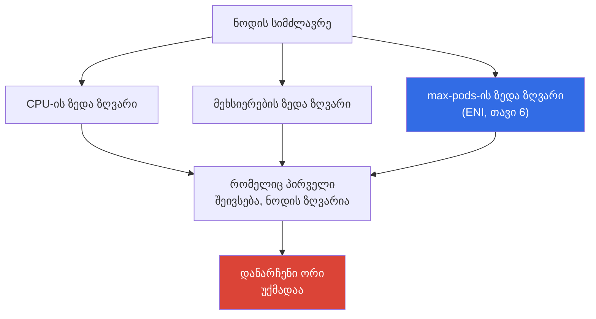
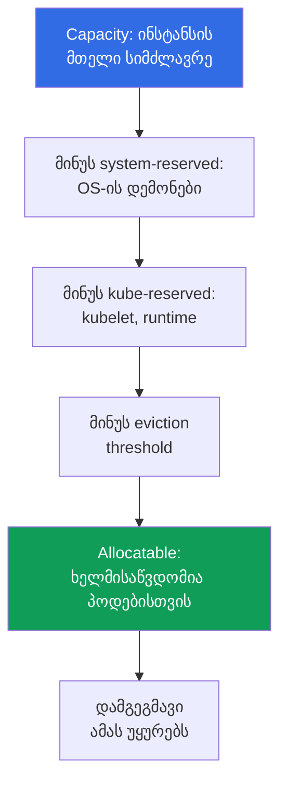

[Русская версия](ru.md) · [Eng version](en.md) · [Versión en español](es.md) · [Version française](fr.md) · [Deutsche Version](de.md) · [繁體中文版](tw.md) · [日本語版](jp.md)
# თავი 14. სიმჭიდროვე და საიზინგი: pods per node, ENI-ის ლიმიტები, requests და limits ღრუბელში

> **რა არის შემდეგ.** ნოდები უკვე ჩნდება დატვირთვის ზრდისას: Cluster Autoscaler და Karpenter
> (თავი 11), Karpenter-ის კონფიგურაცია (თავი 12), spot (თავი 13). დარჩა პასუხი კითხვაზე,
> რომელიც ღრუბელში პირდაპირ ანგარიშად გარდაიქმნება: რამდენი პოდი განვათავსოთ ნოდაზე და რა
> requests და limits დავუყენოთ მათ. აქ საუბარია სიმჭიდროვის ეკონომიკასა და სტაბილურობაზე.
> `max-pods` ფორმულის გამოყვანა, ENI და warm-პული სრულად მე-6 თავშია, prefix delegation-ის
> საშუალებით პოდების ზედა ზღვრის გაზრდა მე-7 თავში, Karpenter-ის ინსტანსების არჩევა მე-12 თავში,
> HPA და VPA მე-35 თავში, ხოლო სრული ღირებულება მე-43 თავში. აქ ეს ბერკეტები დასახელებული და
> ერთმანეთთან დაკავშირებულია, მაგრამ ხელახლა არ არის გადმოცემული.

## 14.1. ჰაერში ფულის გადახდის სამი გზა

სამი რეალური სურათი, სამივე ერთდროულად ფულსა და სტაბილურობას ეხება.

პირველი. პარკი `t3.medium`-ზეა აწყობილი, ნოდების CPU 20 პროცენტითაა დატვირთული, ახალი პოდები კი
ვეღარ ეტევა. მიზეზი არც CPU-ა და არც მეხსიერება: მიღწეულია `max-pods` (თავი 6). მცირე ინსტანსი
17 პოდს იღებს და ჩერდება, მიუხედავად იმისა, რომ პროცესორი უქმადაა. იხდიან აპარატურაში, რომელიც
დატვირთვის თვალსაზრისით უმოქმედო მდგომარეობიდან ვერასდროს გამოვა.

მეორე, საპირისპირო სურათი. Requests შემცირებულია პრინციპით „მეტი რომ დაეტიოს“, პოდები მჭიდროდ
განთავსდა, პიკის დროს კი ნოდა CPU throttling-ში გადადის და კონტეინერების ნაწილი `OOMKilled`-ს
იღებს. დამგეგმავი ფიქრობდა, რომ ყველაფერი ეტეოდა, რადგან requests-ს უყურებდა და არა რეალურ
მოხმარებას.

მესამე. ყველგან დაყენებულია `requests == limits` პრინციპით „ასე უფრო საიმედოა“. კლასტერის
სიმძლავრის ნახევარი რეზერვში უქმადაა: ფული გადახდილია პიკურ მნიშვნელობებში, რომლებიც დღეში
ერთხელ მიიღწევა, დამგეგმავი კი მათ დღე-ღამის განმავლობაში დაკავებულად ინარჩუნებს. ავტოსკეილერი
არარსებული დატვირთვისთვის გამართულად ამატებს ნოდებს.

საიზინგი ამ სამ უფსკრულს შორის არჩევანია. შემდეგ თანმიმდევრულად განვიხილავთ: სად არის ნოდის
ზედა ზღვრები, რა არის მასზე რეალურად ხელმისაწვდომი პოდებისთვის, როგორ განსაზღვრავს requests და
limits განთავსებასა და სტაბილურობას და როგორ უნდა გამოითვალოს ისინი ფაქტების და არა ინტუიციის
საფუძველზე.

## 14.2. ნოდის სამი ზედა ზღვარი: CPU, მეხსიერება, max-pods

ნოდას სამი დამოუკიდებელი ზღვარი აქვს და ის იმაზე ჩერდება, რომელიც პირველი ამოიწურება.



`max-pods`-ს VPC CNI-ის ENI-მოდელი განსაზღვრავს, ფორმულა და მისი გამოყვანა მე-6 თავშია. აქ
ფულთან დაკავშირებული შედეგია მნიშვნელოვანი: მცირე ინსტანსებზე პოდების ზედა ზღვარი CPU-სა და
მეხსიერებაზე ადრე მიიღწევა, ამიტომ პროცესორი და RAM უქმად რჩება, რაშიც ფულს იხდით.

| ინსტანსი | vCPU | მეხსიერება | max-pods | რას მიაღწევს პირველად 100m/128Mi პოდებით |
|---|---|---|---|---|
| `t3.small` | 2 | 2 GiB | 11 | `max-pods`-ს CPU-სა და მეხსიერებაზე ბევრად ადრე |
| `t3.medium` | 2 | 4 GiB | 17 | `max-pods`-ს: 17 პოდი 1.7 vCPU-ს ნიშნავს |
| `m5.xlarge` | 4 | 16 GiB | 58 | ბალანსი: 58 პოდი დაახლოებით 5.8 vCPU-ს იძლევა |
| `m5.4xlarge` | 16 | 64 GiB | 234 (ზღვარი 110) | CPU-ს ან მეხსიერებას პოდების ზღვარზე ადრე |

ცხრილიდან წესი ჩანს: რაც უფრო მცირეა ინსტანსი, მით უფრო მოსალოდნელია, რომ გამოთვლით რესურსებზე
ადრე პოდების ზღვარს მიაღწევს. ამასთან, DaemonSet-ები (`aws-node`, `kube-proxy`, ჟურნალებისა და
მეტრიკების აგენტები) ნოდის ზომის მიუხედავად რამდენიმე პოდის სლოტს იკავებს, `t3.small`-ზე კი ეს
ფიქსირებული დანამატი თერთმეტი სლოტის შესამჩნევ ნაწილს მოიხმარს. Prefix delegation (თავი 7)
იმავე ინსტანსზე პოდების ზედა ზღვარს ზრდის. ეს `max-pods`-ის გამო უქმად დარჩენის საწინააღმდეგო
პირველი ბერკეტია.

## 14.3. მაღალი სიმჭიდროვის დატვირთვის მიგრაცია kubeadm-იდან: pods-per-node VPC CNI-ის წინააღმდეგ

მიგრაციის სიმპტომი. გუნდი გადააქვს საკუთარი ძალებით აწყობილი kubeadm-კლასტერი, სადაც პოდების
ქსელს overlay-CNI მართავს (Calico ან Flannel VXLAN-რეჟიმში, Cilium overlay-რეჟიმში). იქ პოდები
მისამართებს კლასტერის შიდა pod-CIDR-იდან იღებს, IP-ები „უფასოა“ და თითო ნოდაზე ასობით მცირე
პოდია განთავსებული, რადგან kubelet-ის `max-pods` განზრახ გაზარდეს. EKS-ზე გადასვლის შემდეგ იმავე
ზომის ნოდები რამდენჯერმე ნაკლებ პოდს იღებს: ნაწილი `Pending` მდგომარეობაშია, მოვლენებში IP-ების
ან რესურსების უკმარისობა ჩანს, მიუხედავად იმისა, რომ ნოდაზე CPU და მეხსიერება თავისუფალია.

ეს ერთდროულად ორ ადგილას ჩანს:

```bash
# Allocatable pods მნიშვნელოვნად ნაკლებია, ვიდრე იმავე ტიპის ინსტანსზე kubeadm-ში იყო
kubectl get node <node> -o jsonpath='{.status.allocatable.pods}{"\n"}'
# გაჭედილი პოდის მოვლენა: IP/ENI-ს სლოტი არ ეყო და არა CPU ან მეხსიერება
kubectl describe pod <pod> | grep -A 5 Events
```

მიზეზი. VPC CNI overlay-ს არ ქმნის: ის თითოეულ პოდს VPC-ის ქვექსელში ENI-იდან რეალურ მეორეულ
IP-ს აძლევს. ამიტომ ნოდაზე პოდების ზედა ზღვარი კონკრეტული ტიპის ინსტანსის ENI-ების რაოდენობისა
და თითო ENI-ზე IP-ების რაოდენობის ფუნქციაა:

```
max-pods = ENI * (IP_ENI-ზე - 1) + 2
```

რიცხვები AMI-ის `eni-max-pods.txt` ცხრილიდან აიღება (docs.aws.amazon.com, managing-vpc-cni და
choosing-instance-type). Prefix delegation-ის გარეშე ტიპურ ინსტანსზე ეს ათეულობითი რიგის
პოდებია, რაც kubeadm-ის overlay-ზე მნიშვნელოვნად ნაკლებია. გარდა ამისა, თავად Kubernetes ნოდაზე
არაუმეტეს დაახლოებით 110 პოდის განთავსებას გვირჩევს: „ათასი პოდი large-ზე“ kubeadm-overlay-ის
შაბლონია და არა EKS-ის მიზანი.

რა უნდა გააკეთოთ, ნაკლებად რადიკალურიდან მეტად რადიკალურისკენ:

1. **Prefix delegation** - მთავარი პასუხია. VPC CNI-ის `ENABLE_PREFIX_DELEGATION=true` ალამი
   ENI-ს სლოტს ერთი IP-ის ნაცვლად `/28` პრეფიქსისთვის (16 მისამართი) გამოყოფს. პოდების ზედა
   ზღვარი მცირე ნოდებზეც 110-მდე და მეტად იზრდება; საჭიროა Nitro-ზე მომუშავე ინსტანსი, ხოლო
   `max-pods` ხელახლა უნდა გამოითვალოს (დეტალურად მე-7 თავში). პრეფიქსების თბილი პული
   `WARM_PREFIX_TARGET`-ით იმართება.
2. **Secondary CIDR და custom networking** - თუ ქვექსელში თავად VPC-ის მისამართები იწურება და
   არა ნოდის სლოტები (თავი 7).
3. **სიმჭიდროვის გადახედვა.** EKS-ში არ გადაიტანოთ kubeadm-ის შაბლონი „ათასი პოდი ნოდაზე“:
   Karpenter თავად შეარჩევს ნოდების სწორ ზომებს (თავი 12), ორიენტირია დაახლოებით 110-მდე პოდი
   ნოდაზე და requests-ის მიხედვით კეთილსინდისიერი განთავსება (bin packing აღწერილია სექციაში
   14.10).
4. **ალტერნატიული CNI** - Cilium overlay-რეჟიმში kubeadm-ის მსგავს, VPC-IP-ისგან დამოუკიდებელ
   სიმჭიდროვეს იძლევა, მაგრამ ამ შემთხვევაში CNI-ის სასიცოცხლო ციკლს თავად მართავთ და managed-
   ინტეგრაციების ნაწილს კარგავთ (თავი 8).
5. **Fargate სიმჭიდროვის პრობლემას არ წყვეტს**: ერთი პოდი ცალკე მიკრო-VM-ია, ამიტომ მაღალი
   სიმჭიდროვის დატვირთვისთვის ეს გამოსავალი არ არის (თავი 15).

| თვისება | kubeadm overlay | EKS VPC CNI | EKS + prefix delegation |
|---|---|---|---|
| პოდის მისამართი | კლასტერის pod-CIDR-იდან | რეალური IP VPC-ის ქვექსელიდან | `/28` პრეფიქსი VPC-ის ქვექსელიდან |
| pods-per-node-ის რიგი | ასეულები | ათეულები | 110 და მეტი |
| რითი იხდით | overlay-ინკაფსულაციით | VPC-ის მისამართებით | VPC-ის მისამართებით, 16-მისამართიანი ბლოკებით |

დასკვნა. EKS-ზე რეალური VPC-IP ნოდის ვალუტაა და არა უფასო overlay. მაღალი სიმჭიდროვის დატვირთვის
მიგრაციის გეგმა prefix delegation-ითა და `max-pods`-ის ხელახალი გამოთვლით იწყება და არა უფრო
დიდი ნოდების შეძენით.

## 14.4. Reserved რესურსები: Capacity და Allocatable

ინსტანსის მთელი სიმძლავრე პოდებს არ გადაეცემა. Kubelet CPU-სა და მეხსიერების ნაწილს საკუთარი და
სისტემის საჭიროებებისთვის არეზერვებს და გამოდევნის ზღვარს ინარჩუნებს. დარჩენილი ნაწილი კი ის
რესურსია, რომელსაც დამგეგმავი ხედავს.



- **`kube-reserved`** - kubelet-ისთვის, container runtime-ისა და Kubernetes-ის სისტემური
  კომპონენტებისთვის.
- **`system-reserved`** - OS-ის დემონებისთვის (`sshd`, systemd და სხვა).
- **eviction threshold** - ბუფერი, რომლის ქვემოთ kubelet პოდების გამოდევნას იწყებს, რათა
  მეხსიერების უკმარისობის გამო ნოდა `NotReady` მდგომარეობაში არ გადავიდეს.

EKS-ის მთავარი დეტალი: მეხსიერების რეზერვი პოდების რაოდენობას უკავშირდება. AMI-ის bootstrap-
ლოგიკა მეხსიერებისთვის `kube-reserved`-ს დაახლოებით `11 * max-pods + 255` MiB ფორმულით
გამოთვლის, ამას კი გამოდევნის ზღურბლიც ემატება. ანუ რაც უფრო მაღალია ნოდის `max-pods`, მით მეტი
მეხსიერება გადადის რეზერვში პირველი პოდის გაშვებამდეც კი. მცირე ინსტანსებზე ზედნადები ხარჯის
წილიც უფრო მაღალია: 2 GiB-იან ნოდაზე რეზერვი და ზღურბლი შესამჩნევ ნაწილს მოიხმარს, 64 GiB-ზე
კი თითქმის შეუმჩნეველია.

| ინსტანსი | მეხსიერების Capacity | ზედნადების რიგი | რეზერვის წილი |
|---|---|---|---|
| `t3.small` | ~2 GiB | რეზერვი და ზღურბლი | მაღალი: მეხსიერების შესამჩნევი ნაწილი |
| `t3.medium` | ~4 GiB | რეზერვი max-pods-თან ერთად იზრდება | საგრძნობი |
| `m5.xlarge` | ~16 GiB | იგივე რეზერვი უფრო დიდ მოცულობაზე | ზომიერი |
| `m5.4xlarge` | ~64 GiB | რეზერვი სიმძლავრესთან შედარებით მცირეა | დაბალი |

ყოველთვის Allocatable-ს უნდა უყუროთ და არა ინსტანსის მარკეტინგულ მოცულობას:

```bash
# Capacity მთელი სიმძლავრეა, Allocatable კი პოდებისთვის რეალურად ხელმისაწვდომი ნაწილი
kubectl describe node <node-name> | grep -A 12 -E 'Capacity:|Allocatable:'
# მხოლოდ პოდებისთვის ხელმისაწვდომი რესურსები, მოკლედ
kubectl get node <node-name> \
  -o jsonpath='{.status.allocatable.cpu}{"  "}{.status.allocatable.memory}{"  pods="}{.status.allocatable.pods}{"\n"}'
```

Capacity-სა და Allocatable-ს შორის სხვაობა არის ის, რაშიც ფულს იხდით, მაგრამ პოდებს ვერ
გადასცემთ. მრავალი მცირე ნოდისგან შემდგარ პარკში ეს სხვაობა ჯამდება და შესამჩნევ ზედმეტ ხარჯად
იქცევა.

## 14.5. requests და limits ღრუბელში: რას წყვეტს ისინი სინამდვილეში

Bare-metal კლასტერში requests და limits ნოდის მეზობლების მიმართ სამართლიანობის საკითხია.
ღრუბელში მათ პირდაპირი ფინანსური მნიშვნელობაც ემატება, რადგან ნოდებში მათი არსებობის ფაქტის
მიხედვით იხდით.

- **requests განთავსებასა და ღირებულებას განსაზღვრავს.** დამგეგმავი პოდს მხოლოდ მაშინ
  განათავსებს, თუ ნოდაზე *requests* საკმარისია და არა ფაქტობრივი მოხმარების მიხედვით. requests-
  ის ჯამი განსაზღვრავს, რამდენი პოდი დაეტევა ნოდაზე და როდის დაამატებს ავტოსკეილერი ახალ ნოდას
  (თავი 11). თქვენ requests-ისთვის დარეზერვებულ რესურსში იხდით და არა გამოყენებულში.
- **limits მოხმარებას ზღუდავს.** ეს ზედა ზღვარია: CPU limit-ის ზემოთ იზღუდება, მეხსიერების
  limit-ის გადაჭარბება კი კონტეინერს კლავს. Limits არც განთავსებაზე და არც ავტოსკეილერის
  გადაწყვეტილებაზე არ მოქმედებს.

აქედან გამომდინარეობს ფასის მქონე ორი შეცდომა. **requests-ის შემცირება** ნიშნავს, რომ დამგეგმავის
აზრით ნოდაზე იმაზე მეტი ეტევა, ვიდრე მას რეალურად შეუძლია; პიკის დროს მიიღება ზედმეტი გამოწერა,
CPU throttling, `OOMKilled` და პოდების გამოდევნა. **requests-ის გაზრდა** ნიშნავს, რომ თითოეული
პოდი იმაზე მეტს არეზერვებს, ვიდრე მოიხმარს; ნოდები დაბალი რეალური დატვირთვის დროსაც სავსედ ჩანს,
ავტოსკეილერი ზედმეტ აპარატურას ამატებს და უქმად მუშაობისთვის გადასახადი იზრდება.

```yaml
resources:
  requests:            # ამ რიცხვებით ხდება განთავსება და იზრდება გადასახადი
    cpu: "250m"
    memory: "256Mi"
  limits:              # კონტეინერის მოხმარების ზედა ზღვარი
    cpu: "500m"
    memory: "256Mi"    # მეხსიერებისთვის limit ჩვეულებრივ request-ის ტოლია (სექცია 14.7)
```

## 14.6. QoS-კლასები და გამოდევნის თანმიმდევრობა

Kubernetes პოდის requests-ისა და limits-ის თანაფარდობას მომსახურების ხარისხის კლასად (QoS)
გარდაქმნის და ეს კლასი განსაზღვრავს, ვის გამოაძევებენ პირველს, როდესაც ნოდაზე მეხსიერება იწურება.

| QoS-კლასი | პირობა | ვის გამოაძევებენ მეხსიერების უკმარისობისას |
|---|---|---|
| `Guaranteed` | ყველა კონტეინერისთვის requests == limits CPU-სა და მეხსიერებაზე | ბოლოს |
| `Burstable` | requests განსაზღვრულია, მაგრამ limits-ზე ნაკლებია (ან limits არ არის) | BestEffort-ის შემდეგ, requests-ზე მეტი მოხმარების მიხედვით |
| `BestEffort` | არც requests და არც limits განსაზღვრული არ არის | პირველს |

`BestEffort` პოდს requests-ის გარეშე დამგეგმავი ნებისმიერ ადგილას ჩასვამს და მეხსიერებაზე
ზეწოლისას ის პირველი მოხვდება დანის ქვეშ. ეს ფონური ამოცანებისთვისაა და არა სერვისებისთვის.
`Guaranteed` გამოდევნისგან მაქსიმალურ დაცვას იძლევა, თუმცა თავისი ფასი აქვს: `requests == limits`
ნიშნავს, რომ პიკურ მნიშვნელობას დღე-ღამის განმავლობაში არეზერვებთ.

მინიჭებული პოდის კლასის შემოწმება:

```bash
kubectl get pod <pod> -o jsonpath='{.status.qosClass}{"\n"}'
kubectl describe pod <pod> | grep -i 'QoS Class'
```

როდის არის `requests == limits` (Guaranteed) გამართლებული: მონაცემთა ბაზებისა და stateful-
დატვირთვებისთვის, სადაც გამოდევნა ძვირია, და შეყოვნებისადმი მგრძნობიარე სერვისებისთვის, რომლებმაც
CPU არ უნდა დაკარგოს. როდის არის საზიანო: მასობრივი stateless-სერვისებისთვის იშვიათი პიკებით,
სადაც პიკისთვის მკაცრი რეზერვი სიმძლავრეს უსარგებლოდ იკავებს და გადასახადს ზრდის.

## 14.7. CPU throttling და OOMKilled: რატომ არის მეხსიერება უფრო მკაცრი

CPU და მეხსიერება limits-ის პირობებში პრინციპულად განსხვავებულად იქცევა და ეს ტაქტიკას ცვლის.

**CPU შეკუმშვადი რესურსია.** CPU limit Linux-ის ბირთვის CFS quota-ს საშუალებით ხორციელდება:
კონტეინერს დაგეგმვის ფანჯარაში პროცესორის დროის წილი ეძლევა, გადაჭარბებისას კი მას **ზღუდავენ**,
ანუ ანელებენ, მაგრამ არ კლავენ. სიმპტომია შეყოვნების ზრდა და მეტრიკა
`container_cpu_cfs_throttled`, მიუხედავად იმისა, რომ პოდი გარეგნულად ცოცხალი და ჯანმრთელია.
ზედმეტად დაბალი CPU limit ახრჩობს დატვირთვას, რომელიც ფორმალურად „მუშაობს“.

**მრავალნაკადიანი runtime-ები ყველაზე მეტად ზარალდება.** CFS quota დაგეგმვის ფანჯარაში
(ჩვეულებრივ 100 ms) ყველა ბირთვზე ჯამურად გამოითვლება. ნაკადების პულის მქონე აპლიკაცია,
როგორც წესი Java ან Go, სამუშაოს ნოდის ყველა ბირთვზე ერთდროულად ანაწილებს და კვოტას ფანჯრის
პირველივე მილიწამებში ხარჯავს, რის შემდეგაც პერიოდის ბოლომდე იზღუდება. შედეგია შეყოვნების
მკვეთრი ზრდა, როდესაც საშუალო დატვირთვა limit-ზე შესამჩნევად დაბალია. მდგომარეობას ისიც
აუარესებს, რომ runtime ნაგულისხმევად ნოდის ყველა ბირთვს ხედავს და არა გამოყოფილ წილს: Go
`GOMAXPROCS`-ს ჰოსტის ბირთვების რაოდენობის მიხედვით აყენებს, Java კი პულებს
`Runtime.availableProcessors()`-ის მიხედვით ზომავს. ნაკადები დიდი მანქანისთვის იქმნება,
კვოტა კი მცირე მანქანისთვისაა გამოყოფილი. ამიტომ კეთილსინდისიერი CPU requests-ის პირობებში
მკაცრი CPU limit ასეთ აპლიკაციას ხშირად მხოლოდ ვნებს: requests კონკურენციისას პროცესორის წილს
უკვე გარანტირებულად გამოყოფს, limit კი სტაბილურობის გაუმჯობესების გარეშე throttling-ს ამატებს.

**მეხსიერება შეუკუმშვადი რესურსია.** უკვე გამოყოფილი მეხსიერების უკან წაღება შეუძლებელია,
მეხსიერებისთვის „რბილი throttling“ არ არსებობს. კონტეინერი, რომელიც memory limit-ს გადააჭარბებს,
ბირთვისგან `OOMKilled`-ს იღებს და ხელახლა ეშვება. ამიტომ მეხსიერებისთვის limit CPU-ზე უფრო
მნიშვნელოვანია: ეს რეალური საზღვარია მუშაობასა და მოკვლას შორის.

```bash
# ხელახლა გაშვების მიზეზი: კონტეინერის Last State-ში OOMKilled-ს ვეძებთ
kubectl describe pod <pod> | grep -A 5 'Last State'
kubectl get pod <pod> -o jsonpath='{.status.containerStatuses[0].lastState.terminated.reason}{"\n"}'
# ფაქტობრივი მოხმარება დაყენებულ მნიშვნელობებთან შედარებით
kubectl top pods --containers
```

პრაქტიკა, რომელიც უნდა დაიმახსოვროთ: **მეხსიერებისთვის შეინარჩუნეთ `request == limit`**, რათა
ქცევა პროგნოზირებადი იყოს და პოდმა მეზობლების რეზერვს მოულოდნელად არ გადააჭარბოს და საერთო
ნოდაზე OOM არ მიიღოს. CPU-სთვის ხშირად `limit`-ს `request`-ზე მაღლა ტოვებენ ან საერთოდ არ
აყენებენ CPU limit-ს, რათა პოდმა უქმი პროცესორი რისკის გარეშე გამოიყენოს. კონკურენციისას
throttling მას მაინც დააბრუნებს ჩარჩოებში. ეს კომპრომისია და არა დოგმა: შეყოვნებისადმი
მგრძნობიარე სერვისებს პროგნოზირებადობისთვის ზოგჯერ CPU limit სჭირდება.

## 14.8. სიმჭიდროვე, როგორც ღირებულების ბერკეტი

არჩევანი „ბევრ მცირე ნოდასა“ და „ცოტა დიდ ნოდას“ შორის კომპრომისების ერთობლიობაა და არა ერთი
სწორი პასუხი.

| ასპექტი | მცირე ნოდები | დიდი ნოდები |
|---|---|---|
| reserved-ის წილი (სექცია 14.4) | მაღალია: ზედნადებისთვის იხდით | დაბალია: რეზერვი სიმძლავრესთან შედარებით მცირეა |
| სისტემური პოდები და DaemonSet-ები | თითოეულ ნოდაზე მეორდება | ხარჯი მეტ პოდზე ნაწილდება |
| `max-pods`-ის მიღწევის რისკი | მაღალი (თავი 6) | დაბალი |
| ნოდის მარცხის ზემოქმედების რადიუსი | მცირე: ცოტა პოდი ითიშება | დიდი: ერთდროულად ბევრი პოდი ითიშება |
| მასშტაბირების ნაბიჯი | მცირე და ზუსტი | უხეში: დამატებისას ერთბაშად ბევრი ემატება |
| Bin packing და ფრაგმენტაცია | კიდეებზე მეტი ნაშთი | უფრო მჭიდრო განთავსება |

დიდი ნოდები ზედნადებ ხარჯსა და სისტემურ პოდებზე ზოგავს, მაგრამ მარცხის ზემოქმედების რადიუსს
ზრდის და მასშტაბირებას უხეშს ხდის: ერთი ახალი ნოდა ერთბაშად ბევრ სიმძლავრეს ამატებს და ის
შეიძლება უქმად დარჩეს. მცირე ნოდები ზუსტ ნაბიჯსა და მცირე რადიუსს იძლევა, მაგრამ რეზერვის უფრო
მაღალ წილს იხდის და `max-pods`-ის მიღწევის რისკი აქვს. Prefix delegation (თავი 7) ბოლო
შეზღუდვას ხსნის და პოდების ზედა ზღვარს ზრდის, ამიტომ მჭიდრო პარკებში ის ნაგულისხმევად ირთვება.

## 14.9. requests-ის საიზინგი პრაქტიკაში

წესი ერთია: **requests ფაქტების საფუძველზე უნდა განისაზღვროს და არა ინტუიციით**. „თვალით“
შერჩეული რიცხვები სექცია 14.1-ში აღწერილი ორივე უფსკრულის წყაროა.

- გაზომეთ რეალური მოხმარება: `metrics-server` და `kubectl top` მყისიერ სურათს იძლევა,
  Prometheus კი პიკების ისტორიას (თავი 33).
- requests-ის რეკომენდაციებისთვის VPA `recommend` რეჟიმში გამოიყენეთ (ავტომატური გამოყენების
  გარეშე): ის დატვირთვას აკვირდება და პოდების შეცვლის გარეშე რიცხვებს გთავაზობთ (თავი 35).
- requests რეალური პროფილის მიხედვით, პიკის მარაგით განსაზღვრეთ და არა მაქსიმუმის მიხედვით,
  რომელიც დღეში ერთხელ მიიღწევა. მეხსიერებისთვის გახსოვდეთ `request == limit` (სექცია 14.7).
- Right-sizing პროცესია და არა ერთჯერადი გამართვა: დატვირთვის პროფილი იცვლება, requests-ს
  რეგულარულად გადახედავენ, ეკონომიკას კი მე-43 თავში აღწერილი ინსტრუმენტებით ითვლიან.

```bash
# ნოდების მყისიერი დატვირთვა: შეადარეთ describe node-იდან requests-ის ჯამს
kubectl top nodes
# მოხმარება კონტეინერების მიხედვით requests-ის გადახედვის საფუძველია
kubectl top pods --all-namespaces --containers
```

## 14.10. Bin packing: რატომ უკეთ ივსება ერთნაირი ნოდები

პოდების ნოდებზე განთავსება bin packing-ის ამოცანაა და მისი პროგნოზირებადობა პირდაპირაა
დამოკიდებული იმაზე, რამდენად ერთგვაროვანია პარკი და რამდენად ასახავს requests რეალობას.

- დამგეგმავი პოდებს *requests*-ის მიხედვით ათავსებს. თუ requests შემცირებულია, განთავსება
  მჭიდროდ ჩანს, თუმცა ნოდა ფაქტობრივად გადატვირთულია; თუ გაზრდილია, კიდეებზე ბევრი „ჰაერი“
  რჩება.
- განსხვავებული ნოდები უარესად ივსება: თითოეულ ზომას თავისი ნაშთი აქვს, ფრაგმენტაცია იზრდება და
  სიმძლავრის ნაწილი არასდროს გამოიყენება. ერთნაირი ნოდები განმეორებად და პროგნოზირებად შედეგს
  იძლევა, რომლის დაგეგმვა და რომლისთვისაც alert-ების დაყენება უფრო მარტივია.
- ტოპოლოგია განთავსებაზე მოქმედებს: AZ-ის შეზღუდვები, `topologySpread`, affinity და taints
  დასაშვები ნოდების სიმრავლეს ამცირებს, ზედმეტად მკაცრი წესები კი მჭიდრო განთავსებას ხელს უშლის
  (თავი 40).
- Karpenter consolidation (თავი 12) კლასტერს პერიოდულად ხელახლა აწყობს: პოდებს ნაკლებად
  დატვირთული ნოდებიდან გამოაძევებს და მათ თიშავს. ეს მით უკეთ მუშაობს, რაც უფრო კეთილსინდისიერია
  requests და რაც უფრო ერთგვაროვანია ნოდების ტიპები. ასეთ შემთხვევაში კონსოლიდაცია ხვრელების
  გარეშე მჭიდრო ვარიანტს პოულობს.

## 14.11. როგორ იყენებენ ამას production-ში

- **ინსტანსის ტიპს სამივე ზედა ზღვრის მიხედვით ერთდროულად ირჩევენ** და არა მხოლოდ CPU-სა და
  მეხსიერების მიხედვით: ითვლიან, რას მიაღწევს ნოდა პირველად და არ იღებენ მცირე ინსტანსებს,
  რომლებიც `max-pods`-ის გამო უქმად მუშაობისთვისაა განწირული (თავი 6). Prefix delegation-ს
  იქ რთავენ, სადაც პოდების ზედა ზღვარი ზღუდავთ (თავი 7).
- **requests ფაქტობრივი მოხმარების მიხედვით განისაზღვრება**: აგროვებენ მეტრიკებსა და VPA-ის
  რეკომენდაციებს (თავები 33, 35) და არ გამოიცნობენ. requests-ის გადახედვა რეგულარული ამოცანაა
  და არა ერთჯერადი.
- **მეხსიერებისთვის ინარჩუნებენ `request == limit`**, CPU-სთვის კი ხშირად მარაგს ტოვებენ ან
  limit-ს საერთოდ არ აყენებენ. მეხსიერება შეუკუმშვადია და `OOMKilled`-ს იწვევს, CPU კი მხოლოდ
  იზღუდება.
- **QoS გააზრებულად ენიჭება**: `Guaranteed` მონაცემთა ბაზებისა და შეყოვნებისადმი მგრძნობიარე
  სერვისებისთვის, `Burstable` მასობრივი stateless-სერვისებისთვის, `BestEffort` კი მხოლოდ იმისთვის,
  რისი გამოდევნაც დასანანი არ არის.
- **პარკს ტიპების მიხედვით შეძლებისდაგვარად ერთგვაროვნად ინარჩუნებენ**: პროგნოზირებადი
  განთავსება, Karpenter-ის ეფექტიანი კონსოლიდაცია (თავი 12) და დატვირთვის მარტივი alert-ები.
- **აკვირდებიან Allocatable-ს და არა Capacity-ს** და აკონტროლებენ requests-ის ჯამსა და რეალურ
  მოხმარებას შორის სხვაობას. ეს ზედმეტი ხარჯის პირდაპირი მეტრიკაა (თავი 43).

## 14.12. მინი-ლექსიკონი

- **Capacity** - ინსტანსის სრული სიმძლავრე CPU-ს, მეხსიერებისა და პოდების მიხედვით.
  **Allocatable** - ის, რაც `kube-reserved`-ის, `system-reserved`-ისა და გამოდევნის ზღურბლის
  შემდეგ პოდებისთვის დარჩა; დამგეგმავი ამას უყურებს.
- **`kube-reserved` / `system-reserved`** - kubelet-ის მიერ Kubernetes-ისა და OS-ისთვის
  დარეზერვებული რესურსები. **eviction threshold** - მეხსიერების ბუფერი, რომლის ქვემოთ kubelet
  პოდებს გამოაძევებს.
- **requests** - რესურსების მოცულობა, რომლის მიხედვითაც ხდება განთავსება და ავტოსკეილერის
  გადაწყვეტილების მიღება; პოდის რეზერვი. **limits** - კონტეინერის მოხმარების ზედა ზღვარი.
- **QoS-კლასი** - `Guaranteed`, `Burstable` ან `BestEffort`; მეხსიერების უკმარისობისას გამოდევნის
  თანმიმდევრობას განსაზღვრავს. **CFS throttling** - CPU limit-ის გადაჭარბებისას კონტეინერის
  შენელება. **OOMKilled** - memory limit-ის გადაჭარბებისას ბირთვის მიერ კონტეინერის მოკვლა.
- **bin packing** - პოდების ნოდებზე მათი requests-ის მიხედვით განთავსება. **right-sizing** -
  requests-ის რეალურ მოხმარებასთან შესაბამისობაში მოყვანა.

## 14.13. თავის შეჯამება

- ნოდას სამი დამოუკიდებელი ზედა ზღვარი აქვს: CPU, მეხსიერება და `max-pods` (ENI, თავი 6), და
  ის იმაზე ჩერდება, რომელიც პირველი ამოიწურება. მცირე ინსტანსები გამოთვლით რესურსებზე ადრე
  `max-pods`-ს აღწევს და თქვენი ფულის სანაცვლოდ უქმად მუშაობს; prefix delegation (თავი 7) ამ
  ზედა ზღვარს ზრდის.
- პოდებისთვის მთელი სიმძლავრე ხელმისაწვდომი არ არის: `kube-reserved`, `system-reserved` და
  გამოდევნის ზღურბლი Capacity-სა და Allocatable-ს შორის სხვაობას ქმნის. EKS-ში მეხსიერების
  რეზერვი `max-pods`-თან ერთად იზრდება და მისი წილი მცირე ინსტანსებზე უფრო მაღალია. დამგეგმავი
  Allocatable-ის მიხედვით ითვლის.
- requests განსაზღვრავს განთავსებას, ავტოსკეილერის მიერ ნოდის დამატების მომენტსა და ღირებულებას;
  limits მოხმარებას ზღუდავს. requests-ის შემცირება throttling-ს, OOM-სა და გამოდევნას იწვევს,
  გაზრდა კი უქმად მუშაობასა და ზედმეტ ხარჯს.
- requests-ისა და limits-ის თანაფარდობით მიღებული QoS-კლასი გამოდევნის თანმიმდევრობას
  განსაზღვრავს. `request == limit` (Guaranteed) გამართლებულია მონაცემთა ბაზებისა და შეყოვნებისადმი
  მგრძნობიარე სერვისებისთვის, თუმცა პიკურ მნიშვნელობას დღე-ღამის განმავლობაში დაკავებულად
  ინარჩუნებს.
- CPU CFS quota-ს საშუალებით იზღუდება და პოდს არ კლავს, მეხსიერება კი შეუკუმშვადია და
  `OOMKilled`-ს იწვევს. ამიტომ მეხსიერებისთვის limit request-ის ტოლი უნდა იყოს, requests კი
  ფაქტების საფუძველზე მეტრიკებითა და VPA-ით უნდა განისაზღვროს (თავები 33, 35). ერთგვაროვანი
  პარკი უფრო პროგნოზირებადად ივსება და Karpenter-ით უკეთ კონსოლიდირდება (თავი 12); ეკონომიკა
  მე-43 თავშია აღწერილი.

## 14.14. როგორ გამოგადგებათ ეს რეალურ სამუშაოში

მორიგეობისას კომბინაცია „პოდი `CrashLoopBackOff` მდგომარეობაშია, Last State-ში კი
`OOMKilled` წერია“ გამოცანა აღარ არის: გასაგებია, რომ memory limit-ს მიაღწიეთ და სად უნდა
ეძებოთ პასუხი, კერძოდ `kubectl top`-სა და დატვირთვის პროფილში. ცოცხალი პოდების პირობებში
სერვისის შეყოვნების ზრდა CPU throttling-ის და არა ქსელის შემოწმებისკენ გიბიძგებთ. პარკის
დაგეგმვისას „უფრო დიდი ინსტანსები ავიღოთ“ წინადადების ნაცვლად წარადგენთ სამი ზედა ზღვრის
მიხედვით გამოთვლას Allocatable-სა და requests-ის პროფილის გათვალისწინებით და ახსნით, რატომაა
`t3.medium` production-ში თითქმის ყოველთვის წამგებიანი. ღირებულებაზე საუბარი (თავი 43) კი
ნოდით არ იწყება, არამედ requests-ის ჯამსა და რეალურ მოხმარებას შორის სხვაობით, ანუ იმავე
ჰაერის მეტრიკით, რომელშიც ფულს იხდით.

## 14.15. კითხვები თვითშემოწმებისთვის

1. დაასახელეთ ნოდის სამი ზედა ზღვარი. რატომ მუშაობს `t3.medium` ხშირად უქმად CPU-ს მიხედვით,
   როდესაც პარკი სავსეა?
2. რით განსხვავდება Capacity Allocatable-ისგან და რომელს ხედავს დამგეგმავი?
3. რატომ იზრდება EKS-ში მეხსიერების რეზერვი `max-pods`-თან ერთად და ვის აქვს ზედნადების უფრო
   მაღალი წილი?
4. რაზე მოქმედებს requests და რაზე limits? როგორ მოქმედებს საიზინგის თითოეული შეცდომა
   გადასახადზე?
5. როგორ განსაზღვრავს requests-ისა და limits-ის თანაფარდობა QoS-კლასსა და გამოდევნის
   თანმიმდევრობას?
6. როდის არის `request == limit` გამართლებული და როდის იკავებს სიმძლავრეს უსარგებლოდ?
7. რატომ არის მეხსიერებისთვის limit უფრო მნიშვნელოვანი, ვიდრე CPU-სთვის? რა ხდება თითოეულის
   გადაჭარბებისას?
8. რატომ შეიძლება CPU limit-ის გარეშე დავტოვოთ, მეხსიერებისთვის კი ეს არასასურველია?
9. როგორ უნდა განსაზღვროთ requests ახალი სერვისისთვის რიცხვების გამოცნობის გარეშე?
10. რატომ ივსება ერთგვაროვანი ნოდების პარკი უფრო პროგნოზირებადად და უკეთ კონსოლიდირდება?
11. მე-7 თავის რომელი ბერკეტი ხსნის `max-pods` ზედა ზღვარს და როდის უნდა ჩართოთ ის?

## პრაქტიკა

ამ თემის საკურსო ლაბაა [ლაბა 103 - მისამართების გეგმა: ENI-ის ლიმიტები, prefix delegation,
secondary CIDR](../../labs/103/README_GE.MD), სადაც ამ თავში მოცემული max-pods ფორმულა ცოცხალ
ნოდაზე ფაქტობრივ მონაცემებს ედარება. გარდა ამისა, ყველაფრის შემოწმება ცოცხალ კლასტერზე შეიძლება.
დაიწყეთ Capacity-სა და Allocatable-ს შორის სხვაობით: `kubectl describe node <node> | grep -A 12
-E 'Capacity:|Allocatable:'` გაჩვენებთ, ინსტანსის სიმძლავრის რა ნაწილია პოდებისთვის მიუწვდომელი,
ხოლო `kubectl get node <node> -o jsonpath='{.status.allocatable.pods}'` პოდების ზედა ზღვარს
გაჩვენებთ. `kubectl describe node`-იდან ნოდის ყველა პოდის requests-ის ჯამი (ბლოკი
`Allocated resources`) `kubectl top nodes`-ის რეალურ დატვირთვას შეადარეთ: სხვაობა სწორედ ის
ჰაერია, რომელშიც ფულს იხდით.

შემდეგ იპოვეთ პოდები requests-ის გარეშე (`BestEffort`) და მათი QoS-კლასი `kubectl get pod <pod>
-o jsonpath='{.status.qosClass}'` ბრძანებით ნახეთ. აიღეთ ხელახლა გაშვებების მქონე სერვისი და
მიზეზი შეამოწმეთ: `kubectl describe pod <pod> | grep -A 5 'Last State'`. თუ იქ `OOMKilled` წერია,
memory limit `kubectl top pods --containers`-ს შეადარეთ. ბოლოს სექცია 14.2-ის ცხრილის მიხედვით
შეაფასეთ, რას მიაღწევს თქვენი მიმდინარე ტიპის ინსტანსი პირველად და ჰიპოთეზა ფაქტებით
შეამოწმეთ: allocatable-ის `max-pods` ნოდაზე პოდების რეალურ რაოდენობას შეადარეთ ბრძანებით
`kubectl get pods -A -o wide --field-selector spec.nodeName=<node>`.

---
[სარჩევი](../README_GE.md) · [თავი 13](../13/ge.md) · [თავი 15](../15/ge.md)
