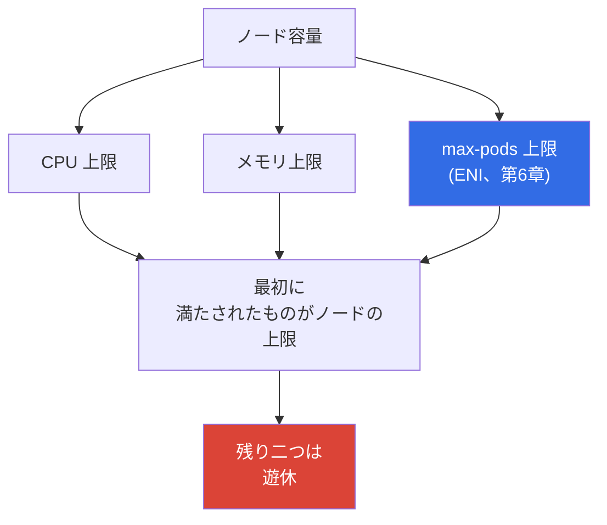
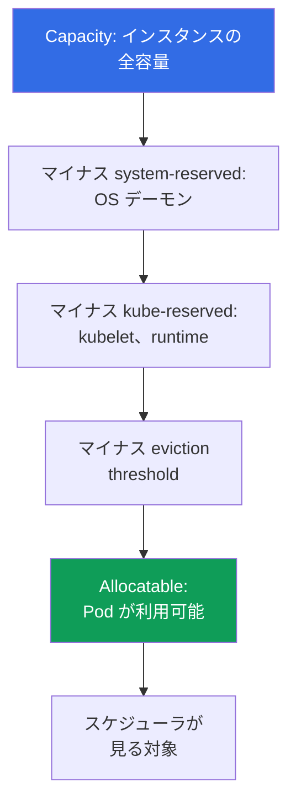

[Русская версия](ru.md) · [Eng version](en.md) · [Versión en español](es.md) · [Version française](fr.md) · [Deutsche Version](de.md) · [ქართული ვერსია](ge.md) · [繁體中文版](tw.md)
# 第14章 密度とサイジング: node あたりの Pod 数、ENI 制限、クラウドの requests と limits

> **この後。** ノードはすでに負荷に応じて増えるようになっています。Cluster Autoscaler と Karpenter は第11章、Karpenter の設定は第12章、Spot は第13章で扱いました。残る問いは、クラウドでは直接コストになる、1 ノードに載せる Pod 数と設定すべき requests、limits です。本章では密度の経済性と安定性を扱います。`max-pods`、ENI、warm pool の式と導出は第6章、prefix delegation による Pod 上限の引き上げは第7章、Karpenter によるインスタンス選択は第12章、HPA と VPA は第35章、コスト全体は第43章を参照してください。ここではこれらのレバーを挙げて結び付けますが、繰り返しては説明しません。

## 14.1. 空き容量に支払う三つの方法

現実に起きる三つの状況があり、どれも同時にコストと安定性に関わります。

一つ目。フリートは `t3.medium` で構成され、ノードの CPU 使用率は 20 パーセントですが、新しい Pod が入りません。原因は CPU でもメモリでもなく、`max-pods`（第6章）に達したことです。小さいインスタンスは 17 Pod を受け入れると、それ以上動けなくなります。CPU は空いていてもです。負荷が上がらないハードウェアに料金を支払っています。

二つ目は逆の状況です。より多く載せるために requests を低く設定した結果、Pod が高密度に詰め込まれ、ピーク時にノードは CPU throttling に陥り、一部のコンテナは `OOMKilled` になります。スケジューラは実際の消費ではなく requests を見て、すべて収まると判断していました。

三つ目。より安全そうだからという理由で、どこでも `requests == limits` を設定しています。クラスタ容量の半分は予約のまま遊休です。1 日に一度しか到達しないピーク値に対して支払い、スケジューラはそれを 24 時間占有済みとして扱います。オートスケーラーは存在しない負荷に応じて忠実にノードを追加します。

サイジングは、この三つの崖の間で選ぶ作業です。以降では順に、ノードの上限、Pod が実際に利用できる容量、requests と limits がパッキングと安定性をどう決めるか、そして勘ではなく実測で算出する方法を説明します。

## 14.2. ノードの三つの上限: CPU、メモリ、max-pods

ノードには独立した三つの制限があり、最初に尽きたものがノードの上限になります。



`max-pods` は VPC CNI の ENI モデルによって決まり、式と導出は第6章で扱います。ここで重要なコスト上の帰結は、小さいインスタンスでは CPU やメモリより先に Pod 上限に達するため、支払い済みの CPU と RAM が遊休になることです。

| インスタンス | vCPU | メモリ | max-pods | requests が 100m/128Mi の Pod で最初に達する上限 |
|---|---|---|---|---|
| `t3.small` | 2 | 2 GiB | 11 | CPU とメモリより大幅に早く `max-pods` |
| `t3.medium` | 2 | 4 GiB | 17 | `max-pods`: 17 Pod は 1.7 vCPU |
| `m5.xlarge` | 4 | 16 GiB | 58 | バランス: 58 Pod は約 5.8 vCPU |
| `m5.4xlarge` | 16 | 64 GiB | 234 (上限 110) | Pod 数より先に CPU またはメモリ |

この表から分かる規則は、インスタンスが小さいほどコンピュートではなく Pod 数に達しやすいということです。加えて DaemonSet（`aws-node`、`kube-proxy`、ログ・メトリクスエージェント）はノードのサイズに関係なく数個の Pod スロットを消費し、`t3.small` ではこの固定オーバーヘッドが 11 個のかなりの割合を占めます。prefix delegation（第7章）は同じインスタンスで Pod 上限を引き上げます。これは `max-pods` による遊休に対する最初のレバーです。

## 14.3. kubeadm の高密度ワークロードを移行する: pods-per-node と VPC CNI

移行時の症状です。チームは、Pod ネットワークが overlay CNI（VXLAN モードの Calico または Flannel、overlay の Cilium）である自前構築の kubeadm クラスタを移行します。そこで Pod はクラスタ内部の pod-CIDR からアドレスを受け取り、IP は事実上「無料」であり、ノードには何百もの小さな Pod が載っています。kubelet の `max-pods` は意図的に高く設定されています。EKS への移行後、同じサイズのノードに入る Pod 数は何分の一にも減ります。一部は `Pending` のままで、イベントには IP またはリソース不足が出ますが、ノードの CPU とメモリは空いています。

これはすぐに二か所で確認できます。

```bash
# 同じインスタンスタイプで kubeadm より Allocatable pods が著しく少ない
kubectl get node <node> -o jsonpath='{.status.allocatable.pods}{"\n"}'
# 待機中の Pod のイベント: CPU やメモリではなく IP/ENI スロット不足
kubectl describe pod <pod> | grep -A 5 Events
```

原因です。VPC CNI は overlay を作らず、**各** Pod に VPC サブネット内の ENI から実際のセカンダリ IP を割り当てます。そのためノードの Pod 上限は、特定インスタンスタイプの ENI 数と ENI あたりの IP 数の関数です。

```
max-pods = ENI * (IP_あたりの_ENI - 1) + 2
```

数値は AMI の `eni-max-pods.txt` テーブル（docs.aws.amazon.com、managing-vpc-cni および choosing-instance-type）から取得します。prefix delegation を使わない場合、一般的なインスタンスでは数十 Pod 程度であり、kubeadm の overlay より大幅に少なくなります。さらに Kubernetes 自体も、1 ノードあたり約 110 Pod 以下を推奨しています。「large に千 Pod」は kubeadm-overlay のパターンであり、EKS の目標ではありません。

対応策を、より抜本的な順に挙げます。

1. **Prefix delegation** は基本的な答えです。VPC CNI の `ENABLE_PREFIX_DELEGATION=true` フラグは、ENI スロットを 1 IP ではなく `/28` プレフィックス（16 アドレス）に割り当てます。小さなノードでも Pod 上限は 110 以上まで増えます。Nitro のインスタンスが必要で、`max-pods` は再計算します（詳細は第7章）。プレフィックスの warm pool は `WARM_PREFIX_TARGET` で設定します。
2. **Secondary CIDR と custom networking** は、ノード上のスロットではなく、サブネット自体の VPC アドレスが尽きる場合に使います（第7章）。
3. **密度を見直します。** kubeadm の「1 ノードに千 Pod」というパターンを EKS に持ち込まないでください。Karpenter が適切なノードサイズを選択します（第12章）。目安は 1 ノードあたり約 110 Pod 以下と、requests に基づく正直なパッキングです（bin packing は 14.10 節）。
4. **代替 CNI** として、overlay モードの Cilium は VPC IP に依存しない kubeadm に近い密度を実現します。ただし、その場合は CNI のライフサイクルを自ら管理し、一部の managed 統合を失います（第8章）。
5. **Fargate は密度を解決しません**。1 Pod は 1 つの独立した micro-VM であるため、高密度ワークロードの解決策にはなりません（第15章）。

| 特性 | kubeadm overlay | EKS VPC CNI | EKS + prefix delegation |
|---|---|---|---|
| Pod アドレス | クラスタの pod-CIDR から | VPC サブネットの実 IP | VPC サブネットの `/28` プレフィックス |
| pods-per-node の規模 | 数百 | 数十 | 110 以上 |
| 支払うコスト | overlay カプセル化 | VPC アドレス | 16 個単位の VPC アドレスブロック |

結論。EKS では実際の VPC IP がノードの通貨であり、無料の overlay ではありません。高密度ワークロードの移行計画は、大きなノードを買うことではなく、prefix delegation と `max-pods` の再計算から始めます。

## 14.4. Reserved リソース: Capacity と Allocatable

インスタンスの全容量が Pod に渡るわけではありません。kubelet は自身とシステム用に CPU とメモリの一部を予約し、eviction のしきい値を確保します。残ったものがスケジューラにリソースとして見える量です。



- **`kube-reserved`** は kubelet、container runtime、Kubernetes システムコンポーネント用です。
- **`system-reserved`** は OS デーモン（`sshd`、systemd など）用です。
- **eviction threshold** は、メモリ不足でノードが `NotReady` になる前に kubelet が Pod の退避を始めるためのバッファです。

EKS に固有の重要な点として、メモリ予約は Pod 数に連動します。AMI の bootstrap ロジックは、メモリ用の `kube-reserved` を概ね `11 * max-pods + 255` MiB として計算し、これに eviction しきい値が加わります。つまりノードの `max-pods` が高いほど、最初の Pod を起動する前からより多くのメモリが予約に回ります。また小さなインスタンスほどオーバーヘッドの比率が高くなります。2 GiB ノードでは予約としきい値が目に見える部分を占め、64 GiB ではほとんど分かりません。

| インスタンス | メモリ Capacity | オーバーヘッドの規模 | 予約の割合 |
|---|---|---|---|
| `t3.small` | 約 2 GiB | 予約としきい値 | 高い: メモリの目立つ部分 |
| `t3.medium` | 約 4 GiB | 予約は max-pods とともに増加 | 無視できない |
| `m5.xlarge` | 約 16 GiB | 同じ予約をより大きな容量で吸収 | 中程度 |
| `m5.4xlarge` | 約 64 GiB | 容量に対して予約は小さい | 低い |

常にマーケティング上のインスタンス容量ではなく Allocatable を確認してください。

```bash
# Capacity は全容量、Allocatable は Pod が実際に利用できる容量
kubectl describe node <node-name> | grep -A 12 -E 'Capacity:|Allocatable:'
# Pod が利用できるリソースのみを簡潔に表示
kubectl get node <node-name> \
  -o jsonpath='{.status.allocatable.cpu}{"  "}{.status.allocatable.memory}{"  pods="}{.status.allocatable.pods}{"\n"}'
```

Capacity と Allocatable の差は、支払いはするものの Pod には渡せない部分です。小さなノードを多数持つフリートでは、この差が積み上がり、無視できない過払いになります。

## 14.5. クラウドの requests と limits: 実際に何を決めるのか

bare-metal クラスタでは requests と limits はノード上の隣人に対する公平性の問題です。クラウドでは、ノードが存在する時間に対して支払うため、直接的な金銭的意味も加わります。

- **requests はパッキングとコストを決めます。** スケジューラは実消費量ではなく、ノードに *requests* が十分ある場合にのみ Pod を配置します。requests の合計が、1 ノードに入る Pod 数とオートスケーラーが新しいノードを追加する時点を決めます（第11章）。使用した量ではなく、requests に対して予約された量に支払います。
- **limits は消費を制限します。** 上限値であり、CPU が limit を超えると throttling され、メモリが超えるとコンテナは kill されます。limits はパッキングにもオートスケーラーの判断にも影響しません。

そこからコストを伴う二つの誤りが生じます。**requests の過小設定**では、スケジューラはノードが実際に処理できる以上に配置可能だと考え、ピーク時に過剰割り当て、CPU throttling、`OOMKilled`、Pod の eviction が発生します。**requests の過大設定**では、各 Pod が実際に消費する以上を予約します。実際の使用率が低くてもノードは満杯に見え、オートスケーラーは余分なハードウェアを追加し、請求額が増えます。

```yaml
resources:
  requests:            # この値でパッキングされ、請求額が増える
    cpu: "250m"
    memory: "256Mi"
  limits:              # コンテナ消費の上限
    cpu: "500m"
    memory: "256Mi"    # メモリの limit は通常 request と同じにする（14.7 節）
```

## 14.6. QoS クラスと eviction の順序

Kubernetes は Pod の requests と limits の関係を Quality of Service（QoS）クラスに変換し、このクラスがノードのメモリ不足時に誰を最初に eviction するかを決めます。

| QoS クラス | 条件 | メモリ不足時の eviction 順序 |
|---|---|---|
| `Guaranteed` | すべてのコンテナで CPU とメモリの requests == limits | 最後 |
| `Burstable` | requests は設定されているが limits より小さい（または limits がない） | BestEffort の後、requests 超過量に応じて |
| `BestEffort` | requests も limits も未設定 | 最初 |

requests のない `BestEffort` Pod はスケジューラがどこにでも配置でき、メモリ圧迫時には最初に削除されます。バックグラウンドジョブには適しますが、サービス向けではありません。`Guaranteed` は eviction に対する最大の保護を提供しますが、代償があります。`requests == limits` はピークを 24 時間予約することを意味します。

割り当てられた Pod のクラスを確認します。

```bash
kubectl get pod <pod> -o jsonpath='{.status.qosClass}{"\n"}'
kubectl describe pod <pod> | grep -i 'QoS Class'
```

`requests == limits`（Guaranteed）が正当化されるのは、eviction が高コストなデータベースと stateful ワークロード、および CPU を失えないレイテンシー重視のサービスです。有害なのは、ピークがまれな大規模 stateless サービスです。そこでピーク用の固定予約を持つと、容量を無駄に占有して請求額を膨らませます。

## 14.7. CPU throttling と OOMKilled: なぜメモリの方が厳格なのか

CPU とメモリは limits に対して根本的に異なる振る舞いをし、これが運用方針を変えます。

**CPU は圧縮可能なリソースです。** CPU limit は Linux カーネルの CFS quota で実装されます。コンテナにはスケジューリングウィンドウ内の CPU 時間の割り当てが与えられ、超過すると **throttling** されます。すなわち遅くなりますが kill はされません。生存して健康に見える Pod で、レイテンシーの増加とメトリクス `container_cpu_cfs_throttled` の増加が症状です。CPU limit が低すぎると、形式上は「動作している」ワークロードを締め付けます。

**マルチスレッドランタイムは最も強く影響を受けます。** CFS quota は、スケジューリングウィンドウ（通常 100 ms）内で全 CPU コアにまたがる合計として計算されます。典型的には Java や Go のスレッドプールを持つアプリケーションは、ノードの全コアに一度に処理を分散し、ウィンドウの最初の数ミリ秒で quota を使い切ります。その後、期間の終わりまで throttling されます。その結果、平均使用率が limit を大きく下回っていても、レイテンシーが急増します。さらに、ランタイムは既定で割り当てられた比率ではなくノードの全コアを認識します。Go はホストのコア数から `GOMAXPROCS` を設定し、Java は `Runtime.availableProcessors()` に基づいてプールサイズを決めます。そのため、小さな quota しか与えられていないのに大きなマシン向けのスレッド数が作られます。したがって CPU requests が正直に設定されている場合、この種のアプリケーションに厳格な CPU limit を設けても、安定性を改善せず throttling を追加するだけであることが多いです。requests はすでに競合時の CPU 割り当てを保証します。

**メモリは圧縮不可能なリソースです。** すでに割り当てられたメモリを取り上げることはできず、メモリに「soft throttling」はありません。memory limit を超えたコンテナはカーネルから `OOMKilled` を受けて再起動します。そのためメモリでは CPU より limit が重要です。これは正常動作と kill の実際の境界です。

```bash
# 再起動理由: コンテナの Last State で OOMKilled を探す
kubectl describe pod <pod> | grep -A 5 'Last State'
kubectl get pod <pod> -o jsonpath='{.status.containerStatuses[0].lastState.terminated.reason}{"\n"}'
# 設定値に対する実際の消費量
kubectl top pods --containers
```

覚えておくべき実践は、**メモリでは `request == limit` を維持する**ことです。これにより挙動が予測可能になり、Pod が隣接 Pod の予約を突然超えて共有ノード上で OOM になるのを防げます。CPU では、limit を request より高くするか、CPU limit 自体を設定せず、競合時に throttling によって制約へ戻る一方で、Pod が遊休 CPU を使えるようにすることがよくあります。これは教条ではなくトレードオフです。レイテンシー重視のサービスでは、予測可能性のために CPU limit が必要な場合もあります。

## 14.8. コストのレバーとしての密度

「多数の小さなノード」と「少数の大きなノード」の選択は、唯一の正解ではなく、トレードオフの集合です。

| 観点 | 小さなノード | 大きなノード |
|---|---|---|
| reserved の割合（14.4 節） | 高い: オーバーヘッドに支払う | 低い: 容量に対して予約が小さい |
| システム Pod と DaemonSet | 各ノードで複製される | より多くの Pod に償却される |
| `max-pods` に達するリスク | 高い（第6章） | 低い |
| ノード障害の blast radius | 小さい: 落ちる Pod が少ない | 大きい: 多くの Pod が一度に落ちる |
| スケーリングの増分 | 小さく正確 | 粗い: 一度に多くを追加 |
| Bin packing と断片化 | 端に余りが多い | より高密度に配置可能 |

大きなノードはオーバーヘッドとシステム Pod を節約しますが、blast radius を大きくし、スケーリングを粗くします。新しいノード 1 台が一度に大容量を追加するため、遊休になる場合があります。小さなノードは正確な増分と小さな blast radius を提供しますが、予約の割合が高く、`max-pods` に達する危険があります。prefix delegation（第7章）は Pod 上限を上げて最後の制約を除くため、高密度のフリートでは既定で有効化します。

## 14.9. requests の実践的なサイジング

規則は一つです。**requests は勘ではなく実測で設定します**。目測で推測した値は、14.1 節の二つの崖の原因です。

- 実際の消費を測定します。`metrics-server` と `kubectl top` は瞬間的な状況を、Prometheus はピークを含む履歴を提供します（第33章）。
- requests の推奨値には、VPA を `recommend` モード（自動適用なし）で使います。VPA は負荷を観測し、Pod を変更せずに値を提案します（第35章）。
- requests は 1 日に一度の最大値ではなく、ピークの余裕を含む実際のプロファイルに基づいて設定します。メモリでは `request == limit`（14.7 節）を忘れないでください。
- right-sizing は一度限りの設定ではなくプロセスです。負荷プロファイルは変わるため、requests を定期的に見直し、第43章のツールで経済性を計算します。

```bash
# ノードの瞬間的な負荷: describe node の requests 合計と比較
kubectl top nodes
# コンテナ別の消費量: requests 見直しの基礎
kubectl top pods --all-namespaces --containers
```

## 14.10. Bin packing: 同じノードの方がなぜよく詰め込めるのか

ノードへの Pod の配置は bin packing 問題であり、その予測可能性はフリートの均質性と requests が現実をどれだけ反映しているかに直接依存します。

- スケジューラは *requests* に基づいて Pod を配置します。requests が低すぎるとパッキングは高密度に見えますが、実際にはノードが過負荷です。高すぎると端に多くの「空気」が残ります。
- 異種ノードは詰め込み効率が悪くなります。各サイズに異なる余りが生じ、断片化が増え、容量の一部が恒久的に未使用になります。同じノードは、計画とアラート設定が容易な、再現性があり予測可能な結果をもたらします。
- トポロジーはパッキングに影響します。AZ、`topologySpread`、affinity、taints による制約は、配置可能なノードの集合を狭めます。ルールが厳しすぎると高密度な配置を妨げます（第40章）。
- Karpenter consolidation（第12章）はクラスタを定期的に再パッキングします。低利用率ノードから Pod を退避してノードを停止します。requests が正直で、ノードタイプが均質であるほど効果は高くなります。その場合 consolidation は隙間のない配置を見付けられます。

## 14.11. 本番ではどのように適用するか

- **インスタンスタイプは CPU とメモリだけでなく、三つの上限すべてで選びます。** ノードが最初にどこに達するかを算出し、`max-pods` により遊休が必至の小さなインスタンスを選びません（第6章）。Pod 上限が制約になる場所では prefix delegation を有効にします（第7章）。
- **requests は実消費量に基づいて設定します。** 推測ではなく、メトリクスと VPA の推奨（第33章、第35章）を取得します。requests の見直しは一度限りではなく定期的な作業です。
- **メモリでは `request == limit` を維持します。** CPU は余裕を残すか limit を設定しないことがよくあります。メモリは圧縮できず `OOMKilled` になり、CPU は throttling されるだけです。
- **QoS は意図して割り当てます。** `Guaranteed` はデータベースとレイテンシー重視のサービス、`Burstable` は大規模 stateless サービス、`BestEffort` は退避されても問題ないものだけに使います。
- **可能な限りフリートのタイプを均質に保ちます。** 予測可能なパッキング、効率的な Karpenter consolidation（第12章）、単純な利用率アラートにつながります。
- **Capacity ではなく Allocatable を確認します。** requests 合計と実消費量の差を監視します。これは過払いの直接的な指標です（第43章）。

## 14.12. ミニ用語集

- **Capacity** は CPU、メモリ、Pod におけるインスタンスの全容量です。**Allocatable** は `kube-reserved`、`system-reserved`、eviction しきい値の後に Pod に残る量であり、スケジューラが見る対象です。
- **`kube-reserved` / `system-reserved`** は、Kubernetes 用と OS 用に kubelet が予約するリソースです。**eviction threshold** は、これを下回ると kubelet が Pod を eviction するメモリバッファです。
- **requests** は、パッキングとオートスケーラーの判断に使われるリソース量、すなわち Pod に対する予約です。**limits** はコンテナ消費の上限です。
- **QoS クラス** は `Guaranteed`、`Burstable`、`BestEffort` のいずれかで、メモリ不足時の eviction 順序を決めます。**CFS throttling** は CPU limit 超過時のコンテナの減速です。**OOMKilled** は memory limit 超過時にカーネルがコンテナを kill することです。
- **bin packing** は、requests に基づくノードへの Pod の配置です。**right-sizing** は requests を実消費量に合わせることです。

## 14.13. 章のまとめ

- ノードには CPU、メモリ、`max-pods`（ENI、第6章）という独立した三つの上限があり、最初に尽きたものが上限になります。小さなインスタンスはコンピュートより先に `max-pods` に達し、支払い済みのまま遊休になります。prefix delegation（第7章）はこの上限を引き上げます。
- Pod が利用できるのは全容量ではありません。`kube-reserved`、`system-reserved`、eviction しきい値により Capacity と Allocatable の間に差ができます。EKS のメモリ予約は `max-pods` とともに増え、小さなインスタンスではその割合が高くなります。スケジューラは Allocatable に基づいて計算します。
- requests はパッキング、オートスケーラーによるノード追加の時点、コストを決めます。limits は消費を制限します。requests の過小設定は throttling、OOM、eviction を招き、過大設定は遊休と過払いを招きます。
- requests と limits の関係から決まる QoS クラスは eviction 順序を定めます。`request == limit`（Guaranteed）はデータベースやレイテンシー重視のサービスには正当化されますが、ピーク容量を 24 時間占有します。
- CPU は CFS quota により throttling され、Pod を kill しません。メモリは圧縮できず `OOMKilled` になります。そのためメモリの limit は request と同じにし、requests はメトリクスと VPA（第33章、第35章）から実測でサイジングします。均質なフリートはより予測可能にパッキングでき、Karpenter（第12章）による consolidation も改善します。経済性は第43章で算出します。

## 14.14. 実務でどう役立つか

オンコール時、「Pod が `CrashLoopBackOff` で、Last State が `OOMKilled`」という組み合わせは謎ではなくなります。memory limit に達したことが分かり、`kubectl top` と負荷プロファイルを見るべき場所も明確です。Pod が生きているのにサービスのレイテンシーが増えた場合は、ネットワークではなく CPU throttling を確認します。フリートを計画する際は、「より大きなインスタンスを選ぼう」ではなく、Allocatable と requests プロファイルを考慮した三つの上限の計算を示し、なぜ本番の `t3.medium` がほぼ常に割に合わないのかを説明できます。そしてコスト（第43章）の議論はノードからではなく、requests 合計と実消費量の差、すなわち支払い対象となる「空気」の指標から始まります。

## 14.15. 自己確認の質問

1. ノードの三つの上限を挙げてください。フリートが満杯のとき、なぜ `t3.medium` は CPU が遊休になりやすいのでしょうか。
2. Capacity と Allocatable の違いは何で、スケジューラはどちらを見るでしょうか。
3. EKS のメモリ予約が `max-pods` とともに増える理由は何で、どのインスタンスでオーバーヘッドの割合が高いでしょうか。
4. requests は何に影響し、limits は何に影響しますか。各サイジング誤りは請求額にどう影響しますか。
5. requests と limits の関係は QoS クラスと eviction 順序をどう決めますか。
6. `request == limit` はいつ正当化され、いつ容量を無駄に占有するだけでしょうか。
7. CPU よりメモリで limit が重要なのはなぜですか。それぞれを超えると何が起こりますか。
8. CPU は limit なしにできる一方、メモリでは望ましくないのはなぜですか。
9. 数値を推測せず、新しいサービスの requests を正しく決めるにはどうしますか。
10. 均質なノードフリートがより予測可能にパッキングでき、より良く consolidation できるのはなぜですか。
11. 第7章のどのレバーが `max-pods` 上限を取り除き、いつ有効にすべきですか。

## 演習

このトピックに対応するコースラボは、[ラボ 103: アドレス計画: ENI 制限、prefix delegation、secondary CIDR](../../labs/103/README_JP.MD) です。このラボでは、本章の max-pods の式を稼働中のノードの実測値と照合します。それ以外も、すべて稼働中のクラスタで検証できます。まず Capacity と Allocatable の差から始めてください。`kubectl describe node <node> | grep -A 12 -E 'Capacity:|Allocatable:'` はインスタンス容量のうち Pod に利用できない量を示し、`kubectl get node <node> -o jsonpath='{.status.allocatable.pods}'` は Pod 上限を示します。`kubectl describe node` の `Allocated resources` ブロックにあるノード上の全 Pod の requests 合計を、`kubectl top nodes` の実負荷と比較してください。その差が、支払っている「空気」です。

続いて、requests のない Pod（`BestEffort`）を見付け、`kubectl get pod <pod> -o jsonpath='{.status.qosClass}'` で QoS クラスを確認します。再起動しているサービスを一つ選び、理由を確認します。`kubectl describe pod <pod> | grep -A 5 'Last State'` に `OOMKilled` があれば、memory limit を `kubectl top pods --containers` と比較してください。最後に、14.2 節の表から現在のインスタンスタイプが最初にどの上限へ達するかを見積もり、実測で仮説を確認します。allocatable の `max-pods` を `kubectl get pods -A -o wide --field-selector spec.nodeName=<node>` による実際のノード上の Pod 数と比較してください。

---
[目次](../README_JP.md) · [第13章](../13/jp.md) · [第15章](../15/jp.md)
