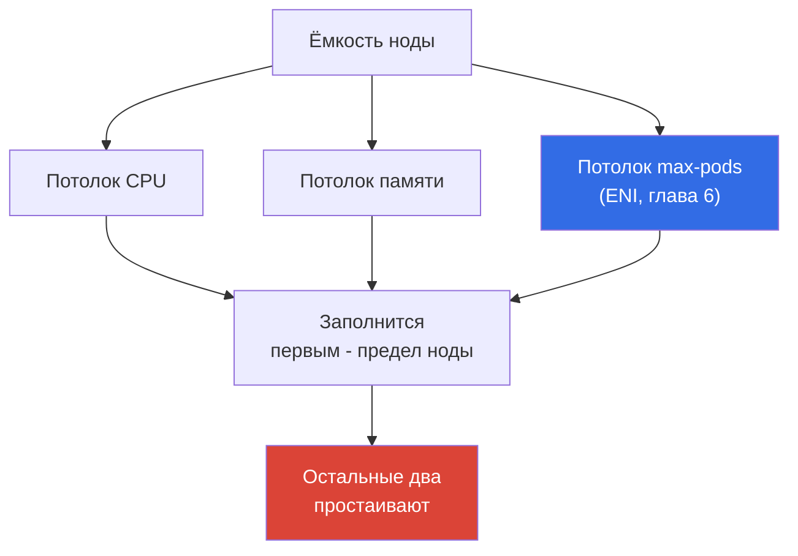
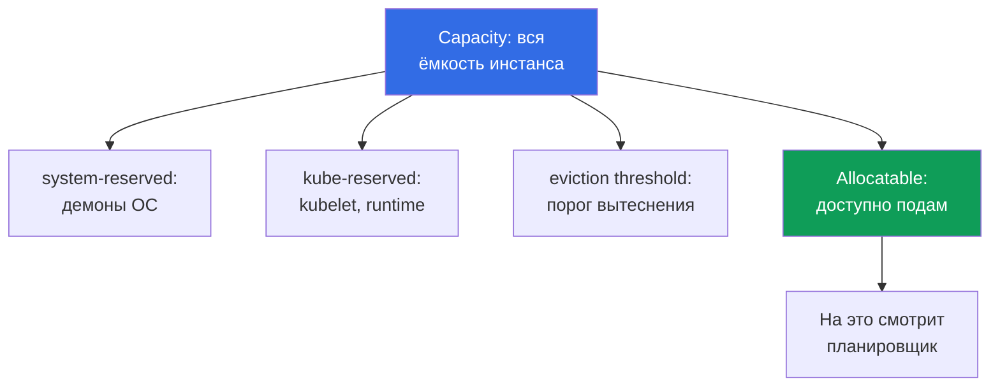

# Глава 14. Плотность и сайзинг: pods per node, лимиты ENI, requests и limits в облаке

> **Что дальше.** Ноды уже умеют появляться под нагрузку: Cluster Autoscaler и Karpenter
> (глава 11), конфигурация Karpenter (глава 12), spot (глава 13). Осталось ответить на вопрос,
> который в облаке напрямую превращается в счёт: сколько подов класть на ноду и какие requests
> и limits им выставлять. Здесь - про экономику плотности и стабильность. Вывод формулы
> `max-pods`, ENI и warm-пул целиком в главе 6, повышение потолка подов через prefix delegation
> - в главе 7, выбор инстансов Karpenter - глава 12, HPA и VPA - глава 35, стоимость целиком -
> глава 43. Здесь эти рычаги названы и связаны, но не пересказаны.

## 14.1. Три способа платить за воздух

Три реальные картины, все три - деньги и стабильность одновременно.

Первая. Парк собран на `t3.medium`, ноды на 20 процентов по CPU, а новые поды не влезают.
Причина не в CPU и не в памяти: упёрлись в `max-pods` (глава 6). Мелкий инстанс принимает
17 подов и встаёт, хотя процессор простаивает. Платят за железо, которое по загрузке никогда
не выйдет из простоя.

Вторая, зеркальная. Requests занижены «чтобы больше влезло», поды набились плотно, и на пике
нода уходит в CPU throttling, а часть контейнеров ловит `OOMKilled`. Планировщик считал, что
всё помещается, потому что смотрел на requests, а не на реальное потребление.

Третья. Везде выставлено `requests == limits` по принципу «так надёжнее». Половина ёмкости
кластера простаивает в резерве: заплачено за пиковые числа, которые достигаются раз в сутки,
а планировщик держит их занятыми круглосуточно. Автоскейлер исправно добавляет ноды под
несуществующую нагрузку.

Сайзинг - это выбор между этими тремя обрывами. Дальше по порядку: где потолки ноды, что у неё
реально доступно подам, как requests и limits определяют упаковку и стабильность, и как считать
их по факту, а не по интуиции.

## 14.2. Три потолка ноды: CPU, память, max-pods

У ноды три независимых предела, и она встаёт на том, который кончится первым.



`max-pods` задаёт ENI-модель VPC CNI, формула и её вывод - в главе 6. Здесь важно следствие
для денег: на мелких инстансах потолок подов достигается раньше, чем CPU и память, поэтому
процессор и ОЗУ уходят в простой, за который платят.

| Инстанс | vCPU | Память | max-pods | Во что упрётся при подах 100m/128Mi |
|---|---|---|---|---|
| `t3.small` | 2 | 2 GiB | 11 | в `max-pods` задолго до CPU и памяти |
| `t3.medium` | 2 | 4 GiB | 17 | в `max-pods`: 17 подов - это 1.7 vCPU |
| `m5.xlarge` | 4 | 16 GiB | 58 | баланс: 58 подов дают около 5.8 vCPU |
| `m5.4xlarge` | 16 | 64 GiB | 234 (кэп 110) | в CPU или память раньше, чем в подов |

Из таблицы видно правило: чем мельче инстанс, тем вероятнее он упрётся в подов, а не в
вычисления. Плюс DaemonSet'ы (`aws-node`, `kube-proxy`, агенты логов и метрик) отъедают
несколько слотов подов независимо от размера ноды, и на `t3.small` эта фиксированная надбавка
съедает заметную долю из одиннадцати. Prefix delegation (глава 7) поднимает потолок подов на
том же инстансе - это первый рычаг против простоя из-за `max-pods`.

## 14.3. Reserved ресурсы: Capacity против Allocatable

Не вся ёмкость инстанса достаётся подам. Kubelet резервирует часть CPU и памяти на свои нужды
и на систему, и держит порог вытеснения. То, что останется, планировщик и видит как ресурс.



- **`kube-reserved`** - под kubelet, container runtime и системные компоненты Kubernetes.
- **`system-reserved`** - под демоны ОС (`sshd`, systemd и прочее).
- **eviction threshold** - буфер, ниже которого kubelet начинает вытеснять поды, чтобы нода не
  ушла в `NotReady` из-за нехватки памяти.

Ключевая деталь EKS: резерв памяти привязан к числу подов. Bootstrap-логика AMI считает
`kube-reserved` по памяти как примерно `11 * max-pods + 255` MiB, а к этому добавляется порог
вытеснения. То есть чем выше `max-pods` на ноде, тем больше памяти уходит в резерв ещё до
запуска первого пода. И доля накладных расходов у мелких инстансов выше: на 2 GiB ноде резерв
и порог откусывают заметную часть, на 64 GiB - почти незаметную.

| Инстанс | Память Capacity | Порядок накладных | Доля резерва |
|---|---|---|---|
| `t3.small` | ~2 GiB | резерв плюс порог | высокая: заметная часть памяти |
| `t3.medium` | ~4 GiB | резерв растёт с max-pods | ощутимая |
| `m5.xlarge` | ~16 GiB | тот же резерв на большем объёме | умеренная |
| `m5.4xlarge` | ~64 GiB | резерв мал против ёмкости | низкая |

Смотреть надо всегда на Allocatable, а не на маркетинговый объём инстанса:

```bash
# Capacity - вся ёмкость, Allocatable - что реально доступно подам
kubectl describe node <node-name> | grep -A 12 -E 'Capacity:|Allocatable:'
# Только доступные подам ресурсы, кратко
kubectl get node <node-name> \
  -o jsonpath='{.status.allocatable.cpu}{"  "}{.status.allocatable.memory}{"  pods="}{.status.allocatable.pods}{"\n"}'
```

Разница между Capacity и Allocatable - это то, за что вы платите, но что подам не отдадите. На
парке из множества мелких нод эта разница суммируется в заметную переплату.

## 14.4. requests и limits в облаке: что они на самом деле решают

В bare-metal кластере requests и limits - вопрос честности перед соседями по ноде. В облаке у
них добавляется прямой денежный смысл, потому что за ноды платят по факту их существования.

- **requests определяют упаковку и стоимость.** Планировщик размещает под, только если на ноде
  хватает *requests*, а не по факту потребления. Сумма requests решает, сколько подов влезет
  на ноду и в какой момент автоскейлер добавит новую (глава 11). Вы платите за
  зарезервированное под requests, а не за использованное.
- **limits ограничивают потребление.** Это верхняя граница: CPU сверх limit душится, память
  сверх limit убивает контейнер. На упаковку и на решение автоскейлера limits не влияют.

Отсюда две ошибки с ценником. **Занижение requests** - планировщик считает, что помещается
больше, чем нода тянет; на пике приходит переподписка, CPU throttling, `OOMKilled` и
вытеснение подов. **Завышение requests** - каждый под резервирует больше, чем ест; ноды
выглядят полными при низкой реальной загрузке, автоскейлер добавляет лишнее железо, счёт растёт
на простое.

```yaml
resources:
  requests:            # по этим числам идёт упаковка и растёт счёт
    cpu: "250m"
    memory: "256Mi"
  limits:              # верхний предел потребления контейнера
    cpu: "500m"
    memory: "256Mi"    # для памяти limit обычно держат равным request (раздел 14.6)
```

## 14.5. QoS-классы и порядок вытеснения

Соотношение requests и limits у пода Kubernetes переводит в класс качества обслуживания (QoS),
и этот класс задаёт, кого вытеснят первым, когда на ноде кончается память.

| QoS-класс | Условие | Кого вытесняют при нехватке памяти |
|---|---|---|
| `Guaranteed` | requests == limits по CPU и памяти для всех контейнеров | последними |
| `Burstable` | requests заданы, но меньше limits (или limits нет) | после BestEffort, по перерасходу над requests |
| `BestEffort` | ни requests, ни limits не заданы | первыми |

`BestEffort` под без requests планировщик воткнёт куда угодно, и он же первым пойдёт под нож
при давлении на память - место для фоновых задач, не для сервисов. `Guaranteed` даёт
максимальную защиту от вытеснения, но ценой: `requests == limits` означает, что вы резервируете
пик круглосуточно.

Проверить класс присвоенного пода:

```bash
kubectl get pod <pod> -o jsonpath='{.status.qosClass}{"\n"}'
kubectl describe pod <pod> | grep -i 'QoS Class'
```

Когда `requests == limits` (Guaranteed) оправдано: базы данных и stateful-нагрузки, где
вытеснение дорого, и латентно-чувствительные сервисы, которым нельзя терять CPU. Когда вредно:
массовые stateless-сервисы с редкими пиками - там жёсткий резерв под пик держит ёмкость
занятой без пользы и раздувает счёт.

## 14.6. CPU throttling и OOMKilled: почему память строже

CPU и память ведут себя под limits принципиально по-разному, и это меняет тактику.

**CPU - сжимаемый ресурс.** Limit по CPU реализуется через CFS quota ядра Linux: контейнеру
выдают долю процессорного времени в окне планирования, и при превышении его **троттлят** -
замедляют, но не убивают. Симптом - рост латентности и метрика `container_cpu_cfs_throttled`,
при живом и здоровом на вид поде. Слишком низкий CPU limit душит нагрузку, которая формально
«работает».

**Память - несжимаемый ресурс.** Отобрать уже выданную память нельзя, «мягкого throttling» у
памяти нет. Контейнер, превысивший memory limit, получает `OOMKilled` от ядра и
перезапускается. Поэтому для памяти limit важнее, чем для CPU: он реальная граница между
работой и убийством.

```bash
# Причина рестарта: ищем OOMKilled в Last State контейнера
kubectl describe pod <pod> | grep -A 5 'Last State'
kubectl get pod <pod> -o jsonpath='{.status.containerStatuses[0].lastState.terminated.reason}{"\n"}'
# Фактическое потребление против выставленных чисел
kubectl top pods --containers
```

Практика, которую стоит запомнить: **для памяти держите `request == limit`**, чтобы поведение
было предсказуемым и под не мог внезапно превысить резерв соседей и словить OOM на общей ноде.
Для CPU часто оставляют `limit` выше `request` или не ставят CPU limit вовсе, позволяя поду
занимать простаивающий процессор без риска - троттлинг всё равно вернёт его в рамки при
конкуренции. Это компромисс, а не догма: латентно-чувствительным сервисам CPU limit иногда
нужен для предсказуемости.

## 14.7. Плотность как рычаг стоимости

Выбор между «много мелких нод» и «мало крупных» - это набор компромиссов, а не один правильный
ответ.

| Аспект | Мелкие ноды | Крупные ноды |
|---|---|---|
| Доля reserved (раздел 14.3) | выше: платите за накладные | ниже: резерв мал против ёмкости |
| Системные поды и DaemonSet'ы | дублируются на каждой ноде | амортизируются на больше подов |
| Риск упереться в `max-pods` | высокий (глава 6) | низкий |
| Взрывной радиус отказа ноды | мал: падает мало подов | велик: падает много подов сразу |
| Шаг масштабирования | мелкий и точный | грубый: добавили - сразу много |
| Bin packing и фрагментация | больше остатков по краям | плотнее укладка |

Крупные ноды экономят на накладных расходах и системных подах, но повышают взрывной радиус и
делают масштабирование грубым: одна новая нода добавляет сразу много ёмкости, и она может
простаивать. Мелкие ноды дают точный шаг и малый радиус, но платят повышенной долей резерва и
рискуют упереться в `max-pods`. Prefix delegation (глава 7) снимает последнее ограничение,
поднимая потолок подов, поэтому на плотных парках его включают по умолчанию.

## 14.8. Сайзинг requests на практике

Правило одно: **requests выставляют по факту, а не по интуиции**. Угаданные «на глаз» числа -
источник обоих обрывов из раздела 14.1.

- Снимите реальное потребление: `metrics-server` и `kubectl top` дают мгновенную картину,
  Prometheus - историю с пиками (глава 33).
- Для рекомендаций по requests используйте VPA в режиме `recommend` (без автоприменения): он
  наблюдает нагрузку и предлагает числа, не трогая поды (глава 35).
- Выставляйте requests по реальному профилю с запасом на пик, а не по максимуму, который бывает
  раз в сутки. Для памяти помните про `request == limit` (раздел 14.6).
- Right-sizing - это процесс, а не разовая настройка: профиль нагрузки меняется, requests
  пересматривают регулярно, экономику считают инструментами из главы 43.

```bash
# Мгновенная загрузка нод: сравните с суммой requests из describe node
kubectl top nodes
# Потребление по контейнерам - основа для пересмотра requests
kubectl top pods --all-namespaces --containers
```

## 14.9. Bin packing: почему одинаковые ноды упаковываются лучше

Упаковка подов по нодам - это задача bin packing, и её предсказуемость прямо зависит от того,
насколько однороден парк и насколько requests отражают реальность.

- Планировщик укладывает поды по *requests*. Если requests занижены, упаковка выглядит плотной,
  а нода перегружена по факту; если завышены - остаётся много «воздуха» по краям.
- Разнородные ноды упаковываются хуже: у каждого размера свой остаток, фрагментация растёт,
  часть ёмкости не используется никогда. Одинаковые ноды дают повторяемый и предсказуемый
  результат, который проще планировать и на который проще ставить алерты.
- Топология влияет на упаковку: ограничения по AZ, `topologySpread`, affinity и taints режут
  множество допустимых нод, и слишком жёсткие правила мешают плотной укладке (глава 40).
- Karpenter consolidation (глава 12) периодически переупаковывает кластер: выселяет поды с
  недозагруженных нод и гасит их. Работает это тем лучше, чем честнее requests и чем однороднее
  типы нод - тогда консолидация находит плотный вариант без дыр.

## 14.10. Как это применяют в продакшене

- **Тип инстанса выбирают по всем трём потолкам сразу**, а не только по CPU и памяти: считают,
  во что упрётся нода первой, и не берут мелкие инстансы, обречённые простаивать из-за
  `max-pods` (глава 6). Prefix delegation включают там, где потолок подов жмёт (глава 7).
- **requests ставят по факту потребления**: снимают метрики и VPA-рекомендации (главы 33, 35),
  а не угадывают. Пересмотр requests - регулярная задача, а не разовая.
- **Для памяти держат `request == limit`**, для CPU часто оставляют запас или не ставят limit -
  память несжимаема и даёт `OOMKilled`, CPU лишь троттлится.
- **QoS назначают осознанно**: `Guaranteed` для баз и латентных сервисов, `Burstable` для
  массовых stateless, `BestEffort` только для того, что не жалко вытеснить.
- **Парк держат однородным по типам** насколько возможно: предсказуемая упаковка, эффективная
  консолидация Karpenter (глава 12) и простые алерты на загрузку.
- **Смотрят на Allocatable, а не на Capacity**, и мониторят разрыв между суммой requests и
  реальным потреблением - это прямая метрика переплаты (глава 43).

## 14.11. Мини-глоссарий

- **Capacity** - полная ёмкость инстанса по CPU, памяти и подам. **Allocatable** - то, что
  осталось подам после `kube-reserved`, `system-reserved` и порога вытеснения; на это смотрит
  планировщик.
- **`kube-reserved` / `system-reserved`** - ресурсы, зарезервированные kubelet под Kubernetes
  и под ОС. **eviction threshold** - буфер памяти, ниже которого kubelet вытесняет поды.
- **requests** - объём ресурсов, по которому идут упаковка и решение автоскейлера; резерв
  за подом. **limits** - верхний предел потребления контейнера.
- **QoS-класс** - `Guaranteed`, `Burstable` или `BestEffort`; задаёт порядок вытеснения при
  нехватке памяти. **CFS throttling** - замедление контейнера при превышении CPU limit.
  **OOMKilled** - убийство контейнера ядром при превышении memory limit.
- **bin packing** - укладка подов по нодам по их requests. **right-sizing** - приведение
  requests к реальному потреблению.

## 14.12. Итоги главы

- У ноды три независимых потолка - CPU, память и `max-pods` (ENI, глава 6) - и она встаёт на
  том, что кончится первым. Мелкие инстансы упираются в `max-pods` раньше, чем в вычисления, и
  простаивают за ваши деньги; prefix delegation (глава 7) поднимает этот потолок.
- Подам доступна не вся ёмкость: `kube-reserved`, `system-reserved` и порог вытеснения дают
  разрыв между Capacity и Allocatable. Резерв памяти в EKS растёт с `max-pods`, и его доля выше
  у мелких инстансов. Планировщик считает по Allocatable.
- requests определяют упаковку, момент добавления ноды автоскейлером и стоимость; limits
  ограничивают потребление. Занижение requests ведёт к throttling, OOM и вытеснению; завышение
  к простою и переплате.
- QoS-класс из соотношения requests и limits задаёт порядок вытеснения. `request == limit`
  (Guaranteed) оправдан для баз и латентных сервисов, но держит пик занятым круглосуточно.
- CPU троттлится через CFS quota и не убивает под, память несжимаема и даёт `OOMKilled` -
  поэтому для памяти limit держат равным request, а requests сайзят по факту через метрики и
  VPA (главы 33, 35). Однородный парк упаковывается предсказуемее и лучше консолидируется
  Karpenter (глава 12); экономику считают в главе 43.

## 14.13. Как это пригодится в реальной работе

На дежурстве связка «под в `CrashLoopBackOff`, в Last State - `OOMKilled`» перестаёт быть
загадкой: понятно, что упёрлись в memory limit, и понятно, куда смотреть - `kubectl top` и
профиль нагрузки. Рост латентности сервиса при живых подах отправляет проверять CPU throttling,
а не сеть. При планировании парка вы приносите не «возьмём инстансы побольше», а расчёт по трём
потолкам с учётом Allocatable и профиля requests, и объясняете, почему `t3.medium` в проде
почти всегда невыгоден. А разговор про стоимость (глава 43) начинается не с ноды, а с разрыва
между суммой requests и реальным потреблением - той самой метрики воздуха, за который платят.

## 14.14. Вопросы для самопроверки

1. Назовите три потолка ноды. Почему `t3.medium` часто простаивает по CPU при полном парке?
2. Чем Capacity отличается от Allocatable и что из них видит планировщик?
3. Почему резерв памяти в EKS растёт с `max-pods` и у кого доля накладных выше?
4. На что влияют requests, а на что limits? Как каждая из ошибок сайзинга бьёт по счёту?
5. Как соотношение requests и limits определяет QoS-класс и порядок вытеснения?
6. Когда `request == limit` оправдано, а когда только держит ёмкость занятой впустую?
7. Почему для памяти limit важнее, чем для CPU? Что происходит при превышении каждого из них?
8. Почему CPU можно оставить без limit, а память - нежелательно?
9. Как правильно определить requests для нового сервиса, не угадывая числа?
10. Почему однородный парк нод упаковывается предсказуемее и лучше консолидируется?
11. Какой рычаг из главы 7 снимает потолок `max-pods` и когда его включать?

## Практика

Лабы у главы пока нет, но всё проверяется на живом кластере. Начните с разрыва Capacity против
Allocatable: `kubectl describe node <node> | grep -A 12 -E 'Capacity:|Allocatable:'` покажет,
сколько ёмкости инстанса недоступно подам, а `kubectl get node <node> -o
jsonpath='{.status.allocatable.pods}'` - потолок подов. Сравните сумму requests всех подов ноды
из `kubectl describe node` (блок `Allocated resources`) с реальной загрузкой из `kubectl top
nodes`: разница и есть тот воздух, за который вы платите.

Дальше найдите поды без requests (`BestEffort`) и посмотрите их QoS-класс через `kubectl get
pod <pod> -o jsonpath='{.status.qosClass}'`. Возьмите сервис с рестартами и проверьте причину:
`kubectl describe pod <pod> | grep -A 5 'Last State'` - если там `OOMKilled`, сравните memory
limit с `kubectl top pods --containers`. Наконец, прикиньте по таблице из раздела 14.2, во что
упрётся ваш текущий тип инстансов первым, и проверьте гипотезу на факте: сопоставьте `max-pods`
из allocatable с реальным числом подов на ноде из `kubectl get pods -A -o wide
--field-selector spec.nodeName=<node>`.

---
[Оглавление](../README_RU.md) · [Глава 13](../13/ru.md) · [Глава 15](../15/ru.md)
