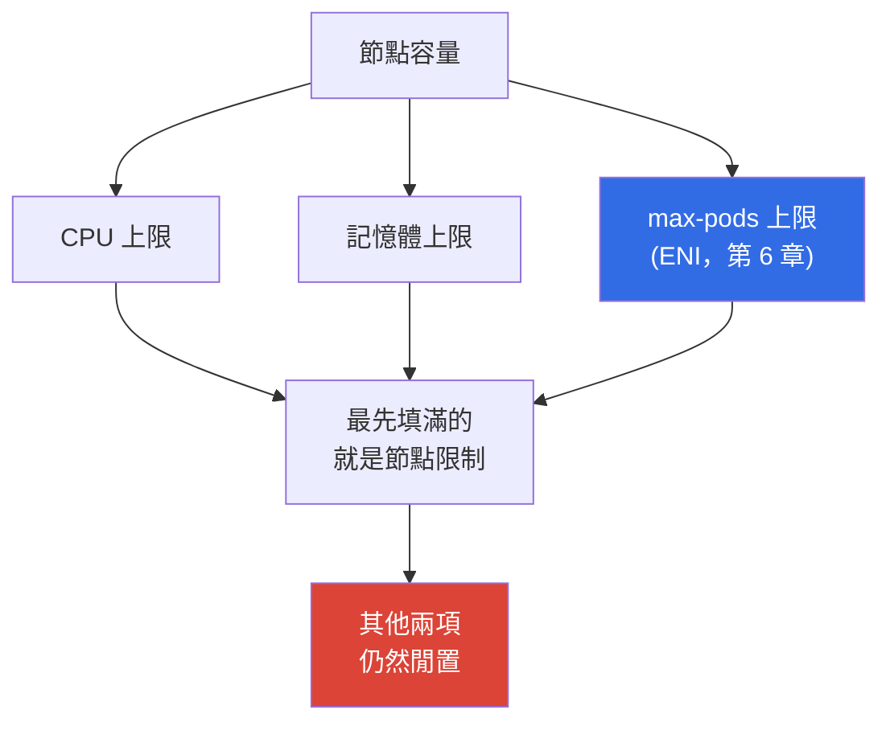
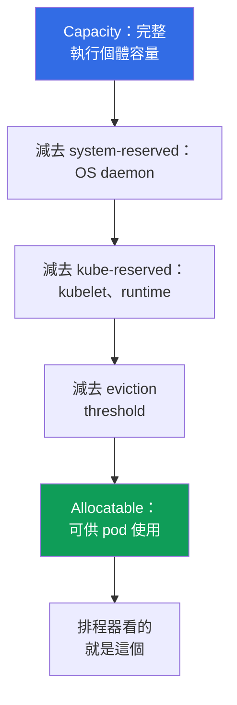

[Русская версия](ru.md) · [Eng version](en.md) · [Versión en español](es.md) · [Version française](fr.md) · [Deutsche Version](de.md) · [ქართული ვერსია](ge.md) · [日本語版](jp.md)

# 第 14 章：密度與 sizing：每個節點的 pod 數、ENI 限制，以及雲端的 requests 與 limits

> **接下來。** 節點已能在負載下出現：Cluster Autoscaler 與 Karpenter（第 11 章）、Karpenter 設定（第 12 章）、spot（第 13 章）。接下來要回答一個在雲端會直接變成帳單的問題：每個節點要放多少 pod，以及要設定哪些 requests 與 limits。本章討論密度的經濟性與穩定性。`max-pods`、ENI 與 warm pool 的公式及其推導完整見第 6 章，透過 prefix delegation 提高 pod 上限見第 7 章，Karpenter 的執行個體選擇見第 12 章，HPA 與 VPA 見第 35 章，完整成本見第 43 章。本章會點出並連結這些槓桿，但不重述其內容。

## 14.1. 為閒置容量付費的三種方式

三個真實情境，全都同時牽涉金錢與穩定性。

第一種。叢集使用 `t3.medium`，節點的 CPU 使用率為 20%，但新的 pod 放不進去。原因不是 CPU，也不是記憶體：而是碰到 `max-pods`（第 6 章）。小型執行個體接受 17 個 pod 後就停住，即使 CPU 仍閒置。你為硬體付費，但按使用率來看它永遠無法離開閒置狀態。

第二種則剛好相反。requests 為了「塞進更多」而被調低，pod 被密集放置，尖峰時節點進入 CPU throttling，部分容器遭遇 `OOMKilled`。排程器認為一切都放得下，因為它看的是 requests，而不是實際消耗量。

第三種。基於「這樣較可靠」的原則，所有地方都設為 `requests == limits`。叢集一半的容量以保留方式閒置：你為每天只會達到一次的尖峰數字付費，而排程器全天候將這些容量保持為已占用。autoscaler 忠實地為不存在的負載新增節點。

sizing 就是在這三個懸崖之間做選擇。接著依序說明：節點的上限在哪裡、實際可供 pod 使用的資源、requests 與 limits 如何決定封裝與穩定性，以及如何根據事實而非直覺計算它們。

## 14.2. 節點的三個上限：CPU、記憶體、max-pods

節點有三個彼此獨立的限制，它會在最先耗盡的一項停止。



`max-pods` 由 VPC CNI 的 ENI 模型決定，公式及其推導見第 6 章。對成本而言，重要的結果是小型執行個體會早於 CPU 與記憶體碰到 pod 上限，因此 CPU 與 RAM 閒置，卻仍需付費。

| 執行個體 | vCPU | 記憶體 | max-pods | 使用 100m/128Mi pod 時會先碰到什麼 |
|---|---|---|---|---|
| `t3.small` | 2 | 2 GiB | 11 | 遠早於 CPU 與記憶體碰到 `max-pods` |
| `t3.medium` | 2 | 4 GiB | 17 | `max-pods`：17 個 pod 為 1.7 vCPU |
| `m5.xlarge` | 4 | 16 GiB | 58 | 平衡：58 個 pod 約為 5.8 vCPU |
| `m5.4xlarge` | 16 | 64 GiB | 234（上限 110） | 早於 pod 碰到 CPU 或記憶體 |

從表格可看出一項規則：執行個體越小，越可能先碰到 pod 而非運算資源。此外，DaemonSet（`aws-node`、`kube-proxy`、日誌與指標 agent）不論節點大小都會占用數個 pod 插槽；在 `t3.small` 上，這項固定開銷會占用十一個插槽中的顯著比例。Prefix delegation（第 7 章）可在同一執行個體上提高 pod 上限，這是對抗 `max-pods` 造成閒置容量的第一個槓桿。

## 14.3. 從 kubeadm 遷移高密度工作負載：pods-per-node 與 VPC CNI

一個遷移症狀。團隊遷移自建的 kubeadm 叢集，該叢集的 pod 網路使用 overlay CNI（VXLAN 模式的 Calico 或 Flannel、overlay 模式的 Cilium）。其中的 pod 從叢集內部 pod-CIDR 取得位址，IP 是「免費的」，每個節點放置數百個小型 pod，因為 kubelet 的 `max-pods` 被刻意調高。遷移至 EKS 後，相同大小的節點能接受的 pod 數量少了數倍：一些 pod 停留在 `Pending`，事件顯示 IP 或資源不足，儘管節點 CPU 與記憶體仍有空閒。

這會立刻在兩個地方顯現：

```bash
# 相同執行個體類型下，Allocatable pods 明顯少於 kubeadm
kubectl get node <node> -o jsonpath='{.status.allocatable.pods}{"\n"}'
# Pending pod 的事件：缺少的是 IP/ENI 插槽，而非 CPU 或記憶體
kubectl describe pod <pod> | grep -A 5 Events
```

原因在於 VPC CNI 不建立 overlay：它會為**每一個** pod 指派 VPC 子網中 ENI 的真實次要 IP。因此，節點的 pod 上限取決於特定執行個體類型的 ENI 數量與每個 ENI 的 IP 數量：

```
max-pods = ENI * (每個_ENI_IP_數 - 1) + 2
```

數字取自 AMI 的 `eni-max-pods.txt` 表格（docs.aws.amazon.com、managing-vpc-cni 與 choosing-instance-type）。沒有 prefix delegation 時，典型執行個體大約只能有數十個 pod，遠少於 kubeadm 的 overlay。Kubernetes 也建議每個節點不超過約 110 個 pod：「一個大型節點一千個 pod」是 kubeadm-overlay 的模式，而不是 EKS 的目標。

依改變程度由小到大，應採取的做法如下：

1. **Prefix delegation** 是主要解答。VPC CNI 的 `ENABLE_PREFIX_DELEGATION=true` 旗標不會將一個 ENI 插槽分給一個 IP，而是分給一個 `/28` 前綴（16 個位址）。即使在小型節點上，pod 上限也會提高到 110 以上；需要 Nitro 執行個體，並且必須重新計算 `max-pods`（詳細內容見第 7 章）。透過 `WARM_PREFIX_TARGET` 設定 warm prefix pool。
2. **Secondary CIDR 加上 custom networking**：當耗盡的是子網本身的 VPC 位址，而不是節點上的插槽時使用（第 7 章）。
3. **重新檢視密度。** 不要把 kubeadm「每個節點一千個 pod」的模式帶到 EKS：Karpenter 會自行選擇正確的節點大小（第 12 章）；以每個節點最多約 110 個 pod 為指標，並依 requests 誠實地封裝（第 14.10 節關於 bin packing）。
4. **替代 CNI**：overlay 模式的 Cilium 提供與 kubeadm 類似、脫離 VPC IP 的密度，但此時你必須自行負責 CNI 的生命週期，並失去部分 managed 整合（第 8 章）。
5. **Fargate 無法解決密度問題**：一個 pod 就是一個獨立的微型 VM，因此它不是高密度工作負載的解答（第 15 章）。

| 特性 | kubeadm overlay | EKS VPC CNI | EKS + prefix delegation |
|---|---|---|---|
| Pod 位址 | 來自叢集 pod-CIDR | 來自 VPC 子網的真實 IP | 來自 VPC 子網的 `/28` 前綴 |
| 大致 pods-per-node | 數百 | 數十 | 110 以上 |
| 付出的代價 | overlay 封裝 | VPC 位址 | 每 16 個為一組的 VPC 位址 |

結論。在 EKS 中，真實的 VPC IP 是節點的貨幣，而不是免費的 overlay。高密度工作負載的遷移計畫應從 prefix delegation 與重新計算 `max-pods` 開始，而不是購買更大的節點。

## 14.4. 保留資源：Capacity 與 Allocatable

不是所有執行個體容量都分配給 pod。Kubelet 會為自身和系統保留部分 CPU 與記憶體，並維持 eviction threshold。剩餘部分才是排程器視為可用資源的內容。



- **`kube-reserved`**：供 kubelet、container runtime 與 Kubernetes 系統元件使用。
- **`system-reserved`**：供 OS daemon（`sshd`、systemd 等）使用。
- **eviction threshold**：低於此緩衝時，kubelet 開始驅逐 pod，以避免節點因缺乏記憶體而變為 `NotReady`。

EKS 的關鍵細節是：記憶體保留量與 pod 數量綁定。AMI bootstrap 邏輯會將記憶體的 `kube-reserved` 計算為約 `11 * max-pods + 255` MiB，然後再加上 eviction threshold。因此，節點上的 `max-pods` 越高，第一個 pod 尚未啟動前進入保留的記憶體就越多。小型執行個體的開銷比例也較高：在 2 GiB 節點上，保留與 threshold 會占去顯著部分；在 64 GiB 上則幾乎察覺不到。

| 執行個體 | Memory Capacity | 大致開銷 | 保留比例 |
|---|---|---|---|
| `t3.small` | ~2 GiB | 保留加上 threshold | 高：占記憶體顯著部分 |
| `t3.medium` | ~4 GiB | 保留隨 max-pods 成長 | 明顯 |
| `m5.xlarge` | ~16 GiB | 相同保留分攤在更大的容量 | 中等 |
| `m5.4xlarge` | ~64 GiB | 相較容量保留很小 | 低 |

應始終查看 Allocatable，而非執行個體的行銷容量：

```bash
# Capacity 是完整容量；Allocatable 是實際可供 pod 使用的資源
kubectl describe node <node-name> | grep -A 12 -E 'Capacity:|Allocatable:'
# 僅顯示可供 pod 使用的資源，簡潔格式
kubectl get node <node-name> \
  -o jsonpath='{.status.allocatable.cpu}{"  "}{.status.allocatable.memory}{"  pods="}{.status.allocatable.pods}{"\n"}'
```

Capacity 與 Allocatable 的差異，是你付費卻不會交給 pod 的資源。在由許多小型節點組成的叢集中，這個差異累積後會成為顯著的超額支出。

## 14.5. 雲端的 requests 與 limits：它們真正決定什麼

在 bare-metal 叢集中，requests 與 limits 是對節點上鄰居公平性的問題。在雲端，因為節點只要存在就要付費，它們具有直接的金錢意義。

- **requests 決定封裝與成本。** 排程器只有在節點有足夠的 *requests* 時才放置 pod，而非依實際消耗量。requests 的總和決定一個節點可容納多少 pod，以及 autoscaler 何時新增節點（第 11 章）。你是為 requests 保留的容量付費，而不是為已使用的容量付費。
- **limits 限制消耗。** 這是上限：超過 CPU limit 的 CPU 會被 throttled，超過記憶體 limit 的記憶體會終止容器。limits 不影響封裝，也不影響 autoscaler 的決策。

因此會出現兩個有價格代價的錯誤。**低估 requests**：排程器認為能容納的量超過節點實際可承受的量；在尖峰會造成超額訂閱、CPU throttling、`OOMKilled` 與 pod 驅逐。**高估 requests**：每個 pod 保留的資源多於消耗量；在實際使用率低時節點看似已滿，autoscaler 增加不必要的硬體，閒置容量的帳單持續上升。

```yaml
resources:
  requests:            # 封裝與帳單依這些數字決定
    cpu: "250m"
    memory: "256Mi"
  limits:              # 容器消耗的上限
    cpu: "500m"
    memory: "256Mi"    # 記憶體 limit 通常維持等於 request（第 14.7 節）
```

## 14.6. QoS 類別與驅逐順序

Kubernetes 會將 pod 的 requests 與 limits 關係轉換為服務品質（QoS）類別，而當節點記憶體耗盡時，這個類別決定誰先被驅逐。

| QoS 類別 | 條件 | 記憶體不足時的驅逐順序 |
|---|---|---|
| `Guaranteed` | 每個容器的 CPU 與記憶體 requests == limits | 最後 |
| `Burstable` | 已設定 requests，但小於 limits（或未設定 limits） | 在 BestEffort 之後，依超出 requests 的消耗量 |
| `BestEffort` | 未設定 requests 與 limits | 最先 |

沒有 requests 的 `BestEffort` pod，排程器可以放在任何地方，而且它會在記憶體壓力下最先被終止：適合背景工作，不適合服務。`Guaranteed` 提供最高的驅逐保護，但代價是 `requests == limits` 代表全天候保留尖峰容量。

檢查 pod 被指派的類別：

```bash
kubectl get pod <pod> -o jsonpath='{.status.qosClass}{"\n"}'
kubectl describe pod <pod> | grep -i 'QoS Class'
```

適合使用 `requests == limits`（`Guaranteed`）的情況：資料庫與 stateful 工作負載，其中驅逐的代價很高；以及無法失去 CPU 的延遲敏感服務。不適合的情況：尖峰不常出現的大量 stateless 服務，因為對尖峰進行硬性保留只會無益地占住容量並增加帳單。

## 14.7. CPU throttling 與 OOMKilled：為何記憶體更嚴格

CPU 與記憶體在 limits 下的行為有根本差異，這會改變策略。

**CPU 是可壓縮資源。** CPU limit 透過 Linux 核心的 CFS quota 實作：容器在排程視窗中取得一部分處理器時間，超過時就會被**throttled**，也就是變慢而非被終止。症狀是延遲升高與 `container_cpu_cfs_throttled` 指標增加，但 pod 仍存活且看起來健康。過低的 CPU limit 會扼殺形式上仍在「運作」的工作負載。

**多執行緒 runtime 受害最深。** CFS quota 在排程視窗內跨所有核心合計計算，通常為 100 ms。具備 thread pool 的應用程式，典型如 Java 或 Go，會同時將工作分布到節點所有核心，於視窗最初幾毫秒用盡 quota，接著在剩餘期間被 throttled。結果是在遠低於 limit 的平均使用率下出現延遲尖峰。runtime 預設會看見節點全部核心，而非其分配的份額，這會進一步惡化：Go 依主機核心數設定 `GOMAXPROCS`，Java 依 `Runtime.availableProcessors()` 調整 pool，因此它為大型機器建立 thread，而 quota 卻只屬於小型機器。因此，在誠實的 CPU requests 下，硬性 CPU limit 對這類應用程式通常只有害處：requests 已在競爭時保證處理器份額，而 limit 只會增加 throttling，無法提升穩定性。

**記憶體是不可壓縮資源。** 已分配的記憶體無法收回，記憶體沒有「軟性 throttling」。超過 memory limit 的容器會收到核心的 `OOMKilled` 並重新啟動。因此，memory limit 比 CPU limit 更重要：它是正常運作與終止之間的實際邊界。

```bash
# 重新啟動的原因：在容器 Last State 中尋找 OOMKilled
kubectl describe pod <pod> | grep -A 5 'Last State'
kubectl get pod <pod> -o jsonpath='{.status.containerStatuses[0].lastState.terminated.reason}{"\n"}'
# 實際消耗量與設定數值的比較
kubectl top pods --containers
```

值得記住的實務做法是：**記憶體維持 `request == limit`**，以便行為可預測，且 pod 不會意外消耗鄰居保留的資源並在共享節點上被 OOM 終止。對 CPU 而言，常見做法是讓 `limit` 高於 `request`，或完全不設定 CPU limit，允許 pod 安全地使用閒置的處理器：競爭發生時，throttling 仍會使它回到限制內。這是折衷，而不是教條：延遲敏感服務有時需要 CPU limit 來確保可預測性。

## 14.8. 密度作為成本槓桿

「許多小型節點」與「少數大型節點」之間的選擇是一組權衡，而非唯一正確的答案。

| 面向 | 小型節點 | 大型節點 |
|---|---|---|
| Reserved 比例（第 14.4 節） | 較高：要為開銷付費 | 較低：相較容量保留很小 |
| 系統 pod 與 DaemonSet | 每個節點都重複 | 分攤至更多 pod |
| 碰到 `max-pods` 的風險 | 高（第 6 章） | 低 |
| 節點失敗的 blast radius | 小：失敗的 pod 較少 | 大：許多 pod 同時失敗 |
| 擴展步幅 | 小且精確 | 粗糙：一次新增很多容量 |
| Bin packing 與碎片化 | 邊緣剩餘較多 | 封裝更密集 |

大型節點可節省開銷與系統 pod，但會增加 blast radius，並使擴展變得粗糙：一個新節點立即帶來大量容量，且可能閒置。小型節點提供精確步幅與小的失敗範圍，卻要付出較高的保留比例，並有碰到 `max-pods` 的風險。Prefix delegation（第 7 章）透過提高 pod 上限來消除此限制，因此在高密度叢集上預設會啟用它。

## 14.9. 實務上的 requests sizing

只有一項規則：**根據事實設定 requests，而非直覺**。憑「目測」猜出的數字，是第 14.1 節兩種懸崖的來源。

- 收集實際消耗量：`metrics-server` 與 `kubectl top` 提供即時畫面，Prometheus 提供包含尖峰的歷史資料（第 33 章）。
- 對 requests 建議使用 `recommend` 模式的 VPA（不自動套用）：它觀察工作負載並提出數字，不會變更 pod（第 35 章）。
- 根據實際設定檔與尖峰餘裕設定 requests，不要根據每天只出現一次的最大值。記憶體請記得 `request == limit`（第 14.7 節）。
- Right-sizing 是一個流程，而非一次性設定：工作負載設定檔會改變，requests 必須定期檢討，經濟性則用第 43 章的工具計算。

```bash
# 節點使用率即時畫面：與 describe node 中的 requests 總和比較
kubectl top nodes
# 每個容器的消耗量是檢討 requests 的基礎
kubectl top pods --all-namespaces --containers
```

## 14.10. Bin packing：為何相同節點封裝得更好

將 pod 封裝到節點是 bin packing 問題，其可預測性直接取決於叢集的同質性，以及 requests 反映現實的準確程度。

- 排程器依 *requests* 封裝 pod。如果 requests 被低估，封裝看起來很密集，但節點實際上超載；如果被高估，邊緣會留下大量「閒置容量」。
- 異質節點的封裝較差：每種大小都有自己的餘數，碎片化增加，部分容量永遠不會被使用。相同節點產生可重複、可預測的結果，較容易規劃與設定 alert。
- 拓撲會影響封裝：AZ 限制、`topologySpread`、affinity 與 taint 會縮小合格節點的集合，過於嚴格的規則會妨礙密集放置（第 40 章）。
- Karpenter consolidation（第 12 章）會定期重新封裝叢集：從使用率不足的節點驅逐 pod 並關閉那些節點。requests 越誠實、節點類型越同質，它的效果就越好，因為 consolidation 能找到沒有缺口的密集方案。

## 14.11. 在生產環境中的應用方式

- **依全部三個上限選擇執行個體類型**，而非只看 CPU 與記憶體：計算節點最先會碰到什麼限制，避免選擇因 `max-pods` 而注定閒置的小型執行個體（第 6 章）。pod 上限受限時啟用 prefix delegation（第 7 章）。
- **根據實際消耗量設定 requests**：收集指標與 VPA 建議（第 33、35 章），而非猜測。檢討 requests 是例行工作，而非一次性事件。
- **記憶體維持 `request == limit`**；CPU 通常保留餘裕或不設定 limit，因為記憶體不可壓縮且會導致 `OOMKilled`，CPU 則只會被 throttled。
- **有意識地指派 QoS**：資料庫與延遲敏感服務使用 `Guaranteed`，大量 stateless 工作負載使用 `Burstable`，只有可安全驅逐的工作才使用 `BestEffort`。
- **盡可能讓叢集的類型保持同質**：可預測的封裝、有效率的 Karpenter consolidation（第 12 章），以及簡單的使用率 alert。
- **查看 Allocatable 而不是 Capacity**，並監控 requests 總和與實際消耗量的差距：這是超額支出的直接指標（第 43 章）。

## 14.12. 迷你術語表

- **Capacity**：執行個體完整的 CPU、記憶體與 pod 容量。**Allocatable**：扣除 `kube-reserved`、`system-reserved` 與 eviction threshold 後留給 pod 的資源；排程器看的是這個。
- **`kube-reserved` / `system-reserved`**：kubelet 為 Kubernetes 與 OS 保留的資源。**eviction threshold**：低於此記憶體緩衝時，kubelet 會驅逐 pod。
- **requests**：用於封裝與 autoscaler 決策的資源量，是為 pod 做的保留。**limits**：容器消耗的上限。
- **QoS 類別**：`Guaranteed`、`Burstable` 或 `BestEffort`；決定記憶體壓力下的驅逐順序。**CFS throttling**：容器超過 CPU limit 時變慢。**OOMKilled**：容器超過 memory limit 時被核心終止。
- **bin packing**：依 pod 的 requests 將其放置至節點。**right-sizing**：使 requests 符合實際消耗量。

## 14.13. 本章總結

- 節點有三個獨立上限：CPU、記憶體與 `max-pods`（ENI，第 6 章），並會在最先耗盡的一項停止。小型執行個體會早於運算資源碰到 `max-pods`，並以你的成本閒置；prefix delegation（第 7 章）可提高此上限。
- Pod 無法取得全部容量：`kube-reserved`、`system-reserved` 與 eviction threshold 在 Capacity 和 Allocatable 之間造成差距。EKS 的記憶體保留會隨 `max-pods` 成長，其比例在小型執行個體上較高。排程器依 Allocatable 計算。
- requests 決定封裝、autoscaler 新增節點的時機與成本；limits 限制消耗。低估 requests 會導致 throttling、OOM 與驅逐；高估則導致閒置容量與超額付費。
- requests 與 limits 的關係產生 QoS 類別並決定驅逐順序。`request == limit`（`Guaranteed`）適合資料庫與延遲敏感服務，但會全天候占用尖峰容量。
- CPU 透過 CFS quota 被 throttled，不會終止 pod；記憶體不可壓縮並導致 `OOMKilled`。因此，記憶體 limit 應維持等於 request，requests 則應透過指標與 VPA 根據事實設定大小（第 33、35 章）。同質叢集可更可預測地封裝，並透過 Karpenter（第 12 章）更好地 consolidation；經濟性在第 43 章計算。

## 14.14. 對實際工作有何幫助

在值班時，「pod 處於 `CrashLoopBackOff`，且 Last State 顯示 `OOMKilled`」這個組合不再令人困惑：你知道它碰到 memory limit，也知道該看哪裡：`kubectl top` 與工作負載設定檔。pod 仍存活時服務延遲升高，會讓你檢查 CPU throttling 而不是網路。規劃叢集時，你帶來的不是「買更大的執行個體」，而是包含 Allocatable 與 request 設定檔的三個上限計算，並能說明為何 `t3.medium` 在生產環境中幾乎總是不具經濟效益。而成本討論（第 43 章）不是從節點開始，而是從 requests 總和與實際消耗量之間的差距開始：那正是你為其付費的閒置容量指標。

## 14.15. 自我檢查問題

1. 請說出節點的三個上限。為何 pod 容量滿載時，`t3.medium` 的 CPU 經常閒置？
2. Capacity 與 Allocatable 有何差異？排程器看到哪一個？
3. 為何 EKS 的記憶體保留會隨 `max-pods` 成長？哪些執行個體的開銷比例較高？
4. requests 影響什麼，limits 影響什麼？每種 sizing 錯誤如何影響帳單？
5. requests 與 limits 的關係如何決定 QoS 類別與驅逐順序？
6. 何時 `request == limit` 是合理的？何時它只是不必要地占用容量？
7. 為何 memory limit 比 CPU limit 更重要？超過各自的 limit 時會發生什麼事？
8. 為何 CPU 可以不設 limit，而記憶體通常不應如此？
9. 不猜測數字時，如何正確決定新服務的 requests？
10. 為何同質的節點叢集能更可預測地封裝並更好地 consolidation？
11. 第 7 章中的哪一個槓桿可解除 `max-pods` 上限？應在何時啟用？

## 實作

本主題的課程 lab 是[實驗 103：位址規劃：ENI 限制、prefix delegation、secondary CIDR](../../labs/103/README_TW.MD)，其中會將本章的 max-pods 公式與實際執行中節點的情況比對。除此之外，一切都在實際叢集上驗證。先從 Capacity 與 Allocatable 的差距開始：`kubectl describe node <node> | grep -A 12 -E 'Capacity:|Allocatable:'` 會顯示多少執行個體容量無法提供給 pod，而 `kubectl get node <node> -o jsonpath='{.status.allocatable.pods}'` 顯示 pod 上限。將 `kubectl describe node` 中某節點所有 pod 的 requests 總和（`Allocated resources` 區塊）與 `kubectl top nodes` 的實際使用率比較：差異就是你付費的閒置容量。

接著找出沒有 requests 的 pod（`BestEffort`），並透過 `kubectl get pod <pod> -o jsonpath='{.status.qosClass}'` 查看其 QoS 類別。找一個發生重新啟動的服務並檢查原因：`kubectl describe pod <pod> | grep -A 5 'Last State'`。若顯示 `OOMKilled`，將其 memory limit 與 `kubectl top pods --containers` 比較。最後，根據第 14.2 節的表格估算目前執行個體類型最先會碰到什麼限制，然後在實際情況驗證假設：將 allocatable 中的 `max-pods` 與 `kubectl get pods -A -o wide --field-selector spec.nodeName=<node>` 顯示的節點實際 pod 數量比較。

---
[目錄](../README_TW.md) · [第 13 章](../13/tw.md) · [第 15 章](../15/tw.md)
