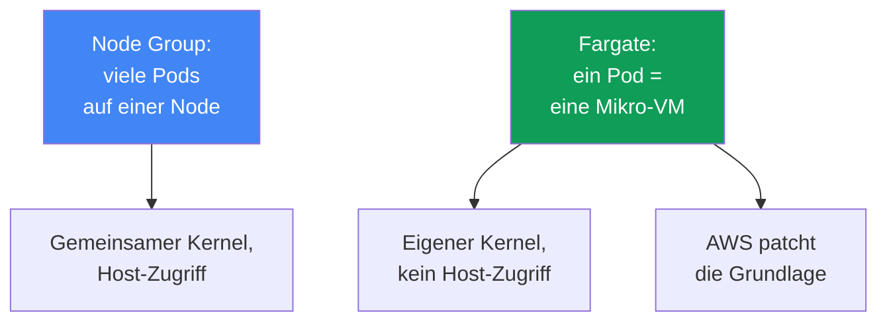
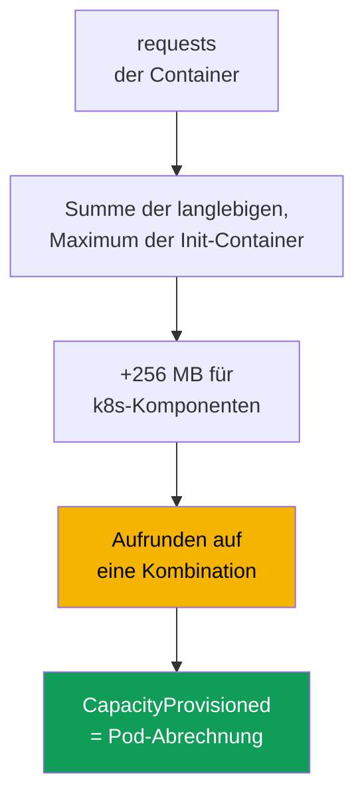

[Русская версия](ru.md) · [Eng version](en.md) · [Versión en español](es.md) · [Version française](fr.md) · [ქართული ვერსია](ge.md) · [繁體中文版](tw.md) · [日本語版](jp.md)
# Kapitel 15. Fargate: Profile, Einschränkungen, Kosten und Einsatzszenarien

> **Wie geht es weiter?** Vier Compute-Typen und der Platz von Fargate unter ihnen stehen in Kapitel 9
> im Überblick. Hier geht es konkret darum: wie ein Pod über ein Profil auf Fargate gelangt, wie Ressourcen
> zugewiesen werden, welche Einschränkungen fest verankert sind und was das kostet. Das Sizing von
> Requests und Limits behandelt Kapitel 14, der Zugriff von Pods auf AWS über pod execution role und
> IRSA/Pod Identity die Kapitel 16-17, EFS für persistenten Speicher Kapitel 24, Load Balancer und
> target-type `ip` die Kapitel 26-27, Logs und Observability die Kapitel 33-34. Auto Mode als separater
> Modus steht in Kapitel 9.

## 15.1. „Fargate gewählt, weil keine Nodes, und dann an eine Wand gestoßen“

Ein Team wählt Fargate aus einem einfachen Wunsch heraus: Es möchte keine Nodes verwalten. Der Cluster
ist erstellt, die Pods laufen, der Betrieb wirkt nahezu schwerelos. Dann tauchen nacheinander
Einschränkungen auf, die erst spät bekannt werden, wenn die Last bereits in Produktion ist:

- Die Sicherheit verlangt, einen Runtime-Agent als DaemonSet zu installieren: Auf Fargate werden
  **DaemonSets nicht unterstützt**, der Agent kann nirgends installiert werden, nur als Sidecar in
  jeden Pod.
- Ein privilegierter Container wird für ein Netzwerk- oder Systemwerkzeug benötigt: **privileged ist
  auf Fargate verboten**, der Pod startet nicht.
- Ein Pod mit 1 vCPU wurde bestellt, doch in `kubectl describe` erscheinen 2 vCPU: Fargate hat den
  Request auf die nächste zulässige Kombination **aufgerundet**, und dafür zahlen Sie.
- Eine GPU-Last kommt hinzu: Auf Fargate gibt es **keine GPUs**, der Pod kann nirgends platziert werden.
- Logs wurden bisher per Fluent-Bit-DaemonSet gesammelt: Auch das gibt es nicht, das Logging funktioniert
  anders.

Keines dieser Probleme ist am ersten Tag sichtbar. Sie alle folgen daraus, dass Fargate die Nodes
wegnimmt, dafür aber **starre Grenzen setzt**. Das ist ein fairer Tausch: Sie geben die Flexibilität
einer Node ab und erhalten eine Grundlage, die AWS selbst patcht und betreibt. Dieses Kapitel behandelt
die Grenzen konkret, damit eine Entscheidung für Fargate mit Kenntnis der Grenzen fällt und nicht aus
dem Reflex „keine Nodes bedeutet einfacher“.

## 15.2. Was Fargate konkret ist

Auf Fargate läuft ein Pod in einer dedizierten **Mikro-VM**: mit eigenem Kernel, eigenen CPUs und
Speicher sowie einer eigenen Netzwerkschnittstelle, die mit keinem anderen Pod geteilt werden. Gemeinsame
Nodes wie in einer Node Group gibt es hier nicht: **ein Pod entspricht einer VM**. Es gibt keinen
Host-Zugriff, weil ein Host in Ihrem Verständnis nicht existiert: Der Pod ist die gesamte sichtbare Einheit.

Praktische Folgen dieses Modells:

- **Isolation pro Pod.** Ein Container-Ausbruch gewährt keinen Zugriff auf Ressourcen anderer Pods:
  Die Grenze verläuft an der VM, nicht am Kernel-Namespace. Das ist Defense-in-Depth zusätzlich zur
  üblichen Container-Isolation.
- **AWS betreibt die Grundlage.** Patches für Betriebssystem und Kernel der Mikro-VM sowie Updates der
  Laufzeitumgebung liegen bei AWS. EKS patcht Fargate-Pods regelmäßig und kann sie neu erstellen
  (siehe 15.5).
- **Sie beschreiben nur den Pod.** Keine Wahl eines Instance-Typs, kein ASG, Launch Template, `max-pods`
  oder Bootstrap. Die Pod-Spezifikation ist Ihre gesamte Eingabe.

Die Kehrseite dieser Einfachheit ist ein fester Funktionsumfang: Was eine Node oder Zugriff auf den Host
verlangt, ist auf Fargate grundsätzlich nicht verfügbar (Abschnitt 15.5).



## 15.3. Fargate-Profile: Wie ein Pod auf Fargate gelangt

Ein Pod „weiß“ nicht selbst, dass er auf Fargate läuft. Die Entscheidung trifft ein **Fargate-Profil**,
ein Objekt auf Cluster-Ebene, das beschreibt, welche Pods auf Fargate ausgeführt werden. Das Matching
läuft über **Selektoren**: Jeder Selektor enthält zwingend einen `namespace` und optional `labels`. Ist
ein Selektor nur mit Namespace und ohne Labels angegeben, gelangen **alle** Pods dieses Namespace auf
Fargate.

Regeln des Profils, anhand der Dokumentation geprüft:

- Ein Profil hat bis zu **fünf Selektoren**, jeder muss einen Namespace angeben.
- Ein Pod gelangt auf Fargate, wenn er mit **mindestens einem** Selektor des Profils übereinstimmt.
- Passt ein Pod zu mehreren Profilen, wird das konkrete Profil über das Pod-Label
  `eks.amazonaws.com/fargate-profile: <Profilname>` ausgewählt.
- Ein Profil kann nach der Erstellung **nicht geändert** werden: Für Änderungen wird ein neues erstellt
  und das alte gelöscht.
- Beim Löschen eines Profils werden dessen Pods gestoppt und wechseln in `Pending`.
- Nur **private Subnetze** (ohne direkte Route zu einem Internet Gateway): Fargate-Pods erhalten keine
  öffentlichen IPs.

Innerhalb von EKS läuft ein separater Scheduler, der **fargate-scheduler**, neben dem regulären
kube-scheduler sowie eine Reihe mutierender und validierender Admission Controller. Wenn ein Pod zu einem
Profil passt, erkennen diese Controller ihn und leiten ihn zu Fargate. Beim Erstellen eines Profils ist eine
**pod execution role** erforderlich, über die sich das `kubelet` auf der Grundlage beim Cluster registriert
und Images aus ECR zieht (Details zum AWS-Zugriff von Pods stehen in Kapitel 16-17). Affinity- und
Anti-Affinity-Regeln für Fargate-Pods gelten nicht, und `topologySpreadConstraints` unterstützt Fargate
noch nicht.

```bash
# Profil erstellen: Pods aus dem Namespace batch und Helm-Releases mit Label gehen auf Fargate
aws eks create-fargate-profile --cluster-name demo --fargate-profile-name batch \
  --pod-execution-role-arn arn:aws:iam::111122223333:role/eksFargatePodRole \
  --subnets subnet-0abc subnet-0def \
  --selectors namespace=batch namespace=jobs,labels={compute=fargate}
aws eks list-fargate-profiles --cluster-name demo
aws eks describe-fargate-profile --cluster-name demo --fargate-profile-name batch
```

Dasselbe Profil in deklarativer Form (beispielsweise über `eksctl` oder Terraform):

```yaml
fargateProfiles:
  - name: batch
    podExecutionRoleARN: arn:aws:iam::111122223333:role/eksFargatePodRole
    subnets: [subnet-0abc, subnet-0def]   # nur private
    selectors:
      - namespace: batch                  # gesamter Namespace
      - namespace: jobs
        labels:
          compute: fargate                # nur Pods mit diesem Label
```

## 15.4. Wie Ressourcen zugewiesen werden

Fargate bietet keine beliebige Pod-Größe. Es bildet die Summe der `requests` der Container und **rundet
sie auf** die nächstgrößere zulässige Kombination aus vCPU und Speicher in einem festen Satz. Die
Berechnungslogik laut Dokumentation:

- Die `requests` aller langlebigen Container werden **addiert**.
- Für Init-Container wird das **Maximum** eines einzelnen Containers genommen.
- Aus diesen beiden Werten wird der **größere** gewählt. Er wird zum Pod-Request.
- Zum Speicher kommen **256 MB** für Kubernetes-Komponenten hinzu (`kubelet`, `kube-proxy`,
  `containerd`).
- Wenn vCPU und Speicher überhaupt nicht festgelegt sind, wird die **kleinste** Kombination
  `.25 vCPU / 0.5 GB` verwendet.

Da Fargate **einen Pod pro VM** startet, laufen alle Pods mit QoS `Guaranteed`: Für alle Container müssen
`requests` den `limits` entsprechen. Requests bewusst zu setzen ist entscheidend: Zu niedrig angesetzt,
stößt der Pod an das Limit; zu hoch angesetzt oder ungünstig zwischen Stufen gelandet, zahlen Sie den
Aufpreis für die Rundung. Das klassische Beispiel: Ein Request von `1 vCPU / 8 GB` passt nach dem
Hinzufügen von 256 MB nicht in die Kombination `1 vCPU / 8 GB` und wird als `2 vCPU / 9 GB`
provisioniert. Die tatsächlich zugewiesene Kapazität steht in der Annotation `CapacityProvisioned` des Pods.

| vCPU | Verfügbarer Speicher |
|---|---|
| .25 vCPU | 0.5 GB, 1 GB, 2 GB |
| .5 vCPU | 1 GB, 2 GB, 3 GB, 4 GB |
| 1 vCPU | 2 GB bis 8 GB, in 1-GB-Schritten |
| 2 vCPU | 4 GB bis 16 GB, in 1-GB-Schritten |
| 4 vCPU | 8 GB bis 30 GB, in 1-GB-Schritten |
| 8 vCPU | 16 GB bis 60 GB, in 4-GB-Schritten |
| 16 vCPU | 32 GB bis 120 GB, in 8-GB-Schritten |

Die Größe, die `kubectl get nodes` für eine Fargate-Node anzeigt, steht **in keinem Zusammenhang** mit
der Pod-Kapazität und ist gewöhnlich größer. Die echte Kapazität prüfen Sie mit `kubectl describe pod`
anhand der Annotation `CapacityProvisioned`, nicht anhand der Node-Zeile.



## 15.5. Konkrete Einschränkungen

Die Fargate-Einschränkungen sind strikt und in der Dokumentation geprüft. Die Tabelle eignet sich als
Checkliste: „Läuft die Last auf Fargate oder nicht?“

| Einschränkung | Was genau nicht möglich ist | Umgehung |
|---|---|---|
| DaemonSet | Node-Agenten laufen nicht als DaemonSet | Sidecar in jeden Pod |
| privileged | privilegierte Container sind verboten | Bedarf überdenken |
| HostNetwork / HostPort | kann nicht in der Pod-Spezifikation angegeben werden | regulärer Service |
| HostPath | kein Zugriff auf das Dateisystem des Hosts | ephemeres Volume oder EFS |
| GPU | GPUs sind auf Fargate nicht verfügbar | Node Group mit GPU |
| Storage | nur ephemeres Volume und EFS | EBS wird nicht eingebunden |
| Ephemerer Speicher | standardmäßig 20 GiB, maximal 175 GiB | `ephemeral-storage` in Requests |
| Load Balancer | nur target-type `ip` | entsprechend konfigurieren (Kapitel 26-27) |
| IMDS | EC2-Metadaten sind für Pods nicht verfügbar | IRSA / Pod Identity (Kapitel 16-17) |
| Node-Zugriff | weder SSH noch Host-Zugriff | Debugging innerhalb des Pods |
| Sonstiges | kein Fargate Spot, EBS, alternatives CNI, Outposts/Local Zones | Node Group |

Einige Punkte verdienen nähere Erläuterung. **Ephemerer Speicher**: Jeder Pod erhält standardmäßig 20 GiB,
wobei der nutzbare Umfang etwas unter 20 GiB liegt (einen Teil belegen `kubelet` und Module im Pod).
Er lässt sich über `requests` für `ephemeral-storage` auf **175 GiB** erhöhen. Fargate provisioniert dabei
mit Reserve (ein Request von 100 GiB ergibt eine Aufgabe mit 115 GiB). Der Speicher wird standardmäßig
verschlüsselt und zusammen mit dem Pod gelöscht. **Persistenter Speicher** ist nur EFS mit statischem
Provisioning; er wird ohne die Installation eines Treibers per DaemonSet automatisch eingebunden
(Details in Kapitel 24). **Netzwerk**: Auf Fargate läuft VPC CNI und kann nicht ersetzt werden; NLB und
ALB funktionieren nur mit target-type `ip` (Kapitel 26-27). **Patching**: EKS patcht Fargate-Pods
regelmäßig und kann einen Pod löschen, falls er nicht sanft verdrängt werden kann. Schützen Sie sich mit
PDB und einem korrekten graceful shutdown (Kapitel 40).

Die Erweiterung des ephemeren Speichers wird direkt über `ephemeral-storage` in Requests und Limits in
der Pod-Spezifikation festgelegt (sie sind gleich, der Pod ist `Guaranteed`); die übrigen vCPU- und
Speicherstufen ändern sich dadurch nicht:

```yaml
resources:
  requests:
    cpu: "1"
    memory: 2Gi
    ephemeral-storage: 100Gi   # bis 175Gi, Fargate provisioniert mit Reserve
  limits:
    cpu: "1"
    memory: 2Gi
    ephemeral-storage: 100Gi   # requests = limits
```

## 15.6. Kosten

Das Fargate-Abrechnungsmodell unterscheidet sich grundsätzlich von Nodes. Für eine Node Group zahlen Sie
für die gesamte **Instance**, unabhängig davon, wie stark sie mit Pods ausgelastet ist. Bei Fargate
zahlen Sie für die **vCPU und den Speicher, die dem Pod selbst zugewiesen sind**, für seine Lebensdauer,
sekundengenau mit einem Mindestintervall. Der Preis wird nicht vom Request bestimmt, sondern von der
**aufgerundeten** Kombination aus der Annotation `CapacityProvisioned`.

| Aspekt | Node Group | Fargate |
|---|---|---|
| Abrechnungseinheit | gesamte EC2-Instance | vCPU und Speicher des Pods |
| Zahlung bei Leerlauf | ja, auch für eine leere Node | nein, nur für einen laufenden Pod |
| Overhead für Packing | Sie packen Pods selbst | Packing ist nicht Ihre Aufgabe |
| Preis pro Ressourceneinheit | niedriger | höher |
| Rundung | nein | aufwärts zur Kombination |
| Spot-Rabatt | ja | nein, Fargate Spot wird in EKS nicht unterstützt |

Die wirtschaftliche Schlussfolgerung ohne Zahlen: Fargate ist pro Ressourceneinheit **teurer** als eine
Node, aber Sie zahlen nicht für ungenutzte Node-Kapazität und investieren keine Arbeit ins Packing. Bei
**unbeständiger** Last (Jobs, seltene Services) ist das oft günstiger: Keine Nodes stehen zwischen Spitzen
ungenutzt herum. Bei **stabiler großer** Last rund um die Uhr sind Nodes gewöhnlich günstiger: Die
Ressource ist billiger und es gibt kaum Leerlauf. Strukturell bestimmt die Auslastung das Verhältnis:
Je niedriger die durchschnittliche Nutzung (verstreute, periodische, seltene Aufgaben), desto günstiger
ist Fargate; bei Auslastung nahe 100 % rund um die Uhr ist Fargate um ein Vielfaches teurer als Nodes,
weil sich der Aufpreis pro Ressourceneinheit mit der dauerhaft belegten Kapazität multipliziert. Eine
besondere Falle sind abgeschlossene Jobs: Deren Pods bleiben bestehen und verursachen auf Fargate weiter
Kosten, daher setzen Sie `ttlSecondsAfterFinished`. Eine detaillierte Kostenanalyse steht in Kapitel 43.

## 15.7. Wo Fargate sinnvoll ist und wo nicht

Fargate ist ein Werkzeug für bestimmte Aufgaben, kein vollumfänglicher Ersatz für Nodes. Im Folgenden
steht, wann es passt und wann nicht.

| Sinnvoll | Nicht sinnvoll |
|---|---|
| isolierte und nicht vertrauenswürdige Lasten | DaemonSet-Agenten erforderlich (Sicherheit, Logs) |
| Stapel von Jobs/Batch mit unbeständiger Last | GPU-Lasten |
| kleine Services ohne Wunsch nach Node-Betrieb | Privilegien oder Node-Zugriff erforderlich |
| System-Pods in einem separaten Namespace | hohe Dichte kleiner Pods (teuer) |
| schneller Cluster-Start ohne Node Group | stabile große Last rund um die Uhr |

Die Logik ist einfach. **Sinnvoll** ist Fargate, wenn Isolation pro Pod wertvoll ist (die Mikro-VM bietet
eine Grenze bei einem Container-Ausbruch), wenn die Last elastisch ist und keine ungenutzten Nodes
vorgehalten werden sollen, wenn der Service klein ist und sich die Node-Verwaltung nicht lohnt, und wenn
der Cluster schnell ohne Aufwand mit einer Node Group bereitstehen soll. **Nicht sinnvoll** ist es, wenn
auch nur einer der verbotenen Mechanismen aus 15.5 benötigt wird (DaemonSet, GPU, Privilegien,
Host-Zugriff) oder wenn die Wirtschaftlichkeit gegen Fargate spricht: viele kleine Pods, bei denen Rundung
und Aufpreis pro Einheit die Rechnung treiben, oder gleichmäßige 24/7-Last, bei der Nodes günstiger sind.

## 15.8. Logs und Observability auf Fargate

Das gewohnte Sammeln von Logs über ein Fluent-Bit-DaemonSet **funktioniert auf Fargate nicht**, denn hier
gibt es keine DaemonSets. Stattdessen bietet Fargate einen **integrierten Logging-Mechanismus**: Sie
aktivieren Fluent Bit über den standardmäßigen Fargate Log Router, konfigurieren ihn mit der ConfigMap
`aws-logging` im Namespace `aws-observability`, und Logs gehen ohne einen im Cluster installierten Agenten
an CloudWatch Logs oder einen anderen Empfänger. Details zur Konfiguration und Kostenkontrolle für Logs
stehen in Kapitel 34.

Der Mechanismus arbeitet unauffällig: Ist er falsch konfiguriert, funktionieren die Pods, aber es gibt
keine Logs, keine Fehlermeldung und kein Ereignis. Drei Ursachen sollten Sie prüfen, bevor Sie das Problem
in der Anwendung suchen.

- **Berechtigungen an der falschen Rolle.** Der Log Router schreibt mit der **pod execution role** des
  Profils zum Empfänger, nicht mit der Pod-Rolle aus IRSA oder Pod Identity. Für CloudWatch erhält diese
  Rolle eine Policy mit `logs:CreateLogGroup`, `logs:CreateLogStream`, `logs:DescribeLogStreams` und
  `logs:PutLogEvents`; ohne sie werden Logs stillschweigend verworfen. Dies ist genau der Fall, in dem die
  Rolle der Anwendung perfekt eingerichtet ist und mit den Logs nichts zu tun hat (Kapitel 16 und 17).
- **Kein Label am Namespace.** Der Namespace muss `aws-observability` heißen und das Label
  `aws-observability: enabled` tragen; ohne dieses Label wird die Konfiguration nicht übernommen.
- **Kein Netzwerkpfad zum Empfänger.** Fargate-Pods befinden sich nur in privaten Subnetzen, daher
  benötigt CloudWatch Logs entweder eine Route über NAT oder einen Interface Endpoint (Kapitel 0.3 und 31).

Metriken von Fargate-Pods werden mit den üblichen Methoden gesammelt (Container Insights, Prometheus),
mit der Einschränkung, dass auch Node-Exporter nicht per DaemonSet vorhanden sind: Was üblicherweise auf
der Node lebt, ist auf Fargate entweder integriert oder wird auf Pod-Ebene gesammelt. Die Analyse der
Metriken steht in Kapitel 33.

## 15.9. Fargate mit Nodes kombinieren

Fargate und Nodes laufen im selben Cluster und teilen sich die Control Plane. Eine typische Aufteilung
trennt sie **nach Namespace**: Einige Namespaces werden von einem Fargate-Profil angezogen, andere laufen
auf einer Node Group oder im Auto Mode. Ein Fargate-Profil matcht nach Namespace und Labels, daher verläuft
die Grenze genau dort und nicht über Taints (Taints und Tolerations gelten für Nodes).

Ein häufiges Muster: **System-Komponenten** (CoreDNS, Controller, Monitoring) verbleiben auf
vorhersehbaren Nodes, während **isolierte oder Batch-Lasten** in einem getrennten Namespace an Fargate
übergeben werden. Eine weitere Variante ist ein vollständig „nodeloser“ Start: Solange es wenige
Anwendungen gibt, läuft alles auf Fargate; mit dem Wachstum wird eine Node Group für das ergänzt, was
Fargate schlecht trägt (GPU, dichte kleine Pods, stabile Last). `-o wide` hilft zu prüfen, was wo gelandet
ist: Fargate-Pods stehen auf „Nodes“ mit Namen wie `fargate-ip-...`.

```bash
kubectl get pods -n batch -o wide      # NODE bei Fargate-Pods: fargate-ip-10-0-...
kubectl describe pod -n batch <pod>    # Annotation CapacityProvisioned ansehen
```

Wenn ein vollständig nodeloser Cluster benötigt wird, wird auch CoreDNS auf Fargate verschoben. Standardmäßig
hält die Annotation `eks.amazonaws.com/compute-type: ec2` dessen Pods auf EC2; die Verschiebung geschieht
in drei Schritten: ein Profil für `kube-system` mit einem Selektor für das CoreDNS-Label erstellen, die
Annotation entfernen und die Pods neu erstellen.

```bash
# 1. kube-system-Profil mit Selektor für CoreDNS (Label k8s-app=kube-dns)
aws eks create-fargate-profile --cluster-name demo \
  --fargate-profile-name fp-kube-system \
  --pod-execution-role-arn arn:aws:iam::111122223333:role/eksFargatePodRole \
  --subnets subnet-0abc subnet-0def \
  --selectors namespace=kube-system,labels={k8s-app=kube-dns}
# 2. Annotation entfernen, die CoreDNS auf EC2 hält
kubectl patch deployment coredns -n kube-system --type json \
  -p '[{"op":"remove","path":"/spec/template/metadata/annotations/eks.amazonaws.com~1compute-type"}]'
# 3. Pods neu erstellen: Sie wechseln zu Fargate
kubectl rollout restart deployment coredns -n kube-system
```

## 15.10. Anwendung in Produktion

- **Profil-Selektoren bleiben eng**: Namespace plus Label statt „ganzer Namespace“, damit nicht unnötige
  Pods auf Fargate wechseln und die Rechnung unbemerkt steigt.
- **Requests werden bewusst gesetzt und entsprechen Limits**: Ein Fargate-Pod ist immer `Guaranteed`, und
  Aufrunden bedeutet, dass ein Fehler zwischen den Stufen bezahlt wird.
- **Jobs erhalten `ttlSecondsAfterFinished`**: Abgeschlossene Pods auf Fargate verursachen weiter Kosten,
  bis sie entfernt werden.
- **Logs werden über den integrierten Fargate Log Router** (ConfigMap `aws-logging`) eingerichtet, statt
  ein DaemonSet anzuhängen, das es hier nicht gibt.
- **Die Checkliste der Einschränkungen aus 15.5 wird vor der Migration geprüft**: Wird ein DaemonSet, GPU,
  Privilegien oder Node-Zugriff benötigt, geht die Last auf eine Node Group und nicht auf Fargate.
- **Fargate und Nodes werden nach Namespace getrennt**, und System-Komponenten bleiben auf vorhersehbaren
  Nodes.

## 15.11. Mini-Glossar

- **Fargate-Profil**: Ein Objekt auf Cluster-Ebene mit Selektoren (Namespace plus optionale `labels`),
  pod execution role und privaten Subnetzen; es bestimmt, welche Pods auf Fargate gehen. Es kann nicht
  geändert, nur neu erstellt werden.
- **Pod execution role**: IAM-Rolle, mit der sich das `kubelet` auf der Fargate-Grundlage beim Cluster
  registriert und Images aus ECR zieht; sie wird beim Erstellen des Profils gesetzt. Der integrierte Log
  Router schreibt mit derselben Rolle Logs an den Empfänger, daher benötigt genau sie die Schreibrechte.
- **fargate-scheduler**: EKS-Scheduler, der neben kube-scheduler arbeitet und Pods, die zu einem Profil
  passen, zu Fargate leitet.
- **CapacityProvisioned**: Pod-Annotation mit der nach dem Aufrunden tatsächlich zugewiesenen Kombination
  aus vCPU und Speicher; sie bestimmt die Kosten.
- **Mikro-VM**: Dedizierte virtuelle Maschine für einen Pod mit eigenem Kernel, CPU, Speicher und
  Netzwerkschnittstelle; die Isolationsgrenze von Fargate.

## 15.12. Zusammenfassung des Kapitels

- Auf Fargate entspricht ein Pod einer eigenen Mikro-VM: eigener Kernel, eigene Ressourcen, kein
  Host-Zugriff, AWS patcht die Grundlage selbst. Sie beschreiben nur den Pod.
- Ein Pod gelangt über ein Profil auf Fargate: Namespace-Selektoren plus Labels (bis zu fünf), pod execution
  role und nur private Subnetze; das Profil ist unveränderlich, und fargate-scheduler arbeitet.
- Ressourcen werden auf eine feste Kombination aus vCPU und Speicher aufgerundet, zuzüglich 256 MB für
  Kubernetes-Komponenten; Pods sind immer `Guaranteed`, Requests entsprechen Limits.
- Die Einschränkungen sind strikt: kein DaemonSet, privileged, HostNetwork/HostPort/HostPath, GPU, EBS,
  Fargate Spot oder Node-Zugriff; Storage ist nur ephemer (standardmäßig 20 GiB, bis 175 GiB) und EFS;
  Load Balancer verwenden nur target-type `ip`.
- Die Kosten gelten für vCPU und Speicher eines Pods während seiner Lebensdauer, sekundengenau und nach
  der aufgerundeten Kombination; pro Einheit teurer als Nodes, aber ohne Zahlung für Leerlauf; bei
  24/7-Last sind Nodes gewöhnlich günstiger.
- Fargate eignet sich für Isolation, Batch- und kleine Lasten sowie einen schnellen Start; es eignet sich
  nicht für DaemonSet, GPU, Privilegien, Host-Zugriff, hohe Dichte oder stabile große Last.
- Logs laufen über den integrierten Fargate Log Router und nicht über DaemonSet; Fargate und Nodes werden
  nach Namespace getrennt.

## 15.13. Nutzen in der täglichen Arbeit

Die Entscheidung für Fargate ist die Wahl von Grenzen, noch bevor die Last in Produktion geht. Wenn Sie
die Checkliste der Einschränkungen früh durchgehen, beantworten Sie die Fragen „Wird ein DaemonSet-Agent
benötigt?“, „Wird es GPU geben?“, „Ist Node-Zugriff erforderlich?“ und „Was kostet die Rundung?“ im
Voraus, statt erst dann, wenn die Sicherheit einen Agenten verlangt, der nirgends installiert werden kann.
Im Bereitschaftsdienst setzt das Wissen, dass ein Pod auf Fargate läuft, sofort die Grenzen des Debuggings:
Sie können sich nicht auf die Node anmelden, es gibt keinen Node-Exporter, Kapazität wird anhand der
Annotation und nicht anhand der Node-Zeile geprüft. Bei der Kostenplanung hilft das Wissen, dass Fargate
pro Pod abrechnet und aufrundet, damit die Rechnung für einen Stapel kleiner Pods nicht überrascht, von
denen jeder einzeln auf seine Stufe aufgerundet wurde.

## 15.14. Fragen zur Selbstkontrolle

1. Warum entspricht ein Pod auf Fargate einer Mikro-VM, und was bringt das für die Isolation?
2. Wie gelangt ein Pod auf Fargate, und was muss ein Profil-Selektor zwingend enthalten?
3. Wozu benötigt ein Profil eine pod execution role, und warum kann ein Profil nicht geändert werden?
4. Warum benötigen Fargate-Pods ausschließlich private Subnetze?
5. Wie berechnet und rundet Fargate angeforderte vCPU und Speicher, und welche Rolle spielen 256 MB?
6. Warum sind auf Fargate alle Pods `Guaranteed`, und was bedeutet das für Requests und Limits?
7. Wo sehen Sie die tatsächlich zugewiesene Pod-Kapazität, und warum nicht in der Node-Zeile?
8. Nennen Sie fünf Fargate-Einschränkungen und, sofern vorhanden, jeweils eine Umgehung.
9. Wie groß ist der ephemere Speicher standardmäßig, und bis zu welchem Wert kann er erhöht werden?
10. Wie unterscheidet sich das Fargate-Abrechnungsmodell von einer Node Group, und wann sind Nodes günstiger?
11. In welchen Szenarien ist Fargate sinnvoll und wann eindeutig nicht?
12. Wie funktioniert das Sammeln von Logs auf Fargate, wenn DaemonSet nicht unterstützt wird?
13. Wie lassen sich Fargate und Nodes in einem Cluster trennen, und wie prüfen Sie, was wo gelandet ist?

## Praxis

Das Kurs-Lab zu diesem Thema: [Lab 112: Fargate-Profile: Was funktioniert, was bricht, Kostenvergleich](../../labs/112/README_DE.MD).
Zusätzlich dazu sind Profile und Fargate-Verhalten in einem laufenden Cluster sichtbar. Beginnen Sie mit
der Bestandsaufnahme: `aws eks list-fargate-profiles --cluster-name <cluster>` zeigt die Profile, und
`aws eks describe-fargate-profile --cluster-name <cluster> --fargate-profile-name <name>` zeigt
Namespace- und Label-Selektoren, Subnetze und pod execution role. Prüfen Sie, dass die Subnetze privat
und die Selektoren eng sind.

Sehen Sie sich anschließend die Pods an: `kubectl get pods -A -o wide` zeigt Fargate-Pods auf „Nodes“ mit
Namen `fargate-ip-...`, und `kubectl describe pod <pod>` in ihrem Namespace liefert die Annotation
`CapacityProvisioned`. Vergleichen Sie sie mit den angeforderten Requests und prüfen Sie, was die Rundung
gekostet hat. Gehen Sie die Checkliste der Einschränkungen aus 15.5 für Ihre Last durch: Ist ein DaemonSet,
GPU, Privilegien oder Node-Zugriff nötig? Entscheiden Sie dann ehrlich, welche Namespaces sinnvoll an
Fargate gehen und welche auf Nodes bleiben sollten.

---
[Inhaltsverzeichnis](../README_DE.md) · [Kapitel 14](../14/de.md) · [Kapitel 16](../16/de.md)