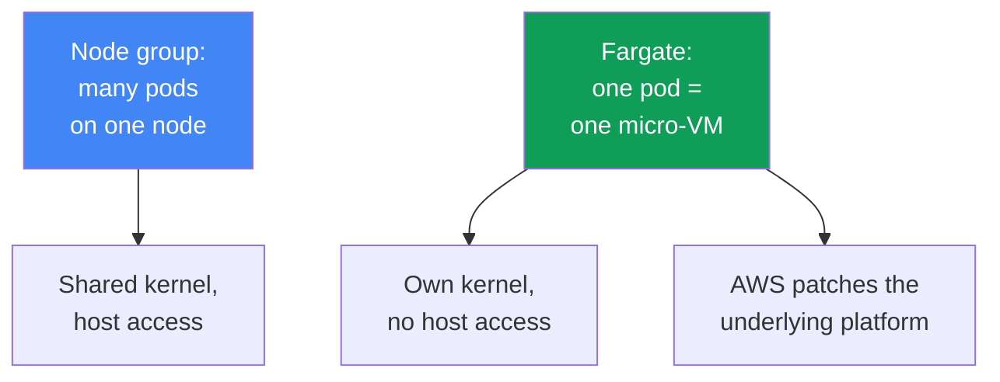
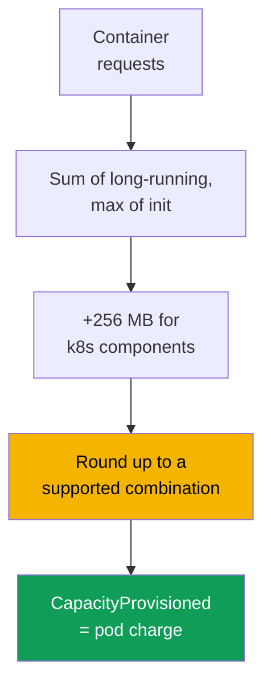

[Русская версия](ru.md) · [Versión en español](es.md) · [Version française](fr.md) · [Deutsche Version](de.md) · [ქართული ვერსია](ge.md) · [繁體中文版](tw.md) · [日本語版](jp.md)
# Chapter 15. Fargate: profiles, limitations, cost, and use cases

> **What comes next.** The four compute types and Fargate's place among them are covered at a
> high level in chapter 9. This chapter gets specific: how a pod lands on Fargate through a
> profile, how resources are allocated, which limitations are hard-coded, and what it costs.
> Sizing requests and limits is in chapter 14; pod access to AWS through the pod execution role
> and IRSA/Pod Identity is in chapters 16-17; EFS for persistent storage is in chapter 24;
> load balancers and target type `ip` are in chapters 26-27; logging and observability are in
> chapters 33-34. Auto Mode as a separate mode is in chapter 9.

## 15.1. "We chose Fargate to avoid nodes, then hit a wall"

A team chooses Fargate for a simple reason: they do not want to manage nodes. The cluster is up,
pods are running, and operations seem effortless. Then, one by one, limitations surface that they
learn about too late, after the workload is already in production:

- security requires deploying a runtime agent as a DaemonSet: **DaemonSet is not supported** on
  Fargate, there is nowhere to deploy the agent except as a sidecar in every pod;
- a privileged container is needed for a network or system tool: **privileged is prohibited on
  Fargate**, so the pod does not start;
- a pod was requested with 1 vCPU, but `kubectl describe` shows 2 vCPU: Fargate **rounded** the
  request up to the nearest supported combination, and that is what you pay for;
- a GPU workload arrives: there is **no GPU on Fargate**, so there is nowhere to schedule the pod;
- logs used to be collected by a Fluent Bit DaemonSet: that is unavailable too, so logging works
  differently.

None of these problems is visible on day one. They all follow from the fact that Fargate removes
nodes but **imposes strict boundaries in return**. It is an honest trade: you give up node
flexibility and receive an underlying platform that AWS patches and operates itself. This chapter
examines those boundaries specifically, so that a Fargate decision is made with knowledge of its
limits rather than from the assumption that "no nodes means simpler."

## 15.2. What Fargate actually is

On Fargate, a pod runs in a dedicated **micro-VM**: it has its own kernel, CPU and memory, and
network interface, none of which are shared with another pod. There are no shared nodes as there
are in a node group: **one pod equals one VM**. There is no host access because there is no host in
the sense you know it: the pod is the entire visible unit.

Practical consequences of this model:

- **Per-pod isolation.** Escaping from a container does not grant access to resources of other
  pods: the boundary is the VM, not a kernel namespace. This is defense in depth on top of normal
  container isolation.
- **AWS operates the underlying platform.** OS and micro-VM kernel patches and runtime updates are
  handled by AWS. EKS periodically patches Fargate pods and may recreate them (see 15.5).
- **You describe only the pod.** There is no instance type, ASG, launch template, `max-pods`, or
  bootstrap to choose. The pod spec is your entire input.

The other side of this simplicity is a fixed feature set: anything requiring a node or host access
is fundamentally unavailable on Fargate (section 15.5).



## 15.3. Fargate profiles: how a pod lands on Fargate

A pod does not itself "know" that it is on Fargate. The decision is made by a **Fargate profile**,
a cluster-level object that describes which pods run on Fargate. Matching uses **selectors**: every
selector must contain a `namespace` and may optionally contain `labels`. If a selector specifies
only a namespace with no labels, **all** pods in that namespace go to Fargate.

Profile rules, verified against the documentation:

- a profile can contain up to **five selectors**, and each must specify a namespace;
- a pod lands on Fargate if it matches **at least one** profile selector;
- if a pod matches multiple profiles, choose one explicitly with the pod label
  `eks.amazonaws.com/fargate-profile: <profile-name>`;
- a profile **cannot be changed** after it is created: create a new one and remove the old one to
  make a change;
- when a profile is deleted, its pods stop and move to `Pending`;
- only **private subnets** (without a direct route to an Internet Gateway) are allowed: Fargate
  pods are not assigned public IP addresses.

EKS runs a separate **fargate-scheduler** alongside the standard kube-scheduler, plus a set of
mutating and validating admission controllers. When a pod matches a profile, those controllers
recognize it and direct it to Fargate. Creating a profile requires a **pod execution role**, the
role with which the `kubelet` on the underlying platform registers with the cluster and pulls
images from ECR (details of pod access to AWS are in chapters 16-17). Affinity and anti-affinity
rules are not applied to Fargate pods, and Fargate does not yet support
`topologySpreadConstraints`.

```bash
# Create a profile: pods in the batch namespace and Helm releases with a label go to Fargate
aws eks create-fargate-profile --cluster-name demo --fargate-profile-name batch \
  --pod-execution-role-arn arn:aws:iam::111122223333:role/eksFargatePodRole \
  --subnets subnet-0abc subnet-0def \
  --selectors namespace=batch namespace=jobs,labels={compute=fargate}
aws eks list-fargate-profiles --cluster-name demo
aws eks describe-fargate-profile --cluster-name demo --fargate-profile-name batch
```

The same profile in declarative form (for example, through `eksctl` or Terraform) looks like this:

```yaml
fargateProfiles:
  - name: batch
    podExecutionRoleARN: arn:aws:iam::111122223333:role/eksFargatePodRole
    subnets: [subnet-0abc, subnet-0def]   # private only
    selectors:
      - namespace: batch                  # entire namespace
      - namespace: jobs
        labels:
          compute: fargate                # only pods with this label
```

## 15.4. How resources are allocated

Fargate does not provide arbitrary pod sizes. It takes the sum of container `requests` and **rounds
it up** to the nearest supported vCPU and memory combination from a fixed set. According to the
documentation, the calculation is as follows:

- `requests` for all long-running containers are **summed**;
- for init containers, the **maximum** value of any one container is used;
- the **larger** of those two values is selected as the pod request;
- **256 MB** is added to memory for Kubernetes components (`kubelet`, `kube-proxy`,
  `containerd`);
- if neither vCPU nor memory is specified, the **minimum** combination of `.25 vCPU / 0.5 GB` is
  selected.

Because Fargate runs **one pod per VM**, all pods have the `Guaranteed` QoS class: `requests` must
equal `limits` for all containers. Setting requests deliberately is crucial: underestimate them
and the pod hits its limit; overestimate them or land awkwardly between tiers and you overpay for
rounding. A classic example: a `1 vCPU / 8 GB` request no longer fits the `1 vCPU / 8 GB`
combination after 256 MB is added, and is provisioned as `2 vCPU / 9 GB`. The actual allocated
capacity appears in the pod's `CapacityProvisioned` annotation.

| vCPU | Available memory |
|---|---|
| .25 vCPU | 0.5 GB, 1 GB, 2 GB |
| .5 vCPU | 1 GB, 2 GB, 3 GB, 4 GB |
| 1 vCPU | 2 GB to 8 GB, in 1 GB increments |
| 2 vCPU | 4 GB to 16 GB, in 1 GB increments |
| 4 vCPU | 8 GB to 30 GB, in 1 GB increments |
| 8 vCPU | 16 GB to 60 GB, in 4 GB increments |
| 16 vCPU | 32 GB to 120 GB, in 8 GB increments |

The size that `kubectl get nodes` shows for a Fargate node is **not related** to pod capacity and
is usually larger. View actual capacity through the `CapacityProvisioned` annotation in
`kubectl describe pod`, not from the node line.



## 15.5. The limitations in detail

Fargate limitations are strict and verified against the documentation. A table is the most useful
way to keep them: it is a checklist for whether a workload can run on Fargate.

| Limitation | What is unavailable | Workaround |
|---|---|---|
| DaemonSet | node agents cannot run as DaemonSets | sidecar in every pod |
| privileged | privileged containers are prohibited | reconsider the requirement |
| HostNetwork / HostPort | cannot be specified in a pod spec | regular Service |
| HostPath | no access to the host filesystem | ephemeral volume or EFS |
| GPU | GPUs are unavailable on Fargate | GPU node group |
| Storage | only ephemeral volumes and EFS | EBS cannot be mounted |
| Ephemeral disk | 20 GiB by default, 175 GiB maximum | `ephemeral-storage` in requests |
| Load balancers | only target type `ip` | configure it that way (chapters 26-27) |
| IMDS | EC2 metadata is unavailable to pods | IRSA / Pod Identity (chapters 16-17) |
| Node access | neither SSH nor host access | debug inside the pod |
| Other | no Fargate Spot, EBS, alternative CNI, Outposts/Local Zones | node group |

Several items deserve further explanation. **Ephemeral disk**: every pod receives 20 GiB by
default, though usable capacity is slightly less than 20 GiB (some is occupied by `kubelet` and
components inside the pod); it can be increased to **175 GiB** through `ephemeral-storage`
`requests`, with Fargate provisioning extra capacity (a 100 GiB request produces a task with 115
GiB). The disk is encrypted by default and deleted with the pod. **Persistent storage** is only
EFS, using static provisioning; it is mounted automatically without installing a driver as a
DaemonSet (details are in chapter 24). **Networking**: Fargate uses the VPC CNI and it cannot be
replaced; NLB and ALB work only with target type `ip` (chapters 26-27). **Patching**: EKS
periodically patches Fargate pods and, if a pod cannot be drained gracefully, may delete it;
protect against this with a PDB and correct graceful shutdown (chapter 40).

Extending ephemeral disk is specified directly in the pod spec through `ephemeral-storage` in
requests and limits (they are equal for a `Guaranteed` pod); the other vCPU and memory tiers do
not change:

```yaml
resources:
  requests:
    cpu: "1"
    memory: 2Gi
    ephemeral-storage: 100Gi   # up to 175Gi, Fargate provisions extra capacity
  limits:
    cpu: "1"
    memory: 2Gi
    ephemeral-storage: 100Gi   # requests = limits
```

## 15.6. Cost

The Fargate payment model differs fundamentally from nodes. For a node group, you pay for the
whole **instance**, regardless of how fully pods occupy it. With Fargate, you pay for the **vCPU
and memory allocated to the pod itself**, for its lifetime, per second subject to a minimum
duration. Price is determined not by the request, but by the **rounded** combination in the
`CapacityProvisioned` annotation.

| Aspect | Node group | Fargate |
|---|---|---|
| Billing unit | entire EC2 instance | pod vCPU and memory |
| Charge for idle capacity | yes, including an empty node | no, only for a running pod |
| Packing overhead | you pack pods yourself | packing is not your concern |
| Price per resource unit | lower | higher |
| Rounding | no | up to a supported combination |
| Spot discount | yes | no, Fargate Spot is not supported in EKS |

The economic conclusion without numbers: Fargate is **more expensive** per resource unit than a
node, but you do not pay for idle node capacity or spend effort packing pods. For **intermittent**
workloads (jobs, infrequent services), it is often more economical: no nodes sit idle between
peaks. For **steady, large** 24/7 workloads, nodes are usually cheaper: resources cost less and
there is almost no idle time. Structurally, the relationship is determined by utilization: the
lower the average utilization (sparse, periodic, infrequent tasks), the more favorable Fargate
becomes; when utilization is close to 100% around the clock, Fargate costs multiples of nodes,
because its per-resource premium is applied to continuously occupied capacity. A separate trap is
completed Jobs: their pods remain, and on Fargate that continues to accrue charges, so set
`ttlSecondsAfterFinished` on them. A detailed cost analysis is in chapter 43.

## 15.7. Where Fargate fits, and where it does not

Fargate is a tool for particular tasks, not a replacement for nodes everywhere. Below is where it
fits and where it does not.

| Fits | Does not fit |
|---|---|
| isolated and untrusted workloads | DaemonSet agents are required (security, logs) |
| batches of jobs with intermittent workloads | GPU workloads |
| small services without wanting to operate nodes | privileges or node access are required |
| system pods in a separate namespace | high density of small pods (expensive) |
| rapid cluster start without a node group | steady, large 24/7 workload |

The logic is simple. It **fits** when per-pod isolation is valuable (a micro-VM provides a
container-escape boundary), when the workload is elastic and you do not want to maintain idle
nodes, when the service is small and node management does not pay off, and when a cluster needs to
be started quickly without dealing with a node group. It **does not fit** when even one mechanism
prohibited in 15.5 is required (DaemonSet, GPU, privileges, host access), or when the economics
are against Fargate: many small pods where rounding and the per-unit premium raise the bill, or a
flat 24/7 workload where nodes cost less.

## 15.8. Logs and observability on Fargate

The usual Fluent Bit DaemonSet log collection pattern **does not work** on Fargate: there are no
DaemonSets. Instead, Fargate provides a **built-in logging mechanism**: enable Fluent Bit through
the standard Fargate log router, configure it in the `aws-logging` ConfigMap in the
`aws-observability` namespace, and logs go to CloudWatch Logs or another destination without
installing an agent in the cluster. Configuration details and log cost control are in chapter 34.

The mechanism is quiet: if configured incorrectly, pods run but there are simply no logs, errors,
or events. Check these three causes before looking for a problem in the application.

- **Permissions are on the wrong role.** The log router writes to its destination using the
  profile's **pod execution role**, not the pod role from IRSA or Pod Identity. For CloudWatch,
  attach a policy with `logs:CreateLogGroup`, `logs:CreateLogStream`, `logs:DescribeLogStreams`,
  and `logs:PutLogEvents` to that role; without it, logs are silently discarded. This is exactly
  the case where the application role is configured perfectly and has nothing to do with logs
  (chapters 16 and 17).
- **The namespace lacks a label.** The namespace must be called `aws-observability` and carry the
  label `aws-observability: enabled`; without the label, the configuration is not picked up.
- **There is no network path to the destination.** Fargate pods live only in private subnets, so
  CloudWatch Logs requires either a route through NAT or an interface endpoint (chapters 0.3 and
  31).

Fargate pod metrics are collected through the standard mechanisms (Container Insights,
Prometheus), with the caveat that node exporters also cannot run as DaemonSets: whatever normally
lives on a node is either built in on Fargate or collected at the pod level. Metrics are covered in
chapter 33.

## 15.9. Combining Fargate with nodes

Fargate and nodes coexist in one cluster and share the control plane. A typical layout separates
them **by namespace**: some namespaces are selected by a Fargate profile, while others go to a
node group or Auto Mode. A Fargate profile matches namespaces and labels, so that is where the
boundary lies, not at taints (taints and tolerations are for nodes).

A common pattern keeps **system components** (CoreDNS, controllers, monitoring) on predictable
nodes, while putting **isolated or batch workloads** on Fargate in a separate namespace. Another
option is a fully "nodeless" start: while there are few applications, everything is on Fargate;
as the workload grows, add a node group for what Fargate handles poorly (GPUs, dense small pods,
steady workloads). `-o wide` helps verify where things landed: Fargate pods are on "nodes" named
like `fargate-ip-...`.

```bash
kubectl get pods -n batch -o wide      # NODE for Fargate pods: fargate-ip-10-0-...
kubectl describe pod -n batch <pod>    # view the CapacityProvisioned annotation
```

If a completely nodeless cluster is needed, move CoreDNS to Fargate too. By default, its pods are
kept on EC2 by the `eks.amazonaws.com/compute-type: ec2` annotation; moving them takes three
steps: create a `kube-system` profile with a selector for the CoreDNS label, remove the annotation,
and recreate the pods.

```bash
# 1. kube-system profile with a selector for CoreDNS (label k8s-app=kube-dns)
aws eks create-fargate-profile --cluster-name demo \
  --fargate-profile-name fp-kube-system \
  --pod-execution-role-arn arn:aws:iam::111122223333:role/eksFargatePodRole \
  --subnets subnet-0abc subnet-0def \
  --selectors namespace=kube-system,labels={k8s-app=kube-dns}
# 2. remove the annotation that keeps CoreDNS on EC2
kubectl patch deployment coredns -n kube-system --type json \
  -p '[{"op":"remove","path":"/spec/template/metadata/annotations/eks.amazonaws.com~1compute-type"}]'
# 3. recreate the pods: they will go to Fargate
kubectl rollout restart deployment coredns -n kube-system
```

## 15.10. How this is used in production

- **Keep profile selectors narrow**: namespace plus a label, rather than an "entire namespace," so
  unnecessary workloads do not move to Fargate and the bill does not grow unnoticed.
- **Set requests deliberately and equal to limits**: a Fargate pod is always `Guaranteed`, and
  rounding up means a miss between tiers costs money.
- **Set `ttlSecondsAfterFinished` on Jobs**: completed pods on Fargate continue to accrue charges
  until removed.
- **Configure logs through the built-in Fargate log router** (the `aws-logging` ConfigMap), rather
  than trying to deploy a DaemonSet that is not available.
- **Go through the 15.5 limitations checklist before migration**: if a DaemonSet, GPU,
  privileges, or node access are needed, put the workload on a node group rather than Fargate.
- **Separate Fargate and nodes by namespace** and keep system components on predictable nodes.

## 15.11. Mini glossary

- **Fargate profile**: a cluster-level object with selectors (namespace plus optional labels), a
  pod execution role, and private subnets; it determines which pods go to Fargate. It cannot be
  changed, only recreated.
- **Pod execution role**: the IAM role with which the `kubelet` on the Fargate underlying platform
  registers with the cluster and pulls images from ECR; it is set when the profile is created. The
  built-in log router also writes logs to its destination using this role, so it is this role that
  needs log-write permissions.
- **fargate-scheduler**: an EKS scheduler that runs alongside kube-scheduler and sends pods that
  match a profile to Fargate.
- **CapacityProvisioned**: a pod annotation containing the actual allocated vCPU and memory
  combination after rounding; it determines the cost.
- **Micro-VM**: a dedicated virtual machine for one pod, with its own kernel, CPU, memory, and
  network interface; the Fargate isolation boundary.

## 15.12. Chapter summary

- On Fargate, a pod equals a separate micro-VM: it has its own kernel and resources, no host
  access, and AWS patches the underlying platform. You describe only the pod.
- A pod reaches Fargate through a profile: namespace-plus-label selectors (up to five), a pod
  execution role, and private subnets only; the profile is immutable, and fargate-scheduler runs.
- Resources are rounded up to a fixed vCPU and memory combination, plus 256 MB for Kubernetes
  components; pods are always `Guaranteed`, with requests equal to limits.
- Limitations are strict: no DaemonSet, privileged, HostNetwork/HostPort/HostPath, GPU, EBS,
  Fargate Spot, or node access; storage is only ephemeral (20 GiB by default, up to 175 GiB) and
  EFS; load balancers use target type `ip` only.
- Cost is for the pod's vCPU and memory for its lifetime, per second, based on the rounded
  combination; it costs more per unit than nodes, but has no idle-capacity charge; for 24/7
  workloads, nodes are usually cheaper.
- Fargate fits isolation, batch and small workloads, and a quick start; it does not fit
  DaemonSets, GPUs, privileges, node access, high density, or steady large workloads.
- Logs go through the built-in Fargate log router, not a DaemonSet; separate Fargate and nodes by
  namespace.

## 15.13. How this helps in real work

A Fargate decision is a choice of boundaries before a workload reaches production. Going through
the limitations checklist at the start answers "Do we need a DaemonSet agent?", "Will there be a
GPU?", "Do we need node access?", and "What will rounding cost?" in advance, rather than at the
moment security asks to install an agent that has nowhere to run. On call, knowing that a pod is on
Fargate immediately defines the debugging constraints: you cannot enter the node, there is no node
exporter, and capacity is read from the annotation rather than the node line. When planning cost,
knowing that Fargate bills per pod and rounds up helps prevent surprise at the bill for a batch of
small pods, each individually rounded to its own tier.

## 15.14. Self-check questions

1. Why does a Fargate pod equal a micro-VM, and what does that provide in terms of isolation?
2. How does a pod land on Fargate, and what must a profile selector contain?
3. Why does a profile need a pod execution role, and why can the profile not be changed?
4. Why do Fargate pods require private subnets only?
5. How does Fargate calculate and round requested vCPU and memory, and what does the 256 MB have
   to do with it?
6. Why are all Fargate pods `Guaranteed`, and what does that mean for requests and limits?
7. Where can you view a pod's actual allocated capacity, and why not from the node line?
8. Name five Fargate limitations and a workaround for each where one exists.
9. What is the default ephemeral disk size, and to what value can it be increased?
10. How does the Fargate payment model differ from a node group, and when are nodes cheaper?
11. In which scenarios is Fargate appropriate, and in which is it definitely not?
12. How does log collection work on Fargate when DaemonSet is not supported?
13. How can Fargate and nodes be separated in one cluster, and how can you verify where something
    landed?

## Practice

The course lab for this topic is [lab 112: Fargate profiles: what works, what breaks, cost
comparison](../../labs/112/README.MD). In addition, profiles and Fargate behavior can be viewed on
a live cluster. Start with an inventory: `aws eks list-fargate-profiles --cluster-name <cluster>`
shows profiles, and `aws eks describe-fargate-profile --cluster-name <cluster>
--fargate-profile-name <name>` shows namespace and label selectors, subnets, and the pod execution
role. Check that subnets are private and selectors are narrow.

Next, look at pods: `kubectl get pods -A -o wide` shows Fargate pods on "nodes" named
`fargate-ip-...`, and `kubectl describe pod <pod>` in their namespace shows the
`CapacityProvisioned` annotation. Compare it with what you requested in requests and see what the
rounding cost. Go through the 15.5 limitations checklist for your workload: whether it needs a
DaemonSet, GPU, privileges, or node access, then honestly decide which namespaces belong on
Fargate and which should remain on nodes.

---
[Table of contents](../README.md) · [Chapter 14](../14/en.md) · [Chapter 16](../16/en.md)
