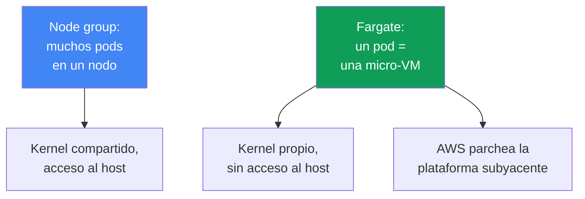
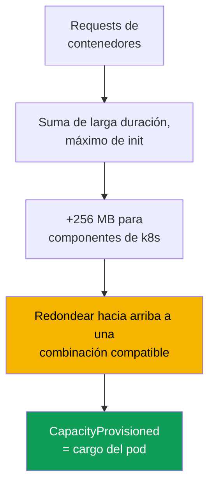

[Русская версия](ru.md) · [Eng version](en.md) · [Version française](fr.md) · [Deutsche Version](de.md) · [ქართული ვერსია](ge.md) · [繁體中文版](tw.md) · [日本語版](jp.md)
# Capítulo 15. Fargate: perfiles, limitaciones, coste y casos de uso

> **Qué sigue.** Los cuatro tipos de computación y el lugar de Fargate entre ellos se cubren de
> forma general en el capítulo 9. Aquí se trata en detalle: cómo un pod llega a Fargate mediante
> un perfil, cómo se asignan recursos, qué limitaciones están fijadas de forma rígida y cuánto
> cuesta. El dimensionamiento de requests y limits está en el capítulo 14; el acceso de los pods
> a AWS mediante pod execution role e IRSA/Pod Identity, en los capítulos 16-17; EFS para
> almacenamiento persistente, en el capítulo 24; los balanceadores y el tipo de destino `ip`, en
> los capítulos 26-27; logging y observabilidad, en los capítulos 33-34. Auto Mode como modo
> independiente está en el capítulo 9.

## 15.1. «Elegimos Fargate para evitar nodos y luego chocamos contra una pared»

Un equipo elige Fargate por una razón sencilla: no quiere gestionar nodos. El clúster está activo,
los pods se ejecutan y la operación parece no requerir esfuerzo. Después, una por una, aparecen
limitaciones que conocen demasiado tarde, cuando la carga ya está en producción:

- seguridad exige desplegar un agente de runtime como DaemonSet: **DaemonSet no es compatible**
  con Fargate, no hay dónde desplegar el agente salvo como sidecar en cada pod;
- se necesita un contenedor privilegiado para una herramienta de red o del sistema: **privileged
  está prohibido en Fargate**, así que el pod no se inicia;
- se solicitó un pod con 1 vCPU, pero `kubectl describe` muestra 2 vCPU: Fargate **redondeó** la
  solicitud a la combinación compatible más cercana, y eso es lo que se paga;
- llega una carga GPU: **no hay GPU en Fargate**, por lo que no hay dónde programar el pod;
- los logs se recopilaban mediante un DaemonSet de Fluent Bit: tampoco está disponible, por lo
  que el logging funciona de otra manera.

Ninguno de estos problemas es visible el primer día. Todos son consecuencia de que Fargate elimina
los nodos, pero **a cambio impone límites estrictos**. Es un intercambio justo: se renuncia a la
flexibilidad del nodo y se recibe una plataforma subyacente que AWS parchea y opera por sí mismo.
Este capítulo examina esos límites en concreto para que la decisión sobre Fargate se tome
conociendo sus fronteras y no por la suposición de que «sin nodos es más sencillo».

## 15.2. Qué es Fargate en realidad

En Fargate, un pod se ejecuta en una **micro-VM** dedicada: tiene su propio kernel, CPU, memoria e
interfaz de red, que no comparte con ningún otro pod. No hay nodos compartidos como en un node
group: **un pod equivale a una VM**. No existe acceso al host porque no hay un host en el sentido
habitual: el pod es toda la unidad visible.

Consecuencias prácticas de este modelo:

- **Aislamiento por pod.** Escapar de un contenedor no da acceso a los recursos de otros pods: el
  límite es la VM, no un namespace del kernel. Es defense in depth sobre el aislamiento normal de
  contenedores.
- **AWS opera la plataforma subyacente.** Los parches del sistema operativo y del kernel de la
  micro-VM, así como las actualizaciones del runtime, son responsabilidad de AWS. EKS parchea
  periódicamente los pods de Fargate y puede recrearlos (véase 15.5).
- **Solo se describe el pod.** No hay tipo de instancia, ASG, launch template, `max-pods` ni
  bootstrap que elegir. La especificación del pod es toda la entrada.

La otra cara de esta simplicidad es un conjunto fijo de capacidades: todo lo que requiera un nodo o
acceso al host no está disponible en Fargate por principio (sección 15.5).



## 15.3. Perfiles de Fargate: cómo llega un pod a Fargate

Un pod no «sabe» por sí mismo que está en Fargate. La decisión la toma un **perfil de Fargate**,
un objeto a nivel de clúster que describe qué pods se ejecutan en Fargate. La coincidencia usa
**selectores**: cada selector debe contener un `namespace` y puede contener `labels` de forma
opcional. Si un selector indica solo un namespace sin labels, **todos** los pods de ese namespace
van a Fargate.

Reglas del perfil, verificadas con la documentación:

- un perfil puede contener hasta **cinco selectores**, y cada uno debe indicar un namespace;
- un pod llega a Fargate si coincide con **al menos un** selector de perfil;
- si un pod coincide con varios perfiles, se elige uno explícitamente con el label del pod
  `eks.amazonaws.com/fargate-profile: <profile-name>`;
- un perfil **no se puede modificar** después de crearlo: para cambiarlo, se crea uno nuevo y se
  elimina el anterior;
- al eliminar un perfil, sus pods se detienen y pasan a `Pending`;
- solo se permiten **subredes privadas** (sin una ruta directa a un Internet Gateway): a los pods
  de Fargate no se les asignan direcciones IP públicas.

EKS ejecuta un **fargate-scheduler** independiente junto al kube-scheduler estándar, además de un
conjunto de controladores de admisión mutating y validating. Cuando un pod coincide con un perfil,
esos controladores lo reconocen y lo dirigen a Fargate. Crear un perfil requiere un **pod execution
role**, el rol con el que el `kubelet` de la plataforma subyacente se registra en el clúster y
descarga imágenes de ECR (los detalles del acceso de pods a AWS están en los capítulos 16-17). Las
reglas affinity y anti-affinity no se aplican a los pods de Fargate y Fargate todavía no admite
`topologySpreadConstraints`.

```bash
# Crear un perfil: los pods del namespace batch y los releases de Helm con un label van a Fargate
aws eks create-fargate-profile --cluster-name demo --fargate-profile-name batch \
  --pod-execution-role-arn arn:aws:iam::111122223333:role/eksFargatePodRole \
  --subnets subnet-0abc subnet-0def \
  --selectors namespace=batch namespace=jobs,labels={compute=fargate}
aws eks list-fargate-profiles --cluster-name demo
aws eks describe-fargate-profile --cluster-name demo --fargate-profile-name batch
```

El mismo perfil de forma declarativa (por ejemplo, mediante `eksctl` o Terraform) tiene este
aspecto:

```yaml
fargateProfiles:
  - name: batch
    podExecutionRoleARN: arn:aws:iam::111122223333:role/eksFargatePodRole
    subnets: [subnet-0abc, subnet-0def]   # solo privadas
    selectors:
      - namespace: batch                  # namespace completo
      - namespace: jobs
        labels:
          compute: fargate                # solo pods con este label
```

## 15.4. Cómo se asignan los recursos

Fargate no proporciona tamaños de pod arbitrarios. Toma la suma de los `requests` de los
contenedores y la **redondea hacia arriba** a la combinación compatible de vCPU y memoria más
cercana de un conjunto fijo. Según la documentación, el cálculo es el siguiente:

- los `requests` de todos los contenedores de larga duración se **suman**;
- para los contenedores init, se toma el valor **máximo** de uno de ellos;
- se selecciona el valor **mayor** de los dos como solicitud del pod;
- se añaden **256 MB** a la memoria para los componentes de Kubernetes (`kubelet`, `kube-proxy`,
  `containerd`);
- si no se especifican ni vCPU ni memoria, se elige la combinación **mínima** de `.25 vCPU / 0.5
  GB`.

Como Fargate ejecuta **un pod por VM**, todos los pods tienen la clase QoS `Guaranteed`:
`requests` debe ser igual a `limits` para todos los contenedores. Configurar los requests de forma
intencionada es fundamental: si se subestiman, el pod alcanza su límite; si se sobreestiman o se
cae de forma desfavorable entre escalones, se paga de más por el redondeo. Un ejemplo clásico: una
solicitud de `1 vCPU / 8 GB` deja de caber en la combinación `1 vCPU / 8 GB` después de añadir 256
MB y se aprovisiona como `2 vCPU / 9 GB`. La capacidad asignada real aparece en la anotación
`CapacityProvisioned` del pod.

| vCPU | Memoria disponible |
|---|---|
| .25 vCPU | 0.5 GB, 1 GB, 2 GB |
| .5 vCPU | 1 GB, 2 GB, 3 GB, 4 GB |
| 1 vCPU | de 2 GB a 8 GB, en incrementos de 1 GB |
| 2 vCPU | de 4 GB a 16 GB, en incrementos de 1 GB |
| 4 vCPU | de 8 GB a 30 GB, en incrementos de 1 GB |
| 8 vCPU | de 16 GB a 60 GB, en incrementos de 4 GB |
| 16 vCPU | de 32 GB a 120 GB, en incrementos de 8 GB |

El tamaño que `kubectl get nodes` muestra para un nodo de Fargate **no está relacionado** con la
capacidad del pod y suele ser mayor. Consulte la capacidad real mediante la anotación
`CapacityProvisioned` en `kubectl describe pod`, no a partir de la línea del nodo.



## 15.5. Las limitaciones en detalle

Las limitaciones de Fargate son estrictas y están verificadas con la documentación. Una tabla es
la forma más útil de tenerlas presentes: es una lista de comprobación para saber si una carga puede
ejecutarse en Fargate.

| Limitación | Qué no está disponible | Alternativa |
|---|---|---|
| DaemonSet | los agentes de nodo no pueden ejecutarse como DaemonSets | sidecar en cada pod |
| privileged | los contenedores privilegiados están prohibidos | reconsiderar el requisito |
| HostNetwork / HostPort | no se pueden indicar en una especificación de pod | Service normal |
| HostPath | no hay acceso al sistema de archivos del host | volumen efímero o EFS |
| GPU | las GPU no están disponibles en Fargate | node group con GPU |
| Storage | solo volúmenes efímeros y EFS | no se puede montar EBS |
| Disco efímero | 20 GiB por defecto, 175 GiB como máximo | `ephemeral-storage` en requests |
| Balanceadores de carga | solo tipo de destino `ip` | configurarlo así (capítulos 26-27) |
| IMDS | los metadatos de EC2 no están disponibles para los pods | IRSA / Pod Identity (capítulos 16-17) |
| Acceso al nodo | ni SSH ni acceso al host | depurar dentro del pod |
| Otros | no hay Fargate Spot, EBS, CNI alternativo ni Outposts/Local Zones | node group |

Varios puntos merecen más explicación. **Disco efímero**: cada pod recibe 20 GiB por defecto,
aunque la capacidad útil es algo menor que 20 GiB (parte está ocupada por `kubelet` y componentes
dentro del pod); se puede aumentar hasta **175 GiB** mediante `requests` de `ephemeral-storage`, y
Fargate aprovisiona capacidad adicional (una solicitud de 100 GiB produce una tarea con 115 GiB).
El disco se cifra por defecto y se elimina con el pod. El **almacenamiento persistente** solo puede
ser EFS, mediante aprovisionamiento estático; se monta automáticamente sin instalar un driver como
DaemonSet (los detalles están en el capítulo 24). **Redes**: Fargate usa VPC CNI y no se puede
sustituir; NLB y ALB solo funcionan con el tipo de destino `ip` (capítulos 26-27). **Parches**:
EKS parchea periódicamente los pods de Fargate y, si un pod no se puede desalojar de forma limpia,
puede eliminarlo; protéjase mediante un PDB y un graceful shutdown correcto (capítulo 40).

La ampliación del disco efímero se especifica directamente en la especificación del pod mediante
`ephemeral-storage` en requests y limits (son iguales para un pod `Guaranteed`); los demás
escalones de vCPU y memoria no cambian:

```yaml
resources:
  requests:
    cpu: "1"
    memory: 2Gi
    ephemeral-storage: 100Gi   # hasta 175Gi, Fargate aprovisiona capacidad adicional
  limits:
    cpu: "1"
    memory: 2Gi
    ephemeral-storage: 100Gi   # requests = limits
```

## 15.6. Coste

El modelo de pago de Fargate difiere fundamentalmente del de los nodos. Por un node group se paga
la **instancia** completa, sin importar cuánto la ocupen los pods. Con Fargate se paga la **vCPU y
la memoria asignadas al propio pod**, durante su vida útil, por segundo sujeto a una duración
mínima. El precio no lo determina la solicitud, sino la combinación **redondeada** de la anotación
`CapacityProvisioned`.

| Aspecto | Node group | Fargate |
|---|---|---|
| Unidad de facturación | instancia EC2 completa | vCPU y memoria del pod |
| Cargo por capacidad inactiva | sí, incluso por un nodo vacío | no, solo por un pod en ejecución |
| Sobrecarga de packing | se empaquetan los pods personalmente | el packing no es una preocupación propia |
| Precio por unidad de recurso | menor | mayor |
| Redondeo | no | hacia arriba a una combinación compatible |
| Descuento Spot | sí | no, Fargate Spot no es compatible con EKS |

La conclusión económica sin números: Fargate es **más caro** por unidad de recurso que un nodo,
pero no se paga por capacidad de nodo inactiva ni se dedica esfuerzo a empaquetar pods. Para cargas
**intermitentes** (jobs, servicios poco frecuentes), a menudo es más económico: no hay nodos
inactivos entre picos. Para cargas **grandes y estables** 24/7, los nodos suelen ser más baratos:
los recursos cuestan menos y casi no hay tiempo inactivo. Estructuralmente, la relación la
determina la utilización: cuanto menor sea la utilización media (tareas dispersas, periódicas o
poco frecuentes), más favorable resulta Fargate; cuando la utilización se aproxima al 100 % todo
el día, Fargate cuesta múltiplos de los nodos, porque su sobreprecio por recurso se aplica a
capacidad ocupada de forma continua. Una trampa aparte son los Jobs terminados: sus pods
permanecen y en Fargate siguen acumulando cargos, por lo que se debe configurar
`ttlSecondsAfterFinished`. El análisis detallado de costes está en el capítulo 43.

## 15.7. Dónde encaja Fargate y dónde no

Fargate es una herramienta para tareas concretas, no un sustituto de los nodos en todas partes. A
continuación se indica dónde encaja y dónde no.

| Encaja | No encaja |
|---|---|
| cargas aisladas y no confiables | se requieren agentes DaemonSet (seguridad, logs) |
| lotes de jobs con cargas intermitentes | cargas GPU |
| servicios pequeños sin querer operar nodos | se requieren privilegios o acceso al nodo |
| pods de sistema en un namespace separado | alta densidad de pods pequeños (costoso) |
| inicio rápido del clúster sin node group | carga grande y estable 24/7 |

La lógica es sencilla. **Encaja** cuando el aislamiento por pod tiene valor (una micro-VM aporta
un límite frente a escapes del contenedor), cuando la carga es elástica y no se quieren mantener
nodos inactivos, cuando el servicio es pequeño y la gestión de nodos no compensa, y cuando un
clúster debe iniciarse rápido sin ocuparse de un node group. **No encaja** cuando se requiere aunque
sea uno de los mecanismos prohibidos en 15.5 (DaemonSet, GPU, privilegios, acceso al host), o
cuando la economía está en contra de Fargate: muchos pods pequeños en los que el redondeo y el
sobreprecio por unidad elevan la factura, o una carga plana 24/7 donde los nodos cuestan menos.

## 15.8. Logs y observabilidad en Fargate

El patrón habitual de recopilación de logs mediante DaemonSet de Fluent Bit **no funciona** en
Fargate: no hay DaemonSets. En su lugar, Fargate proporciona un **mecanismo de logging
incorporado**: se habilita Fluent Bit mediante el log router estándar de Fargate, se configura en
el ConfigMap `aws-logging` del namespace `aws-observability`, y los logs van a CloudWatch Logs u
otro destino sin instalar un agente en el clúster. Los detalles de configuración y el control de
costes de logs están en el capítulo 34.

El mecanismo es silencioso: si se configura incorrectamente, los pods funcionan pero simplemente
no hay logs, errores ni eventos. Compruebe estas tres causas antes de buscar un problema en la
aplicación.

- **Los permisos están en el rol equivocado.** El log router escribe en su destino usando el **pod
  execution role** del perfil, no el rol del pod de IRSA o Pod Identity. Para CloudWatch, adjunte a
  ese rol una política con `logs:CreateLogGroup`, `logs:CreateLogStream`,
  `logs:DescribeLogStreams` y `logs:PutLogEvents`; sin ella, los logs se descartan en silencio.
  Es exactamente el caso en que el rol de la aplicación está perfectamente configurado y no tiene
  relación con los logs (capítulos 16 y 17).
- **Al namespace le falta un label.** El namespace debe llamarse `aws-observability` y llevar el
  label `aws-observability: enabled`; sin el label, la configuración no se recoge.
- **No hay ruta de red al destino.** Los pods de Fargate solo viven en subredes privadas, por lo
  que CloudWatch Logs requiere una ruta mediante NAT o un interface endpoint (capítulos 0.3 y 31).

Las métricas de pods de Fargate se recopilan con los mecanismos estándar (Container Insights,
Prometheus), con la salvedad de que los exportadores de nodo tampoco se pueden ejecutar como
DaemonSets: lo que normalmente vive en un nodo, en Fargate está incorporado o se recopila al nivel
del pod. Las métricas se tratan en el capítulo 33.

## 15.9. Combinar Fargate con nodos

Fargate y los nodos coexisten en un clúster y comparten el control plane. Una disposición típica
los separa **por namespace**: algunos namespaces los selecciona un perfil de Fargate, mientras que
otros van a un node group o Auto Mode. Un perfil de Fargate coincide con namespaces y labels, por
lo que ahí está el límite, no en los taints (los taints y tolerations son para nodos).

Un patrón común mantiene los **componentes del sistema** (CoreDNS, controladores, monitorización)
en nodos predecibles, mientras sitúa las **cargas aisladas o batch** en Fargate, dentro de un
namespace separado. Otra opción es un inicio totalmente «sin nodos»: mientras hay pocas
aplicaciones, todo está en Fargate; a medida que la carga crece, se añade un node group para lo
que Fargate gestiona mal (GPU, pods pequeños densos, cargas estables). `-o wide` ayuda a verificar
dónde terminó cada cosa: los pods de Fargate están en «nodos» con nombres como `fargate-ip-...`.

```bash
kubectl get pods -n batch -o wide      # NODE de pods Fargate: fargate-ip-10-0-...
kubectl describe pod -n batch <pod>    # ver la anotación CapacityProvisioned
```

Si se necesita un clúster completamente sin nodos, también se mueve CoreDNS a Fargate. Por defecto,
sus pods se mantienen en EC2 mediante la anotación `eks.amazonaws.com/compute-type: ec2`; moverlos
requiere tres pasos: crear un perfil `kube-system` con un selector para el label de CoreDNS, quitar
la anotación y recrear los pods.

```bash
# 1. perfil kube-system con un selector para CoreDNS (label k8s-app=kube-dns)
aws eks create-fargate-profile --cluster-name demo \
  --fargate-profile-name fp-kube-system \
  --pod-execution-role-arn arn:aws:iam::111122223333:role/eksFargatePodRole \
  --subnets subnet-0abc subnet-0def \
  --selectors namespace=kube-system,labels={k8s-app=kube-dns}
# 2. quitar la anotación que mantiene CoreDNS en EC2
kubectl patch deployment coredns -n kube-system --type json \
  -p '[{"op":"remove","path":"/spec/template/metadata/annotations/eks.amazonaws.com~1compute-type"}]'
# 3. recrear los pods: irán a Fargate
kubectl rollout restart deployment coredns -n kube-system
```

## 15.10. Cómo se usa esto en producción

- **Mantenga los selectores de perfiles acotados**: namespace más un label, en vez de «namespace
  completo», para que las cargas innecesarias no se muevan a Fargate y la factura no crezca sin que
  se note.
- **Configure los requests de forma intencionada e iguales a los limits**: un pod de Fargate
  siempre es `Guaranteed`, y el redondeo hacia arriba hace que un desajuste entre escalones cueste
  dinero.
- **Configure `ttlSecondsAfterFinished` en los Jobs**: los pods terminados en Fargate siguen
  acumulando cargos hasta que se eliminan.
- **Configure los logs mediante el log router incorporado de Fargate** (el ConfigMap
  `aws-logging`), en vez de intentar desplegar un DaemonSet que no está disponible.
- **Revise la lista de limitaciones 15.5 antes de migrar**: si se necesita un DaemonSet, GPU,
  privilegios o acceso al nodo, coloque la carga en un node group y no en Fargate.
- **Separe Fargate y nodos por namespace** y mantenga los componentes del sistema en nodos
  predecibles.

## 15.11. Mini glosario

- **Perfil de Fargate**: objeto a nivel de clúster con selectores (namespace más labels
  opcionales), un pod execution role y subredes privadas; determina qué pods van a Fargate. No se
  puede modificar, solo recrear.
- **Pod execution role**: rol IAM con el que el `kubelet` de la plataforma subyacente de Fargate
  se registra en el clúster y descarga imágenes de ECR; se configura al crear el perfil. El log
  router incorporado también escribe logs en su destino usando este rol, por lo que este es el rol
  que necesita permisos de escritura de logs.
- **fargate-scheduler**: programador de EKS que se ejecuta junto a kube-scheduler y envía a
  Fargate los pods que coinciden con un perfil.
- **CapacityProvisioned**: anotación de pod que contiene la combinación de vCPU y memoria
  realmente asignada tras el redondeo; determina el coste.
- **Micro-VM**: máquina virtual dedicada para un pod, con kernel, CPU, memoria e interfaz de red
  propios; es el límite de aislamiento de Fargate.

## 15.12. Resumen del capítulo

- En Fargate, un pod equivale a una micro-VM independiente: tiene su propio kernel y recursos, no
  tiene acceso al host y AWS parchea la plataforma subyacente. Solo se describe el pod.
- Un pod llega a Fargate mediante un perfil: selectores de namespace más label (hasta cinco), un
  pod execution role y solo subredes privadas; el perfil es inmutable y se ejecuta
  fargate-scheduler.
- Los recursos se redondean hacia arriba a una combinación fija de vCPU y memoria, más 256 MB para
  componentes de Kubernetes; los pods siempre son `Guaranteed`, con requests iguales a limits.
- Las limitaciones son estrictas: no hay DaemonSet, privileged, HostNetwork/HostPort/HostPath, GPU,
  EBS, Fargate Spot ni acceso al nodo; el storage es solo efímero (20 GiB por defecto, hasta 175
  GiB) y EFS; los balanceadores solo usan el tipo de destino `ip`.
- El coste corresponde a la vCPU y memoria del pod durante su vida útil, por segundo, según la
  combinación redondeada; cuesta más por unidad que los nodos, pero no tiene cargo por capacidad
  inactiva; para cargas 24/7, los nodos suelen ser más baratos.
- Fargate encaja con aislamiento, cargas batch y pequeñas, y un inicio rápido; no encaja con
  DaemonSets, GPU, privilegios, acceso al nodo, alta densidad ni cargas grandes estables.
- Los logs van mediante el log router incorporado de Fargate, no mediante DaemonSet; separe Fargate
  y nodos por namespace.

## 15.13. Cómo ayuda esto en el trabajo real

Una decisión sobre Fargate es elegir límites antes de que una carga llegue a producción. Revisar la
lista de limitaciones al inicio responde de antemano a «¿necesitamos un agente DaemonSet?»,
«¿habrá una GPU?», «¿necesitamos acceso al nodo?» y «¿cuánto costará el redondeo?», en lugar de
hacerlo cuando seguridad pide instalar un agente que no tiene dónde ejecutarse. Durante una
guardia, saber que un pod está en Fargate define de inmediato las limitaciones de depuración: no se
puede entrar al nodo, no hay exportador de nodo y la capacidad se lee en la anotación, no en la
línea del nodo. Al planificar costes, saber que Fargate factura por pod y redondea hacia arriba
ayuda a evitar sorpresas ante la factura de un lote de pods pequeños, cada uno redondeado de forma
individual a su propio escalón.

## 15.14. Preguntas de autoevaluación

1. ¿Por qué un pod de Fargate equivale a una micro-VM y qué proporciona esto en términos de
   aislamiento?
2. ¿Cómo llega un pod a Fargate y qué debe contener un selector de perfil?
3. ¿Por qué un perfil necesita un pod execution role y por qué el perfil no se puede modificar?
4. ¿Por qué los pods de Fargate requieren solo subredes privadas?
5. ¿Cómo calcula y redondea Fargate las vCPU y memoria solicitadas, y qué tiene que ver con ello
   los 256 MB?
6. ¿Por qué todos los pods de Fargate son `Guaranteed` y qué significa esto para requests y limits?
7. ¿Dónde se puede consultar la capacidad realmente asignada a un pod y por qué no en la línea del
   nodo?
8. Indique cinco limitaciones de Fargate y una alternativa para cada una cuando exista.
9. ¿Cuál es el tamaño predeterminado del disco efímero y hasta qué valor se puede aumentar?
10. ¿En qué difiere el modelo de pago de Fargate de un node group y cuándo son más baratos los
    nodos?
11. ¿En qué escenarios es apropiado Fargate y en cuáles definitivamente no?
12. ¿Cómo funciona la recopilación de logs en Fargate cuando DaemonSet no es compatible?
13. ¿Cómo se pueden separar Fargate y nodos en un mismo clúster y cómo se puede verificar dónde
    terminó algo?

## Práctica

El laboratorio del curso para este tema es [lab 112: perfiles de Fargate: qué funciona, qué falla,
comparación de costes](../../labs/112/README_ES.MD). Además, los perfiles y el comportamiento de
Fargate se pueden observar en un clúster activo. Empiece con un inventario: `aws eks
list-fargate-profiles --cluster-name <cluster>` muestra los perfiles, y `aws eks
describe-fargate-profile --cluster-name <cluster> --fargate-profile-name <name>` muestra los
selectores de namespace y label, las subredes y el pod execution role. Compruebe que las subredes
sean privadas y que los selectores sean acotados.

A continuación, observe los pods: `kubectl get pods -A -o wide` muestra los pods de Fargate en
«nodos» llamados `fargate-ip-...`, y `kubectl describe pod <pod>` en su namespace muestra la
anotación `CapacityProvisioned`. Compárela con lo solicitado en requests y vea cuál fue el coste
del redondeo. Revise la lista de limitaciones 15.5 para su carga: si necesita DaemonSet, GPU,
privilegios o acceso al nodo, y decida con honestidad qué namespaces pertenecen a Fargate y cuáles
deben permanecer en nodos.

---
[Índice](../README_ES.md) · [Capítulo 14](../14/es.md) · [Capítulo 16](../16/es.md)
