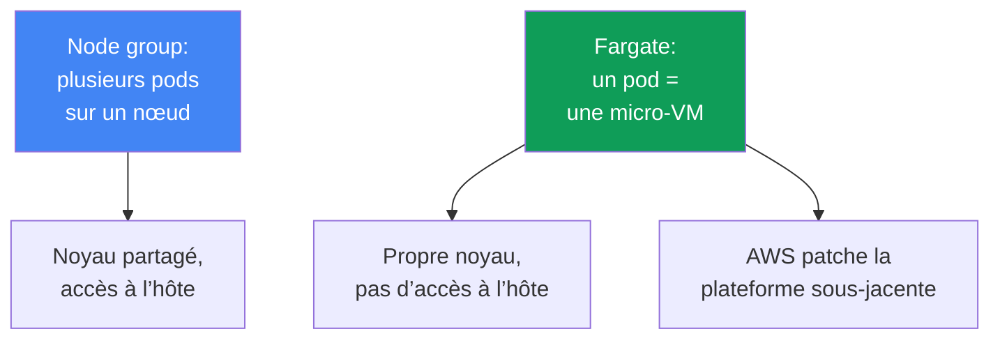
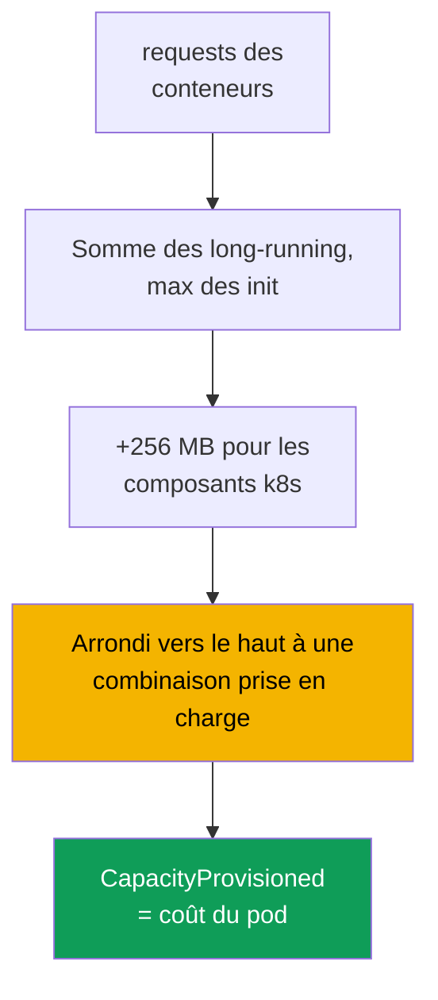

[Русская версия](ru.md) · [Eng version](en.md) · [Versión en español](es.md) · [Deutsche Version](de.md) · [ქართული ვერსია](ge.md) · [繁體中文版](tw.md) · [日本語版](jp.md)
# Chapitre 15. Fargate : profils, limites, coût et cas d’usage

> **La suite.** Les quatre types de calcul et la place de Fargate parmi eux sont présentés de façon générale au chapitre 9. Ici, nous entrons dans le détail : comment un pod arrive sur Fargate via un profil, comment les ressources sont allouées, quelles limites sont inscrites en dur et ce que cela coûte. Le dimensionnement des requests et limits est traité au chapitre 14 ; l’accès des pods à AWS via le pod execution role et IRSA/Pod Identity aux chapitres 16-17 ; EFS pour le stockage persistant au chapitre 24 ; les load balancers et le target type `ip` aux chapitres 26-27 ; les logs et l’observabilité aux chapitres 33-34. Auto Mode en tant que mode distinct est traité au chapitre 9.

## 15.1. « Nous avons choisi Fargate pour éviter les nœuds, puis nous avons heurté un mur »

Une équipe choisit Fargate pour une raison simple : elle ne veut pas gérer de nœuds. Le cluster est lancé, les pods s’exécutent et l’exploitation semble sans effort. Puis, les limites apparaissent une à une, trop tard, alors que la charge est déjà en production :

- la sécurité impose de déployer un agent d’exécution sous forme de DaemonSet : **DaemonSet n’est pas pris en charge** sur Fargate, il n’y a nulle part où déployer l’agent, sauf comme sidecar dans chaque pod ;
- un conteneur privilégié est nécessaire pour un outil réseau ou système : **privileged est interdit sur Fargate**, le pod ne démarre donc pas ;
- un pod a été demandé avec 1 vCPU, mais `kubectl describe` indique 2 vCPU : Fargate a **arrondi** la demande à la combinaison prise en charge la plus proche, et c’est celle que vous payez ;
- une charge GPU arrive : il n’y a **pas de GPU sur Fargate**, le pod ne peut être planifié nulle part ;
- les logs étaient collectés par un DaemonSet Fluent Bit : celui-ci est également indisponible, le logging fonctionne donc autrement.

Aucun de ces problèmes n’est visible le premier jour. Ils découlent tous du fait que Fargate retire les nœuds mais **impose en contrepartie des limites strictes**. C’est un échange honnête : vous abandonnez la flexibilité des nœuds et recevez une plateforme sous-jacente qu’AWS patche et exploite elle-même. Ce chapitre examine précisément ces limites afin qu’une décision concernant Fargate soit prise en connaissant ses frontières, plutôt qu’en supposant que « sans nœuds signifie plus simple ».

## 15.2. Ce qu’est réellement Fargate

Sur Fargate, un pod s’exécute dans une **micro-VM** dédiée : elle possède son propre noyau, ses propres CPU et sa propre mémoire, ainsi qu’une interface réseau, rien n’étant partagé avec un autre pod. Il n’y a pas de nœuds partagés comme dans un node group : **un pod équivaut à une VM**. Il n’y a pas d’accès à l’hôte, car il n’existe pas d’hôte au sens où vous l’entendez : le pod est toute l’unité visible.

Conséquences pratiques de ce modèle :

- **Isolation par pod.** S’échapper d’un conteneur ne donne pas accès aux ressources d’autres pods : la frontière est la VM, pas un namespace du noyau. C’est une défense en profondeur qui s’ajoute à l’isolation normale des conteneurs.
- **AWS exploite la plateforme sous-jacente.** Les correctifs de l’OS et du noyau de la micro-VM, ainsi que les mises à jour du runtime, sont gérés par AWS. EKS patche périodiquement les pods Fargate et peut les recréer (voir 15.5).
- **Vous décrivez uniquement le pod.** Il n’y a ni type d’instance, ni ASG, ni launch template, ni `max-pods`, ni bootstrap à choisir. La spec du pod est toute votre entrée.

L’autre face de cette simplicité est un ensemble fixe de fonctionnalités : tout ce qui nécessite un nœud ou l’accès à l’hôte est fondamentalement indisponible sur Fargate (section 15.5).



## 15.3. Profils Fargate : comment un pod arrive sur Fargate

Un pod ne « sait » pas lui-même qu’il est sur Fargate. La décision est prise par un **profil Fargate**, un objet au niveau du cluster qui décrit quels pods s’exécutent sur Fargate. La correspondance utilise des **sélecteurs** : chaque sélecteur doit contenir un `namespace` et peut facultativement contenir des `labels`. Si un sélecteur indique uniquement un namespace sans labels, **tous** les pods de ce namespace vont sur Fargate.

Règles des profils, vérifiées dans la documentation :

- un profil peut contenir jusqu’à **cinq sélecteurs**, et chacun doit indiquer un namespace ;
- un pod arrive sur Fargate s’il correspond à **au moins un** sélecteur de profil ;
- si un pod correspond à plusieurs profils, choisissez-en un explicitement avec le label de pod `eks.amazonaws.com/fargate-profile: <profile-name>` ;
- un profil **ne peut pas être modifié** après sa création : créez-en un nouveau et supprimez l’ancien pour effectuer un changement ;
- lorsqu’un profil est supprimé, ses pods s’arrêtent et passent à l’état `Pending` ;
- seuls les **subnets privés** (sans route directe vers un Internet Gateway) sont autorisés : aucune IP publique n’est attribuée aux pods Fargate.

EKS exécute un **fargate-scheduler** distinct à côté du kube-scheduler standard, ainsi qu’un ensemble d’admission controllers mutating et validating. Lorsqu’un pod correspond à un profil, ces contrôleurs le reconnaissent et le dirigent vers Fargate. La création d’un profil exige un **pod execution role**, le rôle avec lequel le `kubelet` de la plateforme sous-jacente s’enregistre auprès du cluster et extrait les images d’ECR (les détails de l’accès des pods à AWS figurent aux chapitres 16-17). Les règles affinity et anti-affinity ne s’appliquent pas aux pods Fargate, et Fargate ne prend pas encore en charge `topologySpreadConstraints`.

```bash
# Créer un profil : les pods du namespace batch et les releases Helm ayant un label vont sur Fargate
aws eks create-fargate-profile --cluster-name demo --fargate-profile-name batch \
  --pod-execution-role-arn arn:aws:iam::111122223333:role/eksFargatePodRole \
  --subnets subnet-0abc subnet-0def \
  --selectors namespace=batch namespace=jobs,labels={compute=fargate}
aws eks list-fargate-profiles --cluster-name demo
aws eks describe-fargate-profile --cluster-name demo --fargate-profile-name batch
```

Le même profil sous forme déclarative, par exemple avec `eksctl` ou Terraform, se présente ainsi :

```yaml
fargateProfiles:
  - name: batch
    podExecutionRoleARN: arn:aws:iam::111122223333:role/eksFargatePodRole
    subnets: [subnet-0abc, subnet-0def]   # privés uniquement
    selectors:
      - namespace: batch                  # namespace entier
      - namespace: jobs
        labels:
          compute: fargate                # uniquement les pods avec ce label
```

## 15.4. Comment les ressources sont allouées

Fargate ne fournit pas de tailles de pod arbitraires. Il prend la somme des `requests` des conteneurs et l’**arrondit vers le haut** à la combinaison vCPU et mémoire prise en charge la plus proche dans un ensemble fixe. Selon la documentation, le calcul est le suivant :

- les `requests` de tous les conteneurs long-running sont **additionnés** ;
- pour les init containers, la valeur **maximale** d’un seul conteneur est utilisée ;
- la **plus grande** de ces deux valeurs est choisie comme demande du pod ;
- **256 MB** sont ajoutés à la mémoire pour les composants Kubernetes (`kubelet`, `kube-proxy`, `containerd`) ;
- si ni vCPU ni mémoire ne sont indiqués, la combinaison **minimale** `.25 vCPU / 0.5 GB` est sélectionnée.

Puisque Fargate exécute **un pod par VM**, tous les pods ont la classe QoS `Guaranteed` : les `requests` doivent être égales aux `limits` pour tous les conteneurs. Définir consciemment les requests est crucial : les sous-estimer mène le pod à sa limite ; les surestimer ou tomber maladroitement entre deux paliers entraîne un surcoût dû à l’arrondi. Exemple classique : une demande `1 vCPU / 8 GB` ne tient plus dans la combinaison `1 vCPU / 8 GB` après l’ajout de 256 MB et est provisionnée en `2 vCPU / 9 GB`. La capacité réellement allouée apparaît dans l’annotation `CapacityProvisioned` du pod.

| vCPU | Mémoire disponible |
|---|---|
| .25 vCPU | 0.5 GB, 1 GB, 2 GB |
| .5 vCPU | 1 GB, 2 GB, 3 GB, 4 GB |
| 1 vCPU | de 2 GB à 8 GB, par incréments de 1 GB |
| 2 vCPU | de 4 GB à 16 GB, par incréments de 1 GB |
| 4 vCPU | de 8 GB à 30 GB, par incréments de 1 GB |
| 8 vCPU | de 16 GB à 60 GB, par incréments de 4 GB |
| 16 vCPU | de 32 GB à 120 GB, par incréments de 8 GB |

La taille que `kubectl get nodes` affiche pour un nœud Fargate **n’est pas liée** à la capacité du pod et est généralement supérieure. Consultez la capacité réelle via l’annotation `CapacityProvisioned` dans `kubectl describe pod`, et non sur la ligne du nœud.



## 15.5. Les limites en détail

Les limites de Fargate sont strictes et vérifiées dans la documentation. Un tableau est la meilleure façon de les conserver : c’est une checklist pour déterminer si une charge peut s’exécuter sur Fargate.

| Limite | Ce qui est indisponible | Contournement |
|---|---|---|
| DaemonSet | les agents de nœud ne peuvent pas s’exécuter comme DaemonSets | sidecar dans chaque pod |
| privileged | les conteneurs privilégiés sont interdits | revoir le besoin |
| HostNetwork / HostPort | ne peuvent pas être indiqués dans une spec de pod | Service standard |
| HostPath | aucun accès au système de fichiers de l’hôte | volume éphémère ou EFS |
| GPU | les GPU sont indisponibles sur Fargate | node group avec GPU |
| Storage | seuls les volumes éphémères et EFS sont disponibles | EBS ne peut pas être monté |
| Disque éphémère | 20 GiB par défaut, 175 GiB au maximum | `ephemeral-storage` dans les requests |
| Load balancers | uniquement le target type `ip` | le configurer ainsi (chapitres 26-27) |
| IMDS | les métadonnées EC2 sont indisponibles pour les pods | IRSA / Pod Identity (chapitres 16-17) |
| Accès au nœud | ni SSH ni accès à l’hôte | déboguer dans le pod |
| Autres | pas de Fargate Spot, EBS, CNI alternatif, Outposts/Local Zones | node group |

Quelques éléments méritent une explication supplémentaire. **Disque éphémère** : chaque pod reçoit 20 GiB par défaut, bien que la capacité utilisable soit légèrement inférieure à 20 GiB (une partie est occupée par `kubelet` et les composants internes du pod) ; elle peut être augmentée jusqu’à **175 GiB** via les `requests` `ephemeral-storage`, Fargate provisionnant une capacité supplémentaire (une demande de 100 GiB produit une tâche avec 115 GiB). Le disque est chiffré par défaut et supprimé avec le pod. Le **stockage persistant** se limite à EFS, avec provisionnement statique ; il est monté automatiquement sans installer de pilote sous forme de DaemonSet (détails au chapitre 24). **Réseau** : Fargate utilise le VPC CNI, qui ne peut pas être remplacé ; NLB et ALB fonctionnent uniquement avec le target type `ip` (chapitres 26-27). **Patching** : EKS patche périodiquement les pods Fargate et, si un pod ne peut pas être évincé proprement, peut le supprimer ; protégez-vous avec un PDB et un graceful shutdown correct (chapitre 40).

L’extension du disque éphémère est indiquée directement dans la spec du pod via `ephemeral-storage` dans les requests et limits (elles sont égales pour un pod `Guaranteed`) ; les autres paliers vCPU et mémoire ne changent pas :

```yaml
resources:
  requests:
    cpu: "1"
    memory: 2Gi
    ephemeral-storage: 100Gi   # jusqu’à 175Gi, Fargate provisionne une capacité supplémentaire
  limits:
    cpu: "1"
    memory: 2Gi
    ephemeral-storage: 100Gi   # requests = limits
```

## 15.6. Coût

Le modèle de paiement Fargate diffère fondamentalement de celui des nœuds. Pour un node group, vous payez l’**instance** entière, quel que soit le taux d’occupation par les pods. Avec Fargate, vous payez les **vCPU et la mémoire alloués au pod lui-même**, pendant toute sa durée de vie, à la seconde, avec une durée minimale. Le prix n’est pas déterminé par la demande, mais par la combinaison **arrondie** de l’annotation `CapacityProvisioned`.

| Aspect | Node group | Fargate |
|---|---|---|
| Unité de facturation | instance EC2 entière | vCPU et mémoire du pod |
| Frais pour capacité inactive | oui, même pour un nœud vide | non, uniquement pour un pod en cours d’exécution |
| Effort de packing | vous placez les pods vous-même | le packing ne vous concerne pas |
| Prix par unité de ressource | inférieur | supérieur |
| Arrondi | non | vers le haut à une combinaison prise en charge |
| Remise Spot | oui | non, Fargate Spot n’est pas pris en charge dans EKS |

La conclusion économique sans chiffres : Fargate est **plus cher** par unité de ressource qu’un nœud, mais vous ne payez pas la capacité inactive des nœuds et ne consacrez pas d’efforts au packing des pods. Pour les charges **intermittentes** (jobs, services peu fréquents), il est souvent plus économique : aucun nœud ne reste inactif entre les pics. Pour les charges **stables et importantes** 24/7, les nœuds sont généralement moins chers : les ressources coûtent moins et il n’y a presque pas de temps d’inactivité. Structurellement, le rapport dépend de l’utilisation : plus l’utilisation moyenne est faible (tâches peu denses, périodiques, rares), plus Fargate est favorable ; lorsque l’utilisation approche 100 % en permanence, Fargate coûte plusieurs fois plus que les nœuds, car son supplément par ressource s’applique à une capacité continuellement occupée. Les Jobs terminés constituent un piège distinct : leurs pods restent présents et continuent d’accumuler des frais sur Fargate ; définissez donc `ttlSecondsAfterFinished`. Une analyse détaillée des coûts se trouve au chapitre 43.

## 15.7. Là où Fargate convient, et là où il ne convient pas

Fargate est un outil pour des tâches particulières, pas un remplacement universel des nœuds. Voici où il convient et où il ne convient pas.

| Convient | Ne convient pas |
|---|---|
| charges isolées et non fiables | des agents DaemonSet sont nécessaires (sécurité, logs) |
| lots de jobs avec charges intermittentes | charges GPU |
| petits services sans vouloir exploiter des nœuds | des privilèges ou l’accès au nœud sont nécessaires |
| pods système dans un namespace distinct | haute densité de petits pods (coûteux) |
| démarrage rapide d’un cluster sans node group | charge stable et importante 24/7 |

La logique est simple. Il **convient** lorsque l’isolation par pod est précieuse (une micro-VM fournit une frontière face à l’évasion d’un conteneur), lorsque la charge est élastique et que vous ne voulez pas maintenir de nœuds inactifs, lorsque le service est petit et que la gestion de nœuds ne se justifie pas, et lorsqu’un cluster doit démarrer rapidement sans manipuler de node group. Il **ne convient pas** dès qu’un mécanisme interdit dans 15.5 est requis (DaemonSet, GPU, privilèges, accès à l’hôte), ou lorsque l’économie est défavorable à Fargate : beaucoup de petits pods dont l’arrondi et le supplément unitaire gonflent la facture, ou une charge uniforme 24/7 pour laquelle les nœuds coûtent moins cher.

## 15.8. Logs et observabilité sur Fargate

Le modèle habituel de collecte des logs par DaemonSet Fluent Bit **ne fonctionne pas** sur Fargate : il n’y a pas de DaemonSets. À la place, Fargate fournit un **mécanisme de logging intégré** : activez Fluent Bit par le log router Fargate standard, configurez-le dans la ConfigMap `aws-logging` du namespace `aws-observability`, et les logs sont envoyés vers CloudWatch Logs ou une autre destination sans installer d’agent dans le cluster. Les détails de configuration et le contrôle des coûts des logs sont traités au chapitre 34.

Le mécanisme est discret : en cas de mauvaise configuration, les pods s’exécutent mais il n’y a simplement ni logs, ni erreurs, ni événements. Vérifiez ces trois causes avant de chercher un problème dans l’application.

- **Les permissions sont sur le mauvais rôle.** Le log router écrit vers sa destination avec le **pod execution role** du profil, et non avec le rôle du pod fourni par IRSA ou Pod Identity. Pour CloudWatch, attachez à ce rôle une politique avec `logs:CreateLogGroup`, `logs:CreateLogStream`, `logs:DescribeLogStreams` et `logs:PutLogEvents` ; sans elle, les logs sont silencieusement supprimés. C’est précisément le cas où le rôle de l’application est parfaitement configuré mais n’a rien à voir avec les logs (chapitres 16 et 17).
- **Le namespace n’a pas de label.** Le namespace doit s’appeler `aws-observability` et porter le label `aws-observability: enabled` ; sans ce label, la configuration n’est pas prise en compte.
- **Il n’existe pas de chemin réseau vers la destination.** Les pods Fargate résident uniquement dans des subnets privés ; CloudWatch Logs exige donc une route via NAT ou un interface endpoint (chapitres 0.3 et 31).

Les métriques des pods Fargate sont collectées avec les mécanismes standard (Container Insights, Prometheus), en gardant à l’esprit que les exporters de nœud ne peuvent pas non plus s’exécuter comme DaemonSets : ce qui réside normalement sur un nœud est soit intégré à Fargate, soit collecté au niveau du pod. Les métriques sont traitées au chapitre 33.

## 15.9. Associer Fargate et des nœuds

Fargate et les nœuds coexistent dans un même cluster et partagent le control plane. Une disposition typique les sépare **par namespace** : certains namespaces sont sélectionnés par un profil Fargate, tandis que d’autres vont vers un node group ou Auto Mode. Un profil Fargate correspond aux namespaces et aux labels, c’est donc là que se situe la frontière, et non au niveau des taints (les taints et tolerations concernent les nœuds).

Un modèle courant conserve les **composants système** (CoreDNS, controllers, monitoring) sur des nœuds prévisibles, tout en plaçant les **charges isolées ou batch** sur Fargate dans un namespace distinct. Une autre possibilité consiste à démarrer entièrement « sans nœuds » : tant qu’il y a peu d’applications, tout est sur Fargate ; à mesure que la charge augmente, ajoutez un node group pour ce que Fargate gère mal (GPU, petits pods denses, charges stables). `-o wide` permet de vérifier où les éléments ont atterri : les pods Fargate se trouvent sur des « nœuds » nommés comme `fargate-ip-...`.

```bash
kubectl get pods -n batch -o wide      # NODE pour les pods Fargate : fargate-ip-10-0-...
kubectl describe pod -n batch <pod>    # consulter l’annotation CapacityProvisioned
```

Si un cluster entièrement sans nœuds est nécessaire, déplacez aussi CoreDNS sur Fargate. Par défaut, ses pods sont maintenus sur EC2 par l’annotation `eks.amazonaws.com/compute-type: ec2` ; le déplacement requiert trois étapes : créer un profil `kube-system` avec un sélecteur pour le label CoreDNS, supprimer l’annotation, puis recréer les pods.

```bash
# 1. profil kube-system avec un sélecteur pour CoreDNS (label k8s-app=kube-dns)
aws eks create-fargate-profile --cluster-name demo \
  --fargate-profile-name fp-kube-system \
  --pod-execution-role-arn arn:aws:iam::111122223333:role/eksFargatePodRole \
  --subnets subnet-0abc subnet-0def \
  --selectors namespace=kube-system,labels={k8s-app=kube-dns}
# 2. supprimer l’annotation qui maintient CoreDNS sur EC2
kubectl patch deployment coredns -n kube-system --type json \
  -p '[{"op":"remove","path":"/spec/template/metadata/annotations/eks.amazonaws.com~1compute-type"}]'
# 3. recréer les pods : ils iront sur Fargate
kubectl rollout restart deployment coredns -n kube-system
```

## 15.10. Comment cela est utilisé en production

- **Gardez les sélecteurs de profil étroits** : namespace plus label, plutôt qu’un « namespace entier », afin que des charges inutiles ne passent pas sur Fargate et que la facture n’augmente pas sans que vous le remarquiez.
- **Définissez consciemment les requests, égales aux limits** : un pod Fargate est toujours `Guaranteed`, et l’arrondi vers le haut signifie qu’une erreur entre deux paliers coûte de l’argent.
- **Définissez `ttlSecondsAfterFinished` sur les Jobs** : les pods terminés sur Fargate continuent d’accumuler des frais jusqu’à leur suppression.
- **Configurez les logs via le log router Fargate intégré** (la ConfigMap `aws-logging`), plutôt que de tenter de déployer un DaemonSet indisponible.
- **Parcourez la checklist des limites 15.5 avant la migration** : si un DaemonSet, un GPU, des privilèges ou l’accès au nœud sont nécessaires, placez la charge sur un node group plutôt que sur Fargate.
- **Séparez Fargate et les nœuds par namespace** et gardez les composants système sur des nœuds prévisibles.

## 15.11. Mini-glossaire

- **Profil Fargate** : objet au niveau du cluster avec des sélecteurs (namespace plus labels facultatifs), un pod execution role et des subnets privés ; il détermine quels pods vont sur Fargate. Il ne peut pas être modifié, seulement recréé.
- **Pod execution role** : rôle IAM avec lequel le `kubelet` de la plateforme sous-jacente Fargate s’enregistre auprès du cluster et extrait les images d’ECR ; il est défini à la création du profil. Le log router intégré écrit également les logs vers leur destination avec ce rôle, c’est donc lui qui doit disposer des permissions d’écriture des logs.
- **fargate-scheduler** : scheduler EKS qui s’exécute à côté de kube-scheduler et envoie vers Fargate les pods qui correspondent à un profil.
- **CapacityProvisioned** : annotation d’un pod contenant la combinaison vCPU et mémoire réellement allouée après arrondi ; elle détermine le coût.
- **Micro-VM** : machine virtuelle dédiée à un pod, avec son propre noyau, CPU, mémoire et interface réseau ; c’est la frontière d’isolation de Fargate.

## 15.12. Résumé du chapitre

- Sur Fargate, un pod équivaut à une micro-VM distincte : son propre noyau et ses propres ressources, aucun accès à l’hôte, et AWS patche la plateforme sous-jacente. Vous décrivez uniquement le pod.
- Un pod arrive sur Fargate via un profil : sélecteurs namespace-plus-labels (jusqu’à cinq), pod execution role et subnets privés uniquement ; le profil est immuable et fargate-scheduler s’exécute.
- Les ressources sont arrondies vers le haut à une combinaison fixe de vCPU et mémoire, plus 256 MB pour les composants Kubernetes ; les pods sont toujours `Guaranteed`, avec requests égales aux limits.
- Les limites sont strictes : pas de DaemonSet, privileged, HostNetwork/HostPort/HostPath, GPU, EBS, Fargate Spot ni accès au nœud ; le stockage se limite à l’éphémère (20 GiB par défaut, jusqu’à 175 GiB) et à EFS ; les load balancers utilisent uniquement le target type `ip`.
- Le coût couvre les vCPU et la mémoire du pod pendant sa durée de vie, à la seconde, d’après la combinaison arrondie ; le coût unitaire est supérieur à celui des nœuds, mais il n’y a pas de frais de capacité inactive ; pour les charges 24/7, les nœuds sont généralement moins chers.
- Fargate convient à l’isolation, aux charges batch et petites, ainsi qu’à un démarrage rapide ; il ne convient pas aux DaemonSets, GPU, privilèges, accès au nœud, forte densité ou charge stable importante.
- Les logs passent par le log router Fargate intégré, et non par un DaemonSet ; séparez Fargate et les nœuds par namespace.

## 15.13. Comment cela aide dans le travail réel

Une décision Fargate constitue un choix de frontières avant qu’une charge n’atteigne la production. Parcourir la checklist des limites dès le début répond à l’avance aux questions « Avons-nous besoin d’un agent DaemonSet ? », « Y aura-t-il un GPU ? », « Avons-nous besoin de l’accès au nœud ? » et « Quel sera le coût de l’arrondi ? », plutôt qu’au moment où la sécurité demande l’installation d’un agent qui n’a nulle part où s’exécuter. En astreinte, savoir qu’un pod est sur Fargate définit immédiatement les contraintes de débogage : vous ne pouvez pas entrer dans le nœud, il n’y a pas d’exporter de nœud, et la capacité se lit dans l’annotation plutôt que sur la ligne du nœud. Lors de la planification des coûts, savoir que Fargate facture par pod et arrondit vers le haut aide à éviter la surprise d’une facture pour un lot de petits pods, chacun arrondi individuellement à son propre palier.

## 15.14. Questions d’auto-évaluation

1. Pourquoi un pod Fargate équivaut-il à une micro-VM, et que fournit cela en matière d’isolation ?
2. Comment un pod arrive-t-il sur Fargate, et que doit contenir un sélecteur de profil ?
3. Pourquoi un profil a-t-il besoin d’un pod execution role, et pourquoi ne peut-il pas être modifié ?
4. Pourquoi les pods Fargate nécessitent-ils uniquement des subnets privés ?
5. Comment Fargate calcule-t-il et arrondit-il les vCPU et la mémoire demandés, et quel est le rôle des 256 MB ?
6. Pourquoi tous les pods Fargate sont-ils `Guaranteed`, et qu’est-ce que cela implique pour les requests et limits ?
7. Où consulter la capacité réellement allouée à un pod, et pourquoi pas sur la ligne du nœud ?
8. Citez cinq limites de Fargate et un contournement pour chacune lorsqu’il en existe un.
9. Quelle est la taille par défaut du disque éphémère, et jusqu’à quelle valeur peut-elle être augmentée ?
10. En quoi le modèle de paiement Fargate diffère-t-il d’un node group, et quand les nœuds sont-ils moins chers ?
11. Dans quels scénarios Fargate est-il approprié, et dans lesquels ne l’est-il assurément pas ?
12. Comment la collecte de logs fonctionne-t-elle sur Fargate lorsque DaemonSet n’est pas pris en charge ?
13. Comment séparer Fargate et les nœuds dans un cluster, et comment vérifier où un élément a atterri ?

## Pratique

Le lab du cours pour ce sujet est [lab 112 : profils Fargate, ce qui fonctionne, ce qui casse, comparaison des coûts](../../labs/112/README_FR.MD). En outre, les profils et le comportement de Fargate peuvent être observés sur un cluster réel. Commencez par un inventaire : `aws eks list-fargate-profiles --cluster-name <cluster>` affiche les profils, et `aws eks describe-fargate-profile --cluster-name <cluster> --fargate-profile-name <name>` affiche les sélecteurs de namespace et de label, les subnets et le pod execution role. Vérifiez que les subnets sont privés et que les sélecteurs sont étroits.

Examinez ensuite les pods : `kubectl get pods -A -o wide` affiche les pods Fargate sur des « nœuds » nommés `fargate-ip-...`, et `kubectl describe pod <pod>` dans leur namespace affiche l’annotation `CapacityProvisioned`. Comparez-la avec ce que vous avez demandé dans les requests et observez le coût de l’arrondi. Parcourez la checklist des limites 15.5 pour votre charge : besoin d’un DaemonSet, d’un GPU, de privilèges ou de l’accès au nœud, puis décidez honnêtement quels namespaces doivent aller sur Fargate et lesquels doivent rester sur des nœuds.

---
[Table des matières](../README_FR.md) · [Chapitre 14](../14/fr.md) · [Chapitre 16](../16/fr.md)
