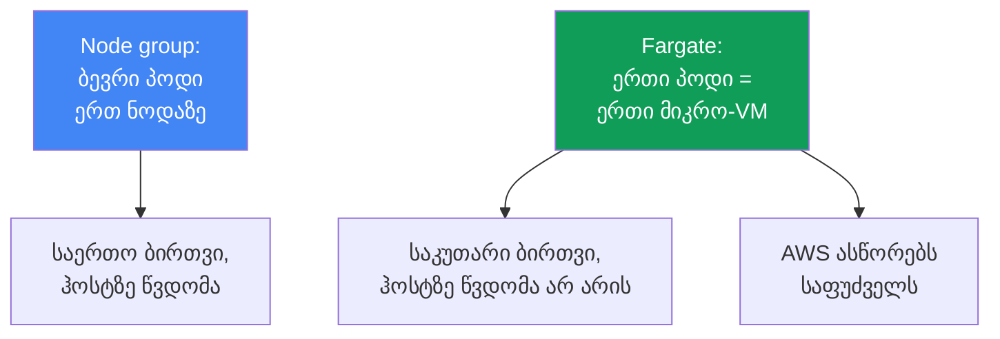
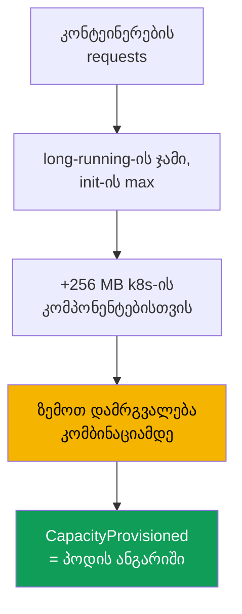

[Русская версия](ru.md) · [Eng version](en.md) · [Versión en español](es.md) · [Version française](fr.md) · [Deutsche Version](de.md) · [繁體中文版](tw.md) · [日本語版](jp.md)
# თავი 15. Fargate: პროფილები, შეზღუდვები, ღირებულება, გამოყენების სცენარები

> **რა არის შემდეგ.** გამოთვლითი რესურსების ოთხი ტიპი და მათ შორის Fargate-ის ადგილი მე-9 თავშია,
> სადაც ის მიმოხილვის სახითაა მოცემული. აქ საკითხს საგნობრივად განვიხილავთ: როგორ ხვდება პოდი
> Fargate-ზე პროფილის საშუალებით, როგორ გამოიყოფა რესურსები, რომელი შეზღუდვებია მკაცრად ჩაშენებული
> და რა ღირს ეს. Requests-ისა და limits-ის საიზინგი მე-14 თავშია, პოდების წვდომა AWS-ზე pod
> execution role-ისა და IRSA/Pod Identity-ის საშუალებით მე-16 და მე-17 თავებში, EFS მუდმივი
> შენახვისთვის მე-24 თავში, დამაბალანსებლები და target-type `ip` მე-26 და მე-27 თავებში, ჟურნალები
> და დაკვირვებადობა კი მე-33 და მე-34 თავებში. Auto Mode, როგორც ცალკე რეჟიმი, მე-9 თავშია.

## 15.1. „Fargate ნოდების არქონის გამო ავირჩიეთ, შემდეგ კი კედელს შევეჯახეთ“

გუნდი Fargate-ს მარტივი სურვილის გამო ირჩევს: ნოდების მართვა არ სურს. კლასტერი გაშვებულია,
პოდები მუშაობს, ექსპლუატაცია უწონად გამოიყურება. შემდეგ კი ერთმანეთის მიყოლებით ჩნდება
შეზღუდვები, რომელთა შესახებაც გვიან იგებენ, როცა დატვირთვა უკვე production-შია:

- უსაფრთხოება runtime-აგენტის DaemonSet-ით დაყენებას მოითხოვს, მაგრამ Fargate-ზე **DaemonSet
  მხარდაჭერილი არ არის**, ამიტომ აგენტის დასაყენებელი ადგილი არ არსებობს და ის მხოლოდ sidecar-ის
  სახით უნდა დაემატოს თითოეულ პოდს;
- ქსელური ან სისტემური ინსტრუმენტისთვის privileged კონტეინერია საჭირო, მაგრამ **privileged
  Fargate-ზე აკრძალულია** და პოდი არ ეშვება;
- პოდისთვის 1 vCPU შეუკვეთეს, `kubectl describe` კი 2 vCPU-ს აჩვენებს, რადგან Fargate-მა მოთხოვნა
  უახლოეს დასაშვებ კომბინაციამდე **დაამრგვალა** და თანხას ამ კომბინაციაში იხდით;
- გამოჩნდა GPU-დატვირთვა, მაგრამ **Fargate-ზე GPU არ არის** და პოდის განსათავსებელი ადგილი არ
  არსებობს;
- ჟურნალებს ჩვეულებრივ Fluent Bit-ის DaemonSet-ით აგროვებდნენ, მაგრამ ისიც არ არის და
  ლოგირება სხვაგვარადაა მოწყობილი.

ამ პრობლემებიდან არცერთი ჩანს პირველ დღეს. ყველა მათგანი იმის შედეგია, რომ Fargate ნოდებს
გაშორებთ, მაგრამ **სანაცვლოდ მკაცრ ჩარჩოებს აწესებს**. ეს სამართლიანი გარიგებაა: ნოდის მოქნილობას
თმობთ და იღებთ საფუძველს, რომელსაც AWS თავად ასწორებს და ემსახურება. ამ თავში ჩარჩოებს
საგნობრივად განვიხილავთ, რათა Fargate-ის შესახებ გადაწყვეტილება საზღვრების ცოდნით მიიღოთ და არა
ინერციით, თითქოს „ნოდების გარეშე უფრო მარტივია“.

## 15.2. კონკრეტულად რა არის Fargate

Fargate-ზე პოდი გამოყოფილ **მიკრო-VM-ზე** ეშვება: მას აქვს საკუთარი ბირთვი, CPU, მეხსიერება და
ქსელური ინტერფეისი, რომლებიც არცერთ სხვა პოდთან არ იყოფა. აქ არ არსებობს საერთო ნოდები, როგორც
node group-ში, ანუ **ერთი პოდი ერთ VM-ს უდრის**. ჰოსტზე წვდომა არ არის, რადგან ჰოსტი თქვენი
გაგებით არ არსებობს: პოდი მთლიანად წარმოადგენს თქვენთვის ხილულ ერთეულს.

ამ მოდელის პრაქტიკული შედეგებია:

- **იზოლაცია per-pod.** კონტეინერიდან გაქცევა სხვა პოდების რესურსებზე წვდომას არ იძლევა:
  საზღვარი VM-ზე გადის და არა ბირთვის namespace-ზე. ეს ჩვეულებრივი კონტეინერული იზოლაციის
  დამატებითი defense-in-depth ფენაა.
- **AWS ემსახურება საფუძველს.** მიკრო-VM-ის OS-ისა და ბირთვის პატჩები და შესრულების გარემოს
  განახლება AWS-ის მხარესაა. EKS პერიოდულად ასწორებს Fargate-ის პოდებს და შეიძლება ისინი
  ხელახლა შექმნას (იხ. 15.5).
- **თქვენ მხოლოდ პოდს აღწერთ.** არ არის ინსტანსის ტიპის, ASG-ის, launch template-ის,
  `max-pods`-ისა და bootstrap-ის არჩევა. პოდის სპეციფიკაცია თქვენი სრული input-ია.

ამ სიმარტივის საპირისპირო მხარე შესაძლებლობების ფიქსირებული ნაკრებია: ყველაფერი, რასაც ნოდა ან
ჰოსტზე წვდომა სჭირდება, Fargate-ზე პრინციპულად მიუწვდომელია (სექცია 15.5).



## 15.3. Fargate-პროფილები: როგორ ხვდება პოდი Fargate-ზე

პოდმა თავისთავად არ „იცის“, რომ Fargate-ზეა. გადაწყვეტილებას იღებს **Fargate-პროფილი**,
კლასტერის დონის ობიექტი, რომელიც აღწერს, რომელი პოდები უნდა გაეშვას Fargate-ზე. შესაბამისობა
**სელექტორებით** დგინდება: თითოეული სელექტორი აუცილებლად შეიცავს `namespace`-ს და სურვილისამებრ
`labels`-ს. თუ სელექტორში მხოლოდ namespace არის მითითებული და labels არა, ამ namespace-ის
**ყველა** პოდი Fargate-ზე გადადის.

დოკუმენტაციით შემოწმებული პროფილის წესებია:

- პროფილში შეიძლება იყოს მაქსიმუმ **ხუთი სელექტორი**, თითოეულში კი namespace აუცილებლად უნდა
  იყოს მითითებული;
- პოდი Fargate-ზე ხვდება, თუ პროფილის **ერთ სელექტორს მაინც** ემთხვევა;
- თუ პოდი რამდენიმე პროფილს შეესაბამება, კონკრეტული პროფილი პოდის
  `eks.amazonaws.com/fargate-profile: <profile-name>` ნიშნულით აირჩევა;
- პროფილის შექმნის შემდეგ მისი **შეცვლა შეუძლებელია**: ცვლილებისთვის ახალს ქმნიან და ძველს
  შლიან;
- პროფილის წაშლისას მისი პოდები ჩერდება და `Pending` მდგომარეობაში გადადის;
- დასაშვებია მხოლოდ **პრივატული ქვექსელები** (Internet Gateway-ში პირდაპირი მარშრუტის გარეშე),
  რადგან Fargate-ის პოდებს საჯარო IP-ები არ ენიჭება.

EKS-ის შიგნით სტანდარტულ kube-scheduler-თან ერთად ცალკე დამგეგმავი **fargate-scheduler** და
mutating/validating admission-კონტროლერების ნაკრები მუშაობს. როდესაც პოდი პროფილს შეესაბამება,
ეს კონტროლერები მას ამოიცნობს და Fargate-ზე მიმართავს. პროფილის შექმნისას აუცილებელია **pod
execution role**, რომლითაც საფუძველზე არსებული `kubelet` კლასტერში რეგისტრირდება და image-ებს
ECR-იდან იღებს (პოდების AWS-ზე წვდომის დეტალები მე-16 და მე-17 თავებშია). Affinity/anti-affinity
წესები Fargate-ის პოდებზე არ ვრცელდება, ხოლო `topologySpreadConstraints` Fargate-ზე ჯერ
მხარდაჭერილი არ არის.

```bash
# პროფილის შექმნა: namespace batch-ის პოდები და ნიშნულის მქონე helm-release-ები Fargate-ზე გადადის
aws eks create-fargate-profile --cluster-name demo --fargate-profile-name batch \
  --pod-execution-role-arn arn:aws:iam::111122223333:role/eksFargatePodRole \
  --subnets subnet-0abc subnet-0def \
  --selectors namespace=batch namespace=jobs,labels={compute=fargate}
aws eks list-fargate-profiles --cluster-name demo
aws eks describe-fargate-profile --cluster-name demo --fargate-profile-name batch
```

იგივე პროფილი დეკლარაციული სახით, მაგალითად `eksctl`-ის ან Terraform-ის საშუალებით, ასე
გამოიყურება:

```yaml
fargateProfiles:
  - name: batch
    podExecutionRoleARN: arn:aws:iam::111122223333:role/eksFargatePodRole
    subnets: [subnet-0abc, subnet-0def]   # მხოლოდ პრივატული
    selectors:
      - namespace: batch                  # მთელი namespace
      - namespace: jobs
        labels:
          compute: fargate                # მხოლოდ ამ ნიშნულის მქონე პოდები
```

## 15.4. როგორ გამოიყოფა რესურსები

Fargate პოდის ნებისმიერი ზომის მითითების საშუალებას არ იძლევა. ის კონტეინერების `requests`-ის
ჯამს იღებს და ფიქსირებული ნაკრებიდან vCPU-სა და მეხსიერების უახლოეს დასაშვებ კომბინაციამდე
**ზემოთ ამრგვალებს**. დოკუმენტაციის მიხედვით გამოთვლის ლოგიკა ასეთია:

- ყველა ხანგრძლივად მომუშავე კონტეინერის `requests` **ჯამდება**;
- init-კონტეინერებიდან ერთი მათგანის **მაქსიმალური** მნიშვნელობა აიღება;
- ამ ორ მნიშვნელობას შორის **უფრო დიდი** აირჩევა და პოდის მოთხოვნაში გადადის;
- მეხსიერებას Kubernetes-ის კომპონენტებისთვის (`kubelet`, `kube-proxy`, `containerd`)
  **256 MB** ემატება;
- თუ vCPU და მეხსიერება საერთოდ არ არის მითითებული, მინიმალური კომბინაცია
  `.25 vCPU / 0.5 GB` აიღება.

რადგან Fargate **ერთ VM-ზე ერთ პოდს** უშვებს, ყველა პოდი `Guaranteed` QoS-ით მუშაობს:
`requests` ყველა კონტეინერისთვის `limits`-ს უნდა უდრიდეს. Requests-ის გააზრებულად დაყენება
კრიტიკულია: თუ შეამცირეთ, პოდი limit-ს მიაღწევს, ხოლო თუ გაზარდეთ ან საფეხურებს შორის
წარუმატებლად მოხვდით, დამრგვალებაში ზედმეტს გადაიხდით. კლასიკური მაგალითია მოთხოვნა
`1 vCPU / 8 GB`: 256 MB-ის დამატების შემდეგ ის `1 vCPU / 8 GB` კომბინაციაში აღარ ეტევა და
`2 vCPU / 9 GB` სახით provision-დება. რეალურად გამოყოფილი სიმძლავრე პოდის
`CapacityProvisioned` ანოტაციაში ჩანს.

| vCPU | ხელმისაწვდომი მეხსიერება |
|---|---|
| .25 vCPU | 0.5 GB, 1 GB, 2 GB |
| .5 vCPU | 1 GB, 2 GB, 3 GB, 4 GB |
| 1 vCPU | 2 GB-დან 8 GB-მდე, ნაბიჯი 1 GB |
| 2 vCPU | 4 GB-დან 16 GB-მდე, ნაბიჯი 1 GB |
| 4 vCPU | 8 GB-დან 30 GB-მდე, ნაბიჯი 1 GB |
| 8 vCPU | 16 GB-დან 60 GB-მდე, ნაბიჯი 4 GB |
| 16 vCPU | 32 GB-დან 120 GB-მდე, ნაბიჯი 8 GB |

ზომა, რომელსაც `kubectl get nodes` Fargate-ნოდისთვის აჩვენებს, პოდის სიმძლავრესთან
**დაკავშირებული არ არის** და ჩვეულებრივ მასზე დიდია. რეალურ სიმძლავრეს `kubectl describe pod`-ით,
`CapacityProvisioned` ანოტაციაში ამოწმებენ და არა ნოდის სტრიქონში.



## 15.5. შეზღუდვები საგნობრივად

Fargate-ის შეზღუდვები მკაცრია და დოკუმენტაციით მოწმდება. მათი ცხრილად შენახვა მოსახერხებელია:
ეს არის checklist, რომელიც პასუხობს კითხვას, იმუშავებს თუ არა დატვირთვა Fargate-ზე.

| შეზღუდვა | კონკრეტულად რა არ შეიძლება | ალტერნატივა |
|---|---|---|
| DaemonSet | ნოდის აგენტები DaemonSet-ით არ ეშვება | sidecar თითოეულ პოდში |
| privileged | privileged კონტეინერები აკრძალულია | საჭიროების გადახედვა |
| HostNetwork / HostPort | პოდის სპეციფიკაციაში მითითება არ შეიძლება | ჩვეულებრივი Service |
| HostPath | ჰოსტის ფაილურ სისტემაზე წვდომა არ არის | ეფემერული ტომი ან EFS |
| GPU | Fargate-ზე GPU მიუწვდომელია | node group GPU-ით |
| Storage | მხოლოდ ეფემერული ტომი და EFS | EBS არ მონტაჟდება |
| ეფემერული დისკი | ნაგულისხმევად 20 GiB, მაქსიმუმ 175 GiB | `ephemeral-storage` requests-ში |
| დამაბალანსებლები | მხოლოდ target-type `ip` | შესაბამისი კონფიგურაცია (თავები 26-27) |
| IMDS | EC2-ის მეტამონაცემები პოდებისთვის მიუწვდომელია | IRSA / Pod Identity (თავები 16-17) |
| ნოდზე წვდომა | არც SSH და არც ჰოსტზე წვდომა | გამართვა პოდის შიგნით |
| სხვა | არ არის Fargate Spot, EBS, ალტერნატიული CNI, Outposts/Local Zones | node group |

რამდენიმე პუნქტი დამატებით განმარტებას იმსახურებს. **ეფემერული დისკი**: თითოეული პოდი
ნაგულისხმევად 20 GiB-ს იღებს, თუმცა სასარგებლო მოცულობა 20 GiB-ზე ოდნავ ნაკლებია, რადგან ნაწილს
პოდის შიგნით `kubelet` და მოდულები იკავებს. მოცულობა `ephemeral-storage`-ის `requests`-ით
**175 GiB-მდე** შეიძლება გაიზარდოს, ამასთან Fargate მარაგით provision-დება, მაგალითად 100 GiB
მოთხოვნა 115 GiB-იან ამოცანას იძლევა. დისკი ნაგულისხმევად დაშიფრულია და პოდთან ერთად იშლება.
**მუდმივი შენახვისთვის** მხოლოდ EFS გამოიყენება, სტატიკური provisioning-ით, და ის ავტომატურად,
DaemonSet-ით დრაივერის დაყენების გარეშე მონტაჟდება (დეტალები მე-24 თავშია). **ქსელი**: Fargate-ზე
VPC CNI დგას და მისი შეცვლა შეუძლებელია; NLB და ALB დამაბალანსებლები მხოლოდ target-type `ip`-ით
მუშაობს (თავები 26-27). **პატჩინგი**: EKS პერიოდულად ასწორებს Fargate-ის პოდებს და თუ პოდის რბილად
გამოდევნა ვერ ხერხდება, შეიძლება ის წაშალოს. ამისგან PDB-ითა და გამართული graceful shutdown-ით
დაიცავით თავი (თავი 40).

ეფემერული დისკის გაფართოება პირდაპირ პოდის სპეციფიკაციაში `ephemeral-storage`-ის requests-ითა და
limits-ით განისაზღვრება. ისინი ტოლია, რადგან პოდი `Guaranteed`-ია. vCPU-სა და მეხსიერების სხვა
საფეხურები ამ დროს არ იცვლება:

```yaml
resources:
  requests:
    cpu: "1"
    memory: 2Gi
    ephemeral-storage: 100Gi   # 175Gi-მდე, Fargate მარაგით provision-დება
  limits:
    cpu: "1"
    memory: 2Gi
    ephemeral-storage: 100Gi   # requests = limits
```

## 15.6. ღირებულება

Fargate-ის გადახდის მოდელი არსებითად განსხვავდება ნოდებისგან. Node group-ის შემთხვევაში თანხას
მთელ **ინსტანსში** იხდით, მიუხედავად იმისა, რამდენად შევსებულია ის პოდებით. Fargate-ზე კი თანხას
თავად პოდისთვის **გამოყოფილ vCPU-სა და მეხსიერებაში**, მისი არსებობის დროის მიხედვით იხდით,
წამობრივი დარიცხვითა და მინიმალური ინტერვალით. ფასს მოთხოვნა კი არა, `CapacityProvisioned`
ანოტაციაში მოცემული **დამრგვალებული** კომბინაცია განსაზღვრავს.

| ასპექტი | Node group | Fargate |
|---|---|---|
| გადახდის ერთეული | მთელი EC2-ინსტანსი | პოდის vCPU და მეხსიერება |
| უქმად მუშაობის საფასური | დიახ, ცარიელი ნოდისთვისაც | არა, მხოლოდ ცოცხალი პოდისთვის |
| Packing-ის ზედნადები ხარჯი | პოდებს თავად ათავსებთ | packing თქვენი საზრუნავი არ არის |
| რესურსის ერთეულის ფასი | დაბალი | მაღალი |
| დამრგვალება | არა | კომბინაციამდე ზემოთ |
| Spot-ფასდაკლება | დიახ | არა, EKS-ში Fargate Spot მხარდაჭერილი არ არის |

ეკონომიკური დასკვნა რიცხვების გარეშე ასეთია: რესურსის ერთეულის მიხედვით Fargate ნოდზე
**ძვირია**, მაგრამ ნოდის უქმ სიმძლავრეში და პოდების განთავსების სამუშაოში არ იხდით. **არამუდმივი**
დატვირთვისთვის, მაგალითად job-ებისა და იშვიათად გამოყენებული სერვისებისთვის, ეს ხშირად უფრო
მომგებიანია, რადგან პიკებს შორის უქმად მდგომი ნოდები არ არსებობს. **სტაბილური და დიდი** 24/7
დატვირთვისთვის ნოდები ჩვეულებრივ იაფია: რესურსი იაფია, უქმი დრო კი თითქმის არ არის. შეფარდებას
სტრუქტურულად უტილიზაცია განსაზღვრავს: რაც უფრო დაბალია საშუალო დატვირთვა, მაგალითად იშვიათი,
პერიოდული ამოცანების შემთხვევაში, მით უფრო მომგებიანია Fargate; ხოლო დღე-ღამის განმავლობაში
100%-თან მიახლოებული დატვირთვისას Fargate ნოდებზე რამდენჯერმე ძვირი გამოდის, რადგან რესურსის
ერთეულზე დანამატი მუდმივად დაკავებულ სიმძლავრეზე მრავლდება. ცალკე ხაფანგია დასრულებული Job-ები:
მათი პოდები რჩება და Fargate-ზე ანგარიშის დარიცხვა გრძელდება, ამიტომ მათ
`ttlSecondsAfterFinished` უნდა დაუყენოთ. ღირებულების დეტალური განხილვა მე-43 თავშია.

## 15.7. სად არის Fargate მიზანშეწონილი და სად არა

Fargate კონკრეტული ამოცანების ინსტრუმენტია და არა ნოდების სრული შემცვლელი. ქვემოთ მოცემულია,
როდისაა ის შესაფერისი და როდის არა.

| მიზანშეწონილია | არ არის მიზანშეწონილი |
|---|---|
| იზოლირებული და არასანდო დატვირთვები | საჭიროა DaemonSet-აგენტები (უსაფრთხოება, ჟურნალები) |
| არამუდმივი დატვირთვის მქონე job/batch პაკეტები | GPU-დატვირთვები |
| მცირე სერვისები ნოდების მართვის სურვილის გარეშე | საჭიროა პრივილეგიები ან ნოდზე წვდომა |
| სისტემური პოდები ცალკე namespace-ში | მცირე პოდების მაღალი სიმჭიდროვე (ძვირია) |
| კლასტერის სწრაფი გაშვება node group-ის გარეშე | სტაბილური დიდი დატვირთვა 24/7 |

ლოგიკა მარტივია. Fargate **მიზანშეწონილია**, როდესაც per-pod იზოლაცია ღირებულია, რადგან მიკრო-VM
კონტეინერიდან გაქცევის საზღვარს ქმნის; როდესაც დატვირთვა ელასტიკურია და უქმი ნოდების შენახვა არ
გსურთ; როდესაც სერვისი მცირეა და ნოდების მართვა არ ამართლებს; ან როდესაც კლასტერი node group-ის
გამართვის გარეშე სწრაფად უნდა გაუშვათ. Fargate **არ არის მიზანშეწონილი**, როდესაც 15.5 სექციაში
აკრძალული რომელიმე მექანიზმი გჭირდებათ, მაგალითად DaemonSet, GPU, პრივილეგიები ან ჰოსტზე წვდომა,
ან როდესაც ეკონომიკა მის წინააღმდეგაა: ბევრი მცირე პოდის შემთხვევაში დამრგვალება და რესურსის
ერთეულზე დანამატი ანგარიშს ზრდის, ხოლო თანაბარი 24/7 დატვირთვისთვის ნოდები იაფია.

## 15.8. ჟურნალები და დაკვირვებადობა Fargate-ზე

Fargate-ზე Fluent Bit-ის DaemonSet-ით ჟურნალების შეგროვების ჩვეული სქემა **არ მუშაობს**, რადგან
DaemonSet აქ არ არსებობს. სანაცვლოდ Fargate **ჩაშენებულ ლოგირების მექანიზმს** გთავაზობთ: Fluent
Bit-ს Fargate-ის სტანდარტული log router-ის საშუალებით რთავთ, რისთვისაც `aws-observability`
namespace-ში `aws-logging` ConfigMap-ს აკონფიგურირებთ. ჟურნალები CloudWatch Logs-ში ან სხვა
მიმღებში კლასტერში აგენტის დაყენების გარეშე იგზავნება. კონფიგურაციისა და ჟურნალების ხარჯების
კონტროლის დეტალები მე-34 თავშია.

მექანიზმი ჩუმია: თუ ის არასწორადაა გამართული, პოდები მუშაობს, ჟურნალები კი უბრალოდ არ არის და
არც შეცდომა ან მოვლენა ჩნდება. აპლიკაციაში პრობლემის ძებნამდე სამი მიზეზი უნდა შეამოწმოთ.

- **უფლებები არასწორ როლზეა.** Log router მიმღებში ჩასაწერად შესაბამისი პროფილის **pod execution
  role**-ს იყენებს და არა IRSA-ით ან Pod Identity-ით მინიჭებულ პოდის როლს. CloudWatch-ისთვის ამ
  როლს პოლიტიკით `logs:CreateLogGroup`, `logs:CreateLogStream`, `logs:DescribeLogStreams` და
  `logs:PutLogEvents` უფლებებს ანიჭებენ. მათ გარეშე ჟურნალები ჩუმად იკარგება. ეს ზუსტად ის
  შემთხვევაა, როდესაც აპლიკაციის როლი იდეალურადაა გამართული, მაგრამ ჟურნალებთან კავშირი არ აქვს
  (თავები 16 და 17).
- **Namespace-ს ნიშნული არ აქვს.** Namespace-ს აუცილებლად `aws-observability` უნდა ერქვას და
  `aws-observability: enabled` ნიშნული უნდა ჰქონდეს, წინააღმდეგ შემთხვევაში კონფიგურაცია არ
  ჩაიტვირთება.
- **მიმღებამდე ქსელური გზა არ არის.** Fargate-ის პოდები მხოლოდ პრივატულ ქვექსელებშია, ამიტომ
  CloudWatch Logs-მდე ან NAT-ის მარშრუტი, ან interface endpoint არის საჭირო (თავები 0.3 და 31).

Fargate-ის პოდების მეტრიკები სტანდარტული გზებით, Container Insights-ისა და Prometheus-ის
საშუალებით გროვდება, თუმცა გასათვალისწინებელია, რომ ნოდის exporter-ებიც DaemonSet-ით ვერ
იმუშავებს: ის, რაც ჩვეულებრივ ნოდაზეა, Fargate-ზე ან ჩაშენებულია, ან პოდის დონეზე გროვდება.
მეტრიკები მე-33 თავშია განხილული.

## 15.9. როგორ გავაერთიანოთ Fargate და ნოდები

Fargate და ნოდები ერთ კლასტერში მუშაობს და საერთო control plane-ს იყენებს. ტიპურ განლაგებაში
ისინი **namespace-ების მიხედვით** იყოფა: ზოგ namespace-ს Fargate-პროფილი იზიდავს, სხვები კი node
group-ზე ან Auto Mode-ზე გადადის. Fargate-პროფილი შესაბამისობას namespace-ისა და labels-ის
მიხედვით ადგენს, ამიტომ საზღვარი სწორედ მათზე გადის და არა taints-ზე. Taints და tolerations
ნოდებისთვისაა.

ხშირი შაბლონია **სისტემური ინფრასტრუქტურის** (CoreDNS, კონტროლერები, მონიტორინგი) პროგნოზირებად
ნოდებზე შენარჩუნება, ხოლო **იზოლირებული ან პაკეტური დატვირთვების** ცალკე namespace-ში Fargate-ზე
გადატანა. კიდევ ერთი ვარიანტია მთლიანად „ნოდების გარეშე“ დაწყება: სანამ აპლიკაციები ცოტაა,
ყველაფერი Fargate-ზე მუშაობს, ზრდასთან ერთად კი node group ემატება იმისთვის, რასაც Fargate ცუდად
უმკლავდება, მაგალითად GPU-ს, მჭიდროდ განთავსებულ მცირე პოდებსა და სტაბილურ დატვირთვას. სად რა
განთავსდა, `-o wide`-ით მოწმდება: Fargate-ის პოდები `fargate-ip-...` ფორმატის სახელების მქონე
„ნოდებზე“ დგას.

```bash
kubectl get pods -n batch -o wide      # Fargate-ის პოდების NODE: fargate-ip-10-0-...
kubectl describe pod -n batch <pod>    # შეამოწმეთ CapacityProvisioned ანოტაცია
```

თუ სრულად ნოდების გარეშე კლასტერი გჭირდებათ, CoreDNS-იც Fargate-ზე გადააქვთ. ნაგულისხმევად მის
პოდებს EC2-ზე `eks.amazonaws.com/compute-type: ec2` ანოტაცია აკავებს. გადატანა სამ ნაბიჯად ხდება:
`kube-system`-ისთვის CoreDNS-ის ნიშნულის სელექტორიანი პროფილის შექმნა, ანოტაციის მოხსნა და პოდების
ხელახლა შექმნა.

```bash
# 1. kube-system-ის პროფილი CoreDNS-ის სელექტორით (ნიშნული k8s-app=kube-dns)
aws eks create-fargate-profile --cluster-name demo \
  --fargate-profile-name fp-kube-system \
  --pod-execution-role-arn arn:aws:iam::111122223333:role/eksFargatePodRole \
  --subnets subnet-0abc subnet-0def \
  --selectors namespace=kube-system,labels={k8s-app=kube-dns}
# 2. ანოტაციის მოხსნა, რომელიც CoreDNS-ს EC2-ზე აკავებს
kubectl patch deployment coredns -n kube-system --type json \
  -p '[{"op":"remove","path":"/spec/template/metadata/annotations/eks.amazonaws.com~1compute-type"}]'
# 3. პოდების ხელახლა შექმნა, რის შემდეგაც ისინი Fargate-ზე გადავა
kubectl rollout restart deployment coredns -n kube-system
```

## 15.10. როგორ იყენებენ ამას production-ში

- **პროფილის selectors-ს ვიწროდ განსაზღვრავენ**: namespace-სა და label-ს ერთად იყენებენ და არა
  მხოლოდ „მთელ namespace-ს“, რათა Fargate-ზე ზედმეტი არაფერი გადავიდეს და ანგარიში შეუმჩნევლად
  არ გაიზარდოს.
- **Requests გააზრებულად და limits-ის ტოლად განისაზღვრება**: Fargate-ზე პოდი ყოველთვის
  `Guaranteed`-ია, ზემოთ დამრგვალება კი ნიშნავს, რომ საფეხურებს შორის აცდენის საფასურს იხდით.
- **Job-ებს `ttlSecondsAfterFinished` ენიშნება**: Fargate-ზე დასრულებული პოდებისთვის თანხის
  დარიცხვა მათ წაშლამდე გრძელდება.
- **ჟურნალები Fargate-ის ჩაშენებული log router-ის საშუალებით იგზავნება** (`aws-logging`
  ConfigMap) და არ ცდილობენ არარსებული DaemonSet-ის დაყენებას.
- **15.5 სექციის შეზღუდვების checklist-ს მიგრაციამდე გადიან**: თუ საჭიროა DaemonSet, GPU,
  პრივილეგიები ან ნოდზე წვდომა, დატვირთვა node group-ზე მიდის და არა Fargate-ზე.
- **Fargate და ნოდები namespace-ების მიხედვით იყოფა**, სისტემური ინფრასტრუქტურა კი
  პროგნოზირებად ნოდებზე რჩება.

## 15.11. მინი-ლექსიკონი

- **Fargate-პროფილი** - კლასტერის დონის ობიექტი სელექტორებით (namespace და სურვილისამებრ labels),
  pod execution role-ითა და პრივატული ქვექსელებით; განსაზღვრავს, რომელი პოდები გადავა Fargate-ზე.
  მისი შეცვლა შეუძლებელია, მხოლოდ ხელახლა შექმნა შეიძლება.
- **Pod execution role** - IAM-როლი, რომლითაც Fargate-ის საფუძველზე არსებული `kubelet` კლასტერში
  რეგისტრირდება და image-ებს ECR-იდან იღებს; პროფილის შექმნისას განისაზღვრება. ჩაშენებული log
  router-იც ამ როლით წერს ჟურნალებს მიმღებში, ამიტომ ჟურნალების ჩაწერის უფლებები სწორედ მას
  სჭირდება.
- **fargate-scheduler** - EKS-ის დამგეგმავი, რომელიც kube-scheduler-თან ერთად მუშაობს და პროფილის
  შესაბამის პოდებს Fargate-ზე მიმართავს.
- **CapacityProvisioned** - პოდის ანოტაცია, რომელშიც დამრგვალების შემდეგ რეალურად გამოყოფილი
  vCPU-სა და მეხსიერების კომბინაციაა მითითებული; სწორედ ის განსაზღვრავს ღირებულებას.
- **მიკრო-VM** - ერთი პოდისთვის გამოყოფილი ვირტუალური მანქანა საკუთარი ბირთვით, CPU-ით,
  მეხსიერებითა და ქსელური ინტერფეისით; Fargate-ის იზოლაციის საზღვარი.

## 15.12. თავის შეჯამება

- Fargate-ზე პოდი ცალკე მიკრო-VM-ს უდრის: საკუთარი ბირთვი და რესურსები აქვს, ჰოსტზე წვდომა არ
  არის, საფუძველს კი AWS თავად ასწორებს. თქვენ მხოლოდ პოდს აღწერთ.
- პოდი Fargate-ზე პროფილის საშუალებით ხვდება: namespace-ისა და labels-ის სელექტორები (მაქსიმუმ
  ხუთი), pod execution role, მხოლოდ პრივატული ქვექსელები; პროფილი უცვლელია და
  fargate-scheduler მუშაობს.
- რესურსები vCPU-სა და მეხსიერების ფიქსირებულ კომბინაციამდე ზემოთ მრგვალდება, Kubernetes-ის
  კომპონენტებისთვის კი 256 MB ემატება; პოდები ყოველთვის `Guaranteed`-ია და requests limits-ს
  უდრის.
- შეზღუდვები მკაცრია: არ არის DaemonSet, privileged, HostNetwork/HostPort/HostPath, GPU, EBS,
  Fargate Spot და ნოდზე წვდომა; storage მხოლოდ ეფემერულია (ნაგულისხმევად 20 GiB, მაქსიმუმ
  175 GiB) ან EFS; დამაბალანსებლები მხოლოდ target-type `ip`-ით მუშაობს.
- თანხას პოდის არსებობის დროის განმავლობაში მის vCPU-სა და მეხსიერებაში, წამობრივი დარიცხვითა
  და დამრგვალებული კომბინაციის მიხედვით იხდით; რესურსის ერთეული ნოდზე ძვირია, მაგრამ უქმად
  მუშაობის საფასური არ არსებობს; 24/7 დატვირთვისთვის ნოდები ჩვეულებრივ იაფია.
- Fargate მიზანშეწონილია იზოლაციისთვის, პაკეტური და მცირე დატვირთვებისთვის და სწრაფი გაშვებისთვის;
  არ არის მიზანშეწონილი DaemonSet-ის, GPU-ს, პრივილეგიების, ნოდზე წვდომის, მაღალი სიმჭიდროვისა და
  სტაბილური დიდი დატვირთვისთვის.
- ჟურნალები DaemonSet-ის ნაცვლად Fargate-ის ჩაშენებული log router-ით იგზავნება; Fargate და ნოდები
  namespace-ების მიხედვით იყოფა.

## 15.13. როგორ გამოგადგებათ ეს რეალურ სამუშაოში

Fargate-ის შესახებ გადაწყვეტილება საზღვრების არჩევაა ჯერ კიდევ მანამდე, სანამ დატვირთვა
production-ში მოხვდება. დასაწყისში შეზღუდვების checklist-ის გავლით წინასწარ პასუხობთ კითხვებს:
„საჭიროა თუ არა DaemonSet-აგენტი“, „იქნება თუ არა GPU“, „გვჭირდება თუ არა ნოდზე წვდომა“ და
„რამდენი დაჯდება ეს დამრგვალების შემდეგ“, ნაცვლად იმისა, რომ პასუხები მაშინ ეძებოთ, როდესაც
უსაფრთხოების გუნდი ითხოვს აგენტს, რომლის დაყენების ადგილიც არ არსებობს. მორიგეობისას იმის ცოდნა,
რომ პოდი Fargate-ზეა, გამართვის ჩარჩოებს მაშინვე განსაზღვრავს: ნოდზე ვერ შეხვალთ, ნოდის exporter
არ არსებობს, სიმძლავრე ანოტაციაში უნდა ნახოთ და არა ნოდის სტრიქონში. ღირებულების დაგეგმვისას კი
იმის ცოდნა, რომ Fargate-ზე პოდის მიხედვით იხდით და მნიშვნელობა ზემოთ მრგვალდება, დაგეხმარებათ არ
გაგიკვირდეთ ბევრი მცირე პოდის ანგარიში, რადგან თითოეული მათგანი ცალკე საფეხურამდე დამრგვალდა.

## 15.14. კითხვები თვითშემოწმებისთვის

1. რატომ უდრის Fargate-ზე პოდი მიკრო-VM-ს და რას იძლევა ეს იზოლაციის თვალსაზრისით?
2. როგორ ხვდება პოდი Fargate-ზე და რას უნდა შეიცავდეს პროფილის სელექტორი აუცილებლად?
3. რისთვის სჭირდება პროფილს pod execution role და რატომ არ შეიძლება პროფილის შეცვლა?
4. რატომ სჭირდება Fargate-ის პოდებს მხოლოდ პრივატული ქვექსელები?
5. როგორ ითვლის და ამრგვალებს Fargate მოთხოვნილ vCPU-სა და მეხსიერებას და რა კავშირი აქვს ამასთან
   256 MB-ს?
6. რატომ არის Fargate-ზე ყველა პოდი `Guaranteed` და რას ნიშნავს ეს requests-ისა და limits-ისთვის?
7. სად უნდა ნახოთ პოდისთვის რეალურად გამოყოფილი სიმძლავრე და რატომ არა ნოდის სტრიქონში?
8. დაასახელეთ Fargate-ის ხუთი შეზღუდვა და თითოეულის ალტერნატივა, თუ ის არსებობს.
9. რა არის ეფემერული დისკის ნაგულისხმევი მოცულობა და რა მნიშვნელობამდე შეიძლება მისი გაზრდა?
10. რით განსხვავდება Fargate-ის გადახდის მოდელი node group-ისგან და როდის არის ნოდები იაფი?
11. რომელ სცენარებშია Fargate მიზანშეწონილი და რომელშია აშკარად შეუსაბამო?
12. როგორ გროვდება ჟურნალები Fargate-ზე, თუ DaemonSet მხარდაჭერილი არ არის?
13. როგორ უნდა გაყოთ Fargate და ნოდები ერთ კლასტერში და როგორ შეამოწმოთ, სად რა განთავსდა?

## პრაქტიკა

ამ თემის საკურსო ლაბაა [ლაბა 112 - Fargate-პროფილები: რა მუშაობს, რა ფუჭდება, ღირებულების
შედარება](../../labs/112/README_GE.MD). გარდა ამისა, პროფილებისა და Fargate-ის ქცევის ნახვა ცოცხალ
კლასტერზე შეიძლება. დაიწყეთ ინვენტარიზაციით: `aws eks list-fargate-profiles --cluster-name
<cluster>` პროფილებს აჩვენებს, ხოლო `aws eks describe-fargate-profile --cluster-name <cluster>
--fargate-profile-name <name>` namespace-ისა და label-ის სელექტორებს, ქვექსელებსა და pod execution
role-ს. შეამოწმეთ, რომ ქვექსელები პრივატულია, სელექტორები კი ვიწრო.

შემდეგ პოდები შეამოწმეთ: `kubectl get pods -A -o wide` Fargate-ის პოდებს `fargate-ip-...` სახელების
მქონე „ნოდებზე“ აჩვენებს, ხოლო მათ namespace-ში `kubectl describe pod <pod>`
`CapacityProvisioned` ანოტაციას მოგცემთ. შეადარეთ ის requests-ში მოთხოვნილ მნიშვნელობებს და
ნახეთ, რა დაჯდა დამრგვალება. თქვენს დატვირთვაზე 15.5 სექციის შეზღუდვების checklist გაიარეთ:
საჭიროა თუ არა DaemonSet, GPU, პრივილეგიები ან ნოდზე წვდომა, შემდეგ კი გულწრფელად გადაწყვიტეთ,
რომელი namespace-ების გადატანაა მიზანშეწონილი Fargate-ზე და რომელი უნდა დარჩეს ნოდებზე.

---
[სარჩევი](../README_GE.md) · [თავი 14](../14/ge.md) · [თავი 16](../16/ge.md)
