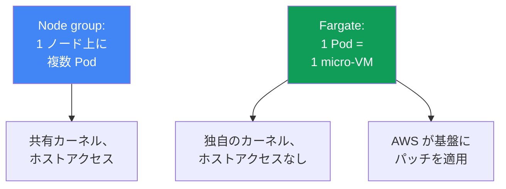
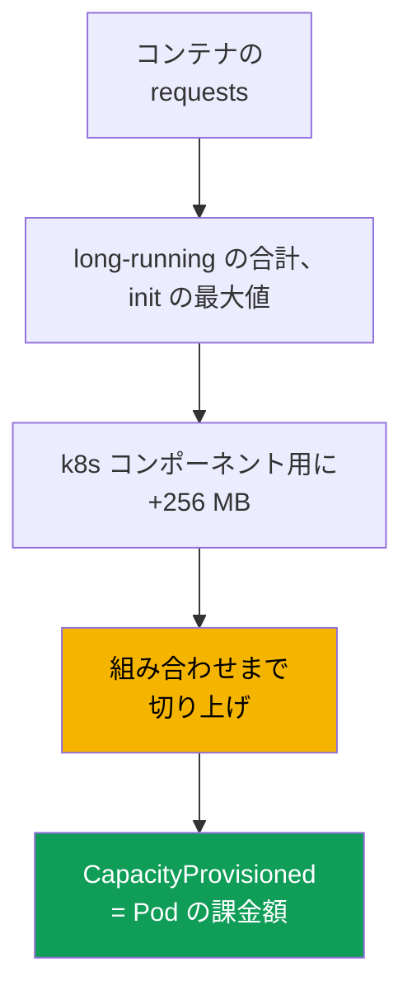

[Eng version](en.md) · [Versión en español](es.md) · [Version française](fr.md) · [Deutsche Version](de.md) · [Русская версия](ru.md) · [ქართული ვერსია](ge.md) · [繁體中文版](tw.md)
# 第15章. Fargate: プロファイル、制約、コスト、ユースケース

> **この先。** 4 種類のコンピュートとその中での Fargate の位置付けは第9章で概説しています。本章では、Pod がプロファイル経由で Fargate に配置される仕組み、リソースの割り当て、固定された制約、コストを具体的に扱います。requests と limits のサイジングは第14章、pod execution role および IRSA/Pod Identity による Pod の AWS アクセスは第16-17章、永続ストレージの EFS は第24章、ロードバランサーと target-type `ip` は第26-27章、ログとオブザーバビリティは第33-34章を参照してください。独立したモードとしての Auto Mode は第9章です。

## 15.1. 「ノード不要のために Fargate を選んだが、後で壁に突き当たった」

チームが Fargate を選ぶ理由は単純です。ノードを管理したくないのです。クラスターを立ち上げ、Pod は実行され、運用は手間なく見えます。しかし、ワークロードがすでに本番に載ってから、後になって知る制約が次々と明らかになります。

- セキュリティ要件で runtime agent を DaemonSet として配置する必要がある。しかし Fargate では **DaemonSet はサポートされず**、agent を置く場所はなく、各 Pod の sidecar にするしかない。
- ネットワークまたはシステムツール用に privileged コンテナが必要になる。しかし Fargate では **privileged は禁止**で、Pod は起動しない。
- 1 vCPU を要求した Pod が `kubectl describe` では 2 vCPU になっている。Fargate が要求を最も近い許容組み合わせへ**切り上げた**ためで、その分を支払う。
- GPU ワークロードが来た。しかし Fargate には **GPU がなく**、Pod の配置先がない。
- Fluent Bit を DaemonSet で収集するログに慣れていたが、それも使えず、ロギングの構成が異なる。

これらの問題は初日には見えません。いずれも、Fargate がノードを取り除く代わりに、**厳格な枠組みを課す**ことの結果です。これは公正な交換です。ノードの柔軟性を手放し、AWS 自身がパッチ適用と保守を行う基盤を得ます。本章では、その境界を理解して Fargate を選べるよう、制約を具体的に解説します。「ノードがないなら簡単」という惰性で決めるためではありません。

## 15.2. Fargate を具体的に理解する

Fargate では Pod は専用の **micro-VM** 上で実行されます。独自のカーネル、CPU、メモリ、ネットワークインターフェイスを持ち、ほかの Pod と共有しません。node group のような共有ノードはなく、**1 Pod は 1 VM** です。ホストアクセスはありません。あなたの意味でのホストは存在せず、Pod が見える単位のすべてだからです。

このモデルから生じる実務上の結果は次のとおりです。

- **Pod ごとの分離。** コンテナからの脱出が他の Pod のリソースへのアクセスにはつながりません。境界はカーネル namespace ではなく VM にあります。これは通常のコンテナ分離に重ねる defense-in-depth です。
- **AWS が基盤を保守する。** micro-VM の OS とカーネルのパッチ、実行環境の更新は AWS 側の責任です。EKS は Fargate Pod に定期的にパッチを適用し、再作成する場合があります（15.5 を参照）。
- **記述するのは Pod だけ。** インスタンスタイプ、ASG、launch template、`max-pods`、bootstrap を選ぶ必要はありません。Pod spec が入力のすべてです。

この単純さの裏側は固定された機能セットです。ノードまたはホストアクセスを必要とするものは、原理的に Fargate では利用できません（15.5節）。



## 15.3. Fargate プロファイル: Pod が Fargate に配置される仕組み

Pod 自身は、自分が Fargate 上にいることを「知りません」。決定するのは、どの Pod を Fargate で実行するかを記述するクラスター単位のオブジェクトである **Fargate プロファイル**です。マッチングは **selector** により行われます。各 selector には必ず `namespace` があり、任意で `labels` を指定できます。labels なしで namespace だけを指定する selector では、その namespace の**すべて**の Pod が Fargate に移動します。

ドキュメントで確認されたプロファイルの規則は次のとおりです。

- プロファイルには最大 **5 個の selector** を含められ、それぞれで namespace の指定が必須です。
- Pod はプロファイルの selector の**少なくとも 1 つ**に一致すれば Fargate に配置されます。
- Pod が複数プロファイルに一致する場合、Pod ラベル `eks.amazonaws.com/fargate-profile: <プロファイル名>` で特定のプロファイルを選びます。
- プロファイルは作成後に**変更できません**。変更するには新しいものを作成し、古いものを削除します。
- プロファイルを削除すると、その Pod は停止して `Pending` になります。
- **プライベートサブネットのみ**（Internet Gateway への直接ルートなし）を使用します。Fargate Pod にパブリック IP は割り当てられません。

EKS 内部では、標準の kube-scheduler と並んで専用の **fargate-scheduler** と、一連の mutating/validating admission controller が動作します。Pod がプロファイルに一致すると、これらの controller がそれを認識して Fargate に送ります。プロファイル作成時には **pod execution role** が必須です。このロールにより、基盤上の `kubelet` がクラスターに登録し、ECR からイメージを pull します（Pod の AWS アクセスの詳細は第16-17章）。Fargate Pod に対する affinity/anti-affinity ルールは適用されず、Fargate は現在 `topologySpreadConstraints` もサポートしていません。

```bash
# プロファイルを作成: namespace batch の Pod とラベル付き Helm リリースを Fargate に配置する
aws eks create-fargate-profile --cluster-name demo --fargate-profile-name batch \
  --pod-execution-role-arn arn:aws:iam::111122223333:role/eksFargatePodRole \
  --subnets subnet-0abc subnet-0def \
  --selectors namespace=batch namespace=jobs,labels={compute=fargate}
aws eks list-fargate-profiles --cluster-name demo
aws eks describe-fargate-profile --cluster-name demo --fargate-profile-name batch
```

同じプロファイルを宣言的に記述すると（たとえば `eksctl` または Terraform 経由）、次のようになります。

```yaml
fargateProfiles:
  - name: batch
    podExecutionRoleARN: arn:aws:iam::111122223333:role/eksFargatePodRole
    subnets: [subnet-0abc, subnet-0def]   # プライベートのみ
    selectors:
      - namespace: batch                  # namespace 全体
      - namespace: jobs
        labels:
          compute: fargate                # このラベルがある Pod のみ
```

## 15.4. リソースの割り当て方

Fargate では Pod サイズを任意に指定できません。コンテナの `requests` の合計を取り、固定されたセットにある最も近い許容 vCPU/メモリ組み合わせまで**切り上げ**ます。ドキュメント上の算出ロジックは次のとおりです。

- すべての長時間実行コンテナの `requests` を**合計**します。
- init container はそのうちの**最大値**を取ります。
- この 2 つの値から**大きい方**を選び、それが Pod の要求になります。
- Kubernetes コンポーネント（`kubelet`、`kube-proxy`、`containerd`）のため、メモリに **256 MB** が追加されます。
- vCPU とメモリの両方をまったく指定しない場合、最小の `.25 vCPU / 0.5 GB` 組み合わせが使われます。

Fargate は **1 VM に 1 Pod** を実行するため、すべての Pod は QoS `Guaranteed` になります。全コンテナで `requests` は `limits` と等しくなければなりません。requests を意識して設定することが重要です。低く設定すれば Pod は limit に達し、高く設定するか段階の間に不運に収まれば、切り上げ分を余計に支払います。典型例では、`1 vCPU / 8 GB` の要求は 256 MB を加えると `1 vCPU / 8 GB` の組み合わせに収まらず、`2 vCPU / 9 GB` としてプロビジョニングされます。実際に割り当てられた容量は Pod の `CapacityProvisioned` annotation で確認できます。

| vCPU | 利用可能なメモリ |
|---|---|
| .25 vCPU | 0.5 GB、1 GB、2 GB |
| .5 vCPU | 1 GB、2 GB、3 GB、4 GB |
| 1 vCPU | 2 GB から 8 GB、1 GB 刻み |
| 2 vCPU | 4 GB から 16 GB、1 GB 刻み |
| 4 vCPU | 8 GB から 30 GB、1 GB 刻み |
| 8 vCPU | 16 GB から 60 GB、4 GB 刻み |
| 16 vCPU | 32 GB から 120 GB、8 GB 刻み |

`kubectl get nodes` が Fargate ノードに表示するサイズは Pod 容量とは**無関係**で、通常はより大きくなります。実際の容量はノードの行ではなく、`kubectl describe pod` の `CapacityProvisioned` annotation で確認します。



## 15.5. 具体的な制約

Fargate の制約は厳格で、ドキュメントにより確認されています。ワークロードを Fargate に載せられるかどうかのチェックリストとして、表にしておくと便利です。

| 制約 | できないこと | 回避策 |
|---|---|---|
| DaemonSet | ノード agent を DaemonSet として実行できない | 各 Pod の sidecar |
| privileged | privileged コンテナは禁止 | 必要性を見直す |
| HostNetwork / HostPort | Pod spec に指定できない | 通常の Service |
| HostPath | ホストの FS にアクセスできない | エフェメラルボリュームまたは EFS |
| GPU | Fargate では GPU を利用できない | GPU 付き node group |
| Storage | エフェメラルボリュームと EFS のみ | EBS はマウントされない |
| エフェメラルディスク | デフォルト 20 GiB、最大 175 GiB | requests の `ephemeral-storage` |
| ロードバランサー | target-type `ip` のみ | そのように設定する（第26-27章） |
| IMDS | Pod は EC2 メタデータにアクセスできない | IRSA / Pod Identity（第16-17章） |
| ノードアクセス | SSH もホストアクセスもない | Pod 内でデバッグする |
| その他 | Fargate Spot、EBS、代替 CNI、Outposts/Local Zones はない | node group |

いくつかの項目は詳しく説明する価値があります。**エフェメラルディスク**では、各 Pod はデフォルトで 20 GiB を得ますが、有効な容量は 20 GiB より少し小さくなります（`kubelet` と Pod 内のモジュールが一部を占有します）。`ephemeral-storage` の `requests` により **175 GiB** まで増やせます。このとき Fargate は余裕を持ってプロビジョニングします（100 GiB の要求は 115 GiB のタスクになります）。ディスクはデフォルトで暗号化され、Pod とともに削除されます。**永続ストレージ**は静的プロビジョニングの EFS のみで、DaemonSet による driver のインストールなしに自動マウントされます（詳細は第24章）。**ネットワーク**では Fargate は VPC CNI を使用し、置き換えられません。NLB と ALB は target-type `ip` でのみ動作します（第26-27章）。**パッチ適用**では、EKS が Fargate Pod に定期的にパッチを適用し、Pod を穏やかに退避できない場合は削除することがあります。PDB と適切な graceful shutdown で保護してください（第40章）。

エフェメラルディスクの拡張は、Pod spec の requests と limits に `ephemeral-storage` を直接指定します（Pod は `Guaranteed` なので両者は等しい）。これにより vCPU とメモリの他の段階は変わりません。

```yaml
resources:
  requests:
    cpu: "1"
    memory: 2Gi
    ephemeral-storage: 100Gi   # 最大 175Gi、Fargate は余裕を持ってプロビジョニング
  limits:
    cpu: "1"
    memory: 2Gi
    ephemeral-storage: 100Gi   # requests = limits
```

## 15.6. コスト

Fargate の料金モデルは、node group のものと本質的に異なります。node group では、Pod がどれだけ詰まっているかにかかわらず、**インスタンス**全体に対して支払います。Fargate では、Pod 自体に割り当てられた **vCPU とメモリ**に、その生存時間に対して秒単位（最小時間間隔あり）で支払います。価格を決めるのは要求値ではなく、`CapacityProvisioned` annotation にある**切り上げ後の**組み合わせです。

| 観点 | Node group | Fargate |
|---|---|---|
| 課金単位 | EC2 インスタンス全体 | Pod の vCPU とメモリ |
| アイドル時の料金 | あり。空のノードにも課金 | なし。生きている Pod のみ |
| packing のオーバーヘッド | 自分で Pod を詰める | packing は考慮不要 |
| リソース単価 | 低い | 高い |
| 切り上げ | なし | 組み合わせまで上方向 |
| Spot 割引 | あり | なし。EKS の Fargate Spot は未サポート |

数値を使わない経済性の結論は次のとおりです。リソース単位では Fargate はノードより**高価**ですが、アイドル状態のノード容量には支払わず、packing の労力も必要ありません。**断続的な**ワークロード（Job、まれに使われるサービス）では有利になりがちです。ピークの間にアイドル状態のノードを維持しなくてよいからです。**安定した大規模な** 24/7 ワークロードでは、通常ノードの方が安価です。リソース単価が低く、アイドル状態もほとんどないためです。構造的には、比率を決めるのは利用率です。平均負荷が低いほど（まばら、周期的、低頻度なタスクほど）Fargate は有利です。24時間 100% に近い利用率では、単位リソースあたりのプレミアムが常に占有された容量に掛かるため、Fargate はノードより何倍も高くなります。もう一つの落とし穴は完了済み Job です。その Pod は残り、Fargate では料金が発生し続けるため、`ttlSecondsAfterFinished` を設定します。コストの詳細な分析は第43章です。

## 15.7. Fargate が適する場所と適さない場所

Fargate は特定のタスクのためのツールであり、すべてにおけるノードの代替ではありません。以下に、適する場合と反する場合を示します。

| 適する | 適さない |
|---|---|
| 隔離された、信頼できないワークロード | DaemonSet agent（セキュリティ、ログ）が必要 |
| 断続的な負荷の Job/batch 群 | GPU ワークロード |
| ノードを運用したくない小規模サービス | 権限昇格またはノードアクセスが必要 |
| 別 namespace のシステム Pod | 小さな Pod の高密度配置（高価） |
| node group なしでクラスターを迅速に開始 | 安定した大規模 24/7 ワークロード |

考え方は単純です。**適する**のは、Pod ごとの分離が価値を持つ場合（micro-VM がコンテナ脱出に対する境界を提供する）、ワークロードが弾力的でアイドルノードを維持したくない場合、サービスが小さくノード管理が割に合わない場合、node group の手間なしにクラスターを迅速に立ち上げる必要がある場合です。**適さない**のは、15.5 の禁止機構のいずれか（DaemonSet、GPU、privileged、ホストアクセス）が必要な場合、または Fargate にとって経済性が悪い場合です。つまり、切り上げと単位リソースあたりのプレミアムが請求額に影響する多数の小さな Pod、またはノードの方が安い均一な 24/7 負荷です。

## 15.8. Fargate のログとオブザーバビリティ

Fargate では Fluent Bit を DaemonSet として使う従来のログ収集方式は**動作しません**。ここには DaemonSet がないためです。代わりに、Fargate は**組み込みのロギング機構**を提供します。標準の Fargate log router を通じて Fluent Bit を有効化し、namespace `aws-observability` の ConfigMap `aws-logging` で設定すると、クラスターに agent をインストールせずにログが CloudWatch Logs または別の送信先へ送られます。設定詳細とログコストの管理は第34章です。

この機構は静かです。誤った設定でも Pod は動作し、ログがないだけで、エラーもイベントも発生しません。アプリケーションに問題を探す前に確認すべき 3 つの理由があります。

- **権限が誤ったロールにある。** log router が送信先に書き込むときに使用するのは、IRSA または Pod Identity による Pod ロールではなく、そのプロファイルの **pod execution role** です。CloudWatch にはこのロールに `logs:CreateLogGroup`、`logs:CreateLogStream`、`logs:DescribeLogStreams`、`logs:PutLogEvents` を含むポリシーを付与します。なければログは黙って破棄されます。アプリケーションのロールが完全に設定されていても、ログとは何の関係もない典型例です（第16、17章）。
- **namespace にラベルがない。** Namespace は `aws-observability` という名前で、`aws-observability: enabled` ラベルを持つ必要があります。ラベルがなければ設定は読み込まれません。
- **送信先へのネットワーク経路がない。** Fargate Pod はプライベートサブネットにのみ配置されるため、CloudWatch Logs には NAT 経由のルートまたは interface endpoint が必要です（第0.3章と第31章）。

Fargate Pod のメトリクスは標準的な方法（Container Insights、Prometheus）で収集します。ただし、DaemonSet のノード exporter もないことを考慮します。通常ノード上に存在するものは、Fargate では組み込みか Pod レベルで収集されます。メトリクスの詳細は第33章です。

## 15.9. Fargate とノードを組み合わせる方法

Fargate とノードは 1 つのクラスター内に存在し、control plane を共有します。典型的な構成では、**namespace ごとに**分離します。一部の namespace は Fargate プロファイルに引き寄せられ、ほかは node group または Auto Mode に配置されます。Fargate プロファイルは namespace と labels でマッチするため、境界は taint ではなくそれらにあります（taints と tolerations はノードのためのものです）。

よくあるパターンは、**システム基盤**（CoreDNS、controller、monitoring）を予測可能なノードに置き、**隔離されたまたはバッチワークロード**を別 namespace の Fargate に渡すことです。別の方法は、完全な「ノードなし」スタートです。アプリケーションが少ない間はすべて Fargate に置き、成長に従って Fargate が不得意なもの（GPU、高密度の小さな Pod、安定した負荷）のために node group を追加します。どこに配置されたかの確認には `-o wide` が役立ちます。Fargate Pod は `fargate-ip-...` 形式の名前を持つ「ノード」に配置されます。

```bash
kubectl get pods -n batch -o wide      # Fargate Pod の NODE: fargate-ip-10-0-...
kubectl describe pod -n batch <pod>    # CapacityProvisioned annotation を確認
```

完全にノードなしのクラスターが必要なら、CoreDNS も Fargate に移します。デフォルトでは、annotation `eks.amazonaws.com/compute-type: ec2` によりその Pod は EC2 に維持されます。移行は 3 段階です。CoreDNS ラベルの selector を持つ `kube-system` 用プロファイルを作成し、annotation を削除して、Pod を再作成します。

```bash
# 1. CoreDNS 用 selector を持つ kube-system プロファイル（ラベル k8s-app=kube-dns）
aws eks create-fargate-profile --cluster-name demo \
  --fargate-profile-name fp-kube-system \
  --pod-execution-role-arn arn:aws:iam::111122223333:role/eksFargatePodRole \
  --subnets subnet-0abc subnet-0def \
  --selectors namespace=kube-system,labels={k8s-app=kube-dns}
# 2. CoreDNS を EC2 に維持する annotation を削除
kubectl patch deployment coredns -n kube-system --type json \
  -p '[{"op":"remove","path":"/spec/template/metadata/annotations/eks.amazonaws.com~1compute-type"}]'
# 3. Pod を再作成すると Fargate に移動する
kubectl rollout restart deployment coredns -n kube-system
```

## 15.10. 本番での適用方法

- **プロファイルの selector を狭く保つ**: 「namespace 全体」ではなく namespace と label を組み合わせ、余計なものが Fargate に移動して請求額が気付かないうちに増えることを防ぎます。
- **requests は意識して設定し、limits と等しくする**: Fargate の Pod は常に `Guaranteed` であり、切り上げによって段階間のずれに料金がかかります。
- **Job に `ttlSecondsAfterFinished` を設定する**: 完了済み Pod も、削除されるまで Fargate の料金を発生させ続けます。
- **ログは組み込みの Fargate log router**（ConfigMap `aws-logging`）で設定し、存在しない DaemonSet を配置しようとしません。
- **移行前に 15.5 の制約チェックリストを通す**: DaemonSet、GPU、privileged、ノードアクセスが必要かを確認します。必要ならワークロードは Fargate ではなく node group に置きます。
- **Fargate とノードを namespace で分離**し、システム基盤は予測可能なノードに維持します。

## 15.11. ミニ用語集

- **Fargate プロファイル**: selector（namespace と任意の labels）、pod execution role、プライベートサブネットを持つクラスター単位のオブジェクト。どの Pod を Fargate に配置するかを決めます。変更はできず、再作成のみです。
- **Pod execution role**: Fargate 基盤の `kubelet` がクラスターへ登録し、ECR からイメージを pull するための IAM ロール。プロファイル作成時に設定します。組み込み log router もこのロールで送信先にログを書き込むため、ログ書き込み権限はこのロールに必要です。
- **fargate-scheduler**: kube-scheduler と並んで動作し、プロファイルに一致する Pod を Fargate に送る EKS scheduler。
- **CapacityProvisioned**: 切り上げ後に実際に割り当てられた vCPU とメモリの組み合わせを持つ Pod annotation。これがコストを決定します。
- **Micro-VM**: 独自のカーネル、CPU、メモリ、ネットワークインターフェイスを持ち、1 Pod 専用の仮想マシン。Fargate の分離境界です。

## 15.12. この章のまとめ

- Fargate では Pod は独立した micro-VM です。独自のカーネルとリソースを持ち、ホストアクセスはなく、AWS が基盤にパッチを適用します。記述するのは Pod だけです。
- Pod はプロファイルを介して Fargate に配置されます。selector は namespace と labels（最大 5 個）、pod execution role、プライベートサブネットからなり、プロファイルは変更不可で、fargate-scheduler が動作します。
- リソースは固定された vCPU とメモリの組み合わせまで切り上げられ、Kubernetes コンポーネント用に 256 MB が追加されます。Pod は常に `Guaranteed` で、requests は limits と等しくなります。
- 制約は厳格です。DaemonSet、privileged、HostNetwork/HostPort/HostPath、GPU、EBS、Fargate Spot、ノードアクセスはありません。storage はエフェメラル（デフォルト 20 GiB、最大 175 GiB）と EFS のみで、ロードバランサーは target-type `ip` のみです。
- 料金は Pod の生存時間に対する vCPU とメモリに、秒単位で、切り上げ後の組み合わせに基づいて発生します。単位あたりではノードより高価ですが、アイドル料金はありません。24/7 ワークロードでは通常ノードの方が安価です。
- Fargate は分離、バッチや小規模ワークロード、迅速なスタートに適しています。DaemonSet、GPU、privileged、ホストアクセス、高密度、安定した大規模ワークロードには適しません。
- ログは DaemonSet ではなく組み込みの Fargate log router を経由します。Fargate とノードは namespace で分離します。

## 15.13. 実務での役立て方

Fargate の決定は、ワークロードが本番に入る前に境界を選ぶことです。開始時に制約チェックリストを通せば、「DaemonSet agent が必要か」「GPU は必要か」「ノードアクセスは必要か」「切り上げ時にいくらかかるか」という質問に前もって答えられます。セキュリティチームが配置場所のない agent を求めた時点で答えるのではありません。当番では、Pod が Fargate にあると理解すればデバッグの境界がすぐに定まります。ノードには入れず、ノード exporter はなく、容量はノードの行ではなく annotation で確認します。また、Fargate は Pod 単位で課金され上方向に切り上げるという知識は、個別にそれぞれの段階まで切り上げられた多数の小さな Pod の請求額に驚かないために役立ちます。

## 15.14. 自己確認の質問

1. Fargate で Pod が micro-VM に等しいのはなぜで、分離の観点から何をもたらしますか。
2. Pod はどのように Fargate に配置され、プロファイルの selector には何が必須ですか。
3. プロファイルに pod execution role が必要なのはなぜで、プロファイルを変更できないのはなぜですか。
4. Fargate Pod にプライベートサブネットだけが必要なのはなぜですか。
5. Fargate は要求された vCPU とメモリをどのように算出・切り上げますか。256 MB は何のためですか。
6. Fargate の全 Pod が `Guaranteed` なのはなぜで、requests と limits にとって何を意味しますか。
7. 実際に割り当てられた Pod 容量はどこで確認し、なぜノードの行では確認しないのですか。
8. Fargate の制約を 5 つと、可能ならそれぞれの回避策を挙げてください。
9. エフェメラルディスクのデフォルト容量はどれだけで、どこまで増やせますか。
10. Fargate の料金モデルは node group とどう異なり、どのような場合にノードが安くなりますか。
11. Fargate が適するシナリオと、明らかに適さないシナリオは何ですか。
12. DaemonSet がサポートされない Fargate では、ログ収集はどのように構成しますか。
13. 1 つのクラスターで Fargate とノードをどのように分離し、どこに配置されたかをどう確認しますか。

## 実践

このトピックのコースラボ: [ラボ 112 - Fargate プロファイル: 動作するもの、壊れるもの、コスト比較](../../labs/112/README_JP.MD)。これに加え、実際のクラスターでもプロファイルと Fargate の挙動を確認できます。まずインベントリを確認します。`aws eks list-fargate-profiles --cluster-name <cluster>` はプロファイルを表示し、`aws eks describe-fargate-profile --cluster-name <cluster> --fargate-profile-name <name>` は namespace と label の selector、サブネット、pod execution role を表示します。サブネットがプライベートで、selector が狭いことを確認してください。

次に Pod を確認します。`kubectl get pods -A -o wide` では、Fargate Pod は `fargate-ip-...` という名前の「ノード」に表示されます。各 namespace での `kubectl describe pod <pod>` では `CapacityProvisioned` annotation を得られます。これを requests で要求したものと比較し、切り上げにどれだけのコストがかかったかを確認します。自分のワークロードに対して 15.5 の制約チェックリストを通してください。DaemonSet、GPU、privileged、ノードアクセスが必要かを確認し、どの namespace を Fargate に渡し、どれをノードに残すべきかを率直に決めます。

---
[目次](../README_JP.md) · [第14章](../14/jp.md) · [第16章](../16/jp.md)
