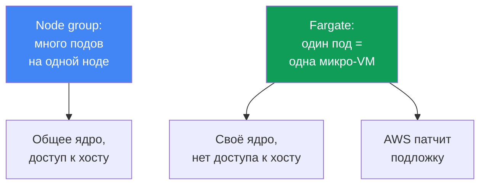
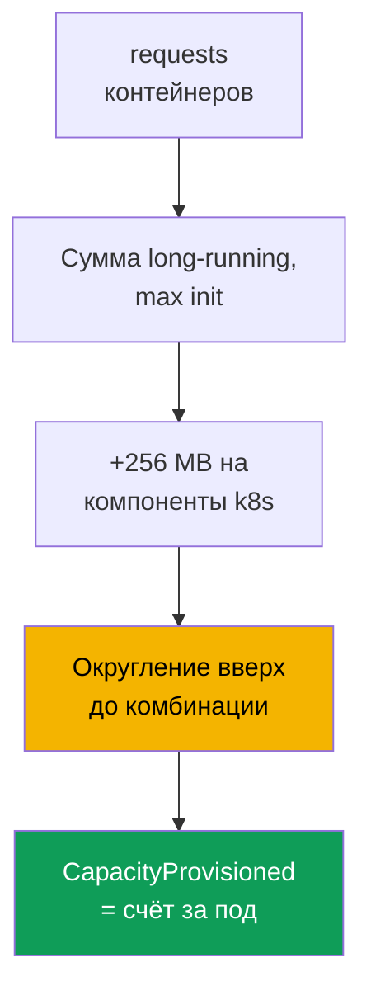

[Eng version](en.md) · [Versión en español](es.md) · [Version française](fr.md) · [Deutsche Version](de.md) · [ქართული ვერსია](ge.md) · [繁體中文版](tw.md) · [日本語版](jp.md)
# Глава 15. Fargate: профили, ограничения, стоимость, сценарии применения

> **Что дальше.** Четыре типа вычислений и место Fargate среди них - глава 9, там он дан
> обзорно. Здесь предметно: как под попадает на Fargate через профиль, как выделяются ресурсы,
> какие ограничения жёстко зашиты и во что это обходится. Сайзинг requests и limits - глава 14,
> доступ подов к AWS через pod execution role и IRSA/Pod Identity - главы 16-17, EFS для
> постоянного хранения - глава 24, балансировщики и target-type `ip` - главы 26-27, логи и
> наблюдаемость - главы 33-34. Auto Mode как отдельный режим - глава 9.

## 15.1. «Взяли Fargate ради без нод, а потом упёрлись в стену»

Команда выбирает Fargate из простого желания: не хочется управлять нодами. Кластер поднят,
поды бегут, эксплуатация выглядит невесомой. А потом одно за другим всплывают ограничения, о
которых узнают поздно, когда нагрузка уже в проде:

- безопасность требует поставить runtime-агент DaemonSet'ом - на Fargate **DaemonSet не
  поддерживается**, агента ставить некуда, только sidecar'ом в каждый под;
- нужен привилегированный контейнер для сетевого или системного инструмента - **privileged на
  Fargate запрещён**, под не стартует;
- заказывали под на 1 vCPU, а в `kubectl describe` видно 2 vCPU - Fargate **округлил** запрос
  до ближайшей допустимой комбинации, и вы платите за неё;
- пришла GPU-нагрузка - **GPU на Fargate нет**, под некуда посадить;
- логи привыкли собирать DaemonSet'ом Fluent Bit - его тоже нет, логирование устроено иначе.

Ни одна из проблем не видна в первый день. Все они - следствие того, что Fargate снимает ноды,
но **взамен накладывает жёсткие рамки**. Это честная сделка: вы отдаёте гибкость ноды и
получаете подложку, которую AWS сам патчит и обслуживает. Эта глава разбирает рамки предметно,
чтобы решение по Fargate принималось со знанием границ, а не по инерции «без нод - значит
проще».

## 15.2. Что такое Fargate предметно

На Fargate под запускается на выделенной **микро-VM**: у неё своё ядро, свои CPU и память,
свой сетевой интерфейс, не разделяемые ни с каким другим подом. Общих нод, как в node group,
здесь нет - **один под равен одной VM**. Доступа к хосту нет, потому что хоста в вашем
понимании не существует: под и есть вся видимая единица.

Практические следствия такой модели:

- **Изоляция per-pod.** Побег из контейнера не даёт доступа к ресурсам других подов: граница
  проходит по VM, а не по namespace ядра. Это defense-in-depth поверх обычной изоляции
  контейнеров.
- **AWS обслуживает подложку.** Патчи ОС и ядра микро-VM, обновление среды исполнения - на
  стороне AWS. EKS периодически патчит Fargate-поды и может их пересоздавать (см. 15.5).
- **Вы описываете только под.** Никакого выбора типа инстанса, ASG, launch template, `max-pods`
  и bootstrap. Спека пода - это весь ваш ввод.

Обратная сторона этой простоты - фиксированный набор возможностей: то, что требует ноды или
доступа к хосту, на Fargate недоступно в принципе (раздел 15.5).



## 15.3. Fargate-профили: как под попадает на Fargate

Под сам по себе не «знает», что он на Fargate. Решение принимает **Fargate-профиль** - объект
уровня кластера, который описывает, какие поды запускать на Fargate. Матчинг идёт по
**селекторам**: каждый селектор обязательно содержит `namespace` и опционально `labels`. Если
селектор задан только namespace без labels, на Fargate уходят **все** поды этого namespace.

Правила профиля, проверенные по документации:

- в профиле до **пяти селекторов**, каждый обязан указывать namespace;
- под попадает на Fargate, если совпал **хотя бы с одним** селектором профиля;
- если под подходит под несколько профилей, конкретный выбирают лейблом пода
  `eks.amazonaws.com/fargate-profile: <имя-профиля>`;
- профиль **нельзя изменить** после создания: чтобы поменять, создают новый и удаляют старый;
- при удалении профиля его поды останавливаются и переходят в `Pending`;
- только **приватные подсети** (без прямого маршрута в Internet Gateway) - Fargate-подам не
  выдаются публичные IP.

Внутри EKS работает отдельный планировщик **fargate-scheduler** рядом со штатным kube-scheduler
плюс набор mutating/validating admission-контроллеров. Когда под подходит под профиль, эти
контроллеры распознают его и направляют на Fargate. При создании профиля обязателен **pod
execution role** - роль, с которой `kubelet` на подложке регистрируется в кластере и тянет
образы из ECR (детали доступа подов к AWS - главы 16-17). Правила affinity/anti-affinity к
Fargate-подам не применяются, а `topologySpreadConstraints` Fargate пока не поддерживает.

```bash
# Создать профиль: поды из namespace batch и helm-релизы с меткой уходят на Fargate
aws eks create-fargate-profile --cluster-name demo --fargate-profile-name batch \
  --pod-execution-role-arn arn:aws:iam::111122223333:role/eksFargatePodRole \
  --subnets subnet-0abc subnet-0def \
  --selectors namespace=batch namespace=jobs,labels={compute=fargate}
aws eks list-fargate-profiles --cluster-name demo
aws eks describe-fargate-profile --cluster-name demo --fargate-profile-name batch
```

Тот же профиль в декларативном виде (например, через `eksctl` или Terraform) выглядит так:

```yaml
fargateProfiles:
  - name: batch
    podExecutionRoleARN: arn:aws:iam::111122223333:role/eksFargatePodRole
    subnets: [subnet-0abc, subnet-0def]   # только приватные
    selectors:
      - namespace: batch                  # весь namespace
      - namespace: jobs
        labels:
          compute: fargate                # только поды с этой меткой
```

## 15.4. Как выделяются ресурсы

Fargate не даёт произвольный размер пода. Он берёт сумму `requests` контейнеров и **округляет
её вверх** до ближайшей допустимой комбинации vCPU и памяти из фиксированного набора. Логика
подсчёта по документации:

- по всем долгоживущим контейнерам `requests` **складываются**;
- по init-контейнерам берётся **максимум** одного из них;
- из этих двух значений выбирается **большее** - оно и идёт в запрос пода;
- к памяти добавляется **256 MB** на компоненты Kubernetes (`kubelet`, `kube-proxy`,
  `containerd`);
- если vCPU и память не заданы вовсе, берётся **минимальная** комбинация `.25 vCPU / 0.5 GB`.

Поскольку Fargate запускает **один под на VM**, все поды идут с QoS `Guaranteed`: `requests`
должны равняться `limits` для всех контейнеров. Ставить requests осознанно критично: занизили -
под упрётся в лимит, завысили или неудачно попали между ступенями - переплата за округление.
Классический пример: запрос `1 vCPU / 8 GB` после добавления 256 MB не влезает в комбинацию
`1 vCPU / 8 GB` и провижнится как `2 vCPU / 9 GB`. Фактическую выданную ёмкость видно в
аннотации `CapacityProvisioned` у пода.

| vCPU | Доступная память |
|---|---|
| .25 vCPU | 0.5 GB, 1 GB, 2 GB |
| .5 vCPU | 1 GB, 2 GB, 3 GB, 4 GB |
| 1 vCPU | от 2 GB до 8 GB, шаг 1 GB |
| 2 vCPU | от 4 GB до 16 GB, шаг 1 GB |
| 4 vCPU | от 8 GB до 30 GB, шаг 1 GB |
| 8 vCPU | от 16 GB до 60 GB, шаг 4 GB |
| 16 vCPU | от 32 GB до 120 GB, шаг 8 GB |

Размер, который `kubectl get nodes` показывает для Fargate-ноды, **не связан** с ёмкостью пода
и обычно больше. Реальную ёмкость смотрят через `kubectl describe pod` по аннотации
`CapacityProvisioned`, а не по строке ноды.



## 15.5. Ограничения предметно

Ограничения Fargate жёсткие и проверяются по документации. Их удобно держать таблицей: это
чек-лист «пойдёт нагрузка на Fargate или нет».

| Ограничение | Что именно нельзя | Обход |
|---|---|---|
| DaemonSet | узловые агенты DaemonSet'ом не идут | sidecar в каждый под |
| privileged | привилегированные контейнеры запрещены | пересмотреть потребность |
| HostNetwork / HostPort | нельзя указать в спеке пода | обычный Service |
| HostPath | доступа к ФС хоста нет | эфемерный том или EFS |
| GPU | GPU на Fargate недоступны | node group с GPU |
| Storage | только эфемерный том и EFS | EBS не монтируется |
| Эфемерный диск | по умолчанию 20 GiB, максимум 175 GiB | `ephemeral-storage` в requests |
| Балансировщики | только target-type `ip` | так и настраивать (главы 26-27) |
| IMDS | метаданные EC2 подам недоступны | IRSA / Pod Identity (главы 16-17) |
| Доступ к ноде | ни SSH, ни доступа к хосту | отладка внутри пода |
| Прочее | нет Fargate Spot, EBS, альтернативного CNI, Outposts/Local Zones | node group |

Несколько пунктов стоит раскрыть. **Эфемерный диск**: каждый под получает по умолчанию 20 GiB,
причём полезного объёма чуть меньше 20 GiB (часть занимает `kubelet` и модули внутри пода);
увеличить можно до **175 GiB** через `requests` на `ephemeral-storage`, при этом Fargate
провижнит с запасом (запрос 100 GiB даёт задачу со 115 GiB). Диск шифруется по умолчанию и
удаляется вместе с подом. **Постоянное хранение** - только EFS, статическим провижнингом,
монтируется автоматически без установки драйвера DaemonSet'ом (детали - глава 24). **Сеть**:
на Fargate стоит VPC CNI, заменить его нельзя; балансировщики NLB и ALB работают только с
target-type `ip` (главы 26-27). **Патчинг**: EKS периодически патчит Fargate-поды и, если под
не удаётся вытеснить мягко, может его удалить - защищайтесь через PDB и корректный graceful
shutdown (глава 40).

Расширение эфемерного диска задаётся прямо в спеке пода через `ephemeral-storage` в requests и
limits (они равны, под `Guaranteed`); прочие ступени vCPU и памяти при этом не меняются:

```yaml
resources:
  requests:
    cpu: "1"
    memory: 2Gi
    ephemeral-storage: 100Gi   # до 175Gi, Fargate провижнит с запасом
  limits:
    cpu: "1"
    memory: 2Gi
    ephemeral-storage: 100Gi   # requests = limits
```

## 15.6. Стоимость

Модель оплаты Fargate отличается от нод по сути. За node group вы платите за **инстанс**
целиком, независимо от того, насколько он заполнен подами. За Fargate вы платите за **vCPU и
память, выделенные самому поду**, за время его жизни, посекундно с минимальным интервалом. Цену
определяет не запрос, а **округлённая** комбинация из аннотации `CapacityProvisioned`.

| Аспект | Node group | Fargate |
|---|---|---|
| Единица оплаты | инстанс EC2 целиком | vCPU и память пода |
| Плата за простой | да, за пустую ноду тоже | нет, только за живой под |
| Накладные на packing | вы упаковываете поды сами | packing не ваша забота |
| Цена за единицу ресурса | ниже | выше |
| Округление | нет | вверх до комбинации |
| Spot-скидка | да | нет, Fargate Spot в EKS не поддержан |

Вывод про экономику без чисел: за единицу ресурса Fargate **дороже** ноды, но вы не платите за
простаивающую ёмкость ноды и не тратите труд на упаковку. На **непостоянной** нагрузке (job'ы,
редкие сервисы) это часто выгоднее: нет нод, простаивающих между пиками. На **стабильной
крупной** нагрузке 24/7 ноды обычно дешевле: ресурс дешевле, а простоя почти нет. Структурно
соотношение задаёт утилизация: чем ниже средняя загрузка (разреженные, периодические, редкие
задачи), тем выгоднее Fargate; при загрузке близко к 100% круглосуточно Fargate выходит кратно
дороже нод, потому что наценка за единицу ресурса умножается на постоянно занятую ёмкость.
Отдельная ловушка - завершённые Job'ы: их поды остаются, и на Fargate это капает в
счёт, поэтому им ставят `ttlSecondsAfterFinished`. Детальный разбор стоимости - глава 43.

## 15.7. Где Fargate уместен, а где нет

Fargate - инструмент под конкретные задачи, а не замена нодам во всём. Ниже - когда он к месту
и когда против.

| Уместен | Не уместен |
|---|---|
| изолированные и недоверенные нагрузки | нужны DaemonSet-агенты (безопасность, логи) |
| пачки job/batch с непостоянной нагрузкой | GPU-нагрузки |
| небольшие сервисы без желания вести ноды | нужны привилегии или доступ к ноде |
| системные поды в отдельном namespace | высокая плотность мелких подов (дорого) |
| быстрый старт кластера без node group | стабильная крупная нагрузка 24/7 |

Логика простая. **Уместен**, когда ценна изоляция per-pod (микро-VM даёт границу на побег из
контейнера), когда нагрузка эластичная и не хочется держать простаивающие ноды, когда сервис
мал и управление нодами не окупается, и когда кластер нужно поднять быстро без возни с node
group. **Не уместен**, когда нужен хоть один из запрещённых механизмов из 15.5 (DaemonSet,
GPU, привилегии, доступ к хосту) или когда экономика против Fargate: много мелких подов, где
округление и наценка за единицу бьют по счёту, либо ровная нагрузка 24/7, где ноды дешевле.

## 15.8. Логи и наблюдаемость на Fargate

Привычная схема сбора логов DaemonSet'ом Fluent Bit на Fargate **не работает** - DaemonSet тут
нет. Вместо неё Fargate предоставляет **встроенный механизм логирования**: вы включаете
Fluent Bit через штатный log router Fargate, задавая конфигурацию в ConfigMap
`aws-logging` в namespace `aws-observability`, и логи уходят в CloudWatch Logs или другой
приёмник без установки агента в кластер. Детали конфигурации и контроль расходов на логи -
глава 34.

Механизм тихий: если он настроен неверно, поды работают, а логов просто нет - ни ошибки, ни
события. Три причины, которые стоит проверить до того, как искать проблему в приложении.

- **Права не на той роли.** Писать в приёмник log router идёт от **pod execution role** того
  профиля, а не от роли пода из IRSA или Pod Identity. Для CloudWatch на эту роль вешают
  политику с `logs:CreateLogGroup`, `logs:CreateLogStream`, `logs:DescribeLogStreams` и
  `logs:PutLogEvents`; без неё логи молча отбрасываются. Это ровно тот случай, когда роль
  приложения настроена идеально и не имеет к логам никакого отношения (главы 16 и 17).
- **Нет метки на namespace.** Namespace обязан называться `aws-observability` и несёт метку
  `aws-observability: enabled`; без метки конфигурация не подхватывается.
- **Нет сетевого пути до приёмника.** Fargate-поды живут только в приватных подсетях, поэтому
  до CloudWatch Logs нужен либо маршрут через NAT, либо interface endpoint (главы 0.3 и 31).

Метрики Fargate-подов собираются штатными способами (Container Insights, Prometheus), с
поправкой на то, что узловых экспортеров DaemonSet'ом тоже не будет: то, что обычно живёт на
ноде, на Fargate либо встроено, либо собирается на уровне пода. Разбор метрик - глава 33.

## 15.9. Как сочетать Fargate с нодами

Fargate и ноды живут в одном кластере и делят control plane. Типовая раскладка разводит их
**по namespace**: одни namespace притягиваются Fargate-профилем, другие идут на node group или
Auto Mode. Fargate-профиль матчит по namespace и labels, поэтому граница проходит именно по
ним, а не по taints (taints и tolerations - для нод).

Частый паттерн: **системную обвязку** (CoreDNS, контроллеры, мониторинг) держат на
предсказуемых нодах, а **изолированные или пакетные нагрузки** отдают на Fargate в отдельный
namespace. Ещё вариант - целиком «безнодовый» старт: пока приложений мало, всё на Fargate, а по
мере роста добавляют node group под то, что Fargate тянет плохо (GPU, плотные мелкие поды,
стабильная нагрузка). Проверить, что где приземлилось, помогает `-o wide`: Fargate-поды стоят
на «нодах» с именами вида `fargate-ip-...`.

```bash
kubectl get pods -n batch -o wide      # NODE у Fargate-подов: fargate-ip-10-0-...
kubectl describe pod -n batch <pod>    # смотреть аннотацию CapacityProvisioned
```

Если нужен полностью безнодовый кластер, на Fargate переносят и CoreDNS. По умолчанию его
поды держит на EC2 аннотация `eks.amazonaws.com/compute-type: ec2`; перенос идёт в три шага:
создать профиль на `kube-system` с селектором по метке CoreDNS, снять аннотацию, пересоздать
поды.

```bash
# 1. профиль kube-system с селектором на CoreDNS (метка k8s-app=kube-dns)
aws eks create-fargate-profile --cluster-name demo \
  --fargate-profile-name fp-kube-system \
  --pod-execution-role-arn arn:aws:iam::111122223333:role/eksFargatePodRole \
  --subnets subnet-0abc subnet-0def \
  --selectors namespace=kube-system,labels={k8s-app=kube-dns}
# 2. снять аннотацию, которая держит CoreDNS на EC2
kubectl patch deployment coredns -n kube-system --type json \
  -p '[{"op":"remove","path":"/spec/template/metadata/annotations/eks.amazonaws.com~1compute-type"}]'
# 3. пересоздать поды - они уедут на Fargate
kubectl rollout restart deployment coredns -n kube-system
```

## 15.10. Как это применяют в продакшене

- **Selectors профиля держат узкими**: namespace плюс label, а не «весь namespace», чтобы на
  Fargate не уезжало лишнее и счёт не рос незаметно.
- **requests ставят осознанно и равными limits**: под на Fargate всегда `Guaranteed`, а
  округление вверх означает, что промах между ступенями оплачивается.
- **Job'ам ставят `ttlSecondsAfterFinished`**: завершённые поды на Fargate продолжают капать в
  счёт, пока их не уберут.
- **Логи заводят через встроенный log router Fargate** (ConfigMap `aws-logging`), а не пытаются
  повесить DaemonSet, которого тут нет.
- **Чек-лист ограничений 15.5 проходят до переноса**: нужен ли DaemonSet, GPU, привилегии,
  доступ к ноде - если да, нагрузка идёт на node group, а не на Fargate.
- **Fargate и ноды разводят по namespace** и держат системную обвязку на предсказуемых нодах.

## 15.11. Мини-глоссарий

- **Fargate-профиль** - объект уровня кластера с селекторами (namespace плюс опционально
  labels), pod execution role и приватными подсетями; определяет, какие поды идут на Fargate.
  Изменить нельзя, только пересоздать.
- **Pod execution role** - IAM-роль, с которой `kubelet` на подложке Fargate регистрируется в
  кластере и тянет образы из ECR; задаётся при создании профиля. От неё же встроенный log
  router пишет логи в приёмник, поэтому права на запись логов нужны именно ей.
- **fargate-scheduler** - планировщик EKS, работающий рядом с kube-scheduler и направляющий
  подходящие под профиль поды на Fargate.
- **CapacityProvisioned** - аннотация пода с реально выданной комбинацией vCPU и памяти после
  округления; именно она определяет стоимость.
- **Микро-VM** - выделенная виртуальная машина под один под со своим ядром, CPU, памятью и
  сетевым интерфейсом; граница изоляции Fargate.

## 15.12. Итоги главы

- На Fargate под равен отдельной микро-VM: своё ядро, свои ресурсы, нет доступа к хосту, AWS
  сам патчит подложку. Вы описываете только под.
- Под попадает на Fargate через профиль: селекторы namespace плюс labels (до пяти), pod
  execution role, только приватные подсети; профиль неизменяем, работает fargate-scheduler.
- Ресурсы округляются вверх до фиксированной комбинации vCPU и памяти, плюс 256 MB на
  компоненты Kubernetes; поды всегда `Guaranteed`, requests равны limits.
- Ограничения жёсткие: нет DaemonSet, privileged, HostNetwork/HostPort/HostPath, GPU, EBS,
  Fargate Spot, доступа к ноде; storage - только эфемерный (20 GiB по умолчанию, до 175 GiB) и
  EFS; балансировщики - только target-type `ip`.
- Стоимость - за vCPU и память пода за время жизни, посекундно, по округлённой комбинации; за
  единицу дороже ноды, но без платы за простой; на 24/7-нагрузке ноды обычно дешевле.
- Fargate уместен для изоляции, пакетных и мелких нагрузок, быстрого старта; не уместен под
  DaemonSet, GPU, привилегии, доступ к ноде, высокую плотность и стабильную крупную нагрузку.
- Логи идут через встроенный log router Fargate, а не DaemonSet; Fargate и ноды разводят по
  namespace.

## 15.13. Как это пригодится в реальной работе

Решение по Fargate - это выбор границ ещё до того, как нагрузка встанет в прод. Пройдя чек-лист
ограничений на старте, вы отвечаете на вопросы «нужен ли DaemonSet-агент», «будет ли GPU»,
«нужен ли доступ к ноде» и «сколько это будет стоить при округлении» заранее, а не в момент,
когда безопасность просит поставить агента, которого некуда ставить. На дежурстве понимание,
что под стоит на Fargate, сразу задаёт рамки отладки: на ноду не зайти, узлового экспортера
нет, ёмкость смотрят по аннотации, а не по строке ноды. А при планировании стоимости знание,
что Fargate платит за под и округляет вверх, помогает не удивляться счёту за пачку мелких
подов, которые по отдельности округлились каждый до своей ступени.

## 15.14. Вопросы для самопроверки

1. Почему на Fargate под равен микро-VM и что это даёт с точки зрения изоляции?
2. Как под попадает на Fargate и что обязательно содержит селектор профиля?
3. Зачем профилю pod execution role и почему профиль нельзя изменить?
4. Почему Fargate-подам нужны только приватные подсети?
5. Как Fargate считает и округляет запрошенные vCPU и память, и при чём тут 256 MB?
6. Почему на Fargate все поды `Guaranteed` и что это значит для requests и limits?
7. Где посмотреть реально выданную ёмкость пода и почему не по строке ноды?
8. Назовите пять ограничений Fargate и обход для каждого, где он есть.
9. Каков объём эфемерного диска по умолчанию и до какого значения его можно поднять?
10. Чем модель оплаты Fargate отличается от node group и когда ноды дешевле?
11. В каких сценариях Fargate уместен, а в каких заведомо нет?
12. Как на Fargate устроен сбор логов, если DaemonSet не поддерживается?
13. Как в одном кластере развести Fargate и ноды и как проверить, что где приземлилось?

## Практика

Лаба курса к этой теме: [лаба 112 - Fargate-профили: что работает, что ломается, сравнение
стоимости](../../labs/112/README_RU.MD). Кроме неё, профили и поведение Fargate видно на живом
кластере. Начните с
инвентаризации: `aws eks list-fargate-profiles --cluster-name <cluster>` покажет профили, а
`aws eks describe-fargate-profile --cluster-name <cluster> --fargate-profile-name <name>` -
селекторы по namespace и label, подсети и pod execution role. Сверьте, что подсети приватные и
что селекторы узкие.

Дальше посмотрите на поды: `kubectl get pods -A -o wide` покажет Fargate-поды на «нодах» с
именами `fargate-ip-...`, а `kubectl describe pod <pod>` в их namespace даст аннотацию
`CapacityProvisioned` - сравните её с тем, что вы просили в requests, и посмотрите, во что
обошлось округление. Пройдите чек-лист ограничений 15.5 по своей нагрузке: нужен ли DaemonSet,
GPU, привилегии, доступ к ноде - и честно решите, какие namespace имеет смысл отдать Fargate, а
какие оставить на нодах.

---
[Оглавление](../README_RU.md) · [Глава 14](../14/ru.md) · [Глава 16](../16/ru.md)
