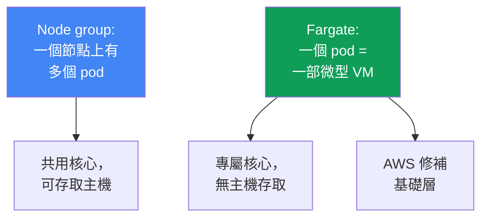
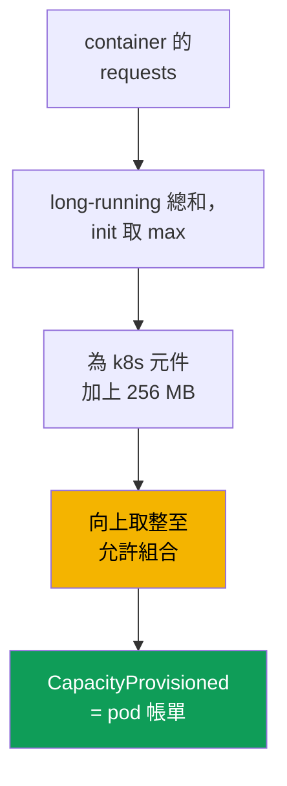

[Eng version](en.md) · [Versión en español](es.md) · [Version française](fr.md) · [Deutsche Version](de.md) · [ქართული ვერსია](ge.md) · [Русская версия](ru.md) · [日本語版](jp.md)
# 第 15 章：Fargate：設定檔、限制、成本、使用情境

> **接下來。** 四種運算類型及 Fargate 在其中的位置見第 9 章，該章僅作概覽。本章具體說明：pod 如何透過設定檔進入 Fargate、如何配置資源、哪些限制是硬性內建的，以及成本如何計算。requests 與 limits 的 sizing 見第 14 章，pod 透過 pod execution role 與 IRSA/Pod Identity 存取 AWS 見第 16 至 17 章，持久儲存用的 EFS 見第 24 章，負載平衡器與 target-type `ip` 見第 26 至 27 章，日誌與可觀測性見第 33 至 34 章。Auto Mode 作為獨立模式見第 9 章。

## 15.1.「為了免節點而選 Fargate，結果撞上了牆」

團隊基於一個簡單願望選擇 Fargate：不想管理節點。叢集已建立，pod 正在執行，維運看起來毫不費力。隨後卻陸續浮現一些限制，負載已在 production 時才得知：

- 安全性要求以 DaemonSet 安裝 runtime agent，但 Fargate **不支援 DaemonSet**，沒有地方可安裝 agent，只能在每個 pod 中使用 sidecar；
- 網路或系統工具需要 privileged container，但 Fargate **禁止 privileged**，pod 無法啟動；
- 為 pod 請求了 1 vCPU，但 `kubectl describe` 顯示 2 vCPU，Fargate 將請求**向上取整**至最接近的允許組合，因此你必須為它付費；
- 出現 GPU 工作負載，但 Fargate **沒有 GPU**，pod 無處可排程；
- 原本慣用以 Fluent Bit DaemonSet 收集日誌，它同樣不可用，日誌記錄的方式不同。

這些問題第一天都不會顯現。它們全都源於 Fargate 移除了節點，卻**換來了硬性限制**。這是一筆公平交易：你放棄節點的彈性，取得由 AWS 自行修補與維護的基礎層。本章會具體探討這些限制，讓你根據已知的邊界做出 Fargate 決策，而非基於「沒有節點就比較簡單」的慣性。

## 15.2. Fargate 實際上是什麼

在 Fargate 上，pod 運行於專屬的**微型 VM**：有自己的核心、CPU、記憶體與網路介面，且不與任何其他 pod 共用。如 node group 般的共用節點在這裡不存在，**一個 pod 等於一部 VM**。無法存取主機，因為在你的理解中主機並不存在：pod 就是全部可見的單位。

此模型的實務後果：

- **per-pod 隔離。** 逃離 container 並不會讓你存取其他 pod 的資源：邊界在 VM 層級，而非核心 namespace 層級。這是在一般 container 隔離之上的 defense-in-depth。
- **AWS 維護基礎層。** 微型 VM 的 OS 與核心修補、執行環境更新均由 AWS 負責。EKS 會定期修補 Fargate pod，且可能重新建立它們（見 15.5）。
- **你只描述 pod。** 無需選擇執行個體類型、ASG、launch template、`max-pods` 或 bootstrap。pod spec 就是你輸入的全部內容。

這種簡化的另一面是固定的一組功能：凡是需要節點或主機存取的功能，原則上都無法在 Fargate 上使用（第 15.5 節）。



## 15.3. Fargate 設定檔：pod 如何進入 Fargate

pod 本身並「不知道」自己位於 Fargate。此決策由 **Fargate 設定檔**做出，這是叢集層級的物件，說明哪些 pod 應在 Fargate 上執行。比對依據是**selector**：每個 selector 必須包含 `namespace`，且可選擇包含 `labels`。若 selector 僅指定沒有 labels 的 namespace，該 namespace 的**所有** pod 都會進入 Fargate。

經文件驗證的設定檔規則：

- 一個設定檔最多可有**五個 selector**，每個都必須指定 namespace；
- 只要 pod 符合設定檔中**至少一個** selector，就會進入 Fargate；
- 若 pod 符合多個設定檔，則以 pod label `eks.amazonaws.com/fargate-profile: <設定檔名稱>` 選擇特定設定檔；
- 設定檔建立後**不可修改**：如要變更，須建立新設定檔並刪除舊設定檔；
- 刪除設定檔時，其 pod 會停止並轉為 `Pending`；
- 僅能使用**私有子網**（沒有通往 Internet Gateway 的直接路由），Fargate pod 不會取得公有 IP。

EKS 內部有獨立的 **fargate-scheduler**，它與標準 kube-scheduler 以及一組 mutating/validating admission controller 一同運行。當 pod 符合設定檔時，這些 controller 會辨識並將其導向 Fargate。建立設定檔時，必須指定 **pod execution role**，基礎層上的 `kubelet` 以該角色向叢集註冊，並從 ECR 拉取映像檔（pod 存取 AWS 的詳細內容見第 16 至 17 章）。affinity/anti-affinity 規則不適用於 Fargate pod，Fargate 目前也不支援 `topologySpreadConstraints`。

```bash
# 建立設定檔：namespace batch 中的 pod 與具有此標籤的 helm release 會進入 Fargate
aws eks create-fargate-profile --cluster-name demo --fargate-profile-name batch \
  --pod-execution-role-arn arn:aws:iam::111122223333:role/eksFargatePodRole \
  --subnets subnet-0abc subnet-0def \
  --selectors namespace=batch namespace=jobs,labels={compute=fargate}
aws eks list-fargate-profiles --cluster-name demo
aws eks describe-fargate-profile --cluster-name demo --fargate-profile-name batch
```

相同設定檔的宣告式表示法如下（例如透過 `eksctl` 或 Terraform）：

```yaml
fargateProfiles:
  - name: batch
    podExecutionRoleARN: arn:aws:iam::111122223333:role/eksFargatePodRole
    subnets: [subnet-0abc, subnet-0def]   # 僅限私有子網
    selectors:
      - namespace: batch                  # 整個 namespace
      - namespace: jobs
        labels:
          compute: fargate                # 僅具有此標籤的 pod
```

## 15.4. 如何配置資源

Fargate 不提供任意大小的 pod。它會加總 container 的 `requests`，並將結果**向上取整**至固定集合中最接近的允許 vCPU 與記憶體組合。依文件所述的計算邏輯：

- 所有長時間運行 container 的 `requests` 會**相加**；
- 對 init container，取其中一個的**最大值**；
- 從這兩個數值中取**較大者**，作為 pod 的請求；
- 在記憶體上加上 **256 MB** 給 Kubernetes 元件（`kubelet`、`kube-proxy`、`containerd`）；
- 若完全未指定 vCPU 與記憶體，將使用**最小**組合 `.25 vCPU / 0.5 GB`。

由於 Fargate 在一部 VM 上只運行**一個 pod**，所有 pod 都使用 QoS `Guaranteed`：所有 container 的 `requests` 必須等於 `limits`。有意識地設定 requests 至關重要：若設得太低，pod 將碰到 limit；若設得太高或不幸落在兩個級距之間，便會因向上取整而多付費。典型範例是：加上 256 MB 後，請求 `1 vCPU / 8 GB` 無法放進 `1 vCPU / 8 GB` 的組合，因此會以 `2 vCPU / 9 GB` 進行 provision。實際配置的容量可見於 pod 的 `CapacityProvisioned` annotation。

| vCPU | 可用記憶體 |
|---|---|
| .25 vCPU | 0.5 GB、1 GB、2 GB |
| .5 vCPU | 1 GB、2 GB、3 GB、4 GB |
| 1 vCPU | 2 GB 至 8 GB，間隔 1 GB |
| 2 vCPU | 4 GB 至 16 GB，間隔 1 GB |
| 4 vCPU | 8 GB 至 30 GB，間隔 1 GB |
| 8 vCPU | 16 GB 至 60 GB，間隔 4 GB |
| 16 vCPU | 32 GB 至 120 GB，間隔 8 GB |

`kubectl get nodes` 顯示給 Fargate node 的大小**與** pod 容量**無關**，且通常較大。應透過 `kubectl describe pod` 中的 `CapacityProvisioned` annotation 查看實際容量，而非 node 的那一行。



## 15.5. 具體限制

Fargate 的限制是硬性的，且已由文件驗證。適合用表格保存：這是判斷「工作負載能否在 Fargate 上運行」的檢查清單。

| 限制 | 具體不可做什麼 | 替代方式 |
|---|---|---|
| DaemonSet | 無法以 DaemonSet 運行節點 agent | 每個 pod 中使用 sidecar |
| privileged | 禁止 privileged container | 重新評估需求 |
| HostNetwork / HostPort | 無法在 pod spec 中指定 | 一般 Service |
| HostPath | 無法存取主機檔案系統 | ephemeral volume 或 EFS |
| GPU | Fargate 上無法使用 GPU | 使用具 GPU 的 node group |
| Storage | 僅限 ephemeral volume 與 EFS | 無法掛載 EBS |
| Ephemeral 磁碟 | 預設 20 GiB，最高 175 GiB | 在 requests 中指定 `ephemeral-storage` |
| 負載平衡器 | 僅限 target-type `ip` | 應據此設定（第 26 至 27 章） |
| IMDS | pod 無法取得 EC2 metadata | IRSA / Pod Identity（第 16 至 17 章） |
| 節點存取 | 無 SSH，亦無主機存取 | 在 pod 內偵錯 |
| 其他 | 無 Fargate Spot、EBS、替代 CNI、Outposts/Local Zones | node group |

有幾點值得展開說明。**Ephemeral 磁碟**：每個 pod 預設取得 20 GiB，但可用空間略少於 20 GiB（部分由 pod 內的 `kubelet` 與模組占用）；可透過 `ephemeral-storage` 的 `requests` 增加至 **175 GiB**，而 Fargate 會預留額外空間（請求 100 GiB 得到的工作負載為 115 GiB）。磁碟預設加密，並會隨 pod 一同刪除。**持久儲存**僅能使用 EFS，以靜態 provision 方式提供，無需以 DaemonSet 安裝 driver 即可自動掛載（詳細內容見第 24 章）。**網路**：Fargate 使用 VPC CNI，無法替換；NLB 與 ALB 僅能使用 target-type `ip`（第 26 至 27 章）。**修補**：EKS 會定期修補 Fargate pod，若無法溫和地 evict pod，可能將其刪除，請透過 PDB 與正確的 graceful shutdown 保護（第 40 章）。

擴充 ephemeral 磁碟可直接透過 pod spec 的 `requests` 與 `limits` 中的 `ephemeral-storage` 指定（兩者相同，pod 為 `Guaranteed`）；其他 vCPU 與記憶體級距不會因此改變：

```yaml
resources:
  requests:
    cpu: "1"
    memory: 2Gi
    ephemeral-storage: 100Gi   # 最高 175Gi，Fargate 會預留額外空間
  limits:
    cpu: "1"
    memory: 2Gi
    ephemeral-storage: 100Gi   # requests = limits
```

## 15.6. 成本

Fargate 的計費模型在本質上不同於 node。node group 是為**整個執行個體**付費，不論其中填入多少 pod。Fargate 則是按 **pod 本身配置的 vCPU 與記憶體**、依其存活時間按秒付費，並有最低計費間隔。價格不由請求決定，而是由 `CapacityProvisioned` annotation 中**取整後的**組合決定。

| 面向 | Node group | Fargate |
|---|---|---|
| 計費單位 | 整個 EC2 執行個體 | pod 的 vCPU 與記憶體 |
| 閒置費用 | 有，空節點也須付費 | 沒有，僅為存活 pod 付費 |
| packing 開銷 | 自行封裝 pod | 不必關心 packing |
| 每單位資源價格 | 較低 | 較高 |
| 取整 | 無 | 向上取整至允許組合 |
| Spot 折扣 | 有 | 沒有，EKS 不支援 Fargate Spot |

不含數字的經濟結論是：每單位資源而言，Fargate **比** node **昂貴**，但你不需為 node 的閒置容量付費，也無需花費人力做封裝。對**非固定**工作負載（job、低頻服務），它通常更划算：尖峰之間沒有閒置節點。對**穩定且大型**的 24/7 工作負載，node 通常較便宜：資源較廉價且幾乎沒有閒置。結構上，這種關係取決於利用率：平均利用率越低（稀疏、週期性、低頻任務），Fargate 越有利；接近全天候 100% 利用率時，Fargate 會比 node 昂貴數倍，因為每單位資源的加價乘上了持續占用的容量。另一個陷阱是已完成的 Job：其 pod 仍會保留，在 Fargate 上持續計費，因此應設定 `ttlSecondsAfterFinished`。詳細的成本分析見第 43 章。

## 15.7. Fargate 適合與不適合的地方

Fargate 是用於特定任務的工具，而非全面取代 node。以下說明其適用與不適用的情況。

| 適合 | 不適合 |
|---|---|
| 隔離且不受信任的工作負載 | 需要 DaemonSet agent（安全性、日誌） |
| 非固定負載的 job/batch 批次 | GPU 工作負載 |
| 不想管理 node 的小型服務 | 需要 privileged 或節點存取 |
| 獨立 namespace 中的系統 pod | 高密度的小型 pod（昂貴） |
| 無 node group 的快速叢集啟動 | 穩定的大型 24/7 工作負載 |

邏輯很簡單。當 per-pod 隔離很有價值（微型 VM 為 container escape 提供邊界）、工作負載具彈性且不想保留閒置 node、服務很小而 node 管理不划算，或需要快速建立不需 node group 的叢集時，便**適合**。當第 15.5 節中的任一禁止機制為必需項目（DaemonSet、GPU、privileged、主機存取），或 Fargate 的經濟性不利時，便**不適合**：許多小型 pod 會使取整與每單位資源加價推升帳單，或者平穩的 24/7 負載中 node 較便宜。

## 15.8. Fargate 上的日誌與可觀測性

慣用的 Fluent Bit DaemonSet 日誌收集方案在 Fargate 上**無法運作**，因為這裡沒有 DaemonSet。Fargate 改為提供**內建日誌記錄機制**：你透過標準 Fargate log router 啟用 Fluent Bit，在 namespace `aws-observability` 的 ConfigMap `aws-logging` 中指定設定，日誌便會傳送至 CloudWatch Logs 或其他接收端，無需在叢集中安裝 agent。設定細節與日誌成本控制見第 34 章。

此機制不會發出聲響：若設定錯誤，pod 仍會運行，日誌卻完全不存在，沒有錯誤也沒有事件。在應用程式中尋找問題之前，有三個原因值得檢查。

- **權限不在正確角色上。** log router 以設定檔的 **pod execution role** 而非 IRSA 或 Pod Identity 中的 pod 角色寫入日誌接收端。若使用 CloudWatch，應將包含 `logs:CreateLogGroup`、`logs:CreateLogStream`、`logs:DescribeLogStreams` 與 `logs:PutLogEvents` 的 policy 附加至此角色；否則日誌會被無聲捨棄。這正是應用程式角色設定得完美、卻與日誌毫無關係的情況（第 16 與 17 章）。
- **namespace 缺少標籤。** Namespace 必須命名為 `aws-observability`，且具有 `aws-observability: enabled` 標籤；沒有該標籤便不會載入設定。
- **沒有通往接收端的網路路徑。** Fargate pod 只位於私有子網，因此前往 CloudWatch Logs 需要透過 NAT 的路由，或使用 interface endpoint（第 0.3 與 31 章）。

Fargate pod 的 metrics 以標準方式收集（Container Insights、Prometheus），但需注意不能再透過 DaemonSet 使用 node exporter：通常運行在 node 上的內容，在 Fargate 上不是內建，就是於 pod 層級收集。metrics 詳細內容見第 33 章。

## 15.9. 如何將 Fargate 與 node 結合

Fargate 與 node 共存在同一叢集中並共享 control plane。典型配置會**依 namespace** 劃分它們：部分 namespace 由 Fargate 設定檔吸引，其他則進入 node group 或 Auto Mode。Fargate 設定檔依 namespace 與 labels 比對，因此邊界正是在這兩者，而不是 taint（taint 與 toleration 用於 node）。

常見模式是將**系統基礎元件**（CoreDNS、controller、監控）保留在可預期的 node 上，而將**隔離或批次工作負載**交給另一個 namespace 中的 Fargate。另一種做法是完全「無節點」地開始：應用程式尚少時全部使用 Fargate，隨著成長，為 Fargate 不擅長的項目（GPU、密集小型 pod、穩定負載）加入 node group。使用 `-o wide` 可協助確認各 pod 落在何處：Fargate pod 位於名稱形如 `fargate-ip-...` 的「node」上。

```bash
kubectl get pods -n batch -o wide      # Fargate pod 的 NODE：fargate-ip-10-0-...
kubectl describe pod -n batch <pod>    # 查看 CapacityProvisioned annotation
```

若需要完全無節點的叢集，也可將 CoreDNS 移至 Fargate。預設情況下，其 pod 由 annotation `eks.amazonaws.com/compute-type: ec2` 保留在 EC2；遷移分為三步：在 `kube-system` 建立具 CoreDNS label selector 的設定檔、移除 annotation、重新建立 pod。

```bash
# 1. kube-system 設定檔，以 selector 選取 CoreDNS（標籤 k8s-app=kube-dns）
aws eks create-fargate-profile --cluster-name demo \
  --fargate-profile-name fp-kube-system \
  --pod-execution-role-arn arn:aws:iam::111122223333:role/eksFargatePodRole \
  --subnets subnet-0abc subnet-0def \
  --selectors namespace=kube-system,labels={k8s-app=kube-dns}
# 2. 移除將 CoreDNS 保留在 EC2 的 annotation
kubectl patch deployment coredns -n kube-system --type json \
  -p '[{"op":"remove","path":"/spec/template/metadata/annotations/eks.amazonaws.com~1compute-type"}]'
# 3. 重新建立 pod，它們將移至 Fargate
kubectl rollout restart deployment coredns -n kube-system
```

## 15.10. 在 production 中如何使用

- **保持設定檔 selector 狹窄**：使用 namespace 加 label，而不是「整個 namespace」，以免不必要的工作負載進入 Fargate，帳單悄悄增加。
- **有意識地設定 requests 並令其等於 limits**：Fargate 上的 pod 永遠是 `Guaranteed`，而向上取整表示落在級距間的誤差將需要付費。
- **為 Job 設定 `ttlSecondsAfterFinished`**：Fargate 上已完成的 pod 會持續計費，直到被移除。
- **透過內建 Fargate log router 設定日誌**（ConfigMap `aws-logging`），而不是嘗試掛上此處不存在的 DaemonSet。
- **遷移前先完成第 15.5 節限制清單**：是否需要 DaemonSet、GPU、privileged、節點存取，若是，工作負載應進入 node group 而非 Fargate。
- **依 namespace 區分 Fargate 與 node**，並將系統基礎元件保留在可預期的 node 上。

## 15.11. 迷你詞彙表

- **Fargate 設定檔**：具有 selector（namespace 加上可選 labels）、pod execution role 與私有子網的叢集層級物件；決定哪些 pod 進入 Fargate。不可修改，只能重新建立。
- **Pod execution role**：基礎層 Fargate 上的 `kubelet` 用來向叢集註冊並從 ECR 拉取映像檔的 IAM 角色；在建立設定檔時指定。內建 log router 也以此角色寫入日誌至接收端，因此日誌寫入權限必須賦予它。
- **fargate-scheduler**：與 kube-scheduler 一同運作並將符合設定檔的 pod 導向 Fargate 的 EKS scheduler。
- **CapacityProvisioned**：pod 的 annotation，包含取整後實際配置的 vCPU 與記憶體組合；它決定成本。
- **微型 VM**：專屬給單一 pod 的虛擬機器，具有自己的核心、CPU、記憶體與網路介面；是 Fargate 的隔離邊界。

## 15.12. 本章總結

- 在 Fargate 上，一個 pod 等於一部專屬微型 VM：有自己的核心與資源，無主機存取，AWS 自行修補基礎層。你只需描述 pod。
- pod 透過設定檔進入 Fargate：namespace 加 labels 的 selector（最多五個）、pod execution role、僅私有子網；設定檔不可變更，且由 fargate-scheduler 運作。
- 資源會向上取整至固定的 vCPU 與記憶體組合，並加上供 Kubernetes 元件使用的 256 MB；pod 始終為 `Guaranteed`，requests 等於 limits。
- 限制是硬性的：無 DaemonSet、privileged、HostNetwork/HostPort/HostPath、GPU、EBS、Fargate Spot、節點存取；storage 僅限 ephemeral（預設 20 GiB，最高 175 GiB）及 EFS；負載平衡器僅限 target-type `ip`。
- 按 pod 存活時間的 vCPU 與記憶體、依取整後的組合按秒計費；每單位比 node 昂貴，但無閒置費用；在 24/7 工作負載中 node 通常較便宜。
- Fargate 適用於隔離、批次與小型工作負載及快速啟動；不適用於 DaemonSet、GPU、privileged、節點存取、高密度與穩定大型工作負載。
- 日誌經由內建 Fargate log router 而非 DaemonSet 傳送；Fargate 與 node 依 namespace 劃分。

## 15.13. 這在實際工作中有何用途

Fargate 決策是在工作負載進入 production 前選擇其邊界。於初期完成限制檢查清單，可預先回答「是否需要 DaemonSet agent」、「是否會使用 GPU」、「是否需要節點存取」，以及「取整後成本是多少」，而非在安全團隊要求安裝無處可裝的 agent 時才處理。值班時，了解 pod 位於 Fargate 能立即界定偵錯邊界：無法登入 node，沒有 node exporter，容量應由 annotation 而非 node 的那一行查看。規劃成本時，知道 Fargate 為 pod 付費且會向上取整，有助於避免對一批小型 pod 的帳單感到意外，因為每個 pod 都會各自向上取整到自己的級距。

## 15.14. 自我檢查問題

1. 為什麼在 Fargate 上 pod 等於微型 VM，這從隔離角度帶來什麼好處？
2. pod 如何進入 Fargate，設定檔 selector 必須包含什麼？
3. 設定檔為何需要 pod execution role，為何無法修改設定檔？
4. Fargate pod 為何只能使用私有子網？
5. Fargate 如何計算並取整請求的 vCPU 與記憶體，256 MB 又扮演什麼角色？
6. 為什麼 Fargate 上所有 pod 都是 `Guaranteed`，這對 requests 與 limits 代表什麼？
7. 應在哪裡查看 pod 實際配置的容量，為什麼不是 node 的那一行？
8. 列出五項 Fargate 限制，以及各自可用的替代方式（如有）。
9. 預設 ephemeral 磁碟空間為何，最高可以增加至多少？
10. Fargate 的計費模型與 node group 有何不同，何時 node 較便宜？
11. Fargate 適用於哪些情境，哪些情境明確不適用？
12. 若不支援 DaemonSet，Fargate 如何收集日誌？
13. 如何在同一叢集中劃分 Fargate 與 node，如何確認各 pod 落在何處？

## 實作練習

本課程對應的實驗：[實驗 112：Fargate 設定檔，哪些可用、哪些失效、成本比較](../../labs/112/README_TW.MD)。除此之外，也可以在運行中的叢集查看設定檔與 Fargate 行為。請先從盤點開始：`aws eks list-fargate-profiles --cluster-name <cluster>` 顯示設定檔，而 `aws eks describe-fargate-profile --cluster-name <cluster> --fargate-profile-name <name>` 顯示 namespace 與 label selector、子網及 pod execution role。確認子網為私有，且 selector 保持狹窄。

接著查看 pod：`kubectl get pods -A -o wide` 會將 Fargate pod 顯示在名稱為 `fargate-ip-...` 的「node」上，而其 namespace 中的 `kubectl describe pod <pod>` 則會提供 `CapacityProvisioned` annotation。將該 annotation 與 requests 中所請求的內容比較，了解取整的成本。針對自身工作負載完成第 15.5 節限制檢查清單：是否需要 DaemonSet、GPU、privileged、節點存取，並誠實判斷哪些 namespace 適合交給 Fargate，哪些應留在 node 上。

---
[目錄](../README_TW.md) · [第 14 章](../14/tw.md) · [第 16 章](../16/tw.md)
