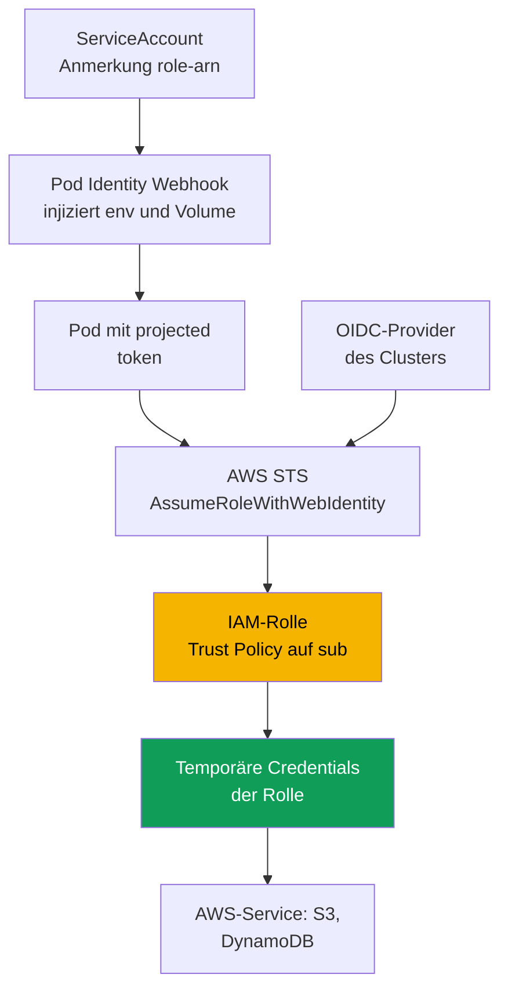
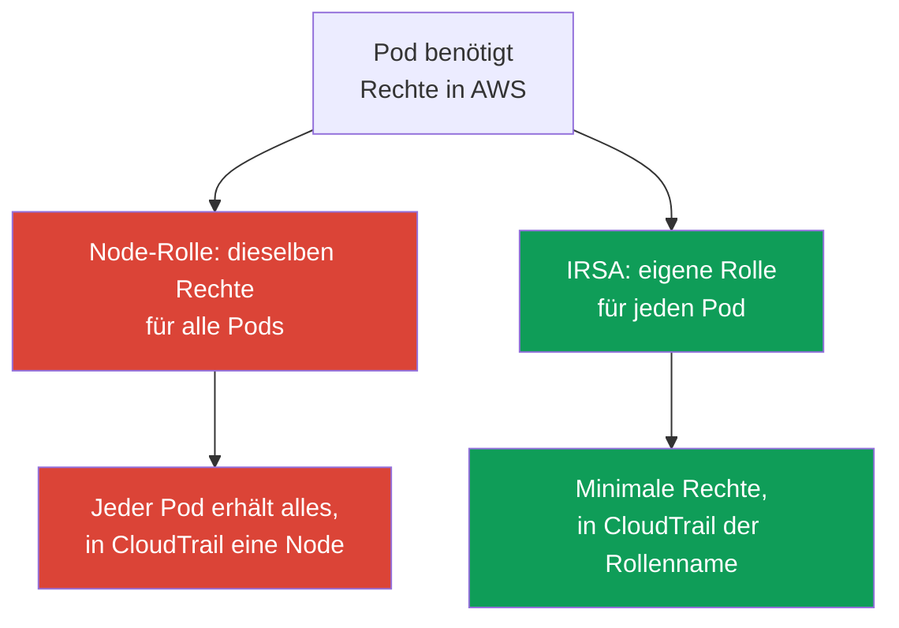

[Русская версия](ru.md) · [Eng version](en.md) · [Versión en español](es.md) · [Version française](fr.md) · [ქართული ვერსია](ge.md) · [繁體中文版](tw.md) · [日本語版](jp.md)
# Kapitel 16. IRSA: OIDC-Provider, Trust Policy, ServiceAccount-Anmerkungen

> **Wie geht es weiter?** Teil 2 endete mit Compute, und Teil 3 beginnt mit Identität.
> Der Zugriff von **Menschen und CI** auf den Cluster erfolgt über IAM und RBAC, access entries
> behandelt Kapitel 5, und sie überschneiden sich nicht mit dem vorliegenden Kapitel. Hier geht es
> um etwas anderes: den Zugriff von **Pods** auf AWS-Services (S3, DynamoDB, Secrets Manager)
> über IRSA. Der neuere Mechanismus für dasselbe Ziel, EKS Pod Identity, ist Thema von Kapitel 17;
> hier folgt nur ein kurzer Vergleich. Secrets und External Secrets behandelt Kapitel 18, das
> Hardening von IMDSv2 und Hop Limit Kapitel 19, die Pod Execution Role für Fargate Kapitel 15.

## 16.1. „Der Node eine Rolle gegeben, und die Rechte sind an alle Pods durchgesickert“

Eine Anwendung in einem Pod benötigt Zugriff auf einen S3-Bucket. Der naive Weg liegt nahe: Die Node
hat bereits eine IAM-Rolle (node IAM role, Kapitel 10), unter der kubelet und VPC CNI laufen. Fügen
wir ihr `s3:GetObject` hinzu, und die Anwendung funktioniert. Sie wird funktionieren, nur haben Sie
die Rechte nicht der Anwendung, sondern der **Node** erteilt, und nicht ein Pod, sondern **alle Pods
auf dieser Node** erhalten sie.

Die Folgen sind nicht sofort sichtbar, aber schwerwiegend:

- **Least Privilege ist verletzt.** Die Node-Rolle wird gemeinsam genutzt. Einer Anwendung wurde
  Zugriff auf S3 erteilt, doch ihn erhalten auch der Logging-Sidecar, ein fremder Pod eines
  benachbarten Teams und potenziell ein kompromittierter Container. Rechte über die Node-Rolle
  nach Pods zu trennen, ist grundsätzlich unmöglich.
- **Ein Pod kann die Credentials der Node-Rolle stehlen.** Solange der Zugriff auf den Instance
  Metadata Service (IMDS) nicht eingeschränkt ist, kann jeder Container `169.254.169.254`
  aufrufen und die vollständigen temporären Credentials der Node-Rolle erhalten. Genau diese
  Problemklasse lösen das Hardening von IMDSv2 und Hop Limit (Kapitel 19), doch allein die
  Tatsache, dass die Rechte an der Node hängen, macht IMDS zu einem Leck.
- **Audit ist nutzlos.** In CloudTrail erfolgen alle Aufrufe über die Node-Rolle, und es lässt
  sich nicht feststellen, welcher Pod den Bucket berührt hat: Alle Pods haben dieselbe Identität.

Es wird ein Weg benötigt, Rechte einem **bestimmten Pod** statt einer Node zu erteilen. Genau das
leistet IRSA.

## 16.2. Die Grundidee von IRSA: eigene Rolle für den Pod über ServiceAccount

IRSA (IAM Roles for Service Accounts) kehrt das Modell um: Ein Pod erhält über seinen verknüpften
`ServiceAccount` eine **eigene** IAM-Rolle, statt die Node-Rolle zu erben. Die Node-Rolle bleibt
minimal und enthält nur, was kubelet und CNI benötigen. Anwendungsrechte liegen in separaten Rollen,
jeweils eine pro Berechtigungssatz.

Unter der Haube arbeitet **OIDC federation**, derselbe Mechanismus für föderierten Zugriff, den IAM
seit 2014 unterstützt. Ein `ServiceAccount` in EKS stellt einen signierten **projected service account
token** aus. Das ist ein OIDC-kompatibles JWT mit der SA-Identität und konfigurierbarer Audience. Der
Pod legt den Token bei der STS-Operation `AssumeRoleWithWebIdentity` vor, STS prüft die Signatur über
den OIDC-Provider des Clusters und gibt **temporäre Credentials** der angeforderten Rolle zurück. Das
AWS SDK im Pod erledigt dies selbstständig.

Drei Eigenschaften sollten sofort festgehalten werden:

- Rechte sind an das Paar „Namespace + ServiceAccount-Name“ gebunden, nicht an die Node;
- Credentials sind temporär und werden automatisch rotiert, langlebige Schlüssel liegen nicht im Pod;
- die Node-Rolle ist nicht mehr Träger von Anwendungsrechten, und ein Leck über IMDS verliert seinen Sinn.

## 16.3. So funktioniert es Schritt für Schritt

Das Gesamtbild besteht aus fünf Teilen, die einmal konfiguriert werden und dann bei jedem Pod-Start
automatisch zusammenwirken.



Schritt für Schritt:

1. Der Cluster besitzt eine **OIDC issuer URL**. In IAM ist dafür ein **IAM OIDC identity provider**
   angelegt, einmal pro Cluster (Abschnitt 16.4).
2. Es wird eine **IAM-Rolle** mit einer **Trust Policy** erstellt, die diesem OIDC-Provider und über
   eine Bedingung auf `sub` einem **bestimmten** `ServiceAccount` vertraut (Abschnitt 16.5).
3. Der `ServiceAccount` erhält die Anmerkung `eks.amazonaws.com/role-arn` mit dem ARN dieser Rolle.
4. Beim Pod-Start erkennt der Admission Webhook (EKS Pod Identity Webhook) die Anmerkung, hängt einen
   **projected token** ein und ergänzt die Umgebungsvariablen `AWS_ROLE_ARN` und
   `AWS_WEB_IDENTITY_TOKEN_FILE`.
5. Das AWS SDK im Container liest diese Variablen, ruft `AssumeRoleWithWebIdentity` auf und erhält
   temporäre Credentials der Rolle. Anschließend arbeitet die Anwendung im Namen der Rolle mit
   AWS-Services.

## 16.4. OIDC-Provider des Clusters

Jeder EKS-Cluster hat eine eigene OIDC issuer URL der Form
`https://oidc.eks.<region>.amazonaws.com/id/<id>`. Das ist ein öffentlicher Discovery-Endpunkt, an
dem die öffentlichen Schlüssel für die Signatur der projected tokens liegen. Der private Signaturschlüssel
wird alle 7 Tage rotiert; EKS behält die öffentlichen Schlüssel bis zu ihrem Ablauf. Externe
OIDC-Clients müssen die Schlüssel vor Ablauf aktualisieren, für IAM geschieht das jedoch transparent.

Dass der Cluster eine issuer URL hat, bedeutet noch nicht, dass die Federation funktioniert. In IAM muss
für diese URL ein **IAM OIDC identity provider** angelegt sein, auf den die Trust Policies der Rollen
verweisen. Der Provider wird **einmal pro Cluster** erstellt und von allen IRSA-Rollen gemeinsam genutzt.

```bash
# issuer URL des Clusters anzeigen
aws eks describe-cluster --name demo \
  --query 'cluster.identity.oidc.issuer' --output text

# IAM OIDC provider erstellen (idempotent, tut nichts, wenn er bereits existiert)
eksctl utils associate-iam-oidc-provider --cluster demo --approve

# prüfen, ob der Provider registriert ist
aws iam list-open-id-connect-providers
```

`eksctl` ruft intern `aws iam create-open-id-connect-provider` auf. Dasselbe kann man manuell oder
über Terraform (`aws_iam_openid_connect_provider`) erledigen, indem URL, client id
`sts.amazonaws.com` und der Fingerabdruck des Root-Zertifikats übergeben werden. Der manuelle Weg
ist selten erforderlich: `eksctl` und EKS-IaC-Module erledigen dies selbst. Falls die VPC keinen
Internet-Egress hat und kein privater Zugriff auf den OIDC-Endpunkt eingerichtet ist, kann der Befehl
den issuer-Host nicht auflösen. Ein privater Cluster benötigt den VPC Interface Endpoint
`com.amazonaws.<region>.oidc-eks` (Kapitel 19).

## 16.5. Trust Policy im Detail

Die Trust Policy (assume role policy) einer Rolle ist die Stelle, an der der föderierte Principal mit
einem **bestimmten** `ServiceAccount` verbunden wird. Betrachten wir sie nach Bestandteilen.

```json
{
  "Version": "2012-10-17",
  "Statement": [
    {
      "Effect": "Allow",
      "Principal": {
        "Federated": "arn:aws:iam::111122223333:oidc-provider/oidc.eks.eu-central-1.amazonaws.com/id/EXAMPLED539D4633E53DE1B716D3041E"
      },
      "Action": "sts:AssumeRoleWithWebIdentity",
      "Condition": {
        "StringEquals": {
          "oidc.eks.eu-central-1.amazonaws.com/id/EXAMPLED539D4633E53DE1B716D3041E:sub": "system:serviceaccount:payments:s3-reader",
          "oidc.eks.eu-central-1.amazonaws.com/id/EXAMPLED539D4633E53DE1B716D3041E:aud": "sts.amazonaws.com"
        }
      }
    }
  ]
}
```

- **`Principal.Federated`** ist der ARN des IAM OIDC identity providers aus Abschnitt 16.4, nicht
die URL selbst. Er teilt IAM mit: Vertraue Tokens, die von diesem Provider signiert wurden.
- **`Action`** ist strikt `sts:AssumeRoleWithWebIdentity`; auf andere Weise lässt sich die Rolle
  nicht über Web Identity annehmen.
- Die **Bedingung für `sub`** ist entscheidend. Der Schlüssel `<oidc-provider>:sub` wird mit dem
  Wert `system:serviceaccount:<namespace>:<serviceaccount>` verglichen. Genau dies bindet die
  Rolle an einen konkreten SA in einem konkreten Namespace.
- Die **Bedingung für `aud`** lautet `sts.amazonaws.com`, die Audience des projected token.

Die Präzision der `sub`-Bedingung ist eine Sicherheitsfrage, keine Formalität. Wird sie mit
`StringLike` und dem Muster `system:serviceaccount:*:*` formuliert oder ganz weggelassen, kann
**jeder** `ServiceAccount` des Clusters die Rolle annehmen, also praktisch jeder Pod. Die
`sub`-Bedingung muss exakt den Namespace und den SA-Namen angeben, für den die Rolle vorgesehen ist.

## 16.6. ServiceAccount-Anmerkung und was der Pod sieht

Auf Kubernetes-Seite wird ein `ServiceAccount` mit der Anmerkung `eks.amazonaws.com/role-arn` benötigt.

```yaml
apiVersion: v1
kind: ServiceAccount
metadata:
  name: s3-reader
  namespace: payments
  annotations:
    eks.amazonaws.com/role-arn: arn:aws:iam::111122223333:role/payments-s3-reader
```

Am einfachsten lassen sich Rolle und SA mit einer `eksctl`-Anweisung erstellen und verknüpfen. Sie
legt selbst die Trust Policy mit der korrekten `sub`-Bedingung an und setzt die Anmerkung:

```bash
eksctl create iamserviceaccount \
  --cluster demo --namespace payments --name s3-reader \
  --attach-policy-arn arn:aws:iam::111122223333:policy/payments-s3-read \
  --approve

kubectl -n payments describe serviceaccount s3-reader   # Anmerkung role-arn ist sichtbar
```

Dasselbe Ergebnis mit nativem Terraform, ohne `eksctl`: OIDC-Provider und Rolle mit einer Trust
Policy für das exakte `sub`/`aud`. Die Anmerkung am SA wird separat im Manifest aus Abschnitt 16.6 gesetzt.

```hcl
data "aws_eks_cluster" "demo" { name = "demo" }

data "tls_certificate" "oidc" {
  url = data.aws_eks_cluster.demo.identity[0].oidc[0].issuer
}

resource "aws_iam_openid_connect_provider" "eks" {          # einmal pro Cluster
  url             = data.aws_eks_cluster.demo.identity[0].oidc[0].issuer
  client_id_list  = ["sts.amazonaws.com"]
  thumbprint_list = [data.tls_certificate.oidc.certificates[0].sha1_fingerprint]
}

locals { oidc = replace(aws_iam_openid_connect_provider.eks.url, "https://", "") }

resource "aws_iam_role" "s3_reader" {
  name = "payments-s3-reader"
  assume_role_policy = jsonencode({
    Version   = "2012-10-17"
    Statement = [{
      Effect    = "Allow"
      Principal = { Federated = aws_iam_openid_connect_provider.eks.arn }
      Action    = "sts:AssumeRoleWithWebIdentity"
      Condition = { StringEquals = {
        "${local.oidc}:sub" = "system:serviceaccount:payments:s3-reader"
        "${local.oidc}:aud" = "sts.amazonaws.com"
      } }
    }]
  })
}
```

Die Permissions Policy wird separat angehängt (`aws_iam_role_policy_attachment`); die Trust Policy
ist hier exakt die Bedingung aus Abschnitt 16.5, nur als HCL ausgedrückt.

Danach muss der Pod diesen SA verwenden (`spec.serviceAccountName: s3-reader`). Beim Start injiziert
der Pod Identity Webhook in die Container:

| Was wird injiziert | Wert | Zweck |
|---|---|---|
| Umgebungsvariable `AWS_ROLE_ARN` | ARN der Rolle aus der SA-Anmerkung | Das SDK weiß, welche Rolle es annehmen soll |
| Umgebungsvariable `AWS_WEB_IDENTITY_TOKEN_FILE` | Pfad zur Token-Datei im Pod | Das SDK weiß, wo es den Token findet |
| Projected Volume mit Token | JWT mit `aud=sts.amazonaws.com` und Ablaufzeit | Wird STS für den Tausch gegen Credentials vorgelegt |
| Umgebungsvariable `AWS_STS_REGIONAL_ENDPOINTS` | `regional` (Standard in EKS) | Das SDK verwendet regionales STS, nicht das globale |

Der Webhook setzt standardmäßig `AWS_STS_REGIONAL_ENDPOINTS=regional`, und das SDK ruft den
regionalen Endpunkt `sts.<region>.amazonaws.com` statt des globalen `sts.amazonaws.com` auf:
geringere Latenz, eigene Redundanz in der Region und eine längere Lebensdauer des Session-Tokens.
Für einen privaten Cluster ohne Internet-Egress ist dies zwingend, da der STS-Verkehr über den VPC
Interface Endpoint `com.amazonaws.<region>.sts` fließt und der globale Endpunkt ihn umgeht. Der
Modus wird durch die SA-Anmerkung `eks.amazonaws.com/sts-regional-endpoints` (`true`/`false`)
geschaltet; `false` sollte praktisch nie gesetzt werden.

Der Token wird als projected service account token eingehängt: Er besitzt eine Audience und eine
Lebensdauer, und kubelet aktualisiert ihn vor Ablauf. Die Anwendung muss ein **kompatibles AWS SDK**
verwenden. Web Identity wird von aktuellen Versionen aller SDKs und aktuellem AWS CLI unterstützt;
ein sehr altes SDK ignoriert die Variablen und ruft Credentials der Node-Rolle ab.

## 16.7. Typische Fehler und Diagnose

IRSA scheitert auf vorhersehbare Weise, und fast alle Fehler lassen sich auf einige Ursachen
zurückführen.

| Symptom | Wahrscheinliche Ursache | Prüfen |
|---|---|---|
| `AccessDenied` bei `AssumeRoleWithWebIdentity` | `sub`-Bedingung in der Trust Policy stimmt nicht überein | Namespace und SA-Name in `sub` |
| SDK verwendet Credentials der Node-Rolle statt der SA-Rolle | SA ist nicht annotiert oder Pod wurde nicht neu erstellt | SA-Anmerkung, Pod neu starten |
| `AWS_ROLE_ARN` fehlt im Pod | Pod wurde vor der Anmerkung erstellt, Webhook griff nicht | Pod neu erstellen |
| `AccessDenied` bereits beim Service-Aufruf | Rolle hat nicht die erforderliche IAM-Policy | Permissions Policy der Rolle |
| Nichts funktioniert mit einer alten Anwendung | inkompatibles oder sehr altes AWS SDK | SDK-Version |

Die Reihenfolge der Diagnose vom Pod nach außen:

```bash
# 1. Sind die Umgebungsvariablen vorhanden?
kubectl -n payments exec deploy/my-app -- env | grep AWS_

# 2. Als wen sieht der Pod sich in AWS? Es muss die assumed-role der richtigen Rolle sein, nicht die Node-Rolle
kubectl -n payments exec deploy/my-app -- aws sts get-caller-identity

# 3. Ist die Anmerkung wirklich an dem SA, den der Pod verwendet?
kubectl -n payments get sa s3-reader -o yaml | grep role-arn
```

Die wichtigste Prüfung ist `aws sts get-caller-identity` aus dem Pod. Wenn in `Arn`
`assumed-role/payments-s3-reader/...` erscheint, hat die Federation funktioniert und das Problem
liegt in der Permissions Policy der Rolle. Erscheint die Node-Rolle, hat der Pod keine Credentials
der SA-Rolle erhalten, und die Ursache findet sich weiter oben in der Tabelle. Ein weiterer häufiger
Fehler: Die Anmerkung wurde gesetzt, aber der **Pod nicht neu erstellt**. Der Webhook injiziert
Variablen nur bei der Erstellung, ein laufender Pod erhält sie nicht.

## 16.8. IRSA gegenüber der Node-Rolle



Der Unterschied ist grundlegend. Die Node-Rolle wird von **allen** Pods auf einer Node geteilt:
Alle ihr erteilten Rechte erhalten sämtliche Pods, und in CloudTrail gibt es nur eine Identität für
alle. IRSA bietet **Least Privilege auf Pod-Ebene**: Jede Anwendung besitzt eine eigene Rolle mit
eigenen Rechten, Aufrufe in CloudTrail erfolgen über sie, und ein kompromittierter Pod ist auf seine
eigenen Berechtigungen beschränkt.

Bei der Node-Rolle verbleibt genau, was die Systemkomponenten der Node benötigen: das Pullen von
Images aus ECR, die Arbeit von VPC CNI mit ENIs, das Schreiben von CloudWatch-Logs und -Metriken,
also die Rechte aus Managed Policies wie `AmazonEKSWorkerNodePolicy` und
`AmazonEC2ContainerRegistryReadOnly` (Kapitel 10). Anwendungsrechte dürfen dort nicht liegen. Ist
die Node-Rolle minimal und IMDS eingeschränkt (Kapitel 19), gibt es dort nichts zu stehlen.

## 16.9. Kurzer Vergleich mit Pod Identity

EKS Pod Identity löst dieselbe Aufgabe „eigene Rolle für den Pod“ auf andere Weise und wird in
Kapitel 17 ausführlich behandelt. Hier folgen nur die Auswahlgrenzen, damit klar ist, dass IRSA
nicht die einzige Option ist.

| Eigenschaft | IRSA | EKS Pod Identity |
|---|---|---|
| Mechanismus | OIDC federation, Trust Policy auf `sub` | Agent auf der Node und EKS API |
| Konfiguration am Cluster | IAM OIDC provider, je Rolle eigene Trust Policy | Installation des Add-ons Pod Identity Agent |
| Trust Policy der Rolle | an einen bestimmten OIDC-Provider gebunden | gemeinsamer Principal `pods.eks.amazonaws.com` |
| Cross-Account und außerhalb von EKS | funktioniert (Federation über OIDC) | eingeschränkter, an EKS gebunden |
| Reife | lange etabliert, weit verbreitet | neuer, einfacher zu verknüpfen |

Kurz gesagt: IRSA ist flexibler, da es über Standard-OIDC funktioniert und sich für Cross-Account
sowie Szenarien außerhalb von EKS eignet. Die Konfiguration ist aber ausführlicher, da jede Rolle
eine eigene Trust Policy mit exakt passendem `sub` benötigt. Pod Identity ist einfacher zu verknüpfen,
da die Zuordnung über die EKS API erfolgt und die Rolle nicht an den OIDC-Provider des Clusters
gebunden ist, jedoch handelt es sich um einen neueren Mechanismus mit eigenen Einschränkungen.
Details, Migration und Auswahlkriterien behandelt Kapitel 17.

## 16.10. Einsatz in Produktion

- **Der OIDC-Provider wird mit dem Cluster** in IaC angelegt, nicht später manuell. Ohne ihn
  funktioniert keine IRSA-Rolle, und er ist der erste Schritt nach der Cluster-Erstellung.
- **Eine Rolle, ein Berechtigungssatz, ein ServiceAccount.** Rollen werden nicht zwischen
  verschiedenen Anwendungen wiederverwendet: Jeder SA erhält eine eigene Rolle mit minimalen
  Rechten und exakter `sub`-Bedingung.
- **Die Node-Rolle bleibt minimal.** Sie enthält nur Rechte für Systemkomponenten;
  Anwendungsberechtigungen werden in IRSA-Rollen ausgelagert, und IMDS wird über Hop Limit
  eingeschränkt (Kapitel 19).
- **Die `sub`-Bedingung ist immer exakt**, mit konkretem Namespace und SA-Namen und ohne Muster
  `*`, da sonst jeder Pod des Clusters die Rolle annehmen könnte.
- **Rollen und SAs sind als Code beschrieben.** `eksctl create iamserviceaccount` oder ein
  Terraform-Modul erstellen Rolle, Trust Policy und annotierten SA gemeinsam, damit sie nicht
  auseinanderlaufen.

## 16.11. Mini-Glossar

- **IRSA**: IAM Roles for Service Accounts, ein Mechanismus, einem Pod über einen verknüpften
  `ServiceAccount` auf Basis von OIDC federation eine IAM-Rolle zu erteilen.
- **OIDC issuer URL**: der öffentliche OIDC-Endpunkt des Clusters
  (`oidc.eks.<region>.amazonaws.com/id/`) mit den öffentlichen Schlüsseln für projected tokens.
- **IAM OIDC identity provider**: IAM-Objekt, das die issuer URL des Clusters registriert. Auf ihn
  verweisen die Trust Policies der Rollen. Er wird einmal pro Cluster angelegt.
- **Trust Policy**: Vertrauensrichtlinie einer Rolle: der `Federated`-Principal (ARN des
  OIDC-Providers), die `Action` `sts:AssumeRoleWithWebIdentity` und `StringEquals`-Bedingungen
  für `sub` und `aud`.
- **Projected service account token**: ein OIDC-kompatibles JWT mit SA-Identität, Audience
  `sts.amazonaws.com` und Lebensdauer. Es wird in den Pod eingehängt und bei STS gegen Credentials
  getauscht.
- **`AssumeRoleWithWebIdentity`**: die STS-Operation, die einen Web Identity Token gegen
  temporäre Credentials einer IAM-Rolle tauscht.

## 16.12. Zusammenfassung des Kapitels

- Der naive Ansatz „der Node-Rolle Rechte geben“ verletzt Least Privilege, da alle Pods der Node
  die Rechte erhalten, macht die Node-Rolle zum Ziel für Diebstahl über IMDS und anonymisiert
  CloudTrail. IRSA erteilt die Rechte einem bestimmten Pod.
- IRSA beruht auf OIDC federation: Ein `ServiceAccount` stellt einen signierten projected token
  aus, der Pod legt ihn STS über `AssumeRoleWithWebIdentity` vor, STS prüft die Signatur über den
  OIDC-Provider des Clusters und gibt temporäre Credentials der Rolle zurück.
- Die fünf Bestandteile sind OIDC issuer URL des Clusters, IAM OIDC identity provider (einer pro
  Cluster), IAM-Rolle mit Trust Policy auf `sub`, Anmerkung `eks.amazonaws.com/role-arn` am SA,
  projected token sowie die vom Webhook injizierten Variablen `AWS_ROLE_ARN` und
  `AWS_WEB_IDENTITY_TOKEN_FILE`.
- Die Trust Policy bindet die Rolle durch `StringEquals` auf
  `<oidc-provider>:sub` = `system:serviceaccount:NS:SA` sowie `aud` = `sts.amazonaws.com` an einen
  bestimmten SA. Ein Muster statt eines exakten `sub` öffnet die Rolle für jeden Pod.
- Die Diagnose führt vom Pod nach außen: `AWS_*`-Variablen im Pod,
  `aws sts get-caller-identity` (assumed-role der richtigen Rolle statt Node-Rolle), Anmerkung am
  SA, Neu-Erstellung des Pods und SDK-Version. `AccessDenied` beim Service-Aufruf betrifft bereits
  die Permissions Policy der Rolle.
- Die Node-Rolle bleibt minimal für kubelet, CNI, ECR und Logs; Anwendungsrechte liegen in
  IRSA-Rollen.
- Pod Identity (Kapitel 17) löst dieselbe Aufgabe über Agent und EKS API: leichter zu verknüpfen,
  aber IRSA ist für Cross-Account und Szenarien außerhalb von EKS flexibler.

## 16.13. Nutzen in der praktischen Arbeit

Die Frage „Welche Rechte hat dieser Pod in AWS?“ lässt sich mit IRSA durch eine Rolle und ihre
Permissions Policy beantworten, statt zu analysieren, was sich auf der gemeinsam genutzten
Node-Rolle angesammelt hat. Ein Vorfall „Pod kompromittiert“ ist auf die Rechte seiner Rolle
beschränkt, nicht auf alles, was die Node darf. Auch die Untersuchung mit CloudTrail wird
sinnvoller: Aufrufe erfolgen über die Rolle der bestimmten Anwendung, und es ist ersichtlich, wer
den Bucket oder die Tabelle angesprochen hat. Im Bereitschaftsdienst lassen sich die meisten Fälle
„Anwendung erhält AccessDenied zu AWS“ mit derselben kurzen Kette aus Abschnitt 16.7 lösen:
Variablen im Pod, `get-caller-identity`, SA-Anmerkung und Prüfung, ob der Pod neu erstellt wurde.

## 16.14. Fragen zur Selbstkontrolle

1. Warum ist der Ansatz „das erforderliche Recht zur Node-Rolle hinzufügen“ hinsichtlich Least Privilege und Audit problematisch?
2. Wie kann ein Pod die Credentials der Node-Rolle erlangen, und welches Kapitel schließt diese Lücke?
3. Auf welchem AWS-Mechanismus basiert IRSA, und welche STS-Operation tauscht den Token gegen Credentials?
4. Was ist die OIDC issuer URL eines Clusters, und wie unterscheidet sie sich vom IAM OIDC identity provider?
5. Warum wird der IAM OIDC provider einmal pro Cluster erstellt, während es viele IRSA-Rollen geben kann?
6. Aus welchen Teilen besteht die Trust Policy einer IRSA-Rolle, und was legt `Principal.Federated` fest?
7. Warum muss die Bedingung auf `sub` exakt sein, und was passiert bei einem Muster `*`?
8. Welche Umgebungsvariablen und welches Volume injiziert der Webhook in den Pod, und woher weiß er, dass dies erforderlich ist?
9. Der Pod wurde annotiert, verwendet aber weiterhin die Node-Rolle. Nennen Sie zwei wahrscheinliche Ursachen.
10. Wie lässt sich mit einem Befehl aus dem Pod feststellen, ob die Federation funktioniert hat, und von fehlenden Berechtigungen unterscheiden?
11. Was muss nach dem Umstieg auf IRSA in der Node-Rolle verbleiben?
12. Worin unterscheidet sich IRSA von Pod Identity, und wann ist IRSA vorzuziehen?

## Praxis

Das Kurs-Lab zu diesem Thema: [Lab 104 - Workload Identity: IRSA und Pod Identity für eine
Anwendung](../../labs/104/README_DE.MD). IRSA kommt auch in
[Lab 106 - EBS CSI](../../labs/106/README_DE.MD) und [Lab 107 - EFS CSI](../../labs/107/README_DE.MD)
als Weg vor, dem Treiber eine Berechtigung zu erteilen. Darüber hinaus wird alles auf einem
laufenden Cluster geprüft. Beginnen Sie mit
`aws eks describe-cluster --name <cluster> --query 'cluster.identity.oidc.issuer'` und
`aws iam list-open-id-connect-providers`: Hat der Cluster eine issuer URL, und ist dafür ein
IAM OIDC provider angelegt? Falls der Provider fehlt, erstellen Sie ihn mit
`eksctl utils associate-iam-oidc-provider --cluster <cluster> --approve`.

Erstellen Sie anschließend über `eksctl create iamserviceaccount` eine Testrolle und einen SA mit
einer Policy, die nur Lesezugriff auf einen Bucket erlaubt. Starten Sie einen Pod mit diesem SA und
führen Sie darin `aws sts get-caller-identity` aus. In `Arn` muss die assumed-role Ihrer Rolle
erscheinen, nicht die Node-Rolle. Prüfen Sie mit `kubectl exec ... -- env | grep AWS_` die
Variablen `AWS_ROLE_ARN` und `AWS_WEB_IDENTITY_TOKEN_FILE` sowie mit `kubectl describe sa` die
Anmerkung mit dem ARN der Rolle. Üben Sie separat einen Fehlerfall: Beschädigen Sie die
`sub`-Bedingung in der Trust Policy, indem Sie den Namespace ändern, erstellen Sie den Pod neu und
finden Sie `AccessDenied` bei `AssumeRoleWithWebIdentity`. Stellen Sie danach das exakte `sub`
wieder her und prüfen Sie, ob der Zugriff zurückkehrt. Untersuchen Sie die Trust Policy der Rolle
mit `aws iam get-role --role-name <role>` und vergleichen Sie `sub` und `aud` mit Abschnitt 16.5.

---
[Inhaltsverzeichnis](../README_DE.md) · [Kapitel 15](../15/de.md) · [Kapitel 17](../17/de.md)
