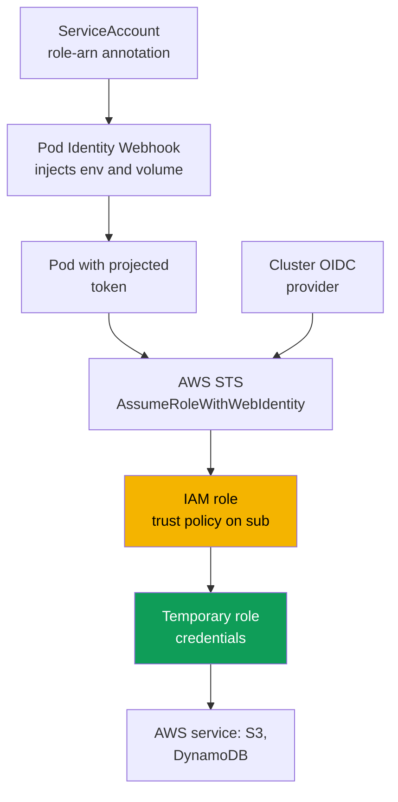
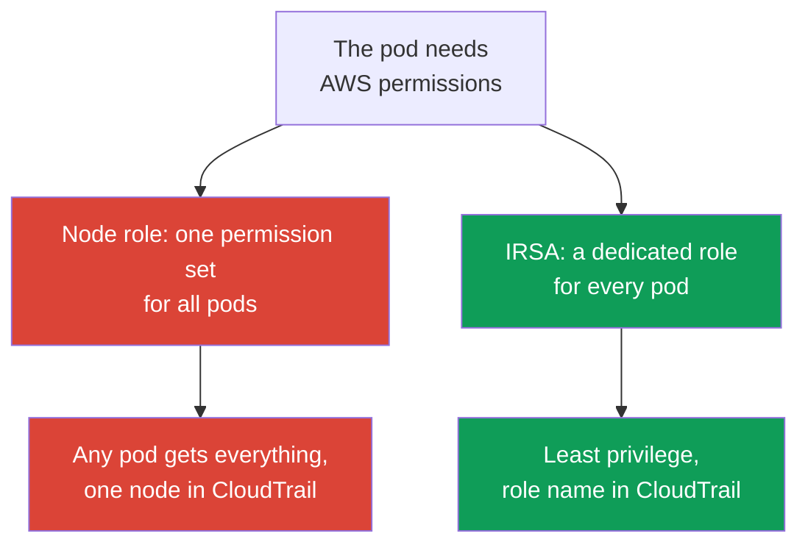

[Русская версия](ru.md) · [Versión en español](es.md) · [Version française](fr.md) · [Deutsche Version](de.md) · [ქართული ვერსია](ge.md) · [繁體中文版](tw.md) · [日本語版](jp.md)
# Chapter 16. IRSA: OIDC provider, trust policy, ServiceAccount annotations

> **What comes next.** Part 2 ended with compute, and Part 3 opens with identity.
> **People and CI** access the cluster through IAM and RBAC; access entries are chapter 5 and do
> not overlap with this chapter. The task here is different: **pod** access to AWS services
> (S3, DynamoDB, Secrets Manager) through IRSA. The newer mechanism for the same purpose, EKS Pod
> Identity, is chapter 17; here we give only a short comparison. Secrets and External Secrets are
> chapter 18, IMDSv2 hardening and hop limit are chapter 19, and the Fargate pod execution role is
> chapter 15.

## 16.1. "Give the node a role, and the permissions leak to every pod"

An application in a pod needs access to an S3 bucket. The naive path suggests itself: the node
already has an IAM role (the node IAM role, chapter 10) under which kubelet and VPC CNI run, so
we add `s3:GetObject` to it and the application works. It will work, but you granted permissions
not to the application, but to the **node**, and not one pod received them, but **every pod on
that node**.

The consequences are not immediately apparent, but they are serious:

- **Least privilege is broken.** The node role is shared. You gave one application S3 access, but
  the log collection sidecar, another team's neighboring pod, and a potentially compromised
  container received it too. Separating permissions by pod through the node role is impossible in
  principle.
- **A pod can steal the node role credentials.** Until access to Instance Metadata Service (IMDS)
  is restricted, any container can visit `169.254.169.254` and retrieve the full temporary
  credentials of the node role. This is precisely the class of problems addressed by IMDSv2
  hardening and hop limit (chapter 19), but the fact that permissions reside on the node makes
  IMDS an exfiltration point.
- **Auditing is useless.** In CloudTrail all calls come from the node role, and it is impossible
  to determine which particular pod accessed the bucket: all pods have one identity.

A way is needed to grant permissions to a **specific pod**, rather than to the node. That is
exactly what IRSA does.

## 16.2. The core IRSA idea: a dedicated role for a pod through ServiceAccount

IRSA (IAM Roles for Service Accounts) reverses the model: a pod gets **its own** IAM role
through the `ServiceAccount` bound to it, instead of inheriting the node role. The node role
remains minimal, with only what kubelet and CNI need, while application permissions live in
separate roles, one per permission set.

Under the hood, this is **OIDC federation**, the same federated-access mechanism that IAM has
supported since 2014. A `ServiceAccount` in EKS issues a signed **projected service account
token**, an OIDC-compatible JWT with the SA identity and a configurable audience. The pod
presents the token to the STS operation `AssumeRoleWithWebIdentity`, STS verifies the signature
through the cluster's OIDC provider, and returns **temporary credentials** for the requested
role. The AWS SDK inside the pod does this itself.

Three properties worth establishing immediately:

- permissions are bound to the "namespace + ServiceAccount name" pair, not to the node;
- credentials are temporary and rotate automatically, with no long-lived keys in the pod;
- the node role is no longer the carrier of application permissions, so exfiltration through
  IMDS loses its value.

## 16.3. How it works step by step

The complete picture consists of five parts, configured once and then working automatically at
every pod startup.



Step by step:

1. The cluster has an **OIDC issuer URL**. An **IAM OIDC identity provider** is registered for it
   in IAM, once per cluster (section 16.4).
2. An **IAM role** is created with a **trust policy** that trusts that OIDC provider and a
   **specific** `ServiceAccount` through a `sub` condition (section 16.5).
3. The `ServiceAccount` is marked with the `eks.amazonaws.com/role-arn` annotation containing
   the ARN of that role.
4. When the pod starts, the admission webhook (EKS Pod Identity Webhook) sees the annotation,
   mounts a **projected token**, and adds the `AWS_ROLE_ARN` and
   `AWS_WEB_IDENTITY_TOKEN_FILE` environment variables.
5. The AWS SDK in the container reads these variables, calls `AssumeRoleWithWebIdentity`, and
   receives the role's temporary credentials. The application then works with AWS services as
   that role.

## 16.4. The cluster OIDC provider

Every EKS cluster has its own OIDC issuer URL of the form
`https://oidc.eks.<region>.amazonaws.com/id/<id>`. This is a public discovery endpoint that
hosts the public keys used to sign projected tokens. The private signing key rotates every 7
days; EKS retains public keys until they expire. External OIDC clients need to refresh keys
before expiration, but IAM itself handles this transparently.

The presence of an issuer URL on the cluster does not yet mean federation works. You must create
an **IAM OIDC identity provider** in IAM for that URL. The role trust policies will refer to that
provider. The provider is created **once per cluster** and is shared by all IRSA roles.

```bash
# view the cluster issuer URL
aws eks describe-cluster --name demo \
  --query 'cluster.identity.oidc.issuer' --output text

# create an IAM OIDC provider (idempotent; does nothing if it already exists)
eksctl utils associate-iam-oidc-provider --cluster demo --approve

# verify that the provider is registered
aws iam list-open-id-connect-providers
```

Under the hood, `eksctl` calls `aws iam create-open-id-connect-provider`. You can do the same
manually or through Terraform (`aws_iam_openid_connect_provider`), passing the URL, client ID
`sts.amazonaws.com`, and the root certificate fingerprint. The manual route is rarely needed:
`eksctl` and EKS IaC modules do it themselves. If the VPC has no outbound internet access and
private access to the OIDC endpoint is not configured, the command cannot resolve the issuer
host. A private cluster needs the VPC interface endpoint `com.amazonaws.<region>.oidc-eks`
(chapter 19).

## 16.5. The trust policy in detail

The role trust policy (assume role policy) is where the federated principal is bound to a
**specific** `ServiceAccount`. Let us examine it part by part.

```json
{
  "Version": "2012-10-17",
  "Statement": [
    {
      "Effect": "Allow",
      "Principal": {
        "Federated": "arn:aws:iam::111122223333:oidc-provider/oidc.eks.eu-central-1.amazonaws.com/id/EXAMPLED539D4633E53DE1B716D3041E"
      },
      "Action": "sts:AssumeRoleWithWebIdentity",
      "Condition": {
        "StringEquals": {
          "oidc.eks.eu-central-1.amazonaws.com/id/EXAMPLED539D4633E53DE1B716D3041E:sub": "system:serviceaccount:payments:s3-reader",
          "oidc.eks.eu-central-1.amazonaws.com/id/EXAMPLED539D4633E53DE1B716D3041E:aud": "sts.amazonaws.com"
        }
      }
    }
  ]
}
```

- **`Principal.Federated`** is the ARN of the IAM OIDC provider from section 16.4, not the URL
  itself. It tells IAM to trust tokens signed by this provider.
- **`Action`** is strictly `sts:AssumeRoleWithWebIdentity`; no other way of assuming the role
  through web identity will work.
- **The `sub` condition** is the most important part. The `<oidc-provider>:sub` key is matched
  against `system:serviceaccount:<namespace>:<serviceaccount>`. This is what binds the role to
  one specific SA in a specific namespace.
- **The `aud` condition** is `sts.amazonaws.com`, the audience of the projected token.

The precision of the `sub` condition is a security issue, not a formality. If you set it with
`StringLike` using the `system:serviceaccount:*:*` pattern, or remove it entirely, **any**
`ServiceAccount` in the cluster, effectively any pod, will be able to assume the role. The `sub`
condition must name exactly the namespace and SA for which the role is intended.

## 16.6. The ServiceAccount annotation and what the pod sees

On the Kubernetes side, you need a `ServiceAccount` with the
`eks.amazonaws.com/role-arn` annotation.

```yaml
apiVersion: v1
kind: ServiceAccount
metadata:
  name: s3-reader
  namespace: payments
  annotations:
    eks.amazonaws.com/role-arn: arn:aws:iam::111122223333:role/payments-s3-reader
```

The easiest way to create the role, SA, and bind them is one `eksctl` command. It creates the
trust policy with the correct `sub` condition and applies the annotation itself:

```bash
eksctl create iamserviceaccount \
  --cluster demo --namespace payments --name s3-reader \
  --attach-policy-arn arn:aws:iam::111122223333:policy/payments-s3-read \
  --approve

kubectl -n payments describe serviceaccount s3-reader   # the role-arn annotation is visible
```

The same result using native Terraform, without `eksctl`: an OIDC provider and a role with a
trust policy for the exact `sub`/`aud` (the SA annotation is applied separately in the manifest
from section 16.6).

```hcl
data "aws_eks_cluster" "demo" { name = "demo" }

data "tls_certificate" "oidc" {
  url = data.aws_eks_cluster.demo.identity[0].oidc[0].issuer
}

resource "aws_iam_openid_connect_provider" "eks" {          # once per cluster
  url             = data.aws_eks_cluster.demo.identity[0].oidc[0].issuer
  client_id_list  = ["sts.amazonaws.com"]
  thumbprint_list = [data.tls_certificate.oidc.certificates[0].sha1_fingerprint]
}

locals { oidc = replace(aws_iam_openid_connect_provider.eks.url, "https://", "") }

resource "aws_iam_role" "s3_reader" {
  name = "payments-s3-reader"
  assume_role_policy = jsonencode({
    Version   = "2012-10-17"
    Statement = [{
      Effect    = "Allow"
      Principal = { Federated = aws_iam_openid_connect_provider.eks.arn }
      Action    = "sts:AssumeRoleWithWebIdentity"
      Condition = { StringEquals = {
        "${local.oidc}:sub" = "system:serviceaccount:payments:s3-reader"
        "${local.oidc}:aud" = "sts.amazonaws.com"
      } }
    }]
  })
}
```

The permissions policy is attached separately (`aws_iam_role_policy_attachment`); the trust
policy here is exactly the condition from section 16.5, expressed in HCL.

The pod must then use that SA (`spec.serviceAccountName: s3-reader`). At pod startup, the Pod
Identity Webhook injects the following into containers:

| Injected item | Value | Purpose |
|---|---|---|
| `AWS_ROLE_ARN` variable | Role ARN from the SA annotation | The SDK knows which role to assume |
| `AWS_WEB_IDENTITY_TOKEN_FILE` variable | Path to the token file in the pod | The SDK knows where to obtain the token |
| Projected token volume | JWT with `aud=sts.amazonaws.com` and expiry | Presented to STS to exchange for credentials |
| `AWS_STS_REGIONAL_ENDPOINTS` variable | `regional` (the EKS default) | The SDK uses regional STS, not global STS |

The webhook sets `AWS_STS_REGIONAL_ENDPOINTS=regional` by default, so the SDK calls the
regional `sts.<region>.amazonaws.com` endpoint rather than the global `sts.amazonaws.com`: lower
latency, independent redundancy in the Region, and a longer session-token lifetime. For a
private cluster without internet access this is mandatory: STS traffic goes through the VPC
interface endpoint `com.amazonaws.<region>.sts`, while the global endpoint bypasses it. The mode
is switched with the SA annotation `eks.amazonaws.com/sts-regional-endpoints` (`true`/`false`);
there is almost never a reason to set `false`.

The token is mounted as a projected service account token: it has an audience and a lifetime,
and kubelet refreshes it before expiry. The application must use a **compatible AWS SDK**: web
identity support is present in current versions of all SDKs and in the current AWS CLI; a very
old SDK ignores the variables and fetches the node role credentials instead.

## 16.7. Common errors and troubleshooting

IRSA fails predictably, and almost every failure reduces to a few causes.

| Symptom | Probable cause | What to check |
|---|---|---|
| `AccessDenied` for `AssumeRoleWithWebIdentity` | The `sub` condition in the trust policy does not match | Namespace and SA name in `sub` |
| SDK uses node role credentials, not SA role credentials | SA is not annotated or the pod was not recreated | SA annotation, pod restart |
| No `AWS_ROLE_ARN` variable in the pod | The pod was created before the annotation, webhook did not run | Recreate the pod |
| `AccessDenied` on the service call itself | The role lacks the required IAM policy | The role permissions policy |
| Nothing works with an old application | Incompatible or very old AWS SDK | SDK version |

Troubleshooting order, from the pod outward:

```bash
# 1. are the environment variables present?
kubectl -n payments exec deploy/my-app -- env | grep AWS_

# 2. who does the pod see itself as in AWS? It must be the required assumed role, not the node role
kubectl -n payments exec deploy/my-app -- aws sts get-caller-identity

# 3. is the annotation really on the SA used by the pod?
kubectl -n payments get sa s3-reader -o yaml | grep role-arn
```

The key check is `aws sts get-caller-identity` from the pod: if `Arn` shows
`assumed-role/payments-s3-reader/...`, federation succeeded and the problem is in the role
permissions policy; if it shows the node role, the pod did not receive SA role credentials and
the cause is higher in the table. Another common pitfall: the annotation was applied but the
**pod was not recreated**. The webhook injects variables only when the pod is created; a running
pod will not receive them.

## 16.8. IRSA versus the node role



The difference is fundamental. The node role is **shared** by all pods on the node: any
permissions granted to it are received by all of them, and CloudTrail has one identity for
all. IRSA provides **least privilege at the pod level**: every application has its own role with
its own permissions, CloudTrail calls come from it, and a compromised pod is limited to its own
permissions.

The node role retains exactly what the node system components need: pulling images from ECR,
VPC CNI operation with ENIs, writing CloudWatch logs and metrics, and what managed policies such
as `AmazonEKSWorkerNodePolicy` and `AmazonEC2ContainerRegistryReadOnly` define (chapter 10).
Application permissions must not be there. When the node role is minimal and IMDS is restricted
(chapter 19), there is nothing worth stealing from it.

## 16.9. A short comparison with Pod Identity

EKS Pod Identity solves the same "dedicated role for a pod" task differently and is covered in
detail in chapter 17. Here are only the decision boundaries, so that it is clear IRSA is not the
only option.

| Property | IRSA | EKS Pod Identity |
|---|---|---|
| Mechanism | OIDC federation, trust policy on `sub` | Node agent and EKS API |
| Cluster setup | IAM OIDC provider, a dedicated trust policy per role | Install the Pod Identity Agent add-on |
| Role trust policy | Bound to a specific OIDC provider | Shared `pods.eks.amazonaws.com` principal |
| Cross-account and outside EKS | Works (OIDC federation) | More limited, tied to EKS |
| Maturity | Longstanding, widely used | Newer, simpler to bind |

In short: IRSA is more flexible (it works through standard OIDC and is suitable for
cross-account and outside-EKS scenarios), but its configuration is more verbose: each role needs
its own trust policy with an exact `sub`. Pod Identity is simpler to bind (the association is made
through the EKS API and the role is not bound to the cluster's OIDC provider), but it is a newer
mechanism with its own limitations. Details, migration, and selection criteria are in chapter 17.

## 16.10. How it is used in production

- **The OIDC provider is created with the cluster** in IaC, not manually afterward: without it,
  no IRSA role works, and it is the first step after creating the cluster.
- **One role, one permission set, one ServiceAccount.** Roles are not reused between different
  applications: each SA has its own least-privilege role and exact `sub` condition.
- **Keep the node role minimal.** It contains only system component permissions; move application
  permissions to IRSA roles, and restrict IMDS through hop limit (chapter 19).
- **The `sub` condition is always exact**, specifying a particular namespace and SA name with no
  `*` patterns, otherwise any cluster pod can assume the role.
- **Roles and SAs are described as code.** `eksctl create iamserviceaccount` or a Terraform
  module creates the role, trust policy, and annotated SA together so that they do not drift.

## 16.11. Mini-glossary

- **IRSA**: IAM Roles for Service Accounts, a mechanism that grants an IAM role to a pod through
  its bound `ServiceAccount` using OIDC federation.
- **OIDC issuer URL**: the public cluster OIDC endpoint
  (`oidc.eks.<region>.amazonaws.com/id/`) with the public keys for signing projected tokens.
- **IAM OIDC identity provider**: an IAM object that registers the cluster issuer URL; role trust
  policies refer to it. It is created once per cluster.
- **Trust policy**: a role trust policy containing the `Federated` principal (the OIDC provider
  ARN), `Action` `sts:AssumeRoleWithWebIdentity`, and `StringEquals` conditions on `sub` and
  `aud`.
- **Projected service account token**: an OIDC-compatible JWT with the SA identity, audience
  `sts.amazonaws.com`, and a lifetime; it is mounted into the pod and exchanged in STS for
  credentials.
- **`AssumeRoleWithWebIdentity`**: the STS operation that exchanges a web identity token for
  temporary IAM role credentials.

## 16.12. Chapter summary

- The naive "grant permissions to the node role" path breaks least privilege (every pod on the
  node gets the permissions), makes the node role a target for IMDS credential theft, and removes
  identity from CloudTrail. IRSA grants permissions to a specific pod.
- IRSA is based on OIDC federation: `ServiceAccount` issues a signed projected token, the pod
  presents it to STS through `AssumeRoleWithWebIdentity`, STS verifies the signature through the
  cluster OIDC provider, and returns temporary role credentials.
- The five parts of the mechanism are the cluster OIDC issuer URL, IAM OIDC identity provider
  (one per cluster), IAM role with a trust policy on `sub`, `eks.amazonaws.com/role-arn`
  annotation on the SA, and the projected token plus `AWS_ROLE_ARN` and
  `AWS_WEB_IDENTITY_TOKEN_FILE` variables injected by the webhook.
- The trust policy binds the role to a specific SA through `StringEquals` on
  `<oidc-provider>:sub` = `system:serviceaccount:NS:SA` and on `aud` = `sts.amazonaws.com`.
  A pattern instead of an exact `sub` opens the role to any pod.
- Troubleshooting goes from the pod outward: `AWS_*` variables in the pod,
  `aws sts get-caller-identity` (the required role's assumed role, not the node role), SA
  annotation, whether the pod was recreated, and SDK version. `AccessDenied` on a service call
  is already the role permissions policy.
- The node role remains minimal (kubelet, CNI, ECR, logs); application permissions belong in IRSA
  roles.
- Pod Identity (chapter 17) solves the same task through an agent and the API: it is simpler to
  bind, but IRSA is more flexible for cross-account and outside-EKS scenarios.

## 16.13. How this helps in real work

With IRSA, the question "what permissions does this pod have in AWS?" is answered by one role
and its permissions policy, rather than untangling what accumulated on the shared node role. An
incident in which a pod is compromised is bounded by its role permissions, not by everything the
node can do. A CloudTrail investigation also becomes more meaningful: calls come from the role
of the specific application, showing who accessed the bucket or table. On call, most reports that
"the application gets AccessDenied to AWS" are resolved with the same short chain from section
16.7: variables in the pod, `get-caller-identity`, SA annotation, and whether the pod was
recreated.

## 16.14. Self-check questions

1. Why is the "add the required permission to the node role" path bad in terms of least privilege
   and auditing?
2. How can a pod obtain node role credentials, and which chapter closes that gap?
3. Which AWS mechanism is IRSA built on, and which STS operation exchanges the token for
   credentials?
4. What is the cluster OIDC issuer URL, and how does it differ from the IAM OIDC identity
   provider?
5. Why is the IAM OIDC provider created once per cluster while there can be many IRSA roles?
6. What parts make up an IRSA role trust policy, and what does `Principal.Federated` define?
7. Why must the `sub` condition be exact, and what happens when a `*` pattern is used?
8. Which environment variables and volume does the webhook inject into the pod, and how does it
   know it needs to?
9. The pod was annotated but still uses the node role. Name two probable causes.
10. How can you tell with one command from the pod whether federation succeeded, and distinguish
    that from insufficient permissions?
11. What should remain in the node role after moving to IRSA?
12. How does IRSA differ from Pod Identity, and when is IRSA preferable?

## Practice

The course lab for this topic is [lab 104 - Workload identity: IRSA and Pod Identity for an
application](../../labs/104/README.MD). IRSA also appears in
[lab 106 - EBS CSI](../../labs/106/README.MD) and [lab 107 - EFS CSI](../../labs/107/README.MD)
as a way to grant the driver a permission. Beyond those, everything is verified on a live
cluster. Start with
`aws eks describe-cluster --name <cluster> --query 'cluster.identity.oidc.issuer'` and
`aws iam list-open-id-connect-providers`: does the cluster have an issuer URL, and is an IAM OIDC
provider registered for it? If the provider is absent, create it with
`eksctl utils associate-iam-oidc-provider --cluster <cluster> --approve`.

Next, create a test role and SA with `eksctl create iamserviceaccount`, using a policy that can
only read one bucket; start a pod with that SA and run `aws sts get-caller-identity` in it. The
`Arn` must show the assumed role for your role, not the node role. Check
`kubectl exec ... -- env | grep AWS_` to see `AWS_ROLE_ARN` and
`AWS_WEB_IDENTITY_TOKEN_FILE`, and use `kubectl describe sa` for the role ARN annotation.
Separately, practice a failure: break the `sub` condition in the trust policy (change the
namespace), recreate the pod, and find `AccessDenied` for `AssumeRoleWithWebIdentity`; then
restore the exact `sub` and verify that access returns. Inspect the role trust policy through
`aws iam get-role --role-name <role>` and compare its `sub` and `aud` with section 16.5.

---
[Table of contents](../README.md) · [Chapter 15](../15/en.md) · [Chapter 17](../17/en.md)
