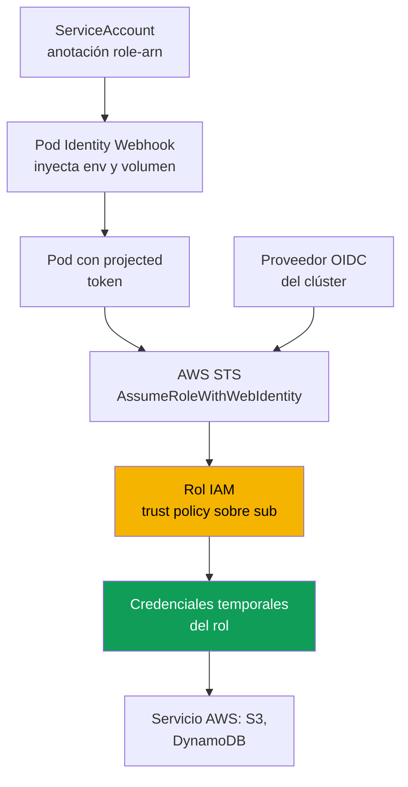
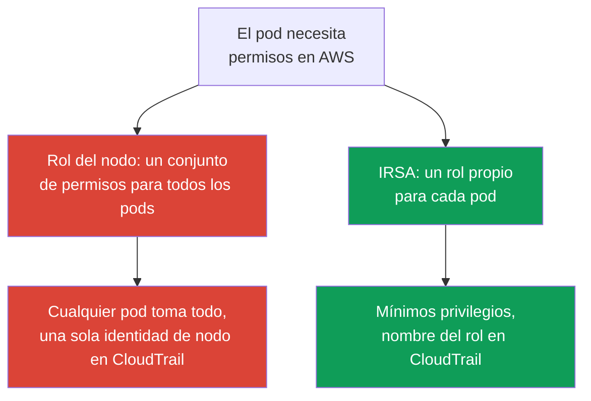

[Русская версия](ru.md) · [Eng version](en.md) · [Version française](fr.md) · [Deutsche Version](de.md) · [ქართული ვერსია](ge.md) · [繁體中文版](tw.md) · [日本語版](jp.md)
# Capítulo 16. IRSA: proveedor OIDC, trust policy y anotaciones de ServiceAccount

> **Qué sigue.** La parte 2 terminó con computación, y la parte 3 comienza con la identidad.
> El acceso de **personas y CI** al clúster se realiza mediante IAM y RBAC, las access entries
> son el capítulo 5 y no se cruzan con el capítulo actual. Aquí la tarea es distinta: el acceso
> de los **pods** a servicios de AWS (S3, DynamoDB, Secrets Manager) mediante IRSA. El mecanismo
> más reciente para el mismo propósito, EKS Pod Identity, es el capítulo 17, aquí solo haremos
> una comparación breve. Secrets y External Secrets son el capítulo 18, el hardening de IMDSv2
> y hop limit es el capítulo 19, y el pod execution role para Fargate es el capítulo 15.

## 16.1. «Dieron un rol al nodo y los permisos se filtraron a todos los pods»

Una aplicación en un pod necesita acceso a un bucket S3. El camino ingenuo parece obvio: el nodo
ya tiene un rol IAM (node IAM role, capítulo 10), bajo el que se ejecutan kubelet y VPC CNI,
agreguemos `s3:GetObject` y la aplicación funcionará. Funcionará, pero los permisos no se los
concedió a la aplicación sino al **nodo**, y no los recibió un pod, sino **todos los pods de ese
nodo**.

Las consecuencias no son visibles de inmediato, pero son graves:

- **Least privilege está roto.** El rol del nodo es compartido. Se dio acceso a S3 a una
  aplicación, pero también lo recibieron el sidecar de recopilación de logs, el pod ajeno del
  equipo vecino y un contenedor potencialmente comprometido. Es imposible separar permisos por
  pod mediante el rol del nodo.
- **Un pod puede robar las credenciales del rol del nodo.** Mientras el acceso al Instance
  Metadata Service (IMDS) no esté restringido, cualquier contenedor puede ir a
  `169.254.169.254` y obtener por completo las credenciales temporales del rol del nodo. Es justo
  la clase de problemas que resuelven el hardening de IMDSv2 y hop limit (capítulo 19), pero el
  hecho de que los permisos estén en el nodo hace de IMDS un punto de fuga.
- **La auditoría es inútil.** En CloudTrail todas las llamadas proceden del rol del nodo, y no se
  puede saber qué pod específico accedió al bucket: todos los pods tienen una misma identidad.

Se necesita una forma de conceder permisos a un **pod concreto**, y no al nodo. Eso es
exactamente lo que hace IRSA.

## 16.2. Idea principal de IRSA: un rol propio para el pod mediante ServiceAccount

IRSA (IAM Roles for Service Accounts) invierte el modelo: el pod obtiene **su propio** rol IAM
mediante el `ServiceAccount` asociado, en vez de heredar el rol del nodo. El rol del nodo se
mantiene mínimo, solo lo que necesitan kubelet y CNI, y los permisos de aplicación viven en roles
independientes, uno por conjunto de permisos.

Por debajo esto es **OIDC federation**, el mismo mecanismo de acceso federado que IAM soporta
desde 2014. Un `ServiceAccount` en EKS emite un **projected service account token** firmado, un
JWT compatible con OIDC que contiene la identidad del SA y un audience configurable. El pod
presenta el token a la operación STS `AssumeRoleWithWebIdentity`, STS verifica la firma mediante
el proveedor OIDC del clúster y devuelve **credenciales temporales** del rol solicitado. El AWS
SDK dentro del pod hace esto por sí mismo.

Tres propiedades que conviene fijar desde el principio:

- los permisos se asocian al par «namespace + nombre de ServiceAccount», no al nodo;
- las credenciales son temporales y se rotan automáticamente, no hay claves de larga duración en
  el pod;
- el rol del nodo deja de portar permisos de aplicación, y la fuga mediante IMDS pierde sentido.

## 16.3. Cómo funciona paso a paso

La imagen completa consta de cinco partes, que se configuran una vez y después funcionan
automáticamente en cada inicio de pod.



Paso a paso:

1. El clúster tiene una **OIDC issuer URL**. En IAM se crea un **IAM OIDC identity provider**
   para ella, una vez por clúster (sección 16.4).
2. Se crea un **rol IAM** con una **trust policy** que confía en ese proveedor OIDC y en un
   `ServiceAccount` **concreto** mediante una condición sobre `sub` (sección 16.5).
3. El `ServiceAccount` se marca con la anotación `eks.amazonaws.com/role-arn` que contiene el ARN
   de ese rol.
4. Al iniciar el pod, el admission webhook (EKS Pod Identity Webhook) ve la anotación, monta el
   **projected token** y añade las variables de entorno `AWS_ROLE_ARN` y
   `AWS_WEB_IDENTITY_TOKEN_FILE`.
5. El AWS SDK del contenedor lee estas variables, llama a `AssumeRoleWithWebIdentity` y obtiene
   las credenciales temporales del rol. A continuación, la aplicación trabaja con los servicios
   AWS en nombre del rol.

## 16.4. Proveedor OIDC del clúster

Cada clúster EKS tiene su propia OIDC issuer URL, de la forma
`https://oidc.eks.<region>.amazonaws.com/id/<id>`. Es un discovery endpoint público: contiene las
claves públicas con las que se firman los projected tokens. La clave privada de firma rota cada 7
días, y EKS conserva las públicas hasta su vencimiento. Los clientes OIDC externos deben actualizar
las claves antes de que venzan, pero para IAM esto sucede de forma transparente.

Que el clúster tenga una issuer URL no significa todavía que la federación funcione. En IAM hay que
crear un **IAM OIDC identity provider** para esa URL, al que harán referencia las trust policies de
los roles. El proveedor se crea **una vez por clúster**: es compartido por todos los roles IRSA.

```bash
# ver la issuer URL del clúster
aws eks describe-cluster --name demo \
  --query 'cluster.identity.oidc.issuer' --output text

# crear el IAM OIDC provider (idempotente, no hace nada si ya existe)
eksctl utils associate-iam-oidc-provider --cluster demo --approve

# comprobar que el proveedor está registrado
aws iam list-open-id-connect-providers
```

Internamente, `eksctl` llama a `aws iam create-open-id-connect-provider`; también se puede hacer
manualmente o mediante Terraform (`aws_iam_openid_connect_provider`), pasando la URL, el client id
`sts.amazonaws.com` y la huella del certificado raíz. La vía manual rara vez es necesaria: `eksctl`
y los módulos IaC de EKS lo hacen por sí mismos. Si la VPC no tiene salida a Internet y no se ha
configurado acceso privado al endpoint OIDC, el comando no resolverá el host del issuer. Para un
clúster privado se necesita el VPC interface endpoint `com.amazonaws.<region>.oidc-eks`
(capítulo 19).

## 16.5. Trust policy en detalle

La trust policy (assume role policy) del rol es el lugar donde el principal federado se vincula con
un `ServiceAccount` **concreto**. Desglosémosla por partes.

```json
{
  "Version": "2012-10-17",
  "Statement": [
    {
      "Effect": "Allow",
      "Principal": {
        "Federated": "arn:aws:iam::111122223333:oidc-provider/oidc.eks.eu-central-1.amazonaws.com/id/EXAMPLED539D4633E53DE1B716D3041E"
      },
      "Action": "sts:AssumeRoleWithWebIdentity",
      "Condition": {
        "StringEquals": {
          "oidc.eks.eu-central-1.amazonaws.com/id/EXAMPLED539D4633E53DE1B716D3041E:sub": "system:serviceaccount:payments:s3-reader",
          "oidc.eks.eu-central-1.amazonaws.com/id/EXAMPLED539D4633E53DE1B716D3041E:aud": "sts.amazonaws.com"
        }
      }
    }
  ]
}
```

- **`Principal.Federated`** es el ARN del IAM OIDC provider de la sección 16.4, no la propia URL.
  Le indica a IAM: confía en los tokens firmados por este proveedor.
- **`Action`** es estrictamente `sts:AssumeRoleWithWebIdentity`; no funcionará otra forma de asumir
  el rol mediante web identity.
- **La condición sobre `sub`** es la más importante. La clave `<oidc-provider>:sub` se compara con
  el valor `system:serviceaccount:<namespace>:<serviceaccount>`. Esto es lo que vincula el rol a
  un único SA concreto de un namespace concreto.
- **La condición sobre `aud`** es `sts.amazonaws.com`, el audience del projected token.

La precisión de la condición sobre `sub` es una cuestión de seguridad, no una formalidad. Si se
establece mediante `StringLike` con el patrón `system:serviceaccount:*:*`, o se elimina por
completo, **cualquier** `ServiceAccount` del clúster podrá asumir el rol, en la práctica cualquier
pod. La condición sobre `sub` debe indicar exactamente el namespace y el nombre de SA para los que
está destinado el rol.

## 16.6. Anotación de ServiceAccount y qué ve el pod

Del lado de Kubernetes se necesita un `ServiceAccount` con la anotación
`eks.amazonaws.com/role-arn`.

```yaml
apiVersion: v1
kind: ServiceAccount
metadata:
  name: s3-reader
  namespace: payments
  annotations:
    eks.amazonaws.com/role-arn: arn:aws:iam::111122223333:role/payments-s3-reader
```

La forma más sencilla es crear el rol, el SA y vincularlos con un único comando `eksctl`: crea por
sí mismo la trust policy con la condición correcta sobre `sub` y añade la anotación:

```bash
eksctl create iamserviceaccount \
  --cluster demo --namespace payments --name s3-reader \
  --attach-policy-arn arn:aws:iam::111122223333:policy/payments-s3-read \
  --approve

kubectl -n payments describe serviceaccount s3-reader   # se ve la anotación role-arn
```

El mismo resultado con Terraform nativo, sin `eksctl`: proveedor OIDC y rol con una trust policy
sobre el `sub`/`aud` exacto (la anotación del SA se añade por separado en el manifiesto de la
sección 16.6).

```hcl
data "aws_eks_cluster" "demo" { name = "demo" }

data "tls_certificate" "oidc" {
  url = data.aws_eks_cluster.demo.identity[0].oidc[0].issuer
}

resource "aws_iam_openid_connect_provider" "eks" {          # una vez por clúster
  url             = data.aws_eks_cluster.demo.identity[0].oidc[0].issuer
  client_id_list  = ["sts.amazonaws.com"]
  thumbprint_list = [data.tls_certificate.oidc.certificates[0].sha1_fingerprint]
}

locals { oidc = replace(aws_iam_openid_connect_provider.eks.url, "https://", "") }

resource "aws_iam_role" "s3_reader" {
  name = "payments-s3-reader"
  assume_role_policy = jsonencode({
    Version   = "2012-10-17"
    Statement = [{
      Effect    = "Allow"
      Principal = { Federated = aws_iam_openid_connect_provider.eks.arn }
      Action    = "sts:AssumeRoleWithWebIdentity"
      Condition = { StringEquals = {
        "${local.oidc}:sub" = "system:serviceaccount:payments:s3-reader"
        "${local.oidc}:aud" = "sts.amazonaws.com"
      } }
    }]
  })
}
```

La permissions policy se añade por separado (`aws_iam_role_policy_attachment`); la trust policy
es exactamente la condición de la sección 16.5, solo expresada en HCL.

A continuación, el pod debe usar este SA (`spec.serviceAccountName: s3-reader`). Al iniciar el
pod, Pod Identity Webhook inyecta en los contenedores:

| Qué se inyecta | Valor | Para qué |
|---|---|---|
| Variable `AWS_ROLE_ARN` | ARN del rol de la anotación del SA | El SDK sabe qué rol asumir |
| Variable `AWS_WEB_IDENTITY_TOKEN_FILE` | ruta al archivo de token en el pod | El SDK sabe de dónde obtener el token |
| Volumen projected con el token | JWT con `aud=sts.amazonaws.com` y expiry | Se presenta a STS para intercambiarlo por credenciales |
| Variable `AWS_STS_REGIONAL_ENDPOINTS` | `regional` (valor predeterminado en EKS) | El SDK usa STS regional, no global |

Por defecto, el webhook establece `AWS_STS_REGIONAL_ENDPOINTS=regional`, y el SDK se conecta al
endpoint regional `sts.<region>.amazonaws.com` en lugar del global `sts.amazonaws.com`: menor
latencia, redundancia propia de la región y mayor duración del token de sesión. Para un clúster
privado sin salida a Internet es obligatorio: el tráfico STS pasa por el VPC interface endpoint
`com.amazonaws.<region>.sts`, mientras que el endpoint global lo evita. El modo se cambia con la
anotación del SA `eks.amazonaws.com/sts-regional-endpoints` (`true`/`false`); casi nunca hace falta
establecer `false`.

El token se monta como projected service account token: tiene audience y tiempo de vida, y kubelet
lo actualiza antes de que venza. La aplicación debe usar un **AWS SDK compatible**: las versiones
actuales de todos los SDK y un AWS CLI reciente soportan web identity; un SDK muy antiguo ignorará
las variables y buscará las credenciales del rol del nodo.

## 16.7. Errores comunes y diagnóstico

IRSA falla de manera predecible, y casi todos los rechazos se reducen a unas pocas causas.

| Síntoma | Causa probable | Qué comprobar |
|---|---|---|
| `AccessDenied` en `AssumeRoleWithWebIdentity` | la condición sobre `sub` de la trust policy no coincide | namespace y nombre de SA en `sub` |
| El SDK toma credenciales del rol del nodo, no del rol del SA | el SA no está anotado o el pod no se recreó | anotación del SA, reinicio del pod |
| No hay variables `AWS_ROLE_ARN` en el pod | el pod se creó antes de la anotación, el webhook no actuó | recrear el pod |
| `AccessDenied` ya en la llamada al servicio | el rol no tiene la IAM policy necesaria | permissions policy del rol |
| Nada funciona con una aplicación antigua | AWS SDK incompatible o muy antiguo | versión del SDK |

Orden de diagnóstico, desde el pod hacia fuera:

```bash
# 1. ¿están las variables de entorno?
kubectl -n payments exec deploy/my-app -- env | grep AWS_

# 2. ¿como quién se ve el pod en AWS? Debe ser el assumed-role del rol deseado, no el rol del nodo
kubectl -n payments exec deploy/my-app -- aws sts get-caller-identity

# 3. ¿la anotación está realmente en el SA que usa el pod?
kubectl -n payments get sa s3-reader -o yaml | grep role-arn
```

La comprobación clave es `aws sts get-caller-identity` desde el pod: si en `Arn` aparece
`assumed-role/payments-s3-reader/...`, la federación se completó y el problema está en la
permissions policy del rol; si aparece el rol del nodo, el pod no obtuvo las credenciales del rol
del SA y la causa está más arriba en la tabla. Otro problema frecuente: se añadió la anotación,
pero **no se recreó el pod**; el webhook inyecta las variables solo al crear el pod, un pod activo
no las recibirá.

## 16.8. IRSA frente al rol del nodo



La diferencia es fundamental. El rol del nodo es **compartido** por todos los pods del nodo:
todos reciben cualquier permiso concedido a él, y la identidad en CloudTrail es una sola para
todos. IRSA proporciona **least privilege a nivel de pod**: cada aplicación tiene su propio rol
con sus propios permisos, las llamadas de CloudTrail proceden de él y un pod comprometido queda
limitado por sus permisos.

El rol del nodo conserva exactamente lo que necesitan los componentes del sistema del nodo: pull
de imágenes de ECR, operación de VPC CNI con ENI, escritura de logs y métricas de CloudWatch, lo
que definen managed policies como `AmazonEKSWorkerNodePolicy` y
`AmazonEC2ContainerRegistryReadOnly` (capítulo 10). Los permisos de aplicación no deben estar
ahí. Cuando el rol del nodo es mínimo y IMDS está restringido (capítulo 19), no hay nada que robar.

## 16.9. Comparación breve con Pod Identity

EKS Pod Identity resuelve de otra forma la misma tarea, «un rol propio para el pod», y se trata en
detalle en el capítulo 17. Aquí solo se presentan los límites de la elección, para entender que
IRSA no es la única opción.

| Propiedad | IRSA | EKS Pod Identity |
|---|---|---|
| Mecanismo | OIDC federation, trust policy sobre `sub` | agente en el nodo y API de EKS |
| Configuración por clúster | IAM OIDC provider, una trust policy por rol | instalación del addon Pod Identity Agent |
| Trust policy del rol | vinculada a un proveedor OIDC concreto | principal común `pods.eks.amazonaws.com` |
| Cross-account y fuera de EKS | funciona (federation mediante OIDC) | más limitado, vinculado a EKS |
| Antigüedad | veterano, ampliamente extendido | más reciente, más sencillo de asociar |

En resumen: IRSA es más flexible (funciona mediante OIDC estándar, sirve para cross-account y
fuera de EKS), pero la configuración es más verbosa, con una trust policy por rol que contiene un
`sub` exacto. Pod Identity es más sencillo de asociar (la asociación se realiza mediante la API de
EKS, el rol no está vinculado al proveedor OIDC del clúster), pero es un mecanismo más reciente
con sus propias limitaciones. Los detalles, la migración y los criterios de elección están en el
capítulo 17.

## 16.10. Cómo se aplica en producción

- **El proveedor OIDC se crea junto con el clúster** en IaC, no manualmente después: sin él no
  funciona ningún rol IRSA, y es el primer paso tras crear el clúster.
- **Un rol, un conjunto de permisos, un ServiceAccount.** No se reutilizan roles entre distintas
  aplicaciones: cada SA tiene su propio rol con privilegios mínimos y una condición exacta sobre
  `sub`.
- **El rol del nodo se mantiene mínimo.** Solo incluye permisos para componentes de sistema; los
  permisos de aplicación se extraen a roles IRSA e IMDS se restringe mediante hop limit
  (capítulo 19).
- **La condición sobre `sub` siempre es exacta**, un namespace y nombre de SA concretos, sin
  patrones `*`; de lo contrario cualquier pod del clúster podrá asumir el rol.
- **Los roles y SA se describen como código.** `eksctl create iamserviceaccount` o un módulo de
  Terraform crean juntos el rol, la trust policy y el SA anotado para que no se desalineen.

## 16.11. Mini glosario

- **IRSA**: IAM Roles for Service Accounts, mecanismo para conceder un rol IAM a un pod mediante
  el `ServiceAccount` asociado y basado en OIDC federation.
- **OIDC issuer URL**: endpoint OIDC público del clúster
  (`oidc.eks.<region>.amazonaws.com/id/`) con claves públicas para firmar projected tokens.
- **IAM OIDC identity provider**: objeto IAM que registra la issuer URL del clúster; las trust
  policies de los roles hacen referencia a él. Se crea una vez por clúster.
- **Trust policy**: política de confianza del rol: principal `Federated` (ARN del proveedor OIDC),
  `Action` `sts:AssumeRoleWithWebIdentity` y condiciones `StringEquals` sobre `sub` y `aud`.
- **Projected service account token**: JWT compatible con OIDC con identidad del SA, audience
  `sts.amazonaws.com` y tiempo de vida; se monta en el pod y se intercambia en STS por
  credenciales.
- **`AssumeRoleWithWebIdentity`**: operación STS que intercambia un web identity token por
  credenciales temporales de un rol IAM.

## 16.12. Resumen del capítulo

- El camino ingenuo de «dar permisos al rol del nodo» rompe least privilege (todos los pods del
  nodo reciben los permisos), convierte el rol del nodo en objetivo de robo mediante IMDS y
  despersonaliza CloudTrail. IRSA concede permisos a un pod concreto.
- IRSA se basa en OIDC federation: un `ServiceAccount` emite un projected token firmado, el pod lo
  presenta a STS mediante `AssumeRoleWithWebIdentity`, STS verifica la firma por medio del
  proveedor OIDC del clúster y devuelve las credenciales temporales del rol.
- Las cinco partes del mecanismo son: OIDC issuer URL del clúster, IAM OIDC identity provider (uno
  por clúster), rol IAM con trust policy sobre `sub`, anotación `eks.amazonaws.com/role-arn` en el
  SA, projected token y las variables `AWS_ROLE_ARN`, `AWS_WEB_IDENTITY_TOKEN_FILE` inyectadas por
  el webhook.
- La trust policy vincula el rol a un SA concreto con la condición `StringEquals` sobre
  `<oidc-provider>:sub` = `system:serviceaccount:NS:SA` y sobre `aud` = `sts.amazonaws.com`.
  Un patrón en lugar de un `sub` exacto abre el rol a cualquier pod.
- El diagnóstico va desde el pod hacia fuera: variables `AWS_*` en el pod,
  `aws sts get-caller-identity` (el assumed-role del rol deseado, no el rol del nodo), la
  anotación en el SA, si el pod se recreó y la versión del SDK. `AccessDenied` en la llamada al
  servicio ya corresponde a la permissions policy del rol.
- El rol del nodo permanece mínimo (kubelet, CNI, ECR, logs); los permisos de aplicación van en
  roles IRSA.
- Pod Identity (capítulo 17) resuelve la misma tarea mediante un agente y la API de EKS: es más
  sencillo de asociar, pero IRSA es más flexible para cross-account y casos fuera de EKS.

## 16.13. Cómo resulta útil en el trabajo real

Con IRSA, la pregunta «qué permisos tiene este pod en AWS» se responde con un único rol y su
permissions policy, no examinando lo que se acumuló en un rol de nodo compartido. El incidente
«el pod se comprometió» queda limitado por los permisos de su rol, no por todo lo que puede hacer
el nodo. La investigación mediante CloudTrail también es más útil: las llamadas proceden del rol
de la aplicación concreta y se ve quién accedió al bucket o la tabla. Durante una guardia, la
mayoría de los avisos «la aplicación recibe AccessDenied de AWS» se resuelven con la misma cadena
corta de la sección 16.7: variables en el pod, `get-caller-identity`, anotación del SA y si el pod
se recreó.

## 16.14. Preguntas de autoevaluación

1. ¿Qué tiene de malo el enfoque de «agregar el permiso necesario al rol del nodo» desde el punto
   de vista de least privilege y la auditoría?
2. ¿Cómo puede un pod obtener las credenciales del rol del nodo y qué capítulo cubre esta brecha?
3. ¿Sobre qué mecanismo de AWS se construye IRSA y qué operación de STS intercambia el token por
   credenciales?
4. ¿Qué es la OIDC issuer URL del clúster y en qué se diferencia del IAM OIDC identity provider?
5. ¿Por qué el IAM OIDC provider se crea una vez por clúster y puede haber muchos roles IRSA?
6. ¿De qué partes consta la trust policy de un rol IRSA y qué establece `Principal.Federated`?
7. ¿Por qué la condición sobre `sub` debe ser exacta y qué sucederá con el patrón `*`?
8. ¿Qué variables de entorno y qué volumen inyecta el webhook en el pod, y cómo sabe que debe
   hacerlo?
9. El pod se anotó, pero sigue usando el rol del nodo. Nombre dos causas probables.
10. ¿Cómo saber con un único comando desde el pod si la federación se completó y distinguirlo de
    una falta de permisos?
11. ¿Qué debe quedar en el rol del nodo tras pasar a IRSA?
12. ¿En qué se diferencia IRSA de Pod Identity y cuándo es preferible IRSA?

## Práctica

El laboratorio del curso para este tema es el [laboratorio 104 - Workload identity: IRSA y Pod
Identity para una aplicación](../../labs/104/README_ES.MD). IRSA también aparece en el
[laboratorio 106 - EBS CSI](../../labs/106/README_ES.MD) y el
[laboratorio 107 - EFS CSI](../../labs/107/README_ES.MD) como una forma de conceder permisos al
driver. Además de ellos, todo se comprueba en un clúster activo. Comience con
`aws eks describe-cluster --name <cluster> --query 'cluster.identity.oidc.issuer'` y
`aws iam list-open-id-connect-providers`: compruebe si el clúster tiene una issuer URL y si se
creó un IAM OIDC provider para ella. Si no hay proveedor, créelo con el comando
`eksctl utils associate-iam-oidc-provider --cluster <cluster> --approve`.

Después, cree un rol de prueba y un SA mediante `eksctl create iamserviceaccount` con una policy
solo de lectura sobre un bucket, inicie un pod con este SA y ejecute en él
`aws sts get-caller-identity`: en `Arn` debe aparecer el assumed-role de su rol, no el rol del
nodo. Consulte `kubectl exec ... -- env | grep AWS_` para ver `AWS_ROLE_ARN` y
`AWS_WEB_IDENTITY_TOKEN_FILE`, y `kubectl describe sa` para la anotación con el ARN del rol.
Practique también un rechazo: corrompa la condición sobre `sub` de la trust policy (cambie el
namespace), recree el pod y encuentre el `AccessDenied` en `AssumeRoleWithWebIdentity`; después
restaure el `sub` exacto y asegúrese de que volvió el acceso. Examine la trust policy del rol con
`aws iam get-role --role-name <role>` y compare `sub` y `aud` con la sección 16.5.

---
[Tabla de contenido](../README_ES.md) · [Capítulo 15](../15/es.md) · [Capítulo 17](../17/es.md)
