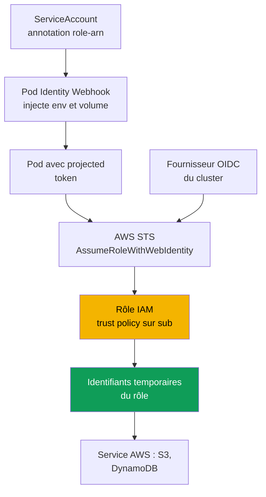
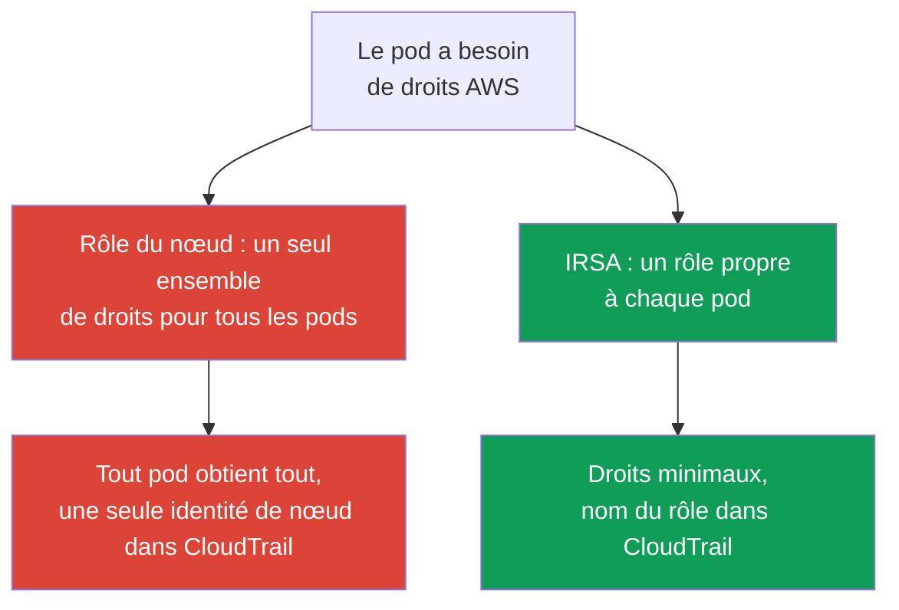

[Русская версия](ru.md) · [Eng version](en.md) · [Versión en español](es.md) · [Deutsche Version](de.md) · [ქართული ვერსია](ge.md) · [繁體中文版](tw.md) · [日本語版](jp.md)
# Chapitre 16. IRSA : fournisseur OIDC, trust policy, annotations ServiceAccount

> **La suite.** La partie 2 s'est achevée avec le calcul et la partie 3 s'ouvre avec l'identité.
> L'accès des **utilisateurs et de la CI** au cluster passe par IAM et RBAC, les access entries
> sont traitées au chapitre 5 et ne recoupent pas le présent chapitre. Ici, l'enjeu est différent :
> l'accès des **pods** aux services AWS (S3, DynamoDB, Secrets Manager) via IRSA. Le mécanisme
> plus récent poursuivant le même objectif, EKS Pod Identity, est traité au chapitre 17, avec
> seulement une brève comparaison ici. Les secrets et External Secrets sont au chapitre 18, le
> durcissement d'IMDSv2 et le hop limit au chapitre 19, le pod execution role pour Fargate au chapitre 15.

## 16.1. « Nous avons donné le rôle au nœud, et les droits ont fuité vers tous les pods »

Une application dans un pod a besoin d'accéder à un bucket S3. La voie naïve paraît évidente : le
nœud possède déjà un rôle IAM (node IAM role, chapitre 10), sous lequel s'exécutent kubelet et VPC
CNI, ajoutons-lui `s3:GetObject` et l'application fonctionnera. Elle fonctionnera, mais vous n'avez
pas donné le droit à l'application : vous l'avez donné au **nœud**, et ce n'est pas un seul pod qui
l'obtient, mais **tous les pods de ce nœud**.

Les conséquences ne sont pas immédiatement visibles, mais elles sont graves :

- **Le least privilege est rompu.** Le rôle du nœud est partagé. Donnez l'accès à S3 à une
  application, et le sidecar de collecte des logs, le pod voisin d'une autre équipe et un conteneur
  potentiellement compromis l'obtiennent aussi. Il est fondamentalement impossible de séparer les
  droits par pod au moyen du rôle du nœud.
- **Un pod peut voler les identifiants du rôle du nœud.** Tant que l'accès à l'Instance Metadata
  Service (IMDS) n'est pas restreint, tout conteneur peut aller sur `169.254.169.254` et récupérer
  l'intégralité des identifiants temporaires du rôle du nœud. C'est précisément la classe de
  problèmes que le durcissement d'IMDSv2 et le hop limit résolvent (chapitre 19), mais le simple
  fait que les droits soient portés par le nœud fait d'IMDS un point de fuite.
- **L'audit est inutile.** Dans CloudTrail, tous les appels proviennent du rôle du nœud, et il est
  impossible de déterminer quel pod a accédé au bucket : tous les pods ont la même identité.

Il faut un moyen d'accorder des droits à **un pod précis**, et non au nœud. C'est exactement ce que fait IRSA.

## 16.2. L'idée principale d'IRSA : un rôle propre au pod via ServiceAccount

IRSA (IAM Roles for Service Accounts) inverse le modèle : le pod reçoit **son propre** rôle IAM
via le `ServiceAccount` qui lui est associé, au lieu d'hériter du rôle du nœud. Le rôle du nœud
reste minimal, avec seulement ce dont kubelet et CNI ont besoin, tandis que les droits applicatifs
vivent dans des rôles séparés, un par ensemble d'autorisations.

Sous le capot, il s'agit d'une **fédération OIDC**, le même mécanisme d'accès fédéré qu'IAM prend
en charge depuis 2014. Un `ServiceAccount` dans EKS émet un **projected service account token**
signé : un JWT compatible OIDC contenant l'identité du SA et une audience configurable. Le pod
présente ce token à l'opération STS `AssumeRoleWithWebIdentity`, STS vérifie la signature via le
fournisseur OIDC du cluster et renvoie les **identifiants temporaires** du rôle demandé. Le SDK AWS
dans le pod effectue cela automatiquement.

Trois propriétés à retenir immédiatement :

- les droits sont associés à la paire « namespace + nom du ServiceAccount », et non au nœud ;
- les identifiants sont temporaires et automatiquement renouvelés, il n'y a aucune clé longue durée dans le pod ;
- le rôle du nœud ne porte plus les droits applicatifs, et une fuite via IMDS perd son intérêt.

## 16.3. Fonctionnement étape par étape

La vue d'ensemble comprend cinq éléments, configurés une fois puis exécutés automatiquement à
chaque démarrage de pod.



Étape par étape :

1. Le cluster possède une **OIDC issuer URL**. Un **IAM OIDC identity provider** est créé dans IAM
   pour cette URL, une fois par cluster (section 16.4).
2. Un **rôle IAM** est créé avec une **trust policy** qui fait confiance à ce fournisseur OIDC et
   à un `ServiceAccount` **précis** au moyen d'une condition sur `sub` (section 16.5).
3. Le `ServiceAccount` reçoit l'annotation `eks.amazonaws.com/role-arn` avec l'ARN de ce rôle.
4. Au démarrage du pod, l'admission webhook (EKS Pod Identity Webhook) voit l'annotation, monte un
   **projected token** et ajoute les variables d'environnement `AWS_ROLE_ARN` et
   `AWS_WEB_IDENTITY_TOKEN_FILE`.
5. Le SDK AWS du conteneur lit ces variables, appelle `AssumeRoleWithWebIdentity` et obtient les
   identifiants temporaires du rôle. L'application utilise ensuite les services AWS au nom du rôle.

## 16.4. Le fournisseur OIDC du cluster

Chaque cluster EKS possède sa propre OIDC issuer URL au format
`https://oidc.eks.<region>.amazonaws.com/id/<id>`. C'est un endpoint de découverte public : il
contient les clés publiques qui signent les projected tokens. La clé privée de signature est
renouvelée tous les 7 jours, et EKS conserve les clés publiques jusqu'à leur expiration. Les
clients OIDC externes doivent renouveler les clés avant leur expiration, mais cela est transparent
pour IAM lui-même.

La présence d'une issuer URL sur le cluster ne signifie pas encore que la fédération fonctionne.
Il faut créer dans IAM un **IAM OIDC identity provider** pour cette URL : les trust policies des
rôles s'y référeront. Le fournisseur est créé **une fois par cluster** et est partagé par tous les rôles IRSA.

```bash
# afficher l'issuer URL du cluster
aws eks describe-cluster --name demo \
  --query 'cluster.identity.oidc.issuer' --output text

# créer l'IAM OIDC provider (idempotent, ne fait rien s'il existe déjà)
eksctl utils associate-iam-oidc-provider --cluster demo --approve

# vérifier que le fournisseur est enregistré
aws iam list-open-id-connect-providers
```

En interne, `eksctl` appelle `aws iam create-open-id-connect-provider` : il est aussi possible de
le faire manuellement ou via Terraform (`aws_iam_openid_connect_provider`), en fournissant l'URL,
l'ID client `sts.amazonaws.com` et l'empreinte du certificat racine. La voie manuelle est rarement
nécessaire : `eksctl` et les modules IaC EKS le font eux-mêmes. Si le VPC n'a pas d'accès Internet
sortant et qu'aucun accès privé à l'endpoint OIDC n'est configuré, la commande ne résout pas l'hôte
de l'issuer. Pour un cluster privé, un VPC interface endpoint
`com.amazonaws.<region>.oidc-eks` est nécessaire (chapitre 19).

## 16.5. La trust policy en détail

La trust policy (assume role policy) du rôle est l'endroit où le principal fédéré est associé à un
`ServiceAccount` **précis**. Décomposons-la.

```json
{
  "Version": "2012-10-17",
  "Statement": [
    {
      "Effect": "Allow",
      "Principal": {
        "Federated": "arn:aws:iam::111122223333:oidc-provider/oidc.eks.eu-central-1.amazonaws.com/id/EXAMPLED539D4633E53DE1B716D3041E"
      },
      "Action": "sts:AssumeRoleWithWebIdentity",
      "Condition": {
        "StringEquals": {
          "oidc.eks.eu-central-1.amazonaws.com/id/EXAMPLED539D4633E53DE1B716D3041E:sub": "system:serviceaccount:payments:s3-reader",
          "oidc.eks.eu-central-1.amazonaws.com/id/EXAMPLED539D4633E53DE1B716D3041E:aud": "sts.amazonaws.com"
        }
      }
    }
  ]
}
```

- **`Principal.Federated`** : l'ARN de l'IAM OIDC provider de la section 16.4, et non l'URL elle-même.
  Il indique à IAM de faire confiance aux tokens signés par ce fournisseur.
- **`Action`** : strictement `sts:AssumeRoleWithWebIdentity` ; toute autre façon d'assumer un rôle
  via web identity échouera.
- **La condition sur `sub`** : c'est l'élément le plus important. La clé `<oidc-provider>:sub` est
  comparée à la valeur `system:serviceaccount:<namespace>:<serviceaccount>`. C'est elle qui lie le
  rôle à un seul SA précis dans un namespace précis.
- **La condition sur `aud`** : `sts.amazonaws.com`, l'audience du projected token.

La précision de la condition sur `sub` est une question de sécurité, non une formalité. Si vous la
définissez avec `StringLike` et le motif `system:serviceaccount:*:*`, ou si vous l'omettez
complètement, **tout** `ServiceAccount` du cluster pourra assumer le rôle, donc pratiquement tout
pod. La condition sur `sub` doit désigner exactement le namespace et le nom du SA auxquels le rôle est destiné.

## 16.6. L'annotation ServiceAccount et ce que voit le pod

Côté Kubernetes, il faut un `ServiceAccount` avec l'annotation `eks.amazonaws.com/role-arn`.

```yaml
apiVersion: v1
kind: ServiceAccount
metadata:
  name: s3-reader
  namespace: payments
  annotations:
    eks.amazonaws.com/role-arn: arn:aws:iam::111122223333:role/payments-s3-reader
```

Le plus simple est de créer le rôle, le SA et de les associer avec une unique commande `eksctl` :
elle crée elle-même la trust policy avec la bonne condition sur `sub` et applique l'annotation.

```bash
eksctl create iamserviceaccount \
  --cluster demo --namespace payments --name s3-reader \
  --attach-policy-arn arn:aws:iam::111122223333:policy/payments-s3-read \
  --approve

kubectl -n payments describe serviceaccount s3-reader   # l'annotation role-arn est visible
```

Le même résultat avec Terraform natif, sans `eksctl` : le fournisseur OIDC et un rôle avec une
trust policy sur le `sub`/`aud` exact. L'annotation du SA est appliquée séparément dans le
manifeste de la section 16.6.

```hcl
data "aws_eks_cluster" "demo" { name = "demo" }

data "tls_certificate" "oidc" {
  url = data.aws_eks_cluster.demo.identity[0].oidc[0].issuer
}

resource "aws_iam_openid_connect_provider" "eks" {          # une fois par cluster
  url             = data.aws_eks_cluster.demo.identity[0].oidc[0].issuer
  client_id_list  = ["sts.amazonaws.com"]
  thumbprint_list = [data.tls_certificate.oidc.certificates[0].sha1_fingerprint]
}

locals { oidc = replace(aws_iam_openid_connect_provider.eks.url, "https://", "") }

resource "aws_iam_role" "s3_reader" {
  name = "payments-s3-reader"
  assume_role_policy = jsonencode({
    Version   = "2012-10-17"
    Statement = [{
      Effect    = "Allow"
      Principal = { Federated = aws_iam_openid_connect_provider.eks.arn }
      Action    = "sts:AssumeRoleWithWebIdentity"
      Condition = { StringEquals = {
        "${local.oidc}:sub" = "system:serviceaccount:payments:s3-reader"
        "${local.oidc}:aud" = "sts.amazonaws.com"
      } }
    }]
  })
}
```

La permissions policy est associée séparément (`aws_iam_role_policy_attachment`) ; la trust policy
ici correspond exactement à la condition de la section 16.5, exprimée en HCL.

Le pod doit ensuite utiliser ce SA (`spec.serviceAccountName: s3-reader`). Au démarrage du pod,
le Pod Identity Webhook injecte dans les conteneurs :

| Élément injecté | Valeur | Utilité |
|---|---|---|
| Variable `AWS_ROLE_ARN` | ARN du rôle de l'annotation du SA | Le SDK sait quel rôle assumer |
| Variable `AWS_WEB_IDENTITY_TOKEN_FILE` | chemin du fichier token dans le pod | Le SDK sait où trouver le token |
| Projected volume contenant le token | JWT avec `aud=sts.amazonaws.com` et expiry | Présenté à STS pour l'échanger contre des identifiants |
| Variable `AWS_STS_REGIONAL_ENDPOINTS` | `regional` (valeur par défaut dans EKS) | Le SDK utilise STS régional, non global |

Par défaut, le webhook définit `AWS_STS_REGIONAL_ENDPOINTS=regional` et le SDK appelle l'endpoint
régional `sts.<region>.amazonaws.com` au lieu du global `sts.amazonaws.com` : la latence est plus
faible, la redondance est propre à la région et la durée de vie du token de session est plus longue.
Pour un cluster privé sans sortie Internet, c'est obligatoire : le trafic STS passe par le VPC
interface endpoint `com.amazonaws.<region>.sts`, tandis que l'endpoint global le contourne. Le
mode est changé avec l'annotation SA `eks.amazonaws.com/sts-regional-endpoints` (`true`/`false`) ;
il n'est pratiquement jamais nécessaire de définir `false`.

Le token est monté comme projected service account token : il possède une audience et une durée de
vie, et kubelet le renouvelle avant son expiration. L'application doit utiliser un **SDK AWS
compatible** : les versions actuelles de tous les SDK et les versions récentes d'AWS CLI prennent
en charge web identity ; un SDK très ancien ignorera les variables et ira chercher les identifiants
du rôle du nœud.

## 16.7. Erreurs fréquentes et diagnostic

IRSA échoue de façon prévisible, et presque tous les refus se ramènent à quelques causes.

| Symptôme | Cause probable | À vérifier |
|---|---|---|
| `AccessDenied` sur `AssumeRoleWithWebIdentity` | la condition `sub` de la trust policy ne correspond pas | namespace et nom du SA dans `sub` |
| Le SDK utilise les identifiants du rôle du nœud, non du rôle SA | SA non annoté ou pod non recréé | annotation du SA, redémarrage du pod |
| Les variables `AWS_ROLE_ARN` sont absentes du pod | pod créé avant l'annotation, webhook non exécuté | recréer le pod |
| `AccessDenied` déjà lors de l'appel au service | le rôle n'a pas la IAM policy requise | permissions policy du rôle |
| Rien ne fonctionne avec l'ancienne application | SDK AWS incompatible ou très ancien | version du SDK |

Ordre du diagnostic, du pod vers l'extérieur :

```bash
# 1. les variables d'environnement sont-elles présentes ?
kubectl -n payments exec deploy/my-app -- env | grep AWS_

# 2. sous quelle identité le pod se voit-il dans AWS ? Ce doit être l'assumed-role du rôle attendu, non le rôle du nœud
kubectl -n payments exec deploy/my-app -- aws sts get-caller-identity

# 3. l'annotation est-elle bien sur le SA utilisé par le pod ?
kubectl -n payments get sa s3-reader -o yaml | grep role-arn
```

La vérification clé est `aws sts get-caller-identity` depuis le pod : si l'`Arn` affiche
`assumed-role/payments-s3-reader/...`, la fédération a réussi et le problème se situe dans la
permissions policy du rôle. S'il affiche le rôle du nœud, le pod n'a pas reçu les identifiants du
rôle SA et la cause est en amont dans le tableau. Autre piège fréquent : l'annotation a été ajoutée,
mais le **pod n'a pas été recréé**. Le webhook n'injecte les variables qu'à la création du pod, un
pod existant ne les recevra pas.

## 16.8. IRSA contre le rôle du nœud



La différence est fondamentale. Le rôle du nœud est **partagé** par tous les pods du nœud : tous
obtiennent les droits qui lui sont accordés, et l'identité dans CloudTrail est unique pour tous.
IRSA fournit le **least privilege au niveau du pod** : chaque application a son rôle et ses droits,
les appels CloudTrail proviennent de ce rôle, et un pod compromis est limité à ses propres autorisations.

Le rôle du nœud conserve uniquement ce dont les composants système du nœud ont besoin : pull des
images depuis ECR, opération du VPC CNI avec les ENI, écriture des logs et métriques CloudWatch,
soit ce que définissent les managed policies telles que `AmazonEKSWorkerNodePolicy` et
`AmazonEC2ContainerRegistryReadOnly` (chapitre 10). Il ne doit contenir aucun droit applicatif.
Lorsque le rôle du nœud est minimal et qu'IMDS est restreint (chapitre 19), il n'y a rien à y voler.

## 16.9. Brève comparaison avec Pod Identity

EKS Pod Identity résout autrement le même problème, « un rôle propre au pod », et est traité en
détail au chapitre 17. Ici, seulement les critères de choix pour comprendre qu'IRSA n'est pas la seule option.

| Propriété | IRSA | EKS Pod Identity |
|---|---|---|
| Mécanisme | fédération OIDC, trust policy sur `sub` | agent sur le nœud et API EKS |
| Configuration du cluster | IAM OIDC provider, une trust policy par rôle | installation de l'add-on Pod Identity Agent |
| Trust policy du rôle | liée à un fournisseur OIDC spécifique | principal commun `pods.eks.amazonaws.com` |
| Cross-account et hors EKS | fonctionne (fédération OIDC) | plus limité, lié à EKS |
| Ancienneté | établi, largement répandu | plus récent, association plus simple |

En bref, IRSA est plus flexible, car il fonctionne avec l'OIDC standard et convient au
cross-account et à l'extérieur d'EKS, mais sa configuration est plus verbeuse : chaque rôle a sa
propre trust policy avec un `sub` exact. Pod Identity est plus simple à associer, car l'association
se fait via l'API EKS et le rôle n'est pas lié au fournisseur OIDC du cluster, mais il s'agit d'un
mécanisme plus récent avec ses propres limites. Les détails, la migration et les critères de choix
sont au chapitre 17.

## 16.10. Mise en pratique en production

- **Le fournisseur OIDC est créé avec le cluster** dans l'IaC, et non manuellement après coup :
  sans lui, aucun rôle IRSA ne fonctionne, et c'est la première étape après la création du cluster.
- **Un rôle, un ensemble de droits, un ServiceAccount.** Les rôles ne sont pas réutilisés entre
  applications différentes : chaque SA possède son propre rôle avec les droits minimaux et une condition `sub` exacte.
- **Le rôle du nœud reste minimal.** Il ne contient que les droits des composants système ; les
  autorisations applicatives sont déplacées vers les rôles IRSA et IMDS est restreint via le hop limit (chapitre 19).
- **La condition sur `sub` est toujours exacte** : namespace et nom de SA précis, sans motif `*`,
  faute de quoi tout pod du cluster pourra assumer le rôle.
- **Les rôles et les SA sont décrits en code.** `eksctl create iamserviceaccount` ou un module
  Terraform créent ensemble le rôle, la trust policy et le SA annoté, afin qu'ils ne divergent pas.

## 16.11. Mini-glossaire

- **IRSA** : IAM Roles for Service Accounts, mécanisme qui attribue un rôle IAM à un pod via un
  `ServiceAccount` associé, sur la base d'une fédération OIDC.
- **OIDC issuer URL** : endpoint OIDC public du cluster (`oidc.eks.<region>.amazonaws.com/id/`)
  contenant les clés publiques de signature des projected tokens.
- **IAM OIDC identity provider** : objet IAM qui enregistre l'issuer URL du cluster ; les trust
  policies des rôles s'y réfèrent. Il est créé une fois par cluster.
- **Trust policy** : politique de confiance du rôle : principal `Federated` (ARN du fournisseur
  OIDC), `Action` `sts:AssumeRoleWithWebIdentity` et conditions `StringEquals` sur `sub` et `aud`.
- **Projected service account token** : JWT compatible OIDC avec l'identité du SA, l'audience
  `sts.amazonaws.com` et une durée de vie ; il est monté dans le pod et échangé contre des identifiants auprès de STS.
- **`AssumeRoleWithWebIdentity`** : opération STS qui échange un web identity token contre les
  identifiants temporaires d'un rôle IAM.

## 16.12. Résumé du chapitre

- La voie naïve consistant à « donner les droits au rôle du nœud » rompt le least privilege, car
  tous les pods du nœud reçoivent les droits, fait du rôle du nœud une cible de vol via IMDS et
  anonymise CloudTrail. IRSA donne les droits à un pod précis.
- IRSA repose sur la fédération OIDC : le `ServiceAccount` émet un projected token signé, le pod
  le présente à STS via `AssumeRoleWithWebIdentity`, STS vérifie la signature avec le fournisseur
  OIDC du cluster et renvoie les identifiants temporaires du rôle.
- Les cinq éléments du mécanisme sont : OIDC issuer URL du cluster, IAM OIDC identity provider
  unique par cluster, rôle IAM avec trust policy sur `sub`, annotation `eks.amazonaws.com/role-arn`
  sur le SA, projected token et variables `AWS_ROLE_ARN`, `AWS_WEB_IDENTITY_TOKEN_FILE` injectées par le webhook.
- La trust policy lie le rôle à un SA précis avec `StringEquals` sur
  `<oidc-provider>:sub` = `system:serviceaccount:NS:SA` et sur `aud` = `sts.amazonaws.com`.
  Un motif plutôt qu'un `sub` exact ouvre le rôle à tous les pods.
- Le diagnostic progresse du pod vers l'extérieur : variables `AWS_*` dans le pod,
  `aws sts get-caller-identity` (assumed-role du rôle attendu, non rôle du nœud), annotation sur
  le SA, pod recréé et version du SDK. Un `AccessDenied` lors de l'appel au service est déjà un
  problème de permissions policy du rôle.
- Le rôle du nœud reste minimal, pour kubelet, CNI, ECR et les logs ; les droits applicatifs vivent dans les rôles IRSA.
- Pod Identity (chapitre 17) résout le même problème via un agent et l'API EKS : il est plus simple
  à associer, mais IRSA est plus flexible pour le cross-account et les scénarios hors EKS.

## 16.13. Utilité dans le travail réel

Avec IRSA, la question « quels droits AWS possède ce pod ? » se répond par un seul rôle et sa
permissions policy, et non en analysant ce qui s'est accumulé sur le rôle partagé du nœud. Un
incident impliquant un pod compromis est limité aux droits de son rôle, non à tout ce que le nœud
peut faire. L'investigation dans CloudTrail gagne aussi en sens : les appels proviennent du rôle
de l'application concernée, et l'on voit qui a accédé au bucket ou à la table. En astreinte, la
plupart des demandes « l'application obtient AccessDenied auprès d'AWS » se résolvent avec la même
courte chaîne de la section 16.7 : variables dans le pod, `get-caller-identity`, annotation du SA
et vérification que le pod a été recréé.

## 16.14. Questions d'auto-évaluation

1. Pourquoi la voie consistant à « ajouter le droit nécessaire au rôle du nœud » est-elle mauvaise du point de vue du least privilege et de l'audit ?
2. Comment un pod peut-il obtenir les identifiants du rôle du nœud, et quel chapitre ferme cette brèche ?
3. Sur quel mécanisme AWS IRSA est-il construit, et quelle opération STS échange le token contre des identifiants ?
4. Qu'est-ce que l'OIDC issuer URL du cluster, et en quoi diffère-t-elle de l'IAM OIDC identity provider ?
5. Pourquoi l'IAM OIDC provider est-il créé une fois par cluster, alors qu'il peut y avoir de nombreux rôles IRSA ?
6. De quels éléments est constituée la trust policy d'un rôle IRSA, et que définit `Principal.Federated` ?
7. Pourquoi la condition sur `sub` doit-elle être exacte, et que se passe-t-il avec le motif `*` ?
8. Quelles variables d'environnement et quel volume le webhook injecte-t-il dans le pod, et comment sait-il qu'il doit le faire ?
9. Le pod a été annoté, mais utilise toujours le rôle du nœud. Nommez deux causes probables.
10. Avec quelle unique commande exécutée depuis le pod peut-on déterminer si la fédération a réussi et distinguer cela d'un manque de droits ?
11. Que doit-il rester dans le rôle du nœud après la migration vers IRSA ?
12. En quoi IRSA diffère-t-il de Pod Identity, et quand IRSA est-il préférable ?

## Pratique

Le laboratoire du cours correspondant à ce thème est [laboratoire 104 : Workload identity, IRSA et Pod Identity pour une
application](../../labs/104/README_FR.MD). IRSA est également utilisé dans le
[laboratoire 106 : EBS CSI](../../labs/106/README_FR.MD) et le [laboratoire 107 : EFS CSI](../../labs/107/README_FR.MD)
pour accorder le droit au pilote. En dehors de cela, tout se vérifie sur un cluster actif. Commencez
par `aws eks describe-cluster --name <cluster> --query 'cluster.identity.oidc.issuer'` et
`aws iam list-open-id-connect-providers` : le cluster possède-t-il une issuer URL et un IAM OIDC
provider a-t-il été créé pour elle ? Si le fournisseur n'existe pas, créez-le avec
`eksctl utils associate-iam-oidc-provider --cluster <cluster> --approve`.

Créez ensuite un rôle et un SA de test avec `eksctl create iamserviceaccount`, avec une policy
limitée à la lecture d'un seul bucket, démarrez un pod utilisant ce SA et exécutez-y
`aws sts get-caller-identity`. L'`Arn` doit contenir l'assumed-role de votre rôle, et non le rôle
du nœud. Consultez `kubectl exec ... -- env | grep AWS_` pour voir `AWS_ROLE_ARN` et
`AWS_WEB_IDENTITY_TOKEN_FILE`, ainsi que `kubectl describe sa` pour l'annotation contenant l'ARN
du rôle. Entraînez-vous aussi au refus : altérez la condition `sub` de la trust policy en changeant
le namespace, recréez le pod et observez `AccessDenied` sur `AssumeRoleWithWebIdentity`. Rétablissez
ensuite le `sub` exact et assurez-vous que l'accès revient. Examinez la trust policy du rôle avec
`aws iam get-role --role-name <role>` et comparez `sub` et `aud` à la section 16.5.

---
[Table des matières](../README_FR.md) · [Chapitre 15](../15/fr.md) · [Chapitre 17](../17/fr.md)
