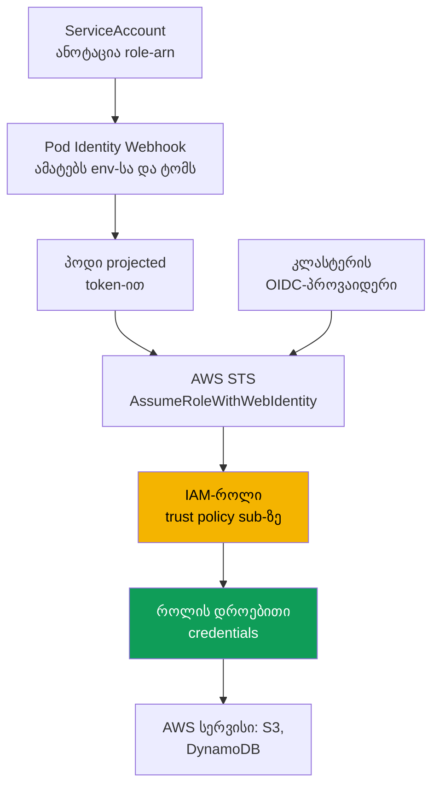
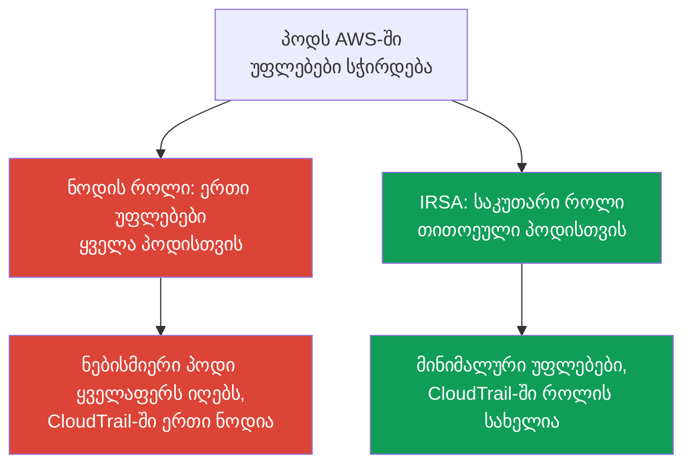

[Русская версия](ru.md) · [Eng version](en.md) · [Versión en español](es.md) · [Version française](fr.md) · [Deutsche Version](de.md) · [繁體中文版](tw.md) · [日本語版](jp.md)
# თავი 16. IRSA: OIDC-პროვაიდერი, trust policy, ServiceAccount-ის ანოტაციები

> **რა არის შემდეგ.** მე-2 ნაწილი გამოთვლითი რესურსებით დასრულდა, მე-3 ნაწილი კი იდენტობით იწყება.
> კლასტერზე **ადამიანებისა და CI-ის** წვდომა IAM-ისა და RBAC-ის საშუალებით, ასევე access entries,
> მე-5 თავშია და ამ თავს არ უკავშირდება. აქ ამოცანა სხვაა: **პოდების** წვდომა AWS-ის სერვისებზე
> (S3, DynamoDB, Secrets Manager) IRSA-ის საშუალებით. იმავე მიზნისთვის განკუთვნილი უფრო ახალი
> მექანიზმი, EKS Pod Identity, მე-17 თავშია, აქ კი მხოლოდ მოკლე შედარებას მოვიყვანთ. Secrets და
> External Secrets მე-18 თავშია, IMDSv2-ის ჰარდენინგი და hop limit მე-19 თავში, Fargate-ისთვის
> pod execution role კი მე-15 თავში.

## 16.1. „როლი ნოდს მივეცით და უფლებები ყველა პოდზე გავრცელდა“

პოდში გაშვებულ აპლიკაციას S3 bucket-ზე წვდომა დასჭირდა. გულუბრყვილო გზა თავისთავად ჩანს: ნოდს
უკვე აქვს IAM-როლი (node IAM role, თავი 10), რომლითაც kubelet და VPC CNI მუშაობენ, ამიტომ მას
`s3:GetObject` დავუმატოთ და აპლიკაცია ამუშავდება. ის მართლაც ამუშავდება, მაგრამ უფლებები არა
აპლიკაციას, არამედ **ნოდს** მიეცით და ისინი არა ერთმა პოდმა, არამედ **ამ ნოდზე გაშვებულმა ყველა
პოდმა** მიიღო.

შედეგები მაშინვე არ ჩანს, თუმცა სერიოზულია:

- **Least privilege დარღვეულია.** ნოდის როლი საერთოა. ერთ აპლიკაციას S3-ზე წვდომა მიეცით, მაგრამ
  ის ასევე მიიღო ჟურნალების შემგროვებელმა sidecar-მა, სხვა გუნდის მეზობელმა პოდმა და პოტენციურად
  კომპრომეტირებულმა კონტეინერმა. ნოდის როლით უფლებების პოდების მიხედვით დაყოფა პრინციპულად
  შეუძლებელია.
- **პოდს ნოდის როლის credentials-ის მოპარვა შეუძლია.** სანამ Instance Metadata Service-ზე (IMDS)
  წვდომა შეზღუდული არ არის, ნებისმიერ კონტეინერს შეუძლია `169.254.169.254`-ზე მიმართვა და ნოდის
  როლის დროებითი credentials-ის სრულად მიღება. სწორედ ამ კლასის პრობლემებს აგვარებს IMDSv2-ის
  ჰარდენინგი და hop limit (თავი 19), მაგრამ ის ფაქტი, რომ უფლებები ნოდზეა მიბმული, IMDS-ს გაჟონვის
  წერტილად აქცევს.
- **აუდიტი უსარგებლოა.** CloudTrail-ში ყველა გამოძახება ნოდის როლიდან მიდის და შეუძლებელია
  დადგენა, კონკრეტულად რომელი პოდი შეეხო bucket-ს: ყველა პოდს ერთი იდენტობა აქვს.

საჭიროა უფლებები **კონკრეტულ პოდს** მიეცეს და არა ნოდს. სწორედ ამას აკეთებს IRSA.

## 16.2. IRSA-ის მთავარი იდეა: საკუთარი როლი პოდისთვის ServiceAccount-ის საშუალებით

IRSA (IAM Roles for Service Accounts) მოდელს აბრუნებს: პოდი **საკუთარ** IAM-როლს მასთან მიბმული
`ServiceAccount`-ის საშუალებით იღებს და ნოდის როლს არ მემკვიდრეობს. ნოდის როლი მინიმალური რჩება,
მხოლოდ იმ უფლებებით, რომლებიც kubelet-სა და CNI-ს სჭირდება, ხოლო აპლიკაციების უფლებები ცალკეულ
როლებშია განთავსებული, თითო როლი უფლებების თითოეული ნაკრებისთვის.

ამის საფუძველში **OIDC federation** დგას, ფედერაციული წვდომის იგივე მექანიზმი, რომელსაც IAM 2014
წლიდან უჭერს მხარს. EKS-ში `ServiceAccount` გასცემს ხელმოწერილ **projected service account token**-ს,
ანუ OIDC-თავსებად JWT-ს SA-ის იდენტობითა და კონფიგურირებადი audience-ით. პოდი ტოკენს STS-ის
`AssumeRoleWithWebIdentity` ოპერაციას წარუდგენს, STS ხელმოწერას კლასტერის OIDC-პროვაიდერის
საშუალებით ამოწმებს და მოთხოვნილი როლის **დროებით credentials-ს** აბრუნებს. პოდში არსებული AWS
SDK ამას ავტომატურად აკეთებს.

თავიდანვე უნდა დავაფიქსიროთ სამი თვისება:

- უფლებები მიბმულია წყვილზე „namespace + ServiceAccount-ის სახელი“ და არა ნოდზე;
- credentials დროებითია და ავტომატურად როტირდება, პოდში ხანგრძლივი მოქმედების გასაღებები არ არის;
- ნოდის როლი აღარ ატარებს აპლიკაციის უფლებებს და IMDS-ის საშუალებით გაჟონვა აზრს კარგავს.

## 16.3. როგორ მუშაობს ეს ეტაპობრივად

სრული სურათი ხუთი ნაწილისგან შედგება. ისინი ერთხელ კონფიგურირდება და შემდეგ პოდის ყოველი გაშვებისას
ავტომატურად მუშაობს.



ეტაპობრივად:

1. კლასტერს აქვს **OIDC issuer URL**. მისთვის IAM-ში შექმნილია **IAM OIDC identity provider**,
   ერთხელ თითო კლასტერისთვის (სექცია 16.4).
2. იქმნება **IAM-როლი** **trust policy**-ით, რომელიც ამ OIDC-პროვაიდერს და `sub`-ის პირობით
   **კონკრეტულ** `ServiceAccount`-ს ენდობა (სექცია 16.5).
3. `ServiceAccount` ინიშნება `eks.amazonaws.com/role-arn` ანოტაციით, რომელშიც ამ როლის ARN წერია.
4. პოდის გაშვებისას admission webhook (EKS Pod Identity Webhook) ანოტაციას ხედავს, **projected
   token**-ს ამონტაჟებს და გარემოს ცვლადებს `AWS_ROLE_ARN` და `AWS_WEB_IDENTITY_TOKEN_FILE` ამატებს.
5. კონტეინერში AWS SDK ამ ცვლადებს კითხულობს, `AssumeRoleWithWebIdentity`-ს იძახებს და როლის
   დროებით credentials-ს იღებს. ამის შემდეგ აპლიკაცია AWS-ის სერვისებთან ამ როლის სახელით მუშაობს.

## 16.4. კლასტერის OIDC-პროვაიდერი

თითოეულ EKS კლასტერს საკუთარი OIDC issuer URL აქვს შემდეგი ფორმით:
`https://oidc.eks.<region>.amazonaws.com/id/<id>`. ეს საჯარო discovery endpoint-ია, სადაც
projected-ტოკენების ხელმოსაწერად გამოყენებული საჯარო გასაღებები ინახება. ხელმოწერის პირადი გასაღები
ყოველ 7 დღეში როტირდება, საჯარო გასაღებებს კი EKS მათი ვადის გასვლამდე ინახავს. გარე OIDC-კლიენტებმა
გასაღებები ვადის გასვლამდე უნდა განაახლონ, თუმცა თავად IAM-ისთვის ეს გამჭვირვალედ ხდება.

კლასტერს issuer URL-ის არსებობა ჯერ კიდევ არ ნიშნავს, რომ ფედერაცია მუშაობს. IAM-ში ამ URL-ისთვის
**IAM OIDC identity provider** უნდა შეიქმნას. როლების trust policy სწორედ მასზე მიუთითებს.
პროვაიდერი **ერთხელ თითო კლასტერისთვის** იქმნება და IRSA-ის ყველა როლისთვის საერთოა.

```bash
# კლასტერის issuer URL-ის ნახვა
aws eks describe-cluster --name demo \
  --query 'cluster.identity.oidc.issuer' --output text

# IAM OIDC provider-ის შექმნა (იდემპოტენტურია, თუ უკვე არსებობს, არაფერს აკეთებს)
eksctl utils associate-iam-oidc-provider --cluster demo --approve

# შემოწმება, რომ პროვაიდერი რეგისტრირებულია
aws iam list-open-id-connect-providers
```

`eksctl` შიგნით `aws iam create-open-id-connect-provider`-ს იძახებს. იგივე ხელით ან Terraform-ის
(`aws_iam_openid_connect_provider`) საშუალებითაც შეიძლება გაკეთდეს, თუ URL-ს, client id-ს
`sts.amazonaws.com` და root-სერტიფიკატის fingerprint-ს გადასცემთ. ხელით შესრულება იშვიათადაა
საჭირო: `eksctl` და EKS-ის IaC-მოდულები ამას თავად აკეთებენ. თუ VPC-ს ინტერნეტთან გამავალი წვდომა
არ აქვს და OIDC endpoint-ზე პრივატული წვდომა კონფიგურირებული არ არის, ბრძანება issuer-ის host-ს
ვერ resolve-ავს. პრივატული კლასტერისთვის საჭიროა VPC interface endpoint
`com.amazonaws.<region>.oidc-eks` (თავი 19).

## 16.5. Trust policy დეტალურად

როლის trust policy (assume role policy) ის ადგილია, სადაც federated principal **კონკრეტულ**
`ServiceAccount`-ს უკავშირდება. განვიხილოთ მისი ნაწილები.

```json
{
  "Version": "2012-10-17",
  "Statement": [
    {
      "Effect": "Allow",
      "Principal": {
        "Federated": "arn:aws:iam::111122223333:oidc-provider/oidc.eks.eu-central-1.amazonaws.com/id/EXAMPLED539D4633E53DE1B716D3041E"
      },
      "Action": "sts:AssumeRoleWithWebIdentity",
      "Condition": {
        "StringEquals": {
          "oidc.eks.eu-central-1.amazonaws.com/id/EXAMPLED539D4633E53DE1B716D3041E:sub": "system:serviceaccount:payments:s3-reader",
          "oidc.eks.eu-central-1.amazonaws.com/id/EXAMPLED539D4633E53DE1B716D3041E:aud": "sts.amazonaws.com"
        }
      }
    }
  ]
}
```

- **`Principal.Federated`** არის 16.4 სექციაში განხილული IAM OIDC-პროვაიდერის ARN და არა თავად
  URL. ის IAM-ს ეუბნება: ენდე ამ პროვაიდერის მიერ ხელმოწერილ ტოკენებს.
- **`Action`** ზუსტად `sts:AssumeRoleWithWebIdentity` უნდა იყოს. web identity-ის საშუალებით როლის
  მიღების სხვა გზა არ იმუშავებს.
- **პირობა `sub`-ზე** ყველაზე მნიშვნელოვანია. გასაღები `<oidc-provider>:sub` მოწმდება მნიშვნელობასთან
  `system:serviceaccount:<namespace>:<serviceaccount>`. სწორედ ეს აბამს როლს კონკრეტულ namespace-ში
  არსებულ ერთ SA-ს.
- **პირობა `aud`-ზე** არის `sts.amazonaws.com`, projected-ტოკენის audience.

`sub`-ის პირობის სიზუსტე უსაფრთხოების საკითხია და არა ფორმალობა. თუ მას `StringLike`-ით და შაბლონით
`system:serviceaccount:*:*` განსაზღვრავთ ან საერთოდ ამოიღებთ, როლის მიღებას კლასტერის **ნებისმიერი**
`ServiceAccount`, ფაქტობრივად ნებისმიერი პოდი, შეძლებს. `sub`-ის პირობა ზუსტად იმ namespace-სა და SA-ის
სახელს უნდა მიუთითებდეს, რომლისთვისაც როლია განკუთვნილი.

## 16.6. ServiceAccount-ის ანოტაცია და რას ხედავს პოდი

Kubernetes-ის მხრიდან საჭიროა `ServiceAccount` ანოტაციით `eks.amazonaws.com/role-arn`.

```yaml
apiVersion: v1
kind: ServiceAccount
metadata:
  name: s3-reader
  namespace: payments
  annotations:
    eks.amazonaws.com/role-arn: arn:aws:iam::111122223333:role/payments-s3-reader
```

როლისა და SA-ის შექმნა და მათი ერთმანეთთან დაკავშირება ყველაზე მარტივად ერთი `eksctl` ბრძანებით
შეიძლება. ის თავად ქმნის trust policy-ს `sub`-ის სწორი პირობით და ანოტაციას ამატებს:

```bash
eksctl create iamserviceaccount \
  --cluster demo --namespace payments --name s3-reader \
  --attach-policy-arn arn:aws:iam::111122223333:policy/payments-s3-read \
  --approve

kubectl -n payments describe serviceaccount s3-reader   # ჩანს role-arn ანოტაცია
```

იგივე შედეგი მიიღება native Terraform-ით, `eksctl`-ის გარეშე: OIDC-პროვაიდერი და როლი trust
policy-ით ზუსტ `sub`/`aud`-ზე (SA-ის ანოტაცია 16.6 სექციის მანიფესტში ცალკე ემატება).

```hcl
data "aws_eks_cluster" "demo" { name = "demo" }

data "tls_certificate" "oidc" {
  url = data.aws_eks_cluster.demo.identity[0].oidc[0].issuer
}

resource "aws_iam_openid_connect_provider" "eks" {          # ერთხელ თითო კლასტერისთვის
  url             = data.aws_eks_cluster.demo.identity[0].oidc[0].issuer
  client_id_list  = ["sts.amazonaws.com"]
  thumbprint_list = [data.tls_certificate.oidc.certificates[0].sha1_fingerprint]
}

locals { oidc = replace(aws_iam_openid_connect_provider.eks.url, "https://", "") }

resource "aws_iam_role" "s3_reader" {
  name = "payments-s3-reader"
  assume_role_policy = jsonencode({
    Version   = "2012-10-17"
    Statement = [{
      Effect    = "Allow"
      Principal = { Federated = aws_iam_openid_connect_provider.eks.arn }
      Action    = "sts:AssumeRoleWithWebIdentity"
      Condition = { StringEquals = {
        "${local.oidc}:sub" = "system:serviceaccount:payments:s3-reader"
        "${local.oidc}:aud" = "sts.amazonaws.com"
      } }
    }]
  })
}
```

Permissions policy ცალკე ერთვის (`aws_iam_role_policy_attachment`). აქ trust policy ზუსტად 16.5
სექციის პირობაა, მხოლოდ HCL-ით გამოხატული.

შემდეგ პოდმა ეს SA უნდა გამოიყენოს (`spec.serviceAccountName: s3-reader`). პოდის გაშვებისას Pod
Identity Webhook კონტეინერებში შემდეგს ამატებს:

| რა ემატება | მნიშვნელობა | რისთვის |
|---|---|---|
| ცვლადი `AWS_ROLE_ARN` | SA-ის ანოტაციაში მითითებული როლის ARN | SDK-მ იცის, რომელი როლი მიიღოს |
| ცვლადი `AWS_WEB_IDENTITY_TOKEN_FILE` | პოდში ტოკენის ფაილის გზა | SDK-მ იცის, საიდან აიღოს ტოკენი |
| Projected-ტომი ტოკენით | JWT `aud=sts.amazonaws.com`-ითა და expiry-ით | STS-ს წარედგინება credentials-ზე გასაცვლელად |
| ცვლადი `AWS_STS_REGIONAL_ENDPOINTS` | `regional` (EKS-ის ნაგულისხმევი მნიშვნელობა) | SDK რეგიონულ STS-ს იყენებს და არა გლობალურს |

Webhook ნაგულისხმევად `AWS_STS_REGIONAL_ENDPOINTS=regional`-ს ადგენს და SDK გლობალური
`sts.amazonaws.com`-ის ნაცვლად რეგიონულ endpoint-ს `sts.<region>.amazonaws.com` მიმართავს. ეს
იძლევა ნაკლებ დაყოვნებას, რეგიონში საკუთარ redundancy-ს და სესიის ტოკენის მოქმედების უფრო დიდ
ვადას. ინტერნეტთან წვდომის არმქონე პრივატული კლასტერისთვის ეს აუცილებელია: STS-ის ტრაფიკი VPC
interface endpoint `com.amazonaws.<region>.sts`-ით მიდის, გლობალური endpoint კი მას გვერდს უვლის.
რეჟიმი SA-ის ანოტაციით `eks.amazonaws.com/sts-regional-endpoints` (`true`/`false`) იცვლება;
`false`-ის დაყენება პრაქტიკულად არასდროსაა საჭირო.

ტოკენი projected service account token-ის სახით მონტაჟდება: მას აქვს audience და მოქმედების ვადა,
kubelet კი ვადის გასვლამდე აახლებს. აპლიკაციამ **თავსებადი AWS SDK** უნდა გამოიყენოს. web identity-ის
მხარდაჭერა ყველა SDK-ის აქტუალურ ვერსიასა და ახალ AWS CLI-ში არის. ძალიან ძველი SDK ცვლადებს
უგულებელყოფს და ნოდის როლის credentials-ის მისაღებად წავა.

## 16.7. ტიპური შეცდომები და დიაგნოსტიკა

IRSA პროგნოზირებადი მიზეზებით ფუჭდება და თითქმის ყველა უარი რამდენიმე მიზეზამდე დაიყვანება.

| სიმპტომი | სავარაუდო მიზეზი | რა უნდა შემოწმდეს |
|---|---|---|
| `AccessDenied` `AssumeRoleWithWebIdentity`-ზე | trust policy-ში `sub`-ის პირობა არ ემთხვევა | namespace და SA-ის სახელი `sub`-ში |
| SDK SA-ის როლის ნაცვლად ნოდის როლის credentials-ს იღებს | SA არ არის ანოტირებული ან პოდი ხელახლა არ შექმნილა | SA-ის ანოტაცია, პოდის restart |
| პოდში `AWS_ROLE_ARN` ცვლადი არ არის | პოდი ანოტაციამდე შეიქმნა ან webhook არ ამუშავდა | პოდის ხელახლა შექმნა |
| `AccessDenied` უკვე სერვისის გამოძახებისას | როლს საჭირო IAM-policy არ აქვს | როლის permissions policy |
| ძველ აპლიკაციაში არაფერი მუშაობს | არათავსებადი ან ძალიან ძველი AWS SDK | SDK-ის ვერსია |

დიაგნოსტიკის თანმიმდევრობა პოდიდან გარეთ:

```bash
# 1. გარემოს ცვლადები ადგილზეა?
kubectl -n payments exec deploy/my-app -- env | grep AWS_

# 2. ვის სახელად ხედავს პოდი საკუთარ თავს AWS-ში, უნდა იყოს საჭირო როლის assumed-role და არა ნოდის როლი
kubectl -n payments exec deploy/my-app -- aws sts get-caller-identity

# 3. ანოტაცია ნამდვილად იმ SA-ზეა, რომელსაც პოდი იყენებს?
kubectl -n payments get sa s3-reader -o yaml | grep role-arn
```

მთავარი შემოწმებაა პოდიდან `aws sts get-caller-identity`: თუ `Arn`-ში ჩანს
`assumed-role/payments-s3-reader/...`, ფედერაცია შესრულდა და პრობლემა როლის permissions policy-შია;
თუ ნოდის როლი ჩანს, პოდმა SA-ის როლის credentials ვერ მიიღო და მიზეზი ზემოთ მოცემულ ცხრილშია.
კიდევ ერთი ხშირი შეცდომაა ანოტაციის დამატების შემდეგ **პოდის ხელახლა არშექმნა**. Webhook ცვლადებს
მხოლოდ პოდის შექმნისას ამატებს და უკვე გაშვებული პოდი მათ ვერ მიიღებს.

## 16.8. IRSA ნოდის როლის წინააღმდეგ



განსხვავება პრინციპულია. ნოდის როლი ნოდზე გაშვებული ყველა პოდისთვის **საერთოა**: მისთვის მინიჭებულ
ნებისმიერ უფლებას ყველა იღებს, CloudTrail-ში კი იდენტობა ყველასთვის ერთია. IRSA **least privilege-ს
პოდის დონეზე** უზრუნველყოფს: თითოეულ აპლიკაციას საკუთარი როლი და უფლებები აქვს, CloudTrail-ში
გამოძახებები მისგან მიდის, კომპრომეტირებული პოდი კი საკუთარი უფლებებითაა შეზღუდული.

ამასთან, ნოდის როლს რჩება ზუსტად ის, რაც ნოდის სისტემურ კომპონენტებს სჭირდება: image-ების pull
ECR-დან, VPC CNI-ის მუშაობა ENI-სთან, ჟურნალებისა და მეტრიკების CloudWatch-ში ჩაწერა, ანუ ის,
რასაც მე-10 თავში განხილული managed policy-ები, მაგალითად `AmazonEKSWorkerNodePolicy` და
`AmazonEC2ContainerRegistryReadOnly`, განსაზღვრავს. აპლიკაციების უფლებები იქ არ უნდა იყოს. როცა
ნოდის როლი მინიმალურია და IMDS შეზღუდულია (თავი 19), მისგან მოსაპარი არაფერია.

## 16.9. მოკლე შედარება Pod Identity-სთან

EKS Pod Identity იმავე ამოცანას, „საკუთარი როლი პოდისთვის“, სხვაგვარად წყვეტს და დეტალურად განხილულია თავში
17. აქ მხოლოდ არჩევანის საზღვრებს აღვნიშნავთ, რათა ცხადი იყოს, რომ IRSA ერთადერთი
ვარიანტი არ არის.

| თვისება | IRSA | EKS Pod Identity |
|---|---|---|
| მექანიზმი | OIDC federation, trust policy `sub`-ზე | აგენტი ნოდზე და EKS API |
| კლასტერის კონფიგურაცია | IAM OIDC provider, თითო როლისთვის საკუთარი trust policy | Pod Identity Agent add-on-ის დაყენება |
| როლის trust policy | კონკრეტულ OIDC-პროვაიდერზეა მიბმული | საერთო principal `pods.eks.amazonaws.com` |
| cross-account და EKS-ის გარეთ | მუშაობს (federation OIDC-ით) | უფრო შეზღუდულია, EKS-ზეა მიბმული |
| ასაკი | დიდი ხანია არსებობს, ფართოდ გავრცელებულია | უფრო ახალია, დაკავშირება უფრო მარტივია |

მოკლედ: IRSA უფრო მოქნილია, რადგან სტანდარტული OIDC-ით მუშაობს და cross-account-ისთვისა და EKS-ის
გარეთ გამოსაყენებლად ვარგა, თუმცა მისი კონფიგურაცია უფრო ვრცელია. თითოეული როლისთვის საჭიროა
საკუთარი trust policy ზუსტი `sub`-ით. Pod Identity-ის დაკავშირება უფრო მარტივია, რადგან ასოციაცია
EKS API-ით იქმნება და როლი კლასტერის OIDC-პროვაიდერზე მიბმული არ არის, თუმცა ეს უფრო ახალი
მექანიზმია საკუთარი შეზღუდვებით. დეტალები, მიგრაცია და არჩევანის კრიტერიუმები მე-17 თავშია.

## 16.10. როგორ იყენებენ ამას production-ში

- **OIDC-პროვაიდერი კლასტერთან ერთად იქმნება** IaC-ში და არა მოგვიანებით ხელით. მის გარეშე IRSA-ის
  არცერთი როლი არ მუშაობს, ამიტომ ეს კლასტერის შექმნის შემდეგ პირველი ნაბიჯია.
- **ერთი როლი, უფლებების ერთი ნაკრები, ერთი ServiceAccount.** როლებს სხვადასხვა აპლიკაციას შორის
  არ იყენებენ: თითოეულ SA-ს საკუთარი როლი აქვს მინიმალური უფლებებითა და ზუსტი `sub` პირობით.
- **ნოდის როლი მინიმალური რჩება.** მასში მხოლოდ სისტემური კომპონენტების უფლებებია. აპლიკაციის
  უფლებები IRSA-ის როლებში გადააქვთ, IMDS-ს კი hop limit-ით ზღუდავენ (თავი 19).
- **`sub`-ის პირობა ყოველთვის ზუსტია**, კონკრეტული namespace და SA-ის სახელი, `*` შაბლონების
  გარეშე. სხვაგვარად როლის მიღებას კლასტერის ნებისმიერი პოდი შეძლებს.
- **როლები და SA კოდითაა აღწერილი.** `eksctl create iamserviceaccount` ან Terraform-მოდული როლს,
  trust policy-სა და ანოტირებულ SA-ს ერთად ქმნის, რათა მათ შორის შეუსაბამობა არ გაჩნდეს.

## 16.11. მინი-ლექსიკონი

- **IRSA** არის IAM Roles for Service Accounts: OIDC federation-ის საფუძველზე პოდისთვის მასთან
  დაკავშირებული `ServiceAccount`-ის საშუალებით IAM-როლის მინიჭების მექანიზმი.
- **OIDC issuer URL** არის კლასტერის საჯარო OIDC endpoint
  (`oidc.eks.<region>.amazonaws.com/id/`) projected-ტოკენების ხელმოწერის საჯარო გასაღებებით.
- **IAM OIDC identity provider** არის IAM-ის ობიექტი, რომელიც კლასტერის issuer URL-ს
  არეგისტრირებს და რომელსაც როლების trust policy მიუთითებს. ის ერთხელ თითო კლასტერისთვის იქმნება.
- **Trust policy** არის როლის ნდობის პოლიტიკა: `Federated` principal (OIDC-პროვაიდერის ARN),
  `Action` `sts:AssumeRoleWithWebIdentity` და `StringEquals` პირობები `sub`-სა და `aud`-ზე.
- **Projected service account token** არის OIDC-თავსებადი JWT SA-ის იდენტობით, audience-ით
  `sts.amazonaws.com` და მოქმედების ვადით. ის პოდში მონტაჟდება და STS-ში credentials-ზე იცვლება.
- **`AssumeRoleWithWebIdentity`** არის STS ოპერაცია, რომელიც web identity token-ს IAM-როლის
  დროებით credentials-ზე ცვლის.

## 16.12. თავის შეჯამება

- გულუბრყვილო გზა „უფლებები ნოდის როლს მივცეთ“ least privilege-ს არღვევს, რადგან უფლებებს ნოდზე
  გაშვებული ყველა პოდი იღებს, ნოდის როლს IMDS-ის საშუალებით მოპარვის სამიზნედ აქცევს და CloudTrail-ში
  იდენტობას აქრობს. IRSA უფლებებს კონკრეტულ პოდს აძლევს.
- IRSA OIDC federation-ს ეფუძნება: `ServiceAccount` ხელმოწერილ projected-ტოკენს გასცემს, პოდი მას
  STS-ს `AssumeRoleWithWebIdentity`-ით წარუდგენს, STS ხელმოწერას კლასტერის OIDC-პროვაიდერის
  საშუალებით ამოწმებს და როლის დროებით credentials-ს აბრუნებს.
- მექანიზმის ხუთი ნაწილი: კლასტერის OIDC issuer URL, IAM OIDC identity provider (ერთი თითო
  კლასტერისთვის), IAM-როლი trust policy-ით `sub`-ზე, SA-ზე ანოტაცია
  `eks.amazonaws.com/role-arn`, projected-ტოკენი და webhook-ის მიერ დამატებული ცვლადები
  `AWS_ROLE_ARN`, `AWS_WEB_IDENTITY_TOKEN_FILE`.
- Trust policy როლს კონკრეტულ SA-ს უკავშირებს `StringEquals` პირობით:
  `<oidc-provider>:sub` = `system:serviceaccount:NS:SA` და `aud` = `sts.amazonaws.com`.
  ზუსტი `sub`-ის ნაცვლად შაბლონის გამოყენება როლს ნებისმიერი პოდისთვის ხსნის.
- დიაგნოსტიკა პოდიდან გარეთ მიდის: `AWS_*` ცვლადები პოდში, `aws sts get-caller-identity` (საჭირო
  როლის assumed-role და არა ნოდის როლი), SA-ის ანოტაცია, პოდის ხელახლა შექმნა და SDK-ის ვერსია.
  სერვისის გამოძახებისას `AccessDenied` უკვე როლის permissions policy-ის პრობლემაა.
- ნოდის როლი მინიმალური რჩება (kubelet, CNI, ECR, ჟურნალები), აპლიკაციის უფლებები კი IRSA-ის
  როლებში გადადის.
- Pod Identity (თავი 17) იმავე ამოცანას აგენტისა და EKS API-ის საშუალებით წყვეტს: მისი დაკავშირება
  უფრო მარტივია, მაგრამ IRSA cross-account-ისა და EKS-ის გარეთ სცენარებისთვის უფრო მოქნილია.

## 16.13. როგორ გამოგადგებათ ეს რეალურ სამუშაოში

IRSA-ის გამოყენებისას კითხვას „რა უფლებები აქვს ამ პოდს AWS-ში“ ერთი როლი და მისი permissions
policy პასუხობს და აღარ არის საჭირო ნოდის საერთო როლში დაგროვილი უფლებების გარჩევა. ინციდენტი
„პოდი კომპრომეტირებულია“ მისი როლის უფლებებით იზღუდება და არა ყველაფრით, რისი გაკეთებაც ნოდს
შეუძლია. CloudTrail-ით გამოძიებაც უფრო აზრიანი ხდება: გამოძახებები კონკრეტული აპლიკაციის როლიდან
მოდის და ჩანს, ვინ მიმართა bucket-ს ან ცხრილს. მორიგეობისას მომართვების უმეტესობა „აპლიკაცია AWS-ზე
AccessDenied-ს იღებს“ 16.7 სექციის იმავე მოკლე ჯაჭვით წყდება: ცვლადები პოდში,
`get-caller-identity`, SA-ის ანოტაცია და პოდის ხელახლა შექმნის შემოწმება.

## 16.14. კითხვები თვითშემოწმებისთვის

1. რატომ არის გზა „საჭირო უფლება ნოდის როლს დავუმატოთ“ ცუდი least privilege-ისა და აუდიტის
   თვალსაზრისით?
2. როგორ შეუძლია პოდს ნოდის როლის credentials-ის მიღება და რომელი თავი აგვარებს ამ ხარვეზს?
3. AWS-ის რომელ მექანიზმზეა აგებული IRSA და STS-ის რომელი ოპერაცია ცვლის ტოკენს credentials-ზე?
4. რა არის კლასტერის OIDC issuer URL და რით განსხვავდება ის IAM OIDC identity provider-ისგან?
5. რატომ იქმნება IAM OIDC provider ერთხელ თითო კლასტერისთვის, IRSA-ის როლი კი შეიძლება ბევრი იყოს?
6. რა ნაწილებისგან შედგება IRSA-ის როლის trust policy და რას განსაზღვრავს `Principal.Federated`?
7. რატომ უნდა იყოს `sub`-ის პირობა ზუსტი და რა მოხდება `*` შაბლონის გამოყენებისას?
8. გარემოს რომელ ცვლადებსა და რომელ ტომს ამატებს webhook პოდში და საიდან იცის, რომ ეს საჭიროა?
9. პოდი ანოტირებულია, მაგრამ კვლავ ნოდის როლით მუშაობს. დაასახელეთ ორი სავარაუდო მიზეზი.
10. პოდიდან ერთი ბრძანებით როგორ დავადგინოთ, შესრულდა თუ არა ფედერაცია, და როგორ განვასხვაოთ ეს
    უფლებების ნაკლებობისგან?
11. IRSA-ზე გადასვლის შემდეგ რა უნდა დარჩეს ნოდის როლში?
12. რით განსხვავდება IRSA Pod Identity-ისგან და როდისაა IRSA უმჯობესი?

## პრაქტიკა

ამ თემის კურსის ლაბა: [ლაბა 104 - Workload identity: IRSA და Pod Identity
აპლიკაციისთვის](../../labs/104/README_GE.MD). IRSA ასევე გვხვდება
[ლაბა 106 - EBS CSI](../../labs/106/README_GE.MD)-სა და [ლაბა 107 - EFS CSI](../../labs/107/README_GE.MD)-ში,
როგორც დრაივერისთვის უფლების მინიჭების საშუალება. დანარჩენი ყველაფერი ცოცხალ კლასტერზე მოწმდება.
დაიწყეთ `aws eks describe-cluster --name <cluster> --query 'cluster.identity.oidc.issuer'` და
`aws iam list-open-id-connect-providers` ბრძანებებით: აქვს თუ არა კლასტერს issuer URL და შექმნილია
თუ არა მისთვის IAM OIDC provider. თუ პროვაიდერი არ არის, შექმენით ის ბრძანებით
`eksctl utils associate-iam-oidc-provider --cluster <cluster> --approve`.

შემდეგ `eksctl create iamserviceaccount`-ით შექმენით სატესტო როლი და SA, რომელსაც მხოლოდ ერთი
bucket-ის წაკითხვის policy ექნება, გაუშვით პოდი ამ SA-ით და მასში შეასრულეთ
`aws sts get-caller-identity`. `Arn`-ში თქვენი როლის assumed-role უნდა იყოს და არა ნოდის როლი.
`AWS_ROLE_ARN`-ისა და `AWS_WEB_IDENTITY_TOKEN_FILE`-ის სანახავად გაუშვით
`kubectl exec ... -- env | grep AWS_`, ARN-ით ანოტაციისთვის კი `kubectl describe sa`. ცალკე
ივარჯიშეთ უარის მიღებაზე: trust policy-ში `sub`-ის პირობა გააფუჭეთ (namespace შეცვალეთ), პოდი
ხელახლა შექმენით და `AssumeRoleWithWebIdentity`-ზე `AccessDenied` იპოვეთ; შემდეგ ზუსტი `sub`
დააბრუნეთ და დარწმუნდით, რომ წვდომა აღდგა. როლის trust policy გაარჩიეთ ბრძანებით
`aws iam get-role --role-name <role>` და `sub` და `aud` 16.5 სექციას შეადარეთ.

---
[სარჩევი](../README_GE.md) · [თავი 15](../15/ge.md) · [თავი 17](../17/ge.md)
