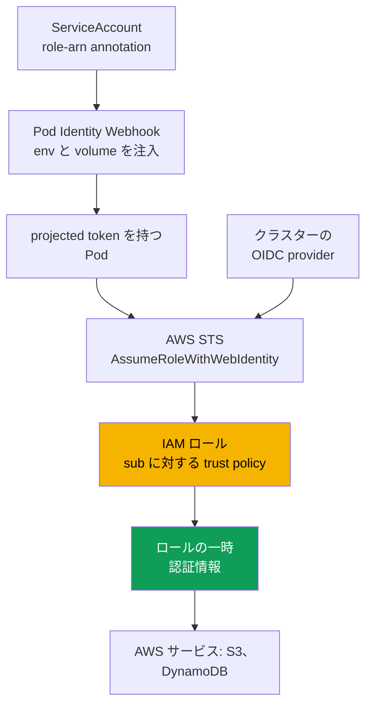
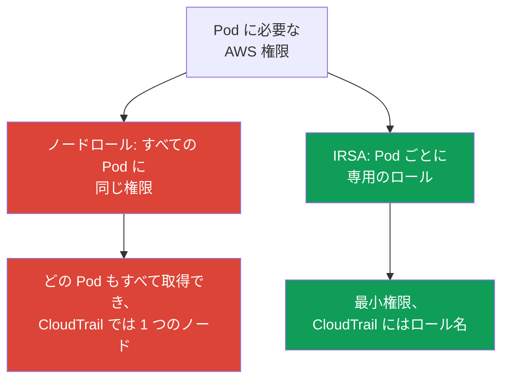

[Русская версия](ru.md) · [Eng version](en.md) · [Versión en español](es.md) · [Version française](fr.md) · [Deutsche Version](de.md) · [ქართული ვერსია](ge.md) · [繁體中文版](tw.md)
# 第16章. IRSA: OIDC provider、trust policy、ServiceAccount の annotation

> **この先。** 第2部はコンピュートで終わり、第3部はアイデンティティから始まります。クラスターへの**人間と CI**のアクセスは IAM と RBAC を通じ、access entry は第5章の内容であり、本章とは重複しません。ここで扱うのは別の課題、IRSA を通じた**Pod**の AWS サービス（S3、DynamoDB、Secrets Manager）へのアクセスです。同じ目的のより新しい仕組みである EKS Pod Identity は第17章で扱い、ここでは短い比較のみ示します。Secrets と External Secrets は第18章、IMDSv2 と hop limit のハードニングは第19章、Fargate の pod execution role は第15章です。

## 16.1. 「ノードにロールを与えたら、すべての Pod に権限が漏れた」

Pod 内のアプリケーションに S3 バケットへのアクセスが必要になりました。素朴な方法は明らかです。ノードにはすでに kubelet と VPC CNI が使用する IAM ロール（node IAM role、第10章）があるため、そこに `s3:GetObject` を追加すればアプリケーションは動きます。実際に動きますが、権限を与えた先はアプリケーションではなく**ノード**です。その結果、1 つの Pod だけでなく、**そのノード上のすべての Pod**が権限を得ます。

影響はすぐには見えませんが、深刻です。

- **Least privilege が壊れる。** ノードのロールは共有です。1 つのアプリケーションに S3 アクセスを与えると、ログ収集 sidecar、別チームの隣接 Pod、潜在的に侵害されたコンテナもアクセスを得ます。ノードロールを通じて Pod ごとに権限を分離することは原理的に不可能です。
- **Pod はノードロールの認証情報を盗める。** Instance Metadata Service（IMDS）へのアクセスが制限されていない限り、どのコンテナも `169.254.169.254` にアクセスしてノードロールの一時認証情報を丸ごと取得できます。これは IMDSv2 と hop limit のハードニング（第19章）が防ぐ問題そのものですが、権限がノードに付与されているという事実により、IMDS が漏洩地点になります。
- **監査が役に立たない。** CloudTrail ではすべての呼び出しがノードロールから行われるため、どの Pod がバケットにアクセスしたかを判別できません。すべての Pod のアイデンティティが同じだからです。

必要なのは、ノードではなく**特定の Pod**に権限を与える方法です。まさにそれを実現するのが IRSA です。

## 16.2. IRSA の中核となる考え方: ServiceAccount を通じて Pod 専用のロールを与える

IRSA（IAM Roles for Service Accounts）はモデルを反転します。Pod はノードロールを継承するのではなく、紐付けられた `ServiceAccount` を通じて**専用の** IAM ロールを取得します。ノードロールは kubelet と CNI に必要なものだけという最小の状態に保たれ、アプリケーションの権限は権限セットごとに分けられた個別のロールに存在します。

内部では **OIDC federation** が使われます。これは IAM が 2014 年から扱えるフェデレーテッドアクセスと同じ仕組みです。EKS の `ServiceAccount` は、SA のアイデンティティと設定可能な audience を含む、署名済みの **projected service account token** を発行します。Pod はそのトークンを STS の `AssumeRoleWithWebIdentity` 操作に提示します。STS はクラスターの OIDC provider を通じて署名を検証し、要求されたロールの**一時認証情報**を返します。Pod 内の AWS SDK がこれを自動で実行します。

最初に押さえるべき性質は 3 つです。

- 権限はノードではなく、「namespace + ServiceAccount 名」の組に紐付きます。
- 認証情報は一時的で自動的にローテーションされ、Pod 内に長期的なキーはありません。
- ノードロールはアプリケーション権限の担い手ではなくなり、IMDS を通じた漏洩は意味を失います。

## 16.3. 動作の手順

全体像は 5 つの構成要素からなり、一度設定すれば、その後は Pod が起動するたびに自動で動作します。



手順は次のとおりです。

1. クラスターには **OIDC issuer URL** があります。その URL に対応する **IAM OIDC identity provider** が IAM に作成されます。これはクラスターごとに一度だけ行います（16.4節）。
2. その OIDC provider を信頼し、`sub` 条件によって**特定の** `ServiceAccount` を信頼する **trust policy** を持つ **IAM ロール**を作成します（16.5節）。
3. `ServiceAccount` に、そのロールの ARN を持つ `eks.amazonaws.com/role-arn` annotation を付与します。
4. Pod の開始時、admission webhook（EKS Pod Identity Webhook）は annotation を検出し、**projected token** をマウントして、環境変数 `AWS_ROLE_ARN` と `AWS_WEB_IDENTITY_TOKEN_FILE` を追加します。
5. コンテナ内の AWS SDK はこれらの環境変数を読み取り、`AssumeRoleWithWebIdentity` を呼び出してロールの一時認証情報を取得します。以降、アプリケーションはそのロールとして AWS サービスを利用します。

## 16.4. クラスターの OIDC provider

各 EKS クラスターには、`https://oidc.eks.<region>.amazonaws.com/id/<id>` 形式の専用 OIDC issuer URL があります。これは公開 discovery endpoint であり、projected token の署名に使われる公開鍵を提供します。秘密署名鍵は 7 日ごとにローテーションされ、EKS は公開鍵を有効期限まで保持します。外部の OIDC クライアントは有効期限前に鍵を更新する必要がありますが、IAM 自体については透過的に処理されます。

クラスターに issuer URL が存在しても、federation が機能するとは限りません。IAM にはこの URL 用の **IAM OIDC identity provider** を作成する必要があります。ロールの trust policy はこれを参照します。provider は**クラスターごとに一度だけ**作成し、すべての IRSA ロールで共有します。

```bash
# クラスターの issuer URL を確認する
aws eks describe-cluster --name demo \
  --query 'cluster.identity.oidc.issuer' --output text

# IAM OIDC provider を作成する（冪等。すでに存在すれば何もしない）
eksctl utils associate-iam-oidc-provider --cluster demo --approve

# provider が登録されていることを確認する
aws iam list-open-id-connect-providers
```

内部では `eksctl` が `aws iam create-open-id-connect-provider` を呼び出しています。同じことは、URL、client id `sts.amazonaws.com`、ルート証明書の fingerprint を指定して手動で行うことも、Terraform（`aws_iam_openid_connect_provider`）で行うこともできます。手動の方法が必要になることはまれです。`eksctl` と EKS の IaC モジュールが自動で処理します。VPC にインターネットへのアウトバウンドアクセスがなく、OIDC endpoint へのプライベートアクセスも設定されていない場合、コマンドは issuer host を名前解決できません。プライベートクラスターには VPC interface endpoint `com.amazonaws.<region>.oidc-eks` が必要です（第19章）。

## 16.5. trust policy を具体的に見る

ロールの trust policy（assume role policy）は、federated principal を**特定の** `ServiceAccount` に結び付ける場所です。部分ごとに見ていきます。

```json
{
  "Version": "2012-10-17",
  "Statement": [
    {
      "Effect": "Allow",
      "Principal": {
        "Federated": "arn:aws:iam::111122223333:oidc-provider/oidc.eks.eu-central-1.amazonaws.com/id/EXAMPLED539D4633E53DE1B716D3041E"
      },
      "Action": "sts:AssumeRoleWithWebIdentity",
      "Condition": {
        "StringEquals": {
          "oidc.eks.eu-central-1.amazonaws.com/id/EXAMPLED539D4633E53DE1B716D3041E:sub": "system:serviceaccount:payments:s3-reader",
          "oidc.eks.eu-central-1.amazonaws.com/id/EXAMPLED539D4633E53DE1B716D3041E:aud": "sts.amazonaws.com"
        }
      }
    }
  ]
}
```

- **`Principal.Federated`** は 16.4節の IAM OIDC provider の ARN であり、URL 自体ではありません。IAM に、この provider が署名したトークンを信頼するよう伝えます。
- **`Action`** は厳密に `sts:AssumeRoleWithWebIdentity` です。web identity によるロール引き受けには、他の方法は使えません。
- **`sub` 条件**が最も重要です。キー `<oidc-provider>:sub` は `system:serviceaccount:<namespace>:<serviceaccount>` の値と照合されます。これにより、ロールは特定の namespace の特定の SA に結び付けられます。
- **`aud` 条件**は、projected token の audience である `sts.amazonaws.com` です。

`sub` 条件の正確さは形式的な問題ではなく、セキュリティの問題です。`StringLike` に `system:serviceaccount:*:*` のようなパターンを指定したり、条件そのものを削除したりすると、クラスターの**すべての** `ServiceAccount`、事実上すべての Pod がロールを引き受けられます。`sub` 条件には、そのロールの対象となる namespace と SA 名を正確に指定しなければなりません。

## 16.6. ServiceAccount の annotation と Pod に見えるもの

Kubernetes 側では、`eks.amazonaws.com/role-arn` annotation を持つ `ServiceAccount` が必要です。

```yaml
apiVersion: v1
kind: ServiceAccount
metadata:
  name: s3-reader
  namespace: payments
  annotations:
    eks.amazonaws.com/role-arn: arn:aws:iam::111122223333:role/payments-s3-reader
```

最も簡単なのは、ロール、SA、およびその関連付けを 1 つの `eksctl` コマンドで作成することです。このコマンドは正しい `sub` 条件を持つ trust policy を自動で作成し、annotation を付与します。

```bash
eksctl create iamserviceaccount \
  --cluster demo --namespace payments --name s3-reader \
  --attach-policy-arn arn:aws:iam::111122223333:policy/payments-s3-read \
  --approve

kubectl -n payments describe serviceaccount s3-reader   # role-arn annotation を確認できる
```

`eksctl` を使わないネイティブな Terraform でも同じ結果になります。OIDC provider と、正確な `sub`/`aud` を対象とする trust policy を持つロールです（SA の annotation は 16.6節の manifest で別途付与します）。

```hcl
data "aws_eks_cluster" "demo" { name = "demo" }

data "tls_certificate" "oidc" {
  url = data.aws_eks_cluster.demo.identity[0].oidc[0].issuer
}

resource "aws_iam_openid_connect_provider" "eks" {          # クラスターごとに一度だけ
  url             = data.aws_eks_cluster.demo.identity[0].oidc[0].issuer
  client_id_list  = ["sts.amazonaws.com"]
  thumbprint_list = [data.tls_certificate.oidc.certificates[0].sha1_fingerprint]
}

locals { oidc = replace(aws_iam_openid_connect_provider.eks.url, "https://", "") }

resource "aws_iam_role" "s3_reader" {
  name = "payments-s3-reader"
  assume_role_policy = jsonencode({
    Version   = "2012-10-17"
    Statement = [{
      Effect    = "Allow"
      Principal = { Federated = aws_iam_openid_connect_provider.eks.arn }
      Action    = "sts:AssumeRoleWithWebIdentity"
      Condition = { StringEquals = {
        "${local.oidc}:sub" = "system:serviceaccount:payments:s3-reader"
        "${local.oidc}:aud" = "sts.amazonaws.com"
      } }
    }]
  })
}
```

permissions policy は別に付与します（`aws_iam_role_policy_attachment`）。ここでの trust policy は 16.5節の条件を HCL で表現したものです。

次に、Pod がこの SA を使用する必要があります（`spec.serviceAccountName: s3-reader`）。Pod の開始時、Pod Identity Webhook はコンテナに次を注入します。

| 注入されるもの | 値 | 目的 |
|---|---|---|
| 環境変数 `AWS_ROLE_ARN` | SA annotation のロール ARN | SDK が引き受けるロールを認識する |
| 環境変数 `AWS_WEB_IDENTITY_TOKEN_FILE` | Pod 内の token ファイルへのパス | SDK が token の取得場所を認識する |
| token を持つ Projected volume | `aud=sts.amazonaws.com` と expiry を持つ JWT | 認証情報との交換のため STS に提示する |
| 環境変数 `AWS_STS_REGIONAL_ENDPOINTS` | `regional`（EKS のデフォルト） | SDK がグローバルではなくリージョナル STS を使う |

Webhook はデフォルトで `AWS_STS_REGIONAL_ENDPOINTS=regional` を設定するため、SDK はグローバルな `sts.amazonaws.com` ではなく、リージョナル endpoint `sts.<region>.amazonaws.com` を呼び出します。これによりレイテンシーが低くなり、リージョン内で独自の冗長性が得られ、セッション token の有効期間も長くなります。インターネット出口のないプライベートクラスターでは、これは必須です。STS トラフィックは VPC interface endpoint `com.amazonaws.<region>.sts` を通り、グローバル endpoint はこれを経由しません。モードは SA annotation `eks.amazonaws.com/sts-regional-endpoints`（`true`/`false`）で切り替えられます。`false` を設定する必要は、ほとんどありません。

token は projected service account token としてマウントされます。audience と有効期間があり、kubelet が期限前に更新します。アプリケーションは**互換性のある AWS SDK**を使う必要があります。最新のすべての SDK と新しい AWS CLI は web identity をサポートしますが、非常に古い SDK は環境変数を無視してノードロールの認証情報を取得しに行きます。

## 16.7. よくあるエラーと診断

IRSA の失敗は予測可能で、ほぼすべての拒否は少数の原因に集約されます。

| 症状 | 考えられる原因 | 確認すること |
|---|---|---|
| `AssumeRoleWithWebIdentity` で `AccessDenied` | trust policy の `sub` 条件が一致していない | `sub` の namespace と SA 名 |
| SDK が SA ロールではなくノードロールの認証情報を取得する | SA に annotation がない、または Pod を再作成していない | SA annotation、Pod の再起動 |
| Pod に `AWS_ROLE_ARN` 環境変数がない | annotation より前に Pod が作成され、webhook が動作していない | Pod を再作成する |
| サービス呼び出し時の `AccessDenied` | ロールに必要な IAM policy がない | ロールの permissions policy |
| 古いアプリケーションで何も動かない | 互換性がない、または非常に古い AWS SDK | SDK バージョン |

Pod から外側へ向かう診断手順は次のとおりです。

```bash
# 1. 環境変数は存在するか？
kubectl -n payments exec deploy/my-app -- env | grep AWS_

# 2. Pod は AWS で誰として認識されているか？ ノードロールではなく、目的のロールの assumed-role であるべき
kubectl -n payments exec deploy/my-app -- aws sts get-caller-identity

# 3. annotation は Pod が使用する SA に本当に付いているか？
kubectl -n payments get sa s3-reader -o yaml | grep role-arn
```

最も重要な確認は Pod 内の `aws sts get-caller-identity` です。`Arn` に `assumed-role/payments-s3-reader/...` が表示されるなら federation は成功しており、問題はロールの permissions policy にあります。ノードロールが表示されるなら、Pod は SA ロールの認証情報を取得しておらず、原因は表に示した上流側にあります。もう 1 つのよくある落とし穴は、annotation を付与しても**Pod を再作成していない**ことです。webhook が環境変数を注入するのは Pod 作成時だけであり、すでに実行中の Pod には追加されません。

## 16.8. IRSA とノードロールの比較



違いは本質的です。ノードロールはノード上のすべての Pod に対して**共有**されます。付与された権限はすべての Pod が取得し、CloudTrail のアイデンティティも全員で 1 つです。IRSA は**Pod レベルの least privilege**を実現します。各アプリケーションには固有の権限を持つ専用ロールがあり、CloudTrail の呼び出しもそのロールから行われるため、侵害された Pod は自らの権限に限定されます。

一方、ノードロールにはノードのシステムコンポーネントに必要なものだけが残ります。ECR からのイメージ pull、VPC CNI による ENI の操作、CloudWatch へのログとメトリクスの書き込みなど、`AmazonEKSWorkerNodePolicy` や `AmazonEC2ContainerRegistryReadOnly` といった managed policy（第10章）で与えられる権限です。アプリケーション権限をそこに置くべきではありません。ノードロールを最小化し、IMDS を制限すれば（第19章）、盗むものはありません。

## 16.9. Pod Identity との短い比較

EKS Pod Identity は「Pod 専用のロール」という同じ課題を別の方法で解決します。詳しくは第17章で扱います。ここでは、IRSA が唯一の選択肢ではないことを理解するため、選択の境界だけを示します。

| 特性 | IRSA | EKS Pod Identity |
|---|---|---|
| 仕組み | OIDC federation、`sub` に対する trust policy | ノード上の agent と EKS API |
| クラスター側の設定 | IAM OIDC provider、ロールごとの trust policy | Pod Identity Agent add-on のインストール |
| ロールの trust policy | 特定の OIDC provider に紐付く | 共通 principal `pods.eks.amazonaws.com` |
| クロスアカウントと EKS 外 | 利用可能（OIDC による federation） | より制限され、EKS に紐付く |
| 成熟度 | 長く使われ、広く普及している | より新しく、関連付けが簡単 |

要点は次のとおりです。IRSA は柔軟性が高く（標準 OIDC を通じて動作し、クロスアカウントや EKS 外にも適する）一方、設定はより冗長です。各ロールに正確な `sub` を持つ trust policy が必要です。Pod Identity は関連付けが簡単です（association は EKS API で作成し、ロールはクラスターの OIDC provider に紐付きません）が、より新しい仕組みであり、固有の制限があります。詳細、移行、選択基準は第17章で説明します。

## 16.10. 本番環境での適用方法

- **OIDC provider はクラスターと同時に** IaC で作成し、後から手作業では作成しません。これがなければ IRSA ロールは 1 つも動かないため、クラスター作成後の最初の手順です。
- **1 ロール、1 権限セット、1 ServiceAccount。** 異なるアプリケーション間でロールを再利用しません。各 SA に最小権限と正確な `sub` 条件を持つ専用ロールを与えます。
- **ノードロールを最小に保つ。** システムコンポーネントの権限だけを持たせます。アプリケーションの権限は IRSA ロールへ移し、hop limit を通じて IMDS を制限します（第19章）。
- **`sub` 条件は常に正確にする。** `*` のようなパターンを使わず、具体的な namespace と SA 名を指定します。そうしないと、クラスターの任意の Pod がロールを引き受けられます。
- **ロールと SA をコードで記述する。** `eksctl create iamserviceaccount` または Terraform module でロール、trust policy、annotation 付き SA をまとめて作成し、相互の設定がずれないようにします。

## 16.11. ミニ用語集

- **IRSA**: IAM Roles for Service Accounts。OIDC federation に基づき、紐付けられた `ServiceAccount` を通じて Pod に IAM ロールを与える仕組みです。
- **OIDC issuer URL**: projected token の公開署名鍵を提供する、クラスターの公開 OIDC endpoint（`oidc.eks.<region>.amazonaws.com/id/`）です。
- **IAM OIDC identity provider**: クラスターの issuer URL を登録する IAM オブジェクトです。ロールの trust policy がこれを参照し、クラスターごとに一度作成します。
- **Trust policy**: ロールの信頼ポリシーです。`Federated` principal（OIDC provider の ARN）、`Action` `sts:AssumeRoleWithWebIdentity`、および `sub` と `aud` に対する `StringEquals` 条件で構成されます。
- **Projected service account token**: SA のアイデンティティ、audience `sts.amazonaws.com`、有効期間を持つ OIDC 互換 JWT です。Pod にマウントされ、STS で IAM ロールの認証情報と交換されます。
- **`AssumeRoleWithWebIdentity`**: web identity token を IAM ロールの一時認証情報と交換する STS 操作です。

## 16.12. 章のまとめ

- 「ノードロールに権限を与える」という素朴な方法は、least privilege を壊します。ノード上のすべての Pod が権限を取得し、ノードロールは IMDS 経由の窃取対象となり、CloudTrail のアイデンティティは匿名化されます。IRSA は特定の Pod に権限を与えます。
- IRSA は OIDC federation に基づきます。`ServiceAccount` が署名済み projected token を発行し、Pod は `AssumeRoleWithWebIdentity` を通じて STS に提示します。STS はクラスターの OIDC provider で署名を検証し、ロールの一時認証情報を返します。
- 仕組みは 5 つの部分から構成されます。クラスターの OIDC issuer URL、IAM OIDC identity provider（クラスターごとに 1 つ）、`sub` を対象にした trust policy を持つ IAM ロール、SA 上の `eks.amazonaws.com/role-arn` annotation、webhook が注入する projected token と `AWS_ROLE_ARN`、`AWS_WEB_IDENTITY_TOKEN_FILE` 環境変数です。
- trust policy は `<oidc-provider>:sub` = `system:serviceaccount:NS:SA` と `aud` = `sts.amazonaws.com` に対する `StringEquals` 条件で、ロールを特定の SA に結び付けます。正確な `sub` の代わりにパターンを使うと、任意の Pod にロールが開放されます。
- 診断は Pod から外向きに行います。Pod 内の `AWS_*` 環境変数、`aws sts get-caller-identity`（ノードロールではなく目的のロールの assumed-role）、SA annotation、Pod が再作成されたか、SDK のバージョンを確認します。サービス呼び出しでの `AccessDenied` はロールの permissions policy の問題です。
- ノードロールは最小限（kubelet、CNI、ECR、ログ）に保ち、アプリケーション権限は IRSA ロールに置きます。
- Pod Identity（第17章）は agent と EKS API を通じて同じ課題を解決します。関連付けはより簡単ですが、IRSA のほうがクロスアカウントや EKS 外のシナリオに柔軟です。

## 16.13. 実務での活用

IRSA を使えば、「この Pod は AWS でどの権限を持つか」という問いには、共有ノードロールに蓄積されたものを調べるのではなく、1 つのロールとその permissions policy で答えられます。「Pod が侵害された」というインシデントは、ノードができるすべてのことではなく、そのロールの権限に限定されます。CloudTrail の調査もより有意義になります。呼び出しは特定アプリケーションのロールから行われるため、誰がバケットやテーブルにアクセスしたかが分かります。当番時の「アプリケーションが AWS で AccessDenied を受ける」という問い合わせの大半は、16.7節の短い連鎖で解決できます。Pod の環境変数、`get-caller-identity`、SA annotation、Pod が再作成されたかを確認します。

## 16.14. 自己確認の質問

1. least privilege と監査の観点から、「必要な権限をノードロールに追加する」方法はなぜ問題ですか？
2. Pod はどのようにノードロールの認証情報を取得でき、どの章がこの穴を防ぎますか？
3. AWS はどの仕組みの上に IRSA を構築しており、token を認証情報と交換する STS 操作は何ですか？
4. クラスターの OIDC issuer URL とは何で、IAM OIDC identity provider とはどう違いますか？
5. IAM OIDC provider はクラスターごとに 1 回作成する一方で、IRSA ロールは多数作成できるのはなぜですか？
6. IRSA ロールの trust policy はどの部分から成り、`Principal.Federated` は何を指定しますか？
7. `sub` 条件を正確にする必要があるのはなぜで、`*` パターンを使うと何が起きますか？
8. webhook は Pod にどの環境変数とどの volume を注入し、必要なことをどのように判断しますか？
9. Pod に annotation を付与してもノードロールでアクセスしています。考えられる原因を 2 つ挙げてください。
10. Pod 内で federation が成功したかを 1 つのコマンドで確認し、権限不足と区別するにはどうしますか？
11. IRSA への移行後、ノードロールに何を残すべきですか？
12. IRSA は Pod Identity とどう異なり、どのような場合に IRSA が適していますか？

## 演習

このテーマのコースラボは、[ラボ 104: アプリケーションの Workload identity: IRSA と Pod Identity](../../labs/104/README_JP.MD)です。IRSA は、ドライバーに権限を与える方法として、[ラボ 106: EBS CSI](../../labs/106/README_JP.MD) と [ラボ 107: EFS CSI](../../labs/107/README_JP.MD)にも登場します。これら以外は、すべて実行中のクラスターで確認できます。まず、`aws eks describe-cluster --name <cluster> --query 'cluster.identity.oidc.issuer'` と `aws iam list-open-id-connect-providers` を実行してください。クラスターに issuer URL があるか、その URL 用の IAM OIDC provider が作成されているかを確認します。provider がなければ、`eksctl utils associate-iam-oidc-provider --cluster <cluster> --approve` コマンドで作成します。

次に、1 つのバケットへの読み取り専用 policy を指定して `eksctl create iamserviceaccount` でテスト用ロールと SA を作成し、その SA を使う Pod を起動して内部で `aws sts get-caller-identity` を実行します。`Arn` にはノードロールではなく、あなたのロールの assumed-role が表示されるはずです。`kubectl exec ... -- env | grep AWS_` で `AWS_ROLE_ARN` と `AWS_WEB_IDENTITY_TOKEN_FILE` を確認し、`kubectl describe sa` でロール ARN を持つ annotation を確認してください。拒否も別途練習します。trust policy の `sub` 条件を壊し（namespace を変更し）、Pod を再作成して、`AssumeRoleWithWebIdentity` の `AccessDenied` を見つけます。その後、正確な `sub` に戻してアクセスが復旧することを確認します。`aws iam get-role --role-name <role>` でロールの trust policy を確認し、`sub` と `aud` を 16.5節と照合します。

---
[目次](../README_JP.md) · [第15章](../15/jp.md) · [第17章](../17/jp.md)
