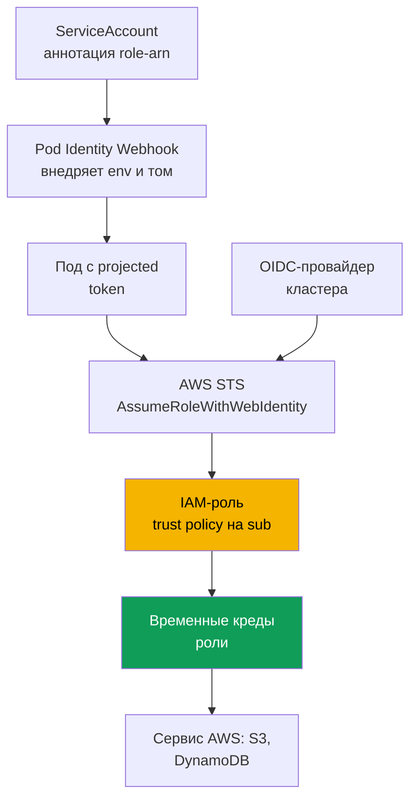
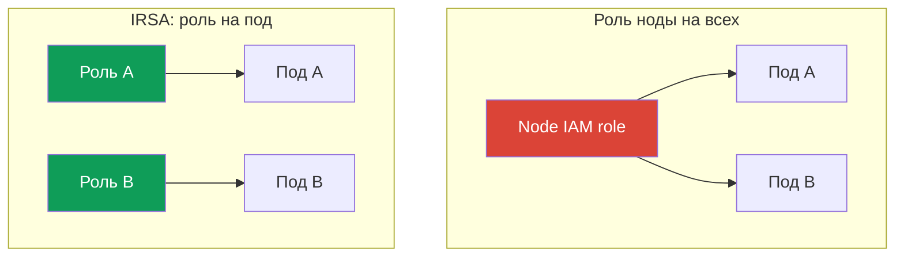

# Глава 16. IRSA: OIDC-провайдер, trust policy, аннотации ServiceAccount

> **Что дальше.** Часть 2 закончилась на вычислениях, и Часть 3 открывается идентичностью.
> Доступ **людей и CI** к кластеру - через IAM и RBAC, access entries - это глава 5, и с
> нынешней главой она не пересекается. Здесь задача другая: доступ **подов** к сервисам AWS
> (S3, DynamoDB, Secrets Manager) через IRSA. Более новый механизм для той же цели, EKS Pod
> Identity, - глава 17, здесь дадим только короткое сравнение. Секреты и External Secrets -
> глава 18, харденинг IMDSv2 и hop limit - глава 19, pod execution role для Fargate - глава 15.

## 16.1. «Дали роль ноде - и права утекли всем подам»

Приложению в поде понадобился доступ к бакету S3. Наивный путь напрашивается сам: у ноды уже
есть IAM-роль (node IAM role, глава 10), под которой работают kubelet и VPC CNI, - добавим в
неё `s3:GetObject`, и приложение заработает. Оно и заработает, вот только права вы выдали не
приложению, а **ноде**, и получил их не один под, а **все поды на этой ноде**.

Последствия видно не сразу, но они серьёзные:

- **Least privilege сломан.** Роль ноды - общая. Дали одному приложению доступ к S3, а получили
  его и sidecar сбора логов, и чужой под соседней команды, и потенциально скомпрометированный
  контейнер. Разделить права по подам через роль ноды невозможно в принципе.
- **Под может украсть креды роли ноды.** Пока доступ к Instance Metadata Service (IMDS) не
  ограничен, любой контейнер сходит на `169.254.169.254` и заберёт временные креды роли ноды
  целиком. Это ровно тот класс проблем, который закрывает харденинг IMDSv2 и hop limit
  (глава 19), но сам факт того, что права висят на ноде, делает IMDS точкой утечки.
- **Аудит бесполезен.** В CloudTrail все вызовы идут от роли ноды, и понять, какой именно под
  трогал бакет, нельзя: идентичность у всех подов одна.

Нужен способ выдать права **конкретному поду**, а не ноде. Именно это делает IRSA.

## 16.2. Главная идея IRSA: своя роль поду через ServiceAccount

IRSA (IAM Roles for Service Accounts) переворачивает модель: под получает **свою** IAM-роль
через привязанный к нему `ServiceAccount`, а не наследует роль ноды. Роль ноды остаётся
минимальной - только то, что нужно kubelet и CNI, - а прикладные права живут в отдельных ролях,
по одной на набор разрешений.

Под капотом это **OIDC federation** - тот же механизм федеративного доступа, что IAM умеет с
2014 года. `ServiceAccount` в EKS выпускает подписанный **projected service account token** -
это OIDC-совместимый JWT с идентичностью SA и настраиваемым audience. Под предъявляет токен
операции STS `AssumeRoleWithWebIdentity`, STS проверяет подпись через OIDC-провайдер кластера и
возвращает **временные креды** запрошенной роли. AWS SDK внутри пода делает это сам.

Три свойства, которые стоит зафиксировать сразу:

- права привязаны к паре «namespace + имя ServiceAccount», а не к ноде;
- креды временные и автоматически ротируются, долгоживущих ключей в поде нет;
- роль ноды перестаёт быть носителем прикладных прав, и утечка через IMDS теряет смысл.

## 16.3. Как это работает по шагам

Собранная картина состоит из пяти частей, которые настраиваются один раз и дальше работают
автоматически при каждом старте пода.



Пошагово:

1. У кластера есть **OIDC issuer URL**. На него в IAM заведён **IAM OIDC identity provider** -
   один раз на кластер (раздел 16.4).
2. Создаётся **IAM-роль** с **trust policy**, которая доверяет этому OIDC-провайдеру и
   **конкретному** `ServiceAccount` через условие на `sub` (раздел 16.5).
3. `ServiceAccount` помечается аннотацией `eks.amazonaws.com/role-arn` с ARN этой роли.
4. При старте пода admission webhook (EKS Pod Identity Webhook) видит аннотацию, монтирует
   **projected token** и добавляет переменные окружения `AWS_ROLE_ARN` и
   `AWS_WEB_IDENTITY_TOKEN_FILE`.
5. AWS SDK в контейнере читает эти переменные, вызывает `AssumeRoleWithWebIdentity` и получает
   временные креды роли. Дальше приложение работает с сервисами AWS от имени роли.

## 16.4. OIDC-провайдер кластера

Каждый кластер EKS имеет собственный OIDC issuer URL вида
`https://oidc.eks.<region>.amazonaws.com/id/<id>`. Это публичный discovery-endpoint: на нём
лежат публичные ключи, которыми подписаны projected-токены. Приватный ключ подписи ротируется
каждые 7 дней, публичные EKS держит до истечения. Внешним OIDC-клиентам ключи нужно обновлять
до истечения, но для самого IAM это происходит прозрачно.

Наличие issuer URL у кластера ещё не означает, что федерация работает. В IAM нужно завести
**IAM OIDC identity provider** для этого URL - именно на него будут ссылаться trust policy
ролей. Провайдер создаётся **один раз на кластер**: он общий для всех ролей IRSA.

```bash
# посмотреть issuer URL кластера
aws eks describe-cluster --name demo \
  --query 'cluster.identity.oidc.issuer' --output text

# создать IAM OIDC provider (идемпотентно, ничего не делает, если он уже есть)
eksctl utils associate-iam-oidc-provider --cluster demo --approve

# проверить, что провайдер зарегистрирован
aws iam list-open-id-connect-providers
```

`eksctl` под капотом вызывает `aws iam create-open-id-connect-provider` - то же можно сделать
вручную или через Terraform (`aws_iam_openid_connect_provider`), передав URL, client id
`sts.amazonaws.com` и отпечаток корневого сертификата. Ручной путь нужен редко: `eksctl` и
IaC-модули EKS делают это сами. Если у VPC нет исходящего доступа в интернет и не настроен
приватный доступ к OIDC-endpoint, команда не резолвит хост issuer - для приватного кластера
нужен VPC interface endpoint `com.amazonaws.<region>.oidc-eks` (глава 19).

## 16.5. Trust policy предметно

Trust policy (assume role policy) роли - это то место, где federated-принципал связывается с
**конкретным** `ServiceAccount`. Разберём её по частям.

```json
{
  "Version": "2012-10-17",
  "Statement": [
    {
      "Effect": "Allow",
      "Principal": {
        "Federated": "arn:aws:iam::111122223333:oidc-provider/oidc.eks.eu-central-1.amazonaws.com/id/EXAMPLED539D4633E53DE1B716D3041E"
      },
      "Action": "sts:AssumeRoleWithWebIdentity",
      "Condition": {
        "StringEquals": {
          "oidc.eks.eu-central-1.amazonaws.com/id/EXAMPLED539D4633E53DE1B716D3041E:sub": "system:serviceaccount:payments:s3-reader",
          "oidc.eks.eu-central-1.amazonaws.com/id/EXAMPLED539D4633E53DE1B716D3041E:aud": "sts.amazonaws.com"
        }
      }
    }
  ]
}
```

- **`Principal.Federated`** - ARN IAM OIDC-провайдера из раздела 16.4, а не сам URL. Говорит
  IAM: доверяй токенам, подписанным этим провайдером.
- **`Action`** - строго `sts:AssumeRoleWithWebIdentity`, другой способ принять роль через
  web identity не сработает.
- **Условие на `sub`** - самое важное. Ключ `<oidc-provider>:sub` сверяется со значением
  `system:serviceaccount:<namespace>:<serviceaccount>`. Именно это привязывает роль к одному
  конкретному SA в конкретном namespace.
- **Условие на `aud`** - `sts.amazonaws.com`, audience projected-токена.

Точность условия на `sub` - вопрос безопасности, а не формальность. Если задать его через
`StringLike` с шаблоном `system:serviceaccount:*:*` или вовсе убрать, роль сможет принять
**любой** `ServiceAccount` кластера - фактически любой под. Условие на `sub` должно указывать
ровно тот namespace и то имя SA, которым роль предназначена.

## 16.6. Аннотация ServiceAccount и что видит под

Со стороны Kubernetes нужен `ServiceAccount` с аннотацией `eks.amazonaws.com/role-arn`.

```yaml
apiVersion: v1
kind: ServiceAccount
metadata:
  name: s3-reader
  namespace: payments
  annotations:
    eks.amazonaws.com/role-arn: arn:aws:iam::111122223333:role/payments-s3-reader
```

Проще всего создать роль, SA и связать их одной командой `eksctl` - она сама поднимет trust
policy с правильным условием на `sub` и навесит аннотацию:

```bash
eksctl create iamserviceaccount \
  --cluster demo --namespace payments --name s3-reader \
  --attach-policy-arn arn:aws:iam::111122223333:policy/payments-s3-read \
  --approve

kubectl -n payments describe serviceaccount s3-reader   # видно аннотацию role-arn
```

Тот же результат нативным Terraform, без `eksctl`: OIDC-провайдер и роль с trust policy на
точный `sub`/`aud` (аннотацию на SA навешивают отдельно в манифесте из раздела 16.6).

```hcl
data "aws_eks_cluster" "demo" { name = "demo" }

data "tls_certificate" "oidc" {
  url = data.aws_eks_cluster.demo.identity[0].oidc[0].issuer
}

resource "aws_iam_openid_connect_provider" "eks" {          # один раз на кластер
  url             = data.aws_eks_cluster.demo.identity[0].oidc[0].issuer
  client_id_list  = ["sts.amazonaws.com"]
  thumbprint_list = [data.tls_certificate.oidc.certificates[0].sha1_fingerprint]
}

locals { oidc = replace(aws_iam_openid_connect_provider.eks.url, "https://", "") }

resource "aws_iam_role" "s3_reader" {
  name = "payments-s3-reader"
  assume_role_policy = jsonencode({
    Version   = "2012-10-17"
    Statement = [{
      Effect    = "Allow"
      Principal = { Federated = aws_iam_openid_connect_provider.eks.arn }
      Action    = "sts:AssumeRoleWithWebIdentity"
      Condition = { StringEquals = {
        "${local.oidc}:sub" = "system:serviceaccount:payments:s3-reader"
        "${local.oidc}:aud" = "sts.amazonaws.com"
      } }
    }]
  })
}
```

Permissions policy навешивают отдельно (`aws_iam_role_policy_attachment`); trust policy тут -
ровно условие из раздела 16.5, только выраженное в HCL.

Дальше под должен использовать этот SA (`spec.serviceAccountName: s3-reader`). При старте пода
Pod Identity Webhook внедряет в контейнеры:

| Что внедряется | Значение | Зачем |
|---|---|---|
| Переменная `AWS_ROLE_ARN` | ARN роли из аннотации SA | SDK знает, какую роль принимать |
| Переменная `AWS_WEB_IDENTITY_TOKEN_FILE` | путь к файлу токена в поде | SDK знает, где взять токен |
| Projected-том с токеном | JWT с `aud=sts.amazonaws.com` и expiry | предъявляется STS для обмена на креды |
| Переменная `AWS_STS_REGIONAL_ENDPOINTS` | `regional` (дефолт в EKS) | SDK идёт в региональный STS, не в глобальный |

Webhook по умолчанию выставляет `AWS_STS_REGIONAL_ENDPOINTS=regional`, и SDK обращается к
региональному endpoint `sts.<region>.amazonaws.com` вместо глобального `sts.amazonaws.com`:
ниже задержка, своя избыточность в регионе и более долгий срок жизни токена сессии. Для
приватного кластера без выхода в интернет это обязательно - трафик STS идёт через VPC
interface endpoint `com.amazonaws.<region>.sts`, а глобальный endpoint его минует. Режим
переключается аннотацией SA `eks.amazonaws.com/sts-regional-endpoints` (`true`/`false`);
ставить `false` практически никогда не нужно.

Токен монтируется как projected service account token: у него есть audience и срок жизни,
kubelet обновляет его до истечения. Приложение обязано использовать **совместимый AWS SDK** -
поддержка web identity есть в актуальных версиях всех SDK и в свежем AWS CLI; очень старый SDK
переменные проигнорирует и пойдёт за кредами роли ноды.

## 16.7. Типовые ошибки и диагностика

IRSA ломается предсказуемо, и почти все отказы сводятся к нескольким причинам.

| Симптом | Вероятная причина | Что проверить |
|---|---|---|
| `AccessDenied` на `AssumeRoleWithWebIdentity` | условие на `sub` в trust policy не совпадает | namespace и имя SA в `sub` |
| SDK берёт креды роли ноды, не роли SA | SA не аннотирован или под не пересоздан | аннотация SA, рестарт пода |
| Переменных `AWS_ROLE_ARN` нет в поде | под создан до аннотации, webhook не сработал | пересоздать под |
| `AccessDenied` уже на вызове сервиса | у роли нет нужной IAM-политики | permissions policy роли |
| Ничего не работает со старым приложением | несовместимый или очень старый AWS SDK | версия SDK |

Порядок диагностики от пода наружу:

```bash
# 1. переменные окружения на месте?
kubectl -n payments exec deploy/my-app -- env | grep AWS_

# 2. кем под видит себя в AWS - должна быть assumed-role нужной роли, не роль ноды
kubectl -n payments exec deploy/my-app -- aws sts get-caller-identity

# 3. аннотация действительно на том SA, что использует под?
kubectl -n payments get sa s3-reader -o yaml | grep role-arn
```

Ключевая проверка - `aws sts get-caller-identity` из пода: если в `Arn` видна
`assumed-role/payments-s3-reader/...`, федерация прошла и проблема в permissions policy роли;
если видна роль ноды - под кредов роли SA не получил, и причина выше по таблице. Отдельная
частая грабля: аннотацию навесили, но **под не пересоздали**, - webhook внедряет переменные
только при создании пода, живой под их не получит.

## 16.8. IRSA против роли ноды



Разница принципиальная. Роль ноды - **общая** для всех подов на ноде: любые выданные ей права
получают все, а идентичность в CloudTrail одна на всех. IRSA даёт **least privilege на уровне
пода**: у каждого приложения своя роль со своими правами, вызовы в CloudTrail идут от неё,
и скомпрометированный под ограничен своими разрешениями.

За ролью ноды при этом остаётся ровно то, что нужно системным компонентам ноды: pull образов из
ECR, работа VPC CNI с ENI, запись логов и метрик CloudWatch - то, что задают managed-политики
вроде `AmazonEKSWorkerNodePolicy` и `AmazonEC2ContainerRegistryReadOnly` (глава 10). Прикладные
права там быть не должны. Когда роль ноды минимальна, а IMDS ограничен (глава 19), красть у неё
нечего.

## 16.9. Короткое сравнение с Pod Identity

EKS Pod Identity решает ту же задачу «своя роль поду» иначе, и подробно он разбирается в главе
17. Здесь - только границы выбора, чтобы понимать, что IRSA не единственный вариант.

| Свойство | IRSA | EKS Pod Identity |
|---|---|---|
| Механизм | OIDC federation, trust policy на `sub` | агент на ноде и API EKS |
| Настройка на кластер | IAM OIDC provider, по роли своя trust policy | установка аддона Pod Identity Agent |
| Trust policy роли | завязана на конкретный OIDC-провайдер | общий principal `pods.eks.amazonaws.com` |
| Кросс-аккаунт и вне EKS | работает (federation по OIDC) | ограниченнее, привязан к EKS |
| Возраст | давний, широко распространён | новее, проще в связывании |

Коротко: IRSA гибче (работает через стандартный OIDC, годится для кросс-аккаунта и вне
EKS), но настройка многословнее - на каждую роль своя trust policy с точным `sub`. Pod Identity
проще связывать (ассоциация делается через API EKS, роль не привязана к OIDC-провайдеру
кластера), но это более новый механизм со своими ограничениями. Детали, миграция и критерии
выбора - глава 17.

## 16.10. Как это применяют в продакшене

- **OIDC-провайдер заводится вместе с кластером** в IaC, а не руками потом: без него ни одна
  роль IRSA не работает, и это первый шаг после создания кластера.
- **Одна роль - один набор прав - один ServiceAccount.** Роли не переиспользуют между разными
  приложениями: каждому SA своя роль с минимальными правами и точным условием на `sub`.
- **Роль ноды держат минимальной.** В ней только права системных компонентов; прикладные
  разрешения выносят в роли IRSA, а IMDS ограничивают через hop limit (глава 19).
- **Условие на `sub` всегда точное** - конкретные namespace и имя SA, без шаблонов `*`, иначе
  роль сможет принять любой под кластера.
- **Роли и SA описаны кодом.** `eksctl create iamserviceaccount` или Terraform-модуль создают
  роль, trust policy и аннотированный SA вместе, чтобы они не разъезжались.

## 16.11. Мини-глоссарий

- **IRSA** - IAM Roles for Service Accounts: механизм выдачи IAM-роли поду через привязанный
  `ServiceAccount` на основе OIDC federation.
- **OIDC issuer URL** - публичный OIDC-endpoint кластера (`oidc.eks.<region>.amazonaws.com/id/`)
  с публичными ключами подписи projected-токенов.
- **IAM OIDC identity provider** - объект IAM, регистрирующий issuer URL кластера; на него
  ссылаются trust policy ролей. Заводится один раз на кластер.
- **Trust policy** - политика доверия роли: `Federated`-принципал (ARN OIDC-провайдера),
  `Action` `sts:AssumeRoleWithWebIdentity` и условия `StringEquals` на `sub` и `aud`.
- **Projected service account token** - OIDC-совместимый JWT с идентичностью SA, audience
  `sts.amazonaws.com` и сроком жизни; монтируется в под и обменивается в STS на креды.
- **`AssumeRoleWithWebIdentity`** - операция STS, обменивающая web identity token на временные
  креды IAM-роли.

## 16.12. Итоги главы

- Наивный путь «дать права роли ноды» ломает least privilege (права получают все поды на ноде),
  делает роль ноды целью для кражи через IMDS и обезличивает CloudTrail. IRSA выдаёт права
  конкретному поду.
- IRSA основан на OIDC federation: `ServiceAccount` выпускает подписанный projected-токен, под
  предъявляет его STS через `AssumeRoleWithWebIdentity`, STS проверяет подпись через
  OIDC-провайдер кластера и возвращает временные креды роли.
- Пять частей механизма: OIDC issuer URL кластера, IAM OIDC identity provider (один на кластер),
  IAM-роль с trust policy на `sub`, аннотация `eks.amazonaws.com/role-arn` на SA, projected-токен
  и переменные `AWS_ROLE_ARN`, `AWS_WEB_IDENTITY_TOKEN_FILE`, внедряемые webhook.
- Trust policy связывает роль с конкретным SA условием `StringEquals` на
  `<oidc-provider>:sub` = `system:serviceaccount:NS:SA` и на `aud` = `sts.amazonaws.com`.
  Шаблон вместо точного `sub` открывает роль любому поду.
- Диагностика идёт от пода наружу: переменные `AWS_*` в поде, `aws sts get-caller-identity`
  (assumed-role нужной роли, а не роль ноды), аннотация на SA, пересоздан ли под, версия SDK.
  `AccessDenied` на вызове сервиса - это уже permissions policy роли.
- Роль ноды остаётся минимальной (kubelet, CNI, ECR, логи), прикладные права - в ролях IRSA.
- Pod Identity (глава 17) решает ту же задачу через агента и API EKS: проще связывать, но IRSA
  гибче для кросс-аккаунта и сценариев вне EKS.

## 16.13. Как это пригодится в реальной работе

Вопрос «какие права у этого пода в AWS» с IRSA отвечается одной ролью и её permissions policy, а
не разбором того, что накопилось на общей роли ноды. Инцидент «под скомпрометирован» ограничен
правами его роли, а не всем, что умеет нода. А расследование по CloudTrail становится осмысленнее:
вызовы идут от роли конкретного приложения, и видно, кто именно обращался к бакету или таблице.
На дежурстве большинство обращений «приложение получает AccessDenied к AWS» закрываются той же
короткой цепочкой из раздела 16.7: переменные в поде, `get-caller-identity`, аннотация SA,
пересоздан ли под.

## 16.14. Вопросы для самопроверки

1. Чем плох путь «добавить нужное право в роль ноды» с точки зрения least privilege и аудита?
2. Как под может завладеть кредами роли ноды и какая глава закрывает эту дыру?
3. На каком механизме AWS построен IRSA и какая операция STS обменивает токен на креды?
4. Что такое OIDC issuer URL кластера и чем он отличается от IAM OIDC identity provider?
5. Почему IAM OIDC provider создаётся один раз на кластер, а ролей IRSA может быть много?
6. Из каких частей состоит trust policy роли IRSA и что задаёт `Principal.Federated`?
7. Почему условие на `sub` должно быть точным, и что произойдёт при шаблоне `*`?
8. Какие переменные окружения и какой том webhook внедряет в под и откуда он знает, что нужно?
9. Под аннотировали, но он всё равно ходит под ролью ноды. Назовите две вероятные причины.
10. Как одной командой из пода понять, прошла ли федерация, и отличить это от нехватки прав?
11. Что должно остаться в роли ноды после перехода на IRSA?
12. Чем IRSA отличается от Pod Identity и когда IRSA предпочтительнее?

## Практика

Своей лабы у главы пока нет, но всё проверяется на живом кластере. Начните с
`aws eks describe-cluster --name <cluster> --query 'cluster.identity.oidc.issuer'` и
`aws iam list-open-id-connect-providers` - есть ли у кластера issuer URL и заведён ли под него
IAM OIDC provider. Если провайдера нет, создайте его командой
`eksctl utils associate-iam-oidc-provider --cluster <cluster> --approve`.

Дальше поднимите тестовую роль и SA через `eksctl create iamserviceaccount` с политикой
только на чтение одного бакета, запустите под с этим SA и выполните в нём
`aws sts get-caller-identity` - в `Arn` должна быть assumed-role вашей роли, а не роль ноды.
Посмотрите `kubectl exec ... -- env | grep AWS_`, чтобы увидеть `AWS_ROLE_ARN` и
`AWS_WEB_IDENTITY_TOKEN_FILE`, и `kubectl describe sa` для аннотации с ARN роли.
Отдельно потренируйте отказ: испортите условие на `sub` в trust policy (смените namespace),
пересоздайте под и найдите `AccessDenied` на `AssumeRoleWithWebIdentity`; затем верните точный
`sub` и убедитесь, что доступ вернулся. Разберите trust policy роли через
`aws iam get-role --role-name <role>` и сверьте `sub` и `aud` с разделом 16.5.

---
[Оглавление](../README_RU.md) · [Глава 15](../15/ru.md) · [Глава 17](../17/ru.md)
