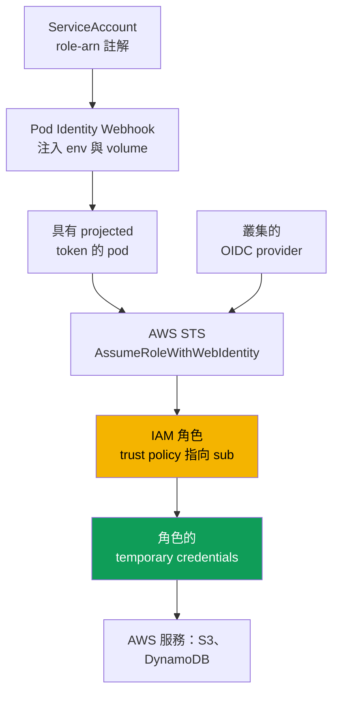
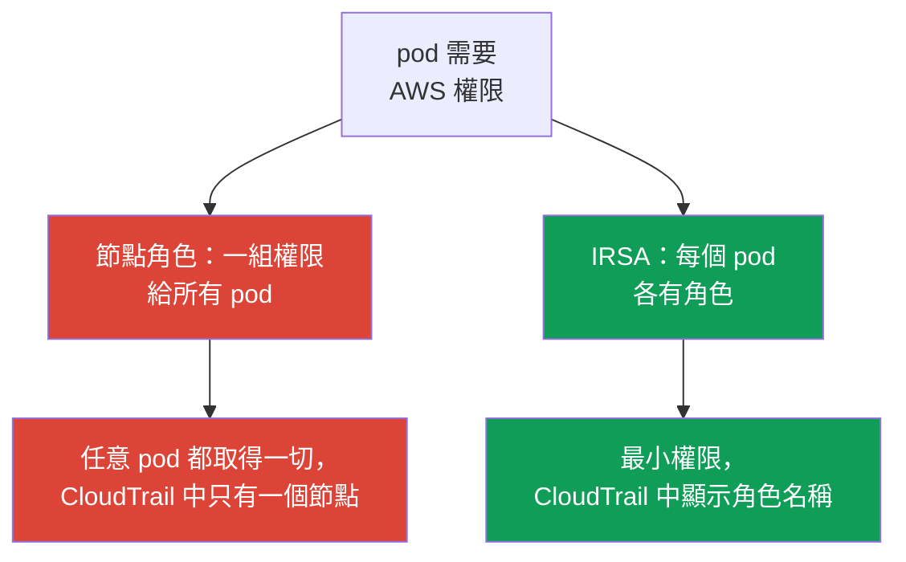

[Русская версия](ru.md) · [Eng version](en.md) · [Versión en español](es.md) · [Version française](fr.md) · [Deutsche Version](de.md) · [ქართული ვერსია](ge.md) · [日本語版](jp.md)
# 第 16 章：IRSA：OIDC provider、trust policy、ServiceAccount 註解

> **接下來。** 第 2 部分以運算結束，第 3 部分從身分識別開始。
> **人員與 CI** 透過 IAM 和 RBAC 存取叢集，access entries 見第 5 章，與
> 本章無關。這裡處理的是另一項任務：透過 IRSA 讓 **pod** 存取 AWS 服務
> (S3、DynamoDB、Secrets Manager)。達成相同目的的較新機制 EKS Pod
> Identity 見第 17 章，這裡僅作簡短比較。Secrets 與 External Secrets 見
> 第 18 章，IMDSv2 與 hop limit 的 hardening 見第 19 章，Fargate 的 pod
> execution role 見第 15 章。

## 16.1.「把角色給節點，權限就洩漏給所有 pod」

pod 中的應用程式需要存取 S3 bucket。最直觀的做法似乎是：節點已有 IAM 角色
(node IAM role，見第 10 章)，kubelet 和 VPC CNI 都以此執行，於是加上
`s3:GetObject`，應用程式就能運作。它確實能運作，但你授予的不是應用程式，而是
**節點**，得到權限的也不只是一個 pod，而是**該節點上的所有 pod**。

後果未必立即可見，但很嚴重：

- **least privilege 被破壞。** 節點角色是共用的。你給一個應用程式 S3 存取權，
  日誌收集 sidecar、其他團隊的相鄰 pod，以及可能已遭入侵的 container 都取得了
  它。原則上無法透過節點角色依 pod 分隔權限。
- **pod 可以竊取節點角色的 credentials。** 只要 Instance Metadata Service
  (IMDS) 存取未受限制，任意 container 都可以連到 `169.254.169.254` 並完整取得
  節點角色的 temporary credentials。這正是 IMDSv2 hardening 和 hop limit 所處理
  的問題類別 (第 19 章)，但只要權限附加在節點上，IMDS 就是洩漏點。
- **audit 無用。** CloudTrail 中所有呼叫都來自節點角色，無法得知究竟是哪個 pod
  存取了 bucket，因為所有 pod 使用同一個身分。

需要一種將權限授予**特定 pod**而非節點的方式。這正是 IRSA 的用途。

## 16.2. IRSA 的核心概念：透過 ServiceAccount 將專屬角色授予 pod

IRSA (IAM Roles for Service Accounts) 顛覆了模型：pod 透過與其綁定的
`ServiceAccount` 取得**自己的** IAM 角色，而非繼承節點角色。節點角色保持
最小化，只保留 kubelet 和 CNI 所需的權限，應用程式權限則存在獨立角色中，每個
角色對應一組權限。

其底層是 **OIDC federation**，也就是 IAM 自 2014 年起支援的 federation 存取
機制。EKS 中的 `ServiceAccount` 會簽發 **projected service account token**，
這是帶有 SA 身分與可設定 audience 的 OIDC 相容 JWT。pod 向 STS 的
`AssumeRoleWithWebIdentity` 操作提交 token，STS 透過叢集的 OIDC provider 驗證
簽章，並回傳所請求角色的 **temporary credentials**。pod 內的 AWS SDK 會自行完成
這個過程。

應立即記住三項特性：

- 權限綁定於「namespace + ServiceAccount 名稱」的配對，而非節點；
- credentials 是暫時性的並自動輪替，pod 中沒有長期金鑰；
- 節點角色不再承載應用程式權限，透過 IMDS 洩漏也就失去意義。

## 16.3. 運作步驟

完整架構由五個部分組成，只需設定一次，之後每次 pod 啟動時都會自動運作。



逐步說明：

1. 叢集具有 **OIDC issuer URL**。IAM 中為它建立 **IAM OIDC identity provider**，
   每個叢集僅需一次 (第 16.4 節)。
2. 建立一個 **IAM 角色**，其 **trust policy** 信任該 OIDC provider，並透過 `sub`
   條件信任**特定** `ServiceAccount` (第 16.5 節)。
3. 為 `ServiceAccount` 標記帶有此角色 ARN 的 `eks.amazonaws.com/role-arn` 註解。
4. pod 啟動時，admission webhook (EKS Pod Identity Webhook) 看到註解後會掛載
   **projected token**，並新增 `AWS_ROLE_ARN` 與 `AWS_WEB_IDENTITY_TOKEN_FILE`
   環境變數。
5. container 內的 AWS SDK 讀取這些變數，呼叫 `AssumeRoleWithWebIdentity` 並取得
   角色的 temporary credentials。之後應用程式即以該角色身分使用 AWS 服務。

## 16.4. 叢集的 OIDC provider

每個 EKS 叢集都有自己的 OIDC issuer URL，形式為
`https://oidc.eks.<region>.amazonaws.com/id/<id>`。這是公開的 discovery endpoint，
其中存放用於簽署 projected token 的公開金鑰。私有簽署金鑰每 7 天輪替一次，EKS
會保留公開金鑰直到其過期。外部 OIDC client 必須在金鑰過期前更新金鑰，但 IAM
本身會透明地處理此事。

叢集有 issuer URL 不代表 federation 已經運作。必須在 IAM 中為該 URL 建立
**IAM OIDC identity provider**，角色的 trust policy 正是參照它。provider 每個
叢集僅建立**一次**，並由所有 IRSA 角色共用。

```bash
# 查看叢集的 issuer URL
aws eks describe-cluster --name demo \
  --query 'cluster.identity.oidc.issuer' --output text

# 建立 IAM OIDC provider (具冪等性，若已存在則不執行任何動作)
eksctl utils associate-iam-oidc-provider --cluster demo --approve

# 確認 provider 已註冊
aws iam list-open-id-connect-providers
```

`eksctl` 在底層呼叫 `aws iam create-open-id-connect-provider`，也可手動完成，或透過
Terraform (`aws_iam_openid_connect_provider`) 傳入 URL、client id
`sts.amazonaws.com` 及 root certificate 的 fingerprint。很少需要手動操作：`eksctl`
和 EKS IaC module 都會自行完成。若 VPC 沒有對外網際網路存取且未設定 OIDC endpoint
的私有存取，該命令無法解析 issuer host。私有叢集需要 VPC interface endpoint
`com.amazonaws.<region>.oidc-eks` (第 19 章)。

## 16.5. 具體的 trust policy

角色的 trust policy (assume role policy) 是將 federated principal 繫結至**特定**
`ServiceAccount` 的位置。以下分段說明。

```json
{
  "Version": "2012-10-17",
  "Statement": [
    {
      "Effect": "Allow",
      "Principal": {
        "Federated": "arn:aws:iam::111122223333:oidc-provider/oidc.eks.eu-central-1.amazonaws.com/id/EXAMPLED539D4633E53DE1B716D3041E"
      },
      "Action": "sts:AssumeRoleWithWebIdentity",
      "Condition": {
        "StringEquals": {
          "oidc.eks.eu-central-1.amazonaws.com/id/EXAMPLED539D4633E53DE1B716D3041E:sub": "system:serviceaccount:payments:s3-reader",
          "oidc.eks.eu-central-1.amazonaws.com/id/EXAMPLED539D4633E53DE1B716D3041E:aud": "sts.amazonaws.com"
        }
      }
    }
  ]
}
```

- **`Principal.Federated`** 是第 16.4 節 IAM OIDC provider 的 ARN，不是 URL 本身。
  它告訴 IAM：信任由此 provider 簽署的 token。
- **`Action`** 必須是嚴格的 `sts:AssumeRoleWithWebIdentity`，其他透過 web identity
  assume 角色的方法都不會成功。
- **`sub` 條件**最重要。`<oidc-provider>:sub` key 會與
  `system:serviceaccount:<namespace>:<serviceaccount>` 比對。這將角色繫結至特定
  namespace 中的一個特定 SA。
- **`aud` 條件**是 projected token 的 audience，即 `sts.amazonaws.com`。

`sub` 條件的精確性是安全性問題，並非形式要求。若以 `StringLike` 搭配
`system:serviceaccount:*:*` 模式設定，或完全移除，叢集中的**任意**
`ServiceAccount` 都可以 assume 該角色，實際上就是任意 pod。`sub` 條件必須精確指定
此角色所屬的 namespace 和 SA 名稱。

## 16.6. ServiceAccount 註解與 pod 所見內容

在 Kubernetes 端，需要一個帶有 `eks.amazonaws.com/role-arn` 註解的
`ServiceAccount`。

```yaml
apiVersion: v1
kind: ServiceAccount
metadata:
  name: s3-reader
  namespace: payments
  annotations:
    eks.amazonaws.com/role-arn: arn:aws:iam::111122223333:role/payments-s3-reader
```

建立角色、SA 並以一個 `eksctl` 指令將兩者連結是最簡單的方式。它會自行建立帶有正確
`sub` 條件的 trust policy，並加上註解：

```bash
eksctl create iamserviceaccount \
  --cluster demo --namespace payments --name s3-reader \
  --attach-policy-arn arn:aws:iam::111122223333:policy/payments-s3-read \
  --approve

kubectl -n payments describe serviceaccount s3-reader   # 可見 role-arn 註解
```

以原生 Terraform 而非 `eksctl` 可獲得相同結果：OIDC provider 與其 trust policy
針對精確 `sub`/`aud` 的角色 (SA 的註解會在第 16.6 節 manifest 中另行加入)。

```hcl
data "aws_eks_cluster" "demo" { name = "demo" }

data "tls_certificate" "oidc" {
  url = data.aws_eks_cluster.demo.identity[0].oidc[0].issuer
}

resource "aws_iam_openid_connect_provider" "eks" {          # 每個叢集一次
  url             = data.aws_eks_cluster.demo.identity[0].oidc[0].issuer
  client_id_list  = ["sts.amazonaws.com"]
  thumbprint_list = [data.tls_certificate.oidc.certificates[0].sha1_fingerprint]
}

locals { oidc = replace(aws_iam_openid_connect_provider.eks.url, "https://", "") }

resource "aws_iam_role" "s3_reader" {
  name = "payments-s3-reader"
  assume_role_policy = jsonencode({
    Version   = "2012-10-17"
    Statement = [{
      Effect    = "Allow"
      Principal = { Federated = aws_iam_openid_connect_provider.eks.arn }
      Action    = "sts:AssumeRoleWithWebIdentity"
      Condition = { StringEquals = {
        "${local.oidc}:sub" = "system:serviceaccount:payments:s3-reader"
        "${local.oidc}:aud" = "sts.amazonaws.com"
      } }
    }]
  })
}
```

permissions policy 要另行附加 (`aws_iam_role_policy_attachment`)；此處的 trust policy
正是第 16.5 節的條件，只是以 HCL 表示。

接著 pod 必須使用此 SA (`spec.serviceAccountName: s3-reader`)。pod 啟動時，Pod Identity
Webhook 會向 container 注入：

| 注入項目 | 值 | 用途 |
|---|---|---|
| `AWS_ROLE_ARN` 環境變數 | SA 註解中的角色 ARN | SDK 知道要 assume 哪個角色 |
| `AWS_WEB_IDENTITY_TOKEN_FILE` 環境變數 | pod 中 token 檔案的路徑 | SDK 知道從哪裡取得 token |
| 帶有 token 的 projected volume | 有 `aud=sts.amazonaws.com` 與 expiry 的 JWT | 提交給 STS 以交換 credentials |
| `AWS_STS_REGIONAL_ENDPOINTS` 環境變數 | `regional` (EKS 預設值) | SDK 連到 regional STS，而非 global STS |

Webhook 預設設定 `AWS_STS_REGIONAL_ENDPOINTS=regional`，SDK 會使用 regional endpoint
`sts.<region>.amazonaws.com`，而不是 global `sts.amazonaws.com`：延遲更低、區域內有
自己的冗餘，且 session token 的有效期更長。對沒有網際網路出口的私有叢集，這是必要的，
STS 流量會經過 VPC interface endpoint `com.amazonaws.<region>.sts`，global endpoint
則會繞過它。可使用 SA 註解 `eks.amazonaws.com/sts-regional-endpoints` (`true`/`false`)
切換模式，幾乎永遠不需要設為 `false`。

此 token 以 projected service account token 掛載，具有 audience 與有效期，kubelet
會在其到期前更新。應用程式必須使用**相容的 AWS SDK**，所有目前版本的 SDK 與較新
AWS CLI 均支援 web identity；非常舊的 SDK 會忽略這些變數，並嘗試取得節點角色的
credentials。

## 16.7. 常見錯誤與診斷

IRSA 的故障模式可預期，幾乎所有拒絕都可歸結為幾個原因。

| 症狀 | 可能原因 | 檢查項目 |
|---|---|---|
| `AssumeRoleWithWebIdentity` 的 `AccessDenied` | trust policy 的 `sub` 條件不相符 | `sub` 中的 namespace 與 SA 名稱 |
| SDK 取得節點角色而非 SA 角色的 credentials | SA 未註解或 pod 未重新建立 | SA 註解、重新啟動 pod |
| pod 中沒有 `AWS_ROLE_ARN` 變數 | pod 在註解前建立，webhook 未生效 | 重新建立 pod |
| 服務呼叫時才出現 `AccessDenied` | 角色缺少必要 IAM policy | 角色的 permissions policy |
| 舊應用程式完全無法運作 | AWS SDK 不相容或過舊 | SDK 版本 |

從 pod 向外的診斷順序：

```bash
# 1. 環境變數是否存在？
kubectl -n payments exec deploy/my-app -- env | grep AWS_

# 2. pod 在 AWS 中看見的自己是誰，應為所需角色的 assumed-role，而不是節點角色
kubectl -n payments exec deploy/my-app -- aws sts get-caller-identity

# 3. 註解確實在 pod 使用的 SA 上嗎？
kubectl -n payments get sa s3-reader -o yaml | grep role-arn
```

關鍵檢查是在 pod 中執行 `aws sts get-caller-identity`：若 `Arn` 顯示
`assumed-role/payments-s3-reader/...`，federation 已成功，問題在角色的 permissions
policy；若顯示節點角色，pod 未取得 SA 角色 credentials，原因可由上表追查。另一個
常見陷阱是加上註解卻**沒有重新建立 pod**，webhook 僅在建立 pod 時注入變數，現有
pod 不會取得它們。

## 16.8. IRSA 與節點角色的比較



差異是根本性的。節點角色由節點上**所有** pod 共用：任何授予它的權限都會由所有 pod
取得，CloudTrail 中也只有一個共同身分。IRSA 提供**pod 層級的 least privilege**：
每個應用程式有各自的角色及權限，CloudTrail 呼叫來自該角色，遭入侵的 pod 也僅限於
自身權限。

節點角色保留的正是節點系統元件所需的內容：從 ECR pull 映像、VPC CNI 使用 ENI、
寫入 CloudWatch logs 與 metrics，這些由 `AmazonEKSWorkerNodePolicy` 與
`AmazonEC2ContainerRegistryReadOnly` 等 managed policy 提供 (第 10 章)。其中不應有
應用程式權限。節點角色最小化且 IMDS 受限時 (第 19 章)，就沒有可竊取的東西。

## 16.9. 與 Pod Identity 的簡短比較

EKS Pod Identity 以不同方式解決相同的「每個 pod 都有自己的角色」問題，第 17 章會
詳細介紹。此處僅說明選擇邊界，以理解 IRSA 並非唯一選項。

| 特性 | IRSA | EKS Pod Identity |
|---|---|---|
| 機制 | OIDC federation，trust policy 針對 `sub` | 節點上的 agent 與 EKS API |
| 叢集設定 | IAM OIDC provider，每個角色各自有 trust policy | 安裝 Pod Identity Agent addon |
| 角色的 trust policy | 綁定特定 OIDC provider | 共用 principal `pods.eks.amazonaws.com` |
| cross-account 與 EKS 之外 | 可行 (透過 OIDC federation) | 較受限制，綁定 EKS |
| 成熟度 | 歷史較久，廣泛使用 | 較新，連結方式較簡單 |

簡言之，IRSA 更靈活，透過標準 OIDC 運作，適用於 cross-account 及 EKS 以外的情境，
但設定較冗長，每個角色都有帶精確 `sub` 的 trust policy。Pod Identity 的連結更簡單，
association 透過 EKS API 建立，角色未綁定至叢集 OIDC provider，但它是有自身限制的
較新機制。詳細內容、migration 與選擇準則見第 17 章。

## 16.10. 在 production 的使用方式

- **OIDC provider 與叢集一同在 IaC 中建立。** 不要之後才手動建立，因為沒有它，
  所有 IRSA 角色都無法運作，且這是建立叢集後的第一步。
- **一個角色，一組權限，一個 ServiceAccount。** 不在不同應用程式間重複使用角色：
  每個 SA 都有自己的最小權限角色及精確 `sub` 條件。
- **節點角色保持最小化。** 僅保留系統元件權限；將應用程式權限移至 IRSA 角色，並
  透過 hop limit 限制 IMDS (第 19 章)。
- **`sub` 條件一律精確。** 指定具體 namespace 和 SA 名稱，不使用 `*` 模式，否則
  叢集中的任意 pod 都能 assume 該角色。
- **角色和 SA 以程式碼描述。** `eksctl create iamserviceaccount` 或 Terraform module
  會一起建立角色、trust policy 和帶註解的 SA，避免彼此不同步。

## 16.11. 迷你詞彙表

- **IRSA**：IAM Roles for Service Accounts，透過與其綁定的 `ServiceAccount`，以
  OIDC federation 向 pod 授予 IAM 角色的機制。
- **OIDC issuer URL**：叢集的公開 OIDC endpoint
  (`oidc.eks.<region>.amazonaws.com/id/`)，帶有 projected token 的公開簽署金鑰。
- **IAM OIDC identity provider**：註冊叢集 issuer URL 的 IAM 物件，角色 trust
  policy 會參照它。每個叢集建立一次。
- **Trust policy**：角色的信任 policy，包含 `Federated` principal (OIDC provider 的
  ARN)、`Action` `sts:AssumeRoleWithWebIdentity`，以及 `sub` 和 `aud` 的
  `StringEquals` 條件。
- **Projected service account token**：具有 SA 身分、audience `sts.amazonaws.com`
  與有效期的 OIDC 相容 JWT，掛載於 pod 中並在 STS 交換為 credentials。
- **`AssumeRoleWithWebIdentity`**：將 web identity token 交換為 IAM 角色 temporary
  credentials 的 STS 操作。

## 16.12. 本章摘要

- 天真的「將權限授予節點角色」做法會破壞 least privilege (節點上所有 pod 都取得
  權限)，使節點角色成為透過 IMDS 竊取的目標，也使 CloudTrail 失去可識別性。IRSA
  將權限授予特定 pod。
- IRSA 基於 OIDC federation：`ServiceAccount` 簽發 signed projected token，pod 透過
  `AssumeRoleWithWebIdentity` 向 STS 提交它，STS 透過叢集的 OIDC provider 驗證簽章
  並回傳角色的 temporary credentials。
- 機制由五個部分構成：叢集 OIDC issuer URL、IAM OIDC identity provider (每個叢集
  一個)、trust policy 針對 `sub` 的 IAM 角色、SA 上的 `eks.amazonaws.com/role-arn`
  註解，以及 webhook 注入的 projected token、`AWS_ROLE_ARN` 和
  `AWS_WEB_IDENTITY_TOKEN_FILE` 變數。
- Trust policy 以 `StringEquals` 將角色繫結至特定 SA，
  `<oidc-provider>:sub` = `system:serviceaccount:NS:SA` 且 `aud` =
  `sts.amazonaws.com`。以模式取代精確 `sub` 會將角色開放給任意 pod。
- 診斷從 pod 向外進行：pod 中的 `AWS_*` 變數、`aws sts get-caller-identity`
  (應為所需角色的 assumed-role，而非節點角色)、SA 註解、pod 是否已重新建立，以及
  SDK 版本。服務呼叫的 `AccessDenied` 則屬於角色的 permissions policy 問題。
- 節點角色保持最小化 (kubelet、CNI、ECR、logs)，應用程式權限放在 IRSA 角色中。
- Pod Identity (第 17 章) 透過 agent 與 EKS API 解決相同問題，連結較簡單，但 IRSA
  對 cross-account 與 EKS 以外情境更靈活。

## 16.13. 在實際工作中的用途

使用 IRSA 時，「這個 pod 在 AWS 中有什麼權限」可以用一個角色及其 permissions policy
回答，而不是分析共用節點角色上累積了什麼。若發生「pod 已遭入侵」事件，影響會受限於
其角色權限，而非節點能做的一切。CloudTrail 調查也更具意義：呼叫來自特定應用程式的
角色，可以看出究竟是哪個應用程式存取了 bucket 或 table。在值班時，多數「應用程式
取得 AWS AccessDenied」問題，都可用第 16.7 節相同的短鏈處理：pod 中的變數、
`get-caller-identity`、SA 註解，以及 pod 是否已重新建立。

## 16.14. 自我檢查問題

1. 從 least privilege 和 audit 的角度，為何「將所需權限加入節點角色」是不好的做法？
2. pod 如何能取得節點角色 credentials，以及哪一章處理這個漏洞？
3. AWS 以何種機制建構 IRSA，哪一項 STS 操作將 token 交換為 credentials？
4. 什麼是叢集的 OIDC issuer URL，它與 IAM OIDC identity provider 有何不同？
5. 為何每個叢集只建立一次 IAM OIDC provider，而 IRSA 角色可以有許多個？
6. IRSA 角色的 trust policy 由哪些部分組成，`Principal.Federated` 指定什麼？
7. 為何 `sub` 條件必須精確，使用 `*` 模式時會發生什麼？
8. webhook 向 pod 注入哪些環境變數與哪一個 volume，它如何得知需要這樣做？
9. pod 已註解但仍使用節點角色。請列出兩個可能原因。
10. 如何在 pod 中用一條指令判斷 federation 是否成功，並將其與權限不足區分開？
11. 遷移至 IRSA 後，節點角色中應保留什麼？
12. IRSA 與 Pod Identity 有何不同，何時 IRSA 較合適？

## 實作練習

本課程對應的 lab：[lab 104：應用程式的 Workload identity：IRSA 與 Pod Identity](../../labs/104/README_TW.MD)。IRSA 也會出現在 [lab 106：EBS CSI](../../labs/106/README_TW.MD) 和 [lab 107：EFS CSI](../../labs/107/README_TW.MD)，
作為授予 driver 權限的方式。此外，所有內容都可在實際叢集上驗證。先執行
`aws eks describe-cluster --name <cluster> --query 'cluster.identity.oidc.issuer'` 與
`aws iam list-open-id-connect-providers`，確認叢集是否有 issuer URL，以及是否已為它
建立 IAM OIDC provider。若沒有 provider，請執行
`eksctl utils associate-iam-oidc-provider --cluster <cluster> --approve` 建立它。

接著使用 `eksctl create iamserviceaccount` 建立測試角色和 SA，policy 只允許讀取一個
bucket，使用此 SA 啟動 pod 並在其中執行 `aws sts get-caller-identity`，`Arn` 應顯示
你角色的 assumed-role，而不是節點角色。查看 `kubectl exec ... -- env | grep AWS_`，
以確認 `AWS_ROLE_ARN` 與 `AWS_WEB_IDENTITY_TOKEN_FILE`，並使用
`kubectl describe sa` 檢查角色 ARN 註解。另行練習失敗情境：破壞 trust policy 中的
`sub` 條件 (變更 namespace)，重新建立 pod，找出 `AssumeRoleWithWebIdentity` 的
`AccessDenied`；接著還原精確的 `sub` 並確認存取已恢復。使用
`aws iam get-role --role-name <role>` 檢查角色 trust policy，並將 `sub` 和 `aud` 與
第 16.5 節比對。

---
[目錄](../README_TW.md) · [第 15 章](../15/tw.md) · [第 17 章](../17/tw.md)
