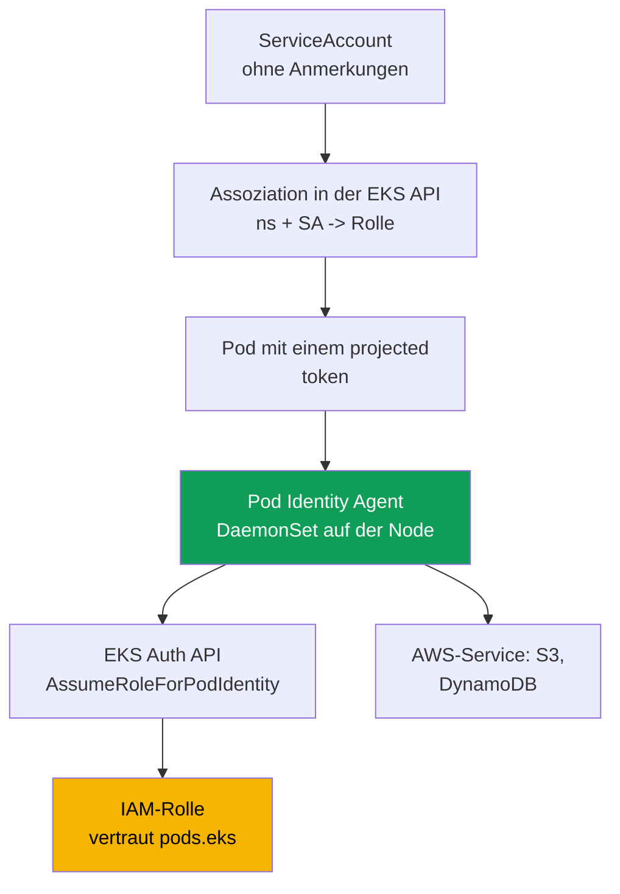
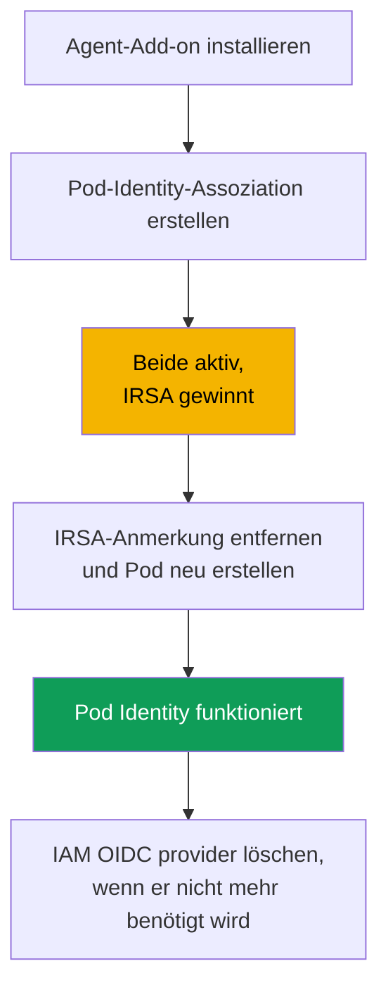

[Русская версия](ru.md) · [Eng version](en.md) · [Versión en español](es.md) · [Version française](fr.md) · [ქართული ვერსია](ge.md) · [繁體中文版](tw.md) · [日本語版](jp.md)
# Kapitel 17. EKS Pod Identity: Agent, Assoziationen, Migration von IRSA

> **Wie geht es weiter?** Kapitel 16 hat die Aufgabe „eine eigene Rolle für jeden Pod“ über IRSA
> abgeschlossen: den OIDC-Provider des Clusters, eine Trust Policy für `sub` und eine
> `ServiceAccount`-Anmerkung. Hier folgt ein anderer Mechanismus für dieselbe Aufgabe, EKS Pod
> Identity. Er kam später hinzu und beseitigt den größten Schwachpunkt von IRSA: die Bindung der
> Trust Policy an den OIDC-Provider eines bestimmten Clusters. Wir behandeln den Agenten,
> Assoziationen, den direkten Vergleich mit IRSA und die Migration. Verwandte Themen stehen in
> anderen Kapiteln: Zugriff von Menschen und CI (Kapitel 5), Secrets (Kapitel 18), Hardening von
> IMDSv2 (Kapitel 19), EKS-Add-ons (Kapitel 37) und Fargate (Kapitel 15).

## 17.1. „Wir haben die Rolle in einen benachbarten Cluster kopiert und müssen nun die Trust Policy umschreiben“

IRSA funktioniert gut. Doch es hat einen Preis, der bei einem einzelnen Cluster mit wenigen Rollen
nicht sichtbar ist und in einer Clusterlandschaft zum Problem wird. Erinnern wir uns an die Trust
Policy einer IRSA-Rolle aus Kapitel 16: Ihr `Principal.Federated` ist der ARN des IAM
OIDC-Providers eines **bestimmten** Clusters, und die Bedingung für `sub` ist an die issuer URL
**desselben** Clusters gebunden. Eine IRSA-Rolle ist auf Vertrauensebene dauerhaft an einen Cluster
gebunden.

Dann beginnt die Betriebsroutine:

- **Eine Rolle ist nicht zwischen Clustern übertragbar.** Wird die Anwendung samt ihrer Rolle in
  einen benachbarten Cluster kopiert, muss die Trust Policy umgeschrieben werden: anderer
  Provider-ARN, andere issuer URL in `sub`.
- **Jede Rolle hat eine eigene Trust Policy.** Einhundert Anwendungen bedeuten einhundert Trust
  Policies, die jeweils auf den OIDC-Provider ihres Clusters verweisen. Eine gemeinsame,
  wiederverwendbare Vorlage gibt es nicht.
- **Die Skalierung auf Dutzende Cluster ist aufwendig.** Eine Anwendung in zwanzig Clustern
  erzeugt zwanzig Varianten der Trust Policy derselben Rolle, die alle synchron bleiben müssen.
  Zusätzlich besitzt jeder Cluster seinen eigenen IAM OIDC provider, und die Anzahl dieser
  Provider pro Account ist begrenzt.

Sie möchten eine Rolle und einen `ServiceAccount` einfacher verbinden: ohne OIDC-Provider in jedem
Cluster und ohne die Trust Policy bei einem Umzug umzuschreiben. Genau das leistet EKS Pod Identity.

## 17.2. Was EKS Pod Identity ist

EKS Pod Identity löst dieselbe Aufgabe anders als IRSA. Statt OIDC federation besteht es aus drei
Teilen: einem **Agenten auf der Node**, der **EKS API für Assoziationen** und einer **einheitlichen
Trust Policy** der Rolle für den gemeinsamen Service-Principal `pods.eks.amazonaws.com`, die nicht
an einen bestimmten Cluster gebunden ist.

- **EKS Pod Identity Agent** ist ein Pod-Agent, der als `DaemonSet` im Namespace `kube-system`
  auf jeder Linux-Node läuft. Er wird als verwaltetes EKS-Add-on
  (`eks-pod-identity-agent`; die Add-on-Mechanik behandelt Kapitel 37) installiert. In EKS Auto
  Mode ist der Agent integriert.
- Eine **Assoziation** ist ein Eintrag in der EKS API, der das Tupel `cluster + namespace +
  ServiceAccount` an eine IAM-Rolle bindet. Es gibt keine `ServiceAccount`-Anmerkungen oder
  Objekte im Cluster: Die Assoziation liegt in EKS, nicht in Kubernetes.
- Die **Trust Policy** der Rolle vertraut `pods.eks.amazonaws.com` statt dem OIDC-Provider des
  Clusters. Eine Policy funktioniert für jeden Cluster und macht die Rolle leicht wiederverwendbar.

Es gibt hier überhaupt keine OIDC federation und keinen Austausch über
`AssumeRoleWithWebIdentity` (Kapitel 16). Die Rolle erhält Credentials über eine separate EKS Auth
API, und der lokale Agent verteilt sie an Pods.

## 17.3. So funktioniert es Schritt für Schritt

Die Konfiguration wird einmal vorgenommen; danach werden bei jedem Pod-Start automatisch
Credentials ausgegeben.



Schritt für Schritt:

1. Das Add-on `eks-pod-identity-agent` wird im Cluster installiert; der Agent startet als
   `DaemonSet` auf allen Nodes (Abschnitt 17.5). Die Node-IAM-Rolle muss
   `eks-auth:AssumeRoleForPodIdentity` erlauben. Dies ist bereits in der verwalteten Policy
   `AmazonEKSWorkerNodePolicy` enthalten (Kapitel 10).
2. Eine IAM-Rolle mit einer Trust Policy für `pods.eks.amazonaws.com` wird erstellt
   (Abschnitt 17.4).
3. Über die EKS API wird eine Assoziation erstellt: `cluster + namespace + ServiceAccount -> role
   ARN`.
4. Wenn ein Pod startet, dessen `ServiceAccount` eine Assoziation besitzt, fügt EKS ein projected
   Volume mit einem Token (Audience `pods.eks.amazonaws.com`) sowie die Umgebungsvariablen
   `AWS_CONTAINER_CREDENTIALS_FULL_URI` und `AWS_CONTAINER_AUTHORIZATION_TOKEN_FILE` zu seinen
   Containern hinzu.
5. Der Node-Agent ruft `AssumeRoleForPodIdentity` in der EKS Auth API auf, erhält temporäre
   Credentials der Rolle und verteilt sie über einen lokalen Endpoint (Link-Local-Adresse
   `169.254.170.23`). Das AWS SDK im Container bezieht Credentials ohne Code über den Container
   Credential Provider der Standardkette.

Der **EKS Auth Service nimmt die Rolle einmal pro Node an**, nicht jedes SDK in jedem Pod. Daher
ist die STS-Last geringer als bei IRSA, wo das SDK in jedem Pod den Token-Austausch durchführt.

Eine wichtige Verbindung zu NetworkPolicy: Das SDK ruft für Credentials die Link-Local-Adresse
`169.254.170.23` auf. Ein Pod mit `default-deny` für Egress erhält sie erst, wenn die Policy eine
Egress-Regel zu `169.254.170.23/32` auf Port `80` enthält. Kapitel 30 zeigt, wie genau diese Adresse
freigegeben wird, ohne den gesamten Egress zu öffnen.

## 17.4. Trust Policy für Pod Identity

Der Kern der Übertragbarkeit liegt in der Trust Policy. Sie wird **gemeinsam verwendet** und ist
unabhängig vom Cluster.

```json
{
  "Version": "2012-10-17",
  "Statement": [
    {
      "Sid": "AllowEksAuthToAssumeRoleForPodIdentity",
      "Effect": "Allow",
      "Principal": {
        "Service": "pods.eks.amazonaws.com"
      },
      "Action": [
        "sts:AssumeRole",
        "sts:TagSession"
      ]
    }
  ]
}
```

- **`Principal.Service`** lautet `pods.eks.amazonaws.com`, der gemeinsame Service-Principal von
  EKS Pod Identity. Er ist für alle Cluster und Accounts identisch, daher ist hier kein ARN eines
  OIDC-Providers nötig.
- **`sts:AssumeRole`** erlaubt EKS Auth, die Rolle anzunehmen, bevor temporäre Credentials für den
  Pod ausgegeben werden.
- **`sts:TagSession`** erlaubt, der STS-Anfrage **Session Tags** hinzuzufügen. Ohne diese Aktion
  funktioniert eine Assoziation mit standardmäßig aktivierten Session Tags nicht; beide Aktionen
  sind erforderlich.

Vergleichen Sie dies mit Kapitel 16.5: Dort ist `Principal.Federated` der ARN des OIDC-Providers
eines bestimmten Clusters, die Aktion lautet `sts:AssumeRoleWithWebIdentity`, und die Bedingung
für `sub` enthält die issuer URL des Clusters. Hier gibt es nichts Clusterspezifisches: Eine Rolle
mit dieser Trust Policy kann über Assoziationen in beliebig vielen Clustern gebunden werden, ohne
die Trust Policy anzufassen. Das beseitigt den in 17.1 beschriebenen Aufwand.

Sie können durch **Bedingungen für Session Tags** in der Trust Policy einschränken, welche
Namespaces, `ServiceAccount`-Objekte und Cluster die Rolle annehmen dürfen. EKS setzt selbst
Session Tags für Cluster, Namespace und `ServiceAccount`; auf diese wird `StringEquals`
angewendet. In Policies sind die Tags als `aws:PrincipalTag/kubernetes-namespace`,
`aws:PrincipalTag/eks-cluster-name` und `aws:PrincipalTag/kubernetes-service-account` verfügbar.
Beispielsweise kann die Bedingung für `aws:PrincipalTag/kubernetes-namespace` den Wert `payments`
haben.

## 17.5. Das Agent-Add-on und Assoziationen

Zuerst kommt das Add-on, ein gewöhnliches verwaltetes EKS-Add-on (Kapitel 37).

```bash
# Agent als Add-on installieren (einmal pro Cluster; in Auto Mode nicht erforderlich)
aws eks create-addon --cluster-name demo --addon-name eks-pod-identity-agent

# Ist der Agent als DaemonSet in kube-system gestartet?
kubectl get ds -n kube-system eks-pod-identity-agent
```

Als Nächstes folgt die Assoziation. Sie wird in EKS mit **einem Befehl** erstellt, ohne
`ServiceAccount`-Anmerkungen oder Objekte im Cluster. Der `ServiceAccount` selbst muss existieren
und von einem Pod verwendet werden.

```bash
# Namespace + SA an eine Rolle binden
aws eks create-pod-identity-association \
  --cluster-name demo --namespace payments \
  --service-account s3-reader \
  --role-arn arn:aws:iam::111122223333:role/payments-s3-reader

# Vorhandene Assoziationen im Cluster
aws eks list-pod-identity-associations --cluster-name demo

# Details einer Assoziation anhand ihrer ID
aws eks describe-pod-identity-association \
  --cluster-name demo --association-id a-abcdefghijklmnop1
```

Wichtige Eigenschaften von Assoziationen:

- **Eine Rolle, viele Assoziationen.** Dieselbe Rolle kann an verschiedene `ServiceAccount`-
  Objekte in unterschiedlichen Namespaces und Clustern gebunden werden: Die Trust Policy ändert
  sich nicht, nur die Assoziationseinträge. Ein SA hat im Cluster-Account eine Rolle; um die Rolle
  zu ändern, aktualisieren Sie die Assoziation.
- **Session Tags und ABAC.** EKS fügt Session Tags für Cluster, Namespace und SA für ABAC hinzu;
  sie können deaktiviert werden. Assoziationen sind eventually consistent und sollten daher nicht
  auf einem kritischen Startpfad erstellt werden.

## 17.6. IRSA und Pod Identity im konkreten Vergleich

Beide Modelle ermöglichen „eine eigene Rolle für jeden Pod“. Der Unterschied liegt darin, wie die
Rolle an den `ServiceAccount` gebunden wird und welcher Betriebsaufwand daraus entsteht. Vertiefen
wir den Vergleich aus Kapitel 16.9.

| Eigenschaft | IRSA | EKS Pod Identity |
|---|---|---|
| Mechanismus | OIDC federation, Austausch über STS | Node-Agent und EKS Auth API |
| Trust Policy der Rolle | `Federated` zum OIDC-Provider des Clusters | `Service` `pods.eks.amazonaws.com`, gemeinsam |
| Aktionen der Trust Policy | `sts:AssumeRoleWithWebIdentity` | `sts:AssumeRole` + `sts:TagSession` |
| Einrichtung pro Cluster | IAM OIDC provider pro Cluster | Add-on `eks-pod-identity-agent` |
| SA-Bindung | Anmerkung `eks.amazonaws.com/role-arn` | Assoziation in der EKS API, keine Anmerkungen |
| Übertragbarkeit der Rolle | Trust Policy für jeden Cluster umschreiben | eine Trust Policy für alle Cluster |
| Cross-Account | direkt über OIDC federation | über Delegation, eine Rolle im Ziel annehmen |
| Außerhalb von EKS (EC2, ECS, Lambda) | funktioniert über OIDC | nein, nur Linux-Nodes in EKS |
| Session Tags und ABAC | manuell | integriert, Tags werden automatisch gesetzt |
| Reife | lange etabliert, weit verbreitet | neuer (seit Ende 2023), Standard für neue Workloads |

Kurz gesagt: IRSA ist an den Grenzen flexibler, sowohl für Cross-Account über OIDC als auch für
Federation außerhalb von EKS, aber ausführlicher und schlecht übertragbar. Pod Identity lässt sich
einfacher binden und wiederverwenden, ist jedoch an EKS und Linux gebunden.

## 17.7. Wann welches Verfahren wählen

Für neue Cluster auf EC2-Nodes ist Pod Identity eine sinnvolle Standardwahl: Die Einrichtung ist
einfacher, ein Add-on statt eines OIDC-Providers pro Cluster, die Rolle ist übertragbar und Session
Tags sowie ABAC stehen sofort zur Verfügung. Es gibt jedoch Einschränkungen, die gegen die
Dokumentation geprüft werden müssen.

| Szenario | Wählen | Warum |
|---|---|---|
| Neuer Cluster auf EC2-Nodes | Pod Identity | einfachere Einrichtung, Übertragbarkeit, integriertes ABAC |
| Cross-Account über OIDC federation | IRSA | Pod Identity erfordert Delegation über assume role |
| Workload auf Fargate | IRSA | Pod Identity wird auf Fargate nicht unterstützt |
| Windows-Nodes | IRSA | Pod Identity ist nur für Linux Amazon EC2 verfügbar |
| Identität außerhalb von EKS | IRSA | Pod Identity ist an EKS-Nodes gebunden |
| Ältere Plattformversion | prüfen | Pod Identity erfordert eine Mindest-Plattformversion |

Die zum Zeitpunkt der Erstellung bestätigten Einschränkungen von Pod Identity sind: nur **Linux
Amazon EC2 Nodes**; **Fargate wird nicht unterstützt**, weder Linux- noch Windows-Pods; Windows-
Nodes werden nicht unterstützt; es ist auf Outposts und EKS Anywhere nicht verfügbar; und der
Cluster muss mindestens die erforderliche Plattformversion besitzen, bei älteren Minor-Versionen
beispielsweise `eks.4`. Prüfen Sie die Dokumentation, da die Liste im Laufe der Zeit kürzer wird.

## 17.8. Migration von IRSA zu Pod Identity

Die Migration ist sicher und erlaubt eine Übergangsphase, in der derselbe `ServiceAccount` sowohl
eine **IRSA-Anmerkung** als auch eine **Pod-Identity-Assoziation** besitzt. Die Reihenfolge der
Credential-Anbieter entscheidet alles.



Wer gewinnt, wenn beide konfiguriert sind? IRSA stellt Credentials über den **Web Identity Token
Provider** bereit, während Pod Identity den **Container Credential Provider** verwendet. In der
Standardkette der AWS SDKs steht Web Identity **vor** dem Container Provider. Wenn ein
`ServiceAccount` also sowohl eine IRSA-Anmerkung als auch eine Pod-Identity-Assoziation hat,
**gewinnt IRSA** und die Assoziation wird ignoriert: Credentials, die früher in der Kette stehen,
werden selbst nach Erstellung der Assoziation verwendet. Das ist für die Migration praktisch: Die
Assoziation wird vorab erstellt, und der Wechsel erfolgt erst beim Entfernen von IRSA.

Reihenfolge der Migration:

1. Installieren Sie das Add-on `eks-pod-identity-agent` und stellen Sie sicher, dass dessen
   `DaemonSet` läuft.
2. Aktualisieren Sie die Trust Policy der Rolle für `pods.eks.amazonaws.com`, oder erstellen Sie
   getrennte Rollen für Pod Identity. Die Permissions Policy der Rolle bleibt unverändert.
3. Erstellen Sie eine Assoziation für denselben `namespace + ServiceAccount`. Solange die
   IRSA-Anmerkung vorhanden ist, nutzt der Pod weiterhin IRSA, sodass nichts ausfällt.
4. Entfernen Sie die Anmerkung `eks.amazonaws.com/role-arn` vom `ServiceAccount` und **erstellen
   Sie den Pod neu**. Web Identity fehlt nun in der Kette, und das SDK verwendet Pod-Identity-
   Credentials.
5. Prüfen Sie `aws sts get-caller-identity` im Pod und entfernen Sie anschließend nicht mehr
   benötigte Komponenten: die OIDC-Trust-Policy und, falls keine IRSA-Rollen verbleiben, auch den
   IAM OIDC identity provider.

## 17.9. Diagnose

Die Reihenfolge entspricht Kapitel 16.7: von der Infrastruktur zum Pod und nach außen.

```bash
# 1. Läuft der Agent auf jeder Node?
kubectl get ds -n kube-system eks-pod-identity-agent

# 2. Existiert eine Assoziation für den benötigten Namespace und SA?
aws eks list-pod-identity-associations --cluster-name demo --namespace payments

# 3. Welche AWS-Identität sieht der Pod: assumed-role der benötigten Rolle statt Node-Rolle?
kubectl -n payments exec deploy/my-app -- aws sts get-caller-identity
```

Die wichtigste Prüfung ist `get-caller-identity` aus dem Pod. Wenn `Arn` die `assumed-role` Ihrer
Rolle zeigt, hat Pod Identity funktioniert und ein verbleibendes Problem liegt in der Permissions
Policy der Rolle. Wenn es die Node-Rolle zeigt, haben die Credentials den Pod nicht erreicht, und
die Ursache steht weiter oben in der Tabelle.

| Symptom | Wahrscheinliche Ursache | Prüfen |
|---|---|---|
| SDK verwendet die Node-Rolle | Agent läuft nicht oder Assoziation fehlt | `DaemonSet` des Agenten, `list-pod-identity-associations` |
| Pod wird erstellt, hat aber keine Credentials | Assoziation wurde nach Start des Pods erstellt | Pod neu erstellen, eventual consistency |
| Verwendet die IRSA-Rolle | IRSA-Anmerkung ist noch am SA vorhanden | Anmerkung entfernen, Pod neu erstellen |
| `AccessDenied` bei einem Service-Aufruf | Rolle hat nicht die erforderliche Permissions Policy | Permissions Policy der Rolle |
| Timeout beim Abrufen von Credentials | `default-deny` für Egress blockiert `169.254.170.23` | Egress zu `169.254.170.23/32` in NetworkPolicy (Kapitel 30) |
| Rolle ist für die Assoziation nicht verfügbar | Keine Trust Policy für `pods.eks` | Trust Policy der Rolle (Abschnitt 17.4) |
| Agent startet nicht | IPv6 ist auf der Node deaktiviert | IPv6-Konfiguration des Agenten |

Ein häufiger Fehler ist, `sts:TagSession` in der Trust Policy zu vergessen: Eine Assoziation mit
standardmäßig aktivierten Session Tags funktioniert erst, wenn die Trust Policy beide Aktionen
enthält.

## 17.10. Einsatz in Produktion

- **Für neue EC2-Cluster Pod Identity als Standard verwenden**, wegen der Übertragbarkeit der
  Rollen und der einfachen Einrichtung. IRSA bleibt für Cross-Account-Einsatz, Fargate, Windows
  und Szenarien außerhalb von EKS.
- **Den Agenten zusammen mit dem Cluster über IaC als Add-on installieren**, nicht später manuell.
  In EKS Auto Mode ist der Agent integriert, sodass kein separates Add-on nötig ist.
- **Eine Pod-Identity-Rolle über Assoziationen zwischen Clustern wiederverwenden**: Es gibt eine
  Trust Policy und viele Bindungen `namespace + SA -> role`, wodurch die Duplizierung aus Abschnitt
  17.1 entfällt.
- **Die Rolle mit ABAC über Session Tags einschränken**, also über Bedingungen für Cluster,
  Namespace und SA in Trust oder Permissions Policy, statt über das bei IRSA verwendete exakte
  `sub`.
- **Ohne Ausfallzeit migrieren**: Die Assoziation vorab erstellen, während IRSA in der Kette noch
  gewinnt, und erst durch Entfernen der Anmerkung sowie Neu-Erstellen des Pods umschalten. Die
  Node-IAM-Rolle muss `eks-auth:AssumeRoleForPodIdentity` erlauben; dies ist bereits in
  `AmazonEKSWorkerNodePolicy` enthalten.

## 17.11. Mini-Glossar

- **EKS Pod Identity** ist ein Mechanismus, einem Pod über einen Node-Agenten und die EKS API eine
  IAM-Rolle zu erteilen, ohne den OIDC-Provider des Clusters und ohne eine an einen bestimmten
  Cluster gebundene Trust Policy.
- **EKS Pod Identity Agent** ist das Add-on `eks-pod-identity-agent`, das als `DaemonSet` auf
  Nodes läuft und temporäre Credentials über einen lokalen Endpoint an Pods verteilt.
- Eine **Assoziation** ist ein EKS-API-Eintrag, der `cluster + namespace + ServiceAccount` an eine
  IAM-Rolle bindet; sie wird mit `aws eks create-pod-identity-association` erstellt.
- **`pods.eks.amazonaws.com`** ist der Service-Principal in der Trust Policy einer Pod-Identity-
  Rolle; er ist für alle Cluster und Accounts identisch. Die EKS Auth API stellt über
  `AssumeRoleForPodIdentity` die Credentials der Rolle aus.
- **Session Tags** sind Session Tags für Cluster, Namespace und SA, die Pod Identity der STS-
  Anfrage hinzufügt und auf denen ABAC aufbaut. In Policies sind dies
  `aws:PrincipalTag/kubernetes-namespace` und `aws:PrincipalTag/eks-cluster-name`; sie erfordern
  `sts:TagSession` in der Trust Policy.

## 17.12. Zusammenfassung des Kapitels

- Der Schwachpunkt von IRSA ist nicht der Mechanismus selbst, sondern sein Betrieb: Die Trust
  Policy der Rolle ist an den OIDC-Provider des Clusters gebunden, die Rolle ist nicht
  übertragbar, und die Synchronisierung über eine Clusterlandschaft ist schwierig.
- EKS Pod Identity bietet „eine eigene Rolle für jeden Pod“ anders: mit einem `DaemonSet`-Agenten
  auf der Node, einer Assoziation in der EKS API und einer nicht an einen Cluster gebundenen Trust
  Policy für `pods.eks.amazonaws.com`.
- Die Trust Policy einer Pod-Identity-Rolle vertraut `pods.eks.amazonaws.com` mit den Aktionen
  `sts:AssumeRole` und `sts:TagSession`; es gibt keinen OIDC-Provider und keine Bedingung für
  `sub`.
- Eine Assoziation bindet `cluster + namespace + ServiceAccount` über einen einzigen Befehl
  `aws eks create-pod-identity-association` an eine Rolle. Es sind keine SA-Anmerkungen oder
  Objekte im Cluster erforderlich. Eine Rolle wird ohne Änderung ihrer Trust Policy für viele
  Assoziationen und Cluster wiederverwendet.
- Einschränkungen von Pod Identity: nur Linux-EC2-Nodes, kein Fargate oder Windows. Prüfen Sie die
  Dokumentation.
- Wenn IRSA und Pod Identity für einen SA zugleich konfiguriert sind, gewinnt IRSA: Web Identity
  steht in der SDK-Kette vor dem Container Credential Provider. Das macht die Migration sicher:
  Agent-Add-on, Trust Policy für `pods.eks`, Assoziation, dann die IRSA-Anmerkung entfernen und
  neu starten.
- Die Diagnose führt vom Agenten über die Assoziation zum Pod: Das `DaemonSet` läuft, die
  Assoziation existiert, und `aws sts get-caller-identity` aus dem Pod zeigt die `assumed-role`
  der Rolle statt der Node-Rolle.

## 17.13. Nutzen in der praktischen Arbeit

In einer Landschaft mit Dutzenden Clustern wird die Frage „eine Anwendung, eine Rolle in allen
Clustern“ mit Pod Identity durch eine Rolle und eine Menge von Assoziationen gelöst, statt durch ein
Dutzend Kopien der Trust Policy. Bei einem neuen Cluster müssen Sie keinen OIDC-Provider erstellen
oder das Provider-Limit überwachen: Das Agent-Add-on genügt. Im Bereitschaftsdienst werden Meldungen
wie „der Pod sieht seine AWS-Berechtigungen nicht“ über die Kette aus Abschnitt 17.9 behandelt:
Agent, Assoziation und `get-caller-identity`. Das Wissen, dass bei einer doppelten Konfiguration
IRSA gewinnt, spart Stunden bei dem Rätsel „Ich habe die Assoziation erstellt, aber der Pod nutzt
weiterhin die alte Rolle“.

## 17.14. Fragen zur Selbstkontrolle

1. Was ist der größte Schwachpunkt von IRSA bei der Skalierung auf eine Clusterlandschaft, und wo
   ist die Bindung an einen bestimmten Cluster in der Trust Policy kodiert?
2. Aus welchen drei Teilen besteht EKS Pod Identity, und was liegt in Kubernetes beziehungsweise
   in der EKS API?
3. Wie läuft der EKS Pod Identity Agent auf einer Node, und wie wird er in einem Cluster
   installiert?
4. Was steht im `Principal` einer Trust Policy für eine Pod-Identity-Rolle, und warum ist diese
   Policy übertragbar?
5. Warum benötigt die Trust Policy sowohl die Aktion `sts:AssumeRole` als auch `sts:TagSession`?
6. Mit welchem Befehl wird eine Assoziation erstellt, und welche Felder bindet sie? Ist eine
   SA-Anmerkung erforderlich?
7. Kann eine Rolle mehrere `ServiceAccount`-Objekte in verschiedenen Clustern bedienen? Wie?
8. Nennen Sie drei Einschränkungen von Pod Identity, die die Wahl von IRSA erfordern.
9. Wer gewinnt, wenn ein SA sowohl eine IRSA-Anmerkung als auch eine Pod-Identity-Assoziation
   besitzt, und warum?
10. Beschreiben Sie die Reihenfolge einer Migration ohne Ausfallzeit. Wo genau erfolgt der
    Wechsel?
11. Wie können Sie mit einem Befehl aus einem Pod feststellen, ob Pod Identity funktioniert hat,
    und dies von unzureichenden Berechtigungen unterscheiden?
12. Ein Pod wurde erstellt, die Assoziation existiert, aber er verwendet die Node-Rolle. Nennen
    Sie zwei wahrscheinliche Ursachen.

## Praxis

Das Kurs-Lab zu diesem Thema: [Lab 104 - Workload Identity: IRSA und Pod Identity für eine
Anwendung](../../labs/104/README_DE.MD). Darüber hinaus lässt sich alles auf einem laufenden Cluster
prüfen. Installieren Sie das Add-on mit
`aws eks create-addon --cluster-name <cluster> --addon-name eks-pod-identity-agent` und prüfen Sie,
ob `kubectl get ds -n kube-system eks-pod-identity-agent` auf jeder Node ein laufendes `DaemonSet`
zeigt. Erstellen Sie eine IAM-Rolle mit einer Trust Policy für `pods.eks.amazonaws.com`, den
Aktionen `sts:AssumeRole` und `sts:TagSession` sowie einer Permissions Policy nur für das Lesen
eines Buckets.

Erstellen Sie mit `aws eks create-pod-identity-association` eine Assoziation für einen Test-
Namespace und einen `ServiceAccount`, starten Sie einen Pod mit diesem SA und führen Sie darin
`aws sts get-caller-identity` aus. In `Arn` muss die `assumed-role` Ihrer Rolle erscheinen, nicht
die Node-Rolle. Prüfen Sie `aws eks list-pod-identity-associations` und
`aws eks describe-pod-identity-association` über deren ID. Wiederholen Sie separat das
IRSA-Szenario aus Kapitel 16 für denselben SA: Fügen Sie die Anmerkung
`eks.amazonaws.com/role-arn` hinzu, erstellen Sie den Pod neu und prüfen Sie, dass er jetzt die
IRSA-Rolle verwendet. Das ist genau die Reihenfolge der Anbieter in der Kette. Entfernen Sie danach
die Anmerkung, erstellen Sie den Pod neu und Sie sehen, wie die Kontrolle zu Pod Identity
zurückkehrt.

---
[Inhaltsverzeichnis](../README_DE.md) · [Kapitel 16](../16/de.md) · [Kapitel 18](../18/de.md)
