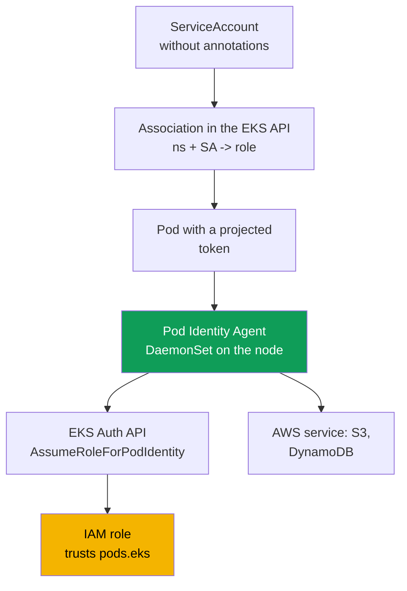
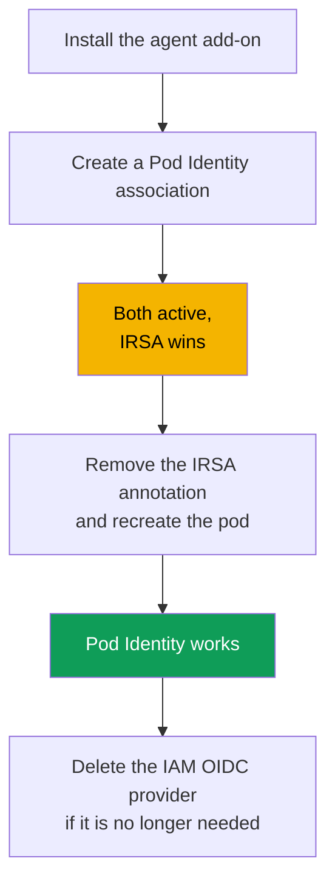

[Русская версия](ru.md) · [Versión en español](es.md) · [Version française](fr.md) · [Deutsche Version](de.md) · [ქართული ვერსია](ge.md) · [繁體中文版](tw.md) · [日本語版](jp.md)
# Chapter 17. EKS Pod Identity: agent, associations, migration from IRSA

> **What comes next.** Chapter 16 completed the "a role for each pod" task through IRSA: the
> cluster OIDC provider, a trust policy on `sub`, and a `ServiceAccount` annotation. Here is a
> different mechanism for the same task, EKS Pod Identity. It came later and removes IRSA's main
> pain point: binding the trust policy to a specific cluster's OIDC provider. We will cover the
> agent, associations, a direct comparison with IRSA, and migration. Related topics are in other
> chapters: people and CI access (chapter 5), secrets (chapter 18), IMDSv2 hardening (chapter 19),
> EKS add-ons (chapter 37), and Fargate (chapter 15).

## 17.1. "We copied the role to a neighboring cluster, and now must rewrite the trust policy"

IRSA works, and it works well. But it has a cost that is invisible on one cluster with a couple
of roles and grows into a problem across a fleet. Recall the IRSA role trust policy from chapter
16: its `Principal.Federated` is the IAM OIDC provider ARN of a **specific** cluster, and the
condition on `sub` is tied to the issuer URL of **that same** cluster. An IRSA role is permanently
bound to one cluster at the trust level.

Then the operational routine begins:

- **A role is not portable between clusters.** Copy the application and its role to a neighboring
  cluster, and the trust policy must be rewritten: a different provider ARN and a different issuer
  URL in `sub`.
- **Every role has its own trust policy.** One hundred applications mean one hundred trust
  policies, each referring to its cluster's OIDC provider. There is no shared reusable template.
- **Scaling to dozens of clusters is painful.** One application in twenty clusters produces twenty
  variants of the same role's trust policy, all of which must stay in sync. In addition, every
  cluster has its own IAM OIDC provider, and an account has a limit on their number.

You want to bind a role and `ServiceAccount` more simply: without an OIDC provider in every
cluster and without rewriting the trust policy when moving. That is exactly what EKS Pod Identity
does.

## 17.2. What EKS Pod Identity is

EKS Pod Identity solves the same problem differently from IRSA. Instead of OIDC federation, it
has three parts: an **agent on the node**, the **EKS API for associations**, and a **single trust
policy** for the role, on the common `pods.eks.amazonaws.com` service principal and not tied to a
specific cluster.

- **EKS Pod Identity Agent** is a pod agent running as a `DaemonSet` in the `kube-system`
  namespace on every Linux node. It is installed as an EKS managed add-on
  (`eks-pod-identity-agent`; add-on mechanics are in chapter 37). In EKS Auto Mode, the agent is
  built in.
- **Association** is a record in the EKS API that binds the tuple `cluster + namespace +
  ServiceAccount` to an IAM role. There are no `ServiceAccount` annotations or objects in the
  cluster: the association lives in EKS, not Kubernetes.
- The role's **trust policy** trusts `pods.eks.amazonaws.com`, rather than the cluster's OIDC
  provider. One policy works for any cluster, making the role easy to reuse.

There is no OIDC federation mechanism or `AssumeRoleWithWebIdentity` exchange (chapter 16) here
at all. The role gets credentials through a separate EKS Auth API, and the local agent distributes
them to pods.

## 17.3. How it works step by step

Configuration is performed once; then credentials are issued automatically on every pod start.



Step by step:

1. The `eks-pod-identity-agent` add-on is installed on the cluster; the agent starts as a
   `DaemonSet` on all nodes (section 17.5). The node IAM role must allow
   `eks-auth:AssumeRoleForPodIdentity`. This is already included in the managed
   `AmazonEKSWorkerNodePolicy` policy (chapter 10).
2. An IAM role with a trust policy for `pods.eks.amazonaws.com` is created (section 17.4).
3. An association is created through the EKS API: `cluster + namespace + ServiceAccount -> role
   ARN`.
4. When a pod whose `ServiceAccount` has an association starts, EKS adds a projected volume with a
   token (audience `pods.eks.amazonaws.com`) and the environment variables
   `AWS_CONTAINER_CREDENTIALS_FULL_URI` and `AWS_CONTAINER_AUTHORIZATION_TOKEN_FILE` to its
   containers.
5. The node agent calls `AssumeRoleForPodIdentity` in the EKS Auth API, obtains temporary role
   credentials, and distributes them through a local endpoint (link-local address
   `169.254.170.23`). The AWS SDK in the container gets credentials from the container credential
   provider in the standard chain, with no code required.

The **EKS Auth service assumes the role once per node**, rather than every SDK in every pod, so
STS load is lower than with IRSA, where the SDK in each pod performs the token exchange.

An important connection to NetworkPolicy: the SDK goes to the link-local `169.254.170.23` for
credentials. A pod with `default-deny` egress will not receive them until the policy has an egress
rule to `169.254.170.23/32` (port `80`). Chapter 30 shows how to allow exactly that address
without opening egress entirely.

## 17.4. Trust policy for Pod Identity

The entire point of portability is in the trust policy. It is **shared** and independent of the
cluster.

```json
{
  "Version": "2012-10-17",
  "Statement": [
    {
      "Sid": "AllowEksAuthToAssumeRoleForPodIdentity",
      "Effect": "Allow",
      "Principal": {
        "Service": "pods.eks.amazonaws.com"
      },
      "Action": [
        "sts:AssumeRole",
        "sts:TagSession"
      ]
    }
  ]
}
```

- **`Principal.Service`** is `pods.eks.amazonaws.com`, the common EKS Pod Identity service
  principal. It is the same for all clusters and accounts, so no OIDC provider ARN is needed here.
- **`sts:AssumeRole`** lets EKS Auth assume the role before issuing temporary credentials to the
  pod.
- **`sts:TagSession`** allows **session tags** to be added to the STS request. Without it, an
  association with session tags enabled by default will not work; both actions are required.

Compare this with chapter 16.5: there, `Principal.Federated` is the OIDC provider ARN of a
specific cluster, the action is `sts:AssumeRoleWithWebIdentity`, and the condition on `sub`
contains the cluster issuer URL. Here there is nothing cluster-specific: one role with this trust
policy can be bound through associations in any number of clusters without touching the trust
policy. This removes the pain described in 17.1.

You can restrict which namespaces, `ServiceAccount` objects, and clusters may assume the role with
**conditions on session tags** in the trust policy. EKS itself sets session tags for the cluster,
namespace, and `ServiceAccount`, and `StringEquals` is applied to them. In policies, these tags
are available as `aws:PrincipalTag/kubernetes-namespace`,
`aws:PrincipalTag/eks-cluster-name`, and `aws:PrincipalTag/kubernetes-service-account`; for
example, the `aws:PrincipalTag/kubernetes-namespace` condition can equal `payments`.

## 17.5. The agent add-on and associations

First comes the add-on, an ordinary EKS managed add-on (chapter 37).

```bash
# install the agent as an add-on (once per cluster; not needed in Auto Mode)
aws eks create-addon --cluster-name demo --addon-name eks-pod-identity-agent

# has the agent started as a DaemonSet in kube-system?
kubectl get ds -n kube-system eks-pod-identity-agent
```

Next is the association. It is created in EKS with **one command**, without `ServiceAccount`
annotations or objects in the cluster. The `ServiceAccount` itself must exist and be used by a
pod.

```bash
# bind a namespace + SA to a role
aws eks create-pod-identity-association \
  --cluster-name demo --namespace payments \
  --service-account s3-reader \
  --role-arn arn:aws:iam::111122223333:role/payments-s3-reader

# associations present on the cluster
aws eks list-pod-identity-associations --cluster-name demo

# details of one association by its id
aws eks describe-pod-identity-association \
  --cluster-name demo --association-id a-abcdefghijklmnop1
```

Key properties of associations:

- **One role, many associations.** The same role can be bound to different `ServiceAccount`
  objects in different namespaces and clusters: the trust policy does not change, only the
  association records do. One SA has one role in the cluster account; to change the role, update
  the association.
- **Session tags and ABAC.** EKS adds session tags (cluster, namespace, SA) for ABAC; they can be
  disabled. Associations are eventually consistent, so do not create them on a critical startup
  path.

## 17.6. IRSA versus Pod Identity in concrete terms

Both models provide "a role for each pod." The difference is how the role is bound to the
`ServiceAccount` and what that costs to operate. Let us expand on the comparison from chapter
16.9.

| Property | IRSA | EKS Pod Identity |
|---|---|---|
| Mechanism | OIDC federation, exchange through STS | node agent and EKS Auth API |
| Role trust policy | `Federated` to the cluster OIDC provider | `Service` `pods.eks.amazonaws.com`, shared |
| Trust policy actions | `sts:AssumeRoleWithWebIdentity` | `sts:AssumeRole` + `sts:TagSession` |
| Per-cluster setup | IAM OIDC provider per cluster | `eks-pod-identity-agent` add-on |
| SA binding | `eks.amazonaws.com/role-arn` annotation | association in the EKS API, no annotations |
| Role portability | rewrite the trust policy for each cluster | one trust policy for all clusters |
| Cross-account | directly through OIDC federation | through delegation (assume a role in the target) |
| Outside EKS (EC2, ECS, Lambda) | works through OIDC | no, EKS Linux nodes only |
| Session tags and ABAC | manually | built in, tags are set automatically |
| Maturity | long-established, widely used | newer (since late 2023), default for new workloads |

In short: IRSA is more flexible at boundaries (cross-account through OIDC, federation outside
EKS), but more verbose and poorly portable. Pod Identity is easier to bind and reuse, but tied to
EKS and Linux.

## 17.7. When to choose which

For new clusters on EC2 nodes, Pod Identity is a sensible default: setup is simpler (an add-on
instead of an OIDC provider per cluster), the role is portable, and session tags and ABAC are
available immediately. However, it has limitations that must be checked against the
documentation.

| Scenario | Choose | Why |
|---|---|---|
| New cluster on EC2 nodes | Pod Identity | simpler setup, portability, built-in ABAC |
| Cross-account through OIDC federation | IRSA | Pod Identity requires delegation through assume role |
| Workload on Fargate | IRSA | Pod Identity is not supported on Fargate |
| Windows nodes | IRSA | Pod Identity is Linux Amazon EC2 only |
| Identity outside EKS | IRSA | Pod Identity is tied to EKS nodes |
| Older platform version | verify | Pod Identity requires a minimum platform version |

Pod Identity limitations confirmed at the time of writing: **Linux Amazon EC2 nodes only**;
**Fargate is not supported** (neither Linux nor Windows pods); Windows nodes are unsupported; it
is unavailable on Outposts and EKS Anywhere; and the cluster must be at or above the minimum
platform version (for older minor versions, that is `eks.4`). Check the documentation because the
list becomes shorter over time.

## 17.8. Migrating from IRSA to Pod Identity

Migration is safe and supports a transition period where the same `ServiceAccount` has **both**
an IRSA annotation **and** a Pod Identity association. Credential precedence decides everything.



Who wins when both are configured. IRSA provides credentials through the **web identity token
provider**, and Pod Identity uses the **container credential provider**. In the standard AWS SDK
chain, web identity comes **before** the container provider. Therefore, if one
`ServiceAccount` has both an IRSA annotation and a Pod Identity association, **IRSA wins** and the
association is ignored: credentials earlier in the chain are used even after the association is
created. This is convenient for migration: create the association in advance, then switch by
removing IRSA.

Migration order:

1. Install the `eks-pod-identity-agent` add-on and ensure its `DaemonSet` is running.
2. Update the role trust policy for `pods.eks.amazonaws.com` (or create separate roles for Pod
   Identity). The role permissions policy remains unchanged.
3. Create an association for the same `namespace + ServiceAccount`. While the IRSA annotation is
   present, the pod continues to use IRSA, so nothing breaks.
4. Remove the `eks.amazonaws.com/role-arn` annotation from the `ServiceAccount` and **recreate
   the pod**. Web identity is now absent from the chain, and the SDK uses Pod Identity
   credentials.
5. Verify `aws sts get-caller-identity` from the pod, then remove what is no longer needed: the
   OIDC trust policy and, if no IRSA roles remain, the IAM OIDC identity provider as well.

## 17.9. Diagnostics

The sequence is the same as in chapter 16.7: from infrastructure to the pod and outward.

```bash
# 1. is the agent running on every node?
kubectl get ds -n kube-system eks-pod-identity-agent

# 2. does an association exist for the required namespace and SA?
aws eks list-pod-identity-associations --cluster-name demo --namespace payments

# 3. which AWS identity does the pod see: the required role's assumed-role, not the node role?
kubectl -n payments exec deploy/my-app -- aws sts get-caller-identity
```

The key check is `get-caller-identity` from the pod. If `Arn` shows the `assumed-role` of your
role, Pod Identity worked and any remaining problem is in the role permissions policy. If it shows
the node role, credentials did not reach the pod, and the cause is higher in the table.

| Symptom | Likely cause | What to check |
|---|---|---|
| SDK uses the node role | agent is not running or association is absent | agent `DaemonSet`, `list-pod-identity-associations` |
| Pod is created but has no credentials | association was created after the pod started | recreate the pod (eventual consistency) |
| Uses the IRSA role | the IRSA annotation remains on the SA | remove the annotation, recreate the pod |
| `AccessDenied` on a service call | the role lacks the required permissions policy | role permissions policy |
| Timeout while obtaining credentials | `default-deny` egress blocks `169.254.170.23` | egress to `169.254.170.23/32` in NetworkPolicy (chapter 30) |
| Role is unavailable for association | no trust policy for `pods.eks` | role trust policy (section 17.4) |
| Agent does not start | IPv6 is disabled on the node | agent IPv6 configuration |

A common pitfall is forgetting `sts:TagSession` in the trust policy: an association with session
tags enabled by default will not work until the trust policy has both actions.

## 17.10. How this is used in production

- **For new EC2 clusters, use Pod Identity by default** for role portability and simple setup.
  Keep IRSA for cross-account use, Fargate, Windows, and outside-EKS scenarios.
- **Install the agent as an add-on through IaC** along with the cluster, rather than manually
  afterward. In EKS Auto Mode the agent is built in, so a separate add-on is unnecessary.
- **Reuse a Pod Identity role across clusters** through associations: there is one trust policy
  and many `namespace + SA -> role` bindings, eliminating the duplication from section 17.1.
- **Restrict the role through ABAC on session tags** (cluster, namespace, SA) in trust or
  permissions policy conditions, instead of the exact `sub` used in IRSA.
- **Migrate with no downtime**: create the association in advance while IRSA still wins in the
  chain, then switch only by removing the annotation and recreating the pod. The node IAM role
  must allow `eks-auth:AssumeRoleForPodIdentity`; it is already in
  `AmazonEKSWorkerNodePolicy`.

## 17.11. Mini-glossary

- **EKS Pod Identity** is a mechanism for issuing an IAM role to a pod through a node agent and
  the EKS API, without the cluster OIDC provider and without a trust policy bound to a specific
  cluster.
- **EKS Pod Identity Agent** is the `eks-pod-identity-agent` add-on, running as a `DaemonSet` on
  nodes and distributing temporary credentials to pods through a local endpoint.
- **Association** is an EKS API record binding `cluster + namespace + ServiceAccount` to an IAM
  role; it is created with `aws eks create-pod-identity-association`.
- **`pods.eks.amazonaws.com`** is the service principal in a Pod Identity role trust policy;
  common to all clusters and accounts. The EKS Auth API issues role credentials through
  `AssumeRoleForPodIdentity`.
- **Session tags** are session tags (cluster, namespace, SA) that Pod Identity adds to the STS
  request and on which ABAC is built. In policies they are
  `aws:PrincipalTag/kubernetes-namespace` and `aws:PrincipalTag/eks-cluster-name`; they require
  `sts:TagSession` in the trust policy.

## 17.12. Chapter summary

- IRSA's pain point is not the mechanism itself but its operation: the role trust policy is bound
  to the cluster OIDC provider, the role is not portable, and synchronizing this across a fleet of
  clusters is difficult.
- EKS Pod Identity provides "a role for each pod" differently: a `DaemonSet` agent on the node,
  an association in the EKS API, and one trust policy for `pods.eks.amazonaws.com` that is not
  tied to a cluster.
- A Pod Identity role trust policy trusts `pods.eks.amazonaws.com` with the actions
  `sts:AssumeRole` and `sts:TagSession`; there is no OIDC provider or condition on `sub`.
- An association binds `cluster + namespace + ServiceAccount` to a role through one
  `aws eks create-pod-identity-association` command. No SA annotations or objects in the cluster
  are needed. One role is reused in many associations and clusters without modifying the trust
  policy.
- Pod Identity limitations: Linux EC2 nodes only, no Fargate or Windows. Check the
  documentation.
- When IRSA and Pod Identity are both configured on one SA, IRSA wins: web identity comes before
  the container credential provider in the SDK chain. This makes migration safe: agent add-on,
  trust policy for `pods.eks`, association, then remove the IRSA annotation and restart.
- Diagnostics proceed from the agent to the association and pod: the `DaemonSet` is running, the
  association exists, and `aws sts get-caller-identity` from the pod shows the role's assumed-role
  rather than the node role.

## 17.13. How this helps in real work

Across a fleet of dozens of clusters, the question "one application, one role across all
clusters" is solved with Pod Identity through one role and a set of associations, rather than a
dozen copies of the trust policy. With a new cluster, you do not have to create an OIDC provider
or watch the provider limit: the agent add-on is enough. On call, reports that "the pod cannot see
its AWS permissions" are handled with the chain from section 17.9: agent, association, and
`get-caller-identity`. Knowing that IRSA wins under dual configuration saves hours spent on the
mystery of "I created the association, but the pod still uses the old role."

## 17.14. Self-check questions

1. What is IRSA's main pain point when scaling to a fleet of clusters, and where in the trust
   policy is the binding to a specific cluster encoded?
2. What three parts make up EKS Pod Identity, and what lives in Kubernetes versus the EKS API?
3. How does EKS Pod Identity Agent run on a node, and how is it installed on a cluster?
4. What is in the `Principal` of a Pod Identity role trust policy, and why is that policy
   portable?
5. Why does the trust policy need both `sts:AssumeRole` and `sts:TagSession` actions?
6. Which command creates an association, and which fields does it bind? Is an SA annotation
   required?
7. Can one role serve multiple `ServiceAccount` objects in different clusters? How?
8. Name three Pod Identity limitations that require choosing IRSA.
9. Who wins if one SA has both an IRSA annotation and a Pod Identity association, and why?
10. Describe the no-downtime migration order. Where exactly does the switch occur?
11. With one command from a pod, how can you determine whether Pod Identity worked and distinguish
    it from insufficient permissions?
12. A pod was created, the association exists, but it uses the node role. Name two likely causes.

## Practice

The course lab for this topic is [lab 104: Workload identity: IRSA and Pod Identity for an
application](../../labs/104/README.MD). Beyond that, everything can be verified on a live cluster.
Install the add-on with
`aws eks create-addon --cluster-name <cluster> --addon-name eks-pod-identity-agent` and verify
that `kubectl get ds -n kube-system eks-pod-identity-agent` shows a running `DaemonSet` on every
node. Create an IAM role with a trust policy for `pods.eks.amazonaws.com` (the
`sts:AssumeRole` and `sts:TagSession` actions) and a permissions policy for bucket reads only.

Create an association with `aws eks create-pod-identity-association` for a test namespace and
`ServiceAccount`, start a pod with that SA, and run `aws sts get-caller-identity` in it. Its `Arn`
must be your role's assumed-role, not the node role. Inspect
`aws eks list-pod-identity-associations` and `aws eks describe-pod-identity-association` using
its id. Separately, repeat the IRSA scenario from chapter 16 on the same SA: add the
`eks.amazonaws.com/role-arn` annotation, recreate the pod, and verify that it now uses the IRSA
role. This is precisely the precedence order in the chain. Then remove the annotation, recreate
the pod, and you will see control return to Pod Identity.

---
[Table of contents](../README.md) · [Chapter 16](../16/en.md) · [Chapter 18](../18/en.md)
