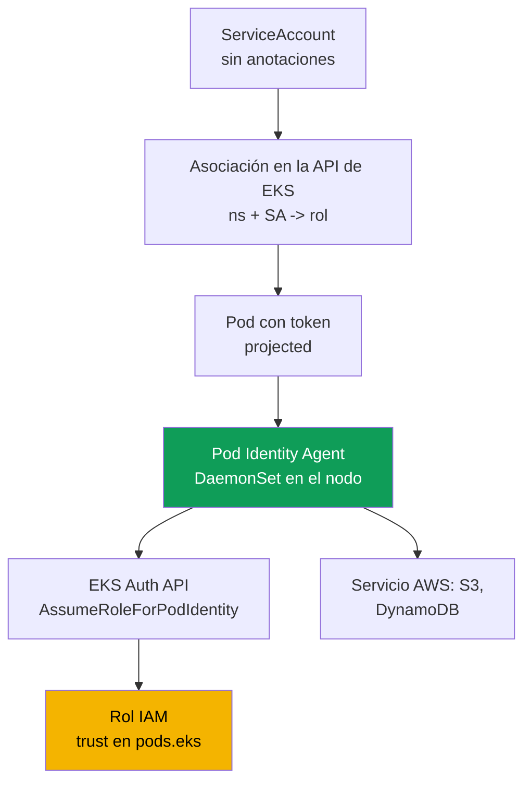
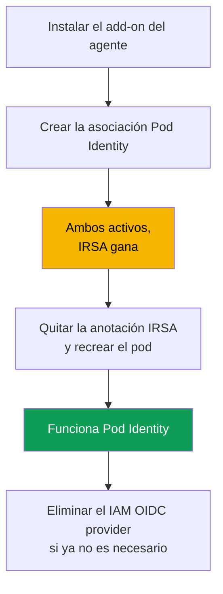

[Русская версия](ru.md) · [Eng version](en.md) · [Version française](fr.md) · [Deutsche Version](de.md) · [ქართული ვერსია](ge.md) · [繁體中文版](tw.md) · [日本語版](jp.md)
# Capítulo 17. EKS Pod Identity: agente, asociaciones y migración desde IRSA

> **Qué sigue.** El capítulo 16 resolvió la tarea de «un rol propio para el pod» mediante IRSA: el proveedor OIDC del clúster, una trust policy sobre `sub` y la anotación de `ServiceAccount`. Aquí veremos otro mecanismo para la misma tarea, EKS Pod Identity. Apareció más tarde y elimina el principal problema de IRSA: vincular la trust policy al proveedor OIDC de un clúster concreto. Veremos el agente, las asociaciones, una comparación directa con IRSA y la migración. Temas relacionados en otros capítulos: acceso de personas y CI (capítulo 5), secretos (capítulo 18), hardening de IMDSv2 (capítulo 19), add-ons de EKS (capítulo 37), Fargate (capítulo 15).

## 17.1. «Copiamos el rol al clúster vecino y hay que reescribir la trust policy»

IRSA funciona, y funciona bien. Pero tiene un coste que no se aprecia en un solo clúster con un par de roles y que se convierte en un problema en una flota. Recordemos la trust policy de un rol IRSA del capítulo 16: `Principal.Federated` contiene el ARN del proveedor IAM OIDC de un clúster **concreto**, y la condición sobre `sub` está ligada a la issuer URL de **ese mismo** clúster. El rol IRSA queda irrevocablemente vinculado a un único clúster ya a nivel de confianza.

Entonces empieza la rutina de mantenimiento:

- **El rol no se transfiere entre clústeres.** Se copia la aplicación y su rol a un clúster vecino, y hay que reescribir la trust policy: otro ARN del proveedor y otra issuer URL en `sub`.
- **Cada rol tiene su propia trust policy.** Cien aplicaciones significan cien políticas de confianza, y cada una referencia el proveedor OIDC de su clúster. No existe una plantilla común reutilizable.
- **La escala de decenas de clústeres es un infierno.** Una aplicación en veinte clústeres genera veinte variantes de la trust policy para un rol conceptualmente idéntico, y todas deben mantenerse sincronizadas. Además, cada clúster tiene su propio proveedor IAM OIDC y la cuenta tiene un límite para su cantidad.

Se quiere vincular un rol y un `ServiceAccount` de forma más sencilla: sin un proveedor OIDC en cada clúster y sin reescribir la trust policy al migrar. Eso es exactamente lo que hace EKS Pod Identity.

## 17.2. Qué es EKS Pod Identity

EKS Pod Identity resuelve la misma tarea de forma distinta a IRSA. En vez de la federación OIDC, incluye tres partes: **un agente en el nodo**, **la API de EKS para asociaciones** y una **trust policy única** del rol para el principal común del servicio `pods.eks.amazonaws.com`, no vinculada a un clúster concreto.

- **EKS Pod Identity Agent** es un pod-agente que se ejecuta como `DaemonSet` en el namespace `kube-system` de cada nodo Linux. Se instala como add-on administrado de EKS (`eks-pod-identity-agent`, el mecanismo de add-ons se trata en el capítulo 37). En EKS Auto Mode, el agente está integrado.
- Una **asociación (association)** es un registro en la API de EKS que vincula la terna `clúster + namespace + ServiceAccount` con un rol IAM. No hay anotaciones en `ServiceAccount` ni objetos en el clúster: la asociación vive en EKS, no en Kubernetes.
- La **trust policy del rol** confía en el servicio `pods.eks.amazonaws.com`, no en el proveedor OIDC del clúster. Una política sirve para cualquier clúster, por lo que el rol se reutiliza fácilmente.

Aquí no existe en absoluto el mecanismo de federación OIDC ni el intercambio `AssumeRoleWithWebIdentity` (capítulo 16). Las credenciales del rol se obtienen mediante una API de autenticación de EKS independiente y el agente local las distribuye a los pods.

## 17.3. Cómo funciona paso a paso

La configuración se realiza una sola vez; después, las credenciales se entregan automáticamente en cada inicio de pod.



Paso a paso:

1. Se instala en el clúster el add-on `eks-pod-identity-agent`, y el agente se levanta como `DaemonSet` en todos los nodos (sección 17.5). El node IAM role debe permitir `eks-auth:AssumeRoleForPodIdentity`; esto ya está incluido en la política administrada `AmazonEKSWorkerNodePolicy` (capítulo 10).
2. Se crea un rol IAM con una trust policy para `pods.eks.amazonaws.com` (sección 17.4).
3. Mediante la API de EKS se crea una asociación: `clúster + namespace + ServiceAccount -> ARN del rol`.
4. Al iniciar un pod cuyo `ServiceAccount` tiene una asociación, EKS añade a los contenedores un volumen projected con un token (audience `pods.eks.amazonaws.com`) y las variables `AWS_CONTAINER_CREDENTIALS_FULL_URI` y `AWS_CONTAINER_AUTHORIZATION_TOKEN_FILE`.
5. El agente en el nodo llama a `AssumeRoleForPodIdentity` en EKS Auth API, obtiene las credenciales temporales del rol y las distribuye mediante un endpoint local (dirección link-local `169.254.170.23`). El AWS SDK del contenedor obtiene las credenciales del container credential provider en la cadena estándar, sin código.

El rol lo asume el **servicio EKS Auth una vez por nodo**, no cada SDK de cada pod; por ello, la carga en STS es menor que con IRSA, donde el SDK de cada pod intercambia el token.

Vínculo importante con NetworkPolicy: el SDK accede a las credenciales mediante la dirección link-local `169.254.170.23`. Un pod con egress `default-deny` no las obtendrá hasta que la política incluya una regla de egress hacia `169.254.170.23/32` (puerto `80`). Cómo abrir precisamente esa dirección sin abrir todo el egress se explica en el capítulo 30.

## 17.4. Trust policy para Pod Identity

Toda la portabilidad reside en la trust policy. Es **única** y no depende del clúster.

```json
{
  "Version": "2012-10-17",
  "Statement": [
    {
      "Sid": "AllowEksAuthToAssumeRoleForPodIdentity",
      "Effect": "Allow",
      "Principal": {
        "Service": "pods.eks.amazonaws.com"
      },
      "Action": [
        "sts:AssumeRole",
        "sts:TagSession"
      ]
    }
  ]
}
```

- **`Principal.Service`** es `pods.eks.amazonaws.com`, el principal común del servicio EKS Pod Identity. Es único para todos los clústeres y cuentas, por lo que aquí no hace falta el ARN de un proveedor OIDC.
- **`sts:AssumeRole`** permite a EKS Auth asumir el rol antes de entregar las credenciales temporales al pod.
- **`sts:TagSession`** permite añadir **session tags** a la solicitud de STS. Sin él, no funcionará una asociación con las etiquetas de sesión activadas por defecto; se necesitan ambas acciones.

Compárelo con el capítulo 16.5: allí `Principal.Federated` es el ARN del proveedor OIDC de un clúster concreto, la acción es `sts:AssumeRoleWithWebIdentity` y la condición sobre `sub` contiene la issuer URL del clúster. Aquí no hay nada específico del clúster: un único rol con esta trust policy se puede vincular mediante asociaciones en cualquier número de clústeres sin tocar la política de confianza. Esto elimina el problema de 17.1.

Se puede limitar qué namespaces, `ServiceAccount` y clústeres pueden asumir el rol con **condiciones sobre session tags** en la trust policy: EKS establece por sí mismo etiquetas de sesión con el clúster, namespace y `ServiceAccount`, y sobre ellas se aplica `StringEquals`. En las políticas, estas etiquetas están disponibles como `aws:PrincipalTag/kubernetes-namespace`, `aws:PrincipalTag/eks-cluster-name` y `aws:PrincipalTag/kubernetes-service-account`; por ejemplo, una condición donde `aws:PrincipalTag/kubernetes-namespace` sea igual a `payments`.

## 17.5. Add-on del agente y asociaciones

Primero está el add-on, un add-on administrado normal de EKS (capítulo 37).

```bash
# instalar el agente como add-on (una vez por clúster; no es necesario en Auto Mode)
aws eks create-addon --cluster-name demo --addon-name eks-pod-identity-agent

# ¿el agente se levantó como DaemonSet en kube-system?
kubectl get ds -n kube-system eks-pod-identity-agent
```

Después, la asociación. Se crea en EKS **con un solo comando**, sin anotaciones en `ServiceAccount` ni objetos en el clúster. El propio `ServiceAccount` debe existir y ser utilizado por un pod.

```bash
# vincular namespace + SA con el rol
aws eks create-pod-identity-association \
  --cluster-name demo --namespace payments \
  --service-account s3-reader \
  --role-arn arn:aws:iam::111122223333:role/payments-s3-reader

# qué asociaciones existen en el clúster
aws eks list-pod-identity-associations --cluster-name demo

# detalles de una asociación mediante su id
aws eks describe-pod-identity-association \
  --cluster-name demo --association-id a-abcdefghijklmnop1
```

Propiedades clave de las asociaciones:

- **Un rol, muchas asociaciones.** El mismo rol se vincula con distintos `ServiceAccount` en diferentes namespaces y clústeres: la trust policy no cambia, solo cambian los registros de asociación. Un SA tiene un rol en la cuenta del clúster; para cambiarlo, se modifica la asociación.
- **Session tags y ABAC.** EKS añade etiquetas de sesión (clúster, namespace, SA) para ABAC; se pueden desactivar. Las asociaciones son eventual consistent, por lo que no se crean en la ruta crítica de inicio.

## 17.6. IRSA frente a Pod Identity en concreto

Ambos modelos proporcionan «un rol propio para el pod». La diferencia es cómo se vincula el rol con `ServiceAccount` y el coste de mantenerlo. Profundicemos en la comparación del capítulo 16.9.

| Propiedad | IRSA | EKS Pod Identity |
|---|---|---|
| Mecanismo | federación OIDC, intercambio mediante STS | agente en el nodo y EKS Auth API |
| Trust policy del rol | `Federated` sobre el proveedor OIDC del clúster | `Service` `pods.eks.amazonaws.com`, común |
| Acciones en la trust policy | `sts:AssumeRoleWithWebIdentity` | `sts:AssumeRole` + `sts:TagSession` |
| Configuración por clúster | proveedor IAM OIDC por clúster | add-on del agente `eks-pod-identity-agent` |
| Vínculo con SA | anotación `eks.amazonaws.com/role-arn` | asociación en la API de EKS, sin anotaciones |
| Portabilidad del rol | hay que reescribir la trust policy para cada uno | una trust policy para todos los clústeres |
| Entre cuentas | directamente mediante federación OIDC | mediante delegación (assume role en el destino) |
| Fuera de EKS (EC2, ECS, Lambda) | funciona mediante OIDC | no, solo nodos Linux de EKS |
| Session tags y ABAC | manualmente | de fábrica, las etiquetas se establecen solas |
| Madurez | antiguo, ampliamente extendido | más reciente (desde finales de 2023), predeterminado para lo nuevo |

En resumen: IRSA es más flexible en los límites (entre cuentas mediante OIDC, federación fuera de EKS), pero es más verboso y tiene poca portabilidad. Pod Identity es más sencillo de vincular y reutilizar, pero está ligado a EKS y Linux.

## 17.7. Cuándo elegir cada uno

Para clústeres nuevos en nodos EC2, Pod Identity es una opción predeterminada razonable: la configuración es más sencilla (un add-on en lugar de un proveedor OIDC por clúster), el rol es portable y session tags y ABAC están disponibles de inmediato. Pero el mecanismo tiene limitaciones que deben comprobarse en la documentación.

| Escenario | Qué elegir | Por qué |
|---|---|---|
| Clúster nuevo en nodos EC2 | Pod Identity | configuración más sencilla, portabilidad, ABAC de fábrica |
| Entre cuentas mediante federación OIDC | IRSA | Pod Identity exige delegación mediante assume role |
| Carga de trabajo en Fargate | IRSA | Pod Identity no es compatible con Fargate |
| Nodos Windows | IRSA | Pod Identity solo es para Amazon EC2 Linux |
| Identidad fuera de EKS | IRSA | Pod Identity está vinculado a los nodos EKS |
| Versión de plataforma antigua | comprobar | Pod Identity requiere una platform version mínima |

Las limitaciones de Pod Identity comprobadas al momento de escribir son: únicamente **nodos Amazon EC2 Linux**; **Fargate no es compatible** (ni pods Linux ni Windows); los nodos Windows no son compatibles; no está disponible en Outposts ni EKS Anywhere; el clúster debe tener al menos la platform version mínima (para versiones menores antiguas, es `eks.4`). Compruebe la lista en la documentación: se reduce con el tiempo.

## 17.8. Migración desde IRSA a Pod Identity

La migración es segura y permite un periodo de transición donde un mismo `ServiceAccount` tiene **tanto** la anotación IRSA **como** la asociación Pod Identity. El orden de preferencia de credenciales lo decide todo.



Quién gana con la configuración simultánea. IRSA entrega credenciales mediante el **web identity token provider**, y Pod Identity mediante el **container credential provider**; en la cadena estándar de AWS SDK, web identity está **antes** que el proveedor de contenedor. Por ello, si un mismo `ServiceAccount` tiene tanto la anotación IRSA como la asociación Pod Identity, **gana IRSA** y se ignora la asociación: se usan las credenciales que aparecen antes en la cadena incluso después de crear la asociación. Esto es útil para la migración: la asociación se crea por adelantado y el cambio se produce al eliminar IRSA.

Orden de migración:

1. Instalar el add-on `eks-pod-identity-agent` y confirmar que el `DaemonSet` se esté ejecutando.
2. Actualizar la trust policy del rol para `pods.eks.amazonaws.com` (o crear roles separados para Pod Identity). La permissions policy del rol permanece igual.
3. Crear una asociación para el mismo `namespace + ServiceAccount`. Mientras siga existiendo la anotación IRSA, el pod continúa usando IRSA; nada se ha roto.
4. Retirar del `ServiceAccount` la anotación `eks.amazonaws.com/role-arn` y **recrear el pod**: ahora no hay web identity en la cadena y el SDK toma las credenciales de Pod Identity.
5. Comprobar `aws sts get-caller-identity` desde el pod y después retirar lo innecesario: la trust policy sobre OIDC y, si no quedan roles IRSA, también el IAM OIDC identity provider.

## 17.9. Diagnóstico

El orden es el mismo que en el capítulo 16.7: desde la infraestructura hasta el pod y el exterior.

```bash
# 1. ¿el agente se ejecuta en todos los nodos?
kubectl get ds -n kube-system eks-pod-identity-agent

# 2. ¿existe una asociación para el namespace y SA requeridos?
aws eks list-pod-identity-associations --cluster-name demo --namespace payments

# 3. qué identidad ve el pod en AWS: assumed-role del rol requerido, no el rol del nodo
kubectl -n payments exec deploy/my-app -- aws sts get-caller-identity
```

La comprobación clave es `get-caller-identity` desde el pod: si `Arn` muestra `assumed-role` de su rol, Pod Identity funcionó y el problema, si lo hay, está en la permissions policy del rol; si muestra el rol del nodo, las credenciales no llegaron al pod y la causa está más arriba en la tabla.

| Síntoma | Causa probable | Qué comprobar |
|---|---|---|
| El SDK usa el rol del nodo | el agente no se ejecuta o no existe asociación | `DaemonSet` del agente, `list-pod-identity-associations` |
| El pod fue creado, pero no tiene credenciales | la asociación se creó después del inicio del pod | recrear el pod (eventual consistency) |
| Usa el rol IRSA | la anotación IRSA sigue en el SA | retirar la anotación, recrear el pod |
| `AccessDenied` al llamar al servicio | el rol no tiene la permissions policy necesaria | permissions policy del rol |
| Timeout al obtener credenciales | egress `default-deny` bloquea `169.254.170.23` | egress hacia `169.254.170.23/32` en NetworkPolicy (capítulo 30) |
| El rol no aparece para la asociación | falta una trust policy sobre `pods.eks` | trust policy del rol (sección 17.4) |
| El agente no inicia | IPv6 está desactivado en el nodo | configuración IPv6 del agente |

Un error frecuente es olvidar `sts:TagSession` en la trust policy: una asociación con session tags activadas por defecto no funcionará hasta que la política de confianza incluya ambas acciones.

## 17.10. Cómo se aplica en producción

- **Para clústeres nuevos en EC2 se adopta Pod Identity por defecto**, por la portabilidad del rol y la configuración sencilla. IRSA queda para entre cuentas, Fargate, Windows y escenarios fuera de EKS.
- **El agente se instala como add-on mediante IaC** junto con el clúster, no manualmente después. En EKS Auto Mode el agente está integrado y no se necesita un add-on independiente.
- **Un rol de Pod Identity se reutiliza entre clústeres** mediante asociaciones: hay una trust policy y muchas vinculaciones `namespace + SA -> rol`, lo que elimina la duplicación de la sección 17.1.
- **El rol se restringe mediante ABAC sobre session tags** (clúster, namespace, SA) en condiciones de trust o permissions policy, en lugar del `sub` exacto que se usaba con IRSA.
- **Se migra sin tiempo de inactividad**: se crea la asociación por adelantado mientras IRSA aún gana en la cadena, y se cambia únicamente retirando la anotación y recreando el pod. El node IAM role debe permitir `eks-auth:AssumeRoleForPodIdentity`, que ya está incluido en `AmazonEKSWorkerNodePolicy`.

## 17.11. Mini glosario

- **EKS Pod Identity**: mecanismo para entregar un rol IAM a un pod mediante un agente en el nodo y la API de EKS, sin proveedor OIDC del clúster ni trust policy vinculada a un clúster concreto.
- **EKS Pod Identity Agent**: add-on `eks-pod-identity-agent` que se ejecuta como `DaemonSet` en los nodos y entrega a los pods credenciales temporales mediante un endpoint local.
- **Asociación (association)**: registro en la API de EKS que vincula `clúster + namespace + ServiceAccount` con un rol IAM; se crea con `aws eks create-pod-identity-association`.
- **`pods.eks.amazonaws.com`**: principal de servicio de la trust policy de un rol Pod Identity, común para todos los clústeres y cuentas. EKS Auth API entrega las credenciales del rol mediante `AssumeRoleForPodIdentity`.
- **Session tags**: etiquetas de sesión (clúster, namespace, SA) que Pod Identity añade a la solicitud de STS y sobre las que se construye ABAC; en las políticas son `aws:PrincipalTag/kubernetes-namespace` y `aws:PrincipalTag/eks-cluster-name`; requieren `sts:TagSession` en la trust policy.

## 17.12. Resumen del capítulo

- El problema de IRSA no está en el mecanismo, sino en el mantenimiento: la trust policy del rol está vinculada al proveedor OIDC del clúster, el rol no es portable y, en una flota de clústeres, la sincronización se vuelve un infierno.
- EKS Pod Identity proporciona «un rol propio para el pod» de otra forma: un agente `DaemonSet` en el nodo, una asociación en la API de EKS y una trust policy única para `pods.eks.amazonaws.com`, no ligada al clúster.
- La trust policy de un rol Pod Identity confía en `pods.eks.amazonaws.com` con las acciones `sts:AssumeRole` y `sts:TagSession`; aquí no hay proveedor OIDC ni condición sobre `sub`.
- Una asociación vincula `clúster + namespace + ServiceAccount` con un rol mediante un único comando `aws eks create-pod-identity-association`; no se necesitan anotaciones en el SA ni objetos en el clúster. Un rol se reutiliza en muchas asociaciones y clústeres sin modificar la trust policy.
- Limitaciones de Pod Identity: solo nodos EC2 Linux, sin Fargate ni Windows; compruebe la documentación.
- Con IRSA y Pod Identity configurados simultáneamente en el mismo SA, gana IRSA: web identity está antes que container credential provider en la cadena del SDK. Esto hace segura la migración: add-on del agente, trust policy sobre `pods.eks`, asociación y, después, retirar la anotación IRSA y reiniciar.
- El diagnóstico avanza del agente a la asociación y el pod: el `DaemonSet` se está ejecutando, existe la asociación y `aws sts get-caller-identity` desde el pod muestra el assumed-role del rol, no el rol del nodo.

## 17.13. Cómo será útil en el trabajo real

En una flota de decenas de clústeres, la cuestión «una aplicación, un rol en todos los clústeres» se resuelve con Pod Identity mediante un rol y un conjunto de asociaciones, no con una decena de copias de la trust policy. En un clúster nuevo no hace falta configurar un proveedor OIDC ni vigilar el límite de proveedores: basta con el add-on del agente. Durante una guardia, las incidencias de «el pod no ve sus permisos en AWS» se resuelven mediante la cadena de la sección 17.9: agente, asociación, `get-caller-identity`. Y saber que, en una configuración doble, gana IRSA ahorra horas ante el enigma «creé la asociación, pero el pod usa el rol anterior».

## 17.14. Preguntas de autoevaluación

1. ¿Cuál es el principal problema de IRSA al escalar a una flota de clústeres y dónde se codifica la vinculación con un clúster concreto en la trust policy?
2. ¿De qué tres partes consta EKS Pod Identity y qué vive en Kubernetes frente a la API de EKS?
3. ¿Cómo se implementa EKS Pod Identity Agent en el nodo y cómo se instala en el clúster?
4. ¿Qué aparece en el `Principal` de la trust policy de un rol Pod Identity y por qué esta política es portable?
5. ¿Por qué se necesitan dos acciones, `sts:AssumeRole` y `sts:TagSession`, en la trust policy?
6. ¿Qué comando crea una asociación y qué campos vincula? ¿Se necesita una anotación en el SA?
7. ¿Puede un rol servir a varios `ServiceAccount` en distintos clústeres? ¿Gracias a qué?
8. Mencione tres limitaciones de Pod Identity por las que habría que elegir IRSA.
9. ¿Quién gana si un mismo SA tiene una anotación IRSA y una asociación Pod Identity, y por qué?
10. Describa el orden de una migración sin tiempo de inactividad. ¿Dónde ocurre exactamente el cambio?
11. ¿Cómo saber con un solo comando desde el pod si funcionó Pod Identity y distinguirlo de falta de permisos?
12. El pod fue creado, la asociación existe, pero usa el rol del nodo. Mencione dos causas probables.

## Práctica

El laboratorio del curso para este tema es el [laboratorio 104: Workload identity: IRSA y Pod Identity para una aplicación](../../labs/104/README_ES.MD). Además, todo se puede comprobar en un clúster activo. Instale el add-on con
`aws eks create-addon --cluster-name <cluster> --addon-name eks-pod-identity-agent` y confirme que `kubectl get ds -n kube-system eks-pod-identity-agent` muestra el `DaemonSet` ejecutándose en todos los nodos. Cree un rol IAM con una trust policy para `pods.eks.amazonaws.com` (acciones `sts:AssumeRole` y `sts:TagSession`) y una permissions policy solo para leer un bucket.

Cree una asociación mediante `aws eks create-pod-identity-association` para un namespace de prueba y un `ServiceAccount`, inicie un pod con ese SA y ejecute dentro `aws sts get-caller-identity`: el `Arn` debe ser el assumed-role de su rol, no el rol del nodo. Revise `aws eks list-pod-identity-associations` y `aws eks describe-pod-identity-association` con su id. Por separado, repita el escenario del capítulo 16 con IRSA en el mismo SA: añada la anotación `eks.amazonaws.com/role-arn`, recree el pod y confirme que ahora usa el rol IRSA; este es el orden de preferencia de la cadena. Después retire la anotación, recree el pod y verá cómo el control vuelve a Pod Identity.

---
[Índice](../README_ES.md) · [Capítulo 16](../16/es.md) · [Capítulo 18](../18/es.md)
