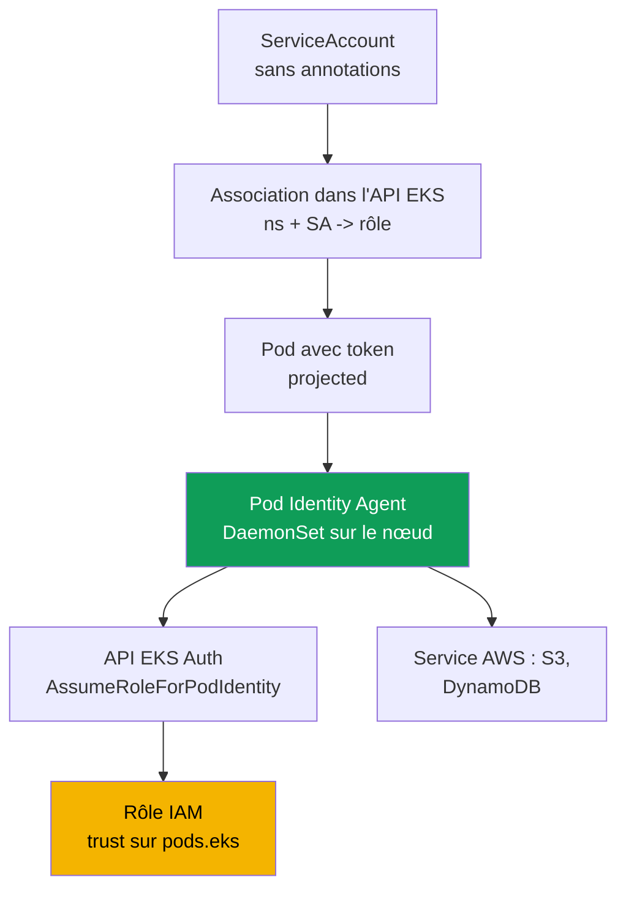
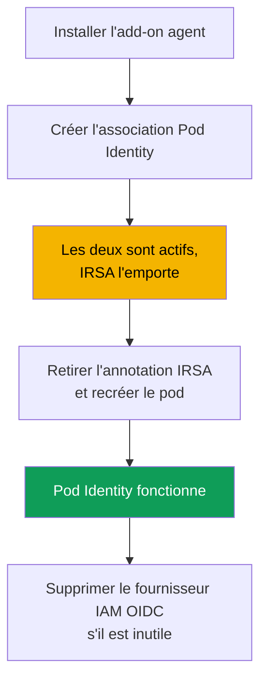

[Русская версия](ru.md) · [Eng version](en.md) · [Versión en español](es.md) · [Deutsche Version](de.md) · [ქართული ვერსია](ge.md) · [繁體中文版](tw.md) · [日本語版](jp.md)
# Chapitre 17. EKS Pod Identity : agent, associations, migration depuis IRSA

> **La suite.** Le chapitre 16 a traité la tâche « un rôle propre au pod » avec IRSA : le
> fournisseur OIDC du cluster, une trust policy sur `sub`, et l'annotation du `ServiceAccount`.
> Voici un autre mécanisme pour la même tâche, EKS Pod Identity. Apparu plus tard, il élimine le
> principal problème d'IRSA : lier la trust policy au fournisseur OIDC d'un cluster précis. Nous
> verrons l'agent, les associations, une comparaison directe avec IRSA et la migration. Les sujets
> connexes sont traités dans d'autres chapitres : accès des personnes et de la CI (chapitre 5),
> secrets (chapitre 18), durcissement d'IMDSv2 (chapitre 19), add-ons EKS (chapitre 37), Fargate
> (chapitre 15).

## 17.1. « Nous avons copié le rôle dans le cluster voisin, et il faut réécrire la trust policy »

IRSA fonctionne, et fonctionne bien. Mais il a un coût invisible sur un seul cluster avec quelques
rôles, qui devient un problème à l'échelle d'un parc. Rappelons la trust policy d'un rôle IRSA du
chapitre 16 : son `Principal.Federated` est l'ARN du fournisseur IAM OIDC d'un cluster
**précis**, et la condition sur `sub` est liée à l'URL d'issuer de ce **même** cluster. Un rôle
IRSA est irrévocablement lié à un cluster dès le niveau de la confiance.

La routine d'exploitation commence alors :

- **Un rôle n'est pas portable entre les clusters.** Copiez l'application et son rôle dans un
  cluster voisin, et il faut réécrire la trust policy : autre ARN de fournisseur, autre URL
  d'issuer dans `sub`.
- **Chaque rôle a sa propre trust policy.** Cent applications signifient cent politiques de
  confiance, chacune faisant référence au fournisseur OIDC de son cluster. Il n'existe pas de
  modèle commun réutilisable.
- **Le passage à des dizaines de clusters est pénible.** Une application dans vingt clusters
  produit vingt variantes de la trust policy d'un même rôle, qu'il faut toutes garder
  synchronisées. De plus, chaque cluster possède son fournisseur IAM OIDC, et un compte est limité
  dans leur nombre.

On veut lier plus simplement un rôle et un `ServiceAccount` : sans fournisseur OIDC dans chaque
cluster et sans réécrire la trust policy lors d'un déplacement. C'est exactement ce que fait EKS
Pod Identity.

## 17.2. Qu'est-ce qu'EKS Pod Identity ?

EKS Pod Identity résout la même tâche différemment d'IRSA. Au lieu de la fédération OIDC, il
comporte trois éléments : un **agent sur le nœud**, l'**API EKS pour les associations**, et une
**trust policy unique** du rôle sur le principal de service commun `pods.eks.amazonaws.com`, non
lié à un cluster précis.

- **EKS Pod Identity Agent** est un pod agent qui s'exécute comme `DaemonSet` dans le namespace
  `kube-system` sur chaque nœud Linux. Il est installé comme add-on managé EKS
  (`eks-pod-identity-agent`, mécanisme des add-ons au chapitre 37). Dans EKS Auto Mode, l'agent
  est intégré.
- Une **association (association)** est un enregistrement dans l'API EKS qui lie le triplet
  `cluster + namespace + ServiceAccount` à un rôle IAM. Ni annotations sur le `ServiceAccount`,
  ni objets dans le cluster : l'association réside dans EKS, pas dans Kubernetes.
- La **trust policy du rôle** fait confiance à `pods.eks.amazonaws.com`, plutôt qu'au fournisseur
  OIDC du cluster. Une politique fonctionne pour n'importe quel cluster, ce qui rend le rôle
  facile à réutiliser.

Il n'y a ici aucun mécanisme de fédération OIDC ni échange `AssumeRoleWithWebIdentity` (chapitre
16). Le rôle obtient les identifiants par une API EKS Auth distincte, et l'agent local les
redistribue aux pods.

## 17.3. Fonctionnement étape par étape

La configuration est effectuée une fois, puis les identifiants sont délivrés automatiquement à
chaque démarrage de pod.



Étape par étape :

1. L'add-on `eks-pod-identity-agent` est installé sur le cluster, l'agent démarre comme
   `DaemonSet` sur tous les nœuds (section 17.5). Le Node IAM role doit autoriser
   `eks-auth:AssumeRoleForPodIdentity` : c'est déjà le cas dans la managed policy
   `AmazonEKSWorkerNodePolicy` (chapitre 10).
2. Un rôle IAM avec une trust policy vers `pods.eks.amazonaws.com` est créé (section 17.4).
3. Une association est créée via l'API EKS : `cluster + namespace + ServiceAccount -> ARN du
   rôle`.
4. Au démarrage d'un pod dont le `ServiceAccount` possède une association, EKS ajoute dans les
   conteneurs un volume projected avec un token (audience `pods.eks.amazonaws.com`) et les
   variables `AWS_CONTAINER_CREDENTIALS_FULL_URI` et `AWS_CONTAINER_AUTHORIZATION_TOKEN_FILE`.
5. L'agent sur le nœud appelle `AssumeRoleForPodIdentity` dans l'API EKS Auth, obtient les
   identifiants temporaires du rôle et les distribue via un endpoint local (adresse link-local
   `169.254.170.23`). Le SDK AWS dans le conteneur récupère les identifiants depuis le container
   credential provider de la chaîne standard, sans code.

Le rôle est assumé par le **service EKS Auth une fois par nœud**, et non par chaque SDK de chaque
pod ; la charge sur STS est donc inférieure à celle d'IRSA, où le SDK de chaque pod effectue
l'échange de token.

Lien important avec NetworkPolicy : le SDK va chercher les identifiants à l'adresse link-local
`169.254.170.23`. Un pod avec un egress `default-deny` ne les obtiendra pas tant que la politique
ne contient pas de règle egress vers `169.254.170.23/32` (port `80`). Pour ouvrir exactement cette
adresse sans ouvrir tout l'egress, voir le chapitre 30.

## 17.4. Trust policy pour Pod Identity

Toute la portabilité réside dans la trust policy. Elle est **unique** et ne dépend pas du cluster.

```json
{
  "Version": "2012-10-17",
  "Statement": [
    {
      "Sid": "AllowEksAuthToAssumeRoleForPodIdentity",
      "Effect": "Allow",
      "Principal": {
        "Service": "pods.eks.amazonaws.com"
      },
      "Action": [
        "sts:AssumeRole",
        "sts:TagSession"
      ]
    }
  ]
}
```

- **`Principal.Service`** : `pods.eks.amazonaws.com`, le principal de service commun d'EKS Pod
  Identity. Il est le même pour tous les clusters et comptes, donc aucun ARN de fournisseur OIDC
  n'est requis ici.
- **`sts:AssumeRole`** : EKS Auth assume le rôle avant de délivrer les identifiants temporaires au
  pod.
- **`sts:TagSession`** : permet d'ajouter des **session tags** à la requête STS. Sans lui,
  l'association avec les tags de session activés par défaut ne fonctionnera pas, les deux actions
  sont nécessaires.

Comparez avec le chapitre 16.5 : là, `Principal.Federated` est l'ARN du fournisseur OIDC d'un
cluster donné, l'action est `sts:AssumeRoleWithWebIdentity`, et la condition sur `sub` contient
l'URL d'issuer du cluster. Ici, rien n'est spécifique au cluster : un rôle doté de cette trust
policy peut être lié par des associations dans autant de clusters que nécessaire, sans toucher à
la politique de confiance. Cela élimine le problème de la section 17.1.

On peut restreindre les namespaces, `ServiceAccount` et clusters qui peuvent assumer le rôle par
des **conditions sur les session tags** dans la trust policy : EKS place lui-même des tags de
session avec le cluster, le namespace et le `ServiceAccount`, auxquels on applique
`StringEquals`. Dans les politiques, ces tags sont disponibles sous
`aws:PrincipalTag/kubernetes-namespace`, `aws:PrincipalTag/eks-cluster-name` et
`aws:PrincipalTag/kubernetes-service-account`, par exemple une condition où
`aws:PrincipalTag/kubernetes-namespace` est égal à `payments`.

## 17.5. Add-on agent et associations

D'abord l'add-on, un add-on managé EKS ordinaire (chapitre 37).

```bash
# installer l'agent comme add-on (une fois par cluster ; inutile sur Auto Mode)
aws eks create-addon --cluster-name demo --addon-name eks-pod-identity-agent

# l'agent a-t-il démarré en DaemonSet dans kube-system ?
kubectl get ds -n kube-system eks-pod-identity-agent
```

Ensuite, l'association. Elle est créée dans EKS par **une seule commande**, sans annotations sur
le `ServiceAccount` ni objets dans le cluster. Le `ServiceAccount` lui-même doit exister et être
utilisé par un pod.

```bash
# lier namespace + SA à un rôle
aws eks create-pod-identity-association \
  --cluster-name demo --namespace payments \
  --service-account s3-reader \
  --role-arn arn:aws:iam::111122223333:role/payments-s3-reader

# associations présentes dans le cluster
aws eks list-pod-identity-associations --cluster-name demo

# détails d'une association à partir de son id
aws eks describe-pod-identity-association \
  --cluster-name demo --association-id a-abcdefghijklmnop1
```

Propriétés clés des associations :

- **Un rôle, plusieurs associations.** Le même rôle est lié à différents `ServiceAccount` dans
  différents namespaces et clusters : la trust policy ne change pas, seules les entrées
  d'association changent. Un SA ne possède toutefois qu'un seul rôle dans le compte du cluster ;
  pour changer de rôle, on modifie l'association.
- **Session tags et ABAC.** EKS ajoute des tags de session (cluster, namespace, SA) pour ABAC ;
  ils peuvent être désactivés. Les associations sont eventual consistent, on ne les crée pas dans
  le chemin critique du démarrage.

## 17.6. IRSA et Pod Identity, comparaison concrète

Les deux modèles donnent « un rôle propre au pod ». La différence tient à la façon dont le rôle
est lié au `ServiceAccount` et au coût de son exploitation. Approfondissons la comparaison du
chapitre 16.9.

| Propriété | IRSA | EKS Pod Identity |
|---|---|---|
| Mécanisme | fédération OIDC, échange via STS | agent sur le nœud et API EKS Auth |
| Trust policy du rôle | `Federated` vers le fournisseur OIDC du cluster | `Service` `pods.eks.amazonaws.com`, commun |
| Actions dans la trust policy | `sts:AssumeRoleWithWebIdentity` | `sts:AssumeRole` + `sts:TagSession` |
| Configuration par cluster | IAM OIDC provider par cluster | add-on agent `eks-pod-identity-agent` |
| Liaison au SA | annotation `eks.amazonaws.com/role-arn` | association dans l'API EKS, sans annotations |
| Portabilité du rôle | réécrire la trust policy pour chaque cluster | une trust policy pour tous les clusters |
| Intercomptes | directement par fédération OIDC | par délégation (assume role dans la cible) |
| Hors EKS (EC2, ECS, Lambda) | fonctionne via OIDC | non, nœuds Linux EKS uniquement |
| Session tags et ABAC | manuellement | prêts à l'emploi, tags ajoutés automatiquement |
| Maturité | ancien, très répandu | plus récent (depuis fin 2023), défaut pour les nouveaux |

En bref : IRSA est plus flexible aux frontières (intercomptes via OIDC, fédération hors EKS), mais
plus verbeux et peu portable. Pod Identity est plus simple à lier et à réutiliser, mais est lié à
EKS et à Linux.

## 17.7. Que choisir selon le cas

Pour les nouveaux clusters sur nœuds EC2, Pod Identity est un choix par défaut raisonnable : la
configuration est plus simple (un add-on plutôt qu'un fournisseur OIDC par cluster), le rôle est
portable, et les session tags ainsi qu'ABAC sont disponibles immédiatement. Mais le mécanisme a
des limites qu'il faut vérifier dans la documentation.

| Scénario | Choix | Pourquoi |
|---|---|---|
| Nouveau cluster sur nœuds EC2 | Pod Identity | configuration plus simple, portabilité, ABAC prêt à l'emploi |
| Intercomptes avec fédération OIDC | IRSA | Pod Identity demande une délégation via assume role |
| Charge sur Fargate | IRSA | Pod Identity n'est pas pris en charge sur Fargate |
| Nœuds Windows | IRSA | Pod Identity est réservé à Amazon EC2 Linux |
| Identité hors EKS | IRSA | Pod Identity est lié aux nœuds EKS |
| Ancienne version de plateforme | vérifier | Pod Identity exige une version minimale de plateforme |

Les limitations de Pod Identity vérifiées au moment de la rédaction sont les suivantes : seulement
les **nœuds Amazon EC2 Linux** ; **Fargate n'est pas pris en charge** (ni pods Linux, ni Windows) ;
les nœuds Windows ne sont pas pris en charge ; il n'est pas disponible sur Outposts ni EKS
Anywhere ; le cluster doit au moins avoir la version de plateforme minimale (pour les anciennes
versions mineures, `eks.4`). Vérifiez la liste dans la documentation : elle se réduit avec le
temps.

## 17.8. Migration d'IRSA vers Pod Identity

La migration est sûre et permet une période transitoire durant laquelle un même `ServiceAccount`
porte **à la fois** l'annotation IRSA et l'association Pod Identity. L'ordre de préférence des
identifiants détermine tout.



Qui l'emporte en cas de configuration simultanée ? IRSA fournit les identifiants par le **web
identity token provider**, et Pod Identity par le **container credential provider** ; dans la
chaîne standard du SDK AWS, web identity se trouve **avant** container credentials. Ainsi, si un
même `ServiceAccount` possède à la fois l'annotation IRSA et une association Pod Identity,
**IRSA l'emporte**, et l'association est ignorée : les identifiants placés plus tôt dans la chaîne
sont utilisés même après la création de l'association. Cela est pratique pour la migration : on
crée l'association à l'avance, puis le basculement se fait lors de la suppression d'IRSA.

Ordre de migration :

1. Installer l'add-on `eks-pod-identity-agent` et vérifier que le `DaemonSet` est démarré.
2. Mettre à jour la trust policy du rôle vers `pods.eks.amazonaws.com` (ou créer des rôles séparés
   pour Pod Identity). La permissions policy du rôle ne change pas.
3. Créer une association pour le même `namespace + ServiceAccount`. Tant que l'annotation IRSA
   existe, le pod continue à utiliser IRSA : rien n'est cassé.
4. Retirer du `ServiceAccount` l'annotation `eks.amazonaws.com/role-arn` et **recréer le pod** :
   web identity est maintenant absent de la chaîne, et le SDK récupère les identifiants Pod
   Identity.
5. Vérifier `aws sts get-caller-identity` depuis le pod, puis supprimer ce qui est inutile : la
   trust policy vers OIDC et, s'il ne reste aucun rôle IRSA, le IAM OIDC identity provider.

## 17.9. Diagnostic

L'ordre est le même qu'au chapitre 16.7 : de l'infrastructure au pod, puis vers l'extérieur.

```bash
# 1. l'agent est-il démarré sur tous les nœuds ?
kubectl get ds -n kube-system eks-pod-identity-agent

# 2. une association existe-t-elle pour le namespace et le SA voulus ?
aws eks list-pod-identity-associations --cluster-name demo --namespace payments

# 3. quelle identité le pod voit-il dans AWS : assumed-role du bon rôle, pas le rôle du nœud ?
kubectl -n payments exec deploy/my-app -- aws sts get-caller-identity
```

La vérification clé est `get-caller-identity` depuis le pod : si `Arn` montre `assumed-role` de
votre rôle, Pod Identity a fonctionné et le problème éventuel se trouve dans la permissions policy
du rôle ; si le rôle du nœud apparaît, les identifiants ne sont pas arrivés au pod, et la cause est
plus haut dans le tableau.

| Symptôme | Cause probable | À vérifier |
|---|---|---|
| Le SDK utilise le rôle du nœud | agent non démarré ou association absente | `DaemonSet` de l'agent, `list-pod-identity-associations` |
| Le pod est créé, mais aucun identifiant | association créée après le démarrage du pod | recréer le pod (eventual consistency) |
| Utilise le rôle IRSA | l'annotation IRSA est encore sur le SA | retirer l'annotation, recréer le pod |
| `AccessDenied` à l'appel du service | le rôle n'a pas la permissions policy nécessaire | permissions policy du rôle |
| Timeout lors de l'obtention des identifiants | egress `default-deny` bloque `169.254.170.23` | egress vers `169.254.170.23/32` dans NetworkPolicy (chapitre 30) |
| Le rôle n'est pas visible pour l'association | pas de trust policy vers `pods.eks` | trust policy du rôle (section 17.4) |
| L'agent ne démarre pas | IPv6 est désactivé sur le nœud | configuration IPv6 de l'agent |

Un piège fréquent est d'oublier `sts:TagSession` dans la trust policy : une association avec les
session tags activés par défaut ne fonctionnera pas tant que les deux actions ne figurent pas dans
la politique de confiance.

## 17.10. Utilisation en production

- **Pour les nouveaux clusters sur EC2, on choisit Pod Identity par défaut**, pour la portabilité
  du rôle et la simplicité de configuration. IRSA reste pour l'intercomptes, Fargate, Windows et
  les scénarios hors EKS.
- **L'agent est installé comme add-on dans l'IaC** avec le cluster, plutôt que manuellement plus
  tard. Dans EKS Auto Mode, l'agent est intégré et aucun add-on séparé n'est nécessaire.
- **Le rôle Pod Identity est réutilisé entre les clusters** par des associations : une seule trust
  policy, et de nombreuses liaisons `namespace + SA -> rôle`, ce qui élimine la duplication de la
  section 17.1.
- **Le rôle est restreint via ABAC sur les session tags** (cluster, namespace, SA) dans les
  conditions de la trust policy ou de la permissions policy, plutôt que par un `sub` précis comme
  avec IRSA.
- **La migration se fait sans interruption** : l'association est créée à l'avance alors qu'IRSA
  l'emporte encore dans la chaîne, puis le basculement ne nécessite que de retirer l'annotation et
  de recréer le pod. Le Node IAM role doit alors autoriser
  `eks-auth:AssumeRoleForPodIdentity`, ce que `AmazonEKSWorkerNodePolicy` contient déjà.

## 17.11. Mini-glossaire

- **EKS Pod Identity** : mécanisme qui délivre un rôle IAM à un pod par un agent sur le nœud et
  l'API EKS, sans fournisseur OIDC du cluster ni trust policy liée à un cluster précis.
- **EKS Pod Identity Agent** : add-on `eks-pod-identity-agent`, exécuté comme `DaemonSet` sur les
  nœuds, qui distribue des identifiants temporaires aux pods par un endpoint local.
- **Association (association)** : enregistrement dans l'API EKS liant `cluster + namespace +
  ServiceAccount` à un rôle IAM ; créé avec `aws eks create-pod-identity-association`.
- **`pods.eks.amazonaws.com`** : principal de service dans la trust policy d'un rôle Pod Identity,
  commun à tous les clusters et comptes. Les identifiants du rôle sont délivrés par l'API EKS Auth
  via `AssumeRoleForPodIdentity`.
- **Session tags** : tags de session (cluster, namespace, SA) que Pod Identity ajoute à la requête
  STS et sur lesquels on construit ABAC ; dans les politiques :
  `aws:PrincipalTag/kubernetes-namespace` et `aws:PrincipalTag/eks-cluster-name` ; ils exigent
  `sts:TagSession` dans la trust policy.

## 17.12. Récapitulatif du chapitre

- Le problème d'IRSA n'est pas le mécanisme lui-même, mais son exploitation : la trust policy du
  rôle est liée au fournisseur OIDC du cluster, le rôle n'est pas portable, et la synchronisation
  devient pénible sur un parc de clusters.
- EKS Pod Identity donne « un rôle propre au pod » autrement : un agent `DaemonSet` sur le nœud,
  une association dans l'API EKS et une trust policy unique vers `pods.eks.amazonaws.com`, non
  liée au cluster.
- La trust policy d'un rôle Pod Identity fait confiance à `pods.eks.amazonaws.com` avec les
  actions `sts:AssumeRole` et `sts:TagSession` ; il n'y a ni fournisseur OIDC ni condition sur
  `sub`.
- Une association lie `cluster + namespace + ServiceAccount` à un rôle par une seule commande
  `aws eks create-pod-identity-association` ; aucune annotation sur le SA ni objet dans le
  cluster n'est requis. Un rôle est réutilisé dans de nombreuses associations et clusters sans
  modifier la trust policy.
- Limitations de Pod Identity : seulement les nœuds EC2 Linux, ni Fargate ni Windows. Vérifiez la
  documentation.
- Lorsqu'IRSA et Pod Identity sont tous deux configurés sur le même SA, IRSA l'emporte : web
  identity précède container credential provider dans la chaîne du SDK. Cela rend la migration
  sûre : add-on agent, trust policy vers `pods.eks`, association, puis retrait de l'annotation
  IRSA et redémarrage.
- Le diagnostic va de l'agent à l'association et au pod : le `DaemonSet` est démarré,
  l'association existe, et `aws sts get-caller-identity` depuis le pod montre l'assumed-role du
  rôle, et non le rôle du nœud.

## 17.13. Utilité dans le travail réel

Dans un parc de dizaines de clusters, la question « une application, un rôle dans tous les
clusters » se résout avec Pod Identity par un seul rôle et un ensemble d'associations, au lieu de
dizaines de copies de trust policy. Pour un nouveau cluster, nul besoin de créer un fournisseur
OIDC ni de surveiller la limite de fournisseurs : l'add-on agent suffit. En astreinte, les tickets
« le pod ne voit pas ses droits dans AWS » se résolvent par la chaîne de la section 17.9 : agent,
association, `get-caller-identity`. Savoir qu'IRSA l'emporte en cas de double configuration
économise aussi des heures devant l'énigme « j'ai créé l'association, mais le pod utilise encore
l'ancien rôle ».

## 17.14. Questions d'auto-évaluation

1. Quel est le principal problème d'IRSA lors du passage à un parc de clusters, et où le lien à un
   cluster précis est-il inscrit dans la trust policy ?
2. De quelles trois parties EKS Pod Identity se compose-t-il, et lesquelles résident dans
   Kubernetes ou dans l'API EKS ?
3. Comment EKS Pod Identity Agent est-il organisé sur le nœud, et comment est-il installé sur le
   cluster ?
4. Que contient `Principal` dans la trust policy d'un rôle Pod Identity, et pourquoi cette
   politique est-elle portable ?
5. Pourquoi la trust policy a-t-elle besoin des deux actions `sts:AssumeRole` et `sts:TagSession` ?
6. Quelle commande crée l'association et quels champs lie-t-elle ? Une annotation sur le SA est-elle
   nécessaire ?
7. Un rôle peut-il servir plusieurs `ServiceAccount` dans différents clusters ? Grâce à quoi ?
8. Citez trois limitations de Pod Identity qui imposent de choisir IRSA.
9. Qui l'emporte si un même SA possède à la fois une annotation IRSA et une association Pod
   Identity, et pourquoi ?
10. Décrivez l'ordre de migration sans interruption. À quel moment exact le basculement a-t-il lieu ?
11. Comment déterminer en une commande depuis un pod si Pod Identity a fonctionné, et le distinguer
   d'un manque de droits ?
12. Le pod est créé, l'association existe, mais il utilise le rôle du nœud. Citez deux causes
   probables.

## Pratique

Le laboratoire du cours associé à ce sujet : [lab 104 - Workload identity : IRSA et Pod Identity
pour une application](../../labs/104/README_FR.MD). En plus de celui-ci, tout peut être vérifié
sur un cluster en fonctionnement. Installez l'add-on avec la commande
`aws eks create-addon --cluster-name <cluster> --addon-name eks-pod-identity-agent` et vérifiez
que `kubectl get ds -n kube-system eks-pod-identity-agent` montre un `DaemonSet` démarré sur tous
les nœuds. Créez un rôle IAM avec une trust policy vers `pods.eks.amazonaws.com` (actions
`sts:AssumeRole` et `sts:TagSession`) et une permissions policy en lecture seule du bucket.

Créez une association avec `aws eks create-pod-identity-association` pour un namespace de test et
un `ServiceAccount`, démarrez un pod avec ce SA et exécutez-y `aws sts get-caller-identity` : dans
`Arn` doit apparaître l'assumed-role de votre rôle, et non le rôle du nœud. Consultez
`aws eks list-pod-identity-associations` et `aws eks describe-pod-identity-association` avec son
id. Répétez séparément le scénario du chapitre 16 avec IRSA sur le même SA : ajoutez l'annotation
`eks.amazonaws.com/role-arn`, recréez le pod et vérifiez qu'il utilise maintenant le rôle IRSA :
c'est bien l'ordre de préférence dans la chaîne. Retirez ensuite l'annotation, recréez le pod et
vous verrez le contrôle revenir à Pod Identity.

---
[Table des matières](../README_FR.md) · [Chapitre 16](../16/fr.md) · [Chapitre 18](../18/fr.md)
