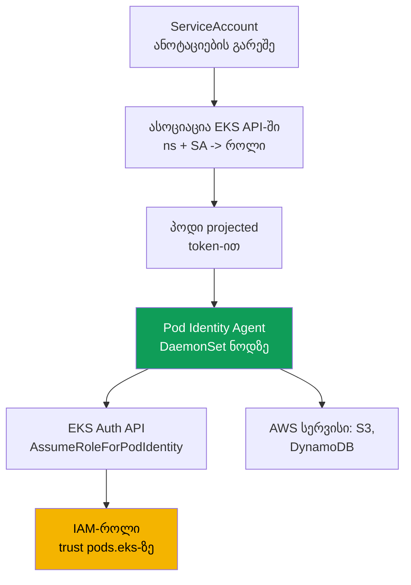
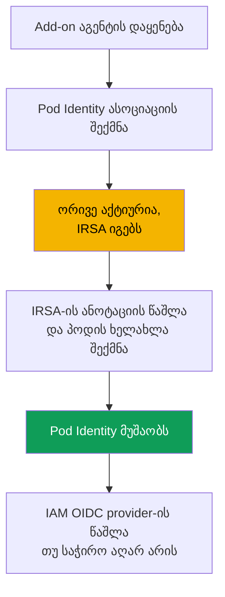

[Русская версия](ru.md) · [Eng version](en.md) · [Versión en español](es.md) · [Version française](fr.md) · [Deutsche Version](de.md) · [繁體中文版](tw.md) · [日本語版](jp.md)
# თავი 17. EKS Pod Identity: აგენტი, ასოციაციები, IRSA-დან მიგრაცია

> **რა არის შემდეგ.** მე-16 თავში ამოცანა „საკუთარი როლი პოდისთვის“ IRSA-ის საშუალებით გადავჭერით:
> კლასტერის OIDC-პროვაიდერი, trust policy `sub`-ზე და `ServiceAccount`-ის ანოტაცია. აქ იმავე
> ამოცანისთვის სხვა მექანიზმს, EKS Pod Identity-ს განვიხილავთ. ის მოგვიანებით გამოჩნდა და IRSA-ის
> მთავარ სირთულეს აგვარებს: trust policy-ის კონკრეტული კლასტერის OIDC-პროვაიდერზე მიბმას.
> განვიხილავთ აგენტს, ასოციაციებს, IRSA-სთან უშუალო შედარებასა და მიგრაციას. მომიჯნავე თემები სხვა
> თავებშია: ადამიანებისა და CI-ის წვდომა (თავი 5), secrets (თავი 18), IMDSv2-ის ჰარდენინგი (თავი 19),
> EKS add-on-ები (თავი 37), Fargate (თავი 15).

## 17.1. „როლი მეზობელ კლასტერში გადავიტანეთ და trust policy თავიდანაა დასაწერი“

IRSA მუშაობს და კარგადაც მუშაობს. მაგრამ მას აქვს ფასი, რომელიც ერთ კლასტერში რამდენიმე როლის
შემთხვევაში შეუმჩნეველია, კლასტერების პარკში კი პრობლემად იქცევა. გავიხსენოთ მე-16 თავიდან IRSA
როლის trust policy: იქ `Principal.Federated` **კონკრეტული** კლასტერის IAM OIDC-პროვაიდერის ARN-ია,
ხოლო `sub`-ის პირობა **იმავე** კლასტერის issuer URL-ზეა მიბმული. IRSA-ის როლი ნდობის დონეზევე
მყარადაა მიბმული ერთ კლასტერზე.

შემდეგ იწყება რუტინული მომსახურება:

- **როლი კლასტერებს შორის ვერ გადადის.** აპლიკაცია და მისი როლი მეზობელ კლასტერში გადაიტანეთ,
  trust policy კი თავიდანაა დასაწერი: სხვა provider ARN, სხვა issuer URL `sub`-ში.
- **თითოეულ როლს თავისი trust policy აქვს.** ასი აპლიკაცია ნიშნავს ნდობის ას პოლიტიკას და
  თითოეული საკუთარი კლასტერის OIDC-პროვაიდერზე მიუთითებს. ხელახლა გამოსაყენებელი საერთო შაბლონი არ არის.
- **ათობით კლასტერამდე მასშტაბირება ჯოჯოხეთია.** ერთი აპლიკაცია ოც კლასტერში ერთი და იმავე
  დანიშნულების როლის trust policy-ის ოც ვარიანტს ქმნის და ყველა სინქრონულად უნდა შეინარჩუნოთ.
  ამას გარდა, თითოეულ კლასტერს საკუთარი IAM OIDC provider აქვს, ანგარიშში კი მათი რაოდენობა შეზღუდულია.

სასურველია როლისა და `ServiceAccount`-ის უფრო მარტივად დაკავშირება: თითოეულ კლასტერში
OIDC-პროვაიდერისა და გადატანისას trust policy-ის თავიდან დაწერის გარეშე. ზუსტად ამას აკეთებს EKS Pod Identity.

## 17.2. რა არის EKS Pod Identity

EKS Pod Identity იმავე ამოცანას IRSA-ისგან განსხვავებული გზით წყვეტს. OIDC federation-ის ნაცვლად
აქ სამი ნაწილია: **აგენტი ნოდზე**, **EKS API ასოციაციებისთვის** და როლის **ერთიანი trust policy**
საერთო service principal-ზე `pods.eks.amazonaws.com`, რომელიც კონკრეტულ კლასტერზე მიბმული არ არის.

- **EKS Pod Identity Agent** არის აგენტი-პოდი, რომელიც `DaemonSet`-ის სახით `kube-system`
  namespace-ში ყველა Linux-ნოდზე მუშაობს. ის EKS managed add-on-ის სახით ინსტალირდება
  (`eks-pod-identity-agent`, add-on-ების მექანიზმი განხილულია 37-ე თავში). EKS Auto Mode-ში აგენტი ჩაშენებულია.
- **ასოციაცია (association)** არის EKS API-ის ჩანაწერი, რომელიც სამეულს `კლასტერი + namespace +
  ServiceAccount` IAM-როლთან აკავშირებს. არც `ServiceAccount`-ის ანოტაცია და არც ობიექტები
  კლასტერში: ასოციაცია EKS-შია და არა Kubernetes-ში.
- როლის **trust policy** კლასტერის OIDC-პროვაიდერის ნაცვლად სერვისს `pods.eks.amazonaws.com`
  ენდობა. ერთი policy ნებისმიერი კლასტერისთვის გამოდგება, ამიტომ როლის ხელახლა გამოყენება მარტივია.

OIDC federation-ისა და `AssumeRoleWithWebIdentity`-ით გაცვლის მექანიზმი (თავი 16) აქ საერთოდ არ არის.
როლის credentials ცალკე EKS Auth API-ის საშუალებით მიიღება, პოდებს კი მათ ლოკალური აგენტი აწვდის.

## 17.3. როგორ მუშაობს ეს ეტაპობრივად

კონფიგურაცია ერთხელ სრულდება, შემდეგ კი პოდის ყოველი გაშვებისას credentials ავტომატურად გაიცემა.



ეტაპობრივად:

1. კლასტერზე ინსტალირდება add-on `eks-pod-identity-agent`, აგენტი ყველა ნოდზე `DaemonSet`-ის
   სახით ეშვება (სექცია 17.5). Node IAM role-ს უნდა ჰქონდეს `eks-auth:AssumeRoleForPodIdentity`-ის
   უფლება. ის უკვე შედის managed policy-ში `AmazonEKSWorkerNodePolicy` (თავი 10).
2. იქმნება IAM-როლი trust policy-ით `pods.eks.amazonaws.com`-ზე (სექცია 17.4).
3. EKS API-ის საშუალებით იქმნება ასოციაცია: `კლასტერი + namespace + ServiceAccount -> როლის ARN`.
4. იმ პოდის გაშვებისას, რომლის `ServiceAccount`-საც ასოციაცია აქვს, EKS კონტეინერებს უმატებს
   projected-ტომს ტოკენით (audience `pods.eks.amazonaws.com`) და ცვლადებს
   `AWS_CONTAINER_CREDENTIALS_FULL_URI` და `AWS_CONTAINER_AUTHORIZATION_TOKEN_FILE`.
5. ნოდზე აგენტი EKS Auth API-ში იძახებს `AssumeRoleForPodIdentity`-ს, იღებს როლის დროებით
   credentials-ს და მათ ლოკალური endpoint-ის საშუალებით გასცემს (link-local მისამართი
   `169.254.170.23`). კონტეინერში AWS SDK credentials-ს სტანდარტული ჯაჭვის container credential
   provider-იდან იღებს, კოდის გარეშე.

როლს **EKS Auth სერვისი თითო ნოდზე ერთხელ იღებს** და არა თითოეული SDK თითოეულ პოდში. ამიტომ STS-ზე
დატვირთვა ნაკლებია, ვიდრე IRSA-ის შემთხვევაში, სადაც ტოკენის გაცვლას თითოეულ პოდში SDK ასრულებს.

მნიშვნელოვანი კავშირი NetworkPolicy-სთან: credentials-ის მისაღებად SDK link-local მისამართს
`169.254.170.23` მიმართავს. `default-deny` egress-ის მქონე პოდი მათ ვერ მიიღებს, სანამ policy-ში
არ იქნება egress-წესი `169.254.170.23/32`-ზე (პორტი `80`). როგორ უნდა გაიხსნას მხოლოდ ეს მისამართი
მთელი egress-ის გახსნის გარეშე, განხილულია 30-ე თავში.

## 17.4. Trust policy Pod Identity-სთვის

პორტაბელურობის არსი trust policy-შია. ის **ერთიანია** და კლასტერზე დამოკიდებული არ არის.

```json
{
  "Version": "2012-10-17",
  "Statement": [
    {
      "Sid": "AllowEksAuthToAssumeRoleForPodIdentity",
      "Effect": "Allow",
      "Principal": {
        "Service": "pods.eks.amazonaws.com"
      },
      "Action": [
        "sts:AssumeRole",
        "sts:TagSession"
      ]
    }
  ]
}
```

- **`Principal.Service`** არის `pods.eks.amazonaws.com`, EKS Pod Identity სერვისის საერთო
  principal. ის ყველა კლასტერისა და ანგარიშისთვის ერთია, ამიტომ OIDC-პროვაიდერის ARN აქ საჭირო არ არის.
- **`sts:AssumeRole`** გამოიყენება EKS Auth-ის მიერ პოდისთვის დროებითი credentials-ის გაცემამდე როლის მისაღებად.
- **`sts:TagSession`** STS-ის მოთხოვნაში **session tags**-ის დამატების საშუალებას იძლევა. მის გარეშე
  ნაგულისხმევად ჩართული session tags-ის მქონე ასოციაცია არ იმუშავებს, ამიტომ ორივე action საჭიროა.

შეადარეთ 16.5 სექციას: იქ `Principal.Federated` კონკრეტული კლასტერის OIDC-პროვაიდერის ARN-ია,
action არის `sts:AssumeRoleWithWebIdentity`, ხოლო `sub`-ის პირობა კლასტერის issuer URL-ს შეიცავს.
აქ კლასტერისთვის სპეციფიკური არაფერია: ამ trust policy-ის მქონე ერთი როლი ასოციაციების საშუალებით
ნებისმიერი რაოდენობის კლასტერს შეიძლება დაუკავშირდეს ნდობის პოლიტიკის შეცვლის გარეშე. ეს 17.1-ში
აღწერილ სირთულეს ხსნის.

რომელ namespace-ს, `ServiceAccount`-სა და კლასტერს შეუძლია როლის მიღება, trust policy-ში
**session tags-ის პირობებით** შეიძლება შეიზღუდოს: EKS თავად ადგენს სესიის ტეგებს კლასტერით,
namespace-ითა და `ServiceAccount`-ით და მათზე `StringEquals` გამოიყენება. პოლიტიკებში ეს ტეგები
ხელმისაწვდომია როგორც `aws:PrincipalTag/kubernetes-namespace`, `aws:PrincipalTag/eks-cluster-name`,
`aws:PrincipalTag/kubernetes-service-account`. მაგალითად, პირობაში
`aws:PrincipalTag/kubernetes-namespace` უდრის `payments`.

## 17.5. Add-on აგენტი და ასოციაციები

ჯერ add-on, ჩვეულებრივი EKS managed add-on (თავი 37).

```bash
# აგენტის add-on-ის სახით დაყენება (ერთხელ თითო კლასტერზე; Auto Mode-ზე საჭირო არ არის)
aws eks create-addon --cluster-name demo --addon-name eks-pod-identity-agent

# გაეშვა აგენტი DaemonSet-ის სახით kube-system-ში?
kubectl get ds -n kube-system eks-pod-identity-agent
```

შემდეგ ასოციაცია. ის EKS-ში **ერთი ბრძანებით** იქმნება, `ServiceAccount`-ის ანოტაციებისა და
კლასტერში ობიექტების გარეშე. თავად `ServiceAccount` უნდა არსებობდეს და პოდი მას უნდა იყენებდეს.

```bash
# namespace + SA-ის როლთან დაკავშირება
aws eks create-pod-identity-association \
  --cluster-name demo --namespace payments \
  --service-account s3-reader \
  --role-arn arn:aws:iam::111122223333:role/payments-s3-reader

# რა ასოციაციებია კლასტერზე
aws eks list-pod-identity-associations --cluster-name demo

# ერთი ასოციაციის დეტალები მისი id-ით
aws eks describe-pod-identity-association \
  --cluster-name demo --association-id a-abcdefghijklmnop1
```

ასოციაციების ძირითადი თვისებები:

- **ერთი როლი, ბევრი ასოციაცია.** იგივე როლი სხვადასხვა namespace-სა და კლასტერში არსებულ
  `ServiceAccount`-ებს უკავშირდება: trust policy არ იცვლება, იცვლება მხოლოდ ასოციაციის ჩანაწერები.
  ამასთან, ერთ SA-ს კლასტერის ანგარიშში ერთი როლი აქვს. როლის შესაცვლელად ასოციაციას არედაქტირებენ.
- **Session tags და ABAC.** EKS ამატებს სესიის ტეგებს (კლასტერი, namespace, SA) ABAC-ისთვის. მათი
  გამორთვაც შეიძლება. ასოციაციები eventual consistent-ია და მათ გაშვების კრიტიკულ გზაზე არ ქმნიან.

## 17.6. IRSA და Pod Identity კონკრეტულად

ორივე მოდელი პოდს „საკუთარ როლს“ აძლევს. განსხვავება ისაა, როგორ უკავშირდება როლი
`ServiceAccount`-ს და რა ღირს ამის მომსახურება. გავაღრმაოთ მე-16 თავის 16.9 სექციის შედარება.

| თვისება | IRSA | EKS Pod Identity |
|---|---|---|
| მექანიზმი | OIDC federation, გაცვლა STS-ის საშუალებით | აგენტი ნოდზე და EKS Auth API |
| როლის trust policy | `Federated` კლასტერის OIDC-პროვაიდერზე | საერთო `Service` `pods.eks.amazonaws.com` |
| Action-ები trust policy-ში | `sts:AssumeRoleWithWebIdentity` | `sts:AssumeRole` + `sts:TagSession` |
| კონფიგურაცია კლასტერზე | IAM OIDC provider თითო კლასტერზე | add-on აგენტი `eks-pod-identity-agent` |
| SA-სთან დაკავშირება | ანოტაცია `eks.amazonaws.com/role-arn` | ასოციაცია EKS API-ში, ანოტაციები არ არის |
| როლის პორტაბელურობა | trust policy თითოეული კლასტერისთვის თავიდან იწერება | ერთი trust policy ყველა კლასტერისთვის |
| Cross-account | უშუალოდ OIDC federation-ის საშუალებით | დელეგირების საშუალებით (assume role სამიზნეში) |
| EKS-ის გარეთ (EC2, ECS, Lambda) | მუშაობს OIDC-ით | არა, მხოლოდ EKS-ის Linux-ნოდები |
| Session tags და ABAC | ხელით | ჩაშენებული, ტეგები ავტომატურად დგება |
| სიმწიფე | დიდი ხანია არსებობს, ფართოდ გავრცელებულია | უფრო ახალია (2023 წლის ბოლოდან), ნაგულისხმევი არჩევანია ახლისთვის |

მოკლედ: IRSA საზღვრებზე უფრო მოქნილია (cross-account OIDC-ით, federation EKS-ის გარეთ), მაგრამ
უფრო ვრცელია და ცუდად გადაადგილდება. Pod Identity-ის დაკავშირება და ხელახლა გამოყენება უფრო
მარტივია, თუმცა ის EKS-სა და Linux-ზეა მიბმული.

## 17.7. როდის რომელი ავირჩიოთ

EC2-ნოდების მქონე ახალი კლასტერებისთვის Pod Identity გონივრული ნაგულისხმევი არჩევანია:
კონფიგურაცია უფრო მარტივია (add-on თითო კლასტერის OIDC-პროვაიდერის ნაცვლად), როლი პორტაბელურია,
session tags და ABAC კი დაუყოვნებლივ ხელმისაწვდომია. თუმცა მექანიზმს აქვს შეზღუდვები, რომლებიც
დოკუმენტაციასთან უნდა გადაამოწმოთ.

| სცენარი | რა ავირჩიოთ | რატომ |
|---|---|---|
| ახალი კლასტერი EC2-ნოდებზე | Pod Identity | მარტივი კონფიგურაცია, პორტაბელურობა, ჩაშენებული ABAC |
| Cross-account OIDC federation-ით | IRSA | Pod Identity დელეგირებას მოითხოვს assume role-ის საშუალებით |
| დატვირთვა Fargate-ზე | IRSA | Pod Identity Fargate-ზე მხარდაჭერილი არ არის |
| Windows-ნოდები | IRSA | Pod Identity მხოლოდ Linux Amazon EC2-ზე მუშაობს |
| იდენტობა EKS-ის გარეთ | IRSA | Pod Identity EKS-ის ნოდებზეა მიბმული |
| პლატფორმის ძველი ვერსია | გადაამოწმეთ | Pod Identity მინიმალურ platform version-ს მოითხოვს |

წერის მომენტისთვის შემოწმებული Pod Identity-ის შეზღუდვები: მხოლოდ **Linux-ნოდები Amazon EC2-ზე**;
**Fargate მხარდაჭერილი არ არის** (არც Linux და არც Windows pods); Windows-ნოდები მხარდაჭერილი არ
არის; მიუწვდომელია Outposts-სა და EKS Anywhere-ზე; კლასტერს უნდა ჰქონდეს არანაკლებ მინიმალური
platform version-ისა (ძველი minor ვერსიებისთვის ეს `eks.4`-ია). სია დოკუმენტაციაში გადაამოწმეთ,
რადგან დროთა განმავლობაში მცირდება.

## 17.8. IRSA-დან Pod Identity-ზე მიგრაცია

მიგრაცია უსაფრთხოა და უშვებს გარდამავალ პერიოდს, როდესაც ერთ `ServiceAccount`-ზე ერთდროულად
არსებობს IRSA-ის **ანოტაციაც** და Pod Identity-ის **ასოციაციაც**. ყველაფერს credentials-ის
პრიორიტეტულობის რიგი წყვეტს.



ვინ იგებს ერთდროული კონფიგურაციისას. IRSA credentials-ს **web identity token provider**-ის
საშუალებით გასცემს, Pod Identity კი **container credential provider**-ის საშუალებით. AWS SDK-ის
სტანდარტულ ჯაჭვში web identity კონტეინერის provider-ზე **ადრე** დგას. ამიტომ, თუ ერთ
`ServiceAccount`-ზე IRSA-ის ანოტაციაცაა და Pod Identity-ის ასოციაციაც, **IRSA იგებს**, ასოციაცია
კი უგულებელყოფილია: ჯაჭვში უფრო ადრე მდგომი credentials ასოციაციის შექმნის შემდეგაც გამოიყენება.
ეს მიგრაციისთვის მოსახერხებელია: ასოციაცია წინასწარ იქმნება, გადართვა კი IRSA-ის წაშლისას ხდება.

მიგრაციის თანმიმდევრობა:

1. დააყენეთ add-on `eks-pod-identity-agent` და დარწმუნდით, რომ `DaemonSet` გაშვებულია.
2. განაახლეთ როლის trust policy `pods.eks.amazonaws.com`-ზე (ან Pod Identity-სთვის ცალკე როლები
   შექმენით). როლის permissions policy უცვლელი რჩება.
3. შექმენით ასოციაცია იმავე `namespace + ServiceAccount`-ისთვის. სანამ IRSA-ის ანოტაცია არსებობს,
   პოდი IRSA-ს გამოყენებას განაგრძობს და არაფერი ფუჭდება.
4. `ServiceAccount`-ს მოაშორეთ ანოტაცია `eks.amazonaws.com/role-arn` და **ხელახლა შექმენით პოდი**:
   ახლა ჯაჭვში web identity აღარ არის და SDK Pod Identity-ის credentials-ს იღებს.
5. პოდიდან შეამოწმეთ `aws sts get-caller-identity`, შემდეგ კი წაშალეთ არასაჭირო ნაწილები: trust
   policy OIDC-ზე, ხოლო თუ IRSA-ის როლები აღარ დარჩა, IAM OIDC identity provider-იც.

## 17.9. დიაგნოსტიკა

თანმიმდევრობა იგივეა, რაც 16.7 სექციაში: ინფრასტრუქტურიდან პოდისკენ და შემდეგ გარეთ.

```bash
# 1. აგენტი ყველა ნოდზეა გაშვებული?
kubectl get ds -n kube-system eks-pod-identity-agent

# 2. საჭირო namespace-ისა და SA-ის ასოციაცია არსებობს?
aws eks list-pod-identity-associations --cluster-name demo --namespace payments

# 3. ვის სახელად ხედავს პოდი საკუთარ თავს AWS-ში: საჭირო როლის assumed-role უნდა იყოს და არა ნოდის როლი
kubectl -n payments exec deploy/my-app -- aws sts get-caller-identity
```

მთავარი შემოწმებაა პოდიდან `get-caller-identity`: თუ `Arn`-ში თქვენი როლის `assumed-role` ჩანს,
Pod Identity ამუშავდა და პრობლემა, თუ ის არსებობს, როლის permissions policy-შია; თუ ნოდის როლი
ჩანს, credentials პოდამდე ვერ მივიდა და მიზეზი ქვემოთ მოცემულ ცხრილშია.

| სიმპტომი | სავარაუდო მიზეზი | რა უნდა შემოწმდეს |
|---|---|---|
| SDK ნოდის როლით მუშაობს | აგენტი არ არის გაშვებული ან ასოციაცია არ არსებობს | აგენტის `DaemonSet`, `list-pod-identity-associations` |
| პოდი შეიქმნა, მაგრამ credentials არ არის | ასოციაცია პოდის გაშვების შემდეგ შეიქმნა | პოდის ხელახლა შექმნა (eventual consistency) |
| IRSA-ის როლით მუშაობს | SA-ზე IRSA-ის ანოტაცია დარჩა | ანოტაციის მოხსნა, პოდის ხელახლა შექმნა |
| `AccessDenied` სერვისის გამოძახებისას | როლს საჭირო permissions policy არ აქვს | როლის permissions policy |
| Timeout credentials-ის მიღებისას | `default-deny` egress ბლოკავს `169.254.170.23`-ს | NetworkPolicy-ში egress `169.254.170.23/32`-ზე (თავი 30) |
| როლი ასოციაციისთვის არ ჩანს | trust policy `pods.eks`-ზე არ არსებობს | როლის trust policy (სექცია 17.4) |
| აგენტი არ ეშვება | ნოდზე IPv6 გამორთულია | აგენტის IPv6 კონფიგურაცია |

ხშირი შეცდომაა trust policy-ში დავიწყებული `sts:TagSession`: ნაგულისხმევად ჩართული session tags-ის
მქონე ასოციაცია არ იმუშავებს, სანამ ნდობის პოლიტიკაში ორივე action არ იქნება.

## 17.10. როგორ იყენებენ ამას production-ში

- **EC2-ზე ახალი კლასტერებისთვის Pod Identity-ს ნაგულისხმევად ირჩევენ** როლის პორტაბელურობისა და
  მარტივი კონფიგურაციის გამო. IRSA რჩება cross-account, Fargate, Windows და EKS-ის გარეთ სცენარებისთვის.
- **აგენტი add-on-ის სახით IaC-ში კლასტერთან ერთად ყენდება** და არა მოგვიანებით ხელით. EKS Auto
  Mode-ში აგენტი ჩაშენებულია და ცალკე add-on საჭირო არ არის.
- **Pod Identity-ის როლი კლასტერებს შორის ასოციაციების საშუალებით ხელახლა გამოიყენება**: trust
  policy ერთია, ხოლო კავშირი `namespace + SA -> როლი` ბევრია, რაც 17.1-ში აღწერილ დუბლირებას ხსნის.
- **როლი session tags-ზე ABAC-ით იზღუდება** (კლასტერი, namespace, SA) trust ან permissions
  policy-ის პირობებში, ზუსტი `sub`-ის ნაცვლად, როგორც IRSA-ში კეთდებოდა.
- **მიგრაცია downtime-ის გარეშე ხდება**: ასოციაცია წინასწარ იქმნება, სანამ IRSA ჯერ კიდევ იგებს
  ჯაჭვში, გადართვა კი მხოლოდ ანოტაციის მოხსნითა და პოდის ხელახლა შექმნით ხდება. ამასთან, Node IAM
  role-ს უნდა ჰქონდეს `eks-auth:AssumeRoleForPodIdentity`-ის უფლება. ის უკვე შედის
  `AmazonEKSWorkerNodePolicy`-ში.

## 17.11. მინი-ლექსიკონი

- **EKS Pod Identity** არის ნოდზე აგენტისა და EKS API-ის საშუალებით პოდისთვის IAM-როლის გაცემის
  მექანიზმი, კლასტერის OIDC-პროვაიდერისა და კონკრეტულ კლასტერზე მიბმული trust policy-ის გარეშე.
- **EKS Pod Identity Agent** არის add-on `eks-pod-identity-agent`, რომელიც ნოდებზე `DaemonSet`-ის
  სახით მუშაობს და ლოკალური endpoint-ის საშუალებით პოდებს დროებით credentials-ს აწვდის.
- **ასოციაცია (association)** არის EKS API-ის ჩანაწერი, რომელიც `კლასტერი + namespace +
  ServiceAccount`-ს IAM-როლთან აკავშირებს; იქმნება `aws eks create-pod-identity-association`-ით.
- **`pods.eks.amazonaws.com`** არის Pod Identity როლის trust policy-ში სერვისის principal, საერთო
  ყველა კლასტერისა და ანგარიშისთვის. როლის credentials-ს EKS Auth API `AssumeRoleForPodIdentity`-ით გასცემს.
- **Session tags** არის სესიის ტეგები (კლასტერი, namespace, SA), რომლებსაც Pod Identity STS-ის
  მოთხოვნაში ამატებს და რომლებზეც ABAC შენდება; პოლიტიკებში ესენია
  `aws:PrincipalTag/kubernetes-namespace` და `aws:PrincipalTag/eks-cluster-name`; trust policy-ში
  `sts:TagSession`-ს მოითხოვს.

## 17.12. თავის შეჯამება

- IRSA-ის სირთულე თავად მექანიზმში კი არა, მომსახურებაშია: როლის trust policy კლასტერის
  OIDC-პროვაიდერზეა მიბმული, როლი ვერ გადაადგილდება და კლასტერების პარკში ეს სინქრონიზაციის ჯოჯოხეთია.
- EKS Pod Identity პოდს „საკუთარ როლს“ სხვაგვარად აძლევს: `DaemonSet` აგენტი ნოდზე, ასოციაცია EKS
  API-ში და ერთიანი trust policy `pods.eks.amazonaws.com`-ზე, რომელიც კლასტერზე მიბმული არ არის.
- Pod Identity-ის როლის trust policy ენდობა `pods.eks.amazonaws.com`-ს action-ებით
  `sts:AssumeRole` და `sts:TagSession`; OIDC-პროვაიდერი და `sub`-ის პირობები აქ არ არის.
- ასოციაცია `კლასტერი + namespace + ServiceAccount`-ს როლთან ერთი ბრძანებით
  `aws eks create-pod-identity-association` აკავშირებს; SA-ზე ანოტაციები და კლასტერში ობიექტები
  საჭირო არ არის. ერთი როლი ბევრ ასოციაციასა და კლასტერში trust policy-ის შეცვლის გარეშე გამოიყენება.
- Pod Identity-ის შეზღუდვები: მხოლოდ Linux EC2-ნოდები, Fargate-ისა და Windows-ის გარეშე.
  გადაამოწმეთ დოკუმენტაციაში.
- ერთ SA-ზე IRSA-ისა და Pod Identity-ის ერთდროული კონფიგურაციისას IRSA იგებს: web identity SDK-ის
  ჯაჭვში container credential provider-ზე ადრე დგას. ეს მიგრაციას უსაფრთხოს ხდის: add-on აგენტი,
  trust policy `pods.eks`-ზე, ასოციაცია, შემდეგ IRSA-ის ანოტაციის მოხსნა და restart.
- დიაგნოსტიკა აგენტიდან ასოციაციისა და პოდისკენ მიდის: `DaemonSet` გაშვებულია, ასოციაცია არსებობს,
  პოდიდან `aws sts get-caller-identity` როლის assumed-role-ს აჩვენებს და არა ნოდის როლს.

## 17.13. როგორ გამოგადგებათ ეს რეალურ სამუშაოში

ათობით კლასტერის პარკში საკითხი „ერთი აპლიკაცია, ერთი როლი ყველა კლასტერში“ Pod Identity-ის
საშუალებით ერთი როლითა და ასოციაციების ნაკრებით წყდება და არა trust policy-ის ათი ასლით. ახალი
კლასტერისთვის OIDC-პროვაიდერის შექმნა და პროვაიდერების ლიმიტის კონტროლი საჭირო არ არის, add-on
აგენტიც საკმარისია. მორიგეობისას მომართვები „პოდი AWS-ში საკუთარ უფლებებს ვერ ხედავს“ 17.9
სექციის ჯაჭვით იხურება: აგენტი, ასოციაცია, `get-caller-identity`. ხოლო იმის ცოდნა, რომ ორმაგი
კონფიგურაციისას IRSA იგებს, საათებს ზოგავს გამოცანაზე „ასოციაცია შევქმენი, პოდი კი ძველი როლით მუშაობს“.

## 17.14. კითხვები თვითშემოწმებისთვის

1. რა არის IRSA-ის მთავარი სირთულე კლასტერების პარკზე მასშტაბირებისას და trust policy-ის რომელ
   ადგილასაა ჩაშენებული კონკრეტულ კლასტერზე მიბმა?
2. რომელი სამი ნაწილისგან შედგება EKS Pod Identity და რა ინახება Kubernetes-ში, რა კი EKS API-ში?
3. როგორაა EKS Pod Identity Agent მოწყობილი ნოდზე და როგორ ყენდება კლასტერზე?
4. რა წერია Pod Identity-ის როლის trust policy-ის `Principal`-ში და რატომაა ეს policy პორტაბელური?
5. რატომაა trust policy-ში ერთდროულად ორი action საჭირო: `sts:AssumeRole` და `sts:TagSession`?
6. რომელი ბრძანებით იქმნება ასოციაცია და რომელ ველებს აკავშირებს? საჭიროა თუ არა SA-ზე ანოტაცია?
7. შეუძლია თუ არა ერთ როლს სხვადასხვა კლასტერში რამდენიმე `ServiceAccount` მოემსახუროს? რის ხარჯზე?
8. დაასახელეთ Pod Identity-ის სამი შეზღუდვა, რომელთა გამოც IRSA-ის არჩევა მოგიწევთ.
9. ვინ იგებს, თუ ერთ SA-ზე IRSA-ის ანოტაციაცაა და Pod Identity-ის ასოციაციაც, და რატომ?
10. აღწერეთ მიგრაციის თანმიმდევრობა downtime-ის გარეშე. კონკრეტულად სად ხდება გადართვა?
11. როგორ უნდა გავიგოთ პოდიდან ერთი ბრძანებით, ამუშავდა თუ არა Pod Identity, და როგორ განვასხვაოთ
    ეს უფლებების ნაკლებობისგან?
12. პოდი შეიქმნა, ასოციაცია არსებობს, მაგრამ ის ნოდის როლით მუშაობს. დაასახელეთ ორი სავარაუდო მიზეზი.

## პრაქტიკა

ამ თემის კურსის ლაბა: [ლაბა 104 - Workload identity: IRSA და Pod Identity
აპლიკაციისთვის](../../labs/104/README_GE.MD). დანარჩენი ყველაფერი ცოცხალ კლასტერზე მოწმდება.
დააყენეთ add-on ბრძანებით
`aws eks create-addon --cluster-name <cluster> --addon-name eks-pod-identity-agent` და დარწმუნდით,
რომ `kubectl get ds -n kube-system eks-pod-identity-agent` ყველა ნოდზე გაშვებულ `DaemonSet`-ს აჩვენებს.
შექმენით IAM-როლი trust policy-ით `pods.eks.amazonaws.com`-ზე (action-ები `sts:AssumeRole` და
`sts:TagSession`) და permissions policy-ით მხოლოდ bucket-ის წაკითხვაზე.

შექმენით ასოციაცია `aws eks create-pod-identity-association`-ით სატესტო namespace-ისა და
`ServiceAccount`-ისთვის, გაუშვით პოდი ამ SA-ით და მასში შეასრულეთ `aws sts get-caller-identity`.
`Arn`-ში თქვენი როლის assumed-role უნდა იყოს და არა ნოდის როლი. ნახეთ
`aws eks list-pod-identity-associations` და `aws eks describe-pod-identity-association` მისი id-ით.
ცალკე გაიმეორეთ მე-16 თავის IRSA-ის სცენარი იმავე SA-ზე: დაამატეთ ანოტაცია
`eks.amazonaws.com/role-arn`, ხელახლა შექმენით პოდი და დარწმუნდით, რომ ახლა პოდი IRSA-ის როლით
მუშაობს. სწორედ ესაა ჯაჭვში პრიორიტეტულობის რიგი. შემდეგ მოხსენით ანოტაცია, ხელახლა შექმენით პოდი
და ნახეთ, როგორ უბრუნდება მართვა Pod Identity-ს.

---
[სარჩევი](../README_GE.md) · [თავი 16](../16/ge.md) · [თავი 18](../18/ge.md)
