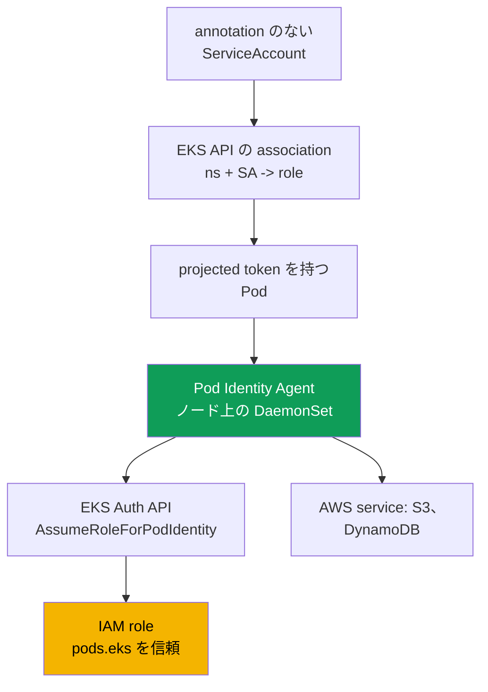
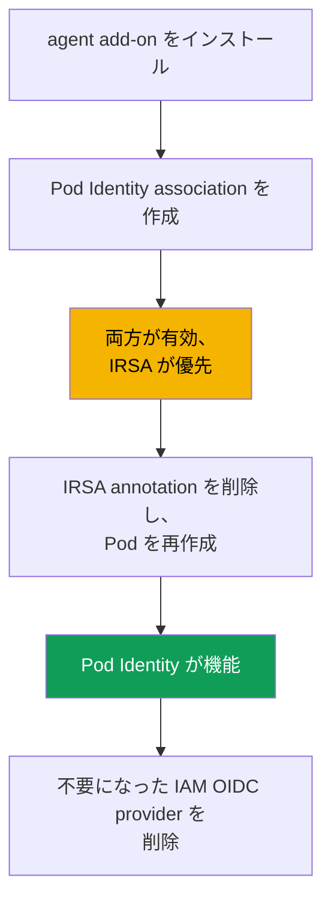

[Русская версия](ru.md) · [Eng version](en.md) · [Versión en español](es.md) · [Version française](fr.md) · [Deutsche Version](de.md) · [ქართული ვერსია](ge.md) · [繁體中文版](tw.md)
# 第17章. EKS Pod Identity: agent、association、IRSA からの移行

> **この先。** 第16章では、クラスターの OIDC provider、`sub` に対する trust policy、`ServiceAccount` annotation を使用して、IRSA による「Pod ごとに専用のロール」という課題を完了しました。ここでは、同じ課題に対する別の仕組み、EKS Pod Identity を扱います。これは後から登場し、IRSA の主な悩みである、特定クラスターの OIDC provider への trust policy の結び付きを解消します。agent、association、IRSA との直接比較、移行を説明します。関連トピックはほかの章で扱います。人間と CI のアクセスは第5章、Secrets は第18章、IMDSv2 のハードニングは第19章、EKS add-on は第37章、Fargate は第15章です。

## 17.1. 「ロールを隣のクラスターへコピーしたら、trust policy を書き直さなければならない」

IRSA は機能し、十分に機能します。しかし、数個のロールしかない 1 クラスターでは見えないコストがあり、クラスター群全体では問題へと拡大します。第16章の IRSA ロールの trust policy を思い出してください。`Principal.Federated` は**特定の**クラスターの IAM OIDC provider ARN であり、`sub` の条件は**同じ**クラスターの issuer URL に結び付いています。IRSA ロールは trust のレベルで 1 つのクラスターに恒久的に結び付けられます。

その後、運用上の作業が始まります。

- **ロールはクラスター間で移植できない。** アプリケーションとそのロールを隣のクラスターにコピーすると、trust policy の書き直しが必要です。provider ARN も `sub` 内の issuer URL も異なります。
- **各ロールに固有の trust policy がある。** 100 個のアプリケーションがあれば 100 個の trust policy があり、それぞれが自分のクラスターの OIDC provider を参照します。共有して再利用できる template はありません。
- **数十クラスターへの拡張は困難。** 20 クラスターにある 1 アプリケーションは、意味は同じロールの trust policy を 20 種類生み出し、それらをすべて同期させ続ける必要があります。さらに、各クラスターに独自の IAM OIDC provider があり、アカウントにはその数の上限があります。

ロールと `ServiceAccount` をより簡単に結び付けたいはずです。各クラスターに OIDC provider を置かず、移動時に trust policy を書き直すこともなく。まさにそれを実現するのが EKS Pod Identity です。

## 17.2. EKS Pod Identity とは

EKS Pod Identity は IRSA と異なる方法で同じ課題を解決します。OIDC federation の代わりに、3 つの要素があります。**ノード上の agent**、**association のための EKS API**、そして特定のクラスターに結び付かない共通の `pods.eks.amazonaws.com` service principal に対するロールの**単一の trust policy**です。

- **EKS Pod Identity Agent** は、すべての Linux ノードの `kube-system` namespace で `DaemonSet` として動作する Pod agent です。EKS managed add-on（`eks-pod-identity-agent`、add-on の仕組みは第37章）としてインストールします。EKS Auto Mode では agent は組み込みです。
- **Association** は、`cluster + namespace + ServiceAccount` の組を IAM ロールに結び付ける EKS API 内のレコードです。クラスター内の `ServiceAccount` annotation やオブジェクトは不要です。association は Kubernetes ではなく EKS に存在します。
- ロールの**trust policy**は、クラスターの OIDC provider ではなく `pods.eks.amazonaws.com` を信頼します。1 つの policy が任意のクラスターで機能するため、ロールは容易に再利用できます。

ここには OIDC federation の仕組みも `AssumeRoleWithWebIdentity` の交換（第16章）も一切ありません。ロールは別の EKS Auth API を通じて認証情報を取得し、ローカル agent が Pod に配布します。

## 17.3. 動作の手順

設定は一度行えば、その後は Pod が起動するたびに認証情報が自動発行されます。



手順は次のとおりです。

1. `eks-pod-identity-agent` add-on をクラスターにインストールすると、agent は全ノードで `DaemonSet` として起動します（17.5節）。node IAM role は `eks-auth:AssumeRoleForPodIdentity` を許可している必要があります。これは managed policy の `AmazonEKSWorkerNodePolicy` にすでに含まれています（第10章）。
2. `pods.eks.amazonaws.com` 向けの trust policy を持つ IAM ロールを作成します（17.4節）。
3. EKS API を通じて association を作成します。`cluster + namespace + ServiceAccount -> role ARN` です。
4. association を持つ `ServiceAccount` を使用する Pod が起動すると、EKS は audience が `pods.eks.amazonaws.com` の token を持つ projected volume と、環境変数 `AWS_CONTAINER_CREDENTIALS_FULL_URI` および `AWS_CONTAINER_AUTHORIZATION_TOKEN_FILE` をそのコンテナに追加します。
5. ノード agent は EKS Auth API の `AssumeRoleForPodIdentity` を呼び出し、一時的なロール認証情報を取得して、ローカル endpoint（link-local アドレス `169.254.170.23`）から配布します。コンテナ内の AWS SDK は、標準 chain の container credential provider から、コード不要で認証情報を取得します。

**EKS Auth service はノードごとに 1 回ロールを引き受けます**。各 Pod の各 SDK が引き受けるのではないため、各 Pod 内の SDK が token 交換を実行する IRSA よりも STS の負荷が低くなります。

NetworkPolicy との重要な関係があります。SDK は認証情報のために link-local の `169.254.170.23` へ接続します。`default-deny` egress の Pod は、policy に `169.254.170.23/32`（port `80`）への egress rule が追加されるまで認証情報を受け取れません。第30章では、egress を完全に開放せずにそのアドレスだけを許可する方法を説明します。

## 17.4. Pod Identity の trust policy

移植性の要点は trust policy にあります。これは**共有**され、クラスターに依存しません。

```json
{
  "Version": "2012-10-17",
  "Statement": [
    {
      "Sid": "AllowEksAuthToAssumeRoleForPodIdentity",
      "Effect": "Allow",
      "Principal": {
        "Service": "pods.eks.amazonaws.com"
      },
      "Action": [
        "sts:AssumeRole",
        "sts:TagSession"
      ]
    }
  ]
}
```

- **`Principal.Service`** は共通の EKS Pod Identity service principal である `pods.eks.amazonaws.com` です。すべてのクラスターとアカウントで同じであるため、ここに OIDC provider ARN は必要ありません。
- **`sts:AssumeRole`** は、Pod に一時認証情報を発行する前に EKS Auth がロールを引き受けることを許可します。
- **`sts:TagSession`** は、STS request への**session tag**の追加を許可します。デフォルトで session tag が有効な association は、これがなければ機能しません。両方の action が必要です。

第16.5章と比較してください。そこでは `Principal.Federated` が特定クラスターの OIDC provider ARN、action は `sts:AssumeRoleWithWebIdentity`、`sub` の条件にはクラスターの issuer URL が含まれます。ここにはクラスター固有のものがありません。この trust policy を持つ 1 ロールは、trust policy に触れずに、任意の数のクラスターで association により結び付けられます。これは 17.1 で説明した問題を取り除きます。

trust policy の**session tag に対する条件**によって、どの namespace、`ServiceAccount` オブジェクト、クラスターがロールを引き受けられるかを制限できます。EKS 自身がクラスター、namespace、`ServiceAccount` の session tag を設定し、`StringEquals` はそれらに適用されます。policy 内では、これらの tag は `aws:PrincipalTag/kubernetes-namespace`、`aws:PrincipalTag/eks-cluster-name`、`aws:PrincipalTag/kubernetes-service-account` として使用できます。たとえば、`aws:PrincipalTag/kubernetes-namespace` 条件を `payments` と等しくできます。

## 17.5. agent add-on と association

最初は add-on です。通常の EKS managed add-on です（第37章）。

```bash
# agent を add-on としてインストールする（クラスターごとに一度。Auto Mode では不要）
aws eks create-addon --cluster-name demo --addon-name eks-pod-identity-agent

# agent は kube-system で DaemonSet として起動しているか？
kubectl get ds -n kube-system eks-pod-identity-agent
```

次に association です。クラスター内の `ServiceAccount` annotation やオブジェクトなしに、**1 つの command** で EKS に作成します。`ServiceAccount` 自体は存在し、Pod に使用されている必要があります。

```bash
# namespace + SA を role に結び付ける
aws eks create-pod-identity-association \
  --cluster-name demo --namespace payments \
  --service-account s3-reader \
  --role-arn arn:aws:iam::111122223333:role/payments-s3-reader

# クラスターに存在する association
aws eks list-pod-identity-associations --cluster-name demo

# id による 1 つの association の詳細
aws eks describe-pod-identity-association \
  --cluster-name demo --association-id a-abcdefghijklmnop1
```

association の主な性質は次のとおりです。

- **1 ロール、多数の association。** 同じロールを、異なる namespace やクラスターにある異なる `ServiceAccount` オブジェクトへ結び付けられます。trust policy は変化せず、association レコードだけが変わります。1 つの SA にはクラスターアカウント内で 1 つのロールがあります。ロールを変更するには association を更新します。
- **Session tag と ABAC。** EKS は ABAC 用の session tag（クラスター、namespace、SA）を追加します。これは無効化できます。association は結果整合性を持つため、重要な起動 path 内で作成してはいけません。

## 17.6. IRSA と Pod Identity の具体的な比較

どちらの model も「Pod ごとに専用のロール」を提供します。違いは、ロールを `ServiceAccount` に結び付ける方法と、その運用コストです。第16.9章の比較を詳しく見ていきます。

| 特性 | IRSA | EKS Pod Identity |
|---|---|---|
| 仕組み | OIDC federation、STS を通じた交換 | ノード agent と EKS Auth API |
| ロールの trust policy | クラスター OIDC provider への `Federated` | 共通の `Service` `pods.eks.amazonaws.com` |
| trust policy の action | `sts:AssumeRoleWithWebIdentity` | `sts:AssumeRole` + `sts:TagSession` |
| クラスターごとの設定 | クラスターごとに IAM OIDC provider | `eks-pod-identity-agent` add-on |
| SA の結び付け | `eks.amazonaws.com/role-arn` annotation | EKS API 内の association、annotation なし |
| ロールの移植性 | クラスターごとに trust policy を書き直す | 全クラスターで 1 つの trust policy |
| クロスアカウント | OIDC federation を通じて直接 | delegation を通じて（対象で role を引き受ける） |
| EKS 外（EC2、ECS、Lambda） | OIDC を通じて機能 | いいえ、EKS Linux ノードのみ |
| Session tag と ABAC | 手動 | 組み込み、tag は自動設定 |
| 成熟度 | 長く確立され広く利用 | より新しい（2023年後半以降）、新規 workload のデフォルト |

要するに、IRSA は境界をまたぐ用途でより柔軟です（OIDC によるクロスアカウント、EKS 外での federation）が、より冗長で移植性が低いです。Pod Identity は結び付けと再利用が簡単ですが、EKS と Linux に結び付いています。

## 17.7. どちらを選ぶか

EC2 ノード上の新規クラスターでは、Pod Identity は妥当なデフォルトです。設定がより簡単であり（クラスターごとの OIDC provider ではなく add-on）、ロールは移植可能で、session tag と ABAC をすぐ利用できます。ただし、ドキュメントに照らして確認すべき制約があります。

| シナリオ | 選択 | 理由 |
|---|---|---|
| EC2 ノード上の新規クラスター | Pod Identity | より簡単な設定、移植性、組み込み ABAC |
| OIDC federation によるクロスアカウント | IRSA | Pod Identity では assume role による delegation が必要 |
| Fargate 上の workload | IRSA | Pod Identity は Fargate でサポートされない |
| Windows ノード | IRSA | Pod Identity は Linux Amazon EC2 専用 |
| EKS 外の identity | IRSA | Pod Identity は EKS ノードに結び付く |
| 古い platform version | 確認する | Pod Identity には最小 platform version が必要 |

執筆時点で確認済みの Pod Identity の制約は次のとおりです。**Linux Amazon EC2 ノードのみ**、**Fargate はサポートされない**（Linux と Windows の Pod のいずれも不可）、Windows ノードは非対応、Outposts と EKS Anywhere では利用不可、クラスターは最小 platform version 以上である必要があります（古い minor version では `eks.4`）。一覧は時間とともに短くなるため、ドキュメントを確認してください。

## 17.8. IRSA から Pod Identity への移行

移行は安全であり、同じ `ServiceAccount` が IRSA annotation と Pod Identity association の**両方**を持つ移行期間をサポートします。認証情報の優先順位がすべてを決定します。



両方が設定されている場合に優先されるもの。IRSA は**web identity token provider**を通じて認証情報を提供し、Pod Identity は**container credential provider**を使用します。標準の AWS SDK chain では、web identity は container provider **より前**にあります。したがって、1 つの `ServiceAccount` が IRSA annotation と Pod Identity association の両方を持つ場合、**IRSA が優先**され、association は無視されます。association の作成後も、chain で先にある認証情報が使用されるためです。これは移行に便利です。association をあらかじめ作成し、その後に IRSA を削除して切り替えます。

移行の順序は次のとおりです。

1. `eks-pod-identity-agent` add-on をインストールし、その `DaemonSet` が稼働していることを確認します。
2. ロールの trust policy を `pods.eks.amazonaws.com` 向けに更新します（または Pod Identity 用に別のロールを作成します）。ロールの permissions policy は変更されません。
3. 同じ `namespace + ServiceAccount` に association を作成します。IRSA annotation がある間、Pod は引き続き IRSA を使用するため、何も壊れません。
4. `ServiceAccount` から `eks.amazonaws.com/role-arn` annotation を削除し、**Pod を再作成**します。web identity は chain からなくなり、SDK は Pod Identity の認証情報を使用します。
5. Pod 内から `aws sts get-caller-identity` を確認してから、不要になったものを削除します。OIDC trust policy、さらに IRSA ロールが残っていなければ IAM OIDC identity provider も削除します。

## 17.9. 診断

順序は第16.7章と同じです。インフラストラクチャから Pod、さらに外側へ確認します。

```bash
# 1. agent はすべてのノードで稼働しているか？
kubectl get ds -n kube-system eks-pod-identity-agent

# 2. 必要な namespace と SA の association は存在するか？
aws eks list-pod-identity-associations --cluster-name demo --namespace payments

# 3. Pod が AWS で認識する identity は、ノード role ではなく目的の role の assumed-role か？
kubectl -n payments exec deploy/my-app -- aws sts get-caller-identity
```

重要な確認は Pod 内からの `get-caller-identity` です。`Arn` がロールの `assumed-role` を示すなら、Pod Identity は機能しており、残る問題はロールの permissions policy にあります。ノード role を示すなら、認証情報が Pod に届いておらず、原因は表の上流にあります。

| 症状 | 考えられる原因 | 確認すること |
|---|---|---|
| SDK がノード role を使用する | agent が稼働していない、または association がない | agent の `DaemonSet`、`list-pod-identity-associations` |
| Pod は作成されたが認証情報がない | Pod 起動後に association を作成した | Pod を再作成する（結果整合性） |
| IRSA role を使用する | SA に IRSA annotation が残っている | annotation を削除し、Pod を再作成する |
| service call で `AccessDenied` | ロールに必要な permissions policy がない | ロールの permissions policy |
| 認証情報取得時の timeout | `default-deny` egress が `169.254.170.23` をブロックしている | NetworkPolicy の `169.254.170.23/32` への egress（第30章） |
| role を association に利用できない | `pods.eks` 向けの trust policy がない | ロールの trust policy（17.4節） |
| agent が起動しない | ノードで IPv6 が無効 | agent の IPv6 設定 |

よくある落とし穴は、trust policy に `sts:TagSession` を追加し忘れることです。デフォルトで session tag が有効な association は、trust policy に両方の action が含まれるまで機能しません。

## 17.10. 本番環境での利用方法

- **新規 EC2 クラスターでは、ロールの移植性と簡単な設定のために Pod Identity をデフォルトで使う。** クロスアカウント用途、Fargate、Windows、EKS 外のシナリオでは IRSA を維持します。
- **クラスターとともに IaC 経由で agent を add-on としてインストールする。** 後で手動インストールするのではありません。EKS Auto Mode では agent は組み込みであるため、個別の add-on は不要です。
- **association を通じて Pod Identity role をクラスター間で再利用する。** trust policy は 1 つで、`namespace + SA -> role` の結び付きは多数です。17.1節の重複をなくせます。
- **IRSA で使用する厳密な `sub` の代わりに、trust または permissions policy 条件で session tag（クラスター、namespace、SA）に対する ABAC を使って role を制限する。**
- **ダウンタイムなしで移行する。** IRSA が chain でまだ優先される間に association をあらかじめ作成し、annotation を削除して Pod を再作成するだけで切り替えます。node IAM role は `eks-auth:AssumeRoleForPodIdentity` を許可している必要があります。これはすでに `AmazonEKSWorkerNodePolicy` に含まれています。

## 17.11. ミニ用語集

- **EKS Pod Identity** は、クラスターの OIDC provider および特定クラスターに結び付く trust policy なしに、ノード agent と EKS API を通じて Pod に IAM role を発行する仕組みです。
- **EKS Pod Identity Agent** は、ノード上で `DaemonSet` として動作し、ローカル endpoint を通じて Pod に一時認証情報を配布する `eks-pod-identity-agent` add-on です。
- **Association** は、`cluster + namespace + ServiceAccount` を IAM role に結び付ける EKS API のレコードです。`aws eks create-pod-identity-association` で作成します。
- **`pods.eks.amazonaws.com`** は Pod Identity role の trust policy に含まれる service principal です。すべてのクラスターとアカウントで共通です。EKS Auth API は `AssumeRoleForPodIdentity` を通じてロール認証情報を発行します。
- **Session tag** は、Pod Identity が STS request に追加し、ABAC の基盤となる session tag（クラスター、namespace、SA）です。policy 内では `aws:PrincipalTag/kubernetes-namespace` と `aws:PrincipalTag/eks-cluster-name` として使用できます。trust policy には `sts:TagSession` が必要です。

## 17.12. 章のまとめ

- IRSA の問題は仕組みそのものではなく運用です。ロールの trust policy はクラスター OIDC provider に結び付いているため、ロールは移植できず、クラスター群全体でこれを同期するのは困難です。
- EKS Pod Identity は「Pod ごとに専用のロール」を異なる方法で提供します。ノード上の `DaemonSet` agent、EKS API 内の association、クラスターに結び付かない `pods.eks.amazonaws.com` 向けの 1 つの trust policy です。
- Pod Identity role の trust policy は、`sts:AssumeRole` と `sts:TagSession` の action で `pods.eks.amazonaws.com` を信頼します。OIDC provider も `sub` の条件もありません。
- association は 1 つの `aws eks create-pod-identity-association` command で `cluster + namespace + ServiceAccount` を role に結び付けます。クラスター内の SA annotation やオブジェクトは不要です。trust policy を変更せずに、1 つの role を多数の association とクラスターで再利用できます。
- Pod Identity の制約は、Linux EC2 ノードのみ、Fargate と Windows は不可です。ドキュメントを確認してください。
- 1 つの SA で IRSA と Pod Identity の両方を設定すると、IRSA が優先されます。SDK chain で web identity が container credential provider より前にあるためです。このため移行は安全です。agent add-on、`pods.eks` 向け trust policy、association、IRSA annotation の削除と再起動の順に行います。
- 診断は agent、association、Pod の順に進めます。`DaemonSet` が稼働していること、association が存在すること、Pod 内の `aws sts get-caller-identity` がノード role ではなくロールの assumed-role を示すことを確認します。

## 17.13. 実務での活用

数十クラスターからなる群では、「1 つのアプリケーション、全クラスターで 1 つのロール」という課題を、Pod Identity により多数の trust policy のコピーではなく、1 つのロールと association の組で解決できます。新しいクラスターでは、OIDC provider を作成したり provider 数の上限を監視したりする必要がなく、agent add-on だけで十分です。当番で「Pod が AWS 権限を認識できない」という報告を受けたときは、17.9節の chain、すなわち agent、association、`get-caller-identity` で対応できます。二重設定時には IRSA が優先されると知っていれば、「association を作成したのに Pod が古いロールを使い続ける」という謎に費やす時間を節約できます。

## 17.14. 自己確認の質問

1. クラスター群へスケールする場合の IRSA の主な問題は何ですか。また、特定クラスターへの結び付きは trust policy のどこに記述されていますか？
2. EKS Pod Identity はどの 3 つの部分からなり、どの部分が Kubernetes に、どの部分が EKS API に存在しますか？
3. EKS Pod Identity Agent はノード上でどのように動作し、クラスターにはどのようにインストールしますか？
4. Pod Identity role の trust policy の `Principal` には何が入り、なぜその policy は移植可能ですか？
5. trust policy に `sts:AssumeRole` と `sts:TagSession` の両方の action が必要なのはなぜですか？
6. association はどの command で作成し、どのフィールドを結び付けますか？SA annotation は必要ですか？
7. 1 つの role は異なるクラスターの複数の `ServiceAccount` オブジェクトに対応できますか？どのように対応しますか？
8. IRSA を選ぶ必要がある Pod Identity の制約を 3 つ挙げてください。
9. 1 つの SA が IRSA annotation と Pod Identity association の両方を持つ場合、どちらが優先され、なぜですか？
10. ダウンタイムなしの移行順序を説明してください。切り替えは正確にはどこで発生しますか？
11. Pod からの 1 つの command で Pod Identity が機能したかを確認し、権限不足とどのように区別できますか？
12. Pod が作成され、association もあるのにノード role を使っています。考えられる原因を 2 つ挙げてください。

## 演習

このトピックのコースラボは、[ラボ 104: アプリケーションの Workload identity: IRSA と Pod Identity](../../labs/104/README_JP.MD)です。それ以外にも、すべて実行中のクラスターで確認できます。`aws eks create-addon --cluster-name <cluster> --addon-name eks-pod-identity-agent` で add-on をインストールし、`kubectl get ds -n kube-system eks-pod-identity-agent` がすべてのノードで稼働する `DaemonSet` を示すことを確認します。`pods.eks.amazonaws.com` 向けの trust policy（action は `sts:AssumeRole` と `sts:TagSession`）と、bucket の読み取り専用 permissions policy を持つ IAM role を作成します。

テスト用 namespace と `ServiceAccount` に対して `aws eks create-pod-identity-association` で association を作成し、その SA を使用する Pod を起動して、その中で `aws sts get-caller-identity` を実行します。`Arn` はノード role ではなく、作成した role の assumed-role でなければなりません。`aws eks list-pod-identity-associations` と、id を使用した `aws eks describe-pod-identity-association` を確認します。別途、同じ SA で第16章の IRSA のシナリオを繰り返します。`eks.amazonaws.com/role-arn` annotation を追加し、Pod を再作成すると、IRSA role を使用することを確認します。これはまさに chain の優先順序です。その後 annotation を削除して Pod を再作成すると、制御が Pod Identity に戻ることを確認できます。

---
[目次](../README_JP.md) · [第16章](../16/jp.md) · [第18章](../18/jp.md)
