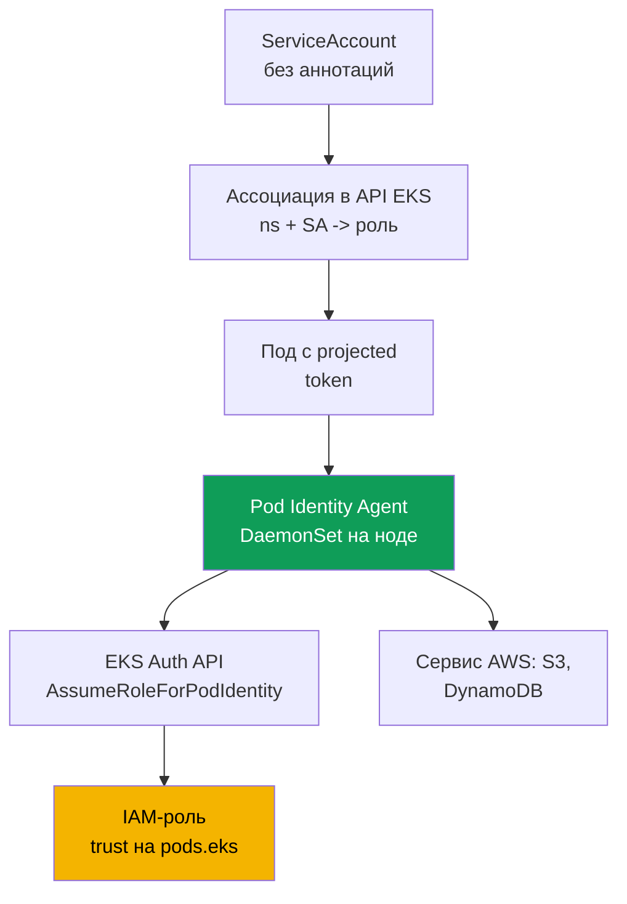
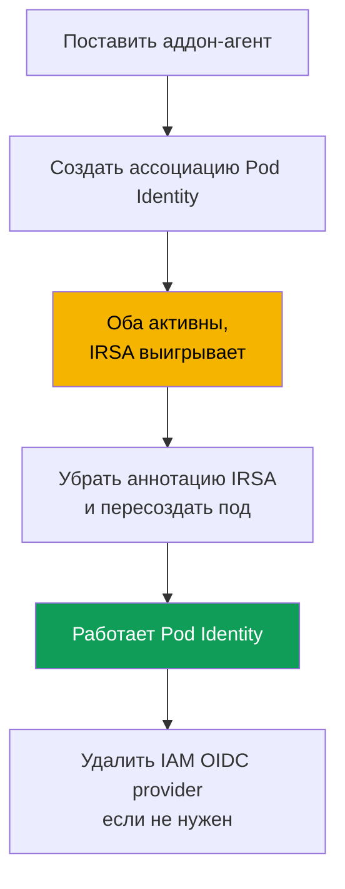

# Глава 17. EKS Pod Identity: агент, ассоциации, миграция с IRSA

> **Что дальше.** Глава 16 закрыла задачу «своя роль поду» через IRSA: OIDC-провайдер
> кластера, trust policy на `sub`, аннотация `ServiceAccount`. Здесь - другой механизм для
> той же задачи, EKS Pod Identity. Он появился позже и убирает главную боль IRSA: привязку
> trust policy к OIDC-провайдеру конкретного кластера. Разберём агента, ассоциации, прямое
> сравнение с IRSA и миграцию. Смежное - в других главах: доступ людей и CI (глава 5),
> секреты (глава 18), харденинг IMDSv2 (глава 19), аддоны EKS (глава 37), Fargate (глава 15).

## 17.1. «Скопировали роль в соседний кластер - и trust policy переписывать»

IRSA работает, и работает хорошо. Но у него есть цена, невидимая на одном кластере с парой
ролей и вырастающая в проблему на парке. Вспомним trust policy роли IRSA из главы 16:
`Principal.Federated` там - ARN IAM OIDC-провайдера **конкретного** кластера, а условие на
`sub` завязано на issuer URL **того же** кластера. Роль IRSA намертво привязана к одному
кластеру уже на уровне доверия.

Дальше начинается рутина сопровождения:

- **Роль не переносится между кластерами.** Скопировали приложение и его роль в соседний
  кластер - trust policy надо переписать: другой ARN провайдера, другой issuer URL в `sub`.
- **На каждую роль своя trust policy.** Сотня приложений - сотня политик доверия, и каждая
  ссылается на OIDC-провайдер своего кластера. Общего шаблона для переиспользования нет.
- **Масштаб на десятки кластеров - это ад.** Одно приложение в двадцати кластерах даёт
  двадцать вариантов trust policy одной по смыслу роли, и все надо держать в синхроне. Плюс
  в каждом кластере свой IAM OIDC provider, а в аккаунте есть лимит на их число.

Хочется связывать роль и `ServiceAccount` проще: без OIDC-провайдера в каждом кластере и без
переписывания trust policy при переносе. Ровно это делает EKS Pod Identity.

## 17.2. Что такое EKS Pod Identity

EKS Pod Identity решает ту же задачу иначе, чем IRSA. Вместо OIDC federation здесь три части:
**агент на ноде**, **API EKS для ассоциаций** и **единая trust policy** роли на общий
принципал сервиса `pods.eks.amazonaws.com`, не привязанная к конкретному кластеру.

- **EKS Pod Identity Agent** - под-агент, работающий как `DaemonSet` в namespace
  `kube-system` на каждой Linux-ноде. Ставится как managed-аддон EKS
  (`eks-pod-identity-agent`, механика аддонов - глава 37). На EKS Auto Mode агент встроен.
- **Ассоциация (association)** - запись в API EKS, связывающая тройку `кластер + namespace +
  ServiceAccount` с IAM-ролью. Ни аннотаций на `ServiceAccount`, ни объектов в кластере:
  ассоциация живёт в EKS, а не в Kubernetes.
- **Trust policy роли** доверяет сервису `pods.eks.amazonaws.com`, а не OIDC-провайдеру
  кластера. Одна политика годится для любого кластера, поэтому роль легко переиспользовать.

Механизма OIDC federation и обмена `AssumeRoleWithWebIdentity` (глава 16) здесь нет вовсе.
Креды роль получает через отдельный EKS Auth API, а раздаёт их подам локальный агент.

## 17.3. Как это работает по шагам

Настройка делается один раз, дальше при каждом старте пода креды выдаются автоматически.



Пошагово:

1. На кластер ставится аддон `eks-pod-identity-agent`, агент поднимается `DaemonSet` на всех
   нодах (раздел 17.5). Node IAM role должна разрешать `eks-auth:AssumeRoleForPodIdentity` -
   это уже есть в managed-политике `AmazonEKSWorkerNodePolicy` (глава 10).
2. Создаётся IAM-роль с trust policy на `pods.eks.amazonaws.com` (раздел 17.4).
3. Через API EKS создаётся ассоциация: `кластер + namespace + ServiceAccount -> ARN роли`.
4. При старте пода, чей `ServiceAccount` имеет ассоциацию, EKS добавляет в контейнеры
   projected-том с токеном (audience `pods.eks.amazonaws.com`) и переменные
   `AWS_CONTAINER_CREDENTIALS_FULL_URI` и `AWS_CONTAINER_AUTHORIZATION_TOKEN_FILE`.
5. Агент на ноде вызывает `AssumeRoleForPodIdentity` в EKS Auth API, получает временные креды
   роли и раздаёт их через локальный endpoint (link-local адрес `169.254.170.23`). AWS SDK в
   контейнере берёт креды из container credential provider стандартной цепочки, без кода.

Роль ассумит **сервис EKS Auth один раз на ноду**, а не каждый SDK в каждом поде, поэтому
нагрузка на STS ниже, чем в IRSA, где обмен токена делает SDK в каждом поде.

Важная связка с NetworkPolicy: за кредами SDK ходит на link-local `169.254.170.23`. Под с
`default-deny` egress их не получит, пока в политике нет egress-правила к `169.254.170.23/32`
(порт `80`). Как открыть именно этот адрес, не распахивая egress целиком, - в (глава 30).

## 17.4. Trust policy для Pod Identity

Вся суть переносимости - в trust policy. Она **единая** и не зависит от кластера.

```json
{
  "Version": "2012-10-17",
  "Statement": [
    {
      "Sid": "AllowEksAuthToAssumeRoleForPodIdentity",
      "Effect": "Allow",
      "Principal": {
        "Service": "pods.eks.amazonaws.com"
      },
      "Action": [
        "sts:AssumeRole",
        "sts:TagSession"
      ]
    }
  ]
}
```

- **`Principal.Service`** - `pods.eks.amazonaws.com`, общий принципал сервиса EKS Pod
  Identity. Он один на все кластеры и аккаунты, поэтому ARN OIDC-провайдера сюда не нужен.
- **`sts:AssumeRole`** - EKS Auth ассумит роль перед выдачей временных кредов поду.
- **`sts:TagSession`** - позволяет добавлять **session tags** в запрос к STS. Без него
  ассоциация с включёнными по умолчанию тегами сессии работать не будет, оба действия нужны.

Сравните с главой 16.5: там `Principal.Federated` - ARN OIDC-провайдера конкретного кластера,
действие `sts:AssumeRoleWithWebIdentity`, а условие на `sub` содержит issuer URL кластера.
Здесь ничего кластер-специфичного нет: одну роль с этой trust policy можно связать
ассоциациями в любом числе кластеров, не трогая политику доверия. Это убирает боль из 17.1.

Ограничить, какие namespace, `ServiceAccount` и кластеры могут принять роль, можно
**условиями на session tags** в trust policy: EKS сам проставляет теги сессии с кластером,
namespace и `ServiceAccount`, и на них навешивают `StringEquals`. В политиках эти теги
доступны как `aws:PrincipalTag/kubernetes-namespace`, `aws:PrincipalTag/eks-cluster-name`,
`aws:PrincipalTag/kubernetes-service-account` - например условие
`aws:PrincipalTag/kubernetes-namespace` равно `payments`.

## 17.5. Аддон-агент и ассоциации

Сначала аддон - обычный managed-аддон EKS (глава 37).

```bash
# поставить агент как аддон (один раз на кластер; на Auto Mode не нужно)
aws eks create-addon --cluster-name demo --addon-name eks-pod-identity-agent

# агент поднялся DaemonSet в kube-system?
kubectl get ds -n kube-system eks-pod-identity-agent
```

Дальше ассоциация. Она создаётся в EKS **одной командой**, без аннотаций на `ServiceAccount` и
без объектов в кластере. Сам `ServiceAccount` должен существовать и использоваться подом.

```bash
# связать namespace + SA с ролью
aws eks create-pod-identity-association \
  --cluster-name demo --namespace payments \
  --service-account s3-reader \
  --role-arn arn:aws:iam::111122223333:role/payments-s3-reader

# какие ассоциации есть на кластере
aws eks list-pod-identity-associations --cluster-name demo

# детали одной ассоциации по её id
aws eks describe-pod-identity-association \
  --cluster-name demo --association-id a-abcdefghijklmnop1
```

Ключевые свойства ассоциаций:

- **Одна роль - много ассоциаций.** Ту же роль связывают с разными `ServiceAccount` в разных
  namespace и кластерах: trust policy не меняется, меняются только записи ассоциаций. Один SA
  при этом имеет одну роль в аккаунте кластера; чтобы сменить роль, правят ассоциацию.
- **Session tags и ABAC.** EKS добавляет теги сессии (кластер, namespace, SA) для ABAC; их
  можно отключить. Ассоциации eventual consistent, их не создают в критичном пути запуска.

## 17.6. IRSA против Pod Identity предметно

Обе модели дают «свою роль поду». Разница - в том, как роль связывается с `ServiceAccount` и
чего это стоит в сопровождении. Углубим сравнение из главы 16.9.

| Свойство | IRSA | EKS Pod Identity |
|---|---|---|
| Механизм | OIDC federation, обмен через STS | агент на ноде и EKS Auth API |
| Trust policy роли | `Federated` на OIDC-провайдер кластера | `Service` `pods.eks.amazonaws.com`, общий |
| Действия в trust policy | `sts:AssumeRoleWithWebIdentity` | `sts:AssumeRole` + `sts:TagSession` |
| Настройка на кластер | IAM OIDC provider на кластер | аддон-агент `eks-pod-identity-agent` |
| Привязка к SA | аннотация `eks.amazonaws.com/role-arn` | ассоциация в API EKS, аннотаций нет |
| Переносимость роли | trust policy переписывать под каждый | одна trust policy на все кластеры |
| Кросс-аккаунт | напрямую через OIDC federation | через делегирование (assume role в цель) |
| Вне EKS (EC2, ECS, Lambda) | работает по OIDC | нет, только Linux-ноды EKS |
| Session tags и ABAC | вручную | из коробки, теги проставляются сами |
| Зрелость | давний, широко распространён | новее (с конца 2023), дефолт для нового |

Коротко: IRSA гибче на границах (кросс-аккаунт по OIDC, федерация вне EKS), но многословнее и
плохо переносится. Pod Identity проще связывать и переиспользовать, но привязан к EKS и Linux.

## 17.7. Когда что выбирать

Для новых кластеров на EC2-нодах Pod Identity - разумный выбор по умолчанию: настройка проще
(аддон вместо OIDC-провайдера на кластер), роль переносима, session tags и ABAC доступны
сразу. Но у механизма есть ограничения, которые надо сверять с документацией.

| Сценарий | Что выбрать | Почему |
|---|---|---|
| Новый кластер на EC2-нодах | Pod Identity | проще настройка, переносимость, ABAC из коробки |
| Кросс-аккаунт по OIDC федерации | IRSA | Pod Identity просит делегирование через assume role |
| Нагрузка на Fargate | IRSA | Pod Identity на Fargate не поддерживается |
| Windows-ноды | IRSA | Pod Identity - только Linux Amazon EC2 |
| Идентичность вне EKS | IRSA | Pod Identity привязан к нодам EKS |
| Старая версия платформы | сверить | Pod Identity требует минимальную platform version |

Проверенные на момент написания ограничения Pod Identity: только **Linux-ноды Amazon EC2**;
**Fargate не поддерживается** (ни Linux, ни Windows pods); Windows-ноды не поддерживаются;
недоступен на Outposts и EKS Anywhere; кластер не ниже минимальной platform version (для
старых минорных версий это `eks.4`). Список сверяйте по докам: он сокращается со временем.

## 17.8. Миграция с IRSA на Pod Identity

Миграция безопасная и допускает переходный период, когда на одном `ServiceAccount` живут
**и** аннотация IRSA, **и** ассоциация Pod Identity. Порядок предпочтения кредов решает всё.



Кто побеждает при одновременной настройке. IRSA отдаёт креды через **web identity token
provider**, а Pod Identity - через **container credential provider**, и в стандартной цепочке
AWS SDK web identity стоит **раньше** контейнерного. Поэтому если на одном `ServiceAccount`
есть и аннотация IRSA, и ассоциация Pod Identity, **выигрывает IRSA**, а ассоциация
игнорируется: креды, что стоят раньше в цепочке, используются даже после создания ассоциации.
Это удобно для миграции: ассоциацию создают заранее, а переключение идёт при удалении IRSA.

Порядок миграции:

1. Поставить аддон `eks-pod-identity-agent` и убедиться, что `DaemonSet` запущен.
2. Обновить trust policy роли на `pods.eks.amazonaws.com` (или завести отдельные роли под Pod
   Identity). Permissions policy роли остаётся прежней.
3. Создать ассоциацию для того же `namespace + ServiceAccount`. Пока жива аннотация IRSA, под
   продолжает ходить под IRSA - ничего не сломалось.
4. Снять с `ServiceAccount` аннотацию `eks.amazonaws.com/role-arn` и **пересоздать под**:
   теперь web identity в цепочке нет, и SDK берёт креды Pod Identity.
5. Проверить `aws sts get-caller-identity` из пода, затем убрать ненужное - trust policy на
   OIDC, а если ролей IRSA не осталось, то и IAM OIDC identity provider.

## 17.9. Диагностика

Порядок тот же, что в главе 16.7: от инфраструктуры к поду и наружу.

```bash
# 1. агент запущен на всех нодах?
kubectl get ds -n kube-system eks-pod-identity-agent

# 2. ассоциация для нужного namespace и SA существует?
aws eks list-pod-identity-associations --cluster-name demo --namespace payments

# 3. кем под видит себя в AWS - assumed-role нужной роли, а не роль ноды
kubectl -n payments exec deploy/my-app -- aws sts get-caller-identity
```

Ключевая проверка - `get-caller-identity` из пода: если в `Arn` видна `assumed-role` вашей
роли, Pod Identity сработал и проблема (если есть) в permissions policy роли; если видна роль
ноды - креды до пода не дошли, и причина выше по таблице.

| Симптом | Вероятная причина | Что проверить |
|---|---|---|
| SDK ходит под ролью ноды | агент не запущен или ассоциации нет | `DaemonSet` агента, `list-pod-identity-associations` |
| Под создан, а кредов нет | ассоциация создана после старта пода | пересоздать под (eventual consistency) |
| Ходит под ролью IRSA | на SA осталась аннотация IRSA | снять аннотацию, пересоздать под |
| `AccessDenied` на вызове сервиса | у роли нет нужной permissions policy | политику разрешений роли |
| Таймаут при получении кредов | `default-deny` egress режет `169.254.170.23` | egress к `169.254.170.23/32` в NetworkPolicy (глава 30) |
| Роль не видна для ассоциации | нет trust policy на `pods.eks` | trust policy роли (раздел 17.4) |
| Агент не стартует | отключён IPv6 на ноде | конфигурацию IPv6 агента |

Частая грабля - забытый `sts:TagSession` в trust policy: ассоциация с включёнными по
умолчанию session tags не сработает, пока в политике доверия нет обоих действий.

## 17.10. Как это применяют в продакшене

- **Для новых кластеров на EC2 берут Pod Identity по умолчанию** - за переносимость роли и
  простую настройку. IRSA оставляют для кросс-аккаунта, Fargate, Windows и сценариев вне EKS.
- **Агент ставят аддоном в IaC** вместе с кластером, а не руками потом. На EKS Auto Mode агент
  встроен, и отдельный аддон не нужен.
- **Роль под Pod Identity переиспользуют между кластерами** через ассоциации: trust policy
  одна, а связок `namespace + SA -> роль` много, что снимает дублирование из раздела 17.1.
- **Ограничивают роль через ABAC на session tags** (кластер, namespace, SA) в условиях trust
  или permissions policy, вместо точного `sub`, как это делалось в IRSA.
- **Мигрируют без простоя**: создают ассоциацию заранее, пока IRSA ещё выигрывает в цепочке, и
  переключаются только снятием аннотации и пересозданием пода. Node IAM role при этом должна
  разрешать `eks-auth:AssumeRoleForPodIdentity` - в `AmazonEKSWorkerNodePolicy` оно уже есть.

## 17.11. Мини-глоссарий

- **EKS Pod Identity** - механизм выдачи IAM-роли поду через агент на ноде и API EKS, без
  OIDC-провайдера кластера и без trust policy, привязанной к конкретному кластеру.
- **EKS Pod Identity Agent** - аддон `eks-pod-identity-agent`, работающий `DaemonSet` на нодах
  и раздающий подам временные креды через локальный endpoint.
- **Ассоциация (association)** - запись в API EKS, связывающая `кластер + namespace +
  ServiceAccount` с IAM-ролью; создаётся `aws eks create-pod-identity-association`.
- **`pods.eks.amazonaws.com`** - принципал сервиса в trust policy роли Pod Identity; общий для
  всех кластеров и аккаунтов. Креды роли выдаёт EKS Auth API по `AssumeRoleForPodIdentity`.
- **Session tags** - теги сессии (кластер, namespace, SA), которые Pod Identity добавляет в
  запрос к STS и на которых строят ABAC; в политиках - `aws:PrincipalTag/kubernetes-namespace`
  и `aws:PrincipalTag/eks-cluster-name`; требуют `sts:TagSession` в trust policy.

## 17.12. Итоги главы

- Боль IRSA не в самом механизме, а в сопровождении: trust policy роли привязана к
  OIDC-провайдеру кластера, роль не переносится, и на парке кластеров это ад синхрона.
- EKS Pod Identity даёт «свою роль поду» иначе: агент `DaemonSet` на ноде, ассоциация в API
  EKS и единая trust policy на `pods.eks.amazonaws.com`, не завязанная на кластер.
- Trust policy роли Pod Identity доверяет `pods.eks.amazonaws.com` с действиями
  `sts:AssumeRole` и `sts:TagSession`; OIDC-провайдера и условия на `sub` здесь нет.
- Ассоциация связывает `кластер + namespace + ServiceAccount` с ролью одной командой
  `aws eks create-pod-identity-association`; аннотаций на SA и объектов в кластере не нужно.
  Одна роль переиспользуется во многих ассоциациях и кластерах без правки trust policy.
- Ограничения Pod Identity: только Linux EC2-ноды, нет Fargate и Windows - сверяйте по докам.
- При одновременной настройке IRSA и Pod Identity на одном SA выигрывает IRSA: web identity
  стоит раньше container credential provider в цепочке SDK. Это делает миграцию безопасной:
  аддон-агент, trust policy на `pods.eks`, ассоциация, затем снять аннотацию IRSA, рестарт.
- Диагностика идёт от агента к ассоциации и поду: `DaemonSet` запущен, ассоциация есть,
  `aws sts get-caller-identity` из пода показывает assumed-role роли, а не роль ноды.

## 17.13. Как это пригодится в реальной работе

На парке из десятков кластеров вопрос «одно приложение - одна роль во всех кластерах» с Pod
Identity решается одной ролью и набором ассоциаций, а не десятком копий trust policy. При новом
кластере не нужно поднимать OIDC-провайдер и следить за лимитом провайдеров: достаточно
аддона-агента. На дежурстве обращения «под не видит своих прав в AWS» закрываются цепочкой из
раздела 17.9: агент, ассоциация, `get-caller-identity`. А знание, что при двойной настройке
выигрывает IRSA, экономит часы на загадке «ассоциацию создал, а под ходит под старой ролью».

## 17.14. Вопросы для самопроверки

1. В чём главная боль IRSA при масштабировании на парк кластеров, и где в trust policy зашита
   привязка к конкретному кластеру?
2. Из каких трёх частей состоит EKS Pod Identity и что живёт в Kubernetes, а что в API EKS?
3. Как EKS Pod Identity Agent устроен на ноде и как ставится на кластер?
4. Что стоит в `Principal` trust policy роли Pod Identity и почему эта политика переносима?
5. Зачем в trust policy нужны сразу два действия - `sts:AssumeRole` и `sts:TagSession`?
6. Какой командой создаётся ассоциация и какие поля она связывает? Нужна ли аннотация на SA?
7. Может ли одна роль обслуживать несколько `ServiceAccount` в разных кластерах? За счёт чего?
8. Назовите три ограничения Pod Identity, из-за которых придётся выбрать IRSA.
9. Кто побеждает, если на одном SA есть и аннотация IRSA, и ассоциация Pod Identity, и почему?
10. Опишите порядок миграции без простоя. Где именно происходит переключение?
11. Как одной командой из пода понять, сработал ли Pod Identity, и отличить от нехватки прав?
12. Под создан, ассоциация есть, а он ходит под ролью ноды. Назовите две вероятные причины.

## Практика

Своей лабы у главы пока нет, но всё проверяется на живом кластере. Поставьте аддон командой
`aws eks create-addon --cluster-name <cluster> --addon-name eks-pod-identity-agent` и
убедитесь, что `kubectl get ds -n kube-system eks-pod-identity-agent` показывает запущенный
`DaemonSet` на всех нодах. Заведите IAM-роль с trust policy на `pods.eks.amazonaws.com`
(действия `sts:AssumeRole` и `sts:TagSession`) и permissions policy только на чтение бакета.

Создайте ассоциацию через `aws eks create-pod-identity-association` для тестового namespace и
`ServiceAccount`, запустите под с этим SA и выполните в нём `aws sts get-caller-identity` - в
`Arn` должна быть assumed-role вашей роли, а не роль ноды. Посмотрите
`aws eks list-pod-identity-associations` и `aws eks describe-pod-identity-association` по её
id. Отдельно повторите сценарий из главы 16 с IRSA на том же SA: навесьте аннотацию
`eks.amazonaws.com/role-arn`, пересоздайте под и убедитесь, что теперь под ходит под ролью
IRSA - это и есть тот самый порядок предпочтения в цепочке. Затем снимите аннотацию,
пересоздайте под и увидите, как управление возвращается к Pod Identity.

---
[Оглавление](../README_RU.md) · [Глава 16](../16/ru.md) · [Глава 18](../18/ru.md)
