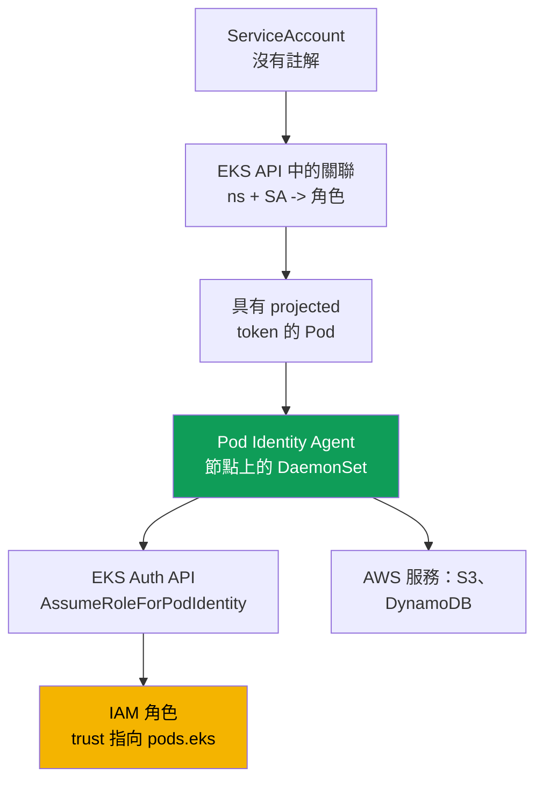
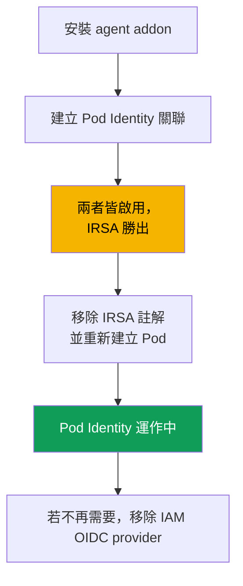

[English version](en.md) · [Versión en español](es.md) · [Version française](fr.md) · [Deutsche Version](de.md) · [ქართული ვერსია](ge.md) · [Русская версия](ru.md) · [日本語版](jp.md)
# 第 17 章。EKS Pod Identity：代理程式、關聯，以及從 IRSA 遷移

> **接下來。** 第 16 章透過 IRSA 完成了「為 Pod 配置專屬角色」的任務：叢集 OIDC provider、對 `sub` 的 trust policy，以及 `ServiceAccount` 註解。本章介紹同一任務的另一種機制，即 EKS Pod Identity。它推出較晚，並消除了 IRSA 最主要的痛點：trust policy 與特定叢集 OIDC provider 的綁定。我們將介紹代理程式、關聯、直接比較，以及遷移。相關主題見其他章節：人員與 CI 存取權（第 5 章）、Secret（第 18 章）、IMDSv2 強化（第 19 章）、EKS addon（第 37 章）、Fargate（第 15 章）。

## 17.1.「把角色複製到相鄰叢集，卻還要重寫 trust policy」

IRSA 能正常運作，而且運作得很好。但它有一項成本，在只有少量角色的單一叢集中並不明顯，到了大量叢集時便會成為問題。回想第 16 章的 IRSA 角色 trust policy：其中的 `Principal.Federated` 是**特定**叢集 IAM OIDC provider 的 ARN，而對 `sub` 的條件則綁定**同一個**叢集的 issuer URL。IRSA 角色在信任層級就牢牢綁定於單一叢集。

接著便是例行維護工作：

- **角色無法在叢集之間移轉。** 將應用程式及其角色複製到相鄰叢集後，必須重寫 trust policy：provider ARN 不同，`sub` 中的 issuer URL 也不同。
- **每個角色都有自己的 trust policy。** 一百個應用程式就是一百個信任政策，且每一個都參照其叢集的 OIDC provider。沒有可重複使用的通用範本。
- **擴展至數十個叢集就是惡夢。** 同一應用程式在二十個叢集中，會產生同一用途角色的二十種 trust policy 版本，且全部都必須保持同步。此外，每個叢集各有一個 IAM OIDC provider，而帳戶對其數量設有限制。

我們希望能更簡單地連結角色與 `ServiceAccount`：每個叢集不必有 OIDC provider，移轉時也不必重寫 trust policy。EKS Pod Identity 正是為此而生。

## 17.2. 什麼是 EKS Pod Identity

EKS Pod Identity 以不同於 IRSA 的方式解決相同問題。它不是 OIDC federation，而是由三個部分組成：**節點上的代理程式**、**用於關聯的 EKS API**，以及角色對共用服務 principal `pods.eks.amazonaws.com` 的**統一 trust policy**，不再綁定特定叢集。

- **EKS Pod Identity Agent**：在每個 Linux 節點 `kube-system` namespace 中以 `DaemonSet` 執行的 Pod 代理程式。它以 EKS managed addon（`eks-pod-identity-agent`，addon 機制見第 37 章）安裝。在 EKS Auto Mode 中，代理程式已內建。
- **關聯（association）**：EKS API 中的一筆記錄，將三元組 `叢集 + namespace + ServiceAccount` 連結至 IAM 角色。不需要在 `ServiceAccount` 加註解，也不需要叢集物件：關聯存在 EKS 中，而非 Kubernetes 中。
- **角色的 trust policy** 信任服務 `pods.eks.amazonaws.com`，而不是叢集 OIDC provider。同一政策適用於任何叢集，因此角色易於重複使用。

此處完全沒有 OIDC federation 機制，也沒有 `AssumeRoleWithWebIdentity` 交換（第 16 章）。角色憑證透過獨立的 EKS Auth API 取得，並由本機代理程式分發給 Pod。

## 17.3. 運作步驟

設定只需進行一次，之後每次 Pod 啟動時都會自動發放憑證。



逐步說明：

1. 在叢集上安裝 `eks-pod-identity-agent` addon，代理程式會在所有節點上以 `DaemonSet` 執行（第 17.5 節）。Node IAM role 必須允許 `eks-auth:AssumeRoleForPodIdentity`，這已包含在 managed policy `AmazonEKSWorkerNodePolicy` 中（第 10 章）。
2. 建立 trust policy 指向 `pods.eks.amazonaws.com` 的 IAM 角色（第 17.4 節）。
3. 透過 EKS API 建立關聯：`叢集 + namespace + ServiceAccount -> 角色 ARN`。
4. 啟動 Pod 時，若其 `ServiceAccount` 有關聯，EKS 會在容器中加入一個含 token 的 projected volume（audience 為 `pods.eks.amazonaws.com`），以及環境變數 `AWS_CONTAINER_CREDENTIALS_FULL_URI` 和 `AWS_CONTAINER_AUTHORIZATION_TOKEN_FILE`。
5. 節點上的代理程式向 EKS Auth API 呼叫 `AssumeRoleForPodIdentity`，取得角色的暫時憑證，並透過本機 endpoint（link-local 位址 `169.254.170.23`）分發給 Pod。容器內的 AWS SDK 會從標準鏈結中的 container credential provider 取得憑證，不需要程式碼。

角色由**每個節點一次**的 EKS Auth 服務 assume，而非每個 Pod 中的每個 SDK 各自 assume，因此相較於每個 Pod 的 SDK 都要交換 token 的 IRSA，STS 負載更低。

與 NetworkPolicy 的重要關聯：SDK 會前往 link-local `169.254.170.23` 取得憑證。若 Pod 採用 `default-deny` egress，除非政策中存在前往 `169.254.170.23/32`（連接埠 `80`）的 egress 規則，否則無法取得憑證。如何只開放此位址而不將整個 egress 大開，見第 30 章。

## 17.4. Pod Identity 的 trust policy

可移植性的核心在於 trust policy。它是**統一的**，且不依賴叢集。

```json
{
  "Version": "2012-10-17",
  "Statement": [
    {
      "Sid": "AllowEksAuthToAssumeRoleForPodIdentity",
      "Effect": "Allow",
      "Principal": {
        "Service": "pods.eks.amazonaws.com"
      },
      "Action": [
        "sts:AssumeRole",
        "sts:TagSession"
      ]
    }
  ]
}
```

- **`Principal.Service`**：`pods.eks.amazonaws.com`，EKS Pod Identity 的共用服務 principal。所有叢集與帳戶都只有同一個，因此不需要在此放置 OIDC provider ARN。
- **`sts:AssumeRole`**：EKS Auth 在向 Pod 發放暫時憑證前 assume 此角色。
- **`sts:TagSession`**：允許將 **session tags** 加入 STS 請求。若沒有它，啟用預設 session tags 的關聯將無法運作，因此兩項 action 都必須存在。

與第 16.5 節比較：該處的 `Principal.Federated` 是特定叢集 OIDC provider 的 ARN，action 是 `sts:AssumeRoleWithWebIdentity`，而對 `sub` 的條件包含叢集 issuer URL。此處沒有任何叢集特定內容：使用這個 trust policy 的單一角色可透過關聯連結至任意數量的叢集，無須修改信任政策。這消除了 17.1 所述的痛點。

可在 trust policy 中使用**session tags 條件**，限制哪些 namespace、`ServiceAccount` 和叢集能 assume 角色：EKS 會自行設定含叢集、namespace 與 `ServiceAccount` 的 session tags，並可對它們套用 `StringEquals`。在政策中，這些 tags 可作為 `aws:PrincipalTag/kubernetes-namespace`、`aws:PrincipalTag/eks-cluster-name`、`aws:PrincipalTag/kubernetes-service-account` 使用，例如讓 `aws:PrincipalTag/kubernetes-namespace` 等於 `payments` 的條件。

## 17.5. Agent addon 與關聯

首先是 addon，它是一般的 EKS managed addon（第 37 章）。

```bash
# 將代理程式安裝為 addon（每個叢集一次；Auto Mode 不需要）
aws eks create-addon --cluster-name demo --addon-name eks-pod-identity-agent

# 代理程式是否已在 kube-system 中以 DaemonSet 啟動？
kubectl get ds -n kube-system eks-pod-identity-agent
```

接著建立關聯。它以**一條命令**在 EKS 中建立，不需要 `ServiceAccount` 註解，也不需要叢集物件。`ServiceAccount` 本身必須存在且由 Pod 使用。

```bash
# 將 namespace + SA 連結至角色
aws eks create-pod-identity-association \
  --cluster-name demo --namespace payments \
  --service-account s3-reader \
  --role-arn arn:aws:iam::111122223333:role/payments-s3-reader

# 此叢集有哪些關聯
aws eks list-pod-identity-associations --cluster-name demo

# 依 id 查看一個關聯的詳細資料
aws eks describe-pod-identity-association \
  --cluster-name demo --association-id a-abcdefghijklmnop1
```

關聯的主要特性：

- **一個角色，多個關聯。** 同一角色可連結至不同 namespace 與叢集中的不同 `ServiceAccount`：trust policy 不變，只有關聯記錄改變。同一 SA 在叢集帳戶中只能有一個角色；若要變更角色，需編輯關聯。
- **Session tags 與 ABAC。** EKS 會為 ABAC 加入 session tags（叢集、namespace、SA），也可將其停用。關聯為 eventual consistent，不應在啟動的關鍵路徑上建立。

## 17.6. IRSA 與 Pod Identity 的具體比較

兩種模型都能提供「Pod 的專屬角色」。差異在於角色如何連結至 `ServiceAccount`，以及維護成本。以下延伸第 16.9 節的比較。

| 特性 | IRSA | EKS Pod Identity |
|---|---|---|
| 機制 | OIDC federation，透過 STS 交換 | 節點上的代理程式與 EKS Auth API |
| 角色 trust policy | 對叢集 OIDC provider 的 `Federated` | 共用的 `Service` `pods.eks.amazonaws.com` |
| trust policy 中的 action | `sts:AssumeRoleWithWebIdentity` | `sts:AssumeRole` + `sts:TagSession` |
| 每個叢集的設定 | 每個叢集一個 IAM OIDC provider | `eks-pod-identity-agent` addon |
| 與 SA 的綁定 | `eks.amazonaws.com/role-arn` 註解 | EKS API 中的關聯，無註解 |
| 角色可移植性 | 必須為每個叢集重寫 trust policy | 一個 trust policy 適用所有叢集 |
| 跨帳戶 | 直接透過 OIDC federation | 透過委派（在目標中 assume role） |
| EKS 外部（EC2、ECS、Lambda） | 可透過 OIDC 運作 | 不可，僅限 EKS Linux 節點 |
| Session tags 與 ABAC | 手動處理 | 開箱即用，tags 自動設定 |
| 成熟度 | 歷史悠久且廣泛使用 | 較新（自 2023 年底起），新環境的預設選擇 |

簡言之：IRSA 在邊界情境較為靈活（經 OIDC 的跨帳戶，以及 EKS 外 federation），但較冗長且不易移轉。Pod Identity 較容易連結與重複使用，但綁定於 EKS 與 Linux。

## 17.7. 何時選擇何者

對於採用 EC2 節點的新叢集，Pod Identity 是合理的預設選擇：設定較簡單（addon 取代每個叢集的 OIDC provider）、角色可移植，且可立即使用 session tags 與 ABAC。但該機制有限制，必須與文件核對。

| 情境 | 選擇 | 原因 |
|---|---|---|
| 使用 EC2 節點的新叢集 | Pod Identity | 設定較簡單、可移植、內建 ABAC |
| 透過 OIDC federation 跨帳戶 | IRSA | Pod Identity 需要透過 assume role 委派 |
| Fargate 工作負載 | IRSA | Pod Identity 不支援 Fargate |
| Windows 節點 | IRSA | Pod Identity 僅限 Linux Amazon EC2 |
| EKS 外的身分 | IRSA | Pod Identity 綁定 EKS 節點 |
| 舊版 platform version | 核對 | Pod Identity 要求最低 platform version |

撰寫時已驗證的 Pod Identity 限制：僅支援 **Linux Amazon EC2 節點**；**不支援 Fargate**（Linux 或 Windows Pod 均不支援）；不支援 Windows 節點；在 Outposts 與 EKS Anywhere 上不可用；叢集不得低於最低 platform version（對舊的 minor version 為 `eks.4`）。請依文件核對清單，因為它會隨時間縮減。

## 17.8. 從 IRSA 遷移至 Pod Identity

遷移是安全的，並允許過渡期，在同一個 `ServiceAccount` 上同時存在 **IRSA 註解**與 **Pod Identity 關聯**。憑證的優先順序決定一切。



同時設定時誰勝出。IRSA 透過 **web identity token provider** 提供憑證，而 Pod Identity 則透過 **container credential provider** 提供；在標準 AWS SDK 鏈結中，web identity 位於 container 之前。因此，若單一 `ServiceAccount` 同時有 IRSA 註解與 Pod Identity 關聯，**IRSA 勝出**，關聯會被忽略：即使已建立關聯，鏈結中較早的憑證仍會被使用。這使遷移更便利：預先建立關聯，移除 IRSA 後才切換。

遷移順序：

1. 安裝 `eks-pod-identity-agent` addon，並確認 `DaemonSet` 已執行。
2. 將角色 trust policy 更新為 `pods.eks.amazonaws.com`（或為 Pod Identity 建立獨立角色）。角色的 permissions policy 保持不變。
3. 為相同的 `namespace + ServiceAccount` 建立關聯。只要 IRSA 註解仍存在，Pod 仍會使用 IRSA，不會發生中斷。
4. 從 `ServiceAccount` 移除 `eks.amazonaws.com/role-arn` 註解並**重新建立 Pod**：此時鏈結中不再有 web identity，SDK 會取得 Pod Identity 憑證。
5. 從 Pod 執行 `aws sts get-caller-identity` 進行檢查，然後移除不再需要的項目：OIDC trust policy，若已沒有 IRSA 角色，也移除 IAM OIDC identity provider。

## 17.9. 診斷

順序與第 16.7 節相同：從基礎設施到 Pod，再到外部。

```bash
# 1. 代理程式是否在所有節點上執行？
kubectl get ds -n kube-system eks-pod-identity-agent

# 2. 所需 namespace 與 SA 的關聯是否存在？
aws eks list-pod-identity-associations --cluster-name demo --namespace payments

# 3. Pod 在 AWS 中認為自己是誰：應為所需角色的 assumed-role，而非節點角色
kubectl -n payments exec deploy/my-app -- aws sts get-caller-identity
```

關鍵檢查是在 Pod 內執行 `get-caller-identity`：若 `Arn` 顯示的是您角色的 `assumed-role`，Pod Identity 已生效，問題（若有）是在角色的 permissions policy；若顯示節點角色，表示憑證尚未到達 Pod，原因可由下表往上追查。

| 症狀 | 可能原因 | 檢查項目 |
|---|---|---|
| SDK 使用節點角色 | agent 未執行或沒有關聯 | agent 的 `DaemonSet`、`list-pod-identity-associations` |
| Pod 已建立但沒有憑證 | 關聯於 Pod 啟動後建立 | 重新建立 Pod（eventual consistency） |
| 使用 IRSA 角色 | SA 上仍有 IRSA 註解 | 移除註解，重新建立 Pod |
| 呼叫服務時出現 `AccessDenied` | 角色缺少所需 permissions policy | 角色 permissions policy |
| 取得憑證逾時 | `default-deny` egress 阻擋 `169.254.170.23` | NetworkPolicy 中通往 `169.254.170.23/32` 的 egress（第 30 章） |
| 角色無法用於關聯 | 沒有指向 `pods.eks` 的 trust policy | 角色 trust policy（第 17.4 節） |
| agent 無法啟動 | 節點已停用 IPv6 | agent IPv6 設定 |

常見陷阱是忘記在 trust policy 中加入 `sts:TagSession`：啟用預設 session tags 的關聯，在信任政策含有兩個 action 前不會生效。

## 17.10. 在正式環境中的應用方式

- **新的 EC2 叢集預設使用 Pod Identity**，因為角色可移植且設定簡單。IRSA 保留給跨帳戶、Fargate、Windows，以及 EKS 外部情境。
- **在 IaC 中與叢集一同安裝 agent addon**，不要事後手動安裝。在 EKS Auto Mode 中 agent 已內建，不需獨立 addon。
- **透過關聯在叢集間重複使用 Pod Identity 角色**：trust policy 只有一份，但有許多 `namespace + SA -> 角色` 連結，避免第 17.1 節所述的重複。
- **在 trust 或 permissions policy 條件中，透過 session tags 的 ABAC 限制角色**（叢集、namespace、SA），而不是像 IRSA 那樣使用精確的 `sub`。
- **無停機遷移**：在 IRSA 尚於鏈結中勝出時預先建立關聯，然後僅透過移除註解與重新建立 Pod 切換。同時 Node IAM role 必須允許 `eks-auth:AssumeRoleForPodIdentity`，此權限已包含在 `AmazonEKSWorkerNodePolicy`。

## 17.11. 迷你詞彙表

- **EKS Pod Identity**：透過節點上的 agent 與 EKS API 向 Pod 發放 IAM 角色的機制，不需要叢集 OIDC provider，也不需要綁定特定叢集的 trust policy。
- **EKS Pod Identity Agent**：addon `eks-pod-identity-agent`，在節點上以 `DaemonSet` 執行，並透過本機 endpoint 向 Pod 分發暫時憑證。
- **關聯（association）**：EKS API 中將 `叢集 + namespace + ServiceAccount` 連結至 IAM 角色的記錄；透過 `aws eks create-pod-identity-association` 建立。
- **`pods.eks.amazonaws.com`**：Pod Identity 角色 trust policy 中的服務 principal，所有叢集與帳戶共用。角色憑證由 EKS Auth API 經由 `AssumeRoleForPodIdentity` 發放。
- **Session tags**：Pod Identity 加入 STS 請求的 session tags（叢集、namespace、SA），可據此建立 ABAC；在政策中為 `aws:PrincipalTag/kubernetes-namespace` 與 `aws:PrincipalTag/eks-cluster-name`；在 trust policy 中需要 `sts:TagSession`。

## 17.12. 本章總結

- IRSA 的痛點不在機制本身，而在維護：角色 trust policy 綁定叢集 OIDC provider，角色無法移轉，而在大量叢集環境中同步工作十分痛苦。
- EKS Pod Identity 以不同方式提供「Pod 的專屬角色」：節點上的 `DaemonSet` agent、EKS API 中的關聯，以及不綁定叢集的統一 `pods.eks.amazonaws.com` trust policy。
- Pod Identity 角色的 trust policy 信任帶有 `sts:AssumeRole` 與 `sts:TagSession` action 的 `pods.eks.amazonaws.com`；此處沒有 OIDC provider，也沒有對 `sub` 的條件。
- 關聯透過一條 `aws eks create-pod-identity-association` 命令，將 `叢集 + namespace + ServiceAccount` 連結至角色；不需要 SA 註解或叢集物件。同一角色可在許多關聯與叢集中重複使用，無須編輯 trust policy。
- Pod Identity 限制：僅 Linux EC2 節點，不支援 Fargate 與 Windows，請依文件核對。
- 在同一 SA 上同時設定 IRSA 與 Pod Identity 時，IRSA 勝出：web identity 在 SDK 鏈結中早於 container credential provider。這使遷移安全：agent addon、對 `pods.eks` 的 trust policy、關聯，然後移除 IRSA 註解並重啟。
- 診斷應從 agent 到關聯再到 Pod：`DaemonSet` 正在執行、關聯存在、Pod 中的 `aws sts get-caller-identity` 顯示角色的 assumed-role，而不是節點角色。

## 17.13. 這在實際工作中的用途

在包含數十個叢集的環境中，「一個應用程式在所有叢集使用一個角色」透過 Pod Identity 可用一個角色與一組關聯解決，而不需十幾份 trust policy 副本。建立新叢集時無須配置 OIDC provider 或留意 provider 限制，只需 agent addon。在值班時，可透過第 17.9 節的鏈結處理「Pod 看不到其 AWS 權限」的問題：agent、關聯、`get-caller-identity`。而知道雙重設定時 IRSA 會勝出，可節省排查「已建立關聯，但 Pod 仍使用舊角色」的數小時。

## 17.14. 自我檢查問題

1. IRSA 擴展至大量叢集時的主要痛點是什麼？trust policy 中哪個位置嵌入了對特定叢集的綁定？
2. EKS Pod Identity 由哪三個部分構成？哪些存在於 Kubernetes，哪些存在於 EKS API？
3. EKS Pod Identity Agent 在節點上如何運作，又如何安裝到叢集？
4. Pod Identity 角色 trust policy 的 `Principal` 是什麼？為什麼該政策可移植？
5. trust policy 為何同時需要 `sts:AssumeRole` 與 `sts:TagSession` 兩個 action？
6. 用哪一條命令建立關聯，它連結哪些欄位？SA 需要註解嗎？
7. 一個角色能否服務不同叢集中的多個 `ServiceAccount`？原因是什麼？
8. 請列出三項必須改選 IRSA 的 Pod Identity 限制。
9. 若同一 SA 同時有 IRSA 註解與 Pod Identity 關聯，誰勝出？為什麼？
10. 請描述無停機的遷移順序。切換確切發生在哪個步驟？
11. 如何從 Pod 使用一條命令判定 Pod Identity 是否生效，並與權限不足區別？
12. Pod 已建立且關聯存在，但它使用的是節點角色。請列出兩個可能原因。

## 實作

本課程對應實驗：[實驗 104：應用程式的 Workload identity：IRSA 與 Pod Identity](../../labs/104/README_TW.MD)。此外，所有內容都可在實際叢集上驗證。使用以下命令安裝 addon：
`aws eks create-addon --cluster-name <cluster> --addon-name eks-pod-identity-agent`，並確認 `kubectl get ds -n kube-system eks-pod-identity-agent` 顯示 `DaemonSet` 已在所有節點上執行。建立 trust policy 指向 `pods.eks.amazonaws.com` 的 IAM 角色（action 為 `sts:AssumeRole` 與 `sts:TagSession`），並只給予讀取 bucket 的 permissions policy。

為測試 namespace 與 `ServiceAccount` 使用 `aws eks create-pod-identity-association` 建立關聯，以該 SA 啟動 Pod，並在其中執行 `aws sts get-caller-identity`：`Arn` 應為您角色的 assumed-role，而不是節點角色。查看 `aws eks list-pod-identity-associations`，並以其 id 執行 `aws eks describe-pod-identity-association`。另外，在同一 SA 上重複第 16 章的 IRSA 情境：新增 `eks.amazonaws.com/role-arn` 註解，重新建立 Pod，並確認 Pod 現在使用 IRSA 角色，這正是鏈結中的優先順序。然後移除註解，再次重新建立 Pod，您將看到控制權回到 Pod Identity。

---
[目錄](../README_TW.md) · [第 16 章](../16/tw.md) · [第 18 章](../18/tw.md)
