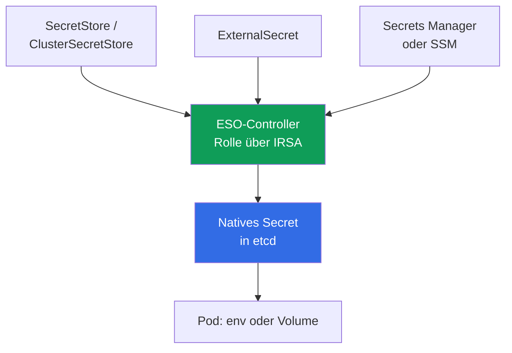
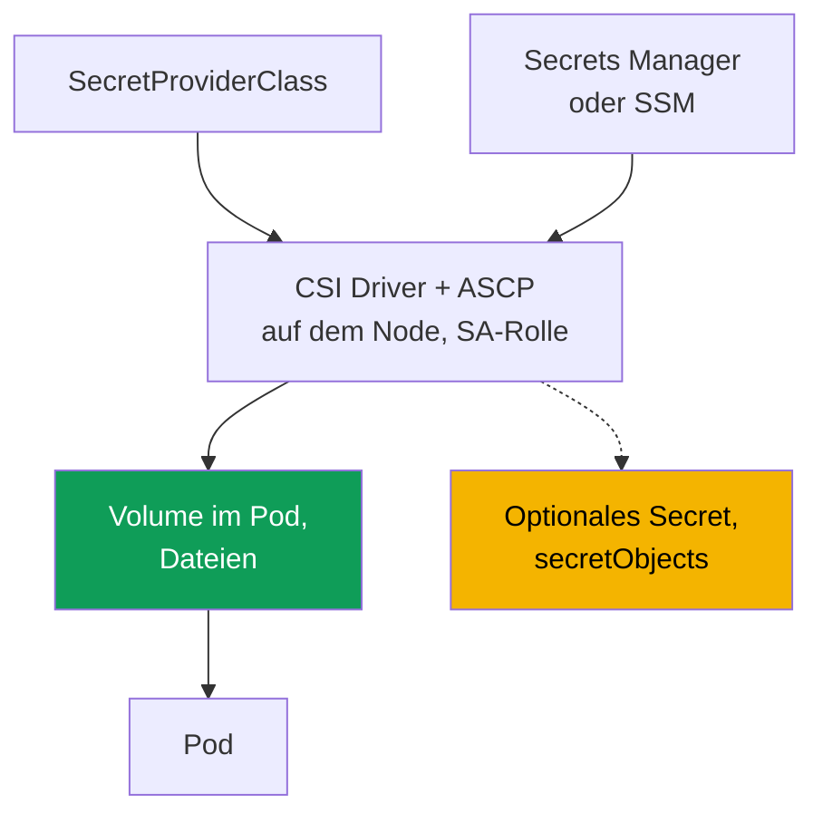

[Русская версия](ru.md) · [Eng version](en.md) · [Versión en español](es.md) · [Version française](fr.md) · [ქართული ვერსია](ge.md) · [繁體中文版](tw.md) · [日本語版](jp.md)
# Kapitel 18. Secrets: KMS-Verschlüsselung, Secrets Manager und SSM über External Secrets und CSI

> **Wie geht es weiter?** Die Kapitel 16 und 17 haben gezeigt, wie ein Pod über IRSA oder Pod
> Identity eine eigene AWS-Rolle erhält. Secrets bauen unmittelbar darauf auf: Der External-
> Secrets-Controller und der CSI-Treiber benötigen eine Rolle, um aus Secrets Manager und SSM zu
> lesen. Sie erhalten diese über genau jene Mechanismen, auf die wir hier verweisen, statt sie zu
> wiederholen. Verwandte Themen stehen in anderen Kapiteln: Verschlüsselung bei der Cluster-
> Erstellung (Kapitel 4), RBAC-Zugriff auf `Secret` (Kapitel 5), Supply Chain und ECR (Kapitel 20),
> Hardening und Pod Security (Kapitel 19) sowie Secrets in git und GitOps (Kapitel 44).

## 18.1. „Ein Secret in Kubernetes ist keine Verschlüsselung, sondern base64“

Eine Anwendung benötigt ein Datenbankpasswort. Ein Engineer legt es in einem `Secret` ab, mountet
es in einen Pod und hält die Aufgabe für erledigt: „Die Daten liegen schließlich in einem Secret.“
Ein `Secret` in Kubernetes verschlüsselt jedoch nichts.

- **base64 ist Kodierung, keine Verschlüsselung.** Jeder mit Zugriff auf das Manifest oder Objekt
  kann einen Wert in `data` mit `base64 -d` dekodieren. Das Passwort liegt im Klartext vor.
- **RBAC entscheidet über den Zugriff, und nur RBAC.** Jedes Subject mit `get`/`list` auf ein
  `Secret` in diesem Namespace kann es lesen (Kapitel 5). Das Objekt besitzt über RBAC hinaus
  keine zweite Schutzschicht.
- **Das Secret liegt in etcd.** Sein Wert wird in der Datenbank der Control Plane gespeichert. EKS
  verschlüsselt etcd-Datenträger auf Speicherebene, doch das schützt das Volume, nicht das Objekt:
  Mit gültigem RBAC kann es weiterhin wie gewohnt gelesen werden.
- **Das Secret leakt über git.** Wird ein Manifest mit einem `Secret` ins Repository committet,
  liegt das Passwort dauerhaft in der git-Historie. Dies ist ein klassisches Leak, das ein
  einzelnes `git rm` nicht behebt.

Sie brauchen etwas anderes: Secrets in einem verwalteten AWS-Speicher mit Rotation und Audit
ablegen, sie ohne Eintrag in ein Manifest an den Pod liefern und das Objekt in etcd tatsächlich
schützen statt nur mit base64.

## 18.2. Zwei unabhängige Schutzschichten, die nicht verwechselt werden dürfen

Die Aufgabe „Secrets in EKS“ hat zwei unterschiedliche Schichten. Sie lösen verschiedene Probleme,
werden aber ständig verwechselt, obwohl keine die andere ersetzt.

- **Schicht 1: KMS-envelope encryption von Kubernetes-Secrets in etcd.** Sie betrifft **wie** ein
  `Secret`-Objekt in der Control Plane gespeichert wird: Datenschutz auf der Speicherebene.
- **Schicht 2: Secrets in externe AWS-Speicher auslagern** (Secrets Manager, SSM Parameter Store)
  und an den Pod liefern. Sie betrifft **wo** das Secret überhaupt lebt und wie es zur Anwendung
  gelangt.

Schicht 1 schützt ein `Secret`-Objekt an seinem Speicherort, hebt aber den RBAC-Zugriff darauf
nicht auf. Schicht 2 hält das Secret aus Manifesten und git heraus, doch wenn sie ein natives
`Secret` erstellt, liegt dieses wieder in etcd, und Schicht 1 wird weiterhin benötigt.

## 18.3. Schicht 1: KMS-envelope encryption von etcd-Secrets

Envelope encryption verwendet zwei Schlüssel. Ein **Data Encryption Key (DEK)** verschlüsselt ein
`Secret`, bevor es in etcd geschrieben wird, während ein **Key Encryption Key (KEK)**, Ihr KMS-
Schlüssel, den DEK verschlüsselt. etcd enthält ein verschlüsseltes Secret mit einem verschlüsselten
DEK, der Klartext-DEK wird nicht gespeichert. EKS verwendet Kubernetes KMS provider v2, und jede
DEK-Entschlüsselung in KMS ist in CloudTrail sichtbar, was Auditing ermöglicht.

In EKS mit Kubernetes **1.28 und höher** ist envelope encryption von Daten der Kubernetes-API
standardmäßig mit einem AWS owned key aktiviert, ohne dass Sie etwas tun müssen. Ihr eigener
**Customer Managed Key (CMK)** bietet, was ein AWS owned key nicht bietet: Kontrolle über die
Schlüssel-Policy und Audit der Entschlüsselung in CloudTrail. In einem bestehenden Cluster aktivieren
Sie einen CMK separat (Kapitel 4).

```bash
# eigenen CMK in einem bestehenden Cluster aktivieren (Ressource secrets)
aws eks associate-encryption-config --cluster-name demo \
  --encryption-config '[{"resources":["secrets"],"provider":{"keyArn":"arn:aws:kms:eu-central-1:111122223333:key/abcd-1234"}}]'

# prüfen, ob die Verschlüsselung konfiguriert ist
aws eks describe-cluster --name demo --query 'cluster.encryptionConfig'
```

Der Schlüssel muss symmetrisch sein und sich in derselben Region wie der Cluster befinden. Die
Unumkehrbarkeit ist wichtig: Sie können die CMK-Verschlüsselung für Secrets aktivieren, aber **nicht
wieder deaktivieren** (Kapitel 4). Daraus ergibt sich das wesentliche Betriebsrisiko: der Schlüssel
selbst. Wird der CMK deaktiviert oder gelöscht, kann die Control Plane Secrets nicht mehr
entschlüsseln und verliert den Zugriff darauf. Deaktivieren Sie daher keinen von EKS verwendeten CMK
und behalten Sie seine Policy unter Kontrolle.

| `Secret` in etcd | AWS owned key (Standard ab 1.28+) | Eigener CMK |
|---|---|---|
| Daten auf etcd-Datenträgern | von AWS verschlüsselt | von AWS verschlüsselt |
| `Secret`-Objekt (envelope encryption) | ja, mit AWS-Schlüssel | ja, mit Ihrem Schlüssel |
| Kontrolle über Schlüssel und Policy | nein | ja |
| Audit der Entschlüsselung in CloudTrail | nein | ja |
| Wird RBAC-Zugriff auf `Secret` aufgehoben? | nein | nein |

Die letzte Zeile ist der Kernpunkt: Verschlüsselung schützt ein Secret **im Speicher**, doch ein
Subject mit RBAC-Lesezugriff erhält es weiterhin. Zugriffskontrolle bleibt RBAC (Kapitel 5), während
envelope encryption einen anderen Vektor abdeckt: Zugriff auf etcd-Daten außerhalb der API.

## 18.4. Schicht 2: Warum Secrets aus dem Cluster ausgelagert werden

Auch mit Schicht 1 bleibt das Secret im Cluster: Es steht in einem Manifest und kann in git landen,
die Rotation ist manuell und es gibt keinen zentralen Ort. Schicht 2 macht einen externen Speicher
zur Quelle und liefert das Secret in den Cluster.

- **Rotation.** Secrets Manager kann nach einem Zeitplan rotieren, die Anwendung erhält einen neuen
  Wert.
- **Audit und eine zentrale Quelle.** Der Zugriff erfolgt über IAM und ist in CloudTrail sichtbar,
  das Secret befindet sich an einem Ort.
- **Kein Secret in Manifesten oder git.** Nur Verweise auf das Secret, nicht seine Werte, gelangen
  in den Cluster.
- **Trennung nach Datentyp.** Secrets Manager ist für Secrets mit Rotation bestimmt, SSM Parameter
  Store für Konfiguration, von der ein Teil kein Secret ist.

Zwei Werkzeuge lösen die Bereitstellung unterschiedlich: **External Secrets Operator** erstellt ein
natives `Secret`, während **Secrets Store CSI Driver** ein Secret unmittelbar als Volume in einen
Pod mountet. Beide beziehen über IRSA oder Pod Identity eine AWS-Zugriffsrolle (Kapitel 16 und 17).
Das ist ihre Grundlage, kein Detail.

## 18.5. External Secrets Operator: Der Controller erstellt ein natives Secret

External Secrets Operator (ESO) ist ein Controller im Cluster. Er liest ein Secret aus Secrets
Manager oder SSM und **erstellt daraus ein reguläres Kubernetes-`Secret`**, das die Anwendung wie
gewohnt über env oder ein Volume konsumiert, ohne Unterstützung im Code.



Drei Objekte definieren die Beziehung. **`SecretStore`** beschreibt den Zugriff auf einen Speicher
(Provider `aws`, Dienst `SecretsManager` oder `ParameterStore`, Region und Authentifizierung) und
ist namespace-scoped. **`ClusterSecretStore`** ist dasselbe für den gesamten Cluster.
**`ExternalSecret`** legt fest, welches Secret abgerufen und in welches `Secret` es geschrieben
werden soll. Der Controller verwendet es, um das Ziel-`Secret` zu erstellen und zu aktualisieren.

Isolation: Verwenden Sie standardmäßig einen namespaced `SecretStore`. Das Team, dem der Namespace
gehört, liest nur seine eigenen Secrets. `ClusterSecretStore` steht jedem Namespace zur Verfügung
und kann leicht zu einem Kanal für Secrets anderer Teams werden. Verwenden und beschränken Sie ihn
daher gezielt, statt ihn als Standardoption zu behandeln.

```yaml
apiVersion: external-secrets.io/v1
kind: SecretStore
metadata:
  name: aws-sm
  namespace: payments
spec:
  provider:
    aws:
      service: SecretsManager
      region: eu-central-1
      # Authentifizierung: Controller-Rolle über IRSA oder Pod Identity (Kapitel 16, 17)
---
apiVersion: external-secrets.io/v1
kind: ExternalSecret
metadata:
  name: db-credentials
  namespace: payments
spec:
  refreshInterval: 1h            # Häufigkeit der erneuten Synchronisierung; 0 erstellt einmal
  secretStoreRef:
    name: aws-sm
    kind: SecretStore
  target:
    name: db-credentials         # Name des von ESO erstellten Secret
  data:
    - secretKey: password        # Schlüssel im Secret
      remoteRef:
        key: prod/payments/db    # Secret-Name in Secrets Manager
        property: password       # Feld innerhalb des JSON-Secret
```

`refreshInterval` legt das Intervall für die erneute Synchronisierung fest. Bei `0` erstellt ESO
das `Secret` einmal. Der Vorteil von ESO ist, dass das Ergebnis ein natives `Secret` ist, das mit
jedem Consumer kompatibel ist, etwa env, Volume oder fremdes Chart. Sein wichtiger Nachteil: Das
Secret **materialisiert sich in etcd**, deshalb ist Schicht 1 (Abschnitt 18.3) für ESO zwingend.
Geben Sie dem Controller über IRSA oder Pod Identity eine Rolle zum Lesen aus AWS (Kapitel 16 und
17).

Eine Rotationsbesonderheit: ESO aktualisiert das `Secret`, doch ein Pod, der es beim Start in env
gelesen hat, sieht den neuen Wert nicht, weil Umgebungsvariablen beim Start festgelegt werden.
kubelet aktualisiert Volumes, env jedoch nicht. Starten Sie den Pod neu, damit er das Secret erneut
liest. **Stakater Reloader** erledigt dies automatisch: Er beobachtet `Secret` und `ConfigMap` und
löst einen rolling restart der sie konsumierenden Deployments aus:

```yaml
metadata:
  annotations:
    reloader.stakater.com/auto: "true"   # Neustart bei Änderung gemounteter Secret/ConfigMap
```

```bash
kubectl -n payments get externalsecret db-credentials   # STATUS SecretSynced?
kubectl -n payments get secret db-credentials            # natives Secret vorhanden
```

## 18.6. Secrets Store CSI Driver: Das Secret wird in den Pod gemountet

Secrets Store CSI Driver mit dem AWS-Provider (ASCP) geht einen anderen Weg: Er **mountet das
Secret als Volume direkt in den Pod** in Form von Dateien und umgeht das `Secret`-Objekt.
Standardmäßig erstellt der Treiber kein `Secret`, sondern legt das Secret in einem Volume auf dem
Node ab. `SecretProviderClass` definiert, was gemountet wird.



```yaml
apiVersion: secrets-store.csi.x-k8s.io/v1
kind: SecretProviderClass
metadata:
  name: db-credentials
  namespace: payments
spec:
  provider: aws
  parameters:
    objects: |
      - objectName: "prod/payments/db"   # Secret-Name in Secrets Manager (oder ARN)
        objectType: "secretsmanager"     # secretsmanager oder ssmparameter
```

Ein Pod referenziert die Klasse über ein CSI-Volume mit `secretProviderClass`. Die zentrale
Eigenschaft ist: Ohne Synchronisierung erscheint das Secret **nur im Volume auf dem Node und
gelangt niemals in etcd**. Das ist der wesentliche Unterschied zu ESO. Optional erstellt der
Treiber über den Block `secretObjects` ein natives `Secret`, doch die Synchronisierung erfolgt nur,
während ein Pod das Volume mountet, und das `Secret` wird mit dem letzten Consumer gelöscht. Ein
rotation reconciler ermöglicht die Rotation von Werten, wird per Flag aktiviert und aktualisiert das
Volume.

```bash
kubectl -n payments get secretproviderclass db-credentials    # Klasse vorhanden
kubectl -n payments exec deploy/app -- ls /mnt/secrets-store   # Secret-Dateien liegen im Volume
```

Auch der Treiber erhält seine AWS-Zugriffsrolle über IRSA oder Pod Identity (Kapitel 16 und 17). Die
Rolle wird an den `ServiceAccount` gebunden, unter dem der das Secret mountende Pod läuft.

## 18.7. ESO gegenüber CSI Driver

Die Werkzeuge lösen dieselbe Aufgabe, „ein Secret aus AWS in einen Pod“, auf unterschiedliche Weise.
Die Wahl bestimmt die zentrale Frage: Wo liegt das Secret und wer konsumiert es?

| Eigenschaft | External Secrets Operator | Secrets Store CSI Driver |
|---|---|---|
| Wo das Secret lebt | natives `Secret` in etcd | Dateien in einem Volume auf dem Node |
| Gelangt es in etcd? | ja, immer | nein, sofern `secretObjects` nicht aktiviert ist |
| Wie die Anwendung es konsumiert | env oder Volume aus `Secret` | liest Dateien aus einem Volume |
| env-Kompatibilität | vollständig, es ist ein reguläres `Secret` | nur über Synchronisierung in `Secret` |
| Rotation | über `refreshInterval` | rotation reconciler aktualisiert das Volume |
| Wird Schicht 1 (KMS) benötigt? | ja, das Secret liegt in etcd | nicht für das Volume, ja bei Synchronisierung |
| AWS-Zugriffsrolle | IRSA / Pod Identity | IRSA / Pod Identity |
| Abhängigkeit vom Pod-Lebenszyklus | nein, das `Secret` lebt eigenständig | ja, Volume und sync leben mit dem Pod |

Kurz gesagt: ESO ist für Anwendungen einfacher, die ein `Secret` benötigen, etwa env oder fertige
Charts, bezahlt aber mit einem dauerhaften Eintrag in etcd. CSI ohne sync hinterlässt den kleinsten
Footprint, doch die Anwendung muss Dateien aus dem Volume lesen.

### HashiCorp Vault: dieselbe Schicht 2, aber Speicher außerhalb von AWS

Bisher dienten Secrets Manager und SSM Parameter Store als Speicher, doch Schicht 2 ist nicht an AWS
gebunden. Vault nimmt denselben Platz im Design ein und kommt aus einem von drei Gründen in den
Cluster: Das Unternehmen betreibt es bereits und versorgt mehr als EKS, **dynamische Secrets** werden
benötigt, wobei die AWS secrets engine temporäre IAM-Credentials und die database engine einen
kurzlebigen Datenbankbenutzer für eine konkrete Anfrage ausstellt, oder eine zentrale Quelle für
Multicloud und ein eigenes Rechenzentrum wird benötigt.

Die Authentifizierung des Pods bei Vault stützt sich auf dieselben Mechanismen wie in Kapitel 16. Die
Kubernetes auth method prüft das ServiceAccount-Token per `TokenReview` über die Cluster-API. JWT/OIDC
auth prüft das projected Token gegen den OIDC-issuer des Clusters, ohne die API aufzurufen. AWS IAM
auth akzeptiert eine signierte Anfrage an `sts:GetCallerIdentity`, erkennt also eine Rolle von IRSA
oder Pod Identity. Die erste Option ist einfacher, die dritte passt natürlich zu einem bereits
eingerichteten IRSA.

Es gibt vier Möglichkeiten, ein Secret an einen Pod zu liefern, zwei davon kennen Sie bereits:

- **Vault Agent Injector**: Ein mutating webhook fügt dem Pod einen Sidecar- oder Init-Container
  hinzu. Er meldet sich bei Vault an und schreibt das Secret in ein gemeinsames `emptyDir`. Aktiviert
  wird er durch die Annotationen `vault.hashicorp.com/agent-inject` und
  `vault.hashicorp.com/role`. Nichts gelangt nach etcd.
- **Vault Secrets Operator**: Ein Controller mit den CRDs (`VaultStaticSecret`,
  `VaultDynamicSecret`, `VaultAuth`), der einen Wert in ein natives `Secret` synchronisiert. Dies
  entspricht exakt dem ESO-Modell mit allen Eigenschaften der vorangehenden Tabelle.
- **ESO mit dem Vault-Provider**: Derselbe Operator aus 18.5, nur zeigt `SecretStore` auf Vault
  statt auf Secrets Manager. Das ist praktisch, wenn einige Secrets in AWS und andere in Vault
  liegen.
- **Secrets Store CSI Driver mit Vault-Provider**: Mountet Dateien wie in 18.6.

Der Preis ist ebenso ehrlich wie in Kapitel 8 über den Wechsel des CNI: Der Speicher wird zu Ihrem
Betriebsgegenstand. Ein eigenes Vault ist ein HA-Cluster mit eigenem Storage Backend, unseal- und
recovery keys, Updates, Backup und Audit. In AWS wird es häufig mit KMS auto-unseal (`seal "awskms"`)
betrieben, damit unseal keys nicht bei Personen liegen. Eine vom Anbieter verwaltete Variante nimmt
Ihnen einen Teil dieser Arbeit ab, nicht jedoch die Verantwortung für Policies und Rollen. Ein
Betriebsdetail: Zugriffe auf Secrets erscheinen im audit device von Vault, nicht in CloudTrail. Die
Untersuchung eines Zugriffs umfasst daher zwei Logs (Kapitel 21). Schicht 1 bleibt weiterhin nötig:
Wird ein Secret in ein `Secret` synchronisiert, liegt es in etcd und wird durch die KMS-
Verschlüsselung aus 18.3 geschützt.

## 18.8. Rotation: Das Datenbankpasswort wurde geändert

Die Rotation des Datenbank-Secret lief nachts. Am Morgen funktionieren einige Pods, andere schlagen
mit Authentifizierungsfehlern fehl, während Secrets Manager das korrekte neue Passwort enthält. Der
Wert in AWS änderte sich sofort, erreicht die Anwendung jedoch über eine Kette von vier Gliedern und
kann an jedem davon hängen bleiben.

| Glied | Was die Verzögerung bestimmt | Symptom bei falscher Konfiguration |
|---|---|---|
| Speicher | Rotationsstrategie und Zeitpunkt der Passwortänderung in der Datenbank | Zeitfenster, in dem das Datenbankpasswort neu ist, Leser aber noch das alte besitzen |
| Synchronisierung in den Cluster | ESO-`refreshInterval`, CSI rotation reconciler | ein `Secret` oder eine Volume-Datei mit altem Wert |
| Wie die Anwendung den Wert erhält | env gegenüber Volume oder Datei | env ändert sich nie, ein Volume wird aktualisiert |
| Datenbankverbindungen | Connection Pool und Reconnect-Logik | der Pool verwendet alte Credentials bis zum Neustart |

**Glied 1: Wie Secrets Manager rotiert.** Eine Rotationsfunktion steuert die Rotation, und die
Secret-Versionen tragen Labels: Standardmäßig lesen alle `AWSCURRENT`, `AWSPENDING` ist der neue
Wert in der Prüfung und `AWSPREVIOUS` der vorherige Wert. Es gibt zwei Strategien, deren Wahl die
Verfügbarkeit direkt beeinflusst. Bei **single user** ändert sich das Passwort eines Benutzers:
Offene Verbindungen werden nicht unterbrochen, doch zwischen der Passwortänderung in der Datenbank
und der Aktualisierung des Secret liegt ein kurzes Intervall, in dem ein Verbindungsversuch mit frisch
gelesenen Credentials abgelehnt werden kann. AWS hält diese Strategie für die meisten Fälle geeignet,
und Retries mit exponentiellem Backoff decken das Risiko ab. Bei **alternating users** enthält das
Secret zwei Benutzer. Der Rotator klont den ursprünglichen Benutzer und ändert ihre Passwörter dann
abwechselnd, sodass die Anwendung zu jedem Zeitpunkt der Rotation gültige Credentials erhält und
anschließend beide Sätze funktionieren. Der Preis ist ein separates Secret mit Superuser-Rechten, da
sich ein Benutzer gewöhnlich nicht selbst klonen kann, sowie die Pflicht, Berechtigungsänderungen beim
Klon zu wiederholen.

**Glied 2: Wie der neue Wert in den Cluster gelangt.** Bei ESO ist dies das `refreshInterval` aus
18.5: Bei `0` wird das Secret einmal erstellt und bleibt nach einer Rotation dauerhaft alt. Beim CSI
Driver aktualisiert ein separater rotation reconciler die Dateien im Volume, und er muss aktiviert
sein. Ohne ihn ist auch das Volume statisch. „Wir rotieren Secrets“ ohne Konfiguration dieses Glieds
bedeutet daher „Wir ändern das Passwort nur in AWS“.

**Glied 3: Wie der Prozess den Wert sieht.** Umgebungsvariablen werden beim Containerstart gesetzt
und **nie aktualisiert**, selbst wenn das `Secret` bereits neu ist. kubelet aktualisiert einen Wert
im Volume selbst, aber die Anwendung muss die Datei erneut lesen, statt das Passwort seit dem Start
im Speicher zu halten. Daraus ergeben sich zwei funktionierende Ansätze: Den Pod bei einer Secret-
Änderung neu starten, mit dem Reloader aus 18.5, oder aus einer Datei lesen und auf ihre Änderung
reagieren.

**Glied 4: Verbindungen.** Selbst nach dem erneuten Lesen des Passworts verwendet die Anwendung
weiterhin einen bereits geöffneten Pool. Richtiges Verhalten besteht darin, bei einem
Authentifizierungsfehler die Credentials erneut zu lesen und die Verbindung mit Retry und Verzögerung
neu zu erstellen, statt in `CrashLoopBackOff` zu geraten und auf einen manuellen Neustart zu warten.

**Wie sich das Problem vollständig beseitigen lässt.** Passwortrotation verwaltet etwas, das besser
nicht existieren sollte. Für RDS und Aurora gibt es **IAM database authentication**: Statt eines
Passworts erhält die Anwendung über `aws rds generate-db-auth-token` ein Token, das standardmäßig 15
Minuten gültig ist, und die Pod-Rolle erhält Berechtigungen über IRSA oder Pod Identity (Kapitel 16
und 17). Es gibt nichts zu rotieren, weil kein dauerhaftes Passwort vorhanden ist. Eine ähnliche Idee
bieten die dynamischen Secrets von Vault aus 18.7: Credentials werden auf Anfrage ausgestellt und
laufen selbst ab. Wird dennoch ein Passwort benötigt, ändern Sie es in Production manuell nach der
Logik von alternating users: Zuerst einen zweiten Benutzer anlegen, den Traffic umstellen, danach den
ersten entziehen, statt das Passwort eines aktiven Benutzers direkt zu ändern.

## 18.9. KMS und externe Speicher zusammen

Die Schichten sind keine Alternativen, sie ergänzen einander. Die Regel hängt davon ab, ob das Secret
in etcd gelangt:

- **ESO** schreibt ein natives `Secret`, also gelangt das Secret in etcd. Schicht 1 wird immer
  benötigt. Andernfalls ist der externe Speicher geschützt, seine Kopie in etcd jedoch nicht.
- **CSI ohne Synchronisierung** mountet das Secret nur in ein Volume auf dem Node und es gelangt
  nicht in etcd. Daher gilt Schicht 1 nicht für dieses Secret. Mit `secretObjects` erscheint ein
  `Secret`, und Schicht 1 wird erneut benötigt.

Das Auslagern eines Secret hebt die Notwendigkeit nicht auf, das im Cluster verbliebene Material zu
verschlüsseln: Halten Sie Schicht 1 immer aktiv, ab 1.28+ ist sie bereits der Standard. Die Wahl
zwischen ESO und CSI entscheidet nur über die Größe des Footprints im Cluster.

## 18.10. Fehlerdiagnose: Das Secret erschien nicht oder wurde nicht aktualisiert

Fehler sind vorhersehbar: Fast alles läuft auf die Rolle des Controllers oder Treibers,
Konfigurationsobjekte und Berechtigungen auf dem AWS-KMS-Schlüssel des Secret selbst hinaus.

| Symptom | Wahrscheinliche Ursache | Was prüfen |
|---|---|---|
| `ExternalSecret` befindet sich nicht in `SecretSynced` | Die Controller-Rolle kann das Secret nicht lesen | IRSA/Pod Identity des ESO-Controllers |
| Natives `Secret` wurde nicht erstellt | Fehler in `SecretStore` oder `remoteRef` | `kubectl describe externalsecret` |
| Volume ist leer, Pod startet nicht | `SecretProviderClass` oder SA-Rolle des Pods | Klasse, SA-Annotation/Assoziation |
| `AccessDenied` beim Lesen des Secret | Keine Berechtigung in der IAM-Policy der Rolle | `secretsmanager:GetSecretValue` |
| `AccessDenied` beim Entschlüsseln | Keine Berechtigung auf dem KMS-Schlüssel des Secret | `kms:Decrypt` auf dem Secret-Schlüssel |
| Wert ist veraltet | Rotation oder Refresh nicht konfiguriert | `refreshInterval` (ESO), reconciler (CSI) |

Gehen Sie bei der Diagnose von der Rolle zu den Objekten und weiter nach außen zu AWS:

```bash
# 1. ESO-Synchronisierungsstatus und Events
kubectl -n payments describe externalsecret db-credentials

# 2. Logs des ESO-Controllers (Rolle, Speicherzugriff, Provider-Fehler)
kubectl -n external-secrets logs deploy/external-secrets

# 3. für CSI: Logs des Treibers auf dem Node des Pods
kubectl -n kube-system logs ds/csi-secrets-store-secrets-store-csi-driver -c secrets-store
```

Eine häufige Falle: Das Secret in Secrets Manager ist selbst mit einem KMS-Schlüssel
verschlüsselt, und die Rolle von Controller oder Treiber benötigt `kms:Decrypt` auf **diesem**
Schlüssel. Verwechseln Sie ihn nicht mit dem Cluster-CMK aus Schicht 1. Wenn `GetSecretValue`
funktioniert, das Secret aber nicht gelesen werden kann, liegt die Ursache gewöhnlich bei den
Berechtigungen auf seinem Schlüssel.

## 18.11. Anwendung in Production

- **Keine Secrets committen.** Committen Sie `ExternalSecret`, `SecretStore` und
  `SecretProviderClass` nach git: Verweise auf das Secret, nicht seine Werte. Damit verhindern Sie
  Leaks über die git-Historie von Grund auf (Kapitel 44).
- **Schicht 1 ist immer aktiviert.** Ab 1.28+ funktioniert envelope encryption standardmäßig. Für
  Production verwenden Sie einen eigenen CMK für Kontrolle und Auditing in CloudTrail und schützen
  dessen Schlüssel-Policy.
- **RBAC mit minimalen Rechten auf `Secret`.** Envelope encryption ersetzt RBAC nicht: Erteilen
  Sie Lesezugriff gezielt, sonst schützt Schicht 1 gegen alles außer ein gültiges Subject
  (Kapitel 5).
- **An der Quelle rotieren.** Halten Sie rotierende Secrets in Secrets Manager und konfigurieren
  Sie ESO-`refreshInterval` oder den CSI rotation reconciler so, dass der Pod einen frischen Wert
  erhält. Pods, die ein `Secret` in env lesen, werden durch einen rolling restart von Stakater
  Reloader aktualisiert.
- **Speicher nach Namespace isolieren.** Standardmäßig verwenden Sie einen namespaced
  `SecretStore`. Setzen Sie `ClusterSecretStore` gezielt und mit Einschränkungen ein, damit Teams
  die Secrets anderer Teams nicht lesen können.
- **Unterschiedliche Speicher für unterschiedliche Daten.** Secrets Manager ist für rotierende
  Secrets, SSM Parameter Store für Konfiguration. Das trennt sowohl Berechtigungen als auch Kosten
  pro Anfrage.
- **Rolle über IRSA oder Pod Identity vergeben.** Geben Sie Controller und Treiber separate Rollen
  mit `GetSecretValue`- und `kms:Decrypt`-Berechtigungen auf den benötigten Schlüsseln, keine
  gemeinsame Rolle (Kapitel 16 und 17).

## 18.12. Mini-Glossar

- **Envelope encryption**: Verschlüsselung mit zwei Schlüsseln. Ein DEK verschlüsselt Daten und ein
  KEK, ein KMS-Schlüssel, verschlüsselt den DEK. EKS wendet sie über Kubernetes KMS provider v2 auf
  etcd-Secrets an.
- **CMK (customer managed key)**: Ihr KMS-Schlüssel. Anders als der standardmäßige AWS owned key
  bietet er Kontrolle über die Schlüssel-Policy und Audit der Entschlüsselung in CloudTrail.
- **External Secrets Operator (ESO)**: Ein Controller, der ein Secret aus AWS liest und daraus ein
  natives `Secret` erstellt. Er verwendet die Objekte `SecretStore`/`ClusterSecretStore` und
  `ExternalSecret`.
- **Secrets Store CSI Driver + AWS provider (ASCP)**: Ein Treiber, der ein Secret aus AWS als
  Dateien in ein Volume auf dem Node mountet. Er verwendet ein `SecretProviderClass`-Objekt und
  synchronisiert optional in ein `Secret`.
- **Stakater Reloader**: Ein Controller, der bei Änderung gemounteter `Secret`- oder `ConfigMap`-
  Objekte anhand einer Annotation einen rolling restart eines Deployment ausführt, damit der Pod
  den neuen Wert erhält.
- **Staging labels**: Versionslabels von Secrets in Secrets Manager. `AWSCURRENT` wird
  standardmäßig gelesen, `AWSPENDING` ist der während der Rotation geprüfte Wert und
  `AWSPREVIOUS` der vorherige Wert.
- **Rotationsstrategie**: `single user`, bei dem sich das Passwort eines Benutzers ändert und ein
  kurzes Risikozeitfenster für Fehler besteht, das durch verzögerte Retries abgedeckt wird, oder
  `alternating users`, bei dem sich zwei Benutzer abwechseln, Credentials immer gültig sind und
  ein Secret mit Superuser-Rechten benötigt wird.
- **IAM database authentication**: Anmeldung bei RDS oder Aurora mit einem temporären Token
  (`aws rds generate-db-auth-token`, standardmäßig 15 Minuten) statt einem Passwort. Es gibt nichts
  zu rotieren.
- **HashiCorp Vault**: Ein externer Nicht-AWS-Speicher für Secrets, der denselben Platz wie Secrets
  Manager einnimmt. Die Pod-Authentifizierung erfolgt über Kubernetes, JWT/OIDC oder AWS IAM auth.
  Die Bereitstellung erfolgt über Vault Agent Injector, Vault Secrets Operator, ESO oder CSI Driver
  mit Vault-Provider. Der zentrale Unterschied sind **dynamische Secrets**, also temporäre IAM-
  und Datenbank-Credentials auf Anfrage. Der Preis ist der Betrieb von Vault selbst und ein
  separates audit device statt CloudTrail.

## 18.13. Zusammenfassung des Kapitels

- Ein Kubernetes-`Secret` ist base64, keine Verschlüsselung: RBAC entscheidet über den Zugriff, der
  Wert liegt in etcd und kann leicht über git leaken. Daraus entstehen zwei getrennte Aufgaben, die
  nicht vermischt werden dürfen.
- Schicht 1 ist KMS-envelope encryption von etcd-Secrets: Ein DEK verschlüsselt ein `Secret`, ein
  KEK, ein KMS-Schlüssel, verschlüsselt den DEK. Ab 1.28+ ist sie standardmäßig mit einem AWS owned
  key aktiviert, ein eigener CMK bietet Kontrolle und Auditing.
- Schicht 1 schützt ein Secret im Speicher, **hebt RBAC** für sein Lesen jedoch **nicht auf**. Ihre
  Aktivierung ist unumkehrbar, und das Deaktivieren oder Löschen des CMK entzieht der Control Plane
  den Zugriff auf Secrets.
- Schicht 2 verlagert Secrets für Rotation, Audit, eine zentrale Quelle und das Fehlen von Secrets
  in Manifesten in einen externen Speicher, Secrets Manager oder SSM. Die zwei Werkzeuge sind ESO
  und CSI Driver.
- ESO erstellt ein natives `Secret`, das mit jedem Consumer kompatibel ist, aber in etcd liegt,
  weshalb Schicht 1 zwingend ist. CSI mountet das Secret in ein Volume und erstellt standardmäßig
  kein `Secret`, es liegt also nicht in etcd.
- Beide erhalten ihre AWS-Rolle über IRSA oder Pod Identity (Kapitel 16 und 17). Die Diagnose geht
  von der Rolle zu den Objekten und zu Berechtigungen auf dem AWS-KMS-Schlüssel des Secret
  (`kms:Decrypt`).
- Rotation erreicht die Anwendung über vier Glieder: Strategie im Speicher, Synchronisierung in den
  Cluster, `refreshInterval` oder rotation reconciler, Art des Lesens des Werts, env aktualisiert
  sich nie, und Connection Pool. Die grundlegende Alternative ist IAM database authentication für
  RDS oder dynamische Secrets, bei denen kein dauerhaftes Passwort existiert.

## 18.14. Wie dies bei der realen Arbeit hilft

Mit einem externen Speicher wird die Frage „Wo lebt das Secret und wer kann es lesen?“ durch einen
Eintrag in Secrets Manager und die IAM-Policy der Rolle beantwortet, statt Manifeste in allen
Namespaces zu durchsuchen. Der Vorfall „Secret in git“ passiert nicht mehr: Das Repository enthält
nur Verweise. Im On-Call wird „Der Pod startete nicht, das Volume ist leer“ oder „Das
`ExternalSecret` synchronisiert nicht“ durch die Kette aus Abschnitt 18.10 gelöst: Rolle,
Konfigurationsobjekt, Berechtigungen auf dem Secret und dessen KMS-Schlüssel. Das Wissen, dass ESO
ein Secret in etcd ablegt, CSI ohne sync jedoch nicht, hilft außerdem bei der Wahl des Werkzeugs für
den benötigten Footprint.

## 18.15. Fragen zur Selbstkontrolle

1. Warum kann ein Kubernetes-`Secret` nicht als Verschlüsselung gelten und was begrenzt den Zugriff
   darauf?
2. Worin unterscheidet sich die etcd-Datenträgerverschlüsselung in AWS von envelope encryption eines
   `Secret`-Objekts?
3. Wie funktioniert KMS-envelope encryption: Was macht ein DEK und was ein KEK?
4. Ab welcher EKS-Version ist envelope encryption standardmäßig aktiviert und mit welchem Schlüssel?
5. Was bietet ein eigener CMK gegenüber einem AWS owned key und welches Betriebsrisiko hat er?
6. Hebt Schicht 1, KMS, die Notwendigkeit von RBAC zum Lesen eines `Secret` auf? Warum?
7. Warum Secrets in externe Speicher auslagern, wenn etcd bereits verschlüsselt ist?
8. Worin unterscheidet sich `SecretStore` von `ClusterSecretStore` und was beschreibt
   `ExternalSecret`?
9. Warum bleibt Schicht 1 bei der Verwendung von ESO zwingend?
10. Wo legt CSI Driver ein Secret standardmäßig ab und wann erstellt er ein natives `Secret`?
11. `GetSecretValue` funktioniert, aber das Secret kann nicht gelesen werden. Welche Berechtigung
    prüfen Sie und auf welchem Schlüssel?
12. ESO hat ein `Secret` aktualisiert, doch die Anwendung sieht in env das alte Passwort. Warum und
    was löst das Problem?
13. Warum ist ein namespaced `SecretStore` zur Isolation besser als `ClusterSecretStore`?
14. Welche drei Gründe bringen Vault in einen Cluster und womit bezahlen Sie dafür im Betrieb?
15. Worin unterscheidet sich Vault Agent Injector von Vault Secrets Operator beim Footprint in etcd?
16. Das Datenbankpasswort wurde rotiert, in Secrets Manager ist es neu, doch einige Pods scheitern
    mit einem Authentifizierungsfehler. Analysieren Sie die Kette aus vier Gliedern: Wo genau blieb
    der Wert hängen?
17. Worin unterscheidet sich `single user` von `alternating users` hinsichtlich Verfügbarkeit und
    was benötigt Letzteres?
18. Warum übersteht eine Anwendung mit Passwort in einer Umgebungsvariablen keine Rotation und welche
    zwei Ansätze lösen das?

## Praxis

Das Kurs-Lab zu diesem Thema: [Lab 105 - Secrets: KMS envelope encryption und External Secrets
Operator](../../labs/105/README_DE.MD). Darüber hinaus lässt sich alles auf einem laufenden Cluster
prüfen. Für Schicht 1 zeigt `aws eks describe-cluster --name <cluster> --query
'cluster.encryptionConfig'`, ob Verschlüsselung aktiviert ist und welchen Schlüssel sie verwendet.
Ab 1.28+ funktioniert sie auch ohne CMK. Fügen Sie einen eigenen Schlüssel mit dem Befehl `aws eks
associate-encryption-config` aus Abschnitt 18.3 hinzu und beachten Sie dessen Unumkehrbarkeit.

Als Nächstes Schicht 2. Stellen Sie External Secrets Operator bereit, geben Sie seinem Controller
eine Rolle über IRSA oder Pod Identity (Kapitel 16 und 17) mit den Berechtigungen
`secretsmanager:GetSecretValue` und `kms:Decrypt` auf dem Schlüssel des Secret, erstellen Sie einen
`SecretStore` und ein `ExternalSecret` und prüfen Sie `kubectl get externalsecret`, den Status
`SecretSynced`, sowie das entstandene `kubectl get secret`. Wiederholen Sie dies mit Secrets Store
CSI Driver: Erstellen Sie eine `SecretProviderClass` und einen Pod mit CSI-Volume und vergewissern
Sie sich, dass Dateien im Volume liegen und kein natives `Secret` existiert. Üben Sie einen Fehler:
Entfernen Sie `kms:Decrypt` auf dem Schlüssel des Secret aus der Rolle und suchen Sie `AccessDenied`
in den Logs von Controller oder Treiber.

---
[Inhaltsverzeichnis](../README_DE.md) · [Kapitel 17](../17/de.md) · [Kapitel 19](../19/de.md)
