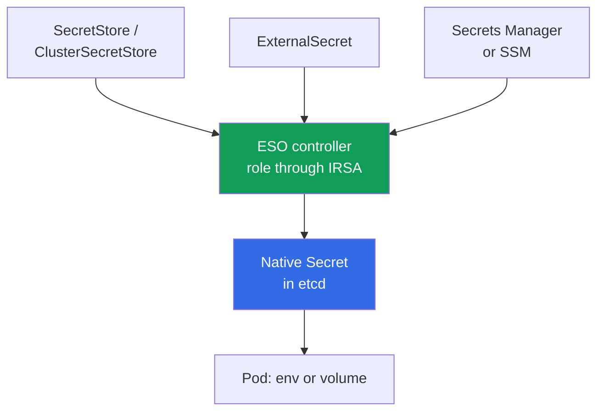
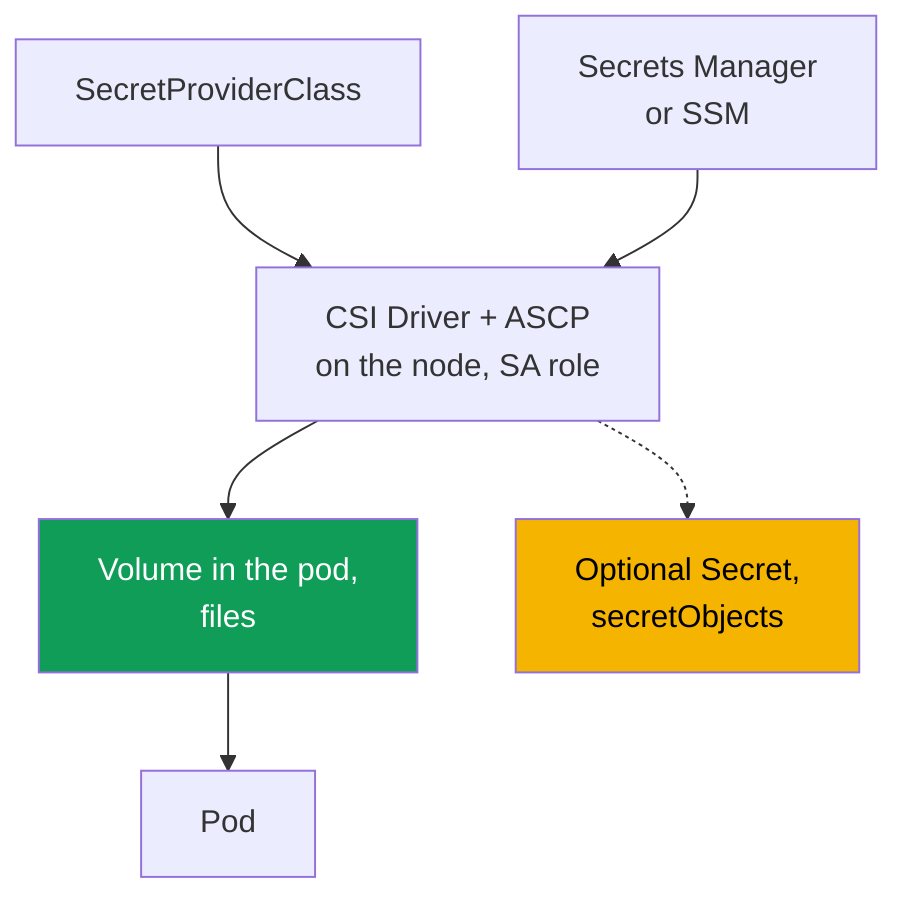

[Русская версия](ru.md) · [Versión en español](es.md) · [Version française](fr.md) · [Deutsche Version](de.md) · [ქართული ვერსია](ge.md) · [繁體中文版](tw.md) · [日本語版](jp.md)
# Chapter 18. Secrets: KMS encryption, Secrets Manager, and SSM through External Secrets and CSI

> **What comes next.** Chapters 16 and 17 showed how to give a pod its own AWS role through IRSA
> or Pod Identity. Secrets rely on this directly: the External Secrets controller and the CSI
> driver need a role to read from Secrets Manager and SSM. They receive it through exactly those
> mechanisms, which we reference here rather than repeat. Related topics are in other chapters:
> encryption when creating a cluster (chapter 4), RBAC access to `Secret` (chapter 5), supply
> chain and ECR (chapter 20), hardening and Pod Security (chapter 19), and secrets in git and
> GitOps (chapter 44).

## 18.1. "A Kubernetes Secret is not encryption, it is base64"

An application needs a database password. An engineer puts it in a `Secret`, mounts it into a pod,
and considers the task complete: "the data is in a secret." But a Kubernetes `Secret` encrypts
nothing.

- **base64 is encoding, not encryption.** Anyone with access to the manifest or object can decode
  a value in `data` with `base64 -d`. The password is in plain text.
- **RBAC decides access, and only RBAC.** Any subject with `get`/`list` on a `Secret` in that
  namespace can read it (chapter 5). The object has no second barrier beyond RBAC.
- **The secret lives in etcd.** Its value is stored in the control plane database. EKS encrypts
  etcd disks at the storage level, but that protects the volume, not the object: with valid RBAC,
  it can still be read as usual.
- **The secret leaks through git.** Commit a manifest with a `Secret` to the repository, and the
  password is permanently in git history. This is a classic leak, and one `git rm` does not fix it.

You want something different: store secrets in managed AWS storage with rotation and auditing,
deliver them to a pod without writing them into a manifest, and protect the object in etcd for
real, rather than with base64.

## 18.2. Two independent protection layers that must not be confused

The task of "secrets in EKS" has two different layers. They solve different problems, but are
constantly confused even though neither replaces the other.

- **Layer 1: KMS envelope encryption of Kubernetes secrets in etcd.** This concerns **how** a
  `Secret` object is stored in the control plane: data protection at the storage layer.
- **Layer 2: moving secrets to external AWS stores** (Secrets Manager, SSM Parameter Store) and
  delivering them to the pod. This concerns **where the secret lives at all** and how it reaches
  the application.

Layer 1 protects a `Secret` object where it is stored, but does not remove RBAC access to it.
Layer 2 keeps the secret out of manifests and git, but if it creates a native `Secret`, that
secret is again in etcd, so layer 1 is still required.

## 18.3. Layer 1: KMS envelope encryption of etcd secrets

Envelope encryption uses two keys. A **data encryption key (DEK)** encrypts a `Secret` before it
is written to etcd, while a **key encryption key (KEK)**, your KMS key, encrypts the DEK. etcd
contains an encrypted secret with an encrypted DEK; the plaintext DEK is not stored. EKS uses
Kubernetes KMS provider v2, and every DEK decryption in KMS is visible in CloudTrail, providing
auditing.

In EKS with Kubernetes **1.28 and later**, envelope encryption of Kubernetes API data is enabled
by default with an AWS owned key, with no action required on your part. Your own **customer managed
key (CMK)** adds what an AWS owned key does not provide: control over the key policy and decryption
auditing in CloudTrail. On an existing cluster, you enable a CMK separately (chapter 4).

```bash
# enable your own CMK on an existing cluster (the secrets resource)
aws eks associate-encryption-config --cluster-name demo \
  --encryption-config '[{"resources":["secrets"],"provider":{"keyArn":"arn:aws:kms:eu-central-1:111122223333:key/abcd-1234"}}]'

# verify that encryption is configured
aws eks describe-cluster --name demo --query 'cluster.encryptionConfig'
```

The key must be symmetric and in the same Region as the cluster. The irreversibility is important:
you can enable CMK encryption for secrets, but **you cannot disable it** (chapter 4). This leads to
the main operational risk: the key itself. If the CMK is disabled or deleted, the control plane
will stop decrypting secrets and lose access to them. Therefore, do not disable a CMK used by EKS,
and keep its policy under control.

| `Secret` in etcd | AWS owned key (default in 1.28+) | Your own CMK |
|---|---|---|
| Data on etcd disks | encrypted by AWS | encrypted by AWS |
| `Secret` object (envelope encryption) | yes, with an AWS key | yes, with your key |
| Control over the key and policy | no | yes |
| Decryption auditing in CloudTrail | no | yes |
| Is RBAC access to `Secret` removed? | no | no |

The last row is the key point: encryption protects a secret **in storage**, but a subject with RBAC
read access will receive it as before. Access control remains RBAC (chapter 5), while envelope
encryption addresses a different vector: access to etcd data outside the API.

## 18.4. Layer 2: why move secrets out of the cluster

Even with layer 1, the secret remains in the cluster: it is in a manifest (and can end up in git),
rotation is manual, and there is no single location. Layer 2 makes an external store the source,
and delivers the secret into the cluster.

- **Rotation.** Secrets Manager can rotate on a schedule; the application receives a new value.
- **Auditing and a single source.** Access goes through IAM and is visible in CloudTrail; the
  secret is in one place.
- **No secret in manifests or git.** Only references to the secret, not values, go into the
  cluster.
- **Separation by data type.** Secrets Manager is for secrets with rotation, while SSM Parameter
  Store is for configuration, some of which is not secret.

Two tools handle delivery differently: **External Secrets Operator** creates a native `Secret`,
while **Secrets Store CSI Driver** mounts a secret directly into a pod as a volume. Both obtain an
AWS access role through IRSA or Pod Identity (chapters 16 and 17). That is their foundation, not a
detail.

## 18.5. External Secrets Operator: the controller creates a native Secret

External Secrets Operator (ESO) is a controller in the cluster. It reads a secret from Secrets
Manager or SSM and **creates a regular Kubernetes `Secret` from it**, which the application
consumes as usual through env or a volume, with no code support required.



Three objects define the relationship. **`SecretStore`** describes access to a store (the `aws`
provider, `SecretsManager` or `ParameterStore` service, Region, and authentication), and is
namespace-scoped; **`ClusterSecretStore`** is the same across the whole cluster.
**`ExternalSecret`** declares which secret to retrieve and in which `Secret` to place it; the
controller uses it to create and update the target `Secret`.

Isolation: use a namespaced `SecretStore` by default. The team that owns the namespace reads only
its own secrets. `ClusterSecretStore` is available to every namespace and can easily become a
channel to other teams' secrets, so use it selectively and restrict it rather than treating it as
the default option.

```yaml
apiVersion: external-secrets.io/v1
kind: SecretStore
metadata:
  name: aws-sm
  namespace: payments
spec:
  provider:
    aws:
      service: SecretsManager
      region: eu-central-1
      # authentication: controller role through IRSA or Pod Identity (chapters 16, 17)
---
apiVersion: external-secrets.io/v1
kind: ExternalSecret
metadata:
  name: db-credentials
  namespace: payments
spec:
  refreshInterval: 1h            # how often to re-sync; 0 means create once
  secretStoreRef:
    name: aws-sm
    kind: SecretStore
  target:
    name: db-credentials         # name of the Secret ESO creates
  data:
    - secretKey: password        # key in the Secret
      remoteRef:
        key: prod/payments/db    # secret name in Secrets Manager
        property: password       # field inside the JSON secret
```

`refreshInterval` sets the re-sync period; at `0`, ESO creates the `Secret` once. ESO's advantage
is that the result is a native `Secret`, compatible with every consumer (env, volume, third-party
chart). Its important disadvantage is that the secret **materializes in etcd**, so layer 1
(section 18.3) is mandatory for ESO. Give the controller a role to read from AWS through IRSA or
Pod Identity (chapters 16 and 17).

A rotation detail: ESO updates the `Secret`, but a pod that read it into env at startup will not
see the new value because environment variables are fixed at startup (kubelet updates volumes, not
env). Restart the pod for it to reread the secret; **Stakater Reloader** does this automatically.
It watches `Secret` and `ConfigMap` objects and initiates a rolling restart of Deployments that
consume them:

```yaml
metadata:
  annotations:
    reloader.stakater.com/auto: "true"   # restart when mounted Secret/ConfigMap changes
```

```bash
kubectl -n payments get externalsecret db-credentials   # STATUS SecretSynced?
kubectl -n payments get secret db-credentials            # native Secret exists
```

## 18.6. Secrets Store CSI Driver: the secret is mounted into the pod

Secrets Store CSI Driver with the AWS provider (ASCP) takes another route: it **mounts the secret
as a volume directly into the pod** as files, bypassing the `Secret` object. By default, the driver
does not create a `Secret`, but places the secret in a volume on the node. `SecretProviderClass`
defines what to mount.



```yaml
apiVersion: secrets-store.csi.x-k8s.io/v1
kind: SecretProviderClass
metadata:
  name: db-credentials
  namespace: payments
spec:
  provider: aws
  parameters:
    objects: |
      - objectName: "prod/payments/db"   # secret name in Secrets Manager (or ARN)
        objectType: "secretsmanager"     # secretsmanager or ssmparameter
```

A pod refers to the class through a CSI volume with `secretProviderClass`. The key property is
that without synchronization, the secret appears **only in the volume on the node and never enters
etcd**. This is the main difference from ESO. Optionally, the driver creates a native `Secret`
through the `secretObjects` block, but synchronization occurs only while a pod mounts the volume,
and the `Secret` is deleted with the last consumer. A rotation reconciler provides value rotation
(it is enabled with a flag and updates the volume).

```bash
kubectl -n payments get secretproviderclass db-credentials    # class exists
kubectl -n payments exec deploy/app -- ls /mnt/secrets-store   # secret files are in the volume
```

The driver again receives its AWS access role through IRSA or Pod Identity (chapters 16 and 17):
the role is bound to the `ServiceAccount` used by the pod that mounts the secret.

## 18.7. ESO versus CSI Driver

The tools solve the same task, "a secret from AWS into a pod," in different ways. The choice is
determined by the main question: where will the secret be, and who consumes it?

| Property | External Secrets Operator | Secrets Store CSI Driver |
|---|---|---|
| Where the secret lives | native `Secret` in etcd | files in a volume on the node |
| Does it enter etcd? | yes, always | no (unless `secretObjects` is enabled) |
| How the application consumes it | env or volume from `Secret` | reads files from a volume |
| env compatibility | complete (it is a regular `Secret`) | only through synchronization into `Secret` |
| Rotation | by `refreshInterval` | rotation reconciler updates the volume |
| Is layer 1 (KMS) required? | yes, the secret is in etcd | not for the volume; yes when synchronized |
| AWS access role | IRSA / Pod Identity | IRSA / Pod Identity |
| Depends on pod lifecycle | no, the `Secret` lives independently | yes, the volume and sync live with the pod |

In short: ESO is simpler for applications that need a `Secret` (env, ready-made charts), at the
cost of always placing it in etcd. CSI without sync leaves the smallest footprint, but the
application must read files from the volume.

### HashiCorp Vault: the same layer 2, but storage outside AWS

Until now, Secrets Manager and SSM Parameter Store have served as storage, but layer 2 is not tied
to AWS. Vault occupies the same place in the design and comes into the cluster for one of three
reasons: the company already runs it and serves more than EKS, **dynamic secrets** are required
(the AWS secrets engine issues temporary IAM credentials, and the database engine issues a
short-lived database user for a specific request), or a single source is needed for multicloud and
an on-premises data center.

Pod authentication to Vault relies on the same mechanisms as chapter 16. The Kubernetes auth
method validates the ServiceAccount token through `TokenReview` in the cluster API; JWT/OIDC auth
validates the projected token against the cluster's OIDC issuer without calling the API; AWS IAM
auth accepts a signed request to `sts:GetCallerIdentity`, meaning it identifies an IRSA or Pod
Identity role. The first option is simpler; the third fits naturally with an already configured
IRSA.

There are four ways to deliver a secret into a pod, two of which you already know:

- **Vault Agent Injector**: a mutating webhook adds a sidecar or init container to the pod. It
  logs in to Vault and writes the secret to a shared `emptyDir`; it is enabled with the
  `vault.hashicorp.com/agent-inject` and `vault.hashicorp.com/role` annotations. Nothing enters
  etcd.
- **Vault Secrets Operator**: a controller with CRDs (`VaultStaticSecret`, `VaultDynamicSecret`,
  `VaultAuth`) that synchronizes a value into a native `Secret`. This is exactly the ESO model,
  with all the properties in the preceding table.
- **ESO with the Vault provider**: the same operator from 18.5, except `SecretStore` points to
  Vault rather than Secrets Manager. This is convenient when some secrets are in AWS and others
  are in Vault.
- **Secrets Store CSI Driver with the Vault provider**: mounts files as in 18.6.

The cost is as honest as in chapter 8 on replacing the CNI: the store becomes yours to operate.
Your own Vault is an HA cluster with its own storage backend, unseal and recovery keys, updates,
backup, and auditing. In AWS, it is commonly deployed with KMS auto-unseal (`seal "awskms"`) so
unseal keys are not held by people. A vendor-managed option removes some of that work, but not
responsibility for policies and roles. One operational detail: secret accesses appear in Vault's
audit device, not CloudTrail, so access investigation spans two logs (chapter 21). Layer 1 remains
necessary: if a secret is synchronized into a `Secret`, it is in etcd and protected by the KMS
encryption from 18.3.

## 18.8. Rotation: the database password changed

Database secret rotation ran overnight. In the morning, some pods are working, some fail with
authentication errors, and Secrets Manager has the correct new password. The value in AWS changed
immediately, but it reaches the application through a chain of four links and can get stuck at any
one of them.

| Link | What determines the delay | Symptom of incorrect configuration |
|---|---|---|
| Storage | rotation strategy and the time the database password changes | a window where the database password is new but readers still have the old one |
| Synchronization into the cluster | ESO `refreshInterval`, CSI rotation reconciler | a `Secret` or volume file with an old value |
| How the application receives the value | env versus volume or file | env never changes; a volume updates |
| Database connections | connection pool and reconnect logic | the pool uses old credentials until restarted |

**Link 1: how Secrets Manager rotates.** A rotation function manages rotation, and secret versions
are marked with labels: everyone reads `AWSCURRENT` by default, `AWSPENDING` is the new value
being tested, and `AWSPREVIOUS` is the prior value. There are two strategies, and the choice
directly affects availability. With **single user**, the password of one user changes: open
connections are not interrupted, but there is a short interval between changing the database
password and updating the secret when a connection attempt using freshly read credentials can be
denied. AWS considers this strategy suitable for most cases, and retries with exponential backoff
address the risk. With **alternating users**, the secret has two users: the rotator clones the
original and then changes their passwords in turn, so the application receives valid credentials at
any point during rotation and both sets work afterward. The cost is a separate secret with
superuser permissions (a user usually cannot clone itself) and the obligation to repeat permission
changes on the clone.

**Link 2: how the new value reaches the cluster.** For ESO, this is the `refreshInterval` from
18.5: at `0`, the secret is created once and remains old forever after rotation. For CSI Driver,
files in the volume are updated by a separate rotation reconciler, which must be enabled. Without
it, the volume is also static. Thus, "we rotate secrets" without configuring this link means "we
change the password only in AWS."

**Link 3: how the process sees the value.** Environment variables are set when the container
starts and **never update**, even when the `Secret` is already new. kubelet updates a value from a
volume itself, but the application must reread the file rather than retaining the password in
memory from startup. This gives two working approaches: restart the pod when the secret changes
(the Reloader from 18.5), or read from a file and react to its change.

**Link 4: connections.** Even after rereading the password, the application continues to use an
already open pool. Correct behavior is to reread credentials and recreate the connection with a
retry and delay upon an authentication error, rather than enter `CrashLoopBackOff` and wait for a
manual restart.

**How to eliminate the problem entirely.** Password rotation is managing something better not to
have. For RDS and Aurora, **IAM database authentication** exists: rather than a password, the
application obtains a token through `aws rds generate-db-auth-token`, valid for 15 minutes by
default, and the pod role receives permissions through IRSA or Pod Identity (chapters 16 and 17).
There is nothing to rotate because there is no permanent password. Vault dynamic secrets from 18.7
provide a similar idea: credentials are issued on request and expire on their own. If a password is
still required, manually change it in production following the alternating-users logic: create a
second user first, switch traffic, then revoke the first, rather than changing the password of an
active user directly.

## 18.9. KMS and external stores together

The layers are not alternatives, they combine. The rule depends on whether the secret enters etcd:

- **ESO** writes a native `Secret`, so the secret enters etcd. Layer 1 is always required;
  otherwise, the external store is protected but its copy in etcd is not.
- **CSI without synchronization** mounts the secret only in a volume on the node, and it does not
  enter etcd, so layer 1 does not apply to it. With `secretObjects`, a `Secret` appears and layer
  1 is required again.

Moving a secret outside does not eliminate the need to encrypt what settles in the cluster: always
keep layer 1 (it is already the default on 1.28+), while choosing ESO versus CSI only determines
the size of the cluster footprint.

## 18.10. Troubleshooting: the secret did not appear or update

Failures are predictable: almost everything comes down to the role of the controller or driver,
configuration objects, and permissions on the AWS KMS key of the secret itself.

| Symptom | Probable cause | What to check |
|---|---|---|
| `ExternalSecret` is not in `SecretSynced` | the controller role cannot read the secret | ESO controller IRSA/Pod Identity |
| Native `Secret` was not created | error in `SecretStore` or `remoteRef` | `kubectl describe externalsecret` |
| Volume is empty, pod does not start | `SecretProviderClass` or the pod SA role | class, SA annotation/association |
| `AccessDenied` when reading the secret | no permission in the IAM role policy | `secretsmanager:GetSecretValue` |
| `AccessDenied` during decryption | no permission on the secret's KMS key | `kms:Decrypt` on the secret key |
| Value is stale | rotation or refresh is not configured | `refreshInterval` (ESO), reconciler (CSI) |

Troubleshoot from the role to the objects and outward to AWS:

```bash
# 1. ESO synchronization status and events
kubectl -n payments describe externalsecret db-credentials

# 2. ESO controller logs (role, store access, provider errors)
kubectl -n external-secrets logs deploy/external-secrets

# 3. for CSI: driver logs on the pod node
kubectl -n kube-system logs ds/csi-secrets-store-secrets-store-csi-driver -c secrets-store
```

A common pitfall: the secret in Secrets Manager is itself encrypted with a KMS key, and the
controller or driver role needs `kms:Decrypt` on **that** key. Do not confuse it with the cluster
CMK from layer 1. If `GetSecretValue` succeeds but the secret cannot be read, the cause is usually
permissions on its key.

## 18.11. How this is used in production

- **Do not commit secrets.** Commit `ExternalSecret`, `SecretStore`, and `SecretProviderClass` to
  git: references to the secret, not values. This prevents leaks through git history at the root
  (chapter 44).
- **Layer 1 is always enabled.** On 1.28+, envelope encryption works by default; for production,
  use your own CMK for control and CloudTrail auditing, and keep the key policy protected.
- **Least-privilege RBAC on `Secret`.** Envelope encryption does not replace RBAC: grant read
  access specifically, otherwise layer 1 protects against everything except a valid subject
  (chapter 5).
- **Rotate at the source.** Keep rotating secrets in Secrets Manager, and configure ESO
  `refreshInterval` or the CSI rotation reconciler so the pod receives a fresh value. Pods that
  read a `Secret` into env are updated with a rolling restart from Stakater Reloader.
- **Isolate stores by namespace.** Use a namespaced `SecretStore` by default; use
  `ClusterSecretStore` selectively and with restrictions so teams cannot read each other's
  secrets.
- **Use different stores for different data.** Secrets Manager is for rotating secrets; SSM
  Parameter Store is for configuration. This separates both permissions and request costs.
- **Give the role through IRSA or Pod Identity.** Give the controller and driver separate roles
  with `GetSecretValue` and `kms:Decrypt` permissions on the necessary keys, not a shared role
  (chapters 16 and 17).

## 18.12. Mini glossary

- **Envelope encryption**: two-key encryption. A DEK encrypts data, and a KEK (KMS key) encrypts
  the DEK. EKS applies it to etcd secrets through Kubernetes KMS provider v2.
- **CMK (customer managed key)**: your KMS key. Unlike the default AWS owned key, it provides
  control over the key policy and decryption auditing in CloudTrail.
- **External Secrets Operator (ESO)**: a controller that reads a secret from AWS and creates a
  native `Secret` from it; uses `SecretStore`/`ClusterSecretStore` and `ExternalSecret` objects.
- **Secrets Store CSI Driver + AWS provider (ASCP)**: a driver that mounts a secret from AWS as
  files in a volume on the node; uses a `SecretProviderClass` object and optionally synchronizes
  into a `Secret`.
- **Stakater Reloader**: a controller that performs a rolling Deployment restart based on an
  annotation when mounted `Secret` or `ConfigMap` objects change, allowing the pod to receive the
  new value.
- **Staging labels**: secret version labels in Secrets Manager. `AWSCURRENT` is read by default,
  `AWSPENDING` is the value under test during rotation, and `AWSPREVIOUS` is the prior value.
- **Rotation strategy**: `single user` (one user's password changes, with a brief risk window for
  failures addressed by delayed retries) or `alternating users` (two users in turn, valid
  credentials at every point, requiring a secret with superuser permissions).
- **IAM database authentication**: logging into RDS or Aurora with a temporary token
  (`aws rds generate-db-auth-token`, 15 minutes by default) rather than a password. There is
  nothing to rotate.
- **HashiCorp Vault**: an external non-AWS secrets store that occupies the same place as Secrets
  Manager. Pod authentication uses Kubernetes, JWT/OIDC, or AWS IAM auth; delivery uses Vault
  Agent Injector, Vault Secrets Operator, ESO, or CSI Driver with the Vault provider. Its main
  distinction is **dynamic secrets** (temporary IAM and database credentials on request); its
  cost is operating Vault itself and using a separate audit device rather than CloudTrail.

## 18.13. Chapter summary

- A Kubernetes `Secret` is base64, not encryption: RBAC decides access, the value lives in etcd,
  and it can easily leak through git. This creates two separate tasks that must not be mixed.
- Layer 1 is KMS envelope encryption of etcd secrets: a DEK encrypts a `Secret`, while a KEK (KMS
  key) encrypts the DEK. On 1.28+, it is enabled by default with an AWS owned key; your own CMK
  provides control and auditing.
- Layer 1 protects a secret in storage, but **does not remove RBAC** for reading it. Enabling it
  is irreversible, and disabling or deleting the CMK removes the control plane's access to
  secrets.
- Layer 2 moves secrets to an external store (Secrets Manager, SSM) for rotation, auditing, a
  single source, and no secret in manifests. The two tools are ESO and CSI Driver.
- ESO creates a native `Secret` (compatible with every consumer, but the secret is in etcd, so
  layer 1 is mandatory). CSI mounts the secret into a volume and does not create a `Secret` by
  default, so it is not in etcd.
- Both obtain their AWS role through IRSA or Pod Identity (chapters 16 and 17). Troubleshooting
  proceeds from the role to the objects and permissions on the AWS KMS key of the secret
  (`kms:Decrypt`).
- Rotation reaches the application through four links: the strategy in storage, synchronization
  into the cluster (`refreshInterval` or rotation reconciler), the way the value is read (env
  never updates), and the connection pool. The fundamental alternative is IAM database
authentication for RDS or dynamic secrets, where no permanent password exists.

## 18.14. How this helps in real work

With an external store, the question "where does the secret live and who can read it?" is answered
by one entry in Secrets Manager and the role's IAM policy, rather than searching manifests across
all namespaces. The "secret in git" incident stops happening: the repository contains only
references. During on-call work, "the pod did not start, the volume is empty" or "the
`ExternalSecret` is not synchronizing" is resolved through the chain from section 18.10: role,
configuration object, permissions on the secret and its KMS key. Knowing that ESO places a secret
in etcd while CSI without sync does not also helps you choose the tool for the required footprint.

## 18.15. Self-check questions

1. Why cannot a Kubernetes `Secret` be considered encryption, and what limits access to it?
2. How does etcd disk encryption in AWS differ from envelope encryption of a `Secret` object?
3. How does KMS envelope encryption work: what does a DEK do, and what does a KEK do?
4. Starting with which EKS version is envelope encryption enabled by default, and with which key?
5. What does your own CMK provide compared with an AWS owned key, and what is its operational risk?
6. Does layer 1 (KMS) remove the need for RBAC to read a `Secret`? Why?
7. Why move secrets to external stores if etcd is already encrypted?
8. How does `SecretStore` differ from `ClusterSecretStore`, and what does `ExternalSecret`
   describe?
9. Why is layer 1 still mandatory when using ESO?
10. Where does CSI Driver place a secret by default, and when does it create a native `Secret`?
11. `GetSecretValue` succeeds, but the secret cannot be read. Which permission should you check,
    and on which key?
12. ESO updated a `Secret`, but the application sees the old password in env. Why, and what solves it?
13. Why is a namespaced `SecretStore` preferable to `ClusterSecretStore` for isolation?
14. What three reasons bring Vault into a cluster, and what do you pay for it operationally?
15. How does Vault Agent Injector differ from Vault Secrets Operator in its etcd footprint?
16. The database password rotated, it is new in Secrets Manager, but some pods fail with an
    authentication error. Analyze the four-link chain: where exactly did the value get stuck?
17. How does `single user` differ from `alternating users` for availability, and what does the
    latter require?
18. Why does an application with a password in an environment variable not survive rotation, and
    which two approaches solve it?

## Practice

The course lab for this topic is [lab 105: Secrets: KMS envelope encryption and External Secrets
Operator](../../labs/105/README.MD). Beyond that, everything can be checked on a live cluster.
For layer 1, `aws eks describe-cluster --name <cluster> --query 'cluster.encryptionConfig'` shows
whether encryption is enabled and which key it uses. On 1.28+, it works without a CMK; add your
own key with the `aws eks associate-encryption-config` command from section 18.3, remembering its
irreversibility.

Next, layer 2. Deploy External Secrets Operator, give its controller a role through IRSA or Pod
Identity (chapters 16 and 17) with `secretsmanager:GetSecretValue` and `kms:Decrypt` permissions
on the secret key, create a `SecretStore` and `ExternalSecret`, then verify `kubectl get
externalsecret` (the `SecretSynced` status) and the resulting `kubectl get secret`. Repeat this
with Secrets Store CSI Driver: create a `SecretProviderClass` and a pod with a CSI volume, then
verify that files are in the volume and there is no native `Secret`. Practice a failure: remove
`kms:Decrypt` on the secret key from the role and find `AccessDenied` in the controller or driver
logs.

---
[Table of Contents](../README.md) · [Chapter 17](../17/en.md) · [Chapter 19](../19/en.md)
