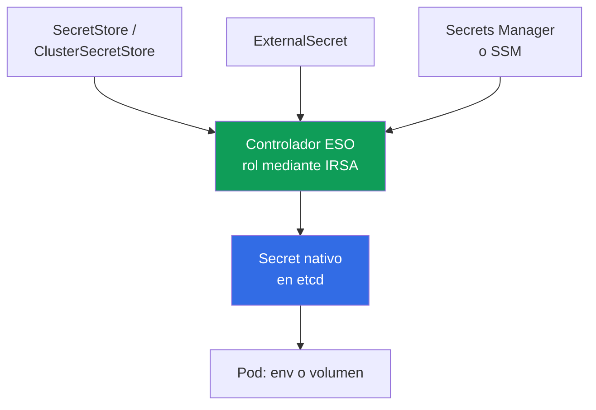
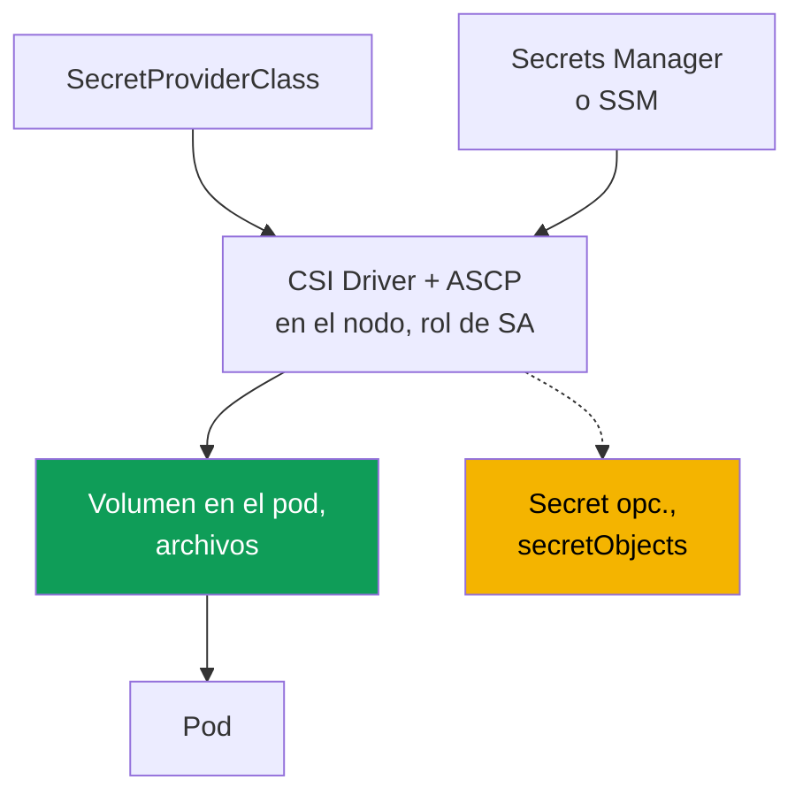

[Русская версия](ru.md) · [Eng version](en.md) · [Version française](fr.md) · [Deutsche Version](de.md) · [ქართული ვერსია](ge.md) · [繁體中文版](tw.md) · [日本語版](jp.md)
# Capítulo 18. Secretos: cifrado KMS, Secrets Manager y SSM mediante External Secrets y CSI

> **Qué sigue.** Los capítulos 16 y 17 enseñaron a asignar al pod su propio rol en AWS mediante IRSA
> o Pod Identity. Los secretos dependen directamente de esto: el controlador External Secrets y el controlador
> CSI necesitan un rol para leer de Secrets Manager y SSM, y lo reciben precisamente mediante esos mecanismos;
> aquí nos referimos a ellos en lugar de repetirlos. Temas relacionados en otros capítulos: cifrado al crear
> el clúster (capítulo 4), acceso RBAC a `Secret` (capítulo 5), supply chain y ECR (capítulo 20),
> hardening y Pod Security (capítulo 19), secretos en git y GitOps (capítulo 44).

## 18.1. «Un Secret en Kubernetes no es cifrado, es base64»

Una aplicación necesita la contraseña de la base de datos. Un ingeniero la coloca en un `Secret`, la monta
 en un pod y considera la tarea resuelta: «los datos están en un secreto». Pero un `Secret` de Kubernetes no
cifra nada.

- **base64 es codificación, no cifrado.** El valor en `data` lo puede decodificar con
  `base64 -d` cualquiera que tenga acceso al manifiesto o al objeto. La contraseña está expuesta.
- **El acceso lo decide RBAC, y solo RBAC.** Cualquier sujeto con `get`/`list` sobre el `Secret`
  en ese namespace puede leerlo (capítulo 5). El objeto no tiene una segunda barrera además de RBAC.
- **El secreto vive en etcd.** El valor se almacena en la base de datos del control plane. EKS cifra los
  discos de etcd en el nivel de almacenamiento, pero es protección del volumen, no del objeto: con RBAC
  válido se lee como siempre.
- **El secreto se filtra mediante git.** Se hace commit del manifiesto con `Secret` al repositorio, y la
  contraseña queda para siempre en el historial de git. Es una filtración clásica que un simple `git rm` no
  corrige.

Se necesita otra cosa: guardar secretos en un almacenamiento administrado de AWS con rotación y auditoría,
entregarlos al pod sin escribirlos en un manifiesto y proteger realmente el propio objeto en etcd, no con base64.

## 18.2. Dos capas de protección independientes que no se deben confundir

La tarea de «secretos en EKS» tiene dos capas distintas: resuelven problemas diferentes, pero se confunden
constantemente, aunque una no sustituye a la otra.

- **Capa 1: cifrado KMS de los secretos de Kubernetes en etcd** (envelope encryption). Trata de
  **cómo** se almacena el objeto `Secret` en el control plane: protección de datos en el nivel de almacenamiento.
- **Capa 2: externalizar los secretos a almacenes AWS** (Secrets Manager, SSM Parameter Store)
  y entregarlos al pod. Trata de **dónde vive en absoluto** el secreto y desde dónde llega a la aplicación.

La capa 1 protege el objeto `Secret` allí donde está, pero no elimina el acceso RBAC a él. La capa 2
elimina el secreto de los manifiestos y git, pero si crea un `Secret` nativo, este vuelve a estar en etcd, y la
capa 1 sigue siendo necesaria.

## 18.3. Capa 1: cifrado de envolvente KMS de secretos en etcd

El cifrado de envolvente es cifrado con dos claves. La **data encryption key (DEK)** cifra el `Secret`
antes de escribirlo en etcd, y la **key encryption key (KEK)**, su clave KMS, cifra la DEK. En etcd está el
secreto cifrado con la DEK cifrada; la DEK en claro no se almacena. EKS usa Kubernetes KMS provider v2, y
cada descifrado de una DEK en KMS queda visible en CloudTrail, de ahí la auditoría.

En EKS con Kubernetes **1.28 y posterior**, el cifrado de envolvente de los datos de Kubernetes API está
activado de forma predeterminada con una clave AWS (AWS owned key), sin que tenga que hacer nada. Su propia
**customer managed key (CMK)** añade lo que AWS owned key no proporciona: control sobre la política de
claves y auditoría de descifrado en CloudTrail. En un clúster existente, la CMK se habilita por separado
(capítulo 4).

```bash
# habilitar su propia CMK en un clúster existente (recurso secrets)
aws eks associate-encryption-config --cluster-name demo \
  --encryption-config '[{"resources":["secrets"],"provider":{"keyArn":"arn:aws:kms:eu-central-1:111122223333:key/abcd-1234"}}]'

# comprobar que el cifrado está configurado
aws eks describe-cluster --name demo --query 'cluster.encryptionConfig'
```

La clave debe ser simétrica y estar en la misma región que el clúster. La irreversibilidad es importante: se
puede habilitar el cifrado de secretos con CMK, pero **no se puede deshabilitar** (capítulo 4). De ahí el
principal riesgo operativo, la propia clave: si deshabilita o elimina la CMK, el control plane dejará de
descifrar secretos y perderá acceso a ellos. Por tanto, la CMK para EKS no se deshabilita y su política se
mantiene bajo control.

| `Secret` en etcd | AWS owned key (predeterminada en 1.28+) | Su propia CMK |
|---|---|---|
| Datos en discos de etcd | cifrados por AWS | cifrados por AWS |
| Objeto `Secret` (envelope encryption) | sí, con clave de AWS | sí, con su clave |
| Control sobre la clave y su política | no | sí |
| Auditoría de descifrado en CloudTrail | no | sí |
| ¿Se elimina el acceso RBAC a `Secret`? | no | no |

La última fila es lo principal: el cifrado protege el secreto **en el almacenamiento**, pero un sujeto con RBAC
de lectura lo obtendrá como antes. La separación de acceso sigue siendo RBAC (capítulo 5), y el cifrado de
envolvente cubre otro vector: el acceso a los datos de etcd saltándose la API.

## 18.4. Capa 2: por qué externalizar secretos del clúster

Incluso con la capa 1, el secreto permanece en el clúster: está en el manifiesto (con riesgo de llegar a git),
la rotación es manual y no hay un lugar único. La capa 2 convierte un almacén externo en la fuente y entrega el
secreto al clúster.

- **Rotación.** Secrets Manager permite rotación programada; la aplicación recibe el nuevo valor.
- **Auditoría y fuente única.** El acceso es mediante IAM y queda visible en CloudTrail; el secreto está en
  un solo lugar.
- **No hay secreto en manifiestos ni git.** Al clúster viajan solo referencias al secreto, no valores.
- **Separación por tipo de datos.** Secrets Manager es para secretos con rotación; SSM Parameter
  Store es para configuración, parte de la cual no son secretos.

Dos herramientas resuelven la entrega de manera distinta: **External Secrets Operator** crea un `Secret`
nativo, y **Secrets Store CSI Driver** monta el secreto directamente en el pod como volumen. Ambas obtienen el
rol para acceder a AWS mediante IRSA o Pod Identity (capítulos 16 y 17): es su fundamento, no un detalle.

## 18.5. External Secrets Operator: el controlador crea un Secret nativo

External Secrets Operator (ESO) es un controlador en el clúster. Lee un secreto de Secrets Manager o SSM y
**crea a partir de él un `Secret` Kubernetes normal**, que la aplicación consume como siempre, mediante env o
un volumen, sin soporte en el código.



Tres objetos definen la relación. **`SecretStore`** describe el acceso al almacén (proveedor `aws`,
servicio `SecretsManager` o `ParameterStore`, región, autenticación) y tiene alcance de namespace;
**`ClusterSecretStore`** es lo mismo para todo el clúster. **`ExternalSecret`** declara qué secreto obtener y
en qué `Secret` colocarlo; el controlador crea y actualiza el `Secret` de destino a partir de él.

Aislamiento: de forma predeterminada use `SecretStore` con alcance de namespace: el equipo que posee el
namespace lee solo sus secretos. `ClusterSecretStore` está disponible para todos los namespace y fácilmente se
convierte en un canal hacia secretos ajenos, por lo que se usa de forma puntual y con restricciones, no como
opción predeterminada.

```yaml
apiVersion: external-secrets.io/v1
kind: SecretStore
metadata:
  name: aws-sm
  namespace: payments
spec:
  provider:
    aws:
      service: SecretsManager
      region: eu-central-1
      # autenticación: rol del controlador mediante IRSA o Pod Identity (capítulos 16, 17)
---
apiVersion: external-secrets.io/v1
kind: ExternalSecret
metadata:
  name: db-credentials
  namespace: payments
spec:
  refreshInterval: 1h            # frecuencia de resincronización; 0: crear una sola vez
  secretStoreRef:
    name: aws-sm
    kind: SecretStore
  target:
    name: db-credentials         # nombre del Secret que creará ESO
  data:
    - secretKey: password        # clave en el Secret
      remoteRef:
        key: prod/payments/db    # nombre del secreto en Secrets Manager
        property: password       # campo dentro del secreto JSON
```

`refreshInterval` define el periodo de resincronización; con `0`, ESO crea el `Secret` una vez. La ventaja de
ESO es que el resultado es un `Secret` nativo, compatible con cualquier consumidor (env, volumen, chart de un
tercero). Hay una desventaja importante: el secreto **se materializa en etcd**, por ello la capa 1 (sección
18.3) es obligatoria para ESO. El rol del controlador para leer de AWS se proporciona mediante IRSA o Pod
Identity (capítulos 16 y 17).

Un detalle de la rotación: ESO actualizará el `Secret`, pero un pod que lo leyó en env al arrancar no verá el
nuevo valor, porque las variables se fijan al inicio (kubelet actualiza los volúmenes por sí mismo; env no).
Para que el pod vuelva a leer el secreto, se reinicia; **Stakater Reloader** lo hace automáticamente: observa
`Secret` y `ConfigMap` e inicia un rolling restart de los Deployment que los consumen:

```yaml
metadata:
  annotations:
    reloader.stakater.com/auto: "true"   # reiniciar al cambiar Secret/ConfigMap montados
```

```bash
kubectl -n payments get externalsecret db-credentials   # ¿STATUS SecretSynced?
kubectl -n payments get secret db-credentials            # apareció el Secret nativo
```

## 18.6. Secrets Store CSI Driver: el secreto se monta en el pod

Secrets Store CSI Driver con el proveedor AWS (ASCP) sigue otro camino: el secreto **se monta como un volumen
directamente en el pod** en forma de archivos, sin pasar por el objeto `Secret`. De forma predeterminada, el
controlador no crea un `Secret`, sino que coloca el secreto en un volumen del nodo. `SecretProviderClass`
define qué montar.



```yaml
apiVersion: secrets-store.csi.x-k8s.io/v1
kind: SecretProviderClass
metadata:
  name: db-credentials
  namespace: payments
spec:
  provider: aws
  parameters:
    objects: |
      - objectName: "prod/payments/db"   # nombre del secreto en Secrets Manager (o ARN)
        objectType: "secretsmanager"     # secretsmanager o ssmparameter
```

El pod hace referencia a la clase mediante un volumen CSI con `secretProviderClass`. La propiedad clave es que,
sin sincronización, el secreto aparece **solo en el volumen del nodo y no llega en absoluto a etcd**: esta es la
principal diferencia respecto a ESO. Opcionalmente, el controlador crea un `Secret` nativo mediante el bloque
`secretObjects`, pero la sincronización se realiza solo mientras un pod monta el volumen, y el `Secret` se
elimina junto con el último consumidor. El rotation reconciler proporciona la rotación de valores (se activa
mediante una bandera y actualiza el volumen).

```bash
kubectl -n payments get secretproviderclass db-credentials    # la clase está en su sitio
kubectl -n payments exec deploy/app -- ls /mnt/secrets-store   # archivos del secreto en el volumen
```

El rol para que el controlador acceda a AWS es, de nuevo, IRSA o Pod Identity (capítulos 16 y 17): se vincula
al `ServiceAccount` con el que se ejecuta el pod que monta el secreto.

## 18.7. ESO frente a CSI Driver

Las herramientas resuelven la misma tarea, «secreto de AWS al pod», pero de forma diferente, y la elección la
dicta la pregunta principal: dónde acabará el secreto y quién lo consume.

| Propiedad | External Secrets Operator | Secrets Store CSI Driver |
|---|---|---|
| Dónde vive el secreto | `Secret` nativo en etcd | archivos en un volumen del nodo |
| ¿Llega a etcd? | sí, siempre | no (si no se habilita `secretObjects`) |
| Cómo lo consume la aplicación | env o volumen desde `Secret` | lee archivos del volumen |
| Compatibilidad con env | completa (es un `Secret` normal) | solo mediante sincronización a `Secret` |
| Rotación | mediante `refreshInterval` | rotation reconciler actualiza el volumen |
| ¿Se necesita la capa 1 (KMS)? | sí, el secreto está en etcd | no para el volumen; sí al sincronizar |
| Rol para acceso a AWS | IRSA / Pod Identity | IRSA / Pod Identity |
| Depende del ciclo de vida del pod | no, el `Secret` vive por sí mismo | sí, el volumen y la sincronización viven con el pod |

En resumen: ESO es más sencillo para aplicaciones que necesitan un `Secret` (env, charts preparados), a costa
de que siempre esté en etcd. CSI sin sincronización deja un rastro mínimo, pero la aplicación debe leer archivos
del volumen.

### HashiCorp Vault: la misma capa 2, pero el almacén no es AWS

Hasta ahora, Secrets Manager y SSM Parameter Store actuaban como almacén, pero la capa 2 no está ligada a AWS.
Vault ocupa el mismo lugar en el esquema y llega al clúster por una de tres razones: ya existe en la empresa y
atiende más que EKS, se necesitan **secretos dinámicos** (AWS secrets engine emite credenciales IAM temporales,
database engine emite un usuario de base de datos de vida corta para una solicitud concreta), o se necesita una
fuente única para multicloud y el propio centro de datos.

La autenticación del pod en Vault se apoya en la misma mecánica que el capítulo 16. Kubernetes auth method
verifica el token del ServiceAccount mediante `TokenReview` en la API del clúster; JWT/OIDC auth verifica el
token proyectado mediante el OIDC-issuer del clúster, sin consultar la API; AWS IAM auth acepta una solicitud
firmada a `sts:GetCallerIdentity`, es decir, reconoce el rol de IRSA o Pod Identity. La primera variante es más
sencilla; la tercera encaja de forma más natural con un IRSA ya configurado.

La entrega del secreto al pod tiene cuatro formas, dos de las cuales ya conoce:

- **Vault Agent Injector**: un mutating webhook inserta en el pod un sidecar o init-container que inicia
  sesión en Vault y escribe el secreto en un `emptyDir` compartido; se habilita con las anotaciones
  `vault.hashicorp.com/agent-inject` y `vault.hashicorp.com/role`. No llega nada a etcd.
- **Vault Secrets Operator**: un controlador con CRD (`VaultStaticSecret`, `VaultDynamicSecret`,
  `VaultAuth`) que sincroniza el valor en un `Secret` nativo. Es exactamente el modelo de ESO, con todas sus
  propiedades de la tabla anterior.
- **ESO con el proveedor Vault**: el mismo operador de 18.5, solo que `SecretStore` no apunta a Secrets
  Manager, sino a Vault. Es útil cuando una parte de los secretos está en AWS y otra en Vault.
- **Secrets Store CSI Driver con el proveedor Vault**: montaje como archivos, igual que en 18.6.

El coste es tan honesto como en el capítulo 8 sobre cambiar CNI: el almacén pasa a ser suyo. Un Vault propio es
un clúster HA con su propio storage backend, claves de unseal y recovery, actualizaciones, backups y auditoría;
en AWS suele desplegarse con auto-unseal mediante KMS (`seal "awskms"`) para no guardar claves de unseal en manos
de personas. La variante administrada del proveedor elimina parte de ese trabajo, pero no la responsabilidad por
las políticas y roles. Otro matiz operativo: las consultas de secretos son visibles en el audit device de Vault,
no en CloudTrail; por tanto, la investigación de acceso pasa por dos registros (capítulo 21). La capa 1 no
desaparece: si el secreto se sincroniza en un `Secret`, está en etcd y queda protegido por el cifrado KMS de
18.3.

## 18.8. Rotación: cambió la contraseña de la base de datos

Por la noche se activó la rotación del secreto de la base de datos. Por la mañana, algunos pods funcionan y otros
fallan con un error de autenticación, mientras Secrets Manager contiene la nueva contraseña correcta. El valor en
AWS se actualizó al instante, pero llega a la aplicación mediante una cadena de cuatro eslabones y puede atascarse
en cualquiera de ellos.

| Eslabón | Qué determina la demora | Síntoma de configuración incorrecta |
|---|---|---|
| Almacén | estrategia de rotación y momento del cambio de contraseña en la BD | ventana donde la contraseña en la BD es nueva, pero los lectores aún tienen la anterior |
| Sincronización al clúster | `refreshInterval` en ESO, rotation reconciler en CSI | `Secret` o archivo en el volumen con valor antiguo |
| Cómo obtiene el valor la aplicación | env frente a volumen o archivo | env no cambia nunca, el volumen se actualiza |
| Conexiones a la base de datos | pool de conexiones y lógica de reconexión | el pool vive con credenciales antiguas hasta el reinicio |

**Eslabón 1: cómo rota Secrets Manager.** Una función de rotación gestiona la rotación, y las versiones del
secreto se marcan con etiquetas: todos leen `AWSCURRENT` de forma predeterminada; `AWSPENDING` es el nuevo valor
en comprobación; `AWSPREVIOUS` es el anterior. Hay dos estrategias, y la elección afecta directamente a la
disponibilidad. Con **single user** cambia la contraseña de un único usuario: las conexiones abiertas no se
interrumpen, pero entre el cambio de contraseña en la BD y la actualización del secreto hay un breve intervalo en
el que un intento de conexión con credenciales recién leídas puede ser rechazado. AWS considera esta estrategia
adecuada para la mayoría de casos, y el riesgo se cubre con reintentos con retraso exponencial. Con **alternating
users**, hay dos usuarios en el secreto: el rotador clona el original y, después, cambia las contraseñas por turno,
de modo que la aplicación recibe credenciales válidas en cualquier momento de la rotación, y ambos conjuntos
funcionan después de ella. El coste es un secreto separado con permisos de superuser (por lo general, un usuario no
puede clonarse a sí mismo) y la obligación de repetir los cambios de permisos en el clon.

**Eslabón 2: cómo llega el nuevo valor al clúster.** En ESO, es el `refreshInterval` de 18.5: con `0`, el
secreto se crea una vez y permanecerá antiguo para siempre tras la rotación. En CSI Driver, un rotation reconciler
independiente actualiza los archivos en el volumen y debe habilitarse; sin él, el volumen también es estático. Es
decir, «rotamos secretos» sin configurar este eslabón significa «cambiamos la contraseña solo en AWS».

**Eslabón 3: cómo ve el proceso el valor.** Las variables de entorno se establecen al iniciar el contenedor y
**nunca se actualizan**, incluso cuando el `Secret` ya es nuevo. kubelet actualiza por sí mismo el valor de un
volumen, pero la aplicación debe volver a leer el archivo, en vez de mantener la contraseña en memoria desde el
arranque. De ahí dos enfoques funcionales: reiniciar el pod al cambiar el secreto (Reloader de 18.5), o leer desde
un archivo y reaccionar a su cambio.

**Eslabón 4: conexiones.** Incluso tras releer la contraseña, la aplicación seguirá usando el pool ya abierto. El
comportamiento correcto es releer las credenciales ante un error de autenticación y recrear la conexión con
reintento y demora, en lugar de caer en `CrashLoopBackOff` y esperar un reinicio manual.

**Cómo eliminar todo el problema.** La rotación de contraseñas es gestionar algo que sería mejor no tener. Para
RDS y Aurora existe **IAM database authentication**: en lugar de una contraseña, la aplicación obtiene un token
mediante `aws rds generate-db-auth-token`, que vive 15 minutos de forma predeterminada, y los permisos los otorga
el rol del pod mediante IRSA o Pod Identity (capítulos 16 y 17). No hay nada que rotar: no existe una contraseña
permanente. Los secretos dinámicos de Vault de 18.7 ofrecen una idea parecida: las credenciales se emiten por
solicitud y expiran por sí mismas. Si aun así se necesita una contraseña, el cambio manual en producción se hace
con la lógica de alternating users: primero cree un segundo usuario, transfiera la carga y luego revoque el
primero, en lugar de cambiar de frente la contraseña de un usuario en funcionamiento.

## 18.9. KMS y almacenes externos juntos

Las capas no son alternativas, se suman; la regla depende de si el secreto llega a etcd:

- **ESO** escribe un `Secret` nativo, el secreto llega a etcd: la capa 1 siempre es necesaria; de otro modo,
  el almacén externo está protegido, pero su copia en etcd no.
- **CSI sin sincronización** monta el secreto solo en un volumen del nodo, no llega a etcd: la capa 1 no
  interviene para él. Con `secretObjects`, aparece un `Secret` y la capa 1 vuelve a ser necesaria.

Externalizar el secreto no elimina el cifrado de lo que quedó en el clúster: la capa 1 se mantiene siempre (en
1.28+ ya está predeterminada), y la elección entre ESO y CSI solo decide el tamaño del rastro en el clúster.

## 18.10. Diagnóstico: el secreto no apareció o no se actualizó

Los fallos son predecibles: casi todo se reduce al rol del controlador o del driver, los objetos de configuración
y los permisos sobre la clave KMS del propio secreto en AWS.

| Síntoma | Causa probable | Qué comprobar |
|---|---|---|
| `ExternalSecret` no está en `SecretSynced` | el rol del controlador no lee el secreto | IRSA/Pod Identity del controlador ESO |
| No se creó el `Secret` nativo | error en `SecretStore` o `remoteRef` | `kubectl describe externalsecret` |
| El volumen está vacío, el pod no inicia | `SecretProviderClass` o rol de SA del pod | clase, anotación/asociación de SA |
| `AccessDenied` al leer el secreto | faltan permisos en la política IAM del rol | `secretsmanager:GetSecretValue` |
| `AccessDenied` al descifrar | faltan permisos para la clave KMS del secreto | `kms:Decrypt` en la clave del secreto |
| El valor está obsoleto | la rotación o el refresh no están configurados | `refreshInterval` (ESO), reconciler (CSI) |

El orden de análisis va del rol a los objetos y hacia fuera, a AWS:

```bash
# 1. estado de sincronización y eventos de ESO
kubectl -n payments describe externalsecret db-credentials

# 2. registros del controlador ESO (rol, acceso al almacén, errores del proveedor)
kubectl -n external-secrets logs deploy/external-secrets

# 3. para CSI, registros del driver en el nodo del pod
kubectl -n kube-system logs ds/csi-secrets-store-secrets-store-csi-driver -c secrets-store
```

Un tropiezo frecuente: el propio secreto de Secrets Manager está cifrado con una clave KMS, y el rol del
controlador o driver necesita `kms:Decrypt` sobre **esa** clave, que no se debe confundir con la CMK del clúster
de la capa 1. Si `GetSecretValue` funciona pero el secreto no se puede leer, la causa normalmente está en los
permisos para su clave.

## 18.11. Cómo se aplica en producción

- **No haga commit de secretos.** A git van `ExternalSecret`, `SecretStore` y `SecretProviderClass`: referencias
  al secreto, no valores. La filtración mediante el historial de git se corta de raíz (capítulo 44).
- **La capa 1 está siempre habilitada.** En 1.28+, envelope encryption funciona de forma predeterminada; para
  producción se usa la propia CMK por el control y la auditoría en CloudTrail, y su política se mantiene protegida.
- **RBAC mínimo sobre `Secret`.** Envelope encryption no sustituye RBAC: los permisos de lectura se otorgan de
  forma puntual; de otro modo, la capa 1 protege de todo salvo del sujeto válido (capítulo 5).
- **Rotación en la fuente.** Los secretos con rotación se guardan en Secrets Manager, y el `refreshInterval` de
  ESO o el rotation reconciler de CSI se configura para que el pod reciba el valor actualizado. Los pods que leen
  `Secret` en env se actualizan con un rolling restart de Stakater Reloader.
- **Aislamiento de almacenes por namespace.** De forma predeterminada, `SecretStore` con alcance de namespace;
  `ClusterSecretStore` solo de forma puntual y con restricciones, para que los equipos no lean secretos ajenos.
- **Distintos almacenes para distintos datos.** Secrets Manager es para secretos con rotación; SSM Parameter
  Store para configuración: esto separa tanto permisos como el coste de las consultas.
- **El rol, mediante IRSA o Pod Identity.** Al controlador y al driver se les asigna un rol separado con permisos
  `GetSecretValue` y `kms:Decrypt` para las claves necesarias, no un rol compartido (capítulos 16 y 17).

## 18.12. Miniglosario

- **Envelope encryption**: cifrado con dos claves: la DEK cifra los datos y la KEK (la clave KMS) cifra la DEK.
  EKS lo aplica a secretos de etcd mediante Kubernetes KMS provider v2.
- **CMK (customer managed key)**: su clave KMS, que proporciona control sobre la política de claves y auditoría
  de descifrado en CloudTrail, a diferencia de la AWS owned key predeterminada.
- **External Secrets Operator (ESO)**: controlador que lee un secreto de AWS y crea a partir de él un `Secret`
  nativo; objetos `SecretStore`/`ClusterSecretStore` y `ExternalSecret`.
- **Secrets Store CSI Driver + AWS provider (ASCP)**: driver que monta un secreto de AWS como archivos en un
  volumen del nodo; objeto `SecretProviderClass`, sincronización opcional a un `Secret`.
- **Stakater Reloader**: controlador que realiza un rolling restart de un Deployment según una anotación al cambiar
  `Secret` o `ConfigMap` montados, para que el pod adopte el nuevo valor.
- **Staging labels**: etiquetas de versión de secreto en Secrets Manager: `AWSCURRENT` se lee de forma
  predeterminada, `AWSPENDING` es el valor en comprobación durante la rotación y `AWSPREVIOUS` es el anterior.
- **Estrategia de rotación**: `single user` (cambia la contraseña de un usuario, hay una breve ventana de riesgo
  de rechazo, que se cubre con reintentos con demora) o `alternating users` (dos usuarios por turnos,
  credenciales válidas en todo momento, requiere un secreto con permisos de superuser).
- **IAM database authentication**: acceso a RDS o Aurora con un token temporal
  (`aws rds generate-db-auth-token`, 15 minutos de forma predeterminada) en lugar de contraseña; no hay nada que
  rotar.
- **HashiCorp Vault**: almacén externo de secretos no perteneciente a AWS, que ocupa el mismo lugar que Secrets
  Manager: autenticación del pod mediante Kubernetes, JWT/OIDC o AWS IAM auth; entrega mediante Vault Agent
  Injector, Vault Secrets Operator, ESO o CSI Driver con proveedor Vault. La diferencia principal son los
  **secretos dinámicos** (credenciales IAM y de BD temporales bajo demanda); el coste es operar el propio Vault y
  un audit device independiente en vez de CloudTrail.

## 18.13. Resumen del capítulo

- Un `Secret` en Kubernetes es base64, no cifrado: el acceso lo decide RBAC, el valor vive en etcd y se filtra
  fácilmente mediante git. De ahí dos tareas diferentes que no se deben mezclar.
- La capa 1 es el cifrado de envolvente KMS de secretos de etcd: la DEK cifra el `Secret`, la KEK (clave KMS)
  cifra la DEK. En 1.28+ está habilitado de forma predeterminada con AWS owned key; la propia CMK aporta control y
  auditoría.
- La capa 1 protege el secreto en el almacenamiento, pero **no elimina RBAC** para leerlo. La habilitación es
  irreversible, y deshabilitar o eliminar la CMK priva al control plane de acceso a los secretos.
- La capa 2 externaliza el secreto a un almacén externo (Secrets Manager, SSM) para tener rotación, auditoría,
  fuente única y ausencia de secretos en manifiestos. Hay dos herramientas: ESO y CSI Driver.
- ESO crea un `Secret` nativo (compatible con cualquier consumidor, pero el secreto queda en etcd y la capa 1 es
  obligatoria). CSI monta el secreto en un volumen y, de forma predeterminada, no crea un `Secret`: no está en etcd.
- Ambas obtienen el rol hacia AWS mediante IRSA o Pod Identity (capítulos 16 y 17). El diagnóstico va del rol a
  los objetos y a los permisos sobre la clave KMS del propio secreto (`kms:Decrypt`) en AWS.
- La rotación llega a la aplicación mediante cuatro eslabones: estrategia en el almacén, sincronización al
  clúster (`refreshInterval` o rotation reconciler), forma de leer el valor (env nunca se actualiza) y pool de
  conexiones. La salida radical es IAM database authentication para RDS o secretos dinámicos, donde no existe una
  contraseña permanente.

## 18.14. Cómo será útil en el trabajo real

Con un almacén externo, la pregunta «dónde vive el secreto y quién puede leerlo» se responde con una entrada en
Secrets Manager y la política IAM del rol, no buscando manifiestos en todos los namespace. El incidente «secreto
en git» deja de ocurrir: en el repositorio solo hay referencias. Durante la guardia, «el pod no arrancó, el volumen
está vacío» o «`ExternalSecret` no se sincroniza» se resuelve siguiendo la cadena de la sección 18.10: rol, objeto
de configuración, permisos sobre el secreto y su clave KMS. Y saber que ESO coloca el secreto en etcd, mientras
CSI sin sincronización no, ayuda a elegir la herramienta según el rastro requerido.

## 18.15. Preguntas de autoevaluación

1. ¿Por qué un `Secret` en Kubernetes no se puede considerar cifrado y qué limita el acceso a él?
2. ¿En qué se diferencia el cifrado de discos etcd en AWS del cifrado de envolvente del objeto `Secret`?
3. ¿Cómo funciona el cifrado de envolvente mediante KMS: qué hace la DEK y qué hace la KEK?
4. ¿Desde qué versión de EKS está habilitado envelope encryption de forma predeterminada y con qué clave?
5. ¿Qué proporciona la propia CMK frente a AWS owned key y cuál es su riesgo operativo?
6. ¿Elimina la capa 1 (KMS) la necesidad de RBAC para leer `Secret`? ¿Por qué?
7. ¿Por qué externalizar secretos a almacenes externos si etcd ya está cifrado?
8. ¿En qué se diferencia `SecretStore` de `ClusterSecretStore` y qué describe `ExternalSecret`?
9. ¿Por qué la capa 1 sigue siendo obligatoria al usar ESO?
10. ¿Dónde coloca CSI Driver el secreto de forma predeterminada y cuándo crea aun así un `Secret` nativo?
11. `GetSecretValue` funciona, pero el secreto no se puede leer. ¿Qué permiso hay que comprobar y sobre qué clave?
12. ESO actualizó el `Secret`, pero la aplicación ve la contraseña antigua en env. ¿Por qué y qué lo resuelve?
13. ¿Por qué `SecretStore` con alcance de namespace es preferible a `ClusterSecretStore` para el aislamiento?
14. ¿Qué tres motivos llevan Vault al clúster y qué se paga por ello en operación?
15. ¿En qué se diferencia Vault Agent Injector de Vault Secrets Operator por el rastro en etcd?
16. Se rotó la contraseña de la base de datos, Secrets Manager tiene la nueva, pero parte de los pods falla con
    error de autenticación. Desglose la cadena de cuatro eslabones: ¿dónde se atascó el valor exactamente?
17. ¿En qué se diferencia `single user` de `alternating users` en disponibilidad y qué requiere la segunda?
18. ¿Por qué una aplicación con la contraseña en una variable de entorno no sobrevive a la rotación y qué dos
    formas lo resuelven?

## Práctica

El laboratorio del curso para este tema: [laboratorio 105: Secretos, KMS envelope encryption y External Secrets
Operator](../../labs/105/README_ES.MD). Además de él, todo se comprueba en un clúster activo. Capa 1: `aws eks
describe-cluster --name <cluster> --query 'cluster.encryptionConfig'` mostrará si el cifrado está habilitado y con
qué clave. En 1.28+ funciona incluso sin CMK; su propia clave se añade con el comando `aws eks
associate-encryption-config` de la sección 18.3, recordando su irreversibilidad.

Después, la capa 2. Instale External Secrets Operator, asigne a su controlador un rol mediante IRSA o Pod Identity
(capítulos 16 y 17) con permisos `secretsmanager:GetSecretValue` y `kms:Decrypt` sobre la clave del secreto, cree
`SecretStore` y `ExternalSecret`, y compruebe `kubectl get externalsecret` (estado `SecretSynced`) y el `kubectl
get secret` que aparece. Repita lo mismo mediante Secrets Store CSI Driver: `SecretProviderClass`, un pod con
volumen CSI, y asegúrese de que los archivos están en el volumen y no existe un `Secret` nativo. Practique un
fallo: elimine `kms:Decrypt` sobre la clave del secreto del rol y encuentre `AccessDenied` en los registros del
controlador o driver.

---
[Índice](../README_ES.md) · [Capítulo 17](../17/es.md) · [Capítulo 19](../19/es.md)