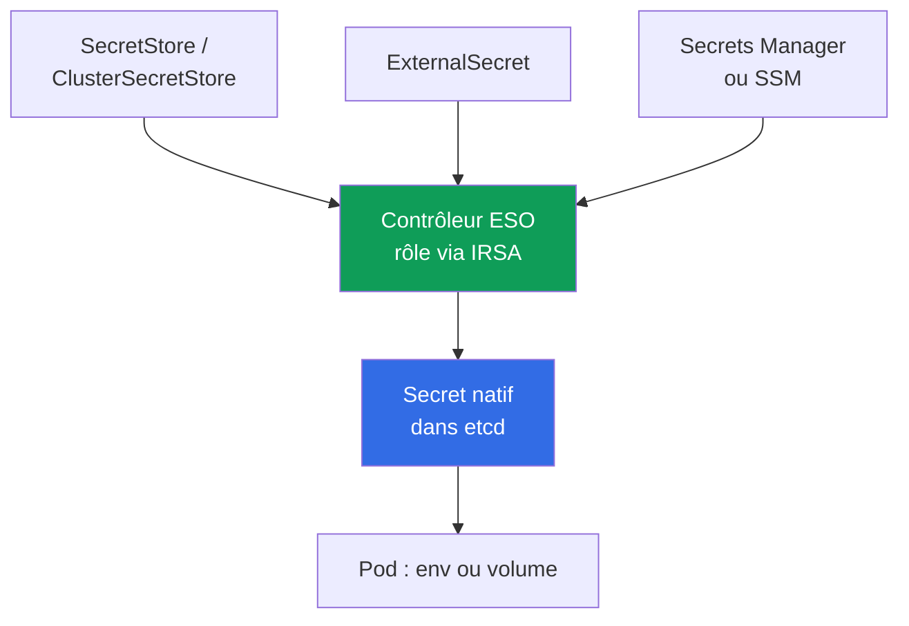
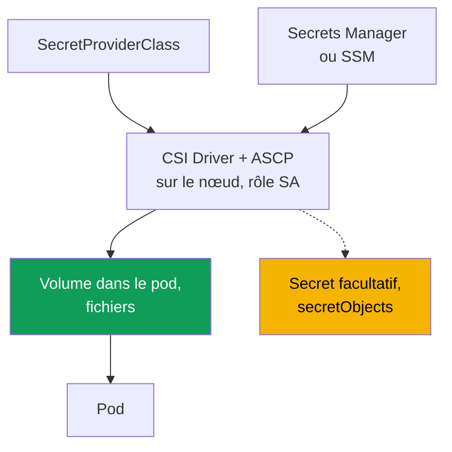

[Русская версия](ru.md) · [Eng version](en.md) · [Versión en español](es.md) · [Deutsche Version](de.md) · [ქართული ვერსია](ge.md) · [繁體中文版](tw.md) · [日本語版](jp.md)
# Chapitre 18. Secrets : chiffrement KMS, Secrets Manager et SSM via External Secrets et CSI

> **La suite.** Les chapitres 16 et 17 ont montré comment attribuer au pod son propre rôle AWS via IRSA ou Pod Identity. Les secrets s'appuient directement dessus : le contrôleur External Secrets et le pilote CSI ont besoin d'un rôle pour lire depuis Secrets Manager et SSM, et ce sont précisément ces mécanismes qui le leur donnent. Nous y faisons donc référence sans les répéter. Les sujets connexes sont dans d'autres chapitres : chiffrement lors de la création du cluster (chapitre 4), accès RBAC à `Secret` (chapitre 5), supply chain et ECR (chapitre 20), durcissement et Pod Security (chapitre 19), secrets dans git et GitOps (chapitre 44).

## 18.1. « Un `Secret` Kubernetes n'est pas du chiffrement, c'est du base64 »

Une application a besoin du mot de passe de la base de données. L'ingénieur le place dans un `Secret`, le monte dans le pod et considère la tâche terminée : « les données sont bien dans un secret ». Mais un `Secret` Kubernetes ne chiffre rien.

- **base64 est un encodage, pas un chiffrement.** Toute personne ayant accès au manifeste ou à l'objet peut décoder la valeur dans `data` avec `base64 -d`. Le mot de passe est en clair.
- **L'accès est décidé par RBAC, et uniquement par lui.** Tout sujet ayant `get`/`list` sur ce `Secret` dans ce namespace peut le lire (chapitre 5). L'objet n'offre pas de seconde barrière au-delà de RBAC.
- **Le secret vit dans etcd.** Sa valeur est stockée dans la base de données du control plane. EKS chiffre les disques etcd au niveau du stockage, mais c'est une protection du volume, pas de l'objet : avec un RBAC valide, il reste lisible comme d'habitude.
- **Les secrets fuient via git.** Un manifeste avec un `Secret` est commité dans le dépôt, et le mot de passe reste pour toujours dans l'historique git. C'est une fuite classique, qu'un simple `git rm` ne corrige pas.

Il faut autre chose : stocker les secrets dans un coffre AWS managé avec rotation et audit, les fournir au pod sans les inscrire dans un manifeste, et protéger réellement l'objet dans etcd, plutôt qu'avec du base64.

## 18.2. Deux couches de protection indépendantes à ne pas confondre

La question des secrets dans EKS comporte deux couches distinctes : elles résolvent des problèmes différents, mais elles sont constamment confondues, alors qu'aucune ne remplace l'autre.

- **Couche 1 : chiffrement KMS des secrets Kubernetes dans etcd** (envelope encryption). Elle concerne **la manière dont** l'objet `Secret` est stocké dans le control plane : la protection des données au niveau du stockage.
- **Couche 2 : externalisation des secrets dans des coffres AWS** (Secrets Manager, SSM Parameter Store) et leur fourniture au pod. Elle concerne **l'endroit où vit** le secret et d'où il arrive dans l'application.

La couche 1 protège l'objet `Secret` là où il est stocké, mais n'annule pas l'accès RBAC à cet objet. La couche 2 retire le secret des manifestes et de git, mais si elle crée un `Secret` natif, celui-ci retourne dans etcd et la couche 1 reste nécessaire.

## 18.3. Couche 1 : KMS envelope encryption des secrets etcd

L'envelope encryption est un chiffrement à deux clés. La **data encryption key (DEK)** chiffre le `Secret` avant son écriture dans etcd, et la **key encryption key (KEK)**, votre clé KMS, chiffre la DEK. etcd contient le secret chiffré avec sa DEK chiffrée ; la DEK en clair n'est pas stockée. EKS utilise Kubernetes KMS provider v2, et chaque déchiffrement de DEK dans KMS est visible dans CloudTrail, ce qui fournit l'audit.

Sur EKS avec Kubernetes **1.28 et versions ultérieures**, l'envelope encryption des données de l'API Kubernetes est activée par défaut avec une clé AWS (AWS owned key), sans action de votre part. Une **customer managed key (CMK)** apporte ce que l'AWS owned key ne fournit pas : le contrôle de la politique de clé et l'audit des déchiffrements dans CloudTrail. Sur un cluster existant, on active séparément la CMK (chapitre 4).

```bash
# activer sa propre CMK sur un cluster existant (ressource secrets)
aws eks associate-encryption-config --cluster-name demo \
  --encryption-config '[{"resources":["secrets"],"provider":{"keyArn":"arn:aws:kms:eu-central-1:111122223333:key/abcd-1234"}}]'

# vérifier que le chiffrement est configuré
aws eks describe-cluster --name demo --query 'cluster.encryptionConfig'
```

La clé doit être symétrique et dans la même région que le cluster. Son irréversibilité est importante : le chiffrement CMK des secrets peut être activé, mais **ne peut pas être désactivé** (chapitre 4). Le principal risque opérationnel est donc la clé elle-même : si la CMK est désactivée ou supprimée, le control plane ne pourra plus déchiffrer les secrets et perdra l'accès à ceux-ci. Une CMK EKS ne doit donc pas être désactivée, et sa politique doit rester sous contrôle.

| `Secret` dans etcd | AWS owned key (par défaut en 1.28+) | Votre CMK |
|---|---|---|
| Données sur disque etcd | chiffrées par AWS | chiffrées par AWS |
| Objet `Secret` (envelope encryption) | oui, avec une clé AWS | oui, avec votre clé |
| Contrôle de la clé et de sa politique | non | oui |
| Audit des déchiffrements dans CloudTrail | non | oui |
| L'accès RBAC au `Secret` est-il annulé ? | non | non |

La dernière ligne est essentielle : le chiffrement protège le secret **dans le stockage**, mais un sujet doté du RBAC de lecture l'obtient comme auparavant. Le contrôle des accès reste RBAC (chapitre 5), tandis que l'envelope encryption couvre un autre vecteur : l'accès aux données etcd en dehors de l'API.

## 18.4. Couche 2 : pourquoi externaliser les secrets hors du cluster

Même avec la couche 1, le secret reste dans le cluster : dans le manifeste (avec le risque de finir dans git), sa rotation est manuelle et il n'existe pas de point central. La couche 2 fait du coffre externe la source, puis fournit le secret au cluster.

- **Rotation.** Secrets Manager prend en charge la rotation planifiée ; l'application reçoit une nouvelle valeur.
- **Audit et source unique.** L'accès utilise IAM et est visible dans CloudTrail ; le secret se trouve à un seul endroit.
- **Aucun secret dans les manifestes ni git.** Seules des références au secret sont envoyées au cluster, jamais ses valeurs.
- **Séparation par type de données.** Secrets Manager convient aux secrets avec rotation, SSM Parameter Store à la configuration, dont une partie n'est pas secrète.

Deux outils réalisent cette fourniture différemment : **External Secrets Operator** crée un `Secret` natif, tandis que **Secrets Store CSI Driver** monte le secret directement dans le pod comme volume. Tous deux obtiennent le rôle d'accès à AWS via IRSA ou Pod Identity (chapitres 16 et 17) : c'est leur fondation, pas un détail.

## 18.5. External Secrets Operator : le contrôleur crée un `Secret` natif

External Secrets Operator (ESO) est un contrôleur dans le cluster. Il lit le secret depuis Secrets Manager ou SSM et **crée un `Secret` Kubernetes ordinaire**, que l'application consomme comme toujours, via env ou un volume, sans prise en charge dans le code.



Trois objets définissent ce lien. **`SecretStore`** décrit l'accès au coffre (fournisseur `aws`, service `SecretsManager` ou `ParameterStore`, région, authentification), et sa portée est le namespace ; **`ClusterSecretStore`** fournit la même chose pour tout le cluster. **`ExternalSecret`** déclare quel secret récupérer et dans quel `Secret` le placer ; le contrôleur crée et actualise le `Secret` cible à partir de lui.

Isolation : par défaut, utilisez un `SecretStore` limité au namespace, l'équipe propriétaire du namespace ne lit alors que ses propres secrets. `ClusterSecretStore` est disponible pour tous les namespaces et peut facilement devenir un canal vers les secrets des autres équipes ; il s'emploie donc ponctuellement et avec des restrictions, jamais comme choix par défaut.

```yaml
apiVersion: external-secrets.io/v1
kind: SecretStore
metadata:
  name: aws-sm
  namespace: payments
spec:
  provider:
    aws:
      service: SecretsManager
      region: eu-central-1
      # authentification : rôle du contrôleur via IRSA ou Pod Identity (chapitres 16, 17)
---
apiVersion: external-secrets.io/v1
kind: ExternalSecret
metadata:
  name: db-credentials
  namespace: payments
spec:
  refreshInterval: 1h            # fréquence de resynchronisation ; 0 : créer une seule fois
  secretStoreRef:
    name: aws-sm
    kind: SecretStore
  target:
    name: db-credentials         # nom du Secret que créera ESO
  data:
    - secretKey: password        # clé dans le Secret
      remoteRef:
        key: prod/payments/db    # nom du secret dans Secrets Manager
        property: password       # champ du secret JSON
```

`refreshInterval` définit la période de resynchronisation ; avec `0`, ESO crée le `Secret` une fois. L'avantage d'ESO est que le résultat est un `Secret` natif compatible avec n'importe quel consommateur (env, volume, chart tiers). Son inconvénient est important : le secret **est matérialisé dans etcd**, donc la couche 1 (section 18.3) est obligatoire avec ESO. Le rôle permettant au contrôleur de lire dans AWS est fourni par IRSA ou Pod Identity (chapitres 16 et 17).

Nuance de rotation : ESO actualise le `Secret`, mais un pod qui l'a lu dans env au démarrage ne verra pas la nouvelle valeur, car les variables sont figées au démarrage (kubelet actualise seul les volumes, pas env). Pour que le pod relise le secret, il faut le redémarrer ; **Stakater Reloader** le fait automatiquement : il surveille `Secret` et `ConfigMap`, puis lance le rolling restart des Deployment qui les consomment :

```yaml
metadata:
  annotations:
    reloader.stakater.com/auto: "true"   # redémarrage lorsque les Secret/ConfigMap montés changent
```

```bash
kubectl -n payments get externalsecret db-credentials   # STATUS SecretSynced ?
kubectl -n payments get secret db-credentials            # le Secret natif est apparu
```

## 18.6. Secrets Store CSI Driver : le secret est monté dans le pod

Secrets Store CSI Driver avec le fournisseur AWS (ASCP) suit une autre approche : le secret est **monté comme volume directement dans le pod** sous forme de fichiers, en évitant l'objet `Secret`. Par défaut, le pilote ne crée pas de `Secret`, mais place le secret dans un volume sur le nœud. `SecretProviderClass` définit ce qui doit être monté.



```yaml
apiVersion: secrets-store.csi.x-k8s.io/v1
kind: SecretProviderClass
metadata:
  name: db-credentials
  namespace: payments
spec:
  provider: aws
  parameters:
    objects: |
      - objectName: "prod/payments/db"   # nom du secret dans Secrets Manager (ou ARN)
        objectType: "secretsmanager"     # secretsmanager ou ssmparameter
```

Le pod référence la classe dans un volume CSI avec `secretProviderClass`. Propriété clé : sans synchronisation, le secret n'apparaît **que dans le volume sur le nœud et ne va jamais dans etcd** : c'est la différence majeure avec ESO. Le pilote peut facultativement créer un `Secret` natif via le bloc `secretObjects`, mais la synchronisation n'a lieu que tant qu'un pod monte le volume, et le `Secret` est supprimé avec le dernier consommateur. Le rotation reconciler fournit la rotation des valeurs (activé par un flag, il actualise le volume).

```bash
kubectl -n payments get secretproviderclass db-credentials    # la classe existe
kubectl -n payments exec deploy/app -- ls /mnt/secrets-store   # fichiers secrets dans le volume
```

Le rôle permettant au pilote d'accéder à AWS est encore attribué via IRSA ou Pod Identity (chapitres 16 et 17) : il est lié au `ServiceAccount` exécutant le pod qui monte le secret.

## 18.7. ESO contre CSI Driver

Les outils résolvent la même tâche, « faire arriver un secret AWS dans un pod », mais différemment. Le choix est dicté par la question principale : où le secret se trouvera-t-il, et qui le consomme ?

| Propriété | External Secrets Operator | Secrets Store CSI Driver |
|---|---|---|
| Où vit le secret | `Secret` natif dans etcd | fichiers dans un volume sur le nœud |
| Arrive-t-il dans etcd ? | oui, toujours | non (si `secretObjects` n'est pas activé) |
| Comment l'application le consomme | env ou volume depuis un `Secret` | lit les fichiers du volume |
| Compatibilité avec env | complète (c'est un `Secret` ordinaire) | seulement via synchronisation dans un `Secret` |
| Rotation | selon `refreshInterval` | rotation reconciler actualise le volume |
| La couche 1 (KMS) est-elle nécessaire ? | oui, le secret est dans etcd | pas pour le volume ; oui en cas de sync |
| Rôle d'accès à AWS | IRSA / Pod Identity | IRSA / Pod Identity |
| Dépend du cycle de vie du pod | non, le `Secret` vit de lui-même | oui, le volume et la sync vivent avec le pod |

En résumé : ESO est plus simple pour les applications ayant besoin d'un `Secret` (env, charts prêts à l'emploi), au prix de sa présence systématique dans etcd. CSI sans sync laisse une empreinte minimale, mais l'application doit lire les fichiers du volume.

### HashiCorp Vault : la même couche 2, mais un coffre hors AWS

Jusqu'ici, Secrets Manager et SSM Parameter Store tenaient le rôle de coffre, mais la couche 2 n'est pas liée à AWS. Vault occupe la même place dans l'architecture et arrive dans le cluster pour l'une de trois raisons : il est déjà déployé dans l'entreprise et ne sert pas seulement EKS, des **secrets dynamiques** sont nécessaires (AWS secrets engine fournit des identifiants IAM temporaires, database engine un utilisateur de base de données de courte durée pour une requête précise), ou une source unique est requise pour le multicloud et le propre datacenter.

L'authentification d'un pod dans Vault repose sur le même mécanisme qu'au chapitre 16. Kubernetes auth method vérifie le token du ServiceAccount avec `TokenReview` dans l'API du cluster ; JWT/OIDC auth vérifie le token projeté auprès de l'OIDC issuer du cluster sans appeler l'API ; AWS IAM auth accepte une requête signée vers `sts:GetCallerIdentity`, et reconnaît donc le rôle IRSA ou Pod Identity. La première option est plus simple, la troisième s'intègre plus naturellement à un IRSA déjà configuré.

La fourniture du secret au pod offre quatre options, dont deux sont déjà connues :

- **Vault Agent Injector** : un mutating webhook injecte dans le pod un sidecar ou un init-container qui se connecte à Vault et écrit le secret dans un `emptyDir` partagé ; il est activé par les annotations `vault.hashicorp.com/agent-inject` et `vault.hashicorp.com/role`. Rien n'arrive dans etcd.
- **Vault Secrets Operator** : un contrôleur avec des CRD (`VaultStaticSecret`, `VaultDynamicSecret`, `VaultAuth`) qui synchronise la valeur dans un `Secret` natif. C'est exactement le modèle ESO, avec toutes les propriétés du tableau ci-dessus.
- **ESO avec le fournisseur Vault** : le même opérateur que dans la section 18.5, mais le `SecretStore` cible Vault plutôt que Secrets Manager. C'est pratique lorsqu'une partie des secrets est dans AWS et l'autre dans Vault.
- **Secrets Store CSI Driver avec le fournisseur Vault** : montage sous forme de fichiers, comme dans la section 18.6.

Le coût est aussi concret qu'au chapitre 8 sur le changement de CNI : le coffre devient votre responsabilité. Un Vault géré en propre est un cluster HA avec son storage backend, ses clés unseal et recovery, ses mises à jour, sauvegardes et audits ; dans AWS, il est généralement déployé avec auto-unseal via KMS (`seal "awskms"`) afin de ne pas confier les clés unseal aux personnes. Une offre managée du fournisseur retire une partie de ce travail, mais pas la responsabilité des politiques et rôles. Nuance opérationnelle distincte : les accès aux secrets sont visibles dans l'audit device Vault, et non dans CloudTrail ; l'investigation d'accès s'effectue donc dans deux journaux (chapitre 21). La couche 1 ne disparaît pas : si le secret est tout de même synchronisé dans un `Secret`, il réside dans etcd et est protégé par le chiffrement KMS de la section 18.3.

## 18.8. Rotation : le mot de passe de la base a changé

La rotation du secret de la base s'est exécutée pendant la nuit. Le matin, une partie des pods fonctionne et une autre échoue avec une erreur d'authentification, alors que Secrets Manager contient le nouveau mot de passe correct. La valeur dans AWS est actualisée immédiatement, mais elle arrive à l'application par une chaîne de quatre maillons, et peut rester bloquée dans chacun d'eux.

| Maillon | Ce qui définit le délai | Symptôme en cas de mauvaise configuration |
|---|---|---|
| Coffre | stratégie de rotation et instant du changement de mot de passe en base | fenêtre où le mot de passe est nouveau en base, alors que les lecteurs ont encore l'ancien |
| Synchronisation vers le cluster | `refreshInterval` d'ESO, rotation reconciler de CSI | `Secret` ou fichier du volume avec une ancienne valeur |
| Façon dont l'application obtient la valeur | env contre volume ou fichier | env ne change jamais, le volume est actualisé |
| Connexions à la base | pool de connexions et logique de reconnexion | le pool vit avec les anciens identifiants jusqu'au redémarrage |

**Maillon 1 : rotation par Secrets Manager.** Une fonction de rotation gère la rotation, et les versions du secret portent des labels : `AWSCURRENT` est lu par défaut par tous, `AWSPENDING` est la nouvelle valeur en vérification, `AWSPREVIOUS` est la précédente. Deux stratégies existent, et le choix affecte directement la disponibilité. Avec **single user**, le mot de passe d'un seul utilisateur est modifié : les connexions ouvertes ne sont pas rompues, mais il existe un bref intervalle entre le changement du mot de passe en base et l'actualisation du secret pendant lequel une tentative de connexion avec des identifiants tout juste lus peut être refusée. AWS considère cette stratégie appropriée dans la plupart des cas, et le risque est couvert par des tentatives avec délai exponentiel. Avec **alternating users**, le secret contient deux utilisateurs : le rotateur clone l'utilisateur initial et alterne ensuite les mots de passe, afin que l'application reçoive des identifiants valides à tout moment de la rotation et que les deux jeux fonctionnent ensuite. Son coût est un secret distinct avec des droits superuser, car un utilisateur ne peut généralement pas se cloner lui-même, et l'obligation de reproduire les modifications de droits sur le clone.

**Maillon 2 : arrivée de la nouvelle valeur dans le cluster.** Pour ESO, c'est le `refreshInterval` de la section 18.5 : à `0`, le secret n'est créé qu'une fois et reste définitivement ancien après une rotation. Pour CSI Driver, les fichiers du volume sont actualisés par un rotation reconciler distinct, qu'il faut activer ; sans lui, le volume reste aussi statique. Autrement dit, « nous faisons tourner les secrets » sans configurer ce maillon signifie « nous changeons le mot de passe uniquement dans AWS ».

**Maillon 3 : visibilité de la valeur par le processus.** Les variables d'environnement sont définies au démarrage du conteneur et **ne sont jamais actualisées**, même lorsque le `Secret` est déjà nouveau. kubelet actualise seul une valeur issue d'un volume, mais l'application doit relire le fichier au lieu de conserver le mot de passe en mémoire depuis son démarrage. Deux approches fonctionnent donc : redémarrer le pod lors d'un changement de secret, avec Reloader de la section 18.5, ou lire le fichier et réagir à sa modification.

**Maillon 4 : connexions.** Même après avoir relu le mot de passe, l'application continuera d'utiliser son pool déjà ouvert. Le bon comportement consiste, lors d'une erreur d'authentification, à relire les identifiants et recréer la connexion avec une nouvelle tentative et un délai, au lieu d'échouer dans `CrashLoopBackOff` ou d'attendre un redémarrage manuel.

**Comment éliminer complètement le problème.** La rotation d'un mot de passe gère une chose qui, idéalement, n'existerait pas. Pour RDS et Aurora, il existe **IAM database authentication** : au lieu d'un mot de passe, l'application obtient un token via `aws rds generate-db-auth-token`, valable par défaut 15 minutes, et le rôle du pod reçoit les droits via IRSA ou Pod Identity (chapitres 16 et 17). Rien ne doit être tourné, car aucun mot de passe permanent n'existe. Les secrets dynamiques Vault de la section 18.7 suivent une idée similaire : les identifiants sont fournis à la demande et expirent d'eux-mêmes. Si un mot de passe demeure nécessaire, son changement manuel en production suit la logique alternating users : créer d'abord le second utilisateur, transférer la charge, puis révoquer le premier, plutôt que de changer frontalement le mot de passe d'un utilisateur actif.

## 18.9. KMS et coffres externes ensemble

Les couches ne sont pas des alternatives, elles s'additionnent ; la règle dépend de la présence ou non du secret dans etcd :

- **ESO** écrit un `Secret` natif, le secret entre dans etcd : la couche 1 est toujours nécessaire, sinon le coffre externe est protégé mais sa copie etcd ne l'est pas.
- **CSI sans synchronisation** monte le secret seulement dans un volume du nœud, il n'entre pas dans etcd : la couche 1 ne s'applique pas à lui. Avec `secretObjects`, un `Secret` apparaît et la couche 1 redevient nécessaire.

Externaliser le secret n'annule pas le chiffrement de ce qui est resté dans le cluster : on maintient toujours la couche 1, déjà active par défaut en 1.28+, tandis que le choix ESO contre CSI ne décide que de l'empreinte dans le cluster.

## 18.10. Diagnostic : le secret n'est pas apparu ou ne s'est pas actualisé

Les échecs sont prévisibles : presque tout se ramène au rôle du contrôleur ou du pilote, aux objets de configuration et aux droits sur la clé KMS du secret dans AWS.

| Symptôme | Cause probable | À vérifier |
|---|---|---|
| `ExternalSecret` n'est pas `SecretSynced` | le rôle du contrôleur ne lit pas le secret | IRSA/Pod Identity du contrôleur ESO |
| Le `Secret` natif n'est pas créé | erreur dans `SecretStore` ou `remoteRef` | `kubectl describe externalsecret` |
| Volume vide, le pod ne démarre pas | `SecretProviderClass` ou rôle SA du pod | classe, annotation/association SA |
| `AccessDenied` à la lecture du secret | droits absents de la politique IAM du rôle | `secretsmanager:GetSecretValue` |
| `AccessDenied` au déchiffrement | droits absents sur la clé KMS du secret | `kms:Decrypt` sur la clé du secret |
| Valeur obsolète | rotation ou actualisation non configurée | `refreshInterval` (ESO), reconciler (CSI) |

L'ordre de diagnostic va du rôle aux objets, puis vers AWS :

```bash
# 1. état de synchronisation et événements ESO
kubectl -n payments describe externalsecret db-credentials

# 2. logs du contrôleur ESO (rôle, accès au coffre, erreurs du fournisseur)
kubectl -n external-secrets logs deploy/external-secrets

# 3. pour CSI : logs du pilote sur le nœud du pod
kubectl -n kube-system logs ds/csi-secrets-store-secrets-store-csi-driver -c secrets-store
```

Piège courant : le secret dans Secrets Manager est lui-même chiffré par une clé KMS, et le rôle du contrôleur ou du pilote requiert `kms:Decrypt` sur **cette** clé, à ne pas confondre avec la CMK du cluster de la couche 1. Si `GetSecretValue` fonctionne mais que le secret reste illisible, la cause est généralement l'autorisation sur sa clé.

## 18.11. Utilisation en production

- **Les secrets ne sont pas commités.** `ExternalSecret`, `SecretStore` et `SecretProviderClass` partent dans git : des références au secret, mais pas ses valeurs. La fuite par l'historique git est éliminée à la source (chapitre 44).
- **La couche 1 est toujours active.** En 1.28+, l'envelope encryption fonctionne par défaut ; en production, on utilise sa propre CMK pour le contrôle et l'audit CloudTrail, et on protège la politique de clé.
- **RBAC minimal sur `Secret`.** L'envelope encryption ne remplace pas RBAC : les droits de lecture sont accordés ponctuellement, sinon la couche 1 protège contre tout sauf un sujet valide (chapitre 5).
- **Rotation à la source.** Les secrets avec rotation restent dans Secrets Manager ; `refreshInterval` d'ESO ou le rotation reconciler CSI est configuré afin que le pod reçoive une valeur fraîche. Les pods lisant un `Secret` dans env sont actualisés par le rolling restart de Stakater Reloader.
- **Isolation des coffres par namespace.** Par défaut, un `SecretStore` limité au namespace ; `ClusterSecretStore` est utilisé ponctuellement et avec des restrictions afin que les équipes ne lisent pas les secrets des autres.
- **Des coffres différents selon les données.** Secrets Manager est destiné aux secrets avec rotation, SSM Parameter Store à la configuration ; cela sépare à la fois les droits et le coût des appels.
- **Le rôle passe par IRSA ou Pod Identity.** Le contrôleur et le pilote reçoivent un rôle distinct doté de `GetSecretValue` et `kms:Decrypt` sur les clés nécessaires, non un rôle partagé (chapitres 16 et 17).

## 18.12. Mini-glossaire

- **Envelope encryption** : chiffrement à deux clés : la DEK chiffre les données, la KEK (clé KMS) chiffre la DEK. EKS l'applique aux secrets etcd via Kubernetes KMS provider v2.
- **CMK (customer managed key)** : votre clé KMS ; elle permet le contrôle de la politique de clé et l'audit des déchiffrements dans CloudTrail, contrairement à l'AWS owned key par défaut.
- **External Secrets Operator (ESO)** : contrôleur qui lit un secret depuis AWS et crée un `Secret` natif ; objets `SecretStore`/`ClusterSecretStore` et `ExternalSecret`.
- **Secrets Store CSI Driver + AWS provider (ASCP)** : pilote qui monte un secret AWS sous forme de fichiers dans un volume du nœud ; objet `SecretProviderClass`, synchronisation facultative vers `Secret`.
- **Stakater Reloader** : contrôleur qui effectue le rolling restart d'un Deployment sur annotation, quand des `Secret` ou `ConfigMap` montés changent, afin que le pod récupère la nouvelle valeur.
- **Staging labels** : labels de version d'un secret dans Secrets Manager : `AWSCURRENT` est lu par défaut, `AWSPENDING` est la valeur en vérification durant une rotation, `AWSPREVIOUS` est la précédente.
- **Stratégie de rotation** : `single user` (le mot de passe d'un utilisateur est modifié, une courte fenêtre de risque de refus existe, couverte par des tentatives avec délai) ou `alternating users` (deux utilisateurs alternent, identifiants valides à tout moment, un secret avec des droits superuser est nécessaire).
- **IAM database authentication** : connexion à RDS ou Aurora avec un token temporaire (`aws rds generate-db-auth-token`, 15 minutes par défaut) au lieu d'un mot de passe ; rien ne doit être tourné.
- **HashiCorp Vault** : coffre de secrets externe hors AWS, occupant la même place que Secrets Manager : authentification du pod via Kubernetes, JWT/OIDC ou AWS IAM auth ; fourniture via Vault Agent Injector, Vault Secrets Operator, ESO ou CSI Driver avec le fournisseur Vault. Sa différence principale est les **secrets dynamiques** (identifiants IAM et de base de données temporaires à la demande) ; son coût est l'exploitation de Vault lui-même et un audit device distinct au lieu de CloudTrail.

## 18.13. Résumé du chapitre

- Un `Secret` Kubernetes est du base64, pas du chiffrement : RBAC décide de l'accès, la valeur réside dans etcd et fuit facilement via git. Cela mène à deux tâches distinctes à ne pas confondre.
- La couche 1 est le KMS envelope encryption des secrets etcd : la DEK chiffre le `Secret`, la KEK, la clé KMS, chiffre la DEK. En 1.28+, elle est activée par défaut avec une AWS owned key ; une CMK personnelle fournit contrôle et audit.
- La couche 1 protège le secret dans le stockage, mais **n'annule pas RBAC** pour sa lecture. Son activation est irréversible ; désactiver ou supprimer la CMK empêche le control plane d'accéder aux secrets.
- La couche 2 externalise le secret vers un coffre externe, Secrets Manager ou SSM, pour la rotation, l'audit, une source unique et l'absence de secret dans les manifestes. Deux outils sont disponibles : ESO et CSI Driver.
- ESO crée un `Secret` natif, compatible avec tout consommateur, mais le secret entre dans etcd et la couche 1 est obligatoire. CSI monte le secret dans un volume et, par défaut, ne crée pas de `Secret` : il n'est donc pas dans etcd.
- Tous deux obtiennent le rôle AWS via IRSA ou Pod Identity (chapitres 16 et 17). Le diagnostic va du rôle aux objets, puis aux droits sur la clé KMS du secret (`kms:Decrypt`) dans AWS.
- La rotation atteint l'application par quatre maillons : stratégie dans le coffre, synchronisation vers le cluster (`refreshInterval` ou rotation reconciler), manière de lire la valeur, env ne s'actualise jamais, et pool de connexions. La solution radicale est IAM database authentication pour RDS ou les secrets dynamiques, où aucun mot de passe permanent n'existe.

## 18.14. Utilité dans le travail réel

Avec un coffre externe, la question « où vit le secret et qui peut le lire ? » reçoit une réponse dans une entrée Secrets Manager et la politique IAM d'un rôle, plutôt qu'en recherchant tous les manifestes de tous les namespaces. L'incident « secret dans git » cesse d'arriver : le dépôt ne contient que des références. En astreinte, « le pod ne démarre pas, le volume est vide » ou « `ExternalSecret` ne se synchronise pas » se résout par la chaîne de la section 18.10 : rôle, objet de configuration, droits sur le secret et sa clé KMS. Savoir qu'ESO place le secret dans etcd tandis que CSI sans sync ne le fait pas aide à choisir l'outil selon l'empreinte requise.

## 18.15. Questions d'auto-évaluation

1. Pourquoi un `Secret` Kubernetes ne peut-il pas être considéré comme un chiffrement et qu'est-ce qui limite son accès ?
2. En quoi le chiffrement des disques etcd dans AWS diffère-t-il de l'envelope encryption de l'objet `Secret` ?
3. Comment fonctionne l'envelope encryption via KMS : que fait la DEK et que fait la KEK ?
4. Depuis quelle version EKS l'envelope encryption est-elle activée par défaut, et avec quelle clé ?
5. Que fournit votre propre CMK par rapport à une AWS owned key et quel risque opérationnel présente-t-elle ?
6. La couche 1, KMS, annule-t-elle le besoin de RBAC pour lire un `Secret` ? Pourquoi ?
7. Pourquoi externaliser les secrets dans des coffres externes si etcd est déjà chiffré ?
8. Quelle est la différence entre `SecretStore` et `ClusterSecretStore`, et que décrit `ExternalSecret` ?
9. Pourquoi la couche 1 reste-t-elle obligatoire lorsqu'on utilise ESO ?
10. Où CSI Driver place-t-il le secret par défaut et dans quel cas crée-t-il tout de même un `Secret` natif ?
11. `GetSecretValue` fonctionne, mais le secret n'est pas lisible. Quel droit faut-il vérifier et sur quelle clé ?
12. ESO a actualisé le `Secret`, mais l'application voit l'ancien mot de passe dans env. Pourquoi, et qu'est-ce qui le résout ?
13. Pourquoi un `SecretStore` limité au namespace est-il préférable à `ClusterSecretStore` pour l'isolation ?
14. Quelles sont les trois raisons d'amener Vault dans le cluster et quel est le coût opérationnel ?
15. En quoi Vault Agent Injector diffère-t-il de Vault Secrets Operator quant à l'empreinte dans etcd ?
16. Le mot de passe de base a été tourné, Secrets Manager contient la nouvelle valeur, mais une partie des pods échoue avec une erreur d'authentification. Analysez la chaîne des quatre maillons : où la valeur est-elle bloquée ?
17. Quelle différence entre `single user` et `alternating users` en disponibilité, et que requiert la seconde stratégie ?
18. Pourquoi une application ayant le mot de passe dans une variable d'environnement ne survit-elle pas à une rotation, et quelles deux approches le résolvent ?

## Pratique

Le lab du cours lié à ce thème est le [lab 105 : secrets, KMS envelope encryption et External Secrets Operator](../../labs/105/README_FR.MD). En plus de lui, tout peut être vérifié sur un cluster actif. Pour la couche 1, `aws eks describe-cluster --name <cluster> --query 'cluster.encryptionConfig'` indique si le chiffrement est activé et avec quelle clé. En 1.28+, il fonctionne aussi sans CMK ; une clé personnelle s'ajoute avec `aws eks associate-encryption-config` de la section 18.3, en gardant à l'esprit son irréversibilité.

Passez ensuite à la couche 2. Déployez External Secrets Operator, attribuez à son contrôleur un rôle via IRSA ou Pod Identity (chapitres 16 et 17) avec les droits `secretsmanager:GetSecretValue` et `kms:Decrypt` sur la clé du secret, créez un `SecretStore` et un `ExternalSecret`, puis vérifiez `kubectl get externalsecret`, état `SecretSynced`, et le `kubectl get secret` apparu. Répétez avec Secrets Store CSI Driver : `SecretProviderClass`, un pod avec volume CSI, et vérifiez que les fichiers sont dans le volume et qu'aucun `Secret` natif n'existe. Entraînez-vous à une panne : retirez `kms:Decrypt` sur la clé du secret du rôle, puis trouvez `AccessDenied` dans les logs du contrôleur ou du pilote.

---
[Sommaire](../README_FR.md) · [Chapitre 17](../17/fr.md) · [Chapitre 19](../19/fr.md)
