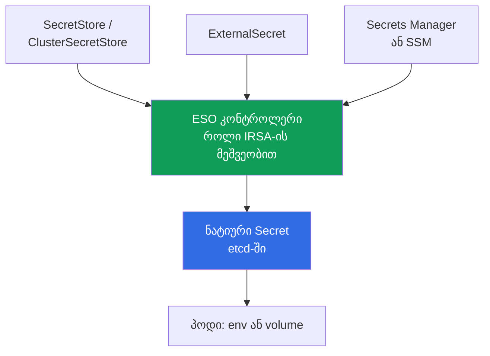
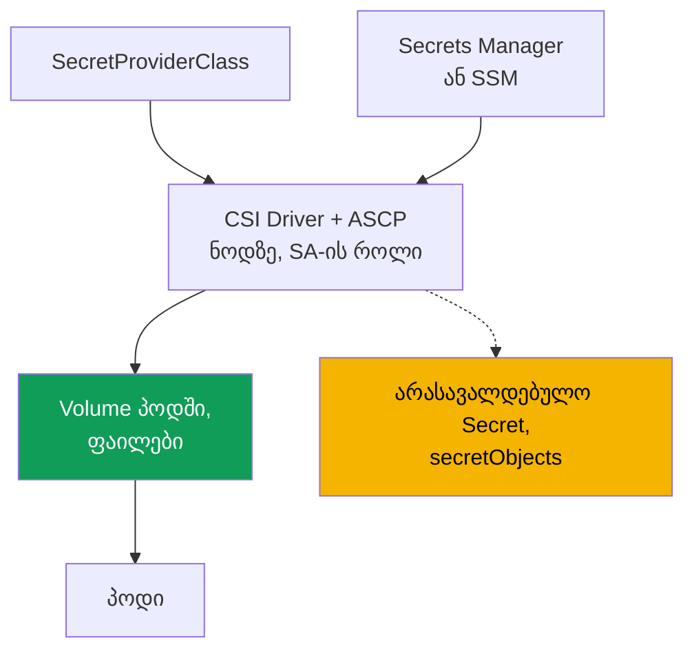

[Русская версия](ru.md) · [Eng version](en.md) · [Versión en español](es.md) · [Version française](fr.md) · [Deutsche Version](de.md) · [繁體中文版](tw.md) · [日本語版](jp.md)
# თავი 18. Secrets: KMS-შიფრაცია, Secrets Manager და SSM External Secrets-ისა და CSI-ის მეშვეობით

> **რა არის შემდეგ.** მე-16 და მე-17 თავებში ვისწავლეთ, როგორ მივცეთ პოდს საკუთარი როლი AWS-ში IRSA-ის
> ან Pod Identity-ის მეშვეობით. Secrets უშუალოდ ამას ეყრდნობა: External Secrets-ის კონტროლერსა და
> CSI დრაივერს Secrets Manager-იდან და SSM-იდან წასაკითხად როლი სჭირდება. ამ როლს ზუსტად ეს
> მექანიზმები აძლევს, ამიტომ აქ მათ მხოლოდ მივუთითებთ და აღარ გავიმეორებთ. მომიჯნავე თემები სხვა
> თავებშია: შიფრაცია კლასტერის შექმნისას (თავი 4), RBAC-წვდომა `Secret`-ზე (თავი 5), supply chain
> და ECR (თავი 20), ჰარდენინგი და Pod Security (თავი 19), secrets git-ში და GitOps (თავი 44).

## 18.1. „Kubernetes-ის Secret შიფრაცია კი არა, base64-ია“

აპლიკაციას მონაცემთა ბაზის პაროლი სჭირდება. ინჟინერი მას `Secret`-ში ათავსებს, პოდში ამონტაჟებს
და ამოცანას დასრულებულად მიიჩნევს: „მონაცემები ხომ secret-შია“. მაგრამ Kubernetes-ის `Secret`
არაფერს შიფრავს.

- **base64 კოდირებაა და არა შიფრაცია.** `data`-ში მნიშვნელობას ნებისმიერი, ვისაც manifest-ზე ან
  ობიექტზე წვდომა აქვს, `base64 -d` ბრძანებით გაშიფრავს. პაროლი ღიად ინახება.
- **წვდომას RBAC წყვეტს და მხოლოდ ის.** `Secret`-ის წაკითხვა შეუძლია ნებისმიერ სუბიექტს, რომელსაც
  ამ namespace-ში მასზე `get`/`list` აქვს (თავი 5). RBAC-ის გარდა ობიექტს მეორე ბარიერი არ გააჩნია.
- **Secret etcd-ში ცხოვრობს.** მნიშვნელობა control plane-ის მონაცემთა ბაზაში ინახება. EKS etcd-ის
  დისკებს storage-ის დონეზე შიფრავს, მაგრამ ეს volume-ის დაცვაა და არა ობიექტის: ვალიდური RBAC-ით
  ის ჩვეულებრივ იკითხება.
- **Secret git-ის მეშვეობით ჟონავს.** `Secret`-ის manifest-ს repository-ში commit უკეთდება და
  პაროლი სამუდამოდ რჩება git-ის ისტორიაში. ეს კლასიკური გაჟონვაა და ერთი `git rm` ვერ გამოასწორებს.

საჭიროა სხვა მიდგომა: secrets ინახებოდეს AWS-ის მართვად storage-ში როტაციითა და აუდიტით, პოდს
manifest-ში ჩაწერის გარეშე მიეწოდოს, ხოლო თავად ობიექტი etcd-ში რეალურად იყოს დაცული და არა base64-ით.

## 18.2. დაცვის ორი დამოუკიდებელი ფენა, რომლებიც არ უნდა აგვერიოს

ამოცანას „secrets EKS-ში“ ორი განსხვავებული ფენა აქვს. ისინი სხვადასხვა პრობლემას წყვეტს, მაგრამ
მუდმივად ერთმანეთში ერევათ, მიუხედავად იმისა, რომ ერთი მეორეს ვერ ცვლის.

- **ფენა 1: Kubernetes secrets-ის KMS envelope encryption etcd-ში.** ეს ეხება იმას, **როგორ**
  ინახება `Secret` ობიექტი control plane-ში: მონაცემების დაცვას storage-ის დონეზე.
- **ფენა 2: secrets-ის გატანა AWS-ის გარე storage-ებში** (Secrets Manager, SSM Parameter Store)
  და მათი პოდისთვის მიწოდება. ეს ეხება იმას, საერთოდ **სად ცხოვრობს** secret და საიდან ხვდება აპლიკაციაში.

ფენა 1 `Secret` ობიექტს შენახვის ადგილზე იცავს, მაგრამ მასზე RBAC-წვდომას არ აუქმებს. ფენა 2
secret-ს manifest-ებიდან და git-იდან იღებს, მაგრამ თუ ნატიურ `Secret`-ს ქმნის, ის ისევ etcd-ში
ხვდება და ფენა 1 კვლავ საჭიროა.

## 18.3. ფენა 1: etcd secrets-ის KMS envelope encryption

Envelope encryption ორი გასაღებით შიფრაციაა. **Data encryption key (DEK)** `Secret`-ს etcd-ში
ჩაწერამდე შიფრავს, ხოლო **key encryption key (KEK)**, თქვენი KMS-გასაღები, DEK-ს შიფრავს. etcd-ში
ინახება დაშიფრული secret დაშიფრულ DEK-თან ერთად; ღია DEK არ ინახება. EKS იყენებს Kubernetes KMS
provider v2-ს და KMS-ში DEK-ის თითოეული გაშიფვრა CloudTrail-ში ჩანს, რაც აუდიტს უზრუნველყოფს.

Kubernetes **1.28 და უფრო ახალ** EKS-ზე Kubernetes API-ის მონაცემების envelope encryption
ნაგულისხმევად ჩართულია AWS-ის გასაღებით (AWS owned key), თქვენი ჩარევის გარეშე. საკუთარი
**customer managed key (CMK)** ამატებს იმას, რასაც AWS owned key არ იძლევა: გასაღების policy-ზე
კონტროლსა და CloudTrail-ში გაშიფვრის აუდიტს. არსებულ კლასტერზე CMK ცალკე ირთვება (თავი 4).

```bash
# საკუთარ CMK-ის ჩართვა არსებულ კლასტერზე (რესურსი secrets)
aws eks associate-encryption-config --cluster-name demo \
  --encryption-config '[{"resources":["secrets"],"provider":{"keyArn":"arn:aws:kms:eu-central-1:111122223333:key/abcd-1234"}}]'

# შემოწმება, რომ შიფრაცია კონფიგურირებულია
aws eks describe-cluster --name demo --query 'cluster.encryptionConfig'
```

გასაღები სიმეტრიული და კლასტერის იმავე რეგიონში უნდა იყოს. მნიშვნელოვანია შეუქცევადობა: secrets-ის
CMK-ით შიფრაციის ჩართვა შესაძლებელია, მაგრამ **გამორთვა შეუძლებელია** (თავი 4). აქედან მოდის მთავარი
საოპერაციო რისკი, თავად გასაღები: თუ CMK გამოირთვება ან წაიშლება, control plane secrets-ის გაშიფვრასა
და მათზე წვდომას ვეღარ შეძლებს. ამიტომ EKS-ის CMK-ს არ თიშავენ, ხოლო მის policy-ს აკონტროლებენ.

| `Secret` etcd-ში | AWS owned key (ნაგულისხმევი 1.28+) | საკუთარი CMK |
|---|---|---|
| მონაცემები etcd-ის დისკზე | დაშიფრულია AWS-ის მიერ | დაშიფრულია AWS-ის მიერ |
| `Secret` ობიექტი (envelope encryption) | დიახ, AWS-ის გასაღებით | დიახ, თქვენი გასაღებით |
| კონტროლი გასაღებსა და policy-ზე | არა | დიახ |
| გაშიფვრის აუდიტი CloudTrail-ში | არა | დიახ |
| უქმდება RBAC-წვდომა `Secret`-ზე? | არა | არა |

ბოლო სტრიქონი მთავარია: შიფრაცია secret-ს **storage-ში** იცავს, მაგრამ წაკითხვის RBAC-ის მქონე
სუბიექტი მას კვლავ ჩვეულებრივ მიიღებს. წვდომის გამიჯვნას ისევ RBAC უზრუნველყოფს (თავი 5), envelope
encryption კი სხვა ვექტორს კეტავს: etcd-ის მონაცემებზე API-ის გვერდის ავლით წვდომას.

## 18.4. ფენა 2: რატომ უნდა გავიტანოთ secrets კლასტერიდან

ფენა 1-ის შემთხვევაშიც secret კლასტერში რჩება: ის manifest-შია და git-ში მოხვედრის რისკი აქვს,
როტაცია ხელით სრულდება, ერთიანი ადგილი კი არ არსებობს. ფენა 2 წყაროდ გარე storage-ს აქცევს და
secret კლასტერს მიეწოდება.

- **როტაცია.** Secrets Manager-ს გრაფიკით როტაცია შეუძლია; აპლიკაცია ახალ მნიშვნელობას იღებს.
- **აუდიტი და ერთიანი წყარო.** წვდომა IAM-ის მეშვეობით ხდება და CloudTrail-ში ჩანს; secret ერთ ადგილასაა.
- **secret manifest-ებსა და git-ში არ არის.** კლასტერში მხოლოდ secret-ის ბმულები იგზავნება და არა მნიშვნელობები.
- **გამიჯვნა მონაცემების ტიპის მიხედვით.** Secrets Manager როტაციის მქონე secrets-ისთვისაა, SSM
  Parameter Store კი კონფიგურაციისთვის, რომლის ნაწილიც secret საერთოდ არ არის.

ორი ინსტრუმენტი მიწოდებას განსხვავებულად წყვეტს: **External Secrets Operator** ნატიურ `Secret`-ს
ქმნის, ხოლო **Secrets Store CSI Driver** secret-ს პირდაპირ პოდში volume-ის სახით ამონტაჟებს. ორივე
AWS-ზე წვდომის როლს IRSA-ის ან Pod Identity-ის მეშვეობით იღებს (თავები 16 და 17). ეს მათი საფუძველია
და არა უმნიშვნელო დეტალი.

## 18.5. External Secrets Operator: კონტროლერი ნატიურ Secret-ს ქმნის

External Secrets Operator (ESO) კლასტერში გაშვებული კონტროლერია. ის secret-ს Secrets Manager-იდან
ან SSM-იდან კითხულობს და მისგან **Kubernetes-ის ჩვეულებრივ `Secret`-ს ქმნის**, აპლიკაცია კი მას
ჩვეულებრივად მოიხმარს, env-ის ან volume-ის მეშვეობით, კოდის მხრიდან მხარდაჭერის გარეშე.



კავშირს სამი ობიექტი განსაზღვრავს. **`SecretStore`** აღწერს storage-ზე წვდომას (provider `aws`,
სერვისი `SecretsManager` ან `ParameterStore`, რეგიონი, ავთენტიფიკაცია) და namespace-scoped არის;
**`ClusterSecretStore`** იმავეს მთელი კლასტერისთვის აკეთებს. **`ExternalSecret`** აცხადებს, რომელი
secret უნდა წამოიღოს და რომელ `Secret`-ში მოათავსოს; კონტროლერი მის მიხედვით სამიზნე `Secret`-ს
ქმნის და აახლებს.

იზოლაცია: ნაგულისხმევად გამოიყენეთ namespaced `SecretStore`. namespace-ის მფლობელი გუნდი მხოლოდ
საკუთარ secrets-ს კითხულობს. `ClusterSecretStore` ყველა namespace-ისთვის ხელმისაწვდომია და მარტივად
შეიძლება სხვის secrets-ზე წვდომის არხად იქცეს, ამიტომ მას შერჩევითად და შეზღუდვებით იყენებენ და არა
ნაგულისხმევ ვარიანტად.

```yaml
apiVersion: external-secrets.io/v1
kind: SecretStore
metadata:
  name: aws-sm
  namespace: payments
spec:
  provider:
    aws:
      service: SecretsManager
      region: eu-central-1
      # ავთენტიფიკაცია: კონტროლერის როლი IRSA-ის ან Pod Identity-ის მეშვეობით (თავები 16, 17)
---
apiVersion: external-secrets.io/v1
kind: ExternalSecret
metadata:
  name: db-credentials
  namespace: payments
spec:
  refreshInterval: 1h            # ხელახალი სინქრონიზაციის სიხშირე; 0: მხოლოდ ერთხელ შექმნა
  secretStoreRef:
    name: aws-sm
    kind: SecretStore
  target:
    name: db-credentials         # Secret-ის სახელი, რომელსაც ESO შექმნის
  data:
    - secretKey: password        # გასაღები Secret-ში
      remoteRef:
        key: prod/payments/db    # secret-ის სახელი Secrets Manager-ში
        property: password       # ველი JSON-secret-ის შიგნით
```

`refreshInterval` ხელახალი სინქრონიზაციის პერიოდს განსაზღვრავს; `0`-ის შემთხვევაში ESO `Secret`-ს
მხოლოდ ერთხელ ქმნის. ESO-ის უპირატესობაა, რომ შედეგი ნატიური `Secret`-ია და ნებისმიერ მომხმარებელთან
თავსებადია (env, volume, გარე chart). მნიშვნელოვანი ნაკლი: secret **etcd-ში მატერიალიზდება**, ამიტომ
ESO-სთვის ფენა 1 (განყოფილება 18.3) აუცილებელია. AWS-იდან წასაკითხად კონტროლერის როლი IRSA-ის ან Pod
Identity-ის მეშვეობით გაიცემა (თავები 16, 17).

როტაციის თავისებურება: ESO `Secret`-ს განაახლებს, მაგრამ პოდი, რომელმაც ის გაშვებისას env-ში წაიკითხა,
ახალ მნიშვნელობას ვერ დაინახავს, რადგან ცვლადები გაშვებისას ფიქსირდება (kubelet volume-ებს თავად
აახლებს, env-ს კი არა). secret-ის ხელახლა წასაკითხად პოდს თავიდან უშვებენ; **Stakater Reloader** ამას
ავტომატურად აკეთებს: ის `Secret`-სა და `ConfigMap`-ს აკვირდება და მათი მომხმარებელი Deployment-ის
rolling restart-ს იწყებს:

```yaml
metadata:
  annotations:
    reloader.stakater.com/auto: "true"   # restart დამონტაჟებული Secret/ConfigMap-ის შეცვლისას
```

```bash
kubectl -n payments get externalsecret db-credentials   # STATUS SecretSynced?
kubectl -n payments get secret db-credentials            # ნატიური Secret გამოჩნდა
```

## 18.6. Secrets Store CSI Driver: secret პოდში მონტაჟდება

Secrets Store CSI Driver AWS-პროვაიდერთან (ASCP) ერთად სხვა გზით მუშაობს: secret **ფაილების სახით
პირდაპირ პოდში volume-ად მონტაჟდება**, `Secret` ობიექტის გვერდის ავლით. ნაგულისხმევად დრაივერი
`Secret`-ს არ ქმნის და secret-ს ნოდზე volume-ში ათავსებს. დასამონტაჟებელ მონაცემებს
`SecretProviderClass` განსაზღვრავს.



```yaml
apiVersion: secrets-store.csi.x-k8s.io/v1
kind: SecretProviderClass
metadata:
  name: db-credentials
  namespace: payments
spec:
  provider: aws
  parameters:
    objects: |
      - objectName: "prod/payments/db"   # secret-ის სახელი Secrets Manager-ში (ან ARN)
        objectType: "secretsmanager"     # secretsmanager ან ssmparameter
```

პოდი კლასს `secretProviderClass`-ის მქონე CSI volume-ის მეშვეობით უთითებს. მთავარი თვისება:
სინქრონიზაციის გარეშე secret **მხოლოდ ნოდზე volume-ში ჩნდება და etcd-ში საერთოდ არ ხვდება**. ეს
ESO-სგან მთავარი განსხვავებაა. არასავალდებულოდ დრაივერი `secretObjects` ბლოკის მეშვეობით ნატიურ
`Secret`-ს ქმნის, მაგრამ სინქრონიზაცია მხოლოდ მანამ მიმდინარეობს, სანამ პოდს volume დამონტაჟებული აქვს,
ხოლო `Secret` ბოლო მომხმარებელთან ერთად იშლება. მნიშვნელობების როტაციას rotation reconciler
უზრუნველყოფს: ის flag-ით ირთვება და volume-ს აახლებს.

```bash
kubectl -n payments get secretproviderclass db-credentials    # კლასი ადგილზეა
kubectl -n payments exec deploy/app -- ls /mnt/secrets-store   # secret-ის ფაილები volume-შია
```

AWS-ზე დრაივერის წვდომის როლი კვლავ IRSA ან Pod Identity-ია (თავები 16 და 17): ის იმ
`ServiceAccount`-ს ებმება, რომლითაც secret-ის დამმონტაჟებელი პოდი მუშაობს.

## 18.7. ESO CSI Driver-ის წინააღმდეგ

ინსტრუმენტები ერთ ამოცანას, „secret AWS-იდან პოდში“, განსხვავებულად წყვეტს. არჩევანს მთავარი კითხვა
განსაზღვრავს: სად აღმოჩნდება secret და ვინ მოიხმარს მას.

| თვისება | External Secrets Operator | Secrets Store CSI Driver |
|---|---|---|
| სად ცხოვრობს secret | ნატიური `Secret` etcd-ში | ფაილები ნოდზე volume-ში |
| ხვდება თუ არა etcd-ში | დიახ, ყოველთვის | არა (თუ `secretObjects` არ არის ჩართული) |
| როგორ მოიხმარს აპლიკაცია | env ან volume `Secret`-იდან | კითხულობს ფაილებს volume-იდან |
| თავსებადობა env-თან | სრული (ეს ჩვეულებრივი `Secret`-ია) | მხოლოდ `Secret`-ში სინქრონიზაციით |
| როტაცია | `refreshInterval`-ის მიხედვით | rotation reconciler volume-ს აახლებს |
| საჭიროა თუ არა ფენა 1 (KMS) | დიახ, secret etcd-შია | volume-ისთვის არა; sync-ისას დიახ |
| AWS-ზე წვდომის როლი | IRSA / Pod Identity | IRSA / Pod Identity |
| დამოკიდებულია პოდის სიცოცხლის ციკლზე | არა, `Secret` დამოუკიდებლად ცხოვრობს | დიახ, volume და sync პოდთან ერთად ცხოვრობს |

მოკლედ: ESO უფრო მარტივია აპლიკაციებისთვის, რომლებსაც `Secret` სჭირდება (env, მზა chart-ები), თუმცა
ამის საფასურად ის ყოველთვის etcd-შია. CSI sync-ის გარეშე მინიმალურ კვალს ტოვებს, მაგრამ აპლიკაციამ
ფაილები volume-იდან უნდა წაიკითხოს.

### HashiCorp Vault: იგივე ფენა 2, მაგრამ storage AWS-ისგან არ არის

აქამდე storage-ის როლში Secrets Manager და SSM Parameter Store იყო, მაგრამ ფენა 2 AWS-ზე მიბმული
არ არის. Vault სქემაში იმავე ადგილს იკავებს და კლასტერში სამი მიზეზიდან ერთ-ერთის გამო ჩნდება: ის
კომპანიაში უკვე მუშაობს და მხოლოდ EKS-ს არ ემსახურება; საჭიროა **დინამიკური secrets** (AWS secrets
engine დროებით IAM credentials-ს გასცემს, database engine კი კონკრეტული მოთხოვნისთვის მონაცემთა ბაზის
ხანმოკლე მომხმარებელს); ან საჭიროა ერთიანი წყარო multicloud-ისა და საკუთარი data center-ისთვის.

Vault-ში პოდის ავთენტიფიკაცია მე-16 თავის იმავე მექანიკას ეყრდნობა. Kubernetes auth method
ServiceAccount-ის token-ს კლასტერის API-ში `TokenReview`-ის მეშვეობით ამოწმებს; JWT/OIDC auth
პროეცირებულ token-ს კლასტერის OIDC issuer-ით API-სთან მიმართვის გარეშე ამოწმებს; AWS IAM auth იღებს
`sts:GetCallerIdentity`-ზე ხელმოწერილ მოთხოვნას, ანუ IRSA-ის ან Pod Identity-ის როლს ამოიცნობს. პირველი
ვარიანტი უფრო მარტივია, მესამე კი უკვე გამართულ IRSA-ს ბუნებრივად ერგება.

secret-ის პოდისთვის მიწოდების ოთხი გზა არსებობს, რომელთაგან ორს უკვე იცნობთ:

- **Vault Agent Injector**: mutating webhook პოდში sidecar-ს ან init-container-ს ამატებს, რომელიც
  Vault-ში შედის და secret-ს საერთო `emptyDir`-ში წერს; ირთვება `vault.hashicorp.com/agent-inject`
  და `vault.hashicorp.com/role` ანოტაციებით. etcd-ში არაფერი ხვდება.
- **Vault Secrets Operator**: CRD-ების მქონე კონტროლერი (`VaultStaticSecret`, `VaultDynamicSecret`,
  `VaultAuth`), რომელიც მნიშვნელობას ნატიურ `Secret`-ში ასინქრონიზებს. ეს ზუსტად ESO-ის მოდელია,
  ზემოთ მოცემული ცხრილის ყველა თვისებით.
- **ESO Vault-პროვაიდერით**: იგივე ოპერატორი 18.5-დან, ოღონდ `SecretStore` Secrets Manager-ის ნაცვლად
  Vault-ზე მიუთითებს. მოსახერხებელია, როცა secrets-ის ნაწილი AWS-შია, ნაწილი კი Vault-ში.
- **Secrets Store CSI Driver Vault-პროვაიდერით**: ფაილებად მონტაჟი, როგორც 18.6-ში.

ფასი ისეთივე აშკარაა, როგორც მე-8 თავში CNI-ის შეცვლისას: storage თქვენი სამართავი ხდება. საკუთარი
Vault ნიშნავს HA-კლასტერს საკუთარი storage backend-ით, unseal და recovery keys-ს, განახლებებს, backup-სა
და აუდიტს. AWS-ში მას ჩვეულებრივ KMS-ის მეშვეობით auto-unseal-ით (`seal "awskms"`) შლიან, რათა
unseal-გასაღებები ადამიანებთან არ ინახებოდეს. მომწოდებლის managed-ვარიანტი ამ სამუშაოს ნაწილს ხსნის,
მაგრამ policy-ებსა და როლებზე პასუხისმგებლობას არა. ცალკე საოპერაციო ნიუანსი: secrets-ზე მიმართვები
Vault-ის audit device-ში ჩანს და არა CloudTrail-ში, ამიტომ წვდომის გამოძიება ორ ჟურნალში მიმდინარეობს
(თავი 21). ფენა 1 ამ დროს არსად ქრება: თუ secret მაინც `Secret`-ში სინქრონიზდა, ის etcd-ში ინახება და
18.3-ის KMS-შიფრაციითაა დაცული.

## 18.8. როტაცია: მონაცემთა ბაზის პაროლი შეიცვალა

ღამით მონაცემთა ბაზის secret-ის როტაცია შესრულდა. დილით ასეთი სურათია: პოდების ნაწილი მუშაობს,
ნაწილი ავთენტიფიკაციის შეცდომით ითიშება, Secrets Manager-ში კი სწორი ახალი პაროლია. AWS-ში მნიშვნელობა
მყისიერად განახლდა, მაგრამ აპლიკაციამდე ის ოთხი რგოლისგან შემდგარ ჯაჭვს გადის და ნებისმიერ მათგანში
შეიძლება გაიჭედოს.

| რგოლი | რა განსაზღვრავს დაყოვნებას | სიმპტომი არასწორი კონფიგურაციისას |
|---|---|---|
| Storage | როტაციის სტრატეგია და მონაცემთა ბაზაში პაროლის შეცვლის მომენტი | პერიოდი, როცა პაროლი მონაცემთა ბაზაში ახალია, წამკითხველებს კი ჯერ ძველი აქვთ |
| კლასტერში სინქრონიზაცია | ESO-ის `refreshInterval`, CSI-ის rotation reconciler | `Secret` ან ფაილი volume-ში ძველი მნიშვნელობით |
| როგორ იღებს აპლიკაცია მნიშვნელობას | env volume-ის ან ფაილის წინააღმდეგ | env არასდროს იცვლება, volume ახლდება |
| მონაცემთა ბაზასთან კავშირები | კავშირების pool და reconnect-ის ლოგიკა | pool ძველი credentials-ით restart-მდე მუშაობს |

**რგოლი 1: როგორ ასრულებს როტაციას Secrets Manager.** როტაციას rotator function მართავს, secret-ის
ვერსიები კი labels-ითაა მონიშნული: `AWSCURRENT` ნაგულისხმევად ყველას მიერ იკითხება, `AWSPENDING` ახალი
მნიშვნელობაა შემოწმების პროცესში, `AWSPREVIOUS` კი წინაა. ორი სტრატეგია არსებობს და არჩევანი პირდაპირ
მოქმედებს ხელმისაწვდომობაზე. **single user**-ის შემთხვევაში ერთი მომხმარებლის პაროლი იცვლება: ღია
კავშირები არ წყდება, მაგრამ მონაცემთა ბაზაში პაროლის შეცვლასა და secret-ის განახლებას შორის მოკლე
პერიოდია, როცა ახლად წაკითხული credentials-ით დაკავშირების მცდელობა შეიძლება უარყოფილი იყოს. AWS ამ
სტრატეგიას შემთხვევების უმრავლესობისთვის შესაფერისად მიიჩნევს, რისკს კი ექსპონენციალური დაყოვნებით
განმეორებითი მცდელობები ფარავს. **alternating users**-ის შემთხვევაში secret-ში ორი მომხმარებელია:
rotator საწყის მომხმარებელს აკლონირებს და შემდეგ პაროლებს მონაცვლეობით ცვლის, ამიტომ აპლიკაცია როტაციის
ნებისმიერ მომენტში ვალიდურ credentials-ს იღებს, ხოლო დასრულების შემდეგ ორივე ნაკრები მუშაობს. საფასურია
ცალკე secret superuser-ის უფლებებით (მომხმარებელს, ჩვეულებრივ, საკუთარი თავის კლონირება არ შეუძლია) და
კლონზე უფლებების ცვლილებების გამეორების ვალდებულება.

**რგოლი 2: როგორ ხვდება ახალი მნიშვნელობა კლასტერში.** ESO-სთვის ეს 18.5-ის `refreshInterval`-ია:
`0`-ის შემთხვევაში secret ერთხელ იქმნება და როტაციის შემდეგ სამუდამოდ ძველი დარჩება. CSI Driver-ის
volume-ში ფაილებს ცალკე rotation reconciler აახლებს და მისი ჩართვა აუცილებელია, წინააღმდეგ შემთხვევაში
volume-ც სტატიკურია. შესაბამისად, „secrets-ს ვატრიალებთ“ ამ რგოლის კონფიგურაციის გარეშე ნიშნავს „პაროლს
მხოლოდ AWS-ში ვცვლით“.

**რგოლი 3: როგორ ხედავს მნიშვნელობას პროცესი.** გარემოს ცვლადები container-ის გაშვებისას განისაზღვრება
და **არასდროს ახლდება**, მაშინაც კი, როცა `Secret` უკვე ახალია. kubelet volume-იდან მნიშვნელობას თავად
აახლებს, მაგრამ აპლიკაციამ ფაილი ხელახლა უნდა წაიკითხოს და არა პაროლი გაშვების მომენტიდან მეხსიერებაში
შეინახოს. აქედან ორი სამუშაო მიდგომაა: პოდის restart secret-ის შეცვლისას (Reloader 18.5-დან) ან ფაილიდან
კითხვა და მის ცვლილებაზე რეაგირება.

**რგოლი 4: კავშირები.** პაროლის ხელახლა წაკითხვის შემდეგაც აპლიკაცია უკვე გახსნილი pool-ით განაგრძობს
მუშაობას. სწორი ქცევაა, ავთენტიფიკაციის შეცდომისას credentials ხელახლა წაიკითხოს, კავშირი თავიდან შექმნას
და მცდელობა დაყოვნებით გაიმეოროს, ნაცვლად `CrashLoopBackOff`-ში ჩავარდნისა ან ხელით restart-ის ლოდინისა.

**როგორ მოვხსნათ პრობლემა მთლიანად.** პაროლის როტაცია იმის მართვაა, რაც უმჯობესი იქნებოდა საერთოდ არ
არსებულიყო. RDS-სა და Aurora-ს აქვს **IAM database authentication**: პაროლის ნაცვლად აპლიკაცია
`aws rds generate-db-auth-token`-ით token-ს იღებს, რომელიც ნაგულისხმევად 15 წუთი მოქმედებს, უფლებებს
კი პოდის როლი IRSA-ის ან Pod Identity-ის მეშვეობით გასცემს (თავები 16 და 17). საროტაციო არაფერია,
რადგან მუდმივი პაროლი არ არსებობს. მსგავს იდეას იძლევა Vault-ის დინამიკური secrets 18.7-დან: credentials
მოთხოვნისას გაიცემა და თავად იწურება. თუ პაროლი მაინც საჭიროა, production-ში ხელით შეცვლა alternating
users-ის ლოგიკით სრულდება: ჯერ მეორე მომხმარებელი იქმნება, დატვირთვა მასზე გადადის, შემდეგ პირველი უქმდება,
ნაცვლად მოქმედი მომხმარებლის პაროლის პირდაპირ შეცვლისა.

## 18.9. KMS და გარე storage-ები ერთად

ფენები ალტერნატივები არ არის, ისინი ერთმანეთს ემატება. წესი დამოკიდებულია იმაზე, ხვდება თუ არა secret etcd-ში:

- **ESO** ნატიურ `Secret`-ს წერს, ამიტომ secret etcd-ში ხვდება. ფენა 1 ყოველთვის საჭიროა, წინააღმდეგ
  შემთხვევაში გარე storage დაცულია, etcd-ში მისი ასლი კი არა.
- **CSI სინქრონიზაციის გარეშე** secret-ს მხოლოდ ნოდზე volume-ში ამონტაჟებს და ის etcd-ში არ ხვდება,
  ამიტომ ფენა 1 მასზე არ ვრცელდება. `secretObjects`-ის შემთხვევაში `Secret` ჩნდება და ფენა 1 კვლავ საჭიროა.

secret-ის გარეთ გატანა კლასტერში დარჩენილის შიფრაციის საჭიროებას არ აუქმებს: ფენა 1 ყოველთვის ჩართული
უნდა იყოს (1.28+-ზე ის ისედაც ნაგულისხმევია), ხოლო ESO-სა და CSI-ს შორის არჩევანი მხოლოდ კლასტერში
დატოვებული კვალის ზომას განსაზღვრავს.

## 18.10. დიაგნოსტიკა: secret არ გამოჩნდა ან არ განახლდა

შეცდომები პროგნოზირებადია: თითქმის ყველაფერი კონტროლერის ან დრაივერის როლზე, კონფიგურაციის ობიექტებსა
და AWS-ში თავად secret-ის KMS-გასაღებზე უფლებებზე დაიყვანება.

| სიმპტომი | სავარაუდო მიზეზი | რა შევამოწმოთ |
|---|---|---|
| `ExternalSecret` არ არის `SecretSynced` მდგომარეობაში | კონტროლერის როლი secret-ს ვერ კითხულობს | ESO კონტროლერის IRSA/Pod Identity |
| ნატიური `Secret` არ შეიქმნა | შეცდომა `SecretStore`-ში ან `remoteRef`-ში | `kubectl describe externalsecret` |
| Volume ცარიელია, პოდი არ იშვება | `SecretProviderClass` ან პოდის SA-ის როლი | კლასი, SA-ის ანოტაცია/ასოციაცია |
| `AccessDenied` secret-ის კითხვისას | როლის IAM policy-ში უფლება არ არის | `secretsmanager:GetSecretValue` |
| `AccessDenied` გაშიფვრისას | secret-ის KMS-გასაღებზე უფლება არ არის | `kms:Decrypt` secret-ის გასაღებზე |
| მნიშვნელობა მოძველებულია | როტაცია ან refresh არ არის გამართული | `refreshInterval` (ESO), reconciler (CSI) |

დიაგნოსტიკის თანმიმდევრობაა როლიდან ობიექტებისკენ და შემდეგ AWS-ისკენ:

```bash
# 1. ESO-ის სინქრონიზაციის სტატუსი და მოვლენები
kubectl -n payments describe externalsecret db-credentials

# 2. ESO კონტროლერის logs (როლი, storage-ზე წვდომა, provider-ის შეცდომები)
kubectl -n external-secrets logs deploy/external-secrets

# 3. CSI-ისთვის: დრაივერის logs პოდის ნოდზე
kubectl -n kube-system logs ds/csi-secrets-store-secrets-store-csi-driver -c secrets-store
```

ხშირი ხაფანგი: Secrets Manager-ში secret თავადაა დაშიფრული KMS-გასაღებით და კონტროლერის ან დრაივერის
როლს **ამ** გასაღებზე `kms:Decrypt` სჭირდება. ის არ უნდა აგვერიოს ფენა 1-ის კლასტერის CMK-ში. თუ
`GetSecretValue` წარმატებულია, მაგრამ secret არ იკითხება, მიზეზი ჩვეულებრივ მის გასაღებზე უფლებებია.

## 18.11. როგორ იყენებენ ამას production-ში

- **Secrets-ს commit არ უკეთდება.** git-ში იგზავნება `ExternalSecret`, `SecretStore` და
  `SecretProviderClass`: secret-ზე ბმულები და არა მნიშვნელობები. git-ის ისტორიის მეშვეობით გაჟონვა
  თავიდანვე გამოირიცხება (თავი 44).
- **ფენა 1 ყოველთვის ჩართულია.** 1.28+-ზე envelope encryption ნაგულისხმევად მუშაობს; production-ისთვის
  კონტროლისა და CloudTrail-ში აუდიტის გამო საკუთარ CMK-ს იყენებენ, გასაღების policy-ს კი იცავენ.
- **მინიმალური RBAC `Secret`-ზე.** Envelope encryption RBAC-ს არ ცვლის: წაკითხვის წვდომა მიზნობრივად
  გაიცემა, წინააღმდეგ შემთხვევაში ფენა 1 ყველაფრისგან იცავს, ვალიდური სუბიექტის გარდა (თავი 5).
- **როტაცია წყაროში.** როტაციის მქონე secrets Secrets Manager-ში ინახება, ESO-ის `refreshInterval` ან
  CSI-ის rotation reconciler კი ისე ეწყობა, რომ პოდმა ახალი მნიშვნელობა მიიღოს. პოდებს, რომლებიც
  `Secret`-ს env-ში კითხულობს, Stakater Reloader-ის rolling restart აახლებს.
- **Storage-ების იზოლაცია namespace-ის მიხედვით.** ნაგულისხმევად namespaced `SecretStore` გამოიყენება;
  `ClusterSecretStore` კი შერჩევითად და შეზღუდვებით, რათა გუნდებმა ერთმანეთის secrets ვერ წაიკითხონ.
- **განსხვავებული storage სხვადასხვა მონაცემისთვის.** Secrets Manager როტაციის მქონე secrets-ისთვისაა,
  SSM Parameter Store კი კონფიგურაციისთვის. ეს უფლებებსაც და მოთხოვნების ღირებულებასაც ყოფს.
- **როლი IRSA-ის ან Pod Identity-ის მეშვეობით.** კონტროლერსა და დრაივერს ცალ-ცალკე როლი ეძლევა საჭირო
  გასაღებებზე `GetSecretValue` და `kms:Decrypt` უფლებებით და არა ერთი საერთო როლი (თავები 16, 17).

## 18.12. მინი-ლექსიკონი

- **Envelope encryption**: ორი გასაღებით შიფრაცია. DEK მონაცემებს შიფრავს, ხოლო KEK (KMS-გასაღები)
  DEK-ს შიფრავს. EKS მას Kubernetes KMS provider v2-ის მეშვეობით etcd secrets-ზე იყენებს.
- **CMK (customer managed key)**: თქვენი KMS-გასაღები. ნაგულისხმევი AWS owned key-ისგან განსხვავებით,
  გასაღების policy-ზე კონტროლსა და CloudTrail-ში გაშიფვრის აუდიტს უზრუნველყოფს.
- **External Secrets Operator (ESO)**: კონტროლერი, რომელიც secret-ს AWS-იდან კითხულობს და მისგან
  ნატიურ `Secret`-ს ქმნის; ობიექტებია `SecretStore`/`ClusterSecretStore` და `ExternalSecret`.
- **Secrets Store CSI Driver + AWS provider (ASCP)**: დრაივერი, რომელიც AWS-იდან secret-ს ნოდზე
  volume-ში ფაილებად ამონტაჟებს; ობიექტია `SecretProviderClass`, შესაძლებელია არასავალდებულო sync `Secret`-ში.
- **Stakater Reloader**: კონტროლერი, რომელიც დამონტაჟებული `Secret`-ის ან `ConfigMap`-ის შეცვლისას
  ანოტაციის მიხედვით Deployment-ის rolling restart-ს ასრულებს, რათა პოდმა ახალი მნიშვნელობა მიიღოს.
- **Staging labels**: Secrets Manager-ში secret-ის ვერსიების labels: `AWSCURRENT` ნაგულისხმევად იკითხება,
  `AWSPENDING` როტაციისას შესამოწმებელი მნიშვნელობაა, `AWSPREVIOUS` კი წინა.
- **როტაციის სტრატეგია**: `single user` (ერთი მომხმარებლის პაროლი იცვლება, შეცდომების მოკლე რისკის
  პერიოდი არსებობს და დაყოვნებით განმეორებითი მცდელობებით იფარება) ან `alternating users` (ორი
  მომხმარებელი მონაცვლეობით, ვალიდური credentials ნებისმიერ დროს, საჭიროა secret superuser-ის უფლებებით).
- **IAM database authentication**: RDS-ში ან Aurora-ში პაროლის ნაცვლად დროებითი token-ით შესვლა
  (`aws rds generate-db-auth-token`, ნაგულისხმევად 15 წუთი); საროტაციო არაფერია.
- **HashiCorp Vault**: AWS-ისგან დამოუკიდებელი გარე secrets storage, რომელიც Secrets Manager-ისავე ადგილს
  იკავებს: პოდის ავთენტიფიკაცია Kubernetes-ის, JWT/OIDC-ის ან AWS IAM auth-ის მეშვეობით; მიწოდება Vault
  Agent Injector-ით, Vault Secrets Operator-ით, ESO-ით ან Vault-პროვაიდერის მქონე CSI Driver-ით. მთავარი
  განსხვავებაა **დინამიკური secrets** (დროებითი IAM და მონაცემთა ბაზის credentials მოთხოვნისას), საფასური
  კი თავად Vault-ის ექსპლუატაცია და CloudTrail-ის ნაცვლად ცალკე audit device-ია.

## 18.13. თავის შეჯამება

- Kubernetes-ის `Secret` base64-ია და არა შიფრაცია: წვდომას RBAC წყვეტს, მნიშვნელობა etcd-ში ინახება
  და git-ის მეშვეობით ადვილად ჟონავს. აქედან გამომდინარეობს ორი განსხვავებული ამოცანა, რომლებიც არ უნდა ავურიოთ.
- ფენა 1 არის etcd secrets-ის KMS envelope encryption: DEK `Secret`-ს შიფრავს, KEK (KMS-გასაღები) კი
  DEK-ს. 1.28+-ზე ნაგულისხმევად AWS owned key-ითაა ჩართული; საკუთარი CMK კონტროლსა და აუდიტს იძლევა.
- ფენა 1 secret-ს storage-ში იცავს, მაგრამ მის წაკითხვაზე **RBAC-ს არ აუქმებს**. ჩართვა შეუქცევადია,
  ხოლო CMK-ის გამორთვა ან წაშლა control plane-ს secrets-ზე წვდომას აკარგვინებს.
- ფენა 2 secret-ს გარე storage-ში (Secrets Manager, SSM) იტანს როტაციის, აუდიტის, ერთიანი წყაროსა და
  manifest-ებში secret-ის არქონისთვის. ორი ინსტრუმენტია: ESO და CSI Driver.
- ESO ნატიურ `Secret`-ს ქმნის (თავსებადია ნებისმიერ მომხმარებელთან, მაგრამ secret etcd-შია და ფენა 1
  აუცილებელია). CSI secret-ს volume-ში ამონტაჟებს და ნაგულისხმევად `Secret`-ს არ ქმნის, ამიტომ etcd-ში არ ხვდება.
- ორივე AWS-ის როლს IRSA-ის ან Pod Identity-ის მეშვეობით იღებს (თავები 16, 17). დიაგნოსტიკა როლიდან
  ობიექტებისა და AWS-ში თავად secret-ის KMS-გასაღებზე უფლებების (`kms:Decrypt`) შემოწმებისკენ მიდის.
- როტაცია აპლიკაციამდე ოთხი რგოლით აღწევს: storage-ის სტრატეგია, კლასტერში სინქრონიზაცია
  (`refreshInterval` ან rotation reconciler), მნიშვნელობის წაკითხვის გზა (env არასდროს ახლდება) და
  კავშირების pool. რადიკალური გამოსავალი RDS-ის IAM database authentication ან დინამიკური secrets-ია,
  სადაც მუდმივი პაროლი საერთოდ არ არსებობს.

## 18.14. როგორ გამოგადგებათ ეს რეალურ სამუშაოში

კითხვას „სად ცხოვრობს secret და ვინ წაიკითხავს მას“ გარე storage-ის შემთხვევაში პასუხობს Secrets
Manager-ის ერთი ჩანაწერი და როლის IAM policy და არა ყველა namespace-ის manifest-ებში ძებნა. ინციდენტი
„secret git-შია“ აღარ ხდება: repository-ში მხოლოდ ბმულებია. მორიგეობისას შემთხვევები „პოდი არ გაეშვა,
volume ცარიელია“ ან „`ExternalSecret` არ სინქრონიზდება“ 18.10-ის ჯაჭვით იხურება: როლი, კონფიგურაციის
ობიექტი, უფლებები secret-სა და მის KMS-გასაღებზე. ცოდნა იმისა, რომ ESO secret-ს etcd-ში ათავსებს, CSI
კი sync-ის გარეშე არა, საჭირო კვალის მიხედვით ინსტრუმენტის არჩევაში გეხმარებათ.

## 18.15. კითხვები თვითშემოწმებისთვის

1. რატომ არ შეიძლება Kubernetes-ის `Secret` შიფრაციად ჩაითვალოს და რა ზღუდავს მასზე წვდომას?
2. რით განსხვავდება AWS-ში etcd-ის დისკების შიფრაცია `Secret` ობიექტის envelope encryption-ისგან?
3. როგორაა მოწყობილი KMS-ის მეშვეობით envelope encryption: რას აკეთებს DEK და რას KEK?
4. EKS-ის რომელი ვერსიიდანაა envelope encryption ნაგულისხმევად ჩართული და რომელი გასაღებით?
5. რას იძლევა საკუთარი CMK AWS owned key-თან შედარებით და რა საოპერაციო რისკი აქვს მას?
6. აუქმებს თუ არა ფენა 1 (KMS) `Secret`-ის წასაკითხად RBAC-ის საჭიროებას? რატომ?
7. რატომ უნდა გავიტანოთ secrets გარე storage-ში, თუ etcd უკვე დაშიფრულია?
8. რით განსხვავდება `SecretStore` `ClusterSecretStore`-ისგან და რას აღწერს `ExternalSecret`?
9. რატომ რჩება ფენა 1 აუცილებელი ESO-ის გამოყენებისას?
10. სად ათავსებს CSI Driver secret-ს ნაგულისხმევად და როდის ქმნის ის მაინც ნატიურ `Secret`-ს?
11. `GetSecretValue` წარმატებულია, secret კი არ იკითხება. რომელი უფლება და რომელ გასაღებზე უნდა შემოწმდეს?
12. ESO-მ `Secret` განაახლა, მაგრამ აპლიკაცია env-ში ძველ პაროლს ხედავს. რატომ და რა აგვარებს ამას?
13. რატომ არის namespaced `SecretStore` იზოლაციისთვის `ClusterSecretStore`-ზე უკეთესი?
14. რომელ სამ მიზეზს მოჰყავს Vault კლასტერში და რას იხდით ამისთვის ექსპლუატაციის თვალსაზრისით?
15. etcd-ში დატოვებული კვალით როგორ განსხვავდება Vault Agent Injector Vault Secrets Operator-ისგან?
16. მონაცემთა ბაზის პაროლი შეიცვალა, Secrets Manager-ში ის ახალია, პოდების ნაწილი კი ავთენტიფიკაციის
    შეცდომით ითიშება. განიხილეთ ოთხი რგოლის ჯაჭვი: ზუსტად სად გაიჭედა მნიშვნელობა?
17. ხელმისაწვდომობის მხრივ რით განსხვავდება `single user` `alternating users`-ისგან და რას მოითხოვს მეორე?
18. რატომ ვერ უძლებს როტაციას აპლიკაცია, რომელსაც პაროლი გარემოს ცვლადში აქვს, და რომელი ორი გზა აგვარებს ამას?

## პრაქტიკა

ამ თემის კურსის ლაბა: [ლაბა 105 - Secrets: KMS envelope encryption და External Secrets
Operator](../../labs/105/README_GE.MD). მის გარდა, ყველაფერი ცოცხალ კლასტერზე მოწმდება. ფენა 1:
`aws eks describe-cluster --name <cluster> --query 'cluster.encryptionConfig'` აჩვენებს, ჩართულია თუ არა
შიფრაცია და რომელი გასაღებით. 1.28+-ზე ის CMK-ის გარეშეც მუშაობს; საკუთარ გასაღებს 18.3-ში მოცემული
`aws eks associate-encryption-config` ბრძანებით ამატებენ და შეუქცევადობა უნდა ახსოვდეთ.

შემდეგ ფენა 2. გაუშვით External Secrets Operator, მის კონტროლერს IRSA-ის ან Pod Identity-ის მეშვეობით
(თავები 16, 17) მიეცით როლი secret-ის გასაღებზე `secretsmanager:GetSecretValue` და `kms:Decrypt`
უფლებებით, შექმენით `SecretStore` და `ExternalSecret`, შემდეგ შეამოწმეთ `kubectl get externalsecret`
(სტატუსი `SecretSynced`) და გამოჩენილი `kubectl get secret`. იგივე გაიმეორეთ Secrets Store CSI Driver-ის
მეშვეობით: `SecretProviderClass`, პოდი CSI volume-ით, და დარწმუნდით, რომ ფაილები volume-შია, ნატიური
`Secret` კი არ არსებობს. ივარჯიშეთ შეცდომაზე: როლს secret-ის გასაღებზე `kms:Decrypt` მოაშორეთ და
კონტროლერის ან დრაივერის logs-ში `AccessDenied` იპოვეთ.

---
[სარჩევი](../README_GE.md) · [თავი 17](../17/ge.md) · [თავი 19](../19/ge.md)
