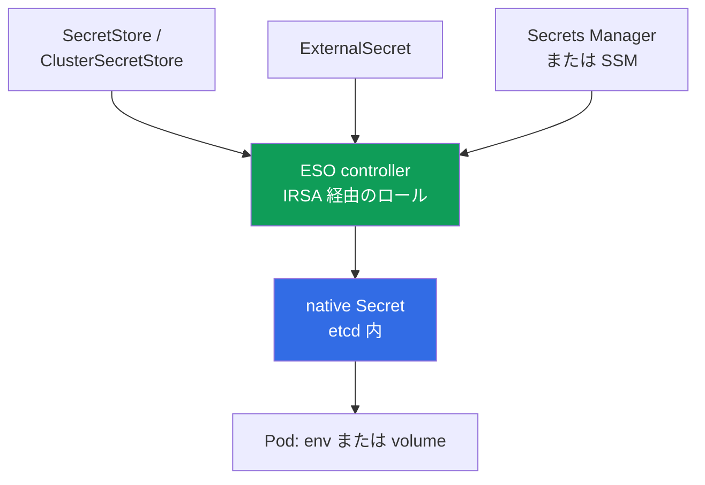
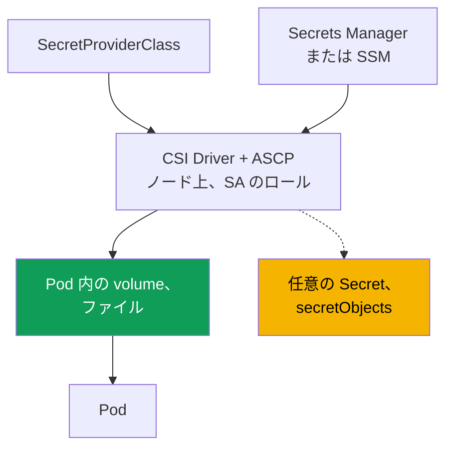

[Eng version](en.md) · [Versión en español](es.md) · [Version française](fr.md) · [Deutsche Version](de.md) · [Русская версия](ru.md) · [ქართული ვერსია](ge.md) · [繁體中文版](tw.md)
# 第18章. シークレット: External Secrets と CSI を介した KMS 暗号化、Secrets Manager、SSM

> **この先。** 第16章と第17章では、IRSA または Pod Identity を通じて Pod に専用の AWS ロールを与える方法を学びました。シークレットはこれに直接依存します。External Secrets のコントローラーと CSI ドライバーには Secrets Manager および SSM を読み取るためのロールが必要であり、まさにそれらの仕組みで付与します。ここでは参照のみとし、繰り返しません。関連事項は他章で扱います。クラスター作成時の暗号化は第4章、`Secret` への RBAC アクセスは第5章、supply chain と ECR は第20章、ハードニングと Pod Security は第19章、git 内のシークレットと GitOps は第44章です。

## 18.1. 「Kubernetes の Secret は暗号化ではなく、base64 である」

アプリケーションにはデータベースのパスワードが必要です。エンジニアはそれを `Secret` に入れ、Pod にマウントし、タスクは完了したと考えます。「データはシークレットに入っている」と。しかし Kubernetes の `Secret` は何も暗号化しません。

- **base64 はエンコーディングであり、暗号化ではありません。** マニフェストまたはオブジェクトにアクセスできる人は誰でも、`data` 内の値を `base64 -d` でデコードできます。パスワードは平文で存在します。
- **アクセスを決めるのは RBAC だけです。** この namespace 内で `get`/`list` 権限を持つ任意の主体は `Secret` を読み取れます（第5章）。このオブジェクトには RBAC を超える第二の障壁はありません。
- **シークレットは etcd に存在します。** 値は control plane のデータベースに保存されます。EKS は etcd ディスクをストレージ層で暗号化しますが、これはボリュームの保護であり、オブジェクトの保護ではありません。有効な RBAC があれば、従来どおり読み取れます。
- **シークレットは git 経由で漏えいします。** `Secret` を含むマニフェストをリポジトリに commit すると、パスワードは git 履歴に永久に残ります。これは典型的な漏えいであり、単に `git rm` しても解決しません。

必要なのは別の方法です。シークレットをローテーションと監査を備えた AWS managed storage に保存し、マニフェストに書き込まずに Pod へ配布し、etcd 内のオブジェクト自体を base64 ではなく真に保護することです。

## 18.2. 混同してはならない、2 つの独立した保護層

「EKS のシークレット」には異なる問題を解決する 2 つの層があります。一方が他方の代わりになるわけではないのに、常に混同されます。

- **層1: KMS による etcd 内 Kubernetes シークレットの暗号化**（envelope encryption）。これは control plane で `Secret` オブジェクトを**どのように**保存するか、つまりストレージ層でのデータ保護です。
- **層2: シークレットを AWS 外部ストアへ移し**（Secrets Manager、SSM Parameter Store）、Pod に配布すること。これはシークレットがそもそも**どこに存在するか**、そしてアプリケーションにどこから到達するかの問題です。

層1は保存場所の `Secret` オブジェクトを保護しますが、その RBAC アクセスをなくしません。層2はマニフェストと git からシークレットを除去しますが、native `Secret` を作成するなら、再び etcd に存在するため、層1は依然として必要です。

## 18.3. 層1: etcd シークレットの KMS envelope encryption

Envelope encryption は 2 つのキーを用いる暗号化です。**Data encryption key（DEK）** が etcd への書き込み前に `Secret` を暗号化し、**key encryption key（KEK）**、すなわちあなたの KMS キーが DEK を暗号化します。etcd には暗号化済み DEK を伴う暗号化済みシークレットが置かれ、平文の DEK は保存されません。EKS は Kubernetes KMS provider v2 を使用し、KMS での各 DEK 復号は CloudTrail に記録されるため、監査が可能です。

Kubernetes **1.28 以降**の EKS では、Kubernetes API データの envelope encryption が AWS owned key によりデフォルトで有効です。操作は不要です。独自の **customer managed key（CMK）** を使うと、AWS owned key にはないもの、すなわちキーポリシーの制御と CloudTrail における復号の監査を得られます。既存クラスターでは CMK を個別に有効化します（第4章）。

```bash
# 既存クラスターで独自 CMK を有効化する（secrets リソース）
aws eks associate-encryption-config --cluster-name demo \
  --encryption-config '[{"resources":["secrets"],"provider":{"keyArn":"arn:aws:kms:eu-central-1:111122223333:key/abcd-1234"}}]'

# 暗号化が設定済みか確認する
aws eks describe-cluster --name demo --query 'cluster.encryptionConfig'
```

キーは対称キーであり、クラスターと同一リージョンにある必要があります。不可逆性が重要です。CMK によるシークレット暗号化は有効化できますが、**無効化はできません**（第4章）。ここで最大の運用リスクとなるのはキー自体です。CMK を無効化または削除すると、control plane はシークレットを復号できなくなり、アクセスを失います。したがって EKS 用 CMK を無効化せず、そのポリシーを厳格に管理します。

| etcd 内の `Secret` | AWS owned key（1.28+ のデフォルト） | 独自 CMK |
|---|---|---|
| etcd ディスク上のデータ | AWS により暗号化 | AWS により暗号化 |
| `Secret` オブジェクト（envelope encryption） | はい、AWS キーで | はい、独自キーで |
| キーとポリシーの制御 | いいえ | はい |
| CloudTrail での復号監査 | いいえ | はい |
| `Secret` への RBAC アクセスはなくなるか | いいえ | いいえ |

最後の行が重要です。暗号化は**保存時**のシークレットを保護しますが、読み取り RBAC を持つ主体は従来どおり取得できます。アクセス制御は引き続き RBAC（第5章）であり、envelope encryption は API を迂回した etcd データへのアクセスという別のベクトルを防ぎます。

## 18.4. 層2: シークレットをクラスター外へ移す理由

層1があってもシークレットはクラスターに残ります。マニフェストにあり git に入るリスクがあり、ローテーションは手動で、一元的な場所もありません。層2では外部ストアをソースとし、シークレットをクラスターへ配布します。

- **ローテーション。** Secrets Manager はスケジュールされたローテーションを行え、アプリケーションは新しい値を受け取れます。
- **監査と単一ソース。** アクセスは IAM を介し CloudTrail に記録され、シークレットは 1 か所にあります。
- **マニフェストと git にシークレットがない。** クラスターに送られるのはシークレットへの参照だけで、値ではありません。
- **データ種別による分離。** Secrets Manager はローテーションを伴うシークレット向け、SSM Parameter Store はシークレットではないものも含む設定向けです。

2 つのツールは異なる方法で配布します。**External Secrets Operator** は native `Secret` を作成し、**Secrets Store CSI Driver** はシークレットを直接 Pod に volume としてマウントします。どちらも AWS へのアクセスに IRSA または Pod Identity（第16章、第17章）でロールを取得します。これは細部ではなく基盤です。

## 18.5. External Secrets Operator: コントローラーが native Secret を作成する

External Secrets Operator（ESO）はクラスター内のコントローラーです。Secrets Manager または SSM からシークレットを読み取り、**通常の Kubernetes `Secret` を作成します**。アプリケーションはコード側の対応なしに、従来どおり env または volume でそれを使用します。



3 つのオブジェクトが接続を定義します。**`SecretStore`** はストアへのアクセスを記述します。provider は `aws`、service は `SecretsManager` または `ParameterStore`、リージョンと認証を指定し、namespace-scoped です。**`ClusterSecretStore`** はクラスター全体向けの同じものです。**`ExternalSecret`** は取得するシークレットと配置先 `Secret` を宣言し、コントローラーはこれに基づいて対象 `Secret` を作成、更新します。

分離のため、デフォルトでは namespaced `SecretStore` を使用します。namespace を所有するチームは自身のシークレットだけを読み取ります。`ClusterSecretStore` はすべての namespace から利用可能で、他チームのシークレットへの経路になりやすいため、デフォルトではなく限定的に使用して制限します。

```yaml
apiVersion: external-secrets.io/v1
kind: SecretStore
metadata:
  name: aws-sm
  namespace: payments
spec:
  provider:
    aws:
      service: SecretsManager
      region: eu-central-1
      # 認証は IRSA または Pod Identity によるコントローラーのロール（第16、17章）
---
apiVersion: external-secrets.io/v1
kind: ExternalSecret
metadata:
  name: db-credentials
  namespace: payments
spec:
  refreshInterval: 1h            # 再同期の頻度。0 は一度だけ作成
  secretStoreRef:
    name: aws-sm
    kind: SecretStore
  target:
    name: db-credentials         # ESO が作成する Secret の名前
  data:
    - secretKey: password        # Secret 内のキー
      remoteRef:
        key: prod/payments/db    # Secrets Manager 内のシークレット名
        property: password       # JSON シークレット内のフィールド
```

`refreshInterval` は再同期の間隔を指定します。`0` の場合 ESO は `Secret` を 1 回だけ作成します。ESO の利点は、結果が任意のコンシューマー（env、volume、外部 chart）と互換性がある native `Secret` になることです。重要な欠点は、シークレットが **etcd に materialize される**ことです。そのため ESO では層1（18.3節）が必須です。AWS から読み取るコントローラーのロールは IRSA または Pod Identity（第16章、第17章）で付与します。

ローテーションの注意点があります。ESO は `Secret` を更新しますが、起動時に env から読み取った Pod は新しい値を見ません。環境変数は起動時に固定されます（kubelet は volume を更新しますが、env は更新しません）。Pod にシークレットを読み直させるには再起動します。**Stakater Reloader** はこれを自動化し、`Secret` と `ConfigMap` を監視して、それらを使用する Deployment の rolling restart を開始します。

```yaml
metadata:
  annotations:
    reloader.stakater.com/auto: "true"   # マウント済み Secret/ConfigMap の変更時に再起動
```

```bash
kubectl -n payments get externalsecret db-credentials   # STATUS は SecretSynced か？
kubectl -n payments get secret db-credentials            # native Secret が現れたか
```

## 18.6. Secrets Store CSI Driver: シークレットを Pod にマウントする

AWS provider（ASCP）を伴う Secrets Store CSI Driver は別の方式です。シークレットを **Pod に直接 volume としてマウント**し、ファイルとして公開します。デフォルトではドライバーは `Secret` を作成せず、ノード上の volume にシークレットを置きます。マウント対象は `SecretProviderClass` で指定します。



```yaml
apiVersion: secrets-store.csi.x-k8s.io/v1
kind: SecretProviderClass
metadata:
  name: db-credentials
  namespace: payments
spec:
  provider: aws
  parameters:
    objects: |
      - objectName: "prod/payments/db"   # Secrets Manager 内の名前（または ARN）
        objectType: "secretsmanager"     # secretsmanager または ssmparameter
```

Pod は `secretProviderClass` を持つ CSI volume を介してクラスを参照します。重要な性質は、同期なしではシークレットが **ノード上の volume にだけ現れ、etcd には一切入らない**ことです。これが ESO との主な違いです。任意でドライバーは `secretObjects` ブロックを通じて native `Secret` を作成できますが、同期は Pod が volume をマウントしている間だけ行われ、最後のコンシューマーとともに `Secret` は削除されます。rotation reconciler は値のローテーションを提供します。有効化フラグでオンにし、volume を更新します。

```bash
kubectl -n payments get secretproviderclass db-credentials    # クラスが存在するか
kubectl -n payments exec deploy/app -- ls /mnt/secrets-store   # volume にシークレットのファイルがあるか
```

AWS へアクセスするドライバーのロールも、IRSA または Pod Identity（第16章、第17章）です。これはシークレットをマウントする Pod が実行される `ServiceAccount` に関連付けます。

## 18.7. ESO と CSI Driver の比較

ツールはどちらも「AWS から Pod へのシークレット」という 1 つの問題を解きますが、方法は異なります。選択を決める中心的な問いは、シークレットがどこに存在し、誰が消費するかです。

| 特性 | External Secrets Operator | Secrets Store CSI Driver |
|---|---|---|
| シークレットの存在場所 | etcd 内の native `Secret` | ノード上の volume 内のファイル |
| etcd に入るか | はい、常に | いいえ（`secretObjects` を有効にしない場合） |
| アプリケーションの消費方法 | `Secret` から env または volume | volume からファイルを読む |
| env との互換性 | 完全（通常の `Secret`） | `Secret` への同期時のみ |
| ローテーション | `refreshInterval` による | rotation reconciler が volume を更新 |
| 層1（KMS）が必要か | はい、シークレットが etcd にある | volume には不要。sync 時は必要 |
| AWS アクセス用ロール | IRSA / Pod Identity | IRSA / Pod Identity |
| Pod のライフサイクルに依存するか | いいえ、`Secret` は単独で存在 | はい、volume と sync は Pod とともに存在 |

要するに、ESO は `Secret`（env、既製 chart）が必要なアプリケーションには簡単ですが、常に etcd に存在するという代償があります。sync なしの CSI は最小限の痕跡に留めますが、アプリケーションは volume のファイルを読む必要があります。

### HashiCorp Vault: AWS 以外のストアによる同じ層2

これまでは Secrets Manager と SSM Parameter Store がストアでしたが、層2は AWS に結び付いていません。Vault は同じ位置を占め、クラスターへ導入される理由は 3 つです。すでに企業内にあり EKS 以外も扱っている、**dynamic secrets** が必要である（AWS secrets engine は一時 IAM credentials、database engine はリクエスト固有の短命な DB ユーザーを発行する）、またはマルチクラウドとオンプレミス用の単一ソースが必要である、という理由です。

Pod の Vault 認証は第16章と同じ仕組みに基づきます。Kubernetes auth method はクラスター API の `TokenReview` で ServiceAccount token を検証します。JWT/OIDC auth は API を呼ばずにクラスターの OIDC issuer で projected token を検証します。AWS IAM auth は `sts:GetCallerIdentity` への署名済み request を受け入れ、IRSA または Pod Identity のロールを認識します。最初の方法が最も単純で、3 番目は設定済み IRSA に自然に適合します。

Pod へのシークレット配布には、すでに知っている 2 つを含む 4 つの方法があります。

- **Vault Agent Injector**: mutating webhook が Vault にログインして共有 `emptyDir` にシークレットを書き込む sidecar または init-container を Pod に注入します。`vault.hashicorp.com/agent-inject` と `vault.hashicorp.com/role` annotation で有効にします。etcd には何も入りません。
- **Vault Secrets Operator**: CRD（`VaultStaticSecret`、`VaultDynamicSecret`、`VaultAuth`）を持つコントローラーで、値を native `Secret` に同期します。これは ESO と同じモデルであり、上表のすべての性質を持ちます。
- **Vault provider を使用する ESO**: 18.5節と同じ operator ですが、`SecretStore` は Secrets Manager ではなく Vault を参照します。一部のシークレットが AWS、別の部分が Vault にある場合に便利です。
- **Vault provider を使用する Secrets Store CSI Driver**: 18.6節と同様のファイルマウントです。

CNI を変更する第8章と同様に、代償は率直です。ストアはあなたの運用対象になります。自前の Vault は、独自 storage backend、unseal と recovery key、更新、backup、監査を備えた HA クラスターです。AWS では通常、unseal key を人が保持しないよう KMS による auto-unseal（`seal "awskms"`）でデプロイします。ベンダーの managed オプションは作業の一部を軽減しますが、ポリシーとロールの責任は軽減しません。別の運用上の注意は、シークレットアクセスは CloudTrail ではなく Vault の audit device に記録されるため、アクセス調査は 2 つのログにまたがることです（第21章）。また層1は不要になりません。シークレットを `Secret` に同期する場合、etcd に存在し、18.3節の KMS 暗号化で保護されます。

## 18.8. ローテーション: データベースのパスワードが変わった

夜間にデータベースシークレットのローテーションが実行されました。朝になると、一部の Pod は動作し、一部は認証エラーで失敗しています。Secrets Manager には正しい新しいパスワードがあります。AWS 内の値は直ちに更新されますが、アプリケーションに届くまでの連鎖には 4 つのリンクがあり、どこでも停止し得ます。

| リンク | 遅延を決めるもの | 設定誤り時の症状 |
|---|---|---|
| ストア | ローテーション戦略と DB パスワード変更の時点 | DB のパスワードは新しいが、リーダーはまだ古い値を持つ時間帯 |
| クラスターへの同期 | ESO の `refreshInterval`、CSI の rotation reconciler | `Secret` または volume ファイルが古い値 |
| アプリケーションの値取得方法 | env 対 volume またはファイル | env は決して変わらず、volume は更新される |
| DB 接続 | connection pool と reconnect logic | pool は再起動まで古い credentials で動作 |

**リンク1: Secrets Manager のローテーション方法。** ローテーションは rotator function が管理し、シークレットのバージョンにはラベルがあります。`AWSCURRENT` はデフォルトで全員が読み、`AWSPENDING` は検証中の新しい値、`AWSPREVIOUS` は以前の値です。戦略は 2 つで、選択は可用性に直接影響します。**single user** では 1 ユーザーのパスワードを変更します。開いている接続は切断されませんが、DB のパスワード変更からシークレット更新まで、読み直した credentials による接続が拒否される短い間隔があります。AWS はこの戦略を大半のケースに適すると考えており、リスクは exponential backoff を伴う retry で軽減します。**alternating users** ではシークレットに 2 ユーザーを置きます。rotator は元のユーザーを複製し、その後はパスワードを交互に変更するため、アプリケーションはローテーション中の任意の時点で有効な credentials を得られ、完了後は両セットが動作します。代償は superuser 権限を持つ別のシークレットです。通常ユーザーは自身を複製できず、複製側にも権限変更を繰り返す必要があります。

**リンク2: 新しい値がクラスターに入る方法。** ESO では 18.5節の `refreshInterval` です。`0` ならシークレットは一度だけ作成され、ローテーション後も永久に古いままです。CSI Driver では独立した rotation reconciler が volume のファイルを更新しますが、有効化が必要です。有効でなければ volume も静的です。つまり、このリンクを設定せずに「シークレットをローテーションする」とは、「AWS 内のパスワードだけを変更する」ことを意味します。

**リンク3: プロセスが値を見る方法。** 環境変数はコンテナ起動時に設定され、`Secret` が新しくなっても**決して更新されません**。volume 内の値は kubelet が更新しますが、アプリケーションは起動時からパスワードをメモリに保持せず、ファイルを再読込しなければなりません。実用的な方法は 2 つです。シークレット変更時に Pod を再起動する（18.5節の Reloader）、またはファイルの変更に反応して読み取ることです。

**リンク4: 接続。** パスワードを読み直しても、アプリケーションは既存の接続 pool を使い続けます。正しい動作は、認証エラー時に credentials を読み直し、retry と delay を伴って接続を再作成することです。`CrashLoopBackOff` で失敗したり、手動再起動を待ったりしてはいけません。

**問題を完全に除く方法。** パスワードのローテーションは、できれば存在しない方がよいものを管理することです。RDS と Aurora には **IAM database authentication** があります。パスワードの代わりに、アプリケーションは `aws rds generate-db-auth-token` を通じてデフォルトで 15 分有効な token を取得し、Pod のロールに IRSA または Pod Identity（第16章、第17章）で権限を与えます。永続パスワードがないため、ローテーションするものもありません。18.7節の Vault dynamic secrets も同様で、credentials はリクエスト時に発行され、自ら期限切れになります。パスワードが必要な場合でも、本番環境での手動変更は alternating users の論理で行います。まず 2 番目のユーザーを作り、トラフィックを移し、その後で最初のユーザーを無効化します。稼働中ユーザーのパスワードを直接変えるのではありません。

## 18.9. KMS と外部ストアを併用する

層は代替ではなく積み重なります。ルールはシークレットが etcd に入るかに依存します。

- **ESO** は native `Secret` を書き込み、シークレットは etcd に入ります。層1は常に必要です。そうでなければ外部ストアは保護されても、etcd のコピーは保護されません。
- **同期なしの CSI** はシークレットをノード上の volume にのみマウントし、etcd には入りません。この場合は層1の対象ではありません。`secretObjects` を使うと `Secret` が現れるため、層1が再び必要になります。

シークレットを外部へ移しても、クラスターに残ったものの暗号化は不要になりません。層1は常に維持します（1.28+ ではデフォルトで有効です）。ESO と CSI の選択が決めるのは、クラスター内の痕跡の大きさだけです。

## 18.10. 診断: シークレットが現れない、または更新されない

失敗は予測可能です。ほぼすべてはコントローラーまたはドライバーのロール、構成オブジェクト、AWS 内シークレット自身の KMS キーへの権限に集約されます。

| 症状 | 想定される原因 | 確認するもの |
|---|---|---|
| `ExternalSecret` が `SecretSynced` にならない | コントローラーのロールがシークレットを読めない | ESO controller の IRSA/Pod Identity |
| native `Secret` が作成されない | `SecretStore` または `remoteRef` のエラー | `kubectl describe externalsecret` |
| volume が空で Pod が起動しない | `SecretProviderClass` または Pod SA のロール | class、SA の annotation/association |
| シークレット読み取り時に `AccessDenied` | ロールの IAM policy に権限がない | `secretsmanager:GetSecretValue` |
| 復号時に `AccessDenied` | シークレットの KMS キーへの権限がない | シークレットのキーに対する `kms:Decrypt` |
| 値が古い | ローテーションまたは refresh が未設定 | `refreshInterval`（ESO）、reconciler（CSI） |

調査の順序は、ロールからオブジェクト、そして AWS 外部へ進みます。

```bash
# 1. ESO の同期ステータスとイベント
kubectl -n payments describe externalsecret db-credentials

# 2. ESO controller のログ（ロール、ストアアクセス、provider エラー）
kubectl -n external-secrets logs deploy/external-secrets

# 3. CSI の場合は Pod がいるノードの driver ログ
kubectl -n kube-system logs ds/csi-secrets-store-secrets-store-csi-driver -c secrets-store
```

よくある落とし穴は、Secrets Manager 内のシークレット自体が KMS キーで暗号化されており、コントローラーまたはドライバーのロールに**その**キーへの `kms:Decrypt` が必要なことです。これを層1のクラスター CMK と混同してはいけません。`GetSecretValue` は成功するのにシークレットを読めない場合、原因は通常そのキーへの権限です。

## 18.11. 本番環境での適用方法

- **シークレットを commit しない。** git には `ExternalSecret`、`SecretStore`、`SecretProviderClass` を送ります。シークレットへの参照だけで値は送りません。git 履歴による漏えいを根本から防ぎます（第44章）。
- **層1を常に有効にする。** 1.28+ では envelope encryption がデフォルトで動作します。本番では制御と CloudTrail 監査のため独自 CMK を使用し、キーポリシーを保護します。
- **`Secret` に最小 RBAC を適用する。** Envelope encryption は RBAC の代わりではありません。読み取りアクセスを限定的に付与します。そうしなければ層1は、有効な主体以外のすべてから保護するだけです（第5章）。
- **ソースでローテーションする。** ローテーションが必要なシークレットは Secrets Manager に置き、ESO の `refreshInterval` または CSI の rotation reconciler を構成し、Pod が新しい値を受け取れるようにします。env から `Secret` を読む Pod は Stakater Reloader の rolling restart で更新します。
- **namespace ごとにストアを分離する。** デフォルトは namespaced `SecretStore` です。チームが他チームのシークレットを読めないよう、`ClusterSecretStore` は限定的かつ制約付きで使います。
- **データに応じてストアを分ける。** Secrets Manager はローテーションするシークレット用、SSM Parameter Store は設定用です。これにより権限とアクセスコストの両方を分離できます。
- **ロールは IRSA または Pod Identity 経由にする。** コントローラーとドライバーには、必要なキーに対する `GetSecretValue` と `kms:Decrypt` 権限を持つ個別のロールを付与します。共有ロールにはしません（第16章、第17章）。

## 18.12. ミニ用語集

- **Envelope encryption**: 2 つのキーを使う暗号化です。DEK がデータを暗号化し、KEK（KMS キー）が DEK を暗号化します。EKS は Kubernetes KMS provider v2 を通じて etcd シークレットに適用します。
- **CMK（customer managed key）**: 独自の KMS キーです。デフォルトの AWS owned key と異なり、キーポリシーの制御と CloudTrail での復号監査を提供します。
- **External Secrets Operator（ESO）**: AWS からシークレットを読み、native `Secret` を作成するコントローラーです。`SecretStore`/`ClusterSecretStore` と `ExternalSecret` オブジェクトを使用します。
- **Secrets Store CSI Driver + AWS provider（ASCP）**: AWS のシークレットをノード上の volume 内のファイルとしてマウントするドライバーです。`SecretProviderClass` オブジェクトと、任意の `Secret` への sync を使用します。
- **Stakater Reloader**: マウント済みの `Secret` または `ConfigMap` が変更されたとき、annotation により Deployment の rolling restart を実行し、Pod が新しい値を取り込めるようにするコントローラーです。
- **Staging labels**: Secrets Manager 内のシークレットバージョンラベルです。`AWSCURRENT` はデフォルトで読み取られ、`AWSPENDING` はローテーション中の検証値、`AWSPREVIOUS` は以前の値です。
- **ローテーション戦略**: `single user` は 1 ユーザーのパスワードを変更し、短い拒否リスクの時間帯がありますが retry と delay で軽減します。`alternating users` は 2 ユーザーを交互に使い、任意の時点で有効な credentials を得られますが、superuser 権限を持つシークレットが必要です。
- **IAM database authentication**: パスワードではなく、一時 token（`aws rds generate-db-auth-token`、デフォルトで 15 分）で RDS または Aurora にログインします。ローテーションするものはありません。
- **HashiCorp Vault**: AWS 製ではない外部シークレットストアであり、Secrets Manager と同じ位置を占めます。Pod は Kubernetes、JWT/OIDC、AWS IAM auth で認証し、Vault Agent Injector、Vault Secrets Operator、ESO、または Vault provider を持つ CSI Driver で配布します。主な違いは **dynamic secrets**（オンデマンドの一時 IAM と DB credentials）で、代償は Vault 自身の運用と CloudTrail とは別の audit device です。

## 18.13. 章のまとめ

- Kubernetes の `Secret` は暗号化ではなく base64 です。アクセスは RBAC が決め、値は etcd に存在し、git を通じて簡単に漏えいします。ここには混同してはならない 2 つの異なる課題があります。
- 層1は etcd シークレットの KMS envelope encryption です。DEK が `Secret` を暗号化し、KEK（KMS キー）が DEK を暗号化します。1.28+ では AWS owned key によりデフォルトで有効であり、独自 CMK は制御と監査を提供します。
- 層1は保存時のシークレットを保護しますが、読み取りの **RBAC をなくしません**。有効化は不可逆であり、CMK の無効化または削除は control plane からシークレットへのアクセスを奪います。
- 層2は、ローテーション、監査、単一ソース、マニフェストにシークレットを置かないために、シークレットを外部ストア（Secrets Manager、SSM）へ移します。ツールは ESO と CSI Driver の 2 つです。
- ESO は native `Secret` を作成します。任意のコンシューマーと互換ですが、シークレットは etcd にあるため層1が必須です。CSI はシークレットを volume にマウントし、デフォルトでは `Secret` を作成しないため etcd に入りません。
- どちらも AWS へのロールを IRSA または Pod Identity（第16章、第17章）で取得します。診断はロールからオブジェクト、AWS 内のシークレット自身の KMS キーに対する `kms:Decrypt` 権限へと進めます。
- ローテーションがアプリケーションに届くまでには、ストアの戦略、クラスターへの同期（`refreshInterval` または rotation reconciler）、値の読み取り方法（env は更新されない）、connection pool という 4 つのリンクがあります。根本的な解決策は、永続パスワードを持たない RDS の IAM database authentication または dynamic secrets です。

## 18.14. 実務での役立ち方

外部ストアを使えば、「シークレットはどこにあり、誰が読むか」という問いに、全 namespace のマニフェスト検索ではなく、Secrets Manager の 1 エントリとロールの IAM policy で答えられます。「git にシークレットがあった」というインシデントも起こらなくなります。リポジトリには参照だけが存在します。当番時には、「Pod が起動せず volume が空」、「`ExternalSecret` が同期しない」といった問題を 18.10節の連鎖、すなわちロール、構成オブジェクト、シークレットとその KMS キーへの権限で解決できます。また、ESO はシークレットを etcd に置き、sync なしの CSI は置かないことを知ると、必要な痕跡に応じてツールを選べます。

## 18.15. 自己確認の質問

1. Kubernetes の `Secret` を暗号化と見なせないのはなぜですか。アクセスを制限するのは何ですか。
2. AWS における etcd ディスクの暗号化は、`Secret` オブジェクトの envelope encryption とどう異なりますか。
3. KMS による envelope encryption はどのように動作しますか。DEK と KEK はそれぞれ何をしますか。
4. EKS の envelope encryption はどのバージョンからデフォルトで有効で、どのキーを使いますか。
5. AWS owned key と比べて独自 CMK は何を提供し、どのような運用リスクがありますか。
6. 層1（KMS）は `Secret` 読み取りの RBAC を不要にしますか。なぜですか。
7. etcd がすでに暗号化されているなら、なぜシークレットを外部ストアに移すのですか。
8. `SecretStore` と `ClusterSecretStore` はどう異なり、`ExternalSecret` は何を記述しますか。
9. ESO 使用時に層1が依然として必須なのはなぜですか。
10. CSI Driver はデフォルトでシークレットをどこに置き、どのような場合に native `Secret` を作成しますか。
11. `GetSecretValue` は成功するのにシークレットを読めません。どのキーに対するどの権限を確認しますか。
12. ESO が `Secret` を更新しても、アプリケーションは env の古いパスワードを見ています。なぜですか。何が解決しますか。
13. 分離のために namespaced `SecretStore` が `ClusterSecretStore` より望ましいのはなぜですか。
14. Vault をクラスターに導入する 3 つの理由は何ですか。運用上の代償は何ですか。
15. etcd の痕跡という点で、Vault Agent Injector と Vault Secrets Operator はどう異なりますか。
16. DB パスワードがローテーションされ、Secrets Manager は新しい値なのに一部の Pod が認証エラーになります。4 つのリンクで、値がどこに滞留したかを調べてください。
17. 可用性の面で `single user` と `alternating users` はどう異なりますか。後者には何が必要ですか。
18. 環境変数にパスワードを持つアプリケーションがローテーションを乗り切れないのはなぜですか。どの 2 つの方法で解決できますか。

## 実践

このテーマのコースラボ: [ラボ105: KMS envelope encryption と External Secrets Operator によるシークレット](../../labs/105/README_JP.MD)。これ以外はすべて稼働中のクラスターで確認できます。層1については、`aws eks describe-cluster --name <cluster> --query 'cluster.encryptionConfig'` により、暗号化が有効か、そのキーは何かを確認できます。1.28+ では CMK がなくても動作します。独自キーは、不可逆性を念頭に置いて 18.3節の `aws eks associate-encryption-config` コマンドで追加します。

次に層2です。External Secrets Operator を起動し、その controller に IRSA または Pod Identity（第16章、第17章）で、シークレットとそのキーへの `secretsmanager:GetSecretValue` および `kms:Decrypt` 権限を持つロールを付与します。`SecretStore` と `ExternalSecret` を作成し、`kubectl get externalsecret`（`SecretSynced` ステータス）と現れた `kubectl get secret` を確認します。Secrets Store CSI Driver でも同じことを繰り返します。`SecretProviderClass`、CSI volume を持つ Pod を作成し、ファイルが volume にあり native `Secret` がないことを確認します。失敗も練習してください。ロールからシークレットキーへの `kms:Decrypt` を削除し、controller または driver のログで `AccessDenied` を見つけます。

---
[目次](../README_JP.md) · [第17章](../17/jp.md) · [第19章](../19/jp.md)
