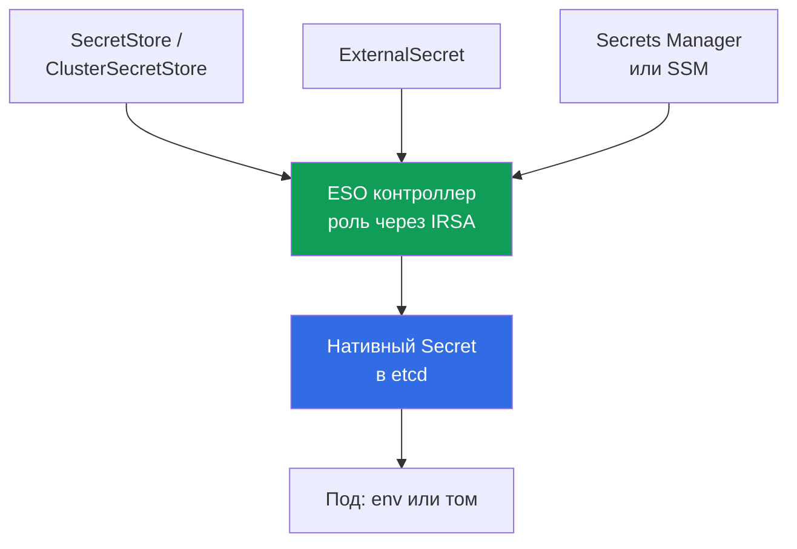
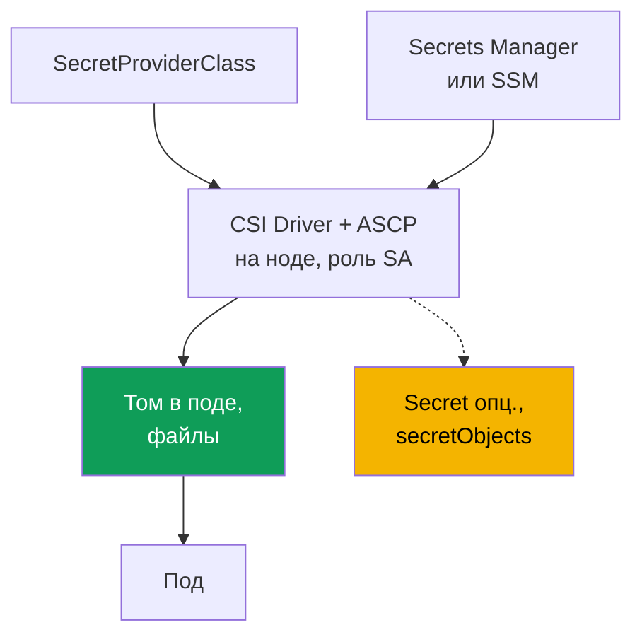

# Глава 18. Секреты: шифрование KMS, Secrets Manager и SSM через External Secrets и CSI

> **Что дальше.** Главы 16 и 17 научили выдавать поду его собственную роль в AWS через IRSA
> или Pod Identity. Секреты опираются на это напрямую: контроллеру External Secrets и драйверу
> CSI нужна роль, чтобы читать из Secrets Manager и SSM, - её дают ровно те механизмы, и здесь
> мы на них ссылаемся, а не пересказываем. Смежное - в других главах: шифрование при создании
> кластера (глава 4), RBAC-доступ к `Secret` (глава 5), supply chain и ECR (глава 20),
> харденинг и Pod Security (глава 19), секреты в git и GitOps (глава 44).

## 18.1. «Secret в Kubernetes - это не шифрование, это base64»

Приложению нужен пароль к базе. Инженер кладёт его в `Secret`, монтирует в под и считает
задачу закрытой: «данные же в секрете». Но `Secret` в Kubernetes не шифрует ничего.

- **base64 - это кодирование, а не шифрование.** Значение в `data` любой, у кого есть доступ к
  манифесту или к объекту, декодирует командой `base64 -d`. Пароль лежит открытым.
- **Доступ решает RBAC, и только он.** `Secret` прочитает любой субъект с `get`/`list` на него
  в этом namespace (глава 5). Второго барьера сверх RBAC у объекта нет.
- **Секрет живёт в etcd.** Значение хранится в базе control plane. Диски etcd EKS шифрует на
  уровне хранилища, но это защита тома, а не объекта: с валидным RBAC он читается как всегда.
- **Секрет утекает через git.** Манифест с `Secret` коммитят в репозиторий - и пароль навсегда
  в истории git. Классическая утечка, и одним `git rm` она не лечится.

Хочется другого: хранить секреты в управляемом хранилище AWS с ротацией и аудитом, доставлять
их в под без записи в манифест, а сам объект в etcd защитить по-настоящему, а не base64.

## 18.2. Два независимых слоя защиты, которые нельзя путать

У задачи «секреты в EKS» два разных слоя: они решают разные проблемы, но их постоянно путают,
хотя один не заменяет другой.

- **Слой 1 - шифрование секретов Kubernetes в etcd через KMS** (envelope encryption). Про то,
  **как** объект `Secret` хранится в control plane: защита данных на уровне хранилища.
- **Слой 2 - вынос секретов во внешние хранилища AWS** (Secrets Manager, SSM Parameter Store)
  и доставка их в под. Про то, **где вообще живёт** секрет и откуда он попадает в приложение.

Слой 1 защищает объект `Secret` там, где он лежит, но не отменяет RBAC-доступ к нему. Слой 2
убирает секрет из манифестов и git, но если создаёт нативный `Secret`, тот снова в etcd - и
слой 1 всё равно нужен.

## 18.3. Слой 1: KMS envelope encryption секретов etcd

Envelope encryption - это шифрование в два ключа. **Data encryption key (DEK)** шифрует
`Secret` перед записью в etcd, а **key encryption key (KEK)** - ваш ключ KMS - шифрует DEK. В
etcd лежит зашифрованный секрет с зашифрованным DEK; открытый DEK не хранится. EKS использует
Kubernetes KMS provider v2, и каждая расшифровка DEK в KMS видна в CloudTrail - отсюда аудит.

На EKS с Kubernetes **1.28 и выше** envelope encryption данных Kubernetes API включена по
умолчанию с ключом AWS (AWS owned key), без действий с вашей стороны. Свой **customer managed
key (CMK)** добавляет то, чего AWS owned key не даёт: контроль над политикой ключа и аудит
расшифровки в CloudTrail. На существующем кластере CMK включают отдельно (глава 4).

```bash
# включить свой CMK на существующем кластере (ресурс secrets)
aws eks associate-encryption-config --cluster-name demo \
  --encryption-config '[{"resources":["secrets"],"provider":{"keyArn":"arn:aws:kms:eu-central-1:111122223333:key/abcd-1234"}}]'

# проверить, что шифрование настроено
aws eks describe-cluster --name demo --query 'cluster.encryptionConfig'
```

Ключ должен быть симметричным и в том же регионе, что и кластер. Важна необратимость: включить
шифрование секретов CMK можно, а **отключить нельзя** (глава 4). Отсюда главный операционный
риск - сам ключ: если CMK отключить или удалить, control plane перестанет расшифровывать
секреты и потеряет к ним доступ. Поэтому CMK под EKS не отключают, а его политику держат под
контролем.

| `Secret` в etcd | AWS owned key (по умолчанию 1.28+) | Свой CMK |
|---|---|---|
| Данные на диске etcd | зашифрованы AWS | зашифрованы AWS |
| Объект `Secret` (envelope encryption) | да, ключом AWS | да, вашим ключом |
| Контроль над ключом и политикой | нет | да |
| Аудит расшифровки в CloudTrail | нет | да |
| RBAC-доступ к `Secret` отменяется? | нет | нет |

Последняя строка - главное: шифрование защищает секрет **в хранилище**, но субъект с RBAC на
чтение получит его как и раньше. Разграничение доступа - по-прежнему RBAC (глава 5), а
envelope encryption закрывает другой вектор: доступ к данным etcd в обход API.

## 18.4. Слой 2: зачем выносить секреты из кластера

Даже со слоем 1 секрет остаётся в кластере: он в манифесте (рискует попасть в git), ротация
ручная, единого места нет. Слой 2 делает источником внешнее хранилище, а в кластер секрет
доставляется.

- **Ротация.** Secrets Manager умеет ротацию по графику; приложение получает новое значение.
- **Аудит и единый источник.** Доступ через IAM и виден в CloudTrail; секрет в одном месте.
- **Нет секрета в манифестах и git.** В кластер уезжают только ссылки на секрет, не значения.
- **Разделение по типу данных.** Secrets Manager - для секретов с ротацией, SSM Parameter
  Store - для конфигурации, часть которой секретами не является.

Два инструмента решают доставку по-разному: **External Secrets Operator** создаёт нативный
`Secret`, а **Secrets Store CSI Driver** монтирует секрет прямо в под как том. Оба берут роль
для доступа к AWS через IRSA или Pod Identity (главы 16 и 17) - это их фундамент, а не деталь.

## 18.5. External Secrets Operator: контроллер создаёт нативный Secret

External Secrets Operator (ESO) - контроллер в кластере. Он читает секрет из Secrets Manager
или SSM и **создаёт из него обычный `Secret` Kubernetes**, а приложение потребляет его как
всегда - через env или том, без поддержки со стороны кода.



Три объекта задают связь. **`SecretStore`** описывает доступ к хранилищу (провайдер `aws`,
сервис `SecretsManager` или `ParameterStore`, регион, аутентификация), он namespace-scoped;
**`ClusterSecretStore`** - то же на весь кластер. **`ExternalSecret`** объявляет, какой секрет
тянуть и в какой `Secret` положить; по нему контроллер создаёт и обновляет целевой `Secret`.

```yaml
apiVersion: external-secrets.io/v1
kind: SecretStore
metadata:
  name: aws-sm
  namespace: payments
spec:
  provider:
    aws:
      service: SecretsManager
      region: eu-central-1
      # аутентификация - роль контроллера через IRSA или Pod Identity (главы 16, 17)
---
apiVersion: external-secrets.io/v1
kind: ExternalSecret
metadata:
  name: db-credentials
  namespace: payments
spec:
  refreshInterval: 1h            # как часто пере-синхронизировать; 0 - создать один раз
  secretStoreRef:
    name: aws-sm
    kind: SecretStore
  target:
    name: db-credentials         # имя Secret, который создаст ESO
  data:
    - secretKey: password        # ключ в Secret
      remoteRef:
        key: prod/payments/db    # имя секрета в Secrets Manager
        property: password       # поле внутри JSON-секрета
```

`refreshInterval` задаёт период пере-синхронизации; при `0` ESO создаёт `Secret` один раз.
Плюс ESO: результат - нативный `Secret`, совместимый с любым потребителем (env, том, чужой
чарт). Минус важный: секрет **материализуется в etcd**, поэтому слой 1 (раздел 18.3) для ESO
обязателен. Роль контроллеру для чтения из AWS дают IRSA или Pod Identity (главы 16, 17).

```bash
kubectl -n payments get externalsecret db-credentials   # STATUS SecretSynced?
kubectl -n payments get secret db-credentials            # нативный Secret появился
```

## 18.6. Secrets Store CSI Driver: секрет монтируется в под

Secrets Store CSI Driver с AWS-провайдером (ASCP) идёт другим путём: секрет **монтируется как
том прямо в под** в виде файлов, минуя объект `Secret`. По умолчанию драйвер `Secret` не
создаёт, а кладёт секрет в том на ноде. Что монтировать, задаёт `SecretProviderClass`.



```yaml
apiVersion: secrets-store.csi.x-k8s.io/v1
kind: SecretProviderClass
metadata:
  name: db-credentials
  namespace: payments
spec:
  provider: aws
  parameters:
    objects: |
      - objectName: "prod/payments/db"   # имя секрета в Secrets Manager (или ARN)
        objectType: "secretsmanager"     # secretsmanager или ssmparameter
```

Под ссылается на класс через CSI-том с `secretProviderClass`. Ключевое свойство: без
синхронизации секрет появляется **только в томе на ноде и в etcd не попадает вовсе** - это
главное отличие от ESO. Опционально драйвер создаёт нативный `Secret` через блок
`secretObjects`, но синхронизация идёт, только пока под монтирует том, и `Secret` удаляется с
последним потребителем. Ротацию значений даёт rotation reconciler (включается флагом,
обновляет том).

```bash
kubectl -n payments get secretproviderclass db-credentials    # класс на месте
kubectl -n payments exec deploy/app -- ls /mnt/secrets-store   # файлы секрета в томе
```

Роль для доступа драйвера к AWS - снова IRSA или Pod Identity (главы 16 и 17): её привязывают
к `ServiceAccount`, под которым работает под, монтирующий секрет.

## 18.7. ESO против CSI Driver

Инструменты решают одну задачу «секрет из AWS в под», но по-разному, и выбор диктует главный
вопрос: где окажется секрет и кто его потребляет.

| Свойство | External Secrets Operator | Secrets Store CSI Driver |
|---|---|---|
| Где живёт секрет | нативный `Secret` в etcd | файлы в томе на ноде |
| Попадает ли в etcd | да, всегда | нет (если не включён `secretObjects`) |
| Как потребляет приложение | env или том из `Secret` | читает файлы из тома |
| Совместимость с env | полная (это обычный `Secret`) | только через синхронизацию в `Secret` |
| Ротация | по `refreshInterval` | rotation reconciler обновляет том |
| Нужен ли слой 1 (KMS) | да, секрет в etcd | не для тома; да при sync |
| Роль для доступа к AWS | IRSA / Pod Identity | IRSA / Pod Identity |

Коротко: ESO проще для приложений, которым нужен `Secret` (env, готовые чарты), ценой того,
что он всегда в etcd. CSI без sync даёт минимальный след, но приложение должно читать файлы из
тома.

## 18.8. KMS и внешние хранилища вместе

Слои не альтернативны, они складываются; правило зависит от того, попадает ли секрет в etcd:

- **ESO** пишет нативный `Secret`, секрет попадает в etcd - слой 1 нужен всегда, иначе внешнее
  хранилище защищено, а его копия в etcd - нет.
- **CSI без синхронизации** монтирует секрет только в том на ноде, в etcd он не попадает -
  слой 1 для него не задействован. С `secretObjects` появляется `Secret`, и слой 1 снова
  нужен.

Вынос секрета наружу не отменяет шифрования того, что осело в кластере: слой 1 держат всегда
(на 1.28+ он и так по умолчанию), а выбор ESO против CSI решает лишь размер следа в кластере.

## 18.9. Диагностика: секрет не появился или не обновился

Отказы предсказуемы: почти всё сводится к роли контроллера или драйвера, объектам конфигурации
и правам на KMS-ключ самого секрета в AWS.

| Симптом | Вероятная причина | Что проверить |
|---|---|---|
| `ExternalSecret` не в `SecretSynced` | роль контроллера не читает секрет | IRSA/Pod Identity контроллера ESO |
| Нативный `Secret` не создан | ошибка в `SecretStore` или `remoteRef` | `kubectl describe externalsecret` |
| Том пуст, под не стартует | `SecretProviderClass` или роль SA пода | класс, аннотация/ассоциация SA |
| `AccessDenied` на чтении секрета | нет прав в IAM-политике роли | `secretsmanager:GetSecretValue` |
| `AccessDenied` при расшифровке | нет прав на KMS-ключ секрета | `kms:Decrypt` на ключе секрета |
| Значение устарело | ротация или refresh не настроены | `refreshInterval` (ESO), reconciler (CSI) |

Порядок разбора - от роли к объектам и наружу к AWS:

```bash
# 1. статус синхронизации и события ESO
kubectl -n payments describe externalsecret db-credentials

# 2. логи контроллера ESO (роль, доступ к хранилищу, ошибки провайдера)
kubectl -n external-secrets logs deploy/external-secrets

# 3. для CSI - логи драйвера на ноде пода
kubectl -n kube-system logs ds/csi-secrets-store-secrets-store-csi-driver -c secrets-store
```

Частая грабля: секрет в Secrets Manager сам зашифрован ключом KMS, и роли контроллера или
драйвера нужен `kms:Decrypt` на **этом** ключе - не путать с CMK кластера из слоя 1. Если
`GetSecretValue` проходит, а секрет не читается, причина обычно в правах на его ключ.

## 18.10. Как это применяют в продакшене

- **Секреты не коммитят.** В git уезжают `ExternalSecret`, `SecretStore` и
  `SecretProviderClass` - ссылки на секрет, но не значения. Утечка через историю git
  закрывается на корню (глава 44).
- **Слой 1 включён всегда.** На 1.28+ envelope encryption работает по умолчанию; для прода
  берут свой CMK ради контроля и аудита в CloudTrail, а политику ключа держат под охраной.
- **Минимальный RBAC на `Secret`.** Envelope encryption не заменяет RBAC: доступ на чтение
  выдают точечно, иначе слой 1 защищает от всего, кроме валидного субъекта (глава 5).
- **Ротация в источнике.** Секреты с ротацией держат в Secrets Manager, а `refreshInterval`
  ESO или rotation reconciler CSI настраивают так, чтобы под получал свежее значение.
- **Разные хранилища под разные данные.** Secrets Manager - для секретов с ротацией, SSM
  Parameter Store - для конфигурации; это разделяет и права, и стоимость обращений.
- **Роль - через IRSA или Pod Identity.** Контроллеру и драйверу дают отдельную роль с правами
  `GetSecretValue` и `kms:Decrypt` на нужные ключи, а не общую (главы 16, 17).

## 18.11. Мини-глоссарий

- **Envelope encryption** - шифрование в два ключа: DEK шифрует данные, KEK (ключ KMS) шифрует
  DEK. EKS применяет его к секретам etcd через Kubernetes KMS provider v2.
- **CMK (customer managed key)** - ваш ключ KMS: даёт контроль над политикой ключа и аудит
  расшифровки в CloudTrail, в отличие от AWS owned key по умолчанию.
- **External Secrets Operator (ESO)** - контроллер, читающий секрет из AWS и создающий из него
  нативный `Secret`; объекты `SecretStore`/`ClusterSecretStore` и `ExternalSecret`.
- **Secrets Store CSI Driver + AWS provider (ASCP)** - драйвер, монтирующий секрет из AWS как
  файлы в томе на ноде; объект `SecretProviderClass`, опциональный sync в `Secret`.

## 18.12. Итоги главы

- `Secret` в Kubernetes - это base64, а не шифрование: доступ решает RBAC, значение лежит в
  etcd и легко утекает через git. Отсюда две разные задачи, которые нельзя смешивать.
- Слой 1 - KMS envelope encryption секретов etcd: DEK шифрует `Secret`, KEK (ключ KMS) шифрует
  DEK. На 1.28+ включена по умолчанию с AWS owned key; свой CMK даёт контроль и аудит.
- Слой 1 защищает секрет в хранилище, но **не отменяет RBAC** на его чтение. Включение
  необратимо, а отключение или удаление CMK лишает control plane доступа к секретам.
- Слой 2 выносит секрет во внешнее хранилище (Secrets Manager, SSM) ради ротации, аудита,
  единого источника и отсутствия секрета в манифестах. Два инструмента: ESO и CSI Driver.
- ESO создаёт нативный `Secret` (совместим с любым потребителем, но секрет в etcd - слой 1
  обязателен). CSI монтирует секрет в том и по умолчанию `Secret` не создаёт - в etcd его нет.
- Оба берут роль к AWS через IRSA или Pod Identity (главы 16, 17). Диагностика идёт от роли к
  объектам и к правам на KMS-ключ самого секрета (`kms:Decrypt`) в AWS.

## 18.13. Как это пригодится в реальной работе

Вопрос «где живёт секрет и кто его прочитает» с внешним хранилищем отвечается одной записью в
Secrets Manager и IAM-политикой роли, а не поиском по манифестам всех namespace. Инцидент
«секрет в git» перестаёт случаться: в репозитории только ссылки. На дежурстве «под не
поднялся, том пуст» или «`ExternalSecret` не синхронизируется» закрывается цепочкой из раздела
18.9 - роль, объект конфигурации, права на секрет и его KMS-ключ. А знание, что ESO кладёт
секрет в etcd, а CSI без sync - нет, помогает выбрать инструмент под нужный след.

## 18.14. Вопросы для самопроверки

1. Почему `Secret` в Kubernetes нельзя считать шифрованием и что ограничивает доступ к нему?
2. Чем шифрование дисков etcd в AWS отличается от envelope encryption объекта `Secret`?
3. Как устроена envelope encryption через KMS: что делает DEK, а что KEK?
4. С какой версии EKS envelope encryption включена по умолчанию и каким ключом?
5. Что даёт свой CMK по сравнению с AWS owned key и какой у него операционный риск?
6. Отменяет ли слой 1 (KMS) необходимость в RBAC на чтение `Secret`? Почему?
7. Зачем выносить секреты во внешние хранилища, если etcd уже шифруется?
8. Чем `SecretStore` отличается от `ClusterSecretStore` и что описывает `ExternalSecret`?
9. Почему при использовании ESO слой 1 остаётся обязательным?
10. Куда CSI Driver кладёт секрет по умолчанию и когда он всё же создаёт нативный `Secret`?
11. `GetSecretValue` проходит, а секрет не читается. Какое право проверить и на каком ключе?

## Практика

Своей лабы у главы пока нет, но всё проверяется на живом кластере. Слой 1: `aws eks
describe-cluster --name <cluster> --query 'cluster.encryptionConfig'` покажет, включено ли
шифрование и каким ключом. На 1.28+ оно работает и без CMK; свой ключ добавляют командой `aws
eks associate-encryption-config` из раздела 18.3, помня о необратимости.

Дальше слой 2. Поднимите External Secrets Operator, дайте его контроллеру роль через IRSA или
Pod Identity (главы 16, 17) с правами `secretsmanager:GetSecretValue` и `kms:Decrypt` на ключ
секрета, создайте `SecretStore` и `ExternalSecret` и проверьте `kubectl get externalsecret`
(статус `SecretSynced`) и появившийся `kubectl get secret`. Повторите то же через Secrets
Store CSI Driver: `SecretProviderClass`, под с CSI-томом, и убедитесь, что файлы лежат в томе,
а нативного `Secret` нет. Потренируйте отказ: уберите у роли `kms:Decrypt` на ключ секрета и
найдите `AccessDenied` в логах контроллера или драйвера.

---
[Оглавление](../README_RU.md) · [Глава 17](../17/ru.md) · [Глава 19](../19/ru.md)
